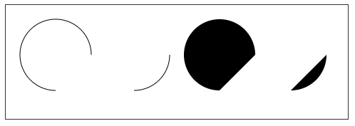

# canvas基础

## **什么是canvas**

`<canvas>`是一个可以使用脚本(通常为JavaScript)在其中绘制图形的 HTML 元素。

`<canvas>`元素不被一些老的浏览器所支持，但是所有的主流浏览器的近期版本都支持。

Internet Explorer 9+, Firefox, Opera, Chrome, 和 Safari 支持 `<canvas>` 元素. 注意: Internet Explorer 8 及更早 IE 版本的浏览器不支持 `<canvas>` 元素.

**模板骨架**

```html
<canvas id="mycanvas" width="200" height="300">您的浏览器不支持canvas</canvas>
<script>
    var cc=document.getElementById("mycanvas");    
    var cxt=cc.getContext("2d");
</script>
```

`<canvas>` 标签只有两个属性—— width和height，这两个属性是可选的。当我们没有定义时，Canvas 的默认大小为300像素×150像素（宽×高，像素的单位是px）。但是，我们也可以使用HTML的高度和宽度属性来自定义尺寸。

你可以像给其他DOM元素一样给canvas添加样式；当开始时没有为canvas规定样式规则，其将会完全透明。

注意：由于某些较老的浏览器（尤其是IE9之前的IE浏览器）或者文本浏览器不支持HTML元素"canvas"，在这些浏览器上你应该总是能展示替代内容，如以上代码中的"您的浏览器不支持canvas"，或者你可以加一个img。 当然，对于那些支持`<canvas>`的浏览器，它将会忽略在容器中包含的内容，并且只是正常渲染canvas。

当然，你也可以用代码去检测canvas的支持性

```js
var canvas = document.getElementById('tutorial');

if (canvas.getContext){
  var ctx = canvas.getContext('2d');
  // 支持
} else {
  //不支持
}
```

## **使用 JavaScript 来绘制图像**

在真正学习绘制图像之前，我们有必要了解一下Canvas坐标。

**Canvas坐标**

canvas是一个二维网格，以左上角坐标为(0,0)

了解了canvas坐标后，我们开始绘制图像，可以分三步：

1. 找到canvas元素
2. 创建context对象

`<canvas>` 元素有一个做 **getContext()** 的方法，这个方法是用来获得渲染**上下文和它的绘画功能**。getContext()只有一个参数，上下文的格式。这里，我们采用 **CanvasRenderingContext2D**。

3. 绘制你所需的图像

## 绘制矩形

HTML中的元素canvas只支持一种原生的图形绘制：矩形。所有其他的图形的绘制都至少需要生成一条路径。

canvas提供了三种方法绘制矩形：

绘制一个**填充**的**矩形**

```js
fillRect( x ,y ,width, height)
```

绘制一个**矩形**的**边框**

```js
strokeRect( x ,y ,width, height)
```

**清除**指定**矩形区域**，让清除部分完全透明

```js
clearRect( x ,y ,width, height)
```

**参数**

x与y指定了在canvas画布上所绘制的矩形的左上角（相对于原点）的坐标。

width和height设置矩形的尺寸。

例子：

```html
<script>
		var cc=document.getElementById("mycanvas");
		if(cc.getContext){
			var cxt=cc.getContext("2d");
			cxt.strokeRect(20,20,100,100);
			cxt.fillRect(40,40,50,50);
			cxt.clearRect(50,50,30,30);
		}
</script>
```


## **绘制路径**

图形的基本元素是路径。路径是通过不同颜色和宽度的线段或曲线相连形成的不同形状的点的集合。一个路径，甚至一个子路径，都是闭合的。使用路径绘制图形需要一些额外的步骤。

1. 需要创建路径起始点。
2. 使用画图命令去画出路径。
3. 把路径封闭。
4. 一旦路径生成，就能通过描边或填充路径区域来渲染图形。

以下是所要用到的函数：

- **新建一条路径**，生成之后，图形绘制命令被指向到路径上生成路径。

```js
beginPath()
```

- **闭合路径**之后图形绘制命令又**重新指向**到**上下文中**。

```js
closePath()
```

这个方法会通过绘制一条从当前点到开始点的直线来闭合图形。如果图形是已经闭合了的，即当前点为开始点，该函数什么也不做。

- 通过线条来绘制**图形轮廓**。

```js
stroke()
```

- 通过填充路径的内容区域生成**实心**的图形。

```js
fill()
```

注意：当你调用fill()函数时，所有没有闭合的形状都会自动闭合，所以你不需要调用closePath()函数。但是调用stroke()时不会自动闭合。

移动笔触

将笔触移动到指定的坐标x以及y上

```js
moveTo(x,y) 
```

绘制一条从当前位置到指定x以及y位置的直线

```js
lineTo(x,y) 
```

例子：

```js
cxt.beginPath();
cxt.moveTo(150,150);
cxt.lineTo(150,250);
cxt.lineTo(300,250);
cxt.stroke();
cxt.closePath();
```


```js
cxt.beginPath();
cxt.moveTo(400,400);
cxt.lineTo(400,500);
cxt.lineTo(500,500);
cxt.fill();
cxt.closePath();
```


## **弧线**

绘制圆弧或者圆，我们使用arc()方法

```js
arc(x, y, radius, startAngle, endAngle, anticlockwise)
```

画一个以（x,y）为圆心的以radius为半径的圆弧（圆），从startAngle开始到endAngle结束，参数anticlockwise 为一个布尔值。为true时，是逆时针方向，否则顺时针方向。

注意：arc()函数中的角度单位是弧度，不是度数。角度与弧度的js表达式:radians=(Math.PI/180)*degrees。

例子：

```js
cxt.beginPath();
cxt.arc(70,70,50,0,Math.PI/2,true);
cxt.stroke();

cxt.beginPath();
cxt.arc(180,70,50,0,Math.PI/2,false);
cxt.stroke();

cxt.beginPath();
cxt.arc(300,70,50,0,Math.PI/2,true);
cxt.fill();

cxt.beginPath();
cxt.arc(400,70,50,0,Math.PI/2,false);
cxt.fill();
```




## **贝塞尔（bezier）以及二次贝塞尔**

路径类型就是 贝塞尔曲线。二次以及三次贝塞尔曲线都十分有用，一般用来绘制复杂有规律的图形。

- 绘制二次贝塞尔曲线，x,y为结束点，cp1x,cp1y为控制点。

```js
quadraticCurveTo(cp1x, cp1y, x, y)
```

- 绘制三次贝塞尔曲线，x,y为结束点，cp1x,cp1y为控制点一，cp2x,cp2y为控制点二。

```js
bezierCurveTo(cp1x, cp1y, cp2x, cp2y, x, y)
```

## **矩形**

```js
rect(x, y, width, height)
```

绘制一个左上角坐标为（x,y），宽高为width以及height的矩形。

## **Path2D 对象**

正如我们在前面例子中看到的，你可以使用一系列的路径和绘画命令来把对象“画”在画布上。为了简化代码和提高性能，Path2D对象已可以在较新版本的浏览器中使用，用来缓存或记录绘画命令，这样你将能快速地回顾路径。

Path2D() Path2D()会返回一个新初始化的Path2D对象（可能将某一个路径作为变量——创建一个它的副本，或者将一个包含SVG path数据的字符串作为变量）。

```js
new Path2D();     // 空的Path对象
new Path2D(path); // 克隆Path对象
new Path2D(d);    // 从SVG建立Path对象
```

例子：

```js
var path=new Path2D();
path.rect(120,120,50,50);
cxt.stroke(path);
```


Path2D.addPath(path [, transform])添加了一条路径到当前路径（可能添加了一个变换矩阵）

使用 SVG paths

新的Path2D API有另一个强大的特点，就是使用SVG path data来初始化canvas上的路径。这将使你获取路径时可以以SVG或canvas的方式来重用它们。

```js
var p = new Path2D("M10 10 h 80 v 80 h -80 Z");
```

这条路径将先移动到点 (M10 10) 然后再水平移动80个单位 (h 80)，然后下移80个单位 (v 80)，接着左移80个单位 (h -80)，再回到起点处 (z)。


## **色彩样式**

canvas提供了两个色彩属性

### 设置图形的填充颜色。

```js
fillStyle = color
```

### 设置图形轮廓的颜色。

```js
strokeStyle = color
```

color 可以是表示 CSS 颜色值的字符串，渐变对象或者图案对象。后面我们会详细渐变和图案对象。默认情况下，线条和填充颜色都是黑色（CSS 颜色值 #000000）。

注意: 一旦您设置了 strokeStyle 或者 fillStyle 的值，那么这个新值就会成为新绘制的图形的默认值。如果你要给每个图形上不同的颜色，你需要重新设置 fillStyle 或 strokeStyle 的值。

```js
for (var i=1;i<6;i++){
    for (var j=1;j<6;j++){
      cxt.fillStyle = 'rgb(' + Math.floor(255-42.5*i) + ',' +  Math.floor(255-42.5*j) + ',0)';
      cxt.fillRect(j*25,i*25,25,25);
    }
  }
```


## **线型的样式**

### 设置线条宽度。

lineWidth = value

```js
cxt.strokeStyle="#e78170";
for (var i = 0; i < 10; i++){
   cxt.lineWidth = 1+i;
   cxt.beginPath();
   cxt.moveTo(25+i*14,25);
   cxt.lineTo(25+i*14,140);
   cxt.stroke();
 }
```

### 设置线条末端样式。

#### lineCap = type

有三个值：

butt 线段末端以方形结束。 round 线段末端以圆形结束。 square 线段末端以方形结束，但是增加了一个宽度和线段相同，高度是线段厚度一半的矩形区域。

- 设定线条与线条间接合处的样式。

#### lineJoin = type

此属性有3个值： round, bevel and miter。默认值是 miter。注意：如果2个相连部分在同一方向，那么lineJoin不会产生任何效果，因为在那种情况下不会出现连接区域。 round 通过填充一个额外的，圆心在相连部分末端的扇形，绘制拐角的形状。 圆角的半径是线段的宽度。 bevel 在相连部分的末端填充一个额外的以三角形为底的区域， 每个部分都有各自独立的矩形拐角。 miter 通过延伸相连部分的外边缘，使其相交于一点，形成一个额外的菱形区域。这个设置可以通过 miterLimit 属性看到效果

- 限制当两条线相交时交接处最大长度；所谓交接处长度（斜接长度）是指线条交接处内角顶点到外角顶点的长度。

#### miterLimit = value

- 返回一个包含当前虚线样式，长度为非负偶数的数组。

#### getLineDash()

- 设置当前虚线样式。

#### setLineDash(segments)

- 设置虚线样式的起始偏移量。

#### lineDashOffset = value

## **渐变Gradients**

我们还可以用线性或者径向的渐变来填充或描边

### 线性渐变

**createLinearGradient(x1, y1, x2, y2)**

createLinearGradient 方法接受 4 个参数，表示渐变的起点 (x1,y1) 与终点 (x2,y2)。

### 径向渐变

**createRadialGradient(x1, y1, r1, x2, y2, r2)**

createRadialGradient 方法接受 6 个参数，前三个定义一个以 (x1,y1) 为原点，半径为 r1 的圆，后三个参数则定义另一个以 (x2,y2) 为原点，半径为 r2 的圆。

创建出 canvasGradient 对象后，我们就可以用 addColorStop 方法给它上色了。

**gradient.addColorStop(position, color)**

addColorStop 方法接受 2 个参数，position 参数必须是一个 0.0 与 1.0 之间的数值，表示渐变中颜色所在的相对位置。例如，0.5 表示颜色会出现在正中间。color 参数必须是一个有效的 CSS 颜色值（如 #FFF， rgba(0,0,0,1)，等等）。

```js
var linearGradient=cxt.createLinearGradient(50,50,250,250);
  linearGradient.addColorStop(0,'yellow');
  linearGradient.addColorStop(.5,'red');
  linearGradient.addColorStop(1,'green');
  cxt.fillStyle=linearGradient;
  cxt.fillRect(50,50,200,200);
```


从上图看，（50,50）是渐变的起点，（250，250）是渐变的终点，而连接这两点的白线，就是渐变的方向。

### **同心渐变**

```js
var rr=cxt.createRadialGradient(100,100,40,100,100,100);
  rr.addColorStop(0,'red');
  rr.addColorStop(.5,'yellow');
  rr.addColorStop(1,'blue');
  cxt.fillStyle=rr;
  cxt.fillRect(20,20,160,160);
  cxt.fill();
```


不同心但外圆包含内圆

```js
var rr2=cxt.createRadialGradient(250,250,20,260,260,50);
  rr2.addColorStop(0,'red');
  rr2.addColorStop(.5,'yellow');
  rr2.addColorStop(1,'blue');
  cxt.fillStyle=rr2;
  cxt.fillRect(50,50,400,400);
  cxt.fill();
```


不同心，外圆内圆分离

```js
var rr3=cxt.createRadialGradient(250,250,30,350,250,50);
  rr3.addColorStop(0,'red');
  rr3.addColorStop(.8,'yellow');
  rr3.addColorStop(1,'blue');
  cxt.fillStyle=rr3;
  cxt.fillRect(100,100,300,300);
```


## **图案样式 Patterns**

**createPattern(image, type)** 该方法接受两个参数。Image 可以是一个 Image 对象的引用，或者另一个 canvas 对象。Type 必须是下面的字符串值之一：repeat，repeat-x，repeat-y 和 no-repeat。

例子：

```js
var img=new Image();
  img.src="diamond.png";
  img.onload=function(){
    var ptrn=cxt.createPattern(img,'repeat');
    cxt.fillStyle=ptrn;
    cxt.fillRect(250,250,80,80);
  }
```


注意：使用 Image 对象的 onload handler 来确保设置图案之前图像已经装载完毕。

## **阴影 Shadows**

shadowOffsetX = float shadowOffsetX 和 shadowOffsetY 用来设定阴影在 X 和 Y 轴的延伸距离，它们是不受变换矩阵所影响的。负值表示阴影会往上或左延伸，正值则表示会往下或右延伸，它们默认都为 0。 shadowOffsetY = float shadowOffsetX 和 shadowOffsetY 用来设定阴影在 X 和 Y 轴的延伸距离，它们是不受变换矩阵所影响的。负值表示阴影会往上或左延伸，正值则表示会往下或右延伸，它们默认都为 0。 shadowBlur = float shadowBlur 用于设定阴影的模糊程度，其数值并不跟像素数量挂钩，也不受变换矩阵的影响，默认为 0。 shadowColor = color shadowColor 是标准的 CSS 颜色值，用于设定阴影颜色效果，默认是全透明的黑色。

例子：

```js
var img=new Image();
img.src="mm.jpg";
img.onload=function(){
  cxt.shadowOffsetX=10;
  cxt.shadowOffsetY=10;
  cxt.shadowBlur=8;
  cxt.shadowColor="#333";
  cxt.drawImage(img,10,10);
}
```


## **Canvas 填充规则**

当我们用到 fill（或者 clip和isPointinPath ）你可以选择一个填充规则，该填充规则根据某处在路径的外面或者里面来决定该处是否被填充，这对于自己与自己路径相交或者路径被嵌套的时候是有用的。

两个可能的值： "nonzero": 默认值. "evenodd":

```js
cxt.beginPath();
  cxt.arc(100,100,50,0,Math.PI*2,true);
  cxt.arc(100,100,20,0,Math.PI*2,true);
  cxt.fill("evenodd");
```


## 绘制文本

canvas 提供了两种方法来渲染文本:

```js
fillText(text, x, y [, maxWidth])
```

在指定的(x,y)位置填充指定的文本，绘制的最大宽度是可选的.

```js
strokeText(text, x, y [, maxWidth])
```

在指定的(x,y)位置绘制文本边框，绘制的最大宽度是可选的.

当然，我们也可以改变文本的样式：

font = value 当前我们用来绘制文本的样式. 这个字符串使用和 CSS font 属性相同的语法. 默认的字体是 10px sans-serif。 textAlign = value 文本对齐选项. 可选的值包括：start, end, left, right or center. 默认值是 start。 textBaseline = value 基线对齐选项. 可选的值包括：top, hanging, middle, alphabetic, ideographic, bottom。默认值是 alphabetic。 direction = value 文本方向。可能的值包括：ltr, rtl, inherit。默认值是 inherit。

## **文本测量**

canvas提供了一个方法：

```js
measureText()
```

将返回一个 TextMetrics对象的宽度、所在像素，这些体现文本特性的属性。


**备注**

本文转自 https://www.w3cschool.cn/kqjhm/kqjhm-7z8a25wt.html
