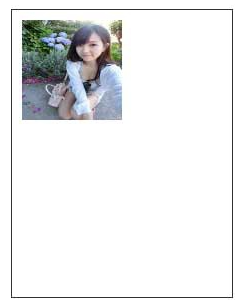
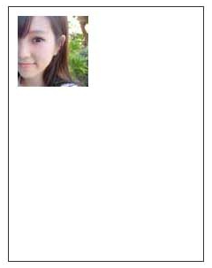
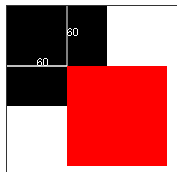
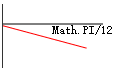
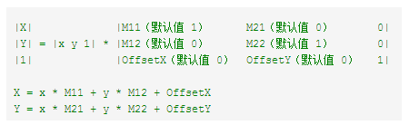
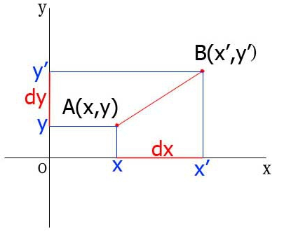
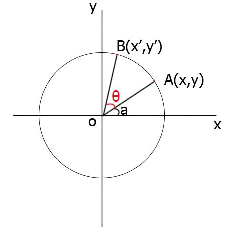
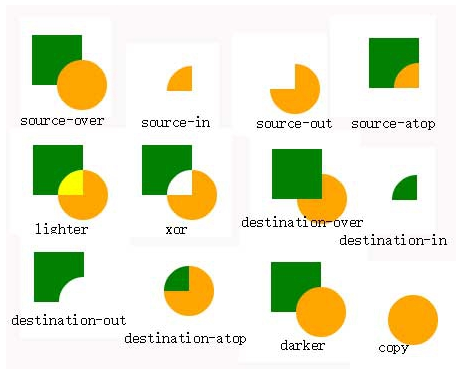

# canvas基础2

## 图像绘制

要绘制图像，我们首先要获得图像：

第一种：**直接获取**

```jsx | pure

<script>var img=document.getElementById("myimg");</script>
```

第二种：**动态创建**

```jsx | pure
<script>
	var img=new Image();
	img.src="xx.jpg";    
	img.onload = function(){
     // 等待图片加载完毕后再执行绘制
    }
</script>
```

获得了源图对象，我们就可以使用 **drawImage** 方法将它渲染到 canvas 里。

drawImage 方法有三种形态：

### **基础**

```js
drawImage(image, x, y)
```

image 是 image 或者 canvas 对象，x 和 y 是其在目标 canvas 里的起始坐标。

例子：

```js
var img=new Image();
img.src="canvas_girl.jpg";
img.onload=function(){
	cxt.drawImage(img,10,10);
}
```


### 缩放

```js
drawImage(image, x, y, width, height)
```

前面三个参数和第一个方法的含义相同，不过，这个方法多了2个参数：width 和 height，这两个参数用来控制 当像canvas画入时应该缩放的大小。

例子：

```js
var img=new Image();
img.src="canvas_girl.jpg";
img.onload=function(){
	cxt.drawImage(img,10,10,100,100);
}
```



### **切片**

```js
drawImage(image, sx, sy, sWidth, sHeight, dx, dy, dWidth, dHeight)
```

第一个参数和其它的是相同的，都是一个图像或者另一个 canvas 的引用。其它8个参数中，前4个是定义图像源的切片位置和大小，后4个则是定义切片的目标显示位置和大小。

例子：

```js
var img=new Image();
img.src="canvas_girl.jpg";
img.onload=function(){
	cxt.drawImage(img,120,40,80,80,10,10,80,80);
}
```



## 变形

在了解变形之前，我先介绍一下两个在你开始绘制复杂图形就必不可少的方法。

```js
save()
restore()
```

save 和 restore 方法是用来保存和恢复 canvas 状态的，都没有参数。Canvas 的状态就是当前画面应用的所有样式和变形的一个快照。

Canvas 状态是以堆(stack)的方式保存的，每一次调用 save 方法，当前的状态就会被推入堆中保存起来。这种状态包括：

1.当前应用的变形（即移动，旋转和缩放）。 

2.strokeStyle, fillStyle, globalAlpha, lineWidth, lineCap, lineJoin, miterLimit, shadowOffsetX, shadowOffsetY, shadowBlur, shadowColor, globalCompositeOperation 的值。

3.当前的裁切路径（clipping path） 你可以调用任意多次 save 方法。 每一次调用 restore 方法，上一个保存的状态就从堆中弹出，所有设定都恢复。

例子：

```js
cxt.fillStyle="red";
cxt.fillRect(10,10,50,50);
cxt.save();
cxt.fillStyle="blue";
cxt.fillRect(20,20,30,30);
cxt.restore();
cxt.fillRect(30,30,10,10);
```


我们第一步先设置了填充色为红色，画了一个大正方形，然后保存状态；第二步将填充色设置为蓝色，画了一个小一点正方形；跟着调用restore()恢复状态，也就是恢复填充色为红色的状态，再画了一个更小的正方形。

到目前为止所做的动作和前面章节的都很类似。不过一旦我们调用 restore，状态堆中最后的状态会弹出，并恢复所有设置。如果不是之前用 save 保存了状态，那么我们就需要手动改变设置来回到前一个状态，这个对于两三个属性的时候还是适用的，一旦多了，我们的代码将会猛涨。

在Canvas中，变形包括**移动、旋转、缩放、变形**，跟CSS3中的2D转换类似。

> 注意：原有内容不会受变形的影响，变形只是坐标变换，新绘制的图形就是在变换后的坐标轴里绘制的。

下面我们来逐一的认识。

### **移动（translate）**

canvas的移动是指移动 canvas 和它的原点到一个不同的位置。

```js
translate(x, y)
```

translate 方法接受两个参数。x 是左右偏移量，y 是上下偏移量，如右图所示。

例子：

```js
cxt.fillRect(0,0,100,100);
cxt.save();
cxt.translate(60,60);
cxt.fillStyle="red";
cxt.fillRect(0,0,100,100);
cxt.restore();
```



### **旋转（rotate）**

用于以原点为中心旋转 canvas。

```js
rotate(angle)
```

这个方法只接受一个参数：旋转的角度(angle)，它是顺时针方向的，以弧度为单位的值。

```js
cxt.beginPath();
cxt.moveTo(0,50);
cxt.lineTo(100,50);
cxt.stroke();
cxt.save();
cxt.rotate(Math.PI/12);
cxt.strokeStyle="red";
cxt.beginPath();
cxt.moveTo(0,50);
cxt.lineTo(100,50);
cxt.stroke();
cxt.restore();
```



### **缩放（scale）**

```js
scale(x, y)
```

scale 方法接受两个参数。x,y 分别是横轴和纵轴的缩放因子，它们都必须是正值。值比 1.0 小表示缩小，比 1.0 大则表示放大，值为 1.0 时什么效果都没有。

例子：

```js
cxt.fillRect(20,20,50,50);
cxt.save();
cxt.scale(.5,.5);
cxt.fillStyle="red";
cxt.fillRect(20,20,50,50);
```


### **变形**（transform）

区别： transform()方法的行为相对于由 rotate(),scale(), translate(), or transform() 完成的其他变换。

例如：如果我们已经将绘图设置为放到两倍，则 transform() 方法会把绘图放大两倍，那么我们的绘图最终将放大四倍。这一点和之前的变换是一样的。 

但是setTransform()不会相对于其他变换来发生行为。它的参数也是六个，context.setTransform(a,b,c,d,e,f)，与transform()一样。

```js
transform(m11, m12, m21, m22, dx, dy)
```

**参数**

m11 水平缩放绘图。 默认值1

m12 水平倾斜绘图。 默认值0

m21 垂直倾斜绘图。 默认值0

m22 垂直缩放绘图。 默认值1

dx 水平移动绘图。 默认值0

dy 垂直移动绘图。 默认值0

这个方法必须将当前的变形矩阵乘上下面的矩阵：

```js
m11 m21 dx
m12 m22 dy
0 	0 	1
```

注意：该变换只会影响 transform() 方法调用之后的绘图。

```js
setTransform(m11, m12, m21, m22, dx, dy)
```

参数： m11 水平缩放绘图。 默认值1 m12 水平倾斜绘图。 默认值0 m21 垂直倾斜绘图。 默认值0 m22 垂直缩放绘图。 默认值1 dx 水平移动绘图。 默认值0 dy 垂直移动绘图。 默认值0

**矩阵**



### **transform和translate、scale、rotate**

**translate**

cxt.translate(dx,dy)



cxt.transform (1,0,0,1,dx,dy) **代替** cxt.translate(dx,dy)。 

也可以使用 cxt.transform(0,1,1,0.dx,dy)代替。

**scale**

cxt.scale(m11, m22)：

也即是说可以使用 cxt.transform(m11,0,0,m22,0,0) **代替** cxt.scale(m11,m22)。

也可以使用 cxt.transform (0,m22,m11,0, 0,0);

**rotate**

rotate(θ)



也即是说可以用 cxt.transform(Math.cos(θ*Math.PI/180)，Math.sin(θ*Math.PI/180), -Math.sin(θ*Math.PI/180),Math.cos(θ*Math.PI/180)，0，0）可以**替代** context.rotate(θ)。 

也可以使用 cxt.transform(-Math.sin(θ*Math.PI/180),Math.cos(θ*Math.PI/180)， Math.cos(θ*Math.PI/180)，Math.sin(θ*Math.PI/180), 0，0）替代。

## 合成与裁剪

在我们绘制图形时，不同的图形会因为绘制的先后而有了层级关系。如果新绘制的图形和原有内容有重叠部分，在默认情况下，新绘制的图形是会覆盖在原有内容之上。

在HTML中，我们会添加z-index来修改层级关系，那么，在canvas里，我们如何修改呢？

### **globalCompositeOperation**

我们可以利用 globalCompositeOperation 属性来改变。

**它共有12个值：**

source-over （默认值） 新图形会覆盖在原有内容之上

source-in 新图形仅仅会出现与原有内容重叠的部分，其他区域都变成透明的。

source-out 只有新图形中与原有内容不重叠的部分会被绘制出来

source-atop 新图形中与原有内容重叠部分会被绘制，并覆盖于原有内容之上。

lighter 两图形中重叠部分作加色处理

xor 重叠部分会变成透明

destination-over 会在原有内容之上绘制新图形

destination-in 原有内容与新图形重叠的部分会被保留，其他部分变成透明的

destination-out 原有内容中与新图形不重叠的部分会被保留

destination-atop 原有内容中与新图形重叠部分会被保留，并会在原有内容之上绘制新图形

darker 两图形重叠部分作减色处理

copy 只有新图形会被保留，其他都被清除掉



### **裁切路径（clip）**

裁切路径和普通的 canvas 图形差不多，不同的是它的作用是遮罩，用来隐藏没有遮罩的部分。

如果和上面介绍的 globalCompositeOperation 属性作一比较，它可以实现与 source-in 和 source-atop 差不多的效果。最重要的区别是裁切路径不会在 canvas 上绘制东西，而且它永远不受新图形的影响。

我们用 **clip** 方法来创建一个新的裁切路径。默认情况下，canvas 有一个与它自身一样大的裁切路径（也就是没有裁切效果）。

**例子**

在这里，用 **clip** 方法创建一个圆形的裁切路径，裁切路径创建之后所有出现在它里面的东西才会画出来。

```js
var img=new Image();
img.src="canvas_girl.jpg";
img.onload=function(){
    cxt.beginPath();
    cxt.arc(120,100,50,0,Math.PI*2,true);
    cxt.clip();
    cxt.drawImage(img,10,10);
}
```


## 保存文件

在canvas中绘出的图片只是canvas标签而已，并非是真正的图片，我们并不能保存，不过我们可以利用canvas.toDataURL()这个方法把canvas绘制的图形生成一幅图片，生成图片后，就能对图片进行相应的操作了。

首先我们定义用一个a标签定义下载的链接，然后再给a设置下载的链接。

```jsx | pure
<a id="download"  download="aa.png">下载</a>
```

```js
var imageURL=canvas.toDataURL("image/jpeg")
//当然，你也可以动态的设置下载的文件名document.getElementById("download")setAttribute("download","abc.png");document.getElementById("download").href=imageURL;
```

当然，我们也可以保存为另外的图片格式：image/png

> 注意：toDataURL() 是canvas的方法

> 注意：a的download属性只有 Firefox 和 Chrome 支持 download 属性。


**备注**

本文转自 https://www.w3cschool.cn/kqjhm/kqjhm-cytp25wx.html
