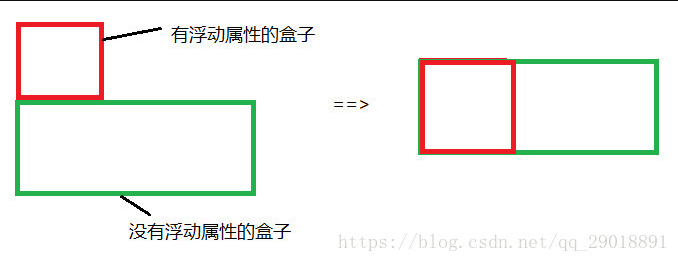
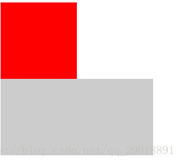
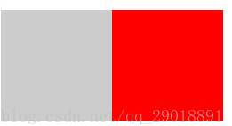

# CSS浮动

## 浮动特性

1，浮动脱离文档流，浮动的盒子会影响下面盒子的布局。

>脱离文档流特点：自己位置不予保留，后面元素会顶上来；父级元素检查不到脱流元素，所以父级无法被其内容“撑开”。

> 第一个盒子浮动，会对第二个盒子影响。
>
> 第二个盒子会到第一个盒子**下面**去。



2，浮动盒子如果用于布局，且对下面盒子不影响，可以嵌套一个父级盒子（不过父级元素需要清除浮动)。

> 为什么清除浮动，如何清除？
> 有的时候为了让子元素（设置浮动的元素）自动调整大小。父元素没有设置高度或宽度，这时父级元素会因为子元素脱离文档流，没有被撑开（无法扩充容器层），会导致外层大小无法根据内容自动调整。所以我们需要清除浮动，使父级元素可以被撑开。
> 至于如何清除，下面我在做详细介绍。

```css
.div{
	width: 100px;
	height: 100px;
	background-color: #ccc;
}
.div1{
	float: left;
	background-color: #f00;
}
.div2{
    width: 200px;
}
```

```html
<div style="overflow: hidden"><!--为父级元素清除浮动-->
    <div class="div1 div"></div>
</div>
<div class="div2 div"></div>
```

执行结果：



3，浮动属性，会把元素默认转化成行内块（inline-block)。

> 行内块元素浮动时不会叠加。

```css
.div3-1{
	width: 100px;
	height: 100px;
	background-color: #ccc;
	float: left;
}
.div3-2{
	width: 100px;
	height: 100px;
	background-color: #f00;
	display: inline-block;
}
```

```html
<div class="div3-1"></div>
<div class="div3-2"></div>
```

执行结果：


## 清除浮动

1，在最后一个浮动div后加上：

```html
<div style="clear: both"></div>
```

> clear 清除该元素兄弟元素的浮动。如：clear: both使之两侧均不出现浮动。

```css
.div4-1,.div4-2{
	width: 100px;
	height: 100px;
	background-color: #f00;
	float: left;
}
.div5{
	width: 100px;
	height: 100px;
	background-color: #ccc;
}
```

```html
<div class="div4">
    <div class="div4-1">浮动</div>
    <div class="div4-2">浮动</div>
    <div style="clear: both"></div>
</div>
<div class="div5"></div>
```

执行结果：


2，给父级元素添加overflow:hidden属性

```css
.div4{
    overflow: hidden;
}
```

```html
<div class="div4">
    <div class="div4-1">浮动</div>
    <div class="div4-2">浮动</div>
</div>
```

>注：`overflow`属性规定当内容溢出元素框时发生的事情。
>属性：
>`visible`默认值。内容不会被修剪，会呈现在元素框之外。
>`hidden`内容会被修剪，并且其余内容是不可见的。
>`scroll`内容会被修剪，但是浏览器会显示滚动条以便查看其余的内容。
>`auto`如果内容被修剪，则浏览器会显示滚动条以便查看其余的内容。
>`inherit`规定应该从父元素继承属性的值。

3，伪元素法，为父级元素添加.clearfix类

>第一个实现方案：

```css
.clearfix:after{
    /*清除浮动*/
    content:"";
    display: block;
    height: 0;
    clear: both;
    visibility: hidden;
}
.clearfix{
    *zoom:1;/*IE6清除浮动方式*/
}
```

第二个实现方案：

```css
.clearfix:before,.clearfix:after{
    content: "";
    display: table;
}
.clearfix:after{
	content: "";
    clear:both;
}
.clearfix{
    *zoom:1;
}
```
