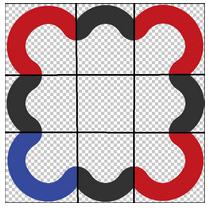
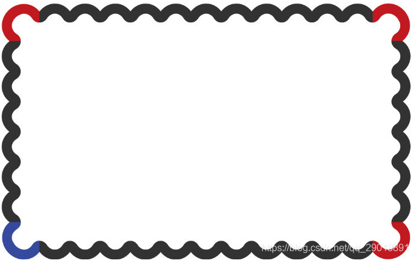
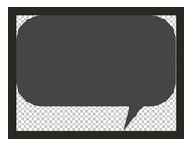
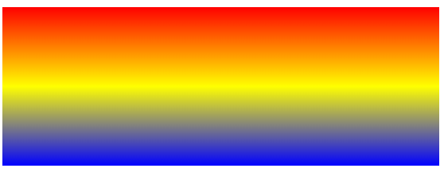
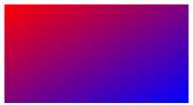
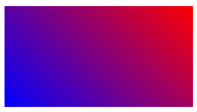

# 边框背景与背景渐变

## CSS3border-image边框图片

普通用法：

```css
border-image: url("img/borderImg.png") 179/10px round;
```

上面参数分别为：图片地址、切割宽度/边框宽度、平铺

**切割宽度**：是平均横切与纵切的宽度，一般为正方形图片的三分之一宽。
**边框宽度**：是在切割完后，切出的方格图片重新为其设置宽度
**平铺**：切割完后，将边角方格保留，其他方格平铺
注：最后一个值除`round`外还有：`stretch`（拉伸）`repeat`（从中间向外平铺）两个值。
具体如下：



切隔横竖四刀，共九个方格，方格的宽为179px

**例子**

```css
#test{
	border: 10px solid #000000;
 	border-image: url("img/borderImg.png") 179/10px round;
}
```

```html
<div id="test"></div>
```

浏览器截图：



**案例2**

实现类似推拉门的按钮



```css
#test2{
	border: 50px solid #000000;
	border-image: url("img/borderImg2.png") 96 165 154 83 fill round;
	/*分别按照96 165 154 83四个值进行切割*/
	/*fill - 内容设置为平铺*/
	color: #fff;
}
```

```html
<div id="test2">
	<p>你好,这是一个按钮</p>
</div>
```

浏览器截图：


## CSS3背景渐变

使用方式

```css
#grad {
  background-image: linear-gradient(red, yellow, blue);
}
```



linear-gradient() 函数用于创建一个表示两种或多种颜色线性渐变的图片。

创建一个线性渐变，需要指定两种颜色，还可以实现不同方向（指定为一个角度）的渐变效果，如果不指定方向，默认从上到下渐变。

**其他参数**

从右下到左上、从蓝色渐变到红色

```css
/* 从右下到左上、从蓝色渐变到红色 */
linear-gradient(to left top, blue, red);
```



渐变轴为45度，从蓝色渐变到红色

```css
/* 渐变轴为45度，从蓝色渐变到红色 */
linear-gradient(45deg, blue, red);
```



从下到上，从蓝色开始渐变、到高度40%位置是绿色渐变开始、最后以红色结束

```css
/* 从下到上，从蓝色开始渐变、到高度40%位置是绿色渐变开始、最后以红色结束 */
linear-gradient(0deg, blue, green 40%, red);
```


