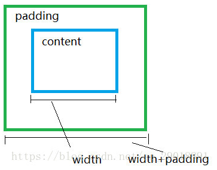
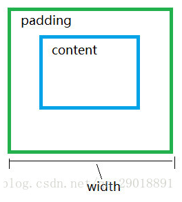
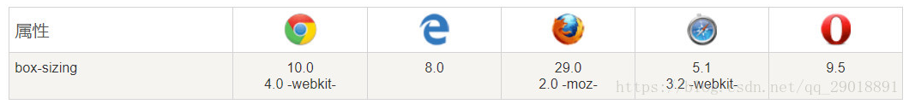
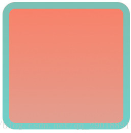

# CSS3内减模式

## css与css3盒子模型对比

css盒子模型盒子内容宽实际等于`width+padding+border`



而css3盒子内容宽就等于`width`



由于以上盒子模型的不同之处，所以衍生出两个模式：内减模式（css3）外加模式（原css）

[内减模式详解](http://blog.sina.com.cn/s/blog_877284510101kt87.html)

## 内减模式兼容性

`box-sizing`现代浏览器都支持，但IE家族只有IE8版本以上才支持，虽然现代浏览器支持`box-sizing`，但有些浏览器还是需要加上自己的前缀，Mozilla需要加上`-moz-`，Webkit内核需要加上`-webkit-`，Presto内核`-o-`，IE8`-ms-`，所以`box-sizing`兼容浏览器时需要加上各自的前缀。



## 内减模式的优势

内减模式，盒子的实际宽度和高度是固定不变的，用户已经设置好的`width`和`height`。 增加`border`和`padding`的值，不会改变盒子的大小，只改变内容区域的大小，这样`padding`就不会影响其他盒子。

> 而相对于外加模式，当`width`设置好后，在添加`padding`和`border`宽度时就会增加内容区域大小，可能会影响其他盒子位置，且在测量元素大小时，需要进行加减运算很是麻烦。

## 设置为内减模式

设置为内减模式

```css
box-sizing:border-box;
```

设置为外加模式

```css
box-sizing:content-box;
```

通常用法：

为单独的盒子添加内减模式

```css
.border-box{
-moz-box-sizing: border-box;  
-webkit-box-sizing: border-box; 
-o-box-sizing: border-box; 
-ms-box-sizing: border-box; 
box-sizing: border-box; 
}
```

或覆盖全局，修改所有元素均为内减模式

```css
*{
-moz-box-sizing: border-box;  
-webkit-box-sizing: border-box; 
-o-box-sizing: border-box; 
-ms-box-sizing: border-box; 
box-sizing: border-box; 
}
```

## 内减模式案例

实现元素内鼠标悬停，出现一个内边框效果。

> 当鼠标悬停时，在元素内会出现一个蓝色的框。
> 对于蓝色边框样式，高与宽设置为100%，在调节`border`的值时，边框大小则不会再变。这样边框就可以根据盒子大小变化而变化。

```css
div{
    width:600px;
    height:565px;
    position:relative;
    border-radius:10%;
    overflow:hidden;
}
div:hover::after{
    content:"";
    display:block;
    position:absolute;
    height:100%;
    width:100%;
    z-index:5;
    top:0px;
    left:0px;
    border:5px solid rgba(0,255,255,.5);
    box-sizing:border-box;
    border-radius:10%;
    overflow:hidden;
}
```

```jsx | pure
<body>
    <div></div>
</body>
```

执行结果



