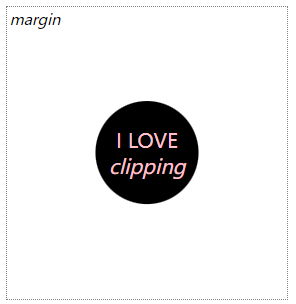
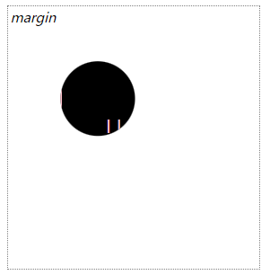

# clip-path蒙版

**`clip-path`** [CSS](https://developer.mozilla.org/zh-CN/docs/Web/CSS) 属性使用裁剪方式创建元素的可显示区域。区域内的部分显示，区域外的隐藏。

## none

clip-path: none，clip-path 的默认值

> **备注：** CSS 计算值不为 **`none`** 时，会创建新的[层叠上下文](https://developer.mozilla.org/zh-CN/docs/Web/CSS/CSS_positioned_layout/Understanding_z-index/Stacking_context)，就像 CSS [`opacity`](https://developer.mozilla.org/zh-CN/docs/Web/CSS/opacity) 的值不为 `1` 时那样。

## basic-shape

**`<basic-shape>`** 是一种表现基础图形的 CSS 数据类型，作用于[`clip-path`](https://developer.mozilla.org/zh-CN/docs/Web/CSS/clip-path) 与 [`shape-outside`](https://developer.mozilla.org/zh-CN/docs/Web/CSS/shape-outside) 属性中。

### inset

距参考框每侧指定的插入距离处定义一个矩形。

**参数1**

**`<length-percentage>{1,4}`**，当提供所有四个参数时，它们表示从参考框向内的顶部、右侧、底部和左侧的偏移量，这些偏移量定义了插入矩形的边缘的位置。

> 可以是 px 固定值，也可以是百分比，对应当前 div 宽与高的百分比，当设置 50% 时会完全裁剪掉。

```css
clip-path: inset(10px 20px 40px);
```


**参数2**

**`<border-radius>`**，可选，参数使用 border-radius 简写语法定义插入矩形的圆角。

在参数1基础上添加 round 然后跟上参数2（border-radius）的参数即可。

> 如果要绘制椭圆，可以用 round 绘制。

```css
clip-path: inset(4rem 20% round 1rem 2rem 3rem 4rem);
```


> 对于 border-radius 有一种 “/” 的写法。用于切分圆角为1/4圆进行定义，例如
>
> ```
> border-radius: 30px / 50px; // 30px 定义的上半部分,50px 定义的下半部分
> ```
>
> 

### circle

绘制一个圆。

**参数1**

定义圆的半径，可以时一个固定值或者是 `closest-side` 和 `farthest-side`。

> 这里与 inset 不同，inset 是距离边框的距离

- [`closest-side`](https://developer.mozilla.org/en-US/docs/Web/CSS/basic-shape/circle#closest-side)

  使用从形状中心到参考框最近侧的长度。对于圆来说，这是任何维度上最接近的边。

- [`farthest-side`](https://developer.mozilla.org/en-US/docs/Web/CSS/basic-shape/circle#farthest-side)

  使用从形状中心到参考框最远边的长度。对于圆来说，这是任何维度上最接近的边。

```css
clip-path: circle(closest-side);
```


```css
clip-path: circle(farthest-side);
```


**参数2**

定义圆的位置，添加 **at**，可以百分比，也可以是固定值或者left、center。

> 注意，如果只写一个值，他仅代表宽度上的值，第二个值默认为 center。

**默认值是： center center。**

```css
clip-path: circle(6rem at right center);
```


注意，设置**百分比**是相对于当前 div 的**宽高**，这里位置也是相对圆心的位置。

这里，**closest-side** 设置后，圆心到**最近的边**的距离作为半径，也就是10%。

```css
clip-path: circle(closest-side at 10% 50%); // 圆心在宽度 10% 的位置上，高度 50% 的位置上。
```


### ellipse

绘制一个椭圆参数情况同 circle基本相同。

定义两个值，一个是椭圆宽度，第二个是椭圆高度。

```css
clip-path: ellipse(40px 100px);
```


```css
clip-path: ellipse(closest-side farthest-side);
```


### polygon

它用于通过提供一对或多对坐标来绘制[多边形](https://en.wikipedia.org/wiki/Polygon)，每个坐标代表形状的一个顶点。

顶点需要注意顺序，顺序遵循**上，右，下，左**的顺时针方向，。

**设置的值**分别是距离左上角的距离（或者说**坐标**）。

值可以设置**百分比**，分别是对应div宽高的百分比。

```css
clip-path: polygon(50% 0%,
                   100% 50%,
                   50% 100%,
                   0% 100%,
                   0% 50%);
```


也可以是**固定值**。

设置第一个点为 10px 20px 距离左上角为 10px与20px。

```css
clip-path: polygon(10px 20px,
                   100% 50%,
                   50% 100%,0% 100%,
                    0% 50%);
```


### path

接受 SVG 路径字符串，并在 < 中使用a i=4>CSS 形状 和 CSS 运动路径，用于绘制形状。

详情：https://developer.mozilla.org/en-US/docs/Web/CSS/path

```css
clip-path: path(
'M  20  240 \
 L  20  80 L 160  80 \
 L 160  20 L 280 100 \
 L 160 180 L 160 120 \
 L  60 120 L  60 240 Z')
```


## geometry-box

如果同 `<basic-shape>` 一起声明，它将为基本形状提供相应的参考框盒。通过自定义，它将利用确定的盒子边缘包括任何形状边角（比如说，被 [`border-radius`](https://developer.mozilla.org/zh-CN/docs/Web/CSS/border-radius) 定义的剪切路径）。几何框盒可以有以下的值中的一个：

[`margin-box`](https://developer.mozilla.org/zh-CN/docs/Web/CSS/clip-path#margin-box)，使用 [margin box](https://developer.mozilla.org/zh-CN/docs/Web/CSS/CSS_shapes/From_box_values#margin-box) 作为引用框。

[`border-box`](https://developer.mozilla.org/zh-CN/docs/Web/CSS/clip-path#border-box)，使用 [border box](https://developer.mozilla.org/zh-CN/docs/Web/CSS/CSS_shapes/From_box_values#border-box) 作为引用框。

[`padding-box`](https://developer.mozilla.org/zh-CN/docs/Web/CSS/clip-path#padding-box)，使用 [padding box](https://developer.mozilla.org/zh-CN/docs/Web/CSS/CSS_shapes/From_box_values#padding-box) 作为引用框。

[`content-box`](https://developer.mozilla.org/zh-CN/docs/Web/CSS/clip-path#content-box)，使用 [content box](https://developer.mozilla.org/zh-CN/docs/Web/CSS/CSS_shapes/From_box_values#content-box) 作为引用框。

[`fill-box`](https://developer.mozilla.org/zh-CN/docs/Web/CSS/clip-path#fill-box)，利用对象边界框（object bounding box）作为引用框。

[`stroke-box`](https://developer.mozilla.org/zh-CN/docs/Web/CSS/clip-path#stroke-box)，使用笔触边界框（stroke bounding box）作为引用框。

[`view-box`](https://developer.mozilla.org/zh-CN/docs/Web/CSS/clip-path#view-box)，使用最近的 SVG 视口（viewport）作为引用框。如果 `viewBox` 属性被指定来为元素创建 SVG 视口，引用框将会被定位在坐标系的原点，引用框位于由 `viewBox` 属性建立的坐标系的原点，引用框的尺寸用来设置 `viewBox` 属性的宽高值。


**案例**

```css
clip-path: circle(25%)
```



```css
clip-path: circle(25% at 25% 25%)
```


```css
clip-path: fill-box circle(25% at 25% 25%)
```


```css
clip-path: stroke-box circle(25% at 25% 25%)
```


```css
clip-path: view-box circle(25% at 25% 25%)
```


```css
clip-path: margin-box circle(25% at 25% 25%)
```


```css
clip-path: border-box circle(25% at 25% 25%)
```


```css
clip-path: padding-box circle(25% at 25% 25%)
```



```css
clip-path: content-box circle(25% at 25% 25%)
```


## clip-source

用 [`url()`](https://developer.mozilla.org/zh-CN/docs/Web/CSS/url) 引用 [SVG](https://developer.mozilla.org/zh-CN/docs/Web/SVG) 的 [`clipPath`](https://developer.mozilla.org/zh-CN/docs/Web/SVG/Element/clipPath) 元素。

**案例**

```css
clip-path: url(#myPath)
```

假设下面的clipPath定义:
```jsx | pure
<svg>
  <clipPath id="myPath" clipPathUnits="objectBoundingBox">
    <path d="M0.5,1
      C 0.5,1,0,0.7,0,0.3
      A 0.25,0.25,1,1,1,0.5,0.3
      A 0.25,0.25,1,1,1,1,0.3
      C 1,0.7,0.5,1,0.5,1 Z" />
  </clipPath>
</svg>
```


## **总结**

```css
/* Keyword values */
clip-path: none;

/* <clip-source> values */
clip-path: url(resources.svg#c1);

/* <geometry-box> values */
clip-path: margin-box;
clip-path: border-box;
clip-path: padding-box;
clip-path: content-box;
clip-path: fill-box;
clip-path: stroke-box;
clip-path: view-box;

/* <basic-shape> values */
clip-path: inset(100px 50px);
clip-path: circle(50px at 0 100px);
clip-path: ellipse(50px 60px at 0 10% 20%);
clip-path: polygon(50% 0%, 100% 50%, 50% 100%, 0% 50%);
clip-path: path(
  "M0.5,1 C0.5,1,0,0.7,0,0.3 A0.25,0.25,1,1,1,0.5,0.3 A0.25,0.25,1,1,1,1,0.3 C1,0.7,0.5,1,0.5,1 Z"
);

/* Box and shape values combined */
clip-path: padding-box circle(50px at 0 100px);

/* Global values */
clip-path: inherit;
clip-path: initial;
clip-path: revert;
clip-path: revert-layer;
clip-path: unset;
```

**兼容**


注意：使用 Animations 可以定义多个动画，但是注意兼容性。


**备注**

转自：https://developer.mozilla.org/zh-CN/docs/Web/CSS/clip-path
