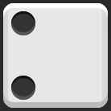
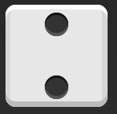
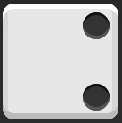
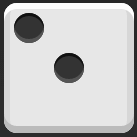
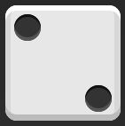
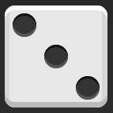
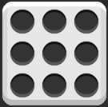
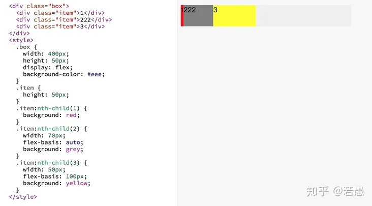
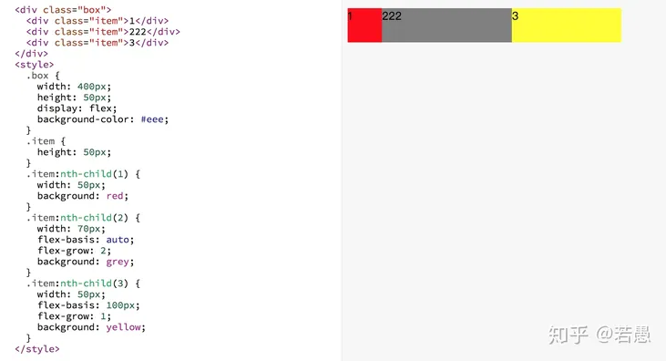
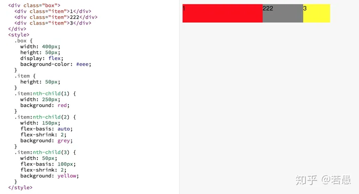

# flex案例与理解

## 骰子案例

骰子一个面我们设置为一层 box div ，这层 div 内部 span 代表一个点数。

```jsx | pure
<div class="box">
  <span class="item"></span>
</div>
```

### 单项目

首先，只有左上角1个点的情况。Flex布局默认就是首行左对齐，所以一行代码就够了。

```css
.box {
  display: flex;
}
```


```
.box {
  display: flex;
  justify-content: center;
}
```


```css
.box{
  display: flex;
  justify-content:flex-end;
}
```

设置交叉轴对齐方式，可以垂直移动主轴。


```css
.box {
  display: flex;
  align-items: center;
}
```


```css
.box {
  display: flex;
  justify-content: center;
  align-items: center;
}
```


```css
.box {
  display: flex;
  justify-content: center;
  align-items: flex-end;
}
```


```css
.box {
  display: flex;
  justify-content: flex-end;
  align-items: flex-end;
}
```


### 双项目

```css
.box {
  display: flex;
  justify-content: space-between;
}
```


```css
.box {
  display: flex;
  flex-direction: column;
  justify-content: space-between;
}
```



```css
.box {
  display: flex;
  flex-direction: column;
  justify-content: space-between;
  align-items: center;
}
```



```css
.box {
  display: flex;
  flex-direction: column;
  justify-content: space-between;
  align-items: flex-end;
}
```



```css
.box {
  display: flex;
}
.item:nth-child(2) {
  align-self: center;
}
```



```css
.box {
  display: flex;
  justify-content: space-between;
}
.item:nth-child(2) {
  align-self: flex-end;
}
```



### 三项目

```css
.box {
  display: flex;
}

.item:nth-child(2) {
  align-self: center;
}

.item:nth-child(3) {
  align-self: flex-end;
}
```



### 四项目

```css
.box {
  display: flex;
  flex-wrap: wrap;
  justify-content: flex-end;
  align-content: space-between;
}
```


```jsx | pure
<div class="box">
  <div class="column">
    <span class="item"></span>
    <span class="item"></span>
  </div>
  <div class="column">
    <span class="item"></span>
    <span class="item"></span>
  </div>
</div>
```

```css
.box {
  display: flex;
  flex-wrap: wrap;
  align-content: space-between;
}

.column {
  flex-basis: 100%;
  display: flex;
  justify-content: space-between;
}
```


### 六项目

```css
.box {
  display: flex;
  flex-wrap: wrap;
  align-content: space-between;
}
```


```css
.box {
  display: flex;
  flex-direction: column;
  flex-wrap: wrap;
  align-content: space-between;
}
```


```css
.box {
  display: flex;
  flex-direction: column;
  flex-wrap: wrap;
  align-content: space-between;
}
```


HTML代码如下。

```jsx | pure
<div class="box">
  <div class="row">
    <span class="item"></span>
    <span class="item"></span>
    <span class="item"></span>
  </div>
  <div class="row">
    <span class="item"></span>
  </div>
  <div class="row">
     <span class="item"></span>
     <span class="item"></span>
  </div>
</div>
```

CSS代码如下。

```css
.box {
  display: flex;
  flex-wrap: wrap;
}

.row{
  flex-basis: 100%;
  display:flex;
}

.row:nth-child(2){
  justify-content: center;
}

.row:nth-child(3){
  justify-content: space-between;
}
```

### 九项目

```css
.box {
  display: flex;
  flex-wrap: wrap;
}
```



## flex项目的属性深入理解

### **flex-basis**

flex-basis 用于设置子项的占用空间。有点等同于width，不过**优先级高于width**。

如果设置了值，则子项占用的空间为设置的值；

如果没设置或者为 auto，那子项的空间为width/height 的值。



- 对于子项1，flex-basis 如果设置默认是auto，子项占用的宽度使用width 的宽度，width没设置也为 auto，所以子项占用空间由内容决定。
- 对于子项2，flex-basis 为auto，子项占用宽度使用width 的宽度，width 为70px，所以子项子项占用空间是70px。
- 对于子项3，flex-basis 为100px，覆盖width 的宽度，所以子项占用空间是100px。

### **flex-grow**

用来“瓜分”父项的“剩余空间”。



容器的宽度为400px, 子项1的占用的基础空间(flex-basis)为50px，子项2占用的基础空间是70px，子项3占用基础空间是100px，剩余空间为 400-50-70-100 = 180px。

其中子项1的flex-grow: 0(未设置默认为0)， 子项2flex-grow: 2，子项3flex-grow: 1，剩余空间分成3份，子项2占2份(120px)，子项3占1份(60px)。

所以子项1真实的占用空间为: 50+0 = 50px， 子项2真实的占用空间为: 70+120 = 190px， 子项3真实的占用空间为: 100+60 = 160px。

### **flex-shrink**

用来“吸收”超出的空间




容器的宽度为400px, 子项1的占用的基准空间(flex-basis)为250px，子项2占用的基准空间是150px，子项3占用基准空间是100px，总基准空间为 250+150+100=500px。

容器放不下，多出来的空间需要被每个子项根据自己设置的flex-shrink 进行吸收。 

子项1的flex-shrink: 1(未设置默认为1)， 子项2 flex-shrink: 2，子项3 flex-shrink: 2。

子项1需要吸收的的空间为 `(250*1)/(250*1+150*2+100*2) * 100 = 33.33px`，子项1真实的空间为 250-33.33 = 216.67px。

同理子项2吸收的空间为`(150*2)/(250*1+150*2+100*2) * 100=40px`，子项2真实空间为 `150-40 = 110px`。

子项3吸收的空间为`(100*2)/(250*1+150*2+100*2) * 100 = 26.67px`，真实的空间为`100-26.67=73.33px`。

**备注**

1本文转自：https://www.ruanyifeng.com/blog/2015/07/flex-examples.html

2本文转自：https://zhuanlan.zhihu.com/p/39052660
