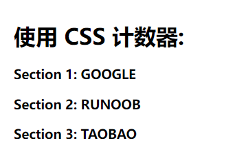
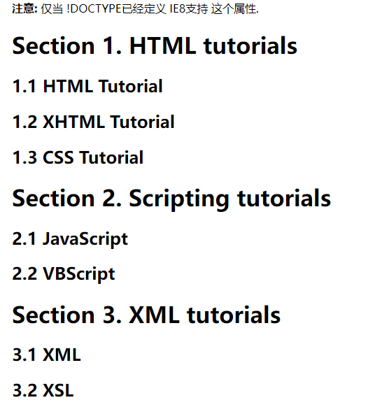

# CSS函数

## attr()

**获取 HTML 属性值**，attr() 函数返回选择元素的属性值。

```js
// 返回 href 属性
<p><a href="http://www.runoob.com">菜鸟教程</a></p>
a:after {
    content: " (" attr(href) ")";
}
```

## calc()

calc() 函数用于**动态计算长度值**。

- 需要注意的是，运算符前后都需要保留一个空格，例如：`width: calc(100% - 10px)`；
- 任何长度值都可以使用calc()函数进行计算；
- calc()函数支持 "+", "-", "*", "/" 运算；
- calc()函数使用标准的数学运算优先级规则；

```css
#div1 {
    position: absolute;
    left: 50px;
    width: calc(100% - 100px);
    border: 1px solid black;
    background-color: yellow;
    padding: 5px;
    text-align: center;
}
```

## var()

var() 函数用于**插入自定义的属性值**，如果一个属性值在多处被使用，该方法就很有用。

```css
:root {
  --main-bg-color: coral;
}
 
#div1 {
  background-color: var(--main-bg-color);
}
 
#div2 {
  background-color: var(--main-bg-color);
}
```

## rgba()&rgb()

 使用红(R)、绿(G)、蓝(B)、透明度(A)的叠加来生成各式各样的颜色。

```css
#p1 {background-color:rgba(255,0,0,0.3);} /* 红 */
#p2 {background-color:rgba(0,255,0,0.3);} /* 绿 */
#p3 {background-color:rgba(0,0,255,0.3);} /* 蓝 */
```

## hsla()&hsl()

hsla() 函数使用色相、饱和度、亮度、透明度来定义颜色。

HSLA 即色相、饱和度、亮度、透明度（英语：Hue, Saturation, Lightness, Alpha ）。

```css
#p1 {background-color:hsl(120,100%,50%,0.3);} /* 绿色 */
#p2 {background-color:hsl(120,100%,75%,0.3);} /* 浅绿  */
#p3 {background-color:hsl(120,100%,25%,0.3);} /* 暗绿  */
#p4 {background-color:hsl(120,60%,70%,0.3);} /* 柔和的绿色 */
```

## max()&min()

从一个逗号分隔的表达式列表中**选择最大（最小）的值**作为属性的值。

```js
#div1 {
  background-color: yellow;
  height: 100px;
  width: max(50%, 300px);
}
```

## counter()

counter() 函数以字符串形式返回当前**计数器的值**

计数器的值通过使用 [counter-reset](https://www.runoob.com/cssref/pr-gen-counter-reset.html) 和 [counter-increment](https://www.runoob.com/cssref/pr-gen-counter-increment.html) 操作，在 content 上应用 counter() 函数来显示在页面上。

```css
body {
  counter-reset: section;           /* 重置计数器成0 */
}
h3:before {
  counter-increment: section;      /* 增加计数器值，h3每调用一次就加一并展示*/
  content: "Section " counter(section) ": "; /* 显示计数器 */
}
```

```html
<h1>使用 CSS 计数器:</h1>
<h3>GOOGLE</h3>
<h3>RUNOOB</h3>
<h3>TAOBAO</h3>
```



另一个例子，设置 h2 为 subsection

```html
<!DOCTYPE html>
<html>
<head>
<meta charset="utf-8">
<title>菜鸟教程(runoob.com)</title>
<style>
body {counter-reset:section;}
h1 {counter-reset:subsection;}
h1:before
{
	counter-increment:section;
	content:"Section " counter(section) ". ";
}
h2:before 
{
	counter-increment:subsection;
	content:counter(section) "." counter(subsection) " ";
}
</style>
</head>

<body>

<p><b>注意:</b> 仅当 !DOCTYPE已经定义 IE8支持 这个属性.</p>

<h1>HTML tutorials</h1>
<h2>HTML Tutorial</h2>
<h2>XHTML Tutorial</h2>
<h2>CSS Tutorial</h2>

<h1>Scripting tutorials</h1>
<h2>JavaScript</h2>
<h2>VBScript</h2>

<h1>XML tutorials</h1>
<h2>XML</h2>
<h2>XSL</h2>

</body>
</html>
```


