# CSS3其他补充
## @import方式引入CSS文件

在css文件内引入css文件可以使用@import方式，具体做法：

```css
@import url('./style.css');
```

引入CSS的方法有两种，一种是@import，一种是link
1，`@import url('地址');`
2，`<link href="地址" rel="stylesheet" type="text/css" />`
现在绝大部分的网站都采用后一种link方式，原因在于@import先加载HTML，后加载CSS。link先加载CSS，后加载HTML。所以前者加载网页会出现令浏览者以外的格式，后者则是带格式的加载网页。[原文链接](https://zhidao.baidu.com/question/312417403.html)

## CSS3opacity半透明

`opacity`设置半透明，兼容到IE9。

兼容更低IE版本写法：

```css
opacity{
　　　opacity:0.5;
　　　filter:alpha(opacity=50);  //filter 过滤器，兼容IE678
}
```

## Alpha滤镜

此外，在CSS中有一个**Alpha滤镜**，这个滤镜能够设置目标元素的透明度。还能够经过指定坐标，从而实现各类不一样范围的透明度。css

具体语法以下：

```css
img{
    filter: alpha(
		opacity=#opacity,			  
		finishopacity=#finishopacity,
		style=#style,startx=#startx,
		starty=#starty,
		finishx=#finishx,
		finishy=#finishy
)}
```

具体参数含义以下：

+ **opacity 透明度**。默认的范围是从0 到 100，他们实际上是百分比的形式。也就是说，0表明彻底透明，100表明彻底不透明。 

+ **finishopacity** 是一个可选参数，若是想要设置**渐变**的透明效果，就能够使用他们来指定**结束时**的**透明度**。范围也是0 到 100。 

+ **style**  指定透明区域的形状特征：0 表明统一形状，1 表明**线形**，2 表明**放射状**，3 表明**矩形** 。

+ **startx**  渐变透明效果**开始**处的 **X坐标**。 只能style = 1才有效。

+ **starty**  渐变透明效果**开始**处的 **Y坐标**。 只能style = 1才有效 。

+ **finishx** 渐变透明效果**结束**处的 **X坐标**。 只能style = 1才有效。

+ **finishy** 渐变透明效果**结束**处的 **Y坐标**。 只能style = 1才有效 。

使用

```html
<html>
<head>
<title>alpha效果展现：</title>  
<style type="text/Css">                //*定义CSS样式*//    blog
.half{filter:alpha(opacity=50)}        //*透明度50，默认形状*//   ci
.s0{filter:alpha(opacity=30,style=0)}  //*透明度30，统一形状*//   it
.s1{filter:alpha(opacity=80,style=1)}  //*透明度80，线性透明*//   form
.s2{filter:alpha(opacity=80,style=2)}  //*透明度80，放射性*//   class
.s3{filter:alpha(opacity=80,style=3)}  //*透明度80，长方形*//   </style>   
</head>  
<body>
  
   
     
      
        
       
</body>
</html>
```

> 注意：在滤镜属性中，每一个参数之间使用英文的逗号（,）分隔开，交换各个参数的位置，并不影响滤镜的显示效果。

## filter

CSS的滤镜filter属性，可以对网页中的图片进行类似Photoshop图片处理的效果，通过CSS对图像进行处理，CSS的filter属性可以得到一些类似PS的滤镜效果。

> 浏览器支持情况：只有IE浏览器不支持filter（滤镜）属性，为了兼容低版本的safari和google浏览器，需要加上前缀-webkit- 。

### 速记

1、filter： contrast(200%) - 调整图像的对比度。

2、filter： grayscale(1) - 将图像转换为灰度图像。

3、filter： invert(.9) - 反转输入图像。

4、filter：brightness（.5）- 给图片应用一种线性乘法，使其看起来更亮或更暗。

5、filter：saturate（6）- 转换图像饱和度。

6、filter：sepia（1）- 将图像转换为深褐色。

7、filter：hue-rotate（45deg）- 给图像应用色相旋转。

### API

filter 的取值有：none | blur() | brightness() | contrast() | drop-shadow() | grayscale() | hue-rotate() | invert() | opacity() | saturate() | sepia() | url();

> CSS 滤镜可以给同个元素同时**定义多个**，例如 
>
> filter: contrast(150%) brightness(1.5) 
>
> 但是滤镜的先后顺序不同产生的效果也是不一样的；

默认值为： initial（inherit 表示从父级继承）。

> 滤镜通常使用百分比 (如：75%), 当然也可以使用小数来表示 (如：0.75)。

#### 高斯模糊 blur(Npx)

```css
div img:last-child{
  filter:blur(2px);
  width:400px;
}
```

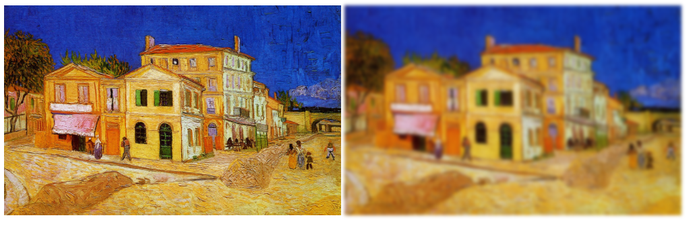

#### 阴影滤镜 drop-shadow

这个取值类似于box-shadow

```
drop-shadow(h-shadow v-shadow blur spread color) 
```

**h-shadow、v-shadow** (必须)
这是设置**阴影偏移量**的两个 length 值. 

h-shadow 设定**水平**方向距离. **负值**会使阴影出现在**元素左边**. 

v-shadow 设定**垂直**距离.**负值**会使阴影出现在**元素上方**。

如果两个值都是0, 则阴影出现在元素正后面 (如果设置了 blur and/or spread，会有模糊效果).

**blur** (可选)
**值越大，越模糊**，则阴影会变得更大更淡.不允许负值，若未设定，默认是0 (则阴影的边界很锐利).

**spread** (可选)
正值会使阴影**扩张和变大**，负值会是阴影缩小.若未设定，默认是0 (阴影会与元素一样大小).

**color** (可选)
查看 color 该值可能的关键字和标记。若未设定，颜色值基于浏览器。在Gecko (Firefox), Presto (Opera)和Trident (Internet Explorer)中， 会应用colorcolor属性的值。另外, 如果颜色值省略，WebKit中阴影是透明的。

```css
div img:last-child{
  filter: drop-shadow(2px 4px 6px #000);
  width:400px;
}
```

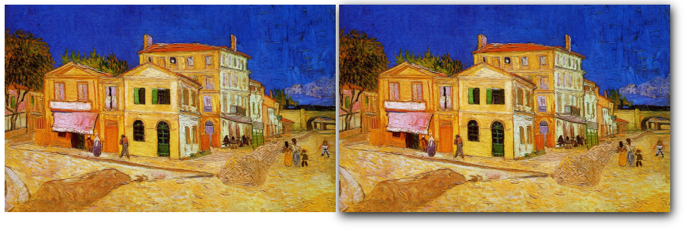

#### 灰阶滤镜 grayscale

将图像转换为**灰度图像**。值定义转换的比例。值为100%则完全转为灰度图像，值为0%图像无变化。若未设置，值默认是0。也可以写0-1之间的小数。

grayscale(0%):无变化
grayscale(100%):灰度图片
grayscale(>100%):跟100%的效果一致

```css
div img:last-child{
  filter: grayscale(50%);
  width:400px;
}
```

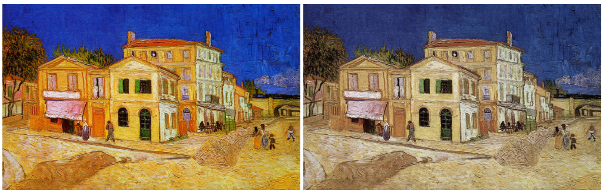

#### 亮度滤镜 brightness

给图片应用一种线性乘法，使其看起来更亮或更暗

brightness(0%): 全黑

brightness(100%): 没有变化

brightness(>100%): 图片变得更亮

```css
div img:last-child{
  filter: brightness(190%);
  width:400px;
}
```

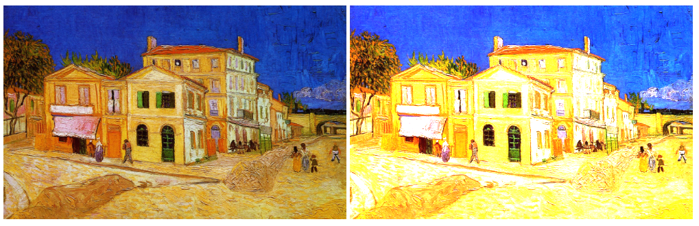

#### 对比度滤镜 contrast

contrast(0%): 全灰

contrast(100%): 没有变化

contrast(>100%): 图片对比度更明显

```css
div img:last-child{
  filter: contrast(190%);
  width:400px;
}
```

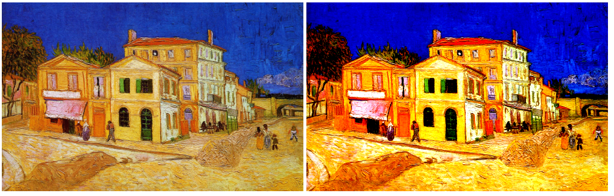

#### 色相旋转滤镜 hue-rotate

hue-rotate(0deg):无变化

hue-rotate(180deg):变化

hue-rotate(360deg):无变化

hue-rotate(361deg)的效果等同于hue-rotate(1deg)的效果
0~360deg为一个周期

```css
div img:last-child{
  filter: hue-rotate(180deg);
  width:400px;
}
```

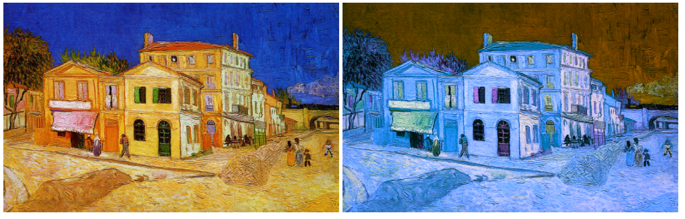

#### 反转滤镜 invert

invert(0%):无变化

invert(100%):完全反转

invert(>100%):跟100%的效果一致

```css
div img:last-child{
  filter: invert(100%);
  width:400px;
}
```

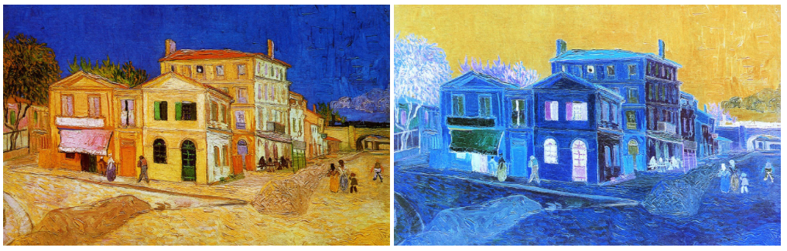

#### 透明度滤镜 opacity

opacity(0%):完全透明

opacity(100%):无变化

opacity(>100%):跟100%的效果一致

该值类似与opacity属性

> 也可以使用 Alpha 设置渐变透明度。

#### 饱和度滤镜 saturate

saturate(0%):完全不饱和

saturate(100%):无变化

saturate(>100%):更高的饱和度

```css
div img:last-child{
  filter: saturate(500%);
  width:400px;
}
```

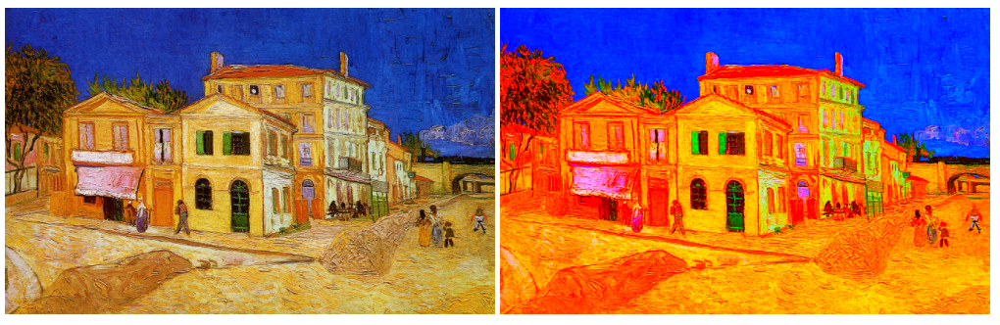

#### 深褐色滤镜 sepia

```css
div img:last-child{
  filter: sepia(100%);
  width:400px;
}
```

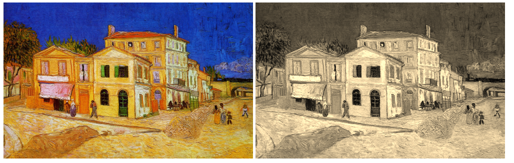

#### SVG滤镜

URL函数接受一个XML文件，该文件设置了 一个SVG滤镜，且可以包含一个锚点来指定一个具体的滤镜元素。

SVG滤镜资源是指以xml文件格式定义的svg滤镜效果集，可以通过URL引入并且通过锚点（#element-id）指定具体的一个滤镜元素

用法：**filter: url(svg-url#element-id)**

 SVG文件

```html
<svg version="1.1"
xmlns="http://www.w3.org/2000/svg"
xmlns:xlink="http://www.w3.org/1999/xlink"
xmlns:ev="http://www.w3.org/2001/xml-events"
baseProfile="full">
    <defs>
        <!-- 此处定义滤镜 -->
        <filter id="blur">
        <feGaussianBlur stdDeviation="4" result="blur"/>
        <!-- feGaussianBlur(滤镜): 该滤镜对输入图像进行高斯模糊 -->
        <feOffset in="blur" dx="4" dy="4" result="offsetBlur"/>
        <!-- feOffset(模糊)：创建阴影效果 -->
        </filter>
    </defs>
</svg>
```

HTML代码

```html
<div data-filter="image-svg-xml" class="svg-xml">
	<h2>svg-xml</h2>
	
</div>
```

 CSS样式

```css
.svg-xml img {
    filter: url("./svg.xml#blur");
    -webkit-filter: url("./svg.xml#blur");
}
```

## Q&A

### filter: drop-shadow与box-shadow的区别?

写法分别为：

```css
box-shadow: inset offset-x offset-y blur-radius spread-radius color;
// 与
filter: drop-shadow(offset-x offset-y blur-radius color);
```

1，第一个入参不同 **box-shadow** 的 **inset**，用于控制阴影是**向内**还是**向外**的扩散，如果有写则表示阴影向内，默认不填则向外。

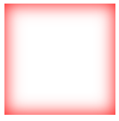

2，**drop-shadow** 能在对于**不规则**的元素或图片实现特殊阴影

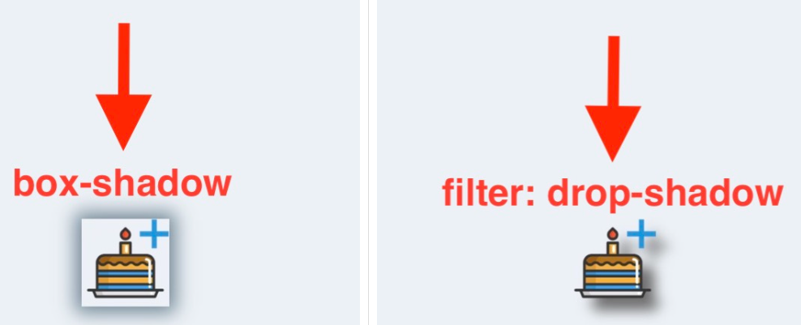

**备注**

参考1：[CSS filter滤镜属性使用](https://blog.csdn.net/Aria_Miazzy/article/details/128454697)

参考2：[CSS滤镜之Alpha滤镜——透明度](http://www.noobyard.com/article/p-mafcnuuw-cg.html)

参考3：[我不允许你还不知道CSS的filter的drop-shadow阴影用法以及与box-shadow的区别详解](https://blog.csdn.net/laimaodashuaige/article/details/128995331)
