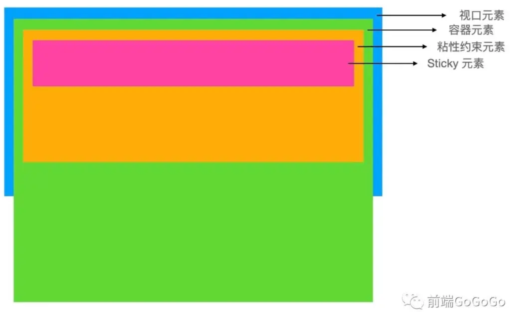
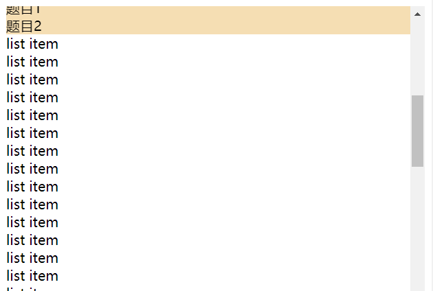
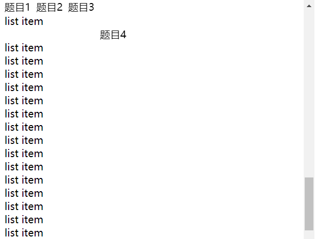

# 粘性定位 position sticky

## 理解

`position:sticky` 又称为粘性定位，粘性定位的元素是依赖于用户的滚动，在 `position:relative` 与 `position:fixed` 定位之间切换。

元素根据正常文档流进行定位，然后相对它的最近滚动祖先（`nearest scrolling ancestor`）和 `containing block` (最近块级祖先 `nearest block-level ancestor`)，包括`table-related` 元素，基于 `top`, `right`, `bottom`, 和 `left`的值进行偏移。

> 一个 `sticky元素` 会 `固定` 在离它最近的一个拥有 `滚动机制` 的祖先上（当该祖先的 `overflow` 是 `hidden`, `scroll`, `auto`, 或 `overlay`时），即便这个祖先不是最近的真实可滚动祖先。
>
> 偏移值不会影响任何其他元素的位置。该值总是创建一个新的层叠上下文（`stacking context`）。

## 使用

在使用时，我们一般设置四层元素：视口元素，容器元素，粘性约束元素 和 sticky 元素。



**视口元素**：显示内容的区域。会设置宽，高。一般会设置 `overflow:hidden`。

**容器元素**：离 sticky 元素最近的能**滚动**的祖先元素，sticky元素也是相对该元素定位。

**粘性约束元素**：粘性定位的父元素，也是 sticky 元素活动的最大范围。有时，也会出现粘性约束元素就是容器元素的情况。

**sticky 元素**：设置了 `position: sticky;` 的元素。

滚动时，sticky 元素设置的 left, right, top, bottom 的值相对的是容器元素。**当粘性约束元素滚出视口时，sticky 元素也会滚出视口**，下边这个例子，则出现了题目2挤压题目1的效果，就是因为粘性视口元素划出了视口区域。



代码如下：

```jsx | pure
<style>
.viewport {
  height: 500px;
  overflow: hidden;
}

.content {
  overflow: scroll;
  height: 100%;
}

.content .group header {
  position: sticky;
  top: 0;
  background-color: wheat;
}
</style>
<div class="viewport">
  <div class="content">
    <div class="group">
      <!--  -->
      <header>
        题目1
      </header>
      <article>
        <div>list item</div>
        ……
      </article>
    </div>
    <div class="group">
      ……
    </div>
    <div class="group">
      ……
    </div>
    <div class="group">
      ……
    </div>
    <div class="group">
      ……
    </div>
  </div>
</div>
```

**案例2，实现标题停留效果**

同上边比就是删除了 group div 也就是粘性约束元素即可。



代码如下：

```jsx | pure
<style>
    .viewport2 {
      height: 500px;
      overflow: hidden;
    }

    .content2 {
      overflow: scroll;
      height: 100%;
    }

    .content2 header {
      position: sticky;
      top: 0;
    }
    .content2 header:nth-of-type(1) {
      background-color:white;
    }
    .content2 header:nth-of-type(2) {
      padding-left: 50px;
    }
    .content2 header:nth-of-type(3) {
      padding-left: 100px;
    }
    .content2 header:nth-of-type(4) {
      padding-left: 150px;
    }
    .content2 header:nth-of-type(5) {
      padding-left: 200px;
    }
  </style>
<div class="viewport">
  <div class="content">
      <header>
        题目1
      </header>
      <article>
        <div>list item</div>
        ……
      </article>
    ……
    ……
    ……
    ……
  </div>
</div>
```

**备注**

参考教程：https://www.jianshu.com/p/0da2e9cd4352
