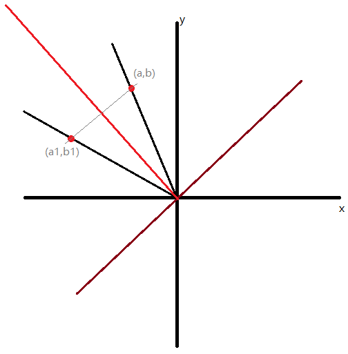

# canvas小球碰撞案例

> 鼠标拖动黑色小球，鼠标松开后小球自由落体并弹跳。

```jsx
/**
 * defaultShowCode: false
 */
import React,{useEffect} from 'react'
import {main} from './demo/canvas/main.js'
import "./demo/opinionated.css"
import "./demo/index.css"

export default () => {
  useEffect(() => {
    main();
  }, []);
  return (
    <canvas class="canvas"></canvas>
  )
}
```

github: https://github.com/xiaowuqiqi/canvas-pellet-collision

demo: https://xiaowuqiqi.github.io/canvas-pellet-collision

## 代码详细实现

### main函数

程序入口，用于初始化各个操作类。

```js
import {OpNode, OpNodeCon} from '../OpNode/OpNodeStorage.js'
import {DragAction, DragEvent} from '../Event/Event.js'
import {Controller} from "./Controller.js";
import {BezierCanvas, GlobuleCanvas} from "./BezierCanvas.js";

export function main() {
  // canvasEle
  const canvasEle = document.querySelector('.canvas');
  const ctx = canvasEle.getContext('2d');
  // new OpNodeCon DragEvent
  const opNodeCon = new OpNodeCon(canvasEle, ctx); // 节点控制模块
  const dragEvent = new DragEvent(canvasEle, opNodeCon); // 拖拽模块
  const paramStore = {canvasEle, opNodeCon, dragEvent, ctx};
  new Controller(paramStore); // 事件注册模块
  const bezierCanvas = new BezierCanvas(paramStore); // bezier 曲线绘制
  new GlobuleCanvas(paramStore, bezierCanvas); // 拖拽小球绘制
}
```

### 节点模块

在 canvas 中绘制图形后，更改图形形状、位置等一些操作时，我们都需要删除原来图像，按照新的状态重新绘制图像。这时，我们记录所有图像的信息，opNode 是图像暂存的一个基础节点，他存储图像的位置信息，以及图像的生成函数，每当需要重绘时，节点控制器会遍历所有节点的生成函数并执行，进行重绘。

```js
//注册节点
export class OpNode {
  /**
   * x,y 表示节点区域的左上角的坐标，该坐标相对于 canvas
   * viewFn 绘制的图形
   *
   * translateCoords 用于移动中
   * oldTranslateCoords 用于结束移动时，固定translateCoords这个值
   */
  translateCoords = {x: 0, y: 0}
  oldTranslateCoords = {x: 0, y: 0}

  readOnly = false // 是否关闭拖拽功能
  zIndex = 0 // 层级
  id
  event = {}

  constructor(ctx, x, y, w, h, viewFn, other = {}) {
    this.oldX = x;
    this.oldY = y;
    this.w = w;
    this.h = h;
    this.ctx = ctx;
    this.viewFn = viewFn;
    this.setOther(other);
    if (!this.id) {
      this.id = Math.random().toString().slice(2);
    }
  }

  setOther(other = {}) {
    for (let k in other) {
      this[k] = other[k];
    }
  }

  get x() {
    return this.oldX + this.translateCoords.x + this.oldTranslateCoords.x
  }

  get y() {
    return this.oldY + this.translateCoords.y + this.oldTranslateCoords.y
  }

  upCoords({x, y}) {
    this.oldTranslateCoords.x = x - this.oldX - (this.w / 2);
    this.oldTranslateCoords.y = y - this.oldY - (this.h / 2);
  }

  get currentX() {
    return this.x + (this.w / 2)
  }

  get currentY() {
    return this.y + (this.h / 2)
  }

  setTranslateCoords(x, y) {
    this.translateCoords.x = x || 0
    this.translateCoords.y = y || 0
  }

  // 拖拽时，是通过 translate 实现的,如果想要清除 translate 值执行这个方法
  clearTranslateCoords() {
    this.translateCoords = {x: 0, y: 0};
    this.oldTranslateCoords = {x: 0, y: 0};
    this.ctx.translate(0, 0);
  }

  handleFixedTranslateCoords() {
    this.oldTranslateCoords.x += this.translateCoords.x;
    this.oldTranslateCoords.y += this.translateCoords.y;
    this.translateCoords.x = 0;
    this.translateCoords.y = 0;
  }

  setZindex(zIndex = 0) {
    this.zIndex = zIndex
  }

  viewFn(newX, newY, opNode) {
  }

  handleViewFn() {
    this.ctx.save();
    this.ctx.beginPath();
    this.ctx.translate(
      this.translateCoords.x + this.oldTranslateCoords.x,
      this.translateCoords.y + this.oldTranslateCoords.y,
    )
    this.viewFn(this.x, this.y, this);
    this.ctx.closePath();
    this.ctx.restore();
  }

  /**
   * 输入坐标是否在节点区域内
   * */
  isIn(a_x, a_y) {
    if (
      a_x - this.x >= 0 && a_y - this.y >= 0 &&
      a_x <= this.x + this.w && a_y <= this.y + this.h
    ) return true;
    return false
  }

}
```

使用时，创建节点，并绘制图像。

```js
const opNode = new OpNode(ctx, x, y, w, h, (ctx) => {
      ctx.moveTo(this.startDotOpNode.currentX, this.startDotOpNode.currentY);
      ctx.bezierCurveTo(
        this.cruxDotAOpNode.currentX, this.cruxDotAOpNode.currentY,
        this.cruxDotBOpNode.currentX, this.cruxDotBOpNode.currentY,
        this.endDotOpNode.currentX, this.endDotOpNode.currentY
      )
    }, {
  ...other,
})
```

在此基础上实现的所有节点的控制器（OpNodeCon）和对于操作的语法糖函数（AssistNode）。

控制器（OpNodeCon）用于 canvas 画布上的所有节点，负责画布重绘工作，以及根据坐标查找节点的工作。

语法糖函数（AssistNode）用于封装常见的图形以及状态，例如禁止节点拖拽（readOnly），绘制圆形（ass.arc）。此外他还可以记录所有操作步骤，当改变绘制完成图形状态时，只需要 pushStep 添加 ctx 相关代码即可。

> 代码地址：https://github.com/xiaowuqiqi/canvas-pellet-collision/blob/main/OpNode/OpNodeStorage.js

### **画布上节点注册**

BezierCanvas 用于绘制 Bezier 曲线，GlobuleCanvas 用于实现小球的自由落体与碰撞的弹跳动画

```js
export class BezierCanvas {
  constructor({canvasEle, opNodeCon, dragEvent, ctx}) {
    this.opNodeCon = opNodeCon;
    this.canvasEle = canvasEle
    ///////
    this.startDotOpNode = this.startDot().opNode;
    this.endDotOpNode = this.endDot().opNode;
    this.cruxDotAOpNode = this.cruxDotA().opNode;
    this.cruxDotBOpNode = this.cruxDotB().opNode;
    this.lineAOpNode = this.lineA().opNode;
    this.lineBOpNode = this.lineB().opNode;
    this.bezierLine();
    ///////

  }
  _getWunit(){
    return this.canvasEle.width/20
  }
  _getHunit(){
    return this.canvasEle.height/10
  }
  startDot() {
    const ass = new AssistNode(this.opNodeCon);
    ass.arc(this._getWunit(), this._getHunit()*9, 5);
    ass.readOnly();
    ass.ctxFn((_ctx) => {
      _ctx.fillStyle = 'red';
    })
    ass.fill();
    ass.go();
    return ass;
  }

  endDot() {
    const ass = new AssistNode(this.opNodeCon);
    ass.arc(this._getWunit()*19, this._getHunit()*6, 5);
    ass.readOnly();
    ass.ctxFn((_ctx) => {
      _ctx.fillStyle = 'red';
    })
    ass.fill();
    ass.go();
    return ass;
  }

  cruxDotA() {
    const ass = new AssistNode(this.opNodeCon);
    ass.arc(this._getWunit()*5, this._getHunit()*9, 5);
    ass.fill();
    ass.go();
    return ass;
  }

  cruxDotB() {
    const ass = new AssistNode(this.opNodeCon);
    ass.arc(this._getWunit()*15, this._getHunit()*3, 5);
    ass.fill();
    ass.go();
    return ass;
  }

  lineA() {
    const ass = new AssistNode(this.opNodeCon);
    ass.ctxFn((ctx) => {
      ctx.moveTo(this.startDotOpNode.currentX, this.startDotOpNode.currentY);
      ctx.lineTo(this.cruxDotAOpNode.currentX, this.cruxDotAOpNode.currentY);
    })
    ass.other({zIndex: 50})
    ass.readOnly();
    ass.stroke();
    ass.go();
    return ass;
  }

  lineB() {
    const ass = new AssistNode(this.opNodeCon);
    ass.ctxFn((ctx) => {
      ctx.moveTo(this.endDotOpNode.currentX, this.endDotOpNode.currentY);
      ctx.lineTo(this.cruxDotBOpNode.currentX, this.cruxDotBOpNode.currentY);
    })
    ass.other({zIndex: 50})
    ass.readOnly();
    ass.stroke();
    ass.go();
    return ass;
  }

  bezierLine() {
    const ass = new AssistNode(this.opNodeCon);
    ass.ctxFn((ctx) => {
      ctx.moveTo(this.startDotOpNode.currentX, this.startDotOpNode.currentY);
      ctx.bezierCurveTo(
        this.cruxDotAOpNode.currentX, this.cruxDotAOpNode.currentY,
        this.cruxDotBOpNode.currentX, this.cruxDotBOpNode.currentY,
        this.endDotOpNode.currentX, this.endDotOpNode.currentY
      )
    });
    ass.other({zIndex: 50})
    ass.readOnly();
    ass.stroke();
    ass.go();

    return ass;
  }
}

export class GlobuleCanvas {
  constructor({canvasEle, opNodeCon, dragEvent, ctx}, bezierCanvas) {
    this.opNodeCon = opNodeCon;
    this.canvasEle = canvasEle
    this.bezierCanvas = bezierCanvas
    // 创建坠落的小球
    this.globuleAss = this.globule();
  }

  // 绘制小球
  static globuleRadius = 8
  // 像素与运动距离比例
  static s_scale = 100;

  globule() {
    const ass = new AssistNode(this.opNodeCon);
    ass.arc(200, 100, GlobuleCanvas.globuleRadius);
    ass.fill();
    ass.go();
    // 监听小球松开一刻
    EventListener.on(ass.opNode.event, `${DragEvent.eventPrefix}up`, () => {
      ass.readOnly();
      ass.go();
      const oldY = ass.opNode.currentY;
      const oldX = ass.opNode.currentX;
      // 动画开始
      this.strikeAnimationFn({x: oldX, y: oldY}, 3, Math.PI)
    })
    this.globuleOpNode = ass.opNode;
    return ass;
  }

  // 小球运动
  // strikeBefore
  // strikeAfter
  // centerCoords 圆心坐标
  // strikeCoords 开始运动时的坐标
  // v 初速度
  // radians 与重力方向的角度
  strikeAnimationFn = (centerCoords, v, radians) => {
    let animation
    // 速度分析
    const parabolaResolution = new VelocityResolution(v, radians)
    const _fn = (ae) => {
      const t = ae.passedSecond;
      const newCenterCoords = {
        x: centerCoords.x + (parabolaResolution.getX(t) * GlobuleCanvas.s_scale),
        y: centerCoords.y - (parabolaResolution.getY(t) * GlobuleCanvas.s_scale)
      }
      this.globuleOpNode.upCoords(newCenterCoords)
      this.opNodeCon.viewRedraw();
      // 走出屏幕就关闭；
      if (newCenterCoords.x > this.canvasEle.width + 100 || newCenterCoords.y > this.canvasEle.height + 100) {
        console.log('走出屏幕，关闭')
        animation.clear();
        this.globuleAss.clear();
        this.globule();
        return;
      }
      // 计算八边形模型
      const globuleOctagonCoords =
        (new GlobuleModel(newCenterCoords, GlobuleCanvas.globuleRadius))
          .getOctagonCoords();
      // 新的撞击,撞击点
      const newStrikeCoords = globuleOctagonCoords.find((_coords) => {
        const _y = this.currentCubicBezierPointAtX(_coords.x);
        return _y && (_coords.y >= _y) && Math.abs(newCenterCoords.y - centerCoords.y) > 0.5
      });
      /////
      if (newStrikeCoords) {
        // 获取撞击板子的2个点
        console.log('撞击')
        const boardCoords = this.operationBoardCoords(newStrikeCoords.x);
        if (!boardCoords) return;
        const parabolaKinematic = new ParabolaKinematic(
          boardCoords[0],
          boardCoords[1],
          {x: 0, y: 0},
          {x: parabolaResolution.getXv(), y: -1 * parabolaResolution.getYv(t)},
          parabolaResolution.getV(t));
        animation.clear();
        // 撞击后新速度比较小停止运动
        if (parabolaKinematic.newV < 0.9) {
          console.log('速度比较小')
          this.rollAnimationFn(parabolaKinematic.newV, newCenterCoords, parabolaKinematic.newVRadians);
          return;
        }
        return this.strikeAnimationFn(
          {x:newCenterCoords.x,y:newCenterCoords.y-0.8},
          parabolaKinematic.newV,
          parabolaKinematic.newVRadians
        )
      }
    }
    animation = new AnimationEvent(_fn);
    animation.play();
  }
  rollAnimationFn = (v, centerCoords) => {
    let animation;
    let maxY = 0
    const _y1 = this.currentCubicBezierPointAtX(centerCoords.x-2);
    const _y2 = this.currentCubicBezierPointAtX(centerCoords.x+2);
    // 左右方向
    let direction
    if(_y1<=_y2){
      direction = 1
    }else{
      direction = -1
    }
    const _fn = (ae) => {
      const t = ae.passedSecond;
      const kinematic = new Kinematic(0.4, v/2);
      const dX = direction*kinematic.getS(t);
      const _y = this.currentCubicBezierPointAtX(centerCoords.x + (dX* GlobuleCanvas.s_scale));
      const centerY = _y - GlobuleCanvas.globuleRadius;
      if (centerY < maxY) {
        console.log('打开抓取')
        this.globuleAss.capture();
        this.globuleAss.go();
        animation.clear();
        return
      }
      maxY = centerY
      this.globuleOpNode.upCoords({
        x: centerCoords.x + (dX* GlobuleCanvas.s_scale),
        y: centerY
      })
      this.opNodeCon.viewRedraw();
    }
    animation = new AnimationEvent(_fn);
    animation.play();
  }

  // 获取板子上的两个点
  operationBoardCoords(strikeCoordsX) {
    const strikeAY = this.currentCubicBezierPointAtX(strikeCoordsX - 4);
    const strikeBY = this.currentCubicBezierPointAtX(strikeCoordsX + 4);
    const res = [
      {x: strikeCoordsX - 4, y: strikeAY},
      {x: strikeCoordsX + 4, y: strikeBY},
    ]
    if (
      typeof res[0].x !== "number" || typeof res[0].y !== "number"
      || typeof res[1].x !== "number" || typeof res[1].y !== "number"
    ) return null
    return res
  }

  getCurrentCoordsByNode(opNode) {
    return {
      x: opNode.currentX,
      y: opNode.currentY
    }
  }

  currentCubicBezierPointAtX(x) {
    return cubicBezierPointAtX(x,
      this.getCurrentCoordsByNode(this.bezierCanvas.startDotOpNode),
      this.getCurrentCoordsByNode(this.bezierCanvas.cruxDotAOpNode),
      this.getCurrentCoordsByNode(this.bezierCanvas.cruxDotBOpNode),
      this.getCurrentCoordsByNode(this.bezierCanvas.endDotOpNode),
    )
  }

}
```

### 事件模块

事件模块目前只管理了 mouseDown、mouseMove、mouseUp 三个事件。用于实现拖拽功能。

具体过程是，监听 canvase 元素的 mouseDown 记录鼠标坐标以及注册 root 元素的 mouseMove 和 mouseUp 事件。

触发 mouseMove 时实时调用 OpNodeCon 的重绘方法，遍历所有节点进行重绘画布，更新拖拽元素状态（坐标）。

触发 mouseUp 时卸载 mouseMove、mouseUp 两个事件。

```js
export class DragAction {
  constructor(element) {
    this.ele = element;
  }

  oldMouseCoords = null
  // diffCoords = null
  currentOpNode = null

  clear() {
    this.oldMouseCoords = null
    // this.diffCoords = null
    this.currentOpNode = null
  }

  down(e, et, opNodeCon) {
    this.clear();
    const mouseCoords = et.getMouseCoords(e);
    this.oldMouseCoords = mouseCoords;
    const opNode = opNodeCon.getOpNodeByFitCoords(mouseCoords.x, mouseCoords.y);
    if (!opNode) return false;
    // 距离节点左上角的坐标
    // this.diffCoords = opNode.getDiffCoords(mouseCoords.x, mouseCoords.y);
    this.currentOpNode = opNode;
    EventListener.emit(this.currentOpNode.event,`${DragEvent.eventPrefix}down`);
    return true
  }

  move(e, et, opNodeCon) {
    if (!this.currentOpNode) return false;
    EventListener.emit(this.currentOpNode.event,`${DragEvent.eventPrefix}move`);
    const mouseCoords = et.getMouseCoords(e);
    this.currentOpNode.setTranslateCoords(
      mouseCoords.x - this.oldMouseCoords.x,
      mouseCoords.y - this.oldMouseCoords.y
    );
    opNodeCon.viewRedraw();
    return true
  }

  up(e, et, opNodeCon) {
    if (!this.currentOpNode) return false;
    EventListener.emit(this.currentOpNode.event,`${DragEvent.eventPrefix}up`);
    this.currentOpNode.handleFixedTranslateCoords();
    return true
  }
}

export class DragEvent extends EventListener {
  constructor(element, opNodeCon) {
    super(element, opNodeCon);
    this.ele = element;
    this.dragAction = new DragAction(element);
    this.opNodeCon = opNodeCon;
  }

  static eventPrefix = 'mouse' // 'pointer'

  handle = (e) => {
    this.onMouseDown(e);
  }

  onMouseMove = (e) => {
    e.preventDefault();
    this.dragAction.move(e, this, this.opNodeCon)
  };

  onMouseUp = (e) => {
    this.dragAction.up(e, this, this.opNodeCon)
    const canvasElement = this.ele
    const doc = EventListener.getDocumentFromElement(canvasElement);
    EventListener.removeListener(
      doc,
      `${DragEvent.eventPrefix}up`,
      this.onMouseUp,
      EventListener.eventOptions
    );
    EventListener.removeListener(
      doc,
      `${DragEvent.eventPrefix}move`,
      this.onMouseMove,
      EventListener.eventOptions
    );

  };

  onMouseDown = (e) => {
    this.dragAction.down(e, this, this.opNodeCon)
    const canvasElement = this.ele
    const doc = EventListener.getDocumentFromElement(canvasElement);
    EventListener.addListener(
      doc,
      `${DragEvent.eventPrefix}up`,
      this.onMouseUp,
      EventListener.eventOptions
    );
    EventListener.addListener(
      doc,
      `${DragEvent.eventPrefix}move`,
      this.onMouseMove,
      EventListener.eventOptions
    );
  }
}
```

> 代码地址：https://github.com/xiaowuqiqi/canvas-pellet-collision/blob/main/Event/Event.js
>
> 代码灵感来源：[fabricjs 事件注册模块](https://github.com/fabricjs/fabric.js/blob/master/src/canvas/Canvas.ts#L629)

### 运动模块

用于实现小球的自由落体，以及弹跳的动作的数学运算。

自由落体运算比较简单

```js
export class Kinematic {
  a = 0
  v_0 = 0

  constructor(a = 0, v_0 = 0) {
    this.a = a
    this.v_0 = v_0
  }

  getS(t) {
    if (t < 0) return 0;
    return (this.v_0 * t) + (1 / 2 * this.a * t * t)
  }

  getV(t) {
    if (t < 0) return 0;
    return this.v_0 + (t * this.a);
  }
}

export class GravityKinematic extends Kinematic {
  static g = 9.8 // N/kg
  constructor(v_0 = 0) {
    super(GravityKinematic.g, v_0);
  }

  // 受重力影响运动距离
  getYSByGravity(t) {
    return this.getS(t)
  }
}
```

**碰撞弹跳**运动的运算比较繁琐，主要流程是，传入四个坐标。

前两个坐标，是小球接触碰撞点时的速度所在斜线上的任意两个点，主要用于计算速度向量与重力的夹角，也可以理解为斜线斜率（y=kx+b 中的 k）。

而后两个点是碰撞的面（我称之为碰撞的板子，）与重力夹角。

速度的两个点比较好获得，但是板子的两个点稍微需要计算。具体方法是通过三次 Bezier 数学函数获得。

> 其中我们不能直接求解t，需要类似使用二分法方法，用计算机运算取近似值。

```js
export function cubicBezierPointAtX(x, P0, P1, P2, P3) {
  if(Number.isNaN(x))return;
  if(x<P0.x||x>P3.x)return;
  // P0 到 p3 分别是起始点、两个控制点和终点的坐标。
  // 迭代法求解 t 值
  let t = 0.5;  // 初始猜测值
  const epsilon = 1e-6;  // 精度要求
  let xGuess
  while (true) {
    xGuess = (1 - t) ** 3 * P0.x + 3 * (1 - t) ** 2 * t * P1.x +
      3 * (1 - t) * t ** 2 * P2.x + t ** 3 * P3.x;
    if (Math.abs(xGuess - x) < epsilon) {
      break;  // 达到精度要求，退出循环
    }
    const derivative = -3 * (1 - t) ** 2 * P0.x + (3 * (1 - t) ** 2 - 6 * (1 - t) * t) * P1.x +
      (6 * (1 - t) * t - 3 * t ** 2) * P2.x + 3 * t ** 2 * P3.x;
    t = t - (xGuess - x) / derivative;  // 更新 t 值
  }
  // 计算对应的 y 坐标
  const y = (1 - t) ** 3 * P0.y + 3 * (1 - t) ** 2 * t * P1.y +
    3 * (1 - t) * t ** 2 * P2.y + t ** 3 * P3.y;
  return y;
}
```

入参获取后，则就需要计算重要的一个数据，**新速度（弹起的速度）与重力角度**。

我们知道旧速度以及碰撞面（板子）的斜线函数，然后以碰撞点为起点，作一条垂直碰撞面的法线。这时旧速度上的任意一点关于法线对称点在新速度向量所在的斜线上。

这时两点连线过法线有个焦点，其坐标为 ((a1+a)/2,(b1+b)/2)。

板子的斜率通过坐标可以求得，我们记作变量 k 。

然后法线斜率为 m = -1 / k。

经过三点的公式有 `a1*(-1/m)+c = b1`， `a*(-1/m)+c = b`

三个公式合并有 `(a1+a)*m =a1*(-1/m)+b-a*(-1/m)+b`



然后代码如下：

```js
// 碰撞后速度角度
_initNewVRadians(boardCoordsA, boardCoordsB, vCoordsA, vCoordsB) {
  if (boardCoordsA.x > boardCoordsB.x) {
    [boardCoordsA, boardCoordsB] = [boardCoordsB, boardCoordsA];
  }
  // 板子的斜线函数为 y = k*x
  const k = (boardCoordsA.y - boardCoordsB.y) / (boardCoordsB.x - boardCoordsA.x);
  // 板子法线的斜线函数 y = -1/k*x
  const m = -1 / k;
  // 知道入射速度向量，作法线的对称向量，当入射速度上一个点为(a,b)时，对称点的坐标为 (a1,b1)
  const a = vCoordsA.x - vCoordsB.x;
  const b = vCoordsB.y - vCoordsA.y; // vCoordsB平移到坐标系原点，vCoordsA也要作相应平移
  // 法线上点坐标为((a1+a)/2,(b1+b)/2)
  // (a1+a)*m = (b1+b)
  // 经过三点的公式有
  // a1*(-1/m)+c = b1
  // a*(-1/m)+c = b
  // 公式合并，删除 c
  // a1*(-1/m)+b-a*(-1/m)= b1
  // 带入
  // (a1+a)*m =a1*(-1/m)+b-a*(-1/m)+b
  // 化简
  // a1*m+a*m = a1*(-1/m)+b-a*(-1/m)+b
  // a1*m-a1*(-1/m)=b-a*(-1/m)+b-a*m
  // a1(m+(1/m))=b-a*(-1/m)+b-a*m
  const a1 = (b - (a * (-1 / m)) + b - (a * m)) / (m + (1 / m))
  const b1 = (a1 + a) * m - b
  this.newVRadians = Math.atan2(b1, a1) + (Math.PI / 2);
}
```

> 代码地址：https://github.com/xiaowuqiqi/canvas-pellet-collision/blob/main/Kinematic/Kinematic.js
