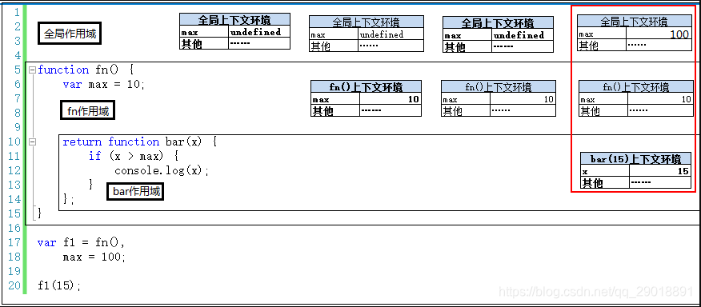

# 作用域与闭包

# 作用域与上下文

## 作用域的概念

**定义**
作用域最大的用处就是隔离变量，不同作用域下同名变量不会有冲突（作用域只是一个“地盘”，一个抽象的概念，其中没有变量。要通过作用域对应的执行上下文环境来获取变量的值。）

> //函数表达式
> var fn = function(){}
> //函数声明
> function fn1(){}

## js中的上下文概念

**定义**
在代码段执行之前，把将要用到的所有的变量、函数声明、this都事先拿出来，有的直接赋值了，有的先用undefined占个空，而这些拿出来的内容所在对象，称之为上下文环境。



## 多层上下文栈的操作(出入栈)

多个作用域就会产生多个上下文，不同等级嵌套的作用域就会产生栈结构。
**压栈**：函数未调用时只有全局上下文在执行，每次调用函数时会产生局部上下文，这就是压栈，也就是进栈。  
**出栈**：函数调用完成后，就会出栈，会销毁本次调用的局部上下文环境


## 执行上下文过程

执行上下文通常大多指的则就是 js 的代码预解析，他是一个过程，当代码执行前生成上下文环境的过程。

### 全局作用域下执行上下文（重点）

**1，变量和函数表达式对其声明，默认赋值为undefined；**
**2，对this赋值（window）；**
**3，对函数声明赋值(但是不执行，内部的上下文不会产生)；**

**这个过程步骤严格且优于其他代码最先执行的。**

### 局部作用域下执行上下文（重点）

**1，变量和函数表达式对其声明，默认赋值为undefined；**
**2，对this赋值（指向当前对象）；**
**3，对函数声明赋值；**
**4，给参数赋值；**
**5，给arguments 赋值；**
**6，自由变量(通常指：父级变量)查找，并赋值(通常指：父级变量的值，类似于把父级变量拖到了此作用域下)；**

**这个过程步骤严格且优于其他代码最先执行的。**

### [案例] 利用上下文与作用域解决问题

#### 例1：

问：console.log(a) // ？

```jsx
/**
 * defaultShowCode: true
 */
import {ConsoleReader} from '@/utils/ConsoleLog'
export default ConsoleReader(({console})=>{
//// ##执行代码如下 ------
    
var a = undefined
console.log(a)
a = 2
    
//// ##END -------------
});
```

由于**变量和函数表达式对其声明，默认赋值为undefined**
代码执行真正过程为：

```jsx
/**
 * defaultShowCode: true
 */
import {ConsoleReader} from '@/utils/ConsoleLog'
export default ConsoleReader(({console})=>{
//// ##执行代码如下 ------
    
var a = undefined
console.log(a)
a = 2
    
//// ##END -------------
});
```

//所以：console.log(a)//undefined

#### 例2：

问：打印‘1’还是打印‘2’

```jsx
/**
 * defaultShowCode: true
 */
import {ConsoleReader} from '@/utils/ConsoleLog'
export default ConsoleReader(({console})=>{
//// ##执行代码如下 ------
    
var f = function(){
  console.log('1')
}
function f(){
  console.log('2')
}
f() // 打印‘1’
    
//// ##END -------------
});
```

由于过程步骤严格
代码执行真正过程为：

```js
var f = undefined
function f(){/*……*/}
f = function(){/*……*/}
f()
//先声明函数表达式，再赋值函数声明，最后执行赋值代码
```

#### 例3：

问：console.log(typeof a) // ？

```jsx
/**
 * defaultShowCode: true
 */
import {ConsoleReader} from '@/utils/ConsoleLog'
export default ConsoleReader(({console})=>{
//// ##执行代码如下 ------
    
function a() {}
var a
console.log(typeof a)
    
//// ##END -------------
});
```

由于全局作用域下执行上下文**过程步骤严格**
代码执行真正过程为：（先变量声明，再对函数声明赋值）

```js
var a
function a() {}
console.log(typeof a)
//先声明变量，再对函数声明赋值，最后执行代码
```

所以：console.log(a) // function

#### 例4：

问：执行结果是什么？

```jsx
/**
 * defaultShowCode: true
 */
import {ConsoleReader} from '@/utils/ConsoleLog'
export default ConsoleReader(({console})=>{
//// ##执行代码如下 ------
    
var c = 1                
function c(c) {
  console.log(c)
  var c = 3
}
c(2)
console.log(c)
    
//// ##END -------------
});
```

由于执行上下文会提前执行，变量赋值什么的操作会推后，所以最后c是number类型。
代码执行真正过程为：

```js
var c = undefined                
function c(c) {
  var c = undefined
  console.log(c)
  c = 3
}
c = 1
c(2) // 报错
console.log(c)//1
```

所以：结果报错，假如注释掉 c(2) 这一行代码，console.log(c )打印 '1'

> 即使是c(2)可以执行，会后也不会打印c // 3，因为function c(c ) {}内的var c = 3 是在独立的作用域内，外面读取不到。

#### 例5：

问：执行结果是什么？

```jsx
/**
 * defaultShowCode: true
 */
import {ConsoleReader} from '@/utils/ConsoleLog'
export default ConsoleReader(({console})=>{
//// ##执行代码如下 ------
    
function fun(){ 
  var a=b=3
}
console.log(b)
fun()
console.log(b)
    
//// ##END -------------
});
```

同上面有同一个问题，当函数不执行时，里边的上下文不会生成并入栈。
只有执行时才会入栈。

> var a = b = 3 其中可以解读为 var a = 3;b = 3 ( a是fun的局部变量，b是全局变量 )

代码执行真正过程为：

```js
function fun(){/*……*/}
console.log(b)//报错
fun()
b = undefined
b = 3
console.log(b)// 3
```

所以：结果报错（如果注释掉第一个console.log(b)，那么会打印3）

总结：几乎所有的预解析题目都可以用上下文执行顺序的知识解决，注意几点就是：上下文生成一定早于其他代码最先执行；上下文生成的顺序严格并固定；局部上下文在函数执行前不会生成不会入栈。

## 补充：

### 作用域链

作用域的特点就是，先在自己的变量范围中查找，如果找不到，就会沿着作用域往上找。
(重要：顺作用域链取值时，要到创建这个函数的那个作用域中取值——是“创建”，而不是“调用”,所以：**作用域在函数定义时就已经确定了**。**而不是在函数调用时确定**。如下题)

```jsx
/**
 * defaultShowCode: true
 */
import {ConsoleReader} from '@/utils/ConsoleLog'
export default ConsoleReader(({console})=>{
//// ##执行代码如下 ------
    
;(function(){
  var x= 10
  function fn(){
    console.log(x)// 10
  }
  function show(f){
    var x =20    
    ;(function(){
      console.log(x) // 20
      f()//这里打印的x是10而不是20
    }())
  }
  show(fn)
}())
    
//// ##END -------------
});
```

### 自执行函数

作用：
      1防止变量外泄，减少全局变量的数量
      2防止全局作用域下的预解析（执行上下文），而打乱执行顺序。
      3自执行函数执行结束后变量就会被内存释放掉，从而也会节省了内存)

```js
// 方式1
;(function(){
//自执行函数
}())

// 方式2
;(function(){
//自执行函数    
})()
```

# 闭包

## 闭包(closure)理解：

一个普通的函数体代码段在调用时，会随之生成一个局部上下文环境，而这个函数体代码段执行完毕后，这个上下文环境也会随之被销毁。
而一个有闭包函数体代码段在调用时，生成的上下文环境不会在其执行完毕后销毁，而是被其返回对象（函数）继续使用。

## 特点

闭包函数执行时，生成独立的局部作用域的上下文环境，所以即使是同一闭包函数内生成的同名变量，他们存储的位置也是不同的，相互独立的。

## 优缺点

**闭包优点**：缓存独立的数据(即使变量名相同)，延长作用域链
**闭包缺点**：因为其特点，增加了内容的开销，资源浪费，不利于垃圾回收机制。

## 闭包分为两种

返回值（函数或对象）闭包

> 利用局部作用域变量做闭包，缓存不同的独立数据。

```jsx
/**
 * defaultShowCode: true
 */
import {ConsoleReader} from '@/utils/ConsoleLog'
export default ConsoleReader(({console})=>{
//// ##执行代码如下 ------
    
 function fn(){
	var num = 10
    return function (){
    	num++
        console.log(num)
    }
}
var f = fn()
f()
var f2 = fn()
f2()
    
//// ##END -------------
});
```

参数闭包

> 利用参数缓存形成闭包，延长作用域链到异步函数执行完毕。

```jsx

/**
 * defaultShowCode: true
 */
import {ConsoleReader} from '@/utils/ConsoleLog'
export default ConsoleReader(({console})=>{
//// ##执行代码如下 ------
    
  for(var i = 0;i<3;i++){
    fn(i)//1,2,3
  }
  function fn(i){
    setTimeout(function(){
      console.log(i)
    },0)
  }
    
//// ##END -------------
});
```

