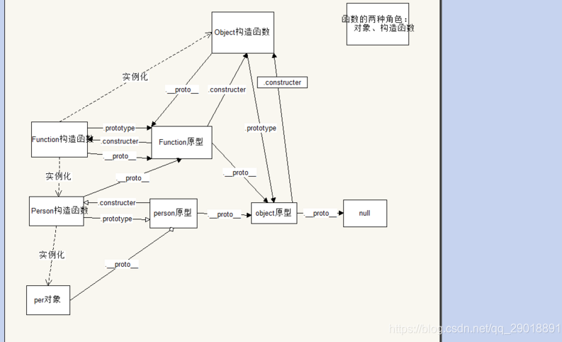

# 实例化与原型链

## 实例化（New与Object.create()）

### 原型链实现 class 写法（es5 写法）

```javascript
 // es 5 class 写法
function Person(name){
	this.name = name
}
Person.prototype.getName = function (){
	console.log('name')
}
// es 6 class 写法
class Person{
    name
    constructor(name){
       	this.name = name
    }
    getName(){
        console.log('name')
    }
}
```

es 5 继承，通过原型链赋值实现

```jsx
/**
 * defaultShowCode: true
 */
import {ConsoleReader} from '@/utils/ConsoleLog'
export default ConsoleReader(({console})=>{
//// ##执行代码如下 ------

function Person(name){
	this.name = name
}
Person.prototype.getName = function (){
	console.log('name')
}
    
function Student(score){
    this.score = score;
}
Student.prototype = new Person("小明",10,"男"); // 继承
Student.prototype.study = function(){
    console.log("学习很累");

}
// 使用
var stu = new Student(100)
console.log(stu.name);
console.log(stu.score);
    
//// ##END -------------
});
```

### new

```javascript
var person = new Person('aa')
```

等价于

```javascript
  function _new (Person,name){
    var obj = new Object()
    obj.__proto__ = Person.prototype
    Person.call(obj,name)
    //执行以下这个方法，把里边的this替换成obj执行，这样obj内就会加上新的属性了
    //当有多个参数时，使用这一句：Parent.apply(obj,[].slice.call(arguments,1))
    return obj
  }
  var person2 = _new(Person,"aa")
```

> class 中写的方法属性，都会先挂到 prototype 上边，实例化后会挂到实例的`__proto__`上。

### Object.create()

```javascript
 var p1 = Object.create(Person)
```

等价于

```javascript
  var p2 = function(Person){
    var obj = new Object()
    obj.__proto__ = Person
    return obj
  }() 
  p2.prototype.getName() // 通过 prototype 调用
```

### 区别

1. new作用对象必须是function，Object.create作用对象function和object都可以。
2. new产生的对象（实例对象）拥有作用对象（构造函数）的内置属性和原型上的方法，可以直接调用。
3. Object.create产生的对象（构造对象）没有作用对象的内置属性，但拥有其原型上的方法，通过.prototype调用。

### 产生过程总结：

**new Person():**
1，创建一个新的对象。
2，新的对象的隐式原型（`_proto_`）指向Person.prototype。
3，把Person的this换成新对象执行一下，目的在于把Person私有属性挂载到这个新对象上。
**Object.create(Person)：**
1，创建一个新的对象。
2，新的对象的隐式原型（`_proto_`）指向Person。

# 原型链

## 原型链结构图（重点）

仔细观察图会发现，有几个出现频率比较高的词：
\_\_proto__ : 指向该对象的**隐式原型**对象，即[[prototype]]，通常也就是所谓的该对象**原型链**的起点
prototype ：指向该对象的**显式原型**对象（只有函数拥有）
constructer：指向该对象的构造器（这个属性属于一个函数的显式原型对象的属性，用于指向该函数，就是在指回去）



> 这里的构造函数通常指普通函数或者class，原型指的是 .prototype 变量。

## 关系归纳

由上图可知很多信息，需要仔细观察上图。

### 普通对象

```javascript 
var foo={};//字面量方式定义对象
foo.__proto__===Object.prototype;//true
```

> 注：字面量方式定义对象，其隐式原型指向Object的显式原型，所以foo可以直接调用Object.prototype下的任意方法

### 函数对象

```javascript
function foo2(){};
foo2.prototype.c = '1'
foo2.__proto__===Function.prototype;//ture
foo2.__proto__.__proto__===Object.prototype;//ture
```

> foo2类似于图中Person对象的位置，它是Function的实例。所以其隐式原型指向Function的显示原型。

### 实例对象

```javascript
//实例对象
var foo3 = new foo2()
foo3.__proto__ === foo2.prototype //ture
foo3.__proto__.__proto__===Object.prototype //ture
```

> foo3 类似于图中per对象的位置，它是Person的实例。

### Object

```javascript
Object().__proto__ === Object.prototype
//turn 注： Object()返回普通对象obj，类似于刚刚的第一种情况
Object.__proto__ === Function.prototype
//turn 注： Object是Function一个实例
```

### Function

```javascript
Function().__proto__=== Function.prototype
//turn 注： Function()返回函数对象，类似于刚刚的第二种情况
Function.__proto__ === Function.prototype
//turn 注： Function有隐式原型，只不过Function的显式原型等于隐式原型。
```

### Array

```javascript
Array().__proto__ === Array.prototype//turn
Array().__proto__.__proto__=== Object.prototype//turn
Array.__proto__ === Function.prototype//turn
```

Array在图中没有出现，但是它的位置类似于图中Person对象的位置，它的隐式原型指向Function.prototype，其实例对象（[]或new Array或Array()）的隐式原型指向Array的显式原型。


### Math

```javascript
Math.__proto__ === Object.prototype//turn
```

### 总结

```javascript
// 普通对象
console.dir({}.__proto__) // Object.prototype
// 函数声明
console.dir((function(){}).__proto__)// Function.prototype
// 函数表达式
let fd = function(){}
console.dir(fd.__proto__)// Function.prototype
// 实例对象
console.dir((new Parents()).__proto__) // Parents.prototype

console.dir(Function.__proto__)// Function.prototype
console.dir(Object.__proto__)// Function.prototype
console.dir(String.__proto__)// Function.prototype
console.dir(Array.__proto__)// Function.prototype
console.dir(Number.__proto__)// Function.prototype
console.dir(Date.__proto__)// Function.prototype
console.dir(Math.__proto__)// Object.prototype

// 原型的原型链
console.dir(Function.prototype.__proto__) // Object.prototype
console.dir(Object.prototype.__proto__) // null
```

## 常用api

### for in

遍历所有可枚举属性（包含原型链的属性）

```jsx
/**
 * defaultShowCode: true
 */
import {ConsoleReader} from '@/utils/ConsoleLog'
export default ConsoleReader(({console})=>{
//// ##执行代码如下 ------

  var F = function(){
    this.a = '1'
  }
  F.prototype.b = '2'
  var f = new F()
  f.c = '3'
  for(var i in f){
    console.log(f[i])//1,3,2，
    //涉及到原型链的问题，顺序是：132，因为最先查找自身属性（a，c），再去查找原型链属性（b）
  }
    
//// ##END -------------
});
```

注意的是 es6 中 class 实现原型链继承我们写的变量通常都是在 this 上，而**函数声明会挂在 prototype 上**。

```javascript
class A{
 name = 1 // 在 this 上
 constructor(){
     this.age = 2 // 在 this 上
 }
 getLog(){} // 在 prototype 上
 getLog = ()=>{} // 在 this 上
}
```

### hasOwnProperty()

检测一个对象是否含有特定的自身属性(原型链上的不算)

案例1

```jsx
/**
 * defaultShowCode: true
 */
import {ConsoleReader} from '@/utils/ConsoleLog'
export default ConsoleReader(({console})=>{
//// ##执行代码如下 ------

  var F = function(){
    this.a = '1'
  }
  F.prototype.b = '2'
  var f = new F()
  f.c = '3'

  for(var i in f){
    if(f.hasOwnProperty(i)){
      console.log(f[i])//1,3
    }
  }
    
//// ##END -------------
});
```

案例2

```jsx
/**
 * defaultShowCode: true
 */
import {ConsoleReader} from '@/utils/ConsoleLog'
export default ConsoleReader(({console})=>{
//// ##执行代码如下 ------

class A{
    constructor(){
        this.age = 2
    }
    name = 1
    getLog(){return 12} // 函数声明会挂在 prototype 上
    getLog2 = ()=>{return 23}
}
let b = new A()
b.c = 3

for(var i in b){
    if(b.hasOwnProperty(i)){
        console.log(b[i])
        //1
        //()=>{return 23}
        //2 // constructor 中的赋值晚于 class 声明时 name、getLog2 的赋值
        //3
    }
}
    
//// ##END -------------
});
```

### isPrototypeOf()

一个对象是否在另一个对象的原型链上

案例1

```javascript

Object.prototype.isPrototypeOf(Function.prototype) // true
// 执行逻辑如下
// 顺着 Function 原型的原型链向上找,找到 Object 的原型了
// Function.prototype.__proto__ === Object.prototype

```

这里告诉我们 Function 的原型是从 Object 实例化来的 

 案例2

```javascript
function Parent(){}
Object.prototype.isPrototypeOf(Parent)//true
// 执行逻辑如下
// 顺着 Parent 的原型链向上找,找到 Function 的原型了，再向上
// Parent.__proto__ === Function.prototype
// 找到 Object 的原型了，结果返回 true
// Function.prototype.__proto__ === Object.prototype

```

案例3

```javascript
Object.prototype.isPrototypeOf(Object) //true
// 逻辑如下
// 顺着 Object 的原型链向上找，找到了 Function 的原型
// Object.__proto__ === Function.prototype
// 然后逻辑如同 案例1
// Function.prototype.__proto__ === Object.prototype
```

这里再次告诉我们 **Object** 是从 Function 实例化来的，**Function 的原型**是从 **Object** 实例化来的。

### instanceof

一个对象的原型链上是否有另一个对象的显示原型（.prototype）

> 也可以说：一个对象是否是另一个对象的实例
>
> 查找逻辑同上，只不过省略了 .prototype 的编写，并且更易于代码的可读性，所以推荐使用这个api。

```javascript
console.log(Parent instanceof Object) // true
console.log(Function.prototype instanceof Object) // true
console.log(Object instanceof Function) // true
```

### Object.getPrototypeOf()

返回`__proto__`（`[[Prototype]]`）指定对象的原型

```javascript
console.dir(Object.getPrototypeOf(Parent)) // Parent.__proto__ 也就是 Object 的原型
console.dir(Parent.__proto__) // 同上
console.dir(Object.prototype) // 同上
```

### Object.setPrototypeOf()

设置`__proto__`（`[[Prototype]]`）指定对象的原型

```javascript
Object.setPrototypeOf(Parent,Object.prototype)//等于Parent.__proto__ = Object.prototype
```

## 判断变量类型

判断：对象，数组，函数，布尔，字符串，数字等常用类型。
介绍几个常用判断方法

```javascript
    //判断变量类型
    ///////测试用例
    var a = {a:1}
    var b = 1
    var c = '1'
    var d = true
    var e = false
    var f = null
    var g = undefined
    var h = function(){}
    var i = [1,2]


    console.log('判断一个变量就是一个对象（不包含array、set、map、function、null）')
    function isObj(item){
        return Object.prototype.toString.call(item) === '[object Object]'
    }
    function isObj2(item){
        return (item instanceof Object&&
            !(item instanceof Array)&&
            !(item instanceof Set)&&
            !(item instanceof Map)&&
            !(item instanceof Function))
    }
 	console.log('判断一个变量就是一个对象（不包含function、null）')
    function isObj3(item){ //注：typeof null == ‘object’
        return (typeof item === 'object'&&item !== null)
    }
    console.log('判断一个变量就是一个数组')
    function isArr(arr){
        return Array.isArray(arr)
    }
    function isArr2(arr){
        return arr instanceof Array
    }
    function isArr3(arr){
        return Array.prototype.isPrototypeOf(arr)
    }
    console.log('判断一个变量就是一个函数（es6 class 也是函数）')
    function isFn(fn){
        return Object.prototype.toString.call(fn) == '[object Function]'
    }
    function isFn2(fn){
        return fn instanceof Function
    }
    function isFn3(fn){
        return Function.prototype.isPrototypeOf(fn)
    }
    function isFn4(fn){
        return typeof fn == 'function'
    }
    console.log('判断一个变量就是一个数字')
    function isNum(item){
        return typeof item == 'number'
    }
    console.log('判断一个变量就是一个字符串')
    function isStr(str){
        return typeof str == 'string'
    }
    console.log('判断一个变量就是一个set') // Map 同理
    function isSet(set){
        Object.prototype.toString.call(set1) === '[object Set]'
    }
```

## 补判断两个对象是否相等（引用相等或值相等）

```javascript
      function isObjectValueEqual(a, b) {
        console.dir(Object)
        var aProps = Object.getOwnPropertyNames(a);
        //返回所有自身的属性名（包括可枚举属性，不包括Symbol类型属性，原型链的属性）组成的数组
        var bProps = Object.getOwnPropertyNames(b);
        if (aProps.length != bProps.length) {
            return false;
        }
        for (var i = 0; i < aProps.length; i++) {
            var propName = aProps[i];
            if (a[propName] !== b[propName]) {
                return false;
            }
        }
        return true;
      }
```

## 怪谈：Array()与[]、new Array

**不同点**

Array()和[]和new Array返回结果相同，具体不同在于底层构造上面，可以点开下面连接学习
[[]或new Array或Array()区别](https://www.jianshu.com/p/75a45851b655)

> 1. 从性能上来讲，new Array() 在初始化大数组的时候，性能更加优异，在之前大数组创建的文章中已经提到了这个内容。当初始化一个空数组时候，两者性能几乎没有差异。因此优先使用Array()或者new Array()
> 2. 从语言特性上讲，JS是一个基于原型继承的语言。无论是new的引入，以及在ES6中引入的Class语法糖，都是为了将JS进一步向对象化的方向进行过度。虽然使用new，会增加多一层的对象包裹，而使得内存冗余。但使用new后更加符合了对象化继承的概念。自我感觉上，使用new应该是更加好的方式。

```javascript
//在我们比较相同时这样是不行的
console.log(Array() === [])//false 由于[]和Array()都是对象的范畴，所以指针不同，但本质相同
//需要这样比较
console.log(
Object.prototype.toString.call(Array()),//[object Array]
Object.prototype.toString.call([]),//[object Array]
Object.prototype.toString.call(new Array),//[object Array]
Object.prototype.toString.call(Array))//[object Function] 是一个构造函数，所以是Function
```

## 浅谈：与Array比较，String、Number有哪些不同

与Array()比较，String()和Number()返回值略有不同，Array()返回数组属于对象的范畴，而String()、Number()返回的则是字符串和数字类型。

**1，String()和Number()返回值存在栈中**
我们知道变量当中可以分为基本类型和引用类型。

> **基本类型**：存放在栈内存中的简单数据段，数据大小确定，内存空间大小可以分配。5种基本数据类型有Undefined、Null、Boolean、Number 和 String，它们是直接按值存放的，所以可以直接访问。
> **引用类型**：存放在堆内存中的对象，变量实际保存的是一个指针，这个指针指向另一个位置。每个空间大小不一样，要根据情况开进行特定的分配。

>当我们需要访问引用类型（如对象，数组，函数等）的值时，首先从栈中获得该对象的地址指针，然后再从堆内存中取得所需的数据。

```javascript
console.log(Array() === [])//false
console.log(String() === '')//true
console.log(Number() === 0)//true
```

不过注意一点是new String()和new Number()都是对象，是引用类型。

**2，String()和Number()使用instanceof 与 isPrototypeOf()无法判断原型链**

```javascript
//instanceof 
console.log(Object() instanceof Object)//true
console.log(Array() instanceof Array)//true
console.log(String() instanceof String)//false
console.log(Number() instanceof Number)//false
//isPrototypeOf一个对象是否在另一个对象的原型链上
console.log(Array.prototype.isPrototypeOf([]))//true
console.log(String.prototype.isPrototypeOf(''))//false
console.log(Number.prototype.isPrototypeOf(0))//false
```

因为instanceof和isPrototypeOf都是用于对象，但是实例后的String和Number已经不属于对象了，所以不能使用。
但是，String()和‘’ 的确可以使用 String.prototype 的方法。

```javascript
console.log(Object.getPrototypeOf(String())) // String
console.log(String.prototype) // String
console.log(String.prototype === ''.__proto__)
//true 证明 ‘’或者String()的原型是String.prototype
```
