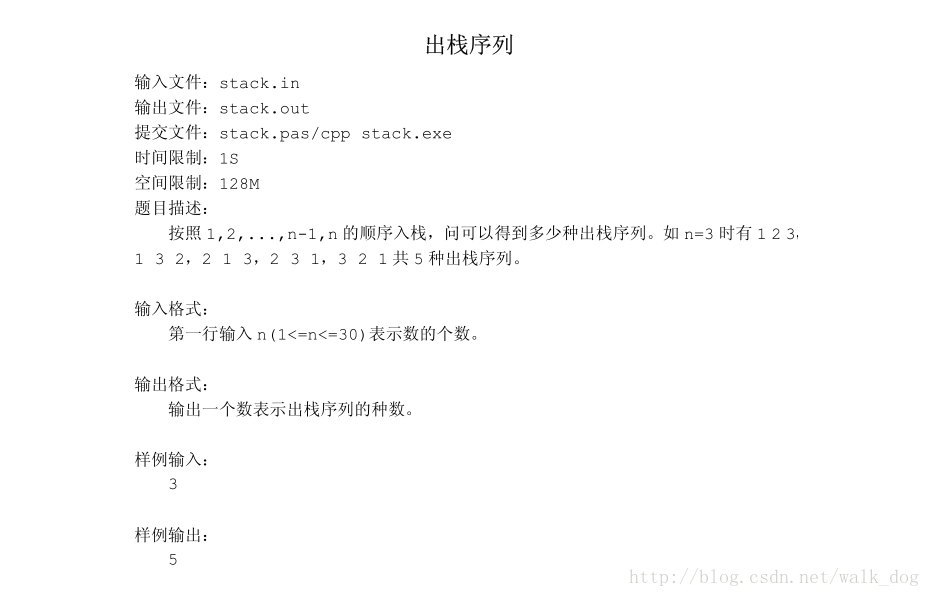

# 动态规划

与贪心类似，也是通过多阶段决策过程来解决问题。每个阶段决策的结果是一个决策结果序列，这个结果序列中，最终哪一个是最优的结果，取决于以后每个阶段的决策，当然每次决策结果序列都必须进行存储。因此是“高效率，高消费的算法”。

​     同时，它又与递归法类似，当问题不能分解为独立的阶段，却又符合最优化原理时，就可以使用动态规划法，通过递归决策过程，逐步找出子问题的最优解，从而决策出问题的解。

## 思想

动态规划和贪心的认识——工具：马尔科夫过程

> **归纳法**是从特殊到一般，属于发散思维；（如：苏格拉底会死；张三会死；李四会死；王五会死……，他们都是人。所以，人都会死。）

> **演绎法**是从一般到特殊，属于汇聚思维。（如：人都会死的；苏格拉底是人。所以，苏格拉底会死。）

已知问题规模为n的前提A，求解一个未知解B。（我们用An表示“问题规模为n的已知条件”）

- 如果从A0添加一个元素，得到A1的变化过程。即A0->A1; 进而有A1->A2; A2->A3; …… ; Ai->Ai+1. 这就是严格的归纳推理，也就是我们经常使用的数学归纳法；
- **对于Ai+1，只需要它的上一个状态Ai即可完成整个推理过程（而不需要更前序的状态）。我们将这一模型称为马尔科夫模型。对应的推理过程叫做“贪心法”。**

然而，Ai与Ai+1往往不是互为充要条件，随着i的增加，有价值的前提信息越来越少，我们无法仅仅通过上一个状态得到下一个状态，因此可以采用如下方案：

- {A1->A2}; {A1, A2->A3}; {A1,A2,A3->A4};……; {A1,A2,...,Ai}->Ai+1. 这种方式就是第二数学归纳法。
- **对于Ai+1需要前面的所有前序状态才能完成推理过程。我们将这一模型称为高阶马尔科夫模型。对应的推理过程叫做“动态规划法”。**


## 案例

### 卡特兰数（动态规划的一种）

其前几项为（从第零项开始） : 1, 1, 2, 5, 14, 42, 132, 429, 1430, 4862, 16796, 58786, 208012, 742900, 2674440, 9694845, 35357670, 129644790, 477638700, 1767263190, 6564120420, 24466267020, 91482563640, 343059613650, 1289904147324, 4861946401452, ...

满足递推公式：h(n) = h(0)\*h(n-1) + h(1)\*h(n-2) + h(2)\*h(n-3) + …… +h(n-1)*h(0) (n>=2)

```js
f[0] = 1, f[1] = 1;
for(int i = 2; i <= n; i++)//i是要求的那个值对应的下标，如：求n=5就要计算到i=5，对应值f[i] === 42
    f[i] = 0
    for(int j = 0; j < i; j++)
        //求i=5的值需要用到前面所有的值，在这里遍历。
        //由公式得 h(0)*h(n-1) j自大只需要到n-1也就是i-1就行了
        f[i] += f[j] * f[i-j-1];//j =>i-1 //f[i-(j+1)] =>f[0]
```


1、n对括号正确匹配组成的字符串数，例如

1对括号：()                                              1种可能

2对括号：()()                                            1种可能

 3对括号：((())) ()(()) ()()() (())() (()())       5种可能

那么问题：n对括号有多少种正确配对的可能？

2、一个栈(无穷大)的进栈序列为1，2，3，…，n，有多少个不同的出栈序列?



```jsx
/**
 * defaultShowCode: true
 */
import {ConsoleReader} from '@/utils/ConsoleLog'
export default ConsoleReader(({console})=>{
//// --------- 执行代码如下 ----------

function generateParenthesis(n: number): string[] {
    const res: string[] = []
    const path: string[] = [];
    const dfs = (left, right) => {
        if (left === 0 && right === 0) {
            return res.push(path.join(''))
        }
        if (left > 0) {
            path.push('(')
            dfs(left - 1, right)
            path.pop()
        }
        if (left < right) {
            path.push(')')
            dfs(left, right - 1);
            path.pop()
        }
    }
    dfs(n,n)
    return res
}
console.log(generateParenthesis(3));

//// ------------- END -------------
});
```

3、n个节点构成的二叉树，共有多少种情形？


```jsx
/**
 * defaultShowCode: true
 */
import {ConsoleReader} from '@/utils/ConsoleLog'
export default ConsoleReader(({console})=>{
//// --------- 执行代码如下 ----------

function generateParenthesis(n) {
  // 卡特兰数
  // 递推公式：h(n) = h(0)*h(n-1)+h(1)*h(n-2)...+h(n-1)*h(0)

  let f = [1, 1]
  for (let i = 2; i < n; i++) {
    // 这里的i表示每一项计算的下标，如i=5，结果为42
    let temp = 0
    for (let j = 0; j < i; j++) {
      temp += f[j] * f[i - j - 1]
    }
    f[i] = temp
  }
  return f.pop()
}

console.log(generateParenthesis(6));

//// ------------- END -------------
});
```

4、求一个凸多边形区域划分成三角形区域的方法数？


> 同上也是卡特兰数的问题

5、在圆上选择2n个点，将这些点成对链接起来使得所得到的n条线段不相交，一共有多少种方法？(下图供参考)


6、n*n的方格地图中，从一个角到另外一个角，不跨越对角线的路径数为h(n).例如， 4×4方格地图中的路径有：


7、n层的阶梯切割为n个矩形的切法数也是。如下图所示：


8、有2n个人排成一行进入剧场。入场费5元。其中只有n个人有一张5元钞票，另外n人只有10元钞票，剧院无其它钞票，问有多少中方法使得只要有10元的人买票，售票处就有5元的钞票找零？

9、甲乙两人比赛乒乓球，最后结果为20∶20，问比赛过程中甲始终领先乙的计分情形的种数。


10、2n个高矮不同的人，排成两排，每排必须是从矮到高排列，而且第二排比对应的第一排的人高，问排列方式有多少种？

### 任意子序列最大和问题

题目：

给定k个整数的序列{N1,N2,...,Nk }，其任意连续子序列可表示为{ Ni, Ni+1, ..., Nj }，其中 1 <= i <= j <= k。最大连续子序列是所有连续子序中元素和最大的一个，例如**给定序列{ -2, 11, -4, 13, -5, -2 }，其最大连续子序列为{11,-4,13}，最大连续子序列和即为20。**

思路：

步骤 1：令状态 **dp[i] 表示以 A[i] 末尾的一个序列，且其序列元素和最大**（例如有10个数，其中i为5时，dp[i]表示，以第5个数结尾的一个序列，可能是A[2],A[3],A[4],A[5],元素和最大）
步骤 2：所以
	对第一种情况，最大和就是 A[i] 本身。
	对第二种情况，最大和是 dp[i-1]+A[i]。
转移方程：dp[i] = max{A[i],dp[i-1]+A[i]}

```jsx
/**
 * defaultShowCode: true
 */
import {ConsoleReader} from '@/utils/ConsoleLog'
export default ConsoleReader(({console})=>{
//// --------- 执行代码如下 ----------

function MaxSubSequence(arr) {
    if (arr.length == 1) return arr[0]
    var dp = [arr[0]]
    for (var i = 1; i < arr.length; i++) {
        dp.push(Math.max(arr[i], dp[i - 1] + arr[i]))
    }
    return Math.max.apply(null, dp)
}

//11,-4,13
console.log(MaxSubSequence([-2, 11, -4, 13, -5, -2]))//20

//// ------------- END -------------
});
```


### 最长不下降子序列问题

题目：

设有由n个不相同的整数组成的数列，记为:a(1)、a(2)、……、a(n)且a(i)<>a(j) (i<>j)
例如3，18，7，14，10，12，23，41，16，24。
若存在i1<i2<i3< … < ie 且有a(i1)<a(i2)< … <a(ie)则称为长度为e的不下降序列。如上例中3，18，23，24就是一个长度为4的不下降序列，同时也有3，7，10，12，16，24长度为6的不下降序列。

思路：

令 **dp[i] 表示以 A[i] 结尾的最长不下降序列长度**。这样对 A[i] 来说就会有两种可能：

 	1,如果存在 A[i] 之前的元素 A[j] (j<i)，使得 **A[j]≤A[i] 且 dp[j]+1>maxJlen**（j遍历中最大的一个值），那么就把 A[i] 跟在以 A[j] 结尾的 LIS 后面，形成一条更长的不下降子序列（令 dp[i]=dp[j]+1）。
 	2,如果 A[i] 之前的元素都比 A[i] 大，那么 A[i] 就只好自己形成一条 LIS，但是长度为 1。

由此可以写出状态转移方程：dp[i] = max{1, dp[j]+1} (j=1,2,....,i-1&&A[j]<A[i])

返回最长子数组长度：

```jsx
/**
 * defaultShowCode: true
 */
import {ConsoleReader} from '@/utils/ConsoleLog'
export default ConsoleReader(({console})=>{
//// --------- 执行代码如下 ----------

//计算长度
function max_len(arr) {
    var dp = []
    for (var i = 0; i < arr.length; i++) {
        var maxJlen = 1
        for (var j = 0; j < i; j++) {
            if (arr[j] < arr[i] && dp[j] + 1 > maxJlen)
            //首先，因为是递增序列，判断j元素得小于i元素
            //然后，j元素小于了i元素，升序子序列就可以加入i元素了
            //最后，判断每种小于i的情况，长度最长的一个加1
                maxJlen = dp[j] + 1
        }
        dp.push(maxJlen)
    }
    return Math.max.apply(null, dp)
}
//3，7，10，12，16，24
console.log(max_len([3, 18, 7, 14, 10, 12, 23, 41, 16, 24]))//6

//// ------------- END -------------
});
```

返回最长子数组序列：

```jsx
/**
 * defaultShowCode: true
 */
import {ConsoleReader} from '@/utils/ConsoleLog'
export default ConsoleReader(({console})=>{
//// --------- 执行代码如下 ----------

//输出数组
function max_rise(arr) {
    var dpArr = []//纪录dp对应的子序列
    var dp = []
    var maxI = [0, 0]//纪录dp[i]中最大值的index和value
    for (var i = 0; i < arr.length; i++) {
        var maxJlen = 1//遍历dp[j]时最大值
        dpArr.push([arr[i]])
        for (var j = 0; j < i; j++) {
            if (arr[j] < arr[i] && dp[j] + 1 > maxJlen) {
                maxJlen = dp[j] + 1
                dpArr[i] = dpArr[j].concat(arr[i])
            }
        }
        dp.push(maxJlen)
        if (maxI[1] < maxJlen) maxI = [i, maxJlen]//index为i，最大值为maxJlen
    }
    console.log(dpArr)
    return dpArr[maxI[0]]
}
console.log(max_rise([3, 18, 7, 14, 10, 12, 23, 41, 16, 24]))//3，7，10，12，16，24


//// ------------- END -------------
});
```

### 12爬楼梯的最少成本

```jsx
/**
 * defaultShowCode: true
 */
import {ConsoleReader} from '@/utils/ConsoleLog'
export default ConsoleReader(({console})=>{
//// --------- 执行代码如下 ----------


//数组的每个下标作为一个阶梯，第 i 个阶梯对应着一个非负数的体力花费值 cost[i]（下标从 0 开始）。
//
// 每当爬上一个阶梯都要花费对应的体力值，一旦支付了相应的体力值，就可以选择向上爬一个阶梯或者爬两个阶梯。
//
// 请找出达到楼层顶部的最低花费。在开始时，你可以选择从下标为 0 或 1 的元素作为初始阶梯。
//
//
//
// 示例 1：
//
//
//输入：cost = [10, 15, 20]
//输出：15
//解释：最低花费是从 cost[1] 开始，然后走两步即可到阶梯顶，一共花费 15 。
//
//
// 示例 2：
//
//
//输入：cost = [1, 100, 1, 1, 1, 100, 1, 1, 100, 1]
//输出：6
//解释：最低花费方式是从 cost[0] 开始，逐个经过那些 1 ，跳过 cost[3] ，一共花费 6 。
//
//
//
//
// 提示：
//
//
// 2 <= cost.length <= 1000
// 0 <= cost[i] <= 999
//
//
//
//
// 注意：本题与主站 746 题相同： https://leetcode-cn.com/problems/min-cost-climbing-stairs/
//
// Related Topics 数组 动态规划
// 👍 19 👎 0


//leetcode submit region begin(Prohibit modification and deletion)
function minCostClimbingStairs(cost: number[]): number {
    // dp[i] 表示达到下标 i 的最小花费。
    //创建长度为 n+1的数组dp，其中 dp 表示达到下标 i 的最小花费。
    //由于可以选择下标 0 或 1 作为初始阶梯，因此有dp[0]=dp[1]=0。
    let dp = [...Array(cost.length+1)];
    dp[0] = dp[1] = 0;
    for(let i=2;i<=cost.length;i++){
        dp[i]=Math.min(dp[i-1]+cost[i-1],dp[i-2]+cost[i-2])
    }
    return dp.pop()
};
console.log(minCostClimbingStairs([1, 100, 1, 1, 1, 100, 1, 1, 100, 1]))
//leetcode submit region end(Prohibit modification and deletion)

//// ------------- END -------------
});
```

### 14房屋偷盗

```jsx
/**
 * defaultShowCode: true
 */
import {ConsoleReader} from '@/utils/ConsoleLog'
export default ConsoleReader(({console})=>{
//// --------- 执行代码如下 ----------
    
//一个专业的小偷，计划偷窃沿街的房屋。每间房内都藏有一定的现金，影响小偷偷窃的唯一制约因素就是相邻的房屋装有相互连通的防盗系统，如果两间相邻的房屋在同一晚上被
//小偷闯入，系统会自动报警。
//
// 给定一个代表每个房屋存放金额的非负整数数组 nums ，请计算 不触动警报装置的情况下 ，一夜之内能够偷窃到的最高金额。
//
//
//
// 示例 1：
//
//
//输入：nums = [1,2,3,1]
//输出：4
//解释：偷窃 1 号房屋 (金额 = 1) ，然后偷窃 3 号房屋 (金额 = 3)。
//     偷窃到的最高金额 = 1 + 3 = 4 。
//
// 示例 2：
//
// 【2，100，2，100，2】
//输入：nums = [2,7,9,3,1]
//输出：12
//解释：偷窃 1 号房屋 (金额 = 2), 偷窃 3 号房屋 (金额 = 9)，接着偷窃 5 号房屋 (金额 = 1)。
//     偷窃到的最高金额 = 2 + 9 + 1 = 12 。
//

//
// 提示：
//
//
// 1 <= nums.length <= 100
// 0 <= nums[i] <= 400
//
//
//
//
// 注意：本题与主站 198 题相同： https://leetcode-cn.com/problems/house-robber/
// Related Topics 数组 动态规划
// 👍 9 👎 0


//leetcode submit region begin(Prohibit modification and deletion)
function rob(nums: number[]): number {
    //输入：nums = [2,7,9,3,1]
    //输出：12
    // dp[i] 代表盗窃了i个房屋（房屋号从0计算），累计最优解
    // dp[i] = Math.max(dp[i-1],dp[i-2]+nums[i])
    // 然后可以选择盗窃最后一个或者不盗窃最后一个
    if (nums.length === 0) {
        return 0
    }
    if (nums.length === 1) {
        return nums[0]
    }
    const dp: number[] = [...Array(nums.length)];
    dp[0] = nums[0];
    dp[1] = Math.max(nums[0], nums[1]);
    for (let i = 2; i < nums.length; i++) {
        dp[i] = Math.max(dp[i - 1], dp[i - 2] + nums[i])
    }
    return dp.pop()
};
console.log(rob([2,7,9,3,1]))
//leetcode submit region end(Prohibit modification and deletion)
    
//// ------------- END -------------
});
```
