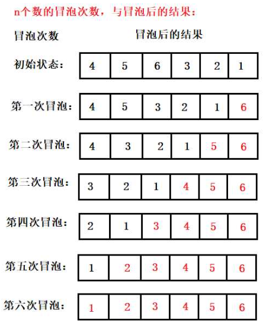
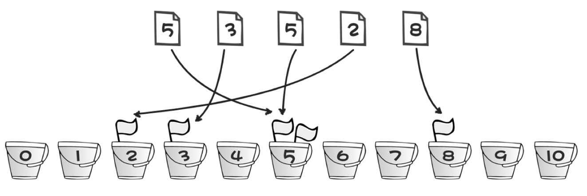
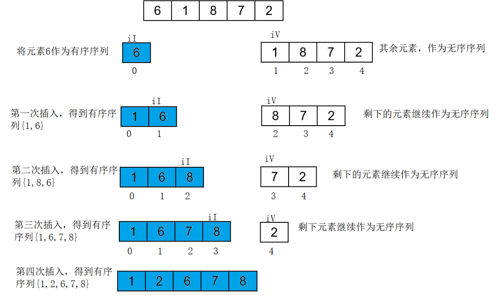

# 常见数据结构与排序

**数据结构是什么**？

一种组织和存储数据的方式，让数据可以更方便的被获取和修改。

数据结构**包括**：

数据的**集合**、数据之间的**关系**和应用在数据上的**方法和操作**。

**什么是ADT**
抽象数据类型(Abstract Data Type)是冲数据使用者的角度去看数据类型。

抽象数据类型是对数据的一种抽象描述，是一种数学上的约束。

数据结构是ADT的底层实现。ADT是数据结构的逻辑约束。

**链表**

web浏览器历史管理，底层内存管理，实现哈希表，文件系统。

**堆栈**
程序的递归，graham扫描寻找凸图形，搜索单调矩阵，聚类分析中最邻近分类算法(KNN)。

**队列**
用于实现缓冲区，用于实现广度优先遍历，实现有限队列，动画库。

**哈希表(散列)**

用于实现字典(switch/map)，用于实现集合(Set)分布式应用(一致性哈希:Redis)

**树**

二叉树/平衡二叉树/对话游戏(是否选择)/Trie树(字典查询)/dom树。

**图**

最短路径问题，社交网络。

**优先遍历?**

深度优先用栈，广度优先用队列

## 数据结构-栈

使用数组模拟栈的实现

```js
class Stack {
  constructor(length) {
    this.max = length || Infinity
    this.data = []
  }

  get top() {
    return this.data.length - 1
  }

  get length() {
    return this.data.length
  }

  push(key) {
    if (this.length === this.max) throw Error('stack overflow')
    this.data.push(key)
  }

  pop() {
    if (this.length === 0) throw Error('stack empty')
    return this.data.pop()
  }
}

const stack = new Stack(5)
for (let i = 0; i < 5; i++) {
  stack.push(`node${i}`)
}
console.log(stack)
stack.pop()
console.log(stack)
```

## 数据结构-队列

利用两个栈实现一个队列

```js
class Queue {
  constructor() {
    this.downStack = new Stack();
    this.upStack = new Stack();
  }

  enQueue(key) {
    this.upStack.push(key);
    return this;
  }

  handleUpToDown() {
    while (this.upStack.length) {
      this.downStack.push(this.upStack.pop())
    }
  }

  deQueue() {
    if (!this.downStack.length) {
      this.handleUpToDown();
    }
    try {
      return this.downStack.pop()
    } catch (e) {
      throw Error('queue empty')
    }
  }
}
const queue = new Queue();

queue.enQueue(1)
  .enQueue(2)
  .enQueue(3)
  .enQueue(4)
  .enQueue(5)
console.log(queue)

console.log(queue.deQueue());
queue.enQueue(6)
console.log(queue.deQueue());
console.log(queue.deQueue());
console.log(queue.deQueue());
console.log(queue.deQueue());
queue.enQueue(7)
console.log(queue.deQueue());

console.log(queue)

```

## 数据结构-双向链表

```js
class ListNode {
  constructor(key) {
    this.prev = null;
    this.next = null;
    this.key = key
  }

  static create(key) {
    return new ListNode(key)
  }
}

class Controller {
  constructor() {
    this.head = null;
  }

  insert(...listNodes) {
    if (listNodes && listNodes.length) {
      listNodes.forEach(listNode => {
        this.insertOne(listNode)
      })
    }
  }

  insertOne(listNode) {
    if (this.head) {
      [listNode.next, this.head.prev, this.head] =
        [this.head, listNode, listNode]
    } else {
      // 第一次创建
      this.head = listNode;
    }
    return this;
  }

  search(key) {
    let p = this.head
    while (p && key !== p.key) {
      p = p.next
    }
    return p
  }

  delete(listNode) {
    const {prev, next} = listNode;
    delete listNode.prev;
    delete listNode.next;
    if (listNode === this.head) {
      this.head = next;
    }

    if (prev) {
      prev.next = next;
    }
    if (next) {
      next.prev = prev;
    }
  }

  pop() {
    let p = this.head
    while (p && !p.next) {
      p = p.next
    }
    this.delete(p)
    return p;
  }

}

const node1 = new ListNode('node1');
const node2 = new ListNode('node2');
const node3 = new ListNode('node3');
const node4 = new ListNode('node4');
const node5 = new ListNode('node5');
const node6 = new ListNode('node6');

const controller = new Controller()
controller.insert(node6,node5,node4,node3,node2,node1);

console.log(controller.head) // node1

let searchNode = controller.search('node6');
console.log(searchNode); // node6
console.log(searchNode.prev); // node5

controller.delete(searchNode);

searchNode = controller.search('node6');
console.log(searchNode) // null
```

## 数据结构-二叉树

```js
// 二叉树
class TreeNode {
  constructor(key) {
    this.lNode = null;
    this.rNode = null;
    this.key = key;
  }
  getLChildren() {
    return this.lNode;
  }

  getRChildren() {
    return this.rNode;
  }
  insertL(node) {
    if (this.getLChildren()) return false;
    this.lNode = node
    return this
  }

  insertR( node) {
    if (this.getRChildren()) return false;
    this.rNode = node
    return this
  }

  deleteL() {
    delete this.lNode
    return this
  }

  deleteR() {
    delete this.rNode
    return this
  }
}

class TreeController {
  constructor() {
    this.head = null;
  }

  createNode(key) {
    const node = new TreeNode(key)
    if(!this.head){
      this.head = node
    }
    return node
  }

  preorderTraversal = (callback, node = this.head) => { // 先序遍历
    if (!node) return;
    callback(node);
    this.preorderTraversal(callback, node.lNode);
    this.preorderTraversal(callback, node.rNode);
  }
  inorderTraversal = (callback, node = this.head) => { // 中序遍历
    if (!node) return;
    this.inorderTraversal(callback, node.lNode);
    callback(node);
    this.inorderTraversal(callback, node.rNode);
  }
  postorderTraversal = (callback, node = this.head) => { // 后序遍历
    if (!node) return;
    this.postorderTraversal(callback, node.lNode);
    this.postorderTraversal(callback, node.rNode);
    callback(node);
  }
}
///////////// 测试
const treeController = new TreeController();

const node1 = treeController.createNode(1);
const node2 = treeController.createNode(2)
const node3 = treeController.createNode(3)
const node4 = treeController.createNode(4)
const node5 = treeController.createNode(5)
const node6 = treeController.createNode(6)
const node7 = treeController.createNode(7)
const node8 = treeController.createNode(8)
const node9 = treeController.createNode(9)
/**
 *         1
 *      2    3
 *    4  X  5   6
 *   7 X   8 9 X X
 *
 * */
node1.insertL(node2);
node1.insertR(node3);
node2.insertL(node4);
node4.insertL(node7);
node3.insertL(node5);
node5.insertL(node8);
node5.insertR(node9);
node3.insertR(node6);
console.log('/////////先序/////////')
treeController.preorderTraversal((node)=>{
  console.log(node.key)
})
console.log('/////////中序/////////')
treeController.inorderTraversal((node)=>{
  console.log(node.key)
})
console.log('/////////后序/////////')
treeController.postorderTraversal((node)=>{
  console.log(node.key)
})
```

## 排序-冒泡



```js
const bubbleSort(a){
	for(let i=a.length ;i>0;i--){
        for(let j=1;j<i;j++){
            if(a[j]>a[j-1]){
                [a[j],a[j-1]] = [a[j-1],a[j]]
            }
        }
    }
}
const arr = [5,8,6,3,2,1,9];

bubble_sort(arr)
console.lg(arr)
```

## 排序-桶排序

桶排序，**只能**去**排序整数**，因为需要按照下标排序。



```js
const bucket = (array)=>{
  const max = Math.max(...array)
  const tempArr = Array.from(Array(max)).map(()=>[]);

  array.forEach(item=>{
    tempArr[item-1].push(item)
  })
  return [].concat(...tempArr) // 注意concat只能打平一层
}

const a = bucket([4,4,2,1,6,3,8,1,8,9])
console.log(a)
```

## 排序-插入排序



```js
const {parentPort} = require('worker_threads');
const process = require('process');

async function main(
  {dataArr}
) {
  // 插入排序
  function insertion_sort(A) {
    //   1;N;N-1
    for (let j = 1; j < A.length; j++) {
      // N-1
      const key = A[j];
      // N-1
      let i = j - 1
      // Mk
      while (i >= 0 && A[i] > key) {// 升序
        // 如果A中的比key大往后移,所以升序
        // Mk-1
        A[i + 1] = A[i];
        // Mk-1
        i--;
      } // 最坏:(n-1)+(1+2+...+n-1) = (n-1)+(n+1/2(n^2-1))
      // N-2
      A[i + 1] = key;
    }
  }

  // 下届:Ω(n)
  // 上届:O(n^2)
  console.time('sort')
  insertion_sort(dataArr)
  console.timeEnd('sort')
  return dataArr
}

parentPort.on('message', async msg => {
  const data = await main(msg)
  parentPort.postMessage(data);
  process.exit()
})
```
