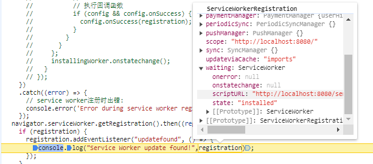
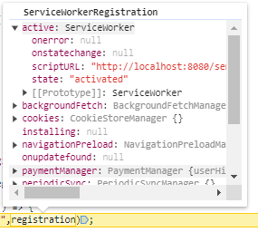
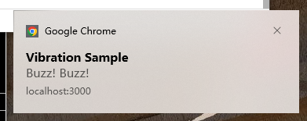

# ServiceWorker API

参考1：https://www.cnblogs.com/jaycethanks/p/16502676.html

参考2：https://developer.mozilla.org/zh-CN/docs/Web/API/Service_Worker_API

## SerivceWorker

**ServiceWorker 接口**提供了对 **Serivce Worker 的引用**。多个浏览上下文（例如页面、工作线程等）可以与同一个 Service Worker 相关联，每个**浏览上下文**通过一个**唯一**的 **Service Worker 对象**进行**关联**。

一个 Service Worker 对象可以通过许多属性来使用：

- [`ServiceWorkerRegistration.active`](https://developer.mozilla.org/en-US/docs/Web/API/ServiceWorkerRegistration/active)
- [`ServiceWorkerGlobalScope.serviceWorker`](https://developer.mozilla.org/en-US/docs/Web/API/ServiceWorkerGlobalScope/serviceWorker)
- [`ServiceWorkerContainer.controller`](https://developer.mozilla.org/en-US/docs/Web/API/ServiceWorkerContainer/controller)— 当服务人员处于`activating`或`activated`状态时
- [`ServiceWorkerRegistration.installing`](https://developer.mozilla.org/en-US/docs/Web/API/ServiceWorkerRegistration/installing)— 当 Service Worker 处于`installing`状态时
- [`ServiceWorkerRegistration.waiting`](https://developer.mozilla.org/en-US/docs/Web/API/ServiceWorkerRegistration/waiting)— 当 Service Worker 处于`installed`状态时

### state

**`state`**的只读属性，返回一个表示 Service Worker 当前**状态**的字符串。

[`"parsed"`](https://developer.mozilla.org/en-US/docs/Web/API/ServiceWorker/state#parsed)

Service Worker 下载并确认**可运行**后的**初始状态**。

service worker永远**不会**被**更新**到**这个状态**，所以它永远**不会**是**ServiceWorker.statechange_event 的值**

[`"installing"`](https://developer.mozilla.org/en-US/docs/Web/API/ServiceWorker/state#installing)

处于这种状态的 service worker 被认为是一个**正在安装的worker**。

在此状态下，可在安装事件处理程序中**调用ExtendableEvent.waitUntil()** 来**延长**安装worker的**生命周期**，直到传入的 **promise 成功解析**。

这主要用于**确保** service worker 在所有的**核心缓存**都被**填充之前**是 **not active** 的。

[`"installed"`](https://developer.mozilla.org/en-US/docs/Web/API/ServiceWorker/state#installed)

处于这种状态的 service worker 被认为是一个**等待的 worker**。

[`"activating"`](https://developer.mozilla.org/en-US/docs/Web/API/ServiceWorker/state#activating)

当一个新的service worker 脚本被执行，但**还没有完全激活**时，Service Worker 处于**activating** 状态。这通常发生在**安装阶段之后**，但在**激活阶段之前**。在这个阶段，新的service worker **可以预加载资源、执行一些初始化**操作等。但是，它还**不能控制任何客户端页面**，**不会分派任何功能事件**。

在此状态下，可以在 **onactivate 事件**处理程序中**调用 ExtendableEvent.waitUntil()** 来**延长** active worker的**生命周期**，直到传递的**promise 成功解决**。

[`"activated"`](https://developer.mozilla.org/en-US/docs/Web/API/ServiceWorker/state#activated)

一旦service worker **完全激活**并准备好控制客户端页面时，它的状态将变为 **activated**。这表示service worker 已经**成功安装并激活**，并且可以控制客户端页面，**拦截网络请求，执行离线缓存**等操作。

[`"redundant"`](https://developer.mozilla.org/en-US/docs/Web/API/ServiceWorker/state#redundant)

**新的** Service Worker 正在**替换当前**的 Service Worker，或者当前的 Service Worker 由于**安装失败而被丢弃**。

### postMessage()

postMessage() 方法向 [`ServiceWorker`](https://developer.mozilla.org/en-US/docs/Web/API/ServiceWorker) 发送消息。第**一个参数**是要发送给 Service Worker 的**数据**。数据可以是任何可由[结构化克隆算法](https://developer.mozilla.org/en-US/docs/Web/API/Web_Workers_API/Structured_clone_algorithm)处理的 JavaScript 对象。

service worker可以使用 [client.postMessage()](https://developer.mozilla.org/en-US/docs/Web/API/Client/postMessage) 方法将信息发回给它的客户端。

消息不会被发送回这个ServiceWorker对象，而是通过navigator.serviceWorker被发送回关联的ServiceWorkerContainer。

> 结构化克隆算法：StructuredClone() 全局函数，用于创建给定值的[深度克隆](https://developer.mozilla.org/en-US/docs/Glossary/Deep_copy)。
>
> 注意：自 2022 年 3 月起，此功能适用于最新的设备和浏览器版本。此功能可能无法在较旧的设备或浏览器中使用。
>
> 此函数可用于[深度复制](https://developer.mozilla.org/en-US/docs/Glossary/Deep_copy)JavaScript 值。它还支持循环引用，如下所示：
>
> ```js
> // 创建一个具有值和自身循环引用的对象。
> const original = { name: "MDN" };
> original.itself = original;
> // Clone it
> const clone = structuredClone(original);
> console.assert(clone !== original); // 对象不同引用不同
> console.assert(clone.name === "MDN"); // 有相同的value
> console.assert(clone.itself === clone); // 里边的循环引用也被复制（新的）
> ```

```js
navigator.serviceWorker.register("service-worker.js");

navigator.serviceWorker.ready.then((registration) => {
  registration.active.postMessage(
    "创建后立即发送的测试消息",
  );
});
```

为了接收消息，服务工作线程必须在其全局范围内`service-worker.js`侦听该[`message`](https://developer.mozilla.org/en-US/docs/Web/API/ServiceWorkerGlobalScope/message_event)事件。

```js
// This must be in `service-worker.js`
addEventListener("message", (event) => {
  console.log(`Message received: ${event.data}`);
});
```

### statechange event 客户端调用

每当 [`ServiceWorker.state`](https://developer.mozilla.org/en-US/docs/Web/API/ServiceWorker/state) **发生变化**时都会触发该事件（parsed 状态不会触发）。

```js
let serviceWorker;
if (registration.installing) {
  serviceWorker = registration.installing;
  document.querySelector("#kind").textContent = "installing";
} else if (registration.waiting) {
  serviceWorker = registration.waiting;
  document.querySelector("#kind").textContent = "waiting";
} else if (registration.active) {
  serviceWorker = registration.active;
  document.querySelector("#kind").textContent = "active";
}

if (serviceWorker) {
  logState(serviceWorker.state);
  serviceWorker.addEventListener("statechange", (e) => {
    logState(e.target.state);
  });
}
```

## ServiceWorkerContainer

ServiceWorkerContainer 是 ServiceWorker 的控制器，其主要提供了**注册、注销**和**更新 ServiceWorker **的功能，以及**访问 ServiceWorker 线程及其注册的状态**。

> 最重要的是，它公开了[`ServiceWorkerContainer.register()`](https://developer.mozilla.org/en-US/docs/Web/API/ServiceWorkerContainer/register)用于注册 Service Worker 的方法，以及[`ServiceWorkerContainer.controller`](https://developer.mozilla.org/en-US/docs/Web/API/ServiceWorkerContainer/controller)用于确定当前页面是否处于活跃控制状态。

### controller

```js
ServiceWorkerContainer.controller // Read only
```

如果 ServiceWorker 状态为 **activating** 或 **activated** ，则**返回一个 ServiceWorker 对象**（与**ServiceWorkerRegistration.active**返回的**相同**对象）表明目前页面由 Service Worker **控制**。

在进行**强制刷新**请求（Shift + 刷新）或者**没有活动**的 Service Worker 时，此属性**返回null**。

总结，**返回**一个**活跃的 ServiceWorker 对象**。

```js
if ("serviceWorker" in navigator) {
  // 做一次一次性检查，看看服务工作者是否处于控制之中。
  if (navigator.serviceWorker.controller) {
    console.log(
      `此页面目前由${navigator.serviceWorker.controller}控制。`,
    );
  } else {
    console.log("这个页面目前不是由service worker控制的。");
  }
} else {
  console.log("不支持 Service workers。");
}
```

### ready

```js
ServiceWorkerContainer.ready // Read only
```

提供了一种延迟代码执行直到服务工作线程处于活动状态的方法。它返回一个**永远不会被拒绝**的 **Promise**，并且会**无限期地等待**，**直到**与**当前页面**相关联的 ServiceWorkerRegistration 具有一个**active 的 Service Worker**。

一旦满足了这个条件，它将会**返回**与该**ServiceWorkerRegistration相关的Promise对象**。

```js
const URL_SW = `${process.env.PUBLIC_URL}/sw.js`

export function register() {
  if ('serviceWorker' in navigator) {
    window.addEventListener('load', () => {
      navigator.serviceWorker.register(URL_SW).then((result) => {
        console.log("!!!!! service worker register result", result.active)
      })
      function showNotification() {
        Notification.requestPermission().then((result) => {
          if (result === "granted") {
            navigator.serviceWorker.ready.then((registration) => {
              registration.showNotification("Vibration Sample", {
                body: "Buzz! Buzz!",
                icon: "../images/touch/chrome-touch-icon-192x192.png",
                vibrate: [200, 100, 200, 100, 200, 100, 200],
                tag: "vibration-sample",
              });
            });
          }
        });
      }
      showNotification();
    })
  }
}
```

### getRegistration()

这个方法的作用是**获取**与当前文档 **URL 匹配**的 **ServiceWorkerRegistration 对象**。

在Web应用程序中，可能存在**多个 Service Worker 注册**，每个注册**都有**自己的**范围（scope）**，表示其**控制的URL范围**。

如果**找到匹配**的注册，则 Promise 将解析为**ServiceWorkerRegistration 对象**；如果**没有匹配**的注册，则 Promise 将解析为 **undefined**。

这使您可以**检查页面是否已经注册了Service Worker**，并且在必要时对其进行操作。

```js
navigator.serviceWorker.getRegistration("/app").then((registration) => {
  if (registration) {
    document.querySelector("#status").textContent =
      "ServiceWorkerRegistration found.";
  }
});
```

### register()

register() 方法用于**创建或更新**了给定scriptURL的**ServiceWorkerRegistration**。

> 关于范围的含义和用法经常存在混淆。因为service worker的作用域**不能**比它自己的位置**更宽**，所以只有当你**需要**一个**比默认值更窄**的**作用域时**才使用scope选项。

下面的代码，如果包含在站点的根example.com/index.html中，将只适用于example.com/product下的资源。

```js
if ("serviceWorker" in navigator) {
  // declaring scope manually
  navigator.serviceWorker.register("/sw.js", { scope: "/product/" }).then(
    (registration) => {
    // 注意，这里获取的 registration 第一次加载时，还不是 active 状态，后边加载才是 active 的，如果需要 active，可以使用ready属性。
      console.log("Service worker registration succeeded:", registration);
    },
    (error) => {
      console.error(`Service worker registration failed: ${error}`);
    },
  );
} else {
  console.error("Service workers are not supported.");
}
```

### startMessages()

startMessages 方法的作用是开始**允许 service worker 向其控制的页面发送消息（`Client.postMessage()` 发送的消息）**。

默认情况下，服务工作线程在页面加载完成后才会开始发送消息，但**使用 `startMessages()` 方法**可以在页面内容**加载完成之前**就开始**发送消息**。这对于需要在页面加载过程中进行通信或执行某些操作的情况非常有用。

> 假设我们希望在页面内容加载完成之前就立即发送消息，以确保用户能够尽快看到更新。这时，我们可以使用 `ServiceWorkerContainer.startMessages()` 方法来启动消息传递，使得服务工作线程可以在页面加载过程中发送消息，从而更快地响应用户操作。

### controllerchange event 客户端调用

controllerchange 事件在文档关联的 **ServiceWorkerRegistration** 获取一个**新的 active worker 时触发**。

```js
navigator.serviceWorker.addEventListener("controllerchange", () => {
  console.log("当前浏览上下文的控制器已更改。");
});
```

### message event 客户端调用

当对象接**收到传入消息时**触发（例如通过调用[`MessagePort.postMessage()`](https://developer.mozilla.org/en-US/docs/Web/API/MessagePort/postMessage)）。

service worker 中调用 postMessage 方法，客户端接收信息触发事件。

在此示例中，服务工作线程从[`fetch`](https://developer.mozilla.org/en-US/docs/Web/API/ServiceWorkerGlobalScope/fetch_event)事件中获取客户端的 ID，然后使用以下命令向其发送消息[`Client.postMessage`](https://developer.mozilla.org/en-US/docs/Web/API/Client/postMessage)：

```js
// service-worker.js
async function messageClient(clientId) {
  const client = await clients.get(clientId);
  client.postMessage("Hi client!");
}

addEventListener("fetch", (event) => {
  messageClient(event.clientId);
  event.respondWith(() => {
    // …
  });
});
```

客户端可以通过监听事件来接收消息`message`：

```js
// main.js
navigator.serviceWorker.addEventListener("message", (message) => {
  console.log(message);
});
```

或者，客户端可以使用事件处理程序接收消息`onmessage`：

```js
// main.js
navigator.serviceWorker.onmessage = (message) => {
  console.log(message);
};
```

## ServiceWorkerRegistration

ServiceWorkerRegistration 用于**表示**和**管理 **Service Worker 的**注册信息**。（也可以理解为 Service Worker 被实例化。）

通过注册 Service Worker，您可以为**同源**的一个或多个**页面**提供**控制**，并且这些注册信息将**被浏览器持久地维护**。

这使得  Service Worker 能够在**后台持续运行**，并且可以在浏览器重新启动或页面刷新后继续工作，从而**提供**了强大的**离线缓存、推送通知**等**功能**。

### serviceWorker状态属性

ServiceWorkerRegistration **管理 **ServiceWorker 的**注册信息**，一个 ServiceWorkerRegistration 中有多个 ServiceWorker 下图中 waiting 和 active 中各一个，分别表示**刚刚更新的**新的 ServiceWorker （**安装完成**了，但是**没有激活**，等待旧的执行完，或者运行 skipWaiting() 强制激活，或者关闭标签页再打开。）和**旧的激活中**的 ServiceWorker。





#### active

active 属性，当  [`ServiceWorker.state`](https://developer.mozilla.org/en-US/docs/Web/API/ServiceWorker/state) 为 `activating` 或 `activated` 时，返回 ServiceWorker 对象，否则返回 null。

#### installing

active 属性，当  [`ServiceWorker.state`](https://developer.mozilla.org/en-US/docs/Web/API/ServiceWorker/state) 为 `installing` 时，返回 ServiceWorker 对象，否则返回 null。

#### waiting

active 属性，当  [`ServiceWorker.state`](https://developer.mozilla.org/en-US/docs/Web/API/ServiceWorker/state) 为 `installed` 时，返回 ServiceWorker 对象，否则返回 null。

### scope

唯一标识符。

### updatefound event

每当属性获取新的 Service Worker 时，都会触发**`updatefound`**该接口的事件 。

```js
const registration = await navigator.serviceWorker.getRegistration();
if (registration) {
  registration.addEventListener("updatefound", () => {
    console.log("Service Worker update found!");
  });
}
```

### update()

调用 **`update()`** 的方法 [`ServiceWorkerRegistration`](https://developer.mozilla.org/en-US/docs/Web/API/ServiceWorkerRegistration) 尝试**更新 Service Worker**。如果新Service Worker 与当前 Service Worker 的**字节不完全相同**，则会**安装新**工作程序。

> 如果上次提取发生在 24 小时前，则工作线程的提取将绕过任何浏览器缓存。

```js
if ("serviceWorker" in navigator) {
  navigator.serviceWorker
    .register("/sw.js", { scope: "/" })
    .then((registration) => {
      // registration worked
      console.log("Registration succeeded.");
      button.onclick = () => {
        registration.update();
      };
    })
    .catch((error) => {
      // registration failed
      console.error(`Registration failed with ${error}`);
    });
}
```

### showNotification()

用于弹出一个提示框，在活动的 Service Worker 上创建通知。

更多配置项：https://developer.mozilla.org/en-US/docs/Web/API/ServiceWorkerRegistration/showNotification



```js
const URL_SW = `${process.env.PUBLIC_URL}/sw.js`

export function register() {
  if ('serviceWorker' in navigator) {
    window.addEventListener('load', () => {
      navigator.serviceWorker.register(URL_SW).then((result) => {
        console.log("!!!!! service worker register result", result.active)
      })
      function showNotification() {
        Notification.requestPermission().then((result) => {
          if (result === "granted") {
            navigator.serviceWorker.ready.then((registration) => {
              registration.showNotification("Vibration Sample", {
                body: "Buzz! Buzz!",
                icon: "../images/touch/chrome-touch-icon-192x192.png",
                vibrate: [200, 100, 200, 100, 200, 100, 200],
                tag: "vibration-sample",
              });
            });
          }
        });
      }
      showNotification();
    })
  }
}
```

## Client

Client接口表示**可执行的上下文**，例如 Worker 或 SharedWorker 。窗口客户端由更具体的WindowClient表示。

您可以**通过 Clients.matchAll() 和 Clients.get()** 等方法**获取Client**/WindowClient对象。

### id

只读属性，返回对象 [`Client`](https://developer.mozilla.org/en-US/docs/Web/API/Client) 的通用**唯一标识符**（也是 event.clientId）。

### type

表示 Service Worker **正在控制**的**客户端的类型**。

一个字符串，表示客户端类型。该值可以是以下之一

- `"window"`
- `"worker"`
- `"sharedworker"`

### postMessage()

[`Client.postMessage()`](https://developer.mozilla.org/en-US/docs/Web/API/Client/postMessage) 向客户端发送消息。

```js
addEventListener("fetch", (event) => {
  event.waitUntil(
    (async () => {
      // Exit early if we don't have access to the client.
      // Eg, if it's cross-origin.
      if (!event.clientId) return;

      // Get the client.
      const client = await self.clients.get(event.clientId);
      // Exit early if we don't get the client.
      // Eg, if it closed.
      if (!client) return;

      // Send a message to the client.
      client.postMessage({
        msg: "Hey I just got a fetch from you!",
        url: event.request.url,
      });
    })(),
  );
});
```

收到该消息：

```js
navigator.serviceWorker.addEventListener("message", (event) => {
  console.log(event.data.msg, event.data.url);
});
```

## Clients

该`Clients`接口提供对 [`Client`](https://developer.mozilla.org/en-US/docs/Web/API/Client) 对象的访问。

### claim()

当一个 service worker 被**初始注册**时，页面在**下次加载之前不会使用它**。claim()方法使这些页面**立即得到控制**。

请注意，这会导致你的 service worker 控制定期通过网络加载的页面，或者可能通过不同的service worker加载的页面。

```js
self.addEventListener("activate", (event) => {
  event.waitUntil(clients.claim());
});
```

### get()

Clients 接口的 get() 方法，**获取**与给定**id**匹配的 **service Worker client** ，并将其返回在一个 **Promise** 中。

```js
self.clients.get(id).then((client) => {
  self.clients.openWindow(client.url);
});
```

### matchAll()

返回一个 service worker Client 对象**列表**的 **Promise**。

[`options`](https://developer.mozilla.org/en-US/docs/Web/API/Clients/matchAll#options) 

选项对象允许您设置匹配操作的选项。可用选项有：

- [`includeUncontrolled`](https://developer.mozilla.org/en-US/docs/Web/API/Clients/matchAll#includeuncontrolled)

  布尔值 — 如果设置为 `true`，则匹配操作将返回与当前 Service Worker 具有相同源的所有 Service Worker 客户端。否则，它仅返回当前 Service Worker 控制的 Service Worker 客户端。默认为`false`.

- [`type`](https://developer.mozilla.org/en-US/docs/Web/API/Clients/matchAll#type)

  设置您想要匹配的 client 类型。可用值为`"window"`、`"worker"`、`"sharedworker"`和 `"all"`。

  默认为`"window"`.

```js
clients.matchAll(options).then((clientList) => {
  for (const client of clientList) {
    if (client.url === "index.html") {
      clients.openWindow(client);
      // or do something else involving the matching client
    }
  }
});
```

## ServiceWorkerGlobalScope

Service Worker 的**全局执行上下文**（就是 ws.js 中的 this）。

### activate event

当**获取新的 Worker 时**，会触发**`activate`**该接口的事件。

此事件触发的时间点通常是**清理旧缓存**以及其他与你的 service worker 的**先前版本相关的东西**的好时机。

```js
self.addEventListener("activate", (event) => {
  const cacheAllowlist = ["v2"];

  event.waitUntil(
    caches.forEach((cache, cacheName) => {
      if (!cacheAllowlist.includes(cacheName)) {
        return caches.delete(cacheName);
      }
    }),
  );
});
```

### fetch event

**`fetch`** 当主应用程序线程**发出网络请求时**，会在 Service Worker 的全局范围内触发该事件。它使 Service Worker 能够**拦截网络请求**并发送自定义响应（例如，来自本地缓存）。

不仅包括[`fetch()`](https://developer.mozilla.org/en-US/docs/Web/API/fetch)来自**主线程的显式调用**，还包括浏览器在**页面加载后**发出的**加载页面**和**子资源**（例如 **JavaScript、CSS 和图像**）的**隐式网络请求**。

FetchEvent 还提供了一个 **respondWith() 方法**，该方法**接受一个 Response** ( 或一个解析为 Response 的 Promise ) 作为参数。这使得 service worker 事件处理程序能够**在主线程中提供返回给请求的响应**。

```js
function strategy1() {
  return fetch("picnic.jpg");
}

function strategy2() {
  return Response.error();
}

const pattern1 = /^\/salamander/;
const pattern2 = /^\/lizard/;

self.addEventListener("fetch", (event) => {
  const url = new URL(event.request.url);
  if (pattern1.test(url.pathname)) {
    event.respondWith(strategy1());
  } else if (pattern2.test(url.pathname)) {
    event.respondWith(strategy2());
  }
});
```

另一个例子

```js
this.addEventListener('fetch', event => {
  const fetchWithFn = async () => {
    // 优先查询缓存
    const cachedRes = await caches.match(event.request)
    console.log('search cached response', cachedRes)
    if (!!cachedRes) {
      return cachedRes
    }
    // else
    const response = await fetch(event.request)
    console.log('fetch response to cache', response);
    if (!response || response.status !== 200) {
      console.error('response not accepted')
      return response;
    }
    // 如果请求的数据没有，则添加到caches
    const cache = await caches.open(CACHE_NAME)
    cache.put(event.request, response.clone())
    return response;
  }
  event.respondWith(
    fetchWithFn()
  )
})
```

### skipWaiting()

[`ServiceWorkerGlobalScope`](https://developer.mozilla.org/zh-CN/docs/Web/API/ServiceWorkerGlobalScope) 的 **`ServiceWorkerGlobalScope.skipWaiting()`** 方法强制等待 service worker 成为激活的 service worker。

这个方法与 [`Clients.claim()`](https://developer.mozilla.org/zh-CN/docs/Web/API/Clients/claim) 一起使用，以确保原 service worker 的更新，能立即对当前对客户端和其他所有激活的客户端生效。

```js
self.addEventListener("install", (event) => {
  // skipWaiting() 返回一个 promise，但完全可以忽略它
  self.skipWaiting();

  // 执行 service worker 安装所需
  // 的任何其他操作，
  // 可能需要在 event.waitUntil() 的内部进行
});
```

## Cache

Cache 接口为缓存在长期**内存中**的**请求/响应对象**提供了**持久存储**机制。

**一个源**可以有**多个**命名的**缓存对象**。每个浏览器对给定来源可以使用的缓存**存储量**都**有硬性限制**。**缓存配额使用估计**可以通过 **StorageManager.estimate() 方法**获得。

浏览器尽最大努力管理磁盘空间，但它可能会删除一个源的缓存存储。浏览器**通常**会**删除一个源**的**所有数据**，或者不删除一个源的任何数据。确保按名称对缓存进行版本化，并且只使用它们可以安全操作的脚本版本中的缓存。有关详细信息，请参阅删除旧缓存。

### add()

Cache接口的 add() 方法**接受一个URL**，检索它，然后**将结果**响应对象**添加**到给定的**缓存**中。

```js
this.addEventListener("install", (event) => {
  event.waitUntil(caches.open("v1").then((cache) => cache.add("/index.html")));
});
```

### put()

缓存接口的 put() 方法允许**将键/值对添加**到当前**缓存**对象中。

> 通常，您只需要 fetch() 一个或多个请求，然后将结果直接添加到缓存中。在这种情况下，您最好使用Cache.add()/Cache.addAll()，因为它们是一个或多个这些操作的简写函数。

```js
fetch(url).then((response) => {
  if (!response.ok) {
    throw new TypeError("Bad response status");
  }
  return cache.put(url, response);
});
```

### addAll()

Cache接口的addAll()方法接受url数组，检索它们，并将结果响应对象添加到给定的缓存中。在检索期间创建的请求对象成为存储的响应操作的键。

```js
this.addEventListener("install", (event) => {
  event.waitUntil(
    caches
      .open("v1")
      .then((cache) =>
        cache.addAll([
          "/",
          "/index.html",
          "/style.css",
          "/app.js",
          "/image-list.js",
          "/star-wars-logo.jpg",
          "/gallery/",
          "/gallery/bountyHunters.jpg",
          "/gallery/myLittleVader.jpg",
          "/gallery/snowTroopers.jpg",
        ]),
      ),
  );
});
```

### delete()

缓存接口的 delete() 方法查找键为请求的缓存条目，如果找到，则**删除**该缓存条目并返回**解析为 true 的 Promise**。如果没有找到缓存条目，则解析为 false。

```js
caches.open("v1").then((cache) => {
  cache.delete("/images/image.png").then((response) => {
    someUIUpdateFunction();
  });
});
```

### match()

缓存接口的 match() 方法**返回一个 Promise**，该 Promise 解析为与缓存对象中的**第一个匹配**请求关联的 **Response**。如果**没有**找到匹配项，Promise 解析为 **undefined**。

```js
self.addEventListener("fetch", (event) => {
  // We only want to call event.respondWith() if this is a GET request for an HTML document.
  if (
    event.request.method === "GET" &&
    event.request.headers.get("accept").includes("text/html")
  ) {
    console.log("Handling fetch event for", event.request.url);
    event.respondWith(
      fetch(event.request).catch((e) => {
        console.error("Fetch failed; returning offline page instead.", e);
        return caches
          .open(OFFLINE_CACHE)
          .then((cache) => cache.match(OFFLINE_URL));
      }),
    );
  }
});
```
