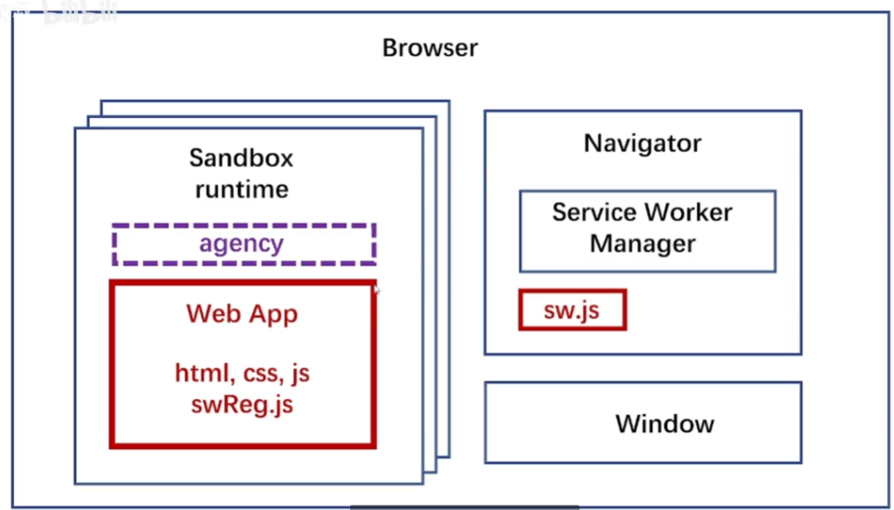
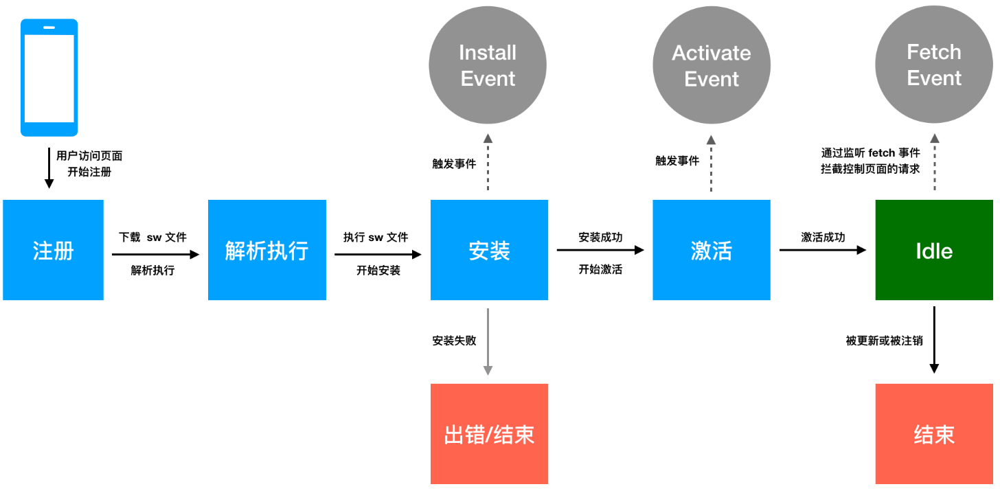
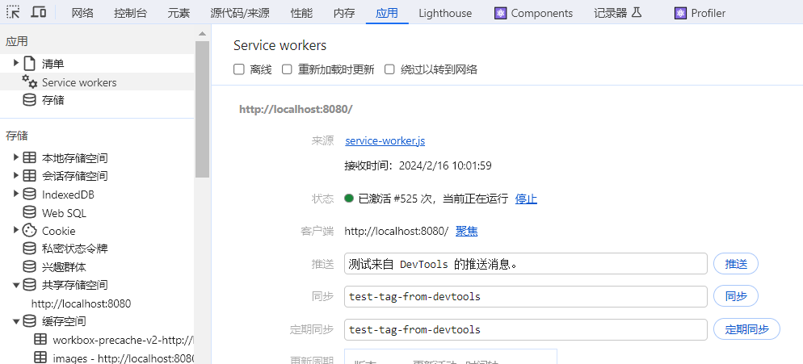
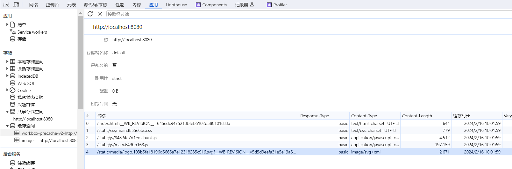

# ServiceWorker 基础

## Service Worker 简介

**Service worker** 本质上充当 **Web 应用程序**、**浏览器与网络（可用时）**之间的**代理服务器**。这个 API 旨在创建**有效的离线体验**，它会**拦截网络请求**并根据网络是否可用来**采取**适当的**动作**、**更新**来自服务器的的**资源**。它还**提供入口**以**推送通知**和**访问后台同步 API**。

参考：https://developer.mozilla.org/zh-CN/docs/Web/API/Service_Worker_API

**机制**



最外层 Browser 是浏览器。前端通过 agency 代理的接口，把 sw 通过 swRegistration 注册到 Navigator 中，驻留运行。

## Service Worker 的概念和用法

**Service worker** 是一个**注册**在**指定源和路径下**的**事件驱动** [worker](https://developer.mozilla.org/zh-CN/docs/Web/API/Worker)。它采用 JavaScript 文件的形式，控制关联的页面或者网站，**拦截并修改访问和资源请求**，**细粒度地缓存资源**。你可以完全控制应用在特定情形（最常见的情形是网络不可用）下的表现。

Service worker 运行在 worker 上下文：因此它**无法访问 DOM**，相对于驱动应用的主 JavaScript 线程，它**运行**在**其他线程**中，所以**不会造成阻塞**。

它被设计为**完全异步**；因此，**同步 [XHR](https://developer.mozilla.org/zh-CN/docs/Web/API/XMLHttpRequest) 和 [Web Storage](https://developer.mozilla.org/zh-CN/docs/Web/API/Web_Storage_API) 不能**在 service worker 中**使用**。

出于安全考量，Service worker **只能由 HTTPS 承载**，毕竟修改网络请求的能力暴露给[中间人攻击](https://developer.mozilla.org/zh-CN/docs/Glossary/MitM)会非常危险，如果允许访问这些强大的 API，此类攻击将会变得很严重。在 **Firefox 浏览器的[用户隐私模式](https://support.mozilla.org/zh-CN/kb/private-browsing-use-firefox-without-history)，Service Worker 不可用**。

> 备注： 在 **Firefox，为了进行测试**，你**可以通过 HTTP 运行** service worker（不安全）；只需选中 Firefox **开发者选项/齿轮菜单**中的 **Enable Service Workers over HTTP (when toolbox is open)** 选项。

> 备注： Service worker **大量使用 [Promise](https://developer.mozilla.org/zh-CN/docs/Web/JavaScript/Reference/Global_Objects/Promise)**，因为通常它们会等待响应后继续，并根据响应返回一个成功或者失败的操作。Promise 非常适合这种场景。

### 注册

使用 **[`ServiceWorkerContainer.register()`](https://developer.mozilla.org/zh-CN/docs/Web/API/ServiceWorkerContainer/register)** 方法**首次注册** service worker。

**注册成功后**，service worker 就会被**下载**到客户端并尝试**安装或激活**（见下文），这将作用于**整个域内用户可访问的 URL，或者其特定子集**。

### 生命周期



#### 注册

注册是 Service Worker 生命周期的第一步：`navigator.serviceWorker.register('/sw.js')`

1. 由于用户**首次访问**网站时**没有**已注册的 **Service Worker**，因此请**等待页面完全加载后再注册 Service Worker**。如果 Service Worker 预缓存任何内容，则可**避免带宽争用**。
2. [虽然 Service Worker 得到了很好的支持](https://caniuse.com/serviceworkers)，但**快速检查**有助于**避免**在**不受支持**的浏览器中出现**错误**。
3. 当页面完全加载时，如果支持 Service Worker，请注册 `/sw.js`。

您需要了解以下重要事项：

- Service Worker [**仅通过 HTTPS 或 localhost 提供**](https://www.chromium.org/Home/chromium-security/prefer-secure-origins-for-powerful-new-features)。
- 如果 Service Worker 的内容包含**语法错误**，则**注册**会**失败**，Service Worker 会被**舍弃**。
- 提醒：Service Worker 在作用域内运行。此处的作用域是整个源，因为它是从根目录加载的。
- **注册开始时**，Service Worker 的状态会**设置为 `'installing'`**。

#### 安装

Service Worker 会在注册后触发其 **[`install`](https://developer.mozilla.org/docs/Web/API/ServiceWorkerGlobalScope/install_event) 事件**。

每个 Service Worker 只能调用 `install` **一次**，并且在更新前不会再次触发。您可以使用 `addEventListener` 在 worker 的作用域内注册 `install` 事件的回调：`self.addEventListener('install', (event) => {……`

这会**创建**一个**新的 `Cache` 实例**并**预缓存资源**。

1. 创建一个名为 `'MyFancyCache_v1'` 的新 `Cache` 实例。
2. 创建缓存后，系统会使用其异步 [`addAll` 方法](https://developer.mozilla.org/docs/Web/API/Cache/addAll)预缓存一组素材资源网址。

#### 激活

如果注册和安装成功，Service Worker 就会激活，并且其状态会**变为 `'activating'`**。可以在 Service Worker 的 [`activate` 事件](https://developer.mozilla.org/docs/Web/API/ServiceWorkerGlobalScope/activate_event)激活期间完成工作。此事件中的典型任务是**删减旧缓存**。

对于新 Service Worker，**`activate`** 会**在 `install` 成功后立即触发**。**激活完成后**，Service Worker 的状态将**变为 `'activated'`**。请注意，默认情况下，新 Service Worker 在**下一次**导航或**页面刷新之前**，**不会**开始**控制页面**。

> 使用 [`ServiceWorkerGlobalScope.skipWaiting()`](https://developer.mozilla.org/zh-CN/docs/Web/API/ServiceWorkerGlobalScope/skipWaiting) 可以**更快**地进行**激活**，
>
> **active worker** 可以使用 [`Clients.claim()`](https://developer.mozilla.org/zh-CN/docs/Web/API/Clients/claim) **声明现有的页面**。

### 更新

**之后**，在**以下情况**将会触发**更新**：

- 用户**导航**到 **Service Worker 的作用域内**的页面。
- 使用与当前已安装的 Service Worker **不同的网址**调用 [`navigator.serviceWorker.register()`](https://developer.mozilla.org/docs/Web/API/ServiceWorkerContainer/register)，但不要更改 Service Worker 的网址！
- 使用与已安装的 Service Worker **相同的网址**调用 [`navigator.serviceWorker.register()`](https://developer.mozilla.org/docs/Web/API/ServiceWorkerContainer/register)，但**范围不同**。同样，为避免出现这种情况，请尽可能将作用域限定在源站的根部。
- 在过去 **24 小时**内**触发了 `'push'` 或 `'sync'` 等事件**，但暂时先不用担心这些事件。

**何时更新**

当**导航**到 **Service Worker 作用域内的新页面时**，浏览器会**自动**执行**更新检查**。

- 对 [`importScripts`](https://developer.mozilla.org/docs/Web/API/WorkerGlobalScope/importScripts) 请求的脚本进行的所有**字节逐一比较**。
- Service Worker 的**顶级代码**中的任何**更改**，都会影响浏览器为其生成的指纹。

如果现**有 service worker 已启用**，**新版本**会在**后台安装**，但仍**不会被激活**——这个时序称为 **worker in waiting**。

直到**所有已加载的页面不再使用旧的 service worker 才会激活新**的 service worker（成为 active worker）。

**手动触发更新检查**

```js
navigator.serviceWorker.ready.then((registration) => {
  registration.update();
});
// 对于传统网站，或者在用户会话不是长期存在的任何情况下，可能不需要触发手动更新。
```

### 范围

Service Worker 的作用域由其在 **Web 服务器**上的**位置决定**。如果 Service Worker 在位于 `/subdir/index.html` 且位于 `/subdir/sw.js` 的页面上运行，则该 Service Worker 的作用域是 `/subdir/`。

> 案例：
>
> 1. **导航**到 https://service-worker-scope-viewer.glitch.me/subdir/index.html。系统会显示一条消息，指出**没有**任何 **Service Worker** 正在**控制**该**网页**。不过，该页面会从 `https://service-worker-scope-viewer.glitch.me/subdir/sw.js` **注册**一个 Service Worker。
> 2. **重新加载页面**。 由于 **Service Worker** **已注册**且当前处于**活跃状态**，因此它**控制着页面**。包含 Service Worker 的范围、当前状态及其网址的表单将可见。注意：必须重新加载页面与作用域无关，而与 Service Worker 生命周期无关，稍后将对此进行说明。
> 3. **现在**，前往 https://service-worker-scope-viewer.glitch.me/index.html。 即使已在**此源**上**注册了 Service Worker**，仍然会有消息表明当前**没有 Service Worker**。这是因为，此页面**不在**已注册 Service Worker 的**范围内**。

> **注意**：无论范围如何，**控制页面**的 **Service Worker 仍然可以拦截任何网络请求**，包括针对跨源资源的请求。范围限制了 Service Worker 控制了哪些页面，而不是可以拦截哪些请求。

可以通过**设置 [`Service-Worker-Allowed`](https://w3c.github.io/ServiceWorker/#service-worker-script-response) 响应标头**以及将 **[`scope` 选项](https://developer.mozilla.org/docs/Web/API/ServiceWorkerRegistration/scope)**传递给 `register` 方法来替换允许的**最大范围**。

### 事件

#### install

你可以**监听 [`install` (en-US)](https://developer.mozilla.org/en-US/docs/Web/API/ServiceWorkerGlobalScope/install_event) 事件**；该事件触发时的标准行为是**准备 service worker 用于使用**，例如使用内建的 storage API 来**创建缓存**，并且**放置**应用**离线时**所需**资源**。

#### activate

还有一个 **[`activate` (en-US)](https://developer.mozilla.org/en-US/docs/Web/API/ServiceWorkerGlobalScope/activate_event) 事件**。此事件触发的时间点通常是**清理旧缓存**以及其他与你的 service worker 的**先前版本相关的东西**的好时机。

#### FetchEvent

Servcie worker 可以通过 **[`FetchEvent`](https://developer.mozilla.org/zh-CN/docs/Web/API/FetchEvent) 事件**去**响应请求**。通过**使用 [`FetchEvent.respondWith`](https://developer.mozilla.org/zh-CN/docs/Web/API/FetchEvent/respondWith) 方法**，你可以**任意修改**对于这些**请求的响应**。

#### waitUntil

因为 `oninstall` 和 `onactivate` 完成前需要一些时间，service worker 标准提供**一个 [`waitUntil()`](https://developer.mozilla.org/zh-CN/docs/Web/API/ExtendableEvent/waitUntil) 方法**。一旦在**带有 promise** 的 **`install` 或 `activate`** 事件**上调用**它，那么 **`fetch` 和 `push` 等功能事件**将**等待**，直到 promise 成功兑现。

## 在create react app 中创建

从 Create React App 4 开始，您可以向项目添加一个文件以**使用[Workbox](https://developers.google.com/web/tools/workbox/)插件**的`src/service-worker.js`内置支持 ，该插件将 [编译您的 Service Worker 并向其中注入要](https://developers.google.com/web/tools/workbox/guides/using-bundlers)[预缓存](https://developers.google.com/web/tools/workbox/guides/precache-files) 的 URL 列表 。[`InjectManifest`](https://developers.google.com/web/tools/workbox/reference-docs/latest/module-workbox-webpack-plugin.InjectManifest)

[如果您使用 PWA自定义模板](https://create-react-app.dev/docs/custom-templates/)之一启动新项目，您将获得一个 `src/service-worker.js`文件，该文件可以作为离线优先 Service Worker 的良好起点：

```sh
npx create-react-app my-app --template cra-template-pwa
```

TypeScript 的等效项是：

```sh
npx create-react-app my-app --template cra-template-pwa-typescript
```

如果您知道您不会使用 Service Worker，或者您希望使用不同的方法来创建 Service Worker，请不要创建文件 `src/service-worker.js`。在这种情况下，该`InjectManifest`插件将不会运行。

除了创建本地`src/service-worker.js`文件之外，还需要在使用之前进行注册。为了选择离线优先行为，开发人员应在其 [`src/index.js`](https://github.com/cra-template/pwa/blob/master/packages/cra-template-pwa/template/src/index.js) 文件中查找以下内容：

```js
// If you want your app to work offline and load faster, you can change
// unregister() to register() below. Note this comes with some pitfalls.
// Learn more about service workers: https://cra.link/PWA
// 如果你想让你的应用离线工作，加载速度更快，你可以修改
// unregister()到register()注意，这有一些缺陷。
// 了解service worker的更多信息:https://cra.link/PWA
serviceWorkerRegistration.unregister();
```

正如评论所述，**切换`serviceWorker.unregister()`到 `serviceWorker.register()`将选择您使用 Service Worker。**

### service-worker.js

定制化的service-worker，使用了Google的Workbox库来实现离线缓存和路由处理。

service-worker 是独立的，在 serviceWorkerRegistration 的 registerValidSW 注册进去。

### serviceWorkerRegistration.js

用于注册一个服务工作线程（Service Worker），实现应用程序的离线缓存和加速加载。

### 浏览器 Application

使用 http-server 创建一个 http 服务。

```bash
http-server -p 8080 build
```

**查看**



浏览器设置中需要注意：

设置 **Update on reload（重新加载时更新）**，这个选项控制在更新代码后，**获取最新**的 service-worker 代码。

在 **status（状态）**中，可以**停止**或者**启动**，来控制 service-worker 的运行。

点击 **Unregister（注销）** 可以卸载所有资源。

**缓存**



### 浏览器 LightHouse

### 关闭

关闭项目，需要浏览器控制台Application 中 Unregister（注销）掉wervice-workers ，然后关掉 http-server 服务。

## 简单构建 ServiceWorker

**官方教程（重要）：构建一个基本用例的完整教程，请阅读[使用 Service Worker](https://developer.mozilla.org/zh-CN/docs/Web/API/Service_Worker_API/Using_Service_Workers)。**

简单实践：

在index.js中引入注册程序

```jsx | pure
import reportWebVitals from './reportWebVitals';
……
const root = ReactDOM.createRoot(document.getElementById('root'));
root.render(<React.StrictMode>
  {/*<App />*/}
  <ServiceWorkerExample />
  {/*<RouteTest/>*/}
</React.StrictMode>);
……
register(); // 执行引入程序
```

/swUp.js

```js
const URL_SW = `${process.env.PUBLIC_URL}/sw.js`

export function register() {
  if ('serviceWorker' in navigator) {
    window.addEventListener('load', () => {
      navigator.serviceWorker.register(URL_SW).then((result) => {
        console.log("!!!!! service worker register result", result)
      })
    })
  }
}
```

编写 ServiceWorker 程序，放入 public 中，开发或者生产环境都会访问 public 的静态文件。 

/public/sw.js

```js
console.log("sw load");
const CACHE_LIST = [
  '/static/js/bundle.js',
  '/manifest.json',
  '/ServiceWorker',
]
const CACHE_NAME = 'PWA_SW_DEMO_V1'
// sw刚刚安装时候执行
this.addEventListener('install', (event) => {
  console.log('install')
  event.waitUntil(
    caches.open(CACHE_NAME).then(cache => {
      return cache.addAll(CACHE_LIST);
    })
  )
})
// 所有的网络请求，触发
this.addEventListener('fetch', event => {
  const fetchWithFn = async () => {
    // 优先查询缓存
    const cachedRes = await caches.match(event.request)
    console.log('search cached response', cachedRes)
    if (!!cachedRes) {
      return cachedRes
    }
    // else
    const response = await fetch(event.request)
    console.log('fetch response to cache', response);
    if (!response || response.status !== 200) {
      console.error('response not accepted')
      return response;
    }
    // 如果请求的数据没有，则添加到caches
    const 
    36= response.clone();
    const cache = await caches.open(CACHE_NAME)
    console.log('cache', event.request, res4Cache);
    cache.put(event.request, res4Cache)
    return response;
  }
  event.respondWith(
    fetchWithFn()
  )
})
// 激活时执行
this.addEventListener('activate', event => {
  console.log('activate')
  const whiteList = [CACHE_NAME]
  event.waitUntil(
    caches.keys().then(cacheNames => {
      // 删除上一个版本的缓存数据，保存一个版本的数据。
      return Promise.all(
        cacheNames.map(name => {
          if (!whiteList.includes(name)) {
            return caches.delete(name)
          }
        })
      )
    })
  )
})
```

## 备注

### AppCache (manifest 缓存)  & Service Worker

使用 AppCach 需要创建个后缀名为 .appcache 的文件，然后在 html 标签中引入：

```html
<html lang="en" manifest="./study.appcache">
```

.appcache 文件：

```bash
CACHE MANIFEST
CACHE:
# 此部分写需要缓存的资源（#是注释的意思）
./images/img1.jpg
NETWORK:
# 此部分要写需要有网络才可访问的资源，无网络不访问
./js/main.js
FALLBACK:
# 当访问不到某个资源的情况下，自动由另一个资源替换
./css/online.css ./css/offline.css
```

注意的是，HTML5 AppCache (manifest 缓存) 将被移除。

与 [AppCache](https://alistapart.com/article/application-cache-is-a-douchebag/) 不同的是，**service worker** 并**不确定**你试图去**做什么**，但是**当这些假设不完全正确时**，它们**会被中断**。相对地，service worker 可以**更细致地控制每一件事情**。

> 从 Firefox 84 开始，它已被删除（bug 1619673）。它还计划在 Chromium 93 中删除，并在 Safari 中弃用。
> 从 Firefox 60 以及部分或所有支持的浏览器开始，它仅在安全上下文 (HTTPS) 中可用。
> 从 Firefox 44+ 开始，当使用 AppCache 为页面提供离线支持时，控制台中会显示一条警告消息，建议开发人员**改用 Service Worker**（bug 1204581） 已
> 弃用
>
> 不再建议使用此功能。尽管某些浏览器可能仍然支持它，但它可能已从相关网络标准中删除，可能正在被删除，或者可能仅出于兼容性目的而保留。避免使用它，并尽可能更新现有代码；请参阅本页底部的兼容性表来指导您的决定。请注意，此功能可能随时停止工作。

### XHR异步请求和同步请求分别用代码举例

下面是使用 XMLHttpRequest (XHR) 进行异步请求和同步请求的示例代码：

**异步请求示例**：

```js
javascriptCopy codevar xhr = new XMLHttpRequest();
xhr.open('GET', 'https://api.example.com/data', true); // 第三个参数为 true 表示异步请求
xhr.onreadystatechange = function() {
  if (xhr.readyState === XMLHttpRequest.DONE) {
    if (xhr.status === 200) {
      console.log('异步请求成功:', xhr.responseText);
    } else {
      console.error('异步请求失败:', xhr.statusText);
    }
  }
};
xhr.send();
```

**同步请求示例**：

```js
javascriptCopy codevar xhr = new XMLHttpRequest();
xhr.open('GET', 'https://api.example.com/data', false); // 第三个参数为 false 表示同步请求
xhr.send();
if (xhr.status === 200) {
  console.log('同步请求成功:', xhr.responseText);
} else {
  console.error('同步请求失败:', xhr.statusText);
}
```

**说明**：

- 异步请求通过将 `open` 方法的第三个参数设置为 `true`，并且指定一个 `onreadystatechange` 事件处理程序来处理请求的状态变化。
- 同步请求通过将 `open` 方法的第三个参数设置为 `false`，然后直接发送请求，接着在发送请求后立即检查响应状态。

需要注意的是，同步请求通常会阻塞页面，因此在实际开发中，更推荐使用异步请求，以保持页面的响应性。

### Progressive web app 简介

PWA（渐进式 Web 应用）是一种使用现代 Web 技术和最佳实践来使 Web 应用程序具备类似原生应用的体验的方法。以下是 PWA 的一些关键特点和概念：

1. **渐进增强性（Progressive Enhancement）：** PWA 设计理念中的一个核心概念是渐进增强性，意味着无论用户使用的是什么设备或浏览器，应用都能够提供基本的功能和用户体验。然后，通过利用现代浏览器的功能，逐步提升应用的性能和功能。
2. **离线支持（Offline Support）：** PWA 允许用户在没有网络连接的情况下访问应用，通过使用缓存和服务工作器（Service Worker）来存储应用的核心资源。这使得用户在弱网络条件或者离线状态下仍能够使用应用。
3. **响应式设计（Responsive Design）：** PWA 的设计应该能够适应不同屏幕大小和设备类型，确保在桌面、平板和移动设备上都有良好的用户体验。
4. **应用清单（Web App Manifest）：** PWA 可以提供一个清单文件，其中包含了应用的元数据，如名称、图标、颜色等。这样，用户可以将应用添加到主屏幕，并获得类似原生应用的启动体验。
5. **推送通知（Push Notifications）：** PWA 具备推送通知的能力，使得应用能够在后台向用户发送消息，提醒用户与应用互动。
6. **安全性（Security）：** PWA 使用 HTTPS 来保证数据传输的安全性，确保用户的信息和隐私得到保护。

总体而言，PWA 旨在提供更好的用户体验，使得 Web 应用能够与原生应用相媲美。通过利用现代浏览器的特性，PWA 能够在各种设备上提供快速、可靠和具有吸引力的用户体验，同时具备离线支持等特性。这使得用户可以更轻松地访问和使用 Web 应用，无论网络状况如何。

**案例**：例如，[Squoosh.app](https://squoosh.app/) 就将其用于图片压缩。

**参考**：https://web.dev/articles/what-are-pwas?hl=zh-cn

