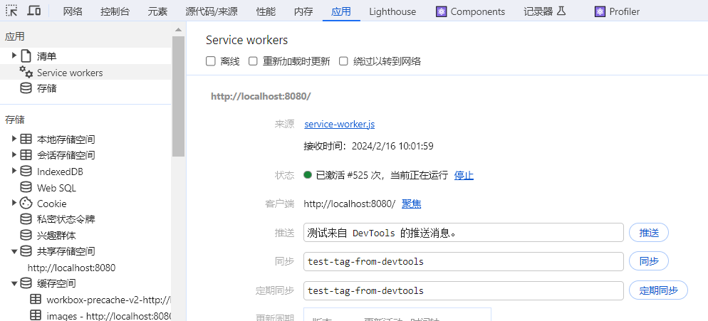
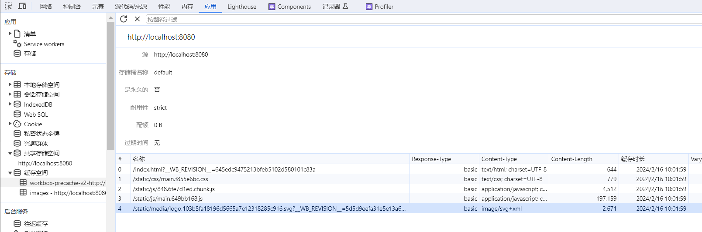
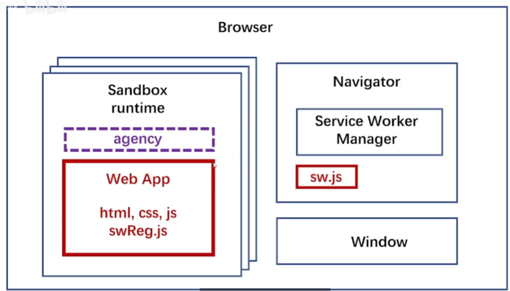

# ServiceWorker 基础

## Progressive web app 简介

PWA（渐进式 Web 应用）是一种使用现代 Web 技术和最佳实践来使 Web 应用程序具备类似原生应用的体验的方法。以下是 PWA 的一些关键特点和概念：

1. **渐进增强性（Progressive Enhancement）：** PWA 设计理念中的一个核心概念是渐进增强性，意味着无论用户使用的是什么设备或浏览器，应用都能够提供基本的功能和用户体验。然后，通过利用现代浏览器的功能，逐步提升应用的性能和功能。
2. **离线支持（Offline Support）：** PWA 允许用户在没有网络连接的情况下访问应用，通过使用缓存和服务工作器（Service Worker）来存储应用的核心资源。这使得用户在弱网络条件或者离线状态下仍能够使用应用。
3. **响应式设计（Responsive Design）：** PWA 的设计应该能够适应不同屏幕大小和设备类型，确保在桌面、平板和移动设备上都有良好的用户体验。
4. **应用清单（Web App Manifest）：** PWA 可以提供一个清单文件，其中包含了应用的元数据，如名称、图标、颜色等。这样，用户可以将应用添加到主屏幕，并获得类似原生应用的启动体验。
5. **推送通知（Push Notifications）：** PWA 具备推送通知的能力，使得应用能够在后台向用户发送消息，提醒用户与应用互动。
6. **安全性（Security）：** PWA 使用 HTTPS 来保证数据传输的安全性，确保用户的信息和隐私得到保护。

总体而言，PWA 旨在提供更好的用户体验，使得 Web 应用能够与原生应用相媲美。通过利用现代浏览器的特性，PWA 能够在各种设备上提供快速、可靠和具有吸引力的用户体验，同时具备离线支持等特性。这使得用户可以更轻松地访问和使用 Web 应用，无论网络状况如何。

**案例**：例如，[Squoosh.app](https://squoosh.app/) 就将其用于高级图片压缩。

**参考**：https://web.dev/articles/what-are-pwas?hl=zh-cn

## 在create react app 中创建

从 Create React App 4 开始，您可以向项目添加一个文件以**使用[Workbox](https://developers.google.com/web/tools/workbox/)插件**的`src/service-worker.js`内置支持 ，该插件将 [编译您的 Service Worker 并向其中注入要](https://developers.google.com/web/tools/workbox/guides/using-bundlers)[预缓存](https://developers.google.com/web/tools/workbox/guides/precache-files) 的 URL 列表 。[`InjectManifest`](https://developers.google.com/web/tools/workbox/reference-docs/latest/module-workbox-webpack-plugin.InjectManifest)

[如果您使用 PWA自定义模板](https://create-react-app.dev/docs/custom-templates/)之一启动新项目，您将获得一个 `src/service-worker.js`文件，该文件可以作为离线优先 Service Worker 的良好起点：

```sh
npx create-react-app my-app --template cra-template-pwa
```

TypeScript 的等效项是：

```sh
npx create-react-app my-app --template cra-template-pwa-typescript
```

如果您知道您不会使用 Service Worker，或者您希望使用不同的方法来创建 Service Worker，请不要创建文件 `src/service-worker.js`。在这种情况下，该`InjectManifest`插件将不会运行。

除了创建本地`src/service-worker.js`文件之外，还需要在使用之前进行注册。为了选择离线优先行为，开发人员应在其 [`src/index.js`](https://github.com/cra-template/pwa/blob/master/packages/cra-template-pwa/template/src/index.js) 文件中查找以下内容：

```js
// If you want your app to work offline and load faster, you can change
// unregister() to register() below. Note this comes with some pitfalls.
// Learn more about service workers: https://cra.link/PWA
// 如果你想让你的应用离线工作，加载速度更快，你可以修改
// unregister()到register()注意，这有一些缺陷。
// 了解service worker的更多信息:https://cra.link/PWA
serviceWorkerRegistration.unregister();
```

正如评论所述，**切换`serviceWorker.unregister()`到 `serviceWorker.register()`将选择您使用 Service Worker。**

### service-worker.js

定制化的service-worker，使用了Google的Workbox库来实现离线缓存和路由处理。

service-worker 是独立的，在 serviceWorkerRegistration 的 registerValidSW 注册进去。

### serviceWorkerRegistration.js

用于注册一个服务工作线程（Service Worker），实现应用程序的离线缓存和加速加载。

### 浏览器 Application

使用 http-server 创建一个 http 服务。

```bash
http-server -p 8080 build
```

**查看**



浏览器设置中需要注意：

设置 **Update on reload（重新加载时更新）**，这个选项控制在更新代码后，**获取最新**的 service-worker 代码。

在 **status（状态）**中，可以**停止**或者**启动**，来控制 service-worker 的运行。

点击 **Unregister（注销）** 可以卸载所有资源。

**缓存**



### 浏览器 LightHouse

### 关闭

关闭项目，需要浏览器控制台Application 中 Unregister（注销）掉wervice-workers ，然后关掉 http-server 服务。

## 简单构建 ServiceWorker



最外层 Browser 是浏览器。前端通过 agency 代理的接口，把 sw 通过 swRegistration 注册到 Navigator 中，驻留运行。


## 备注

### AppCache (manifest 缓存)  & Service Worker

使用 AppCach 需要创建个后缀名为 .appcache 的文件，然后在 html 标签中引入：

```html
<html lang="en" manifest="./study.appcache">
```

.appcache 文件：

```bash
CACHE MANIFEST
CACHE:
# 此部分写需要缓存的资源（#是注释的意思）
./images/img1.jpg
NETWORK:
# 此部分要写需要有网络才可访问的资源，无网络不访问
./js/main.js
FALLBACK:
# 当访问不到某个资源的情况下，自动由另一个资源替换
./css/online.css ./css/offline.css
```

注意的是，HTML5 AppCache (manifest 缓存) 将被移除。

> 从 Firefox 84 开始，它已被删除（bug 1619673）。它还计划在 Chromium 93 中删除，并在 Safari 中弃用。
> 从 Firefox 60 以及部分或所有支持的浏览器开始，它仅在安全上下文 (HTTPS) 中可用。
> 从 Firefox 44+ 开始，当使用 AppCache 为页面提供离线支持时，控制台中会显示一条警告消息，建议开发人员**改用 Service Worker**（bug 1204581） 已
> 弃用
>
> 不再建议使用此功能。尽管某些浏览器可能仍然支持它，但它可能已从相关网络标准中删除，可能正在被删除，或者可能仅出于兼容性目的而保留。避免使用它，并尽可能更新现有代码；请参阅本页底部的兼容性表来指导您的决定。请注意，此功能可能随时停止工作。

