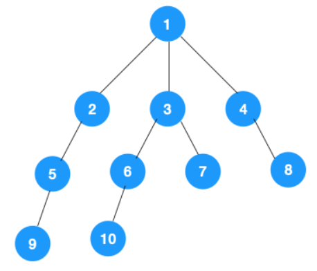
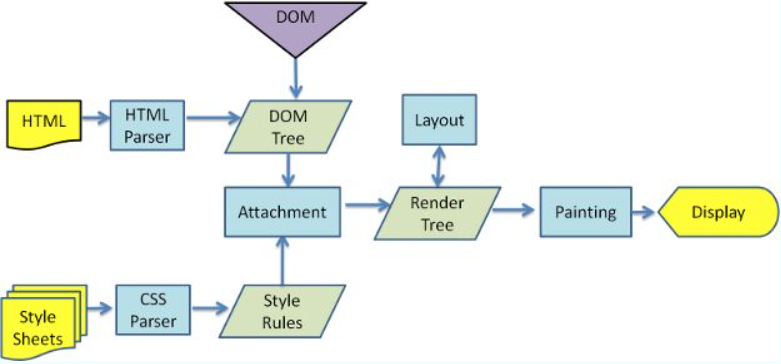
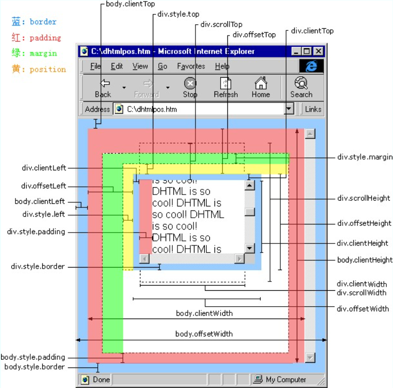
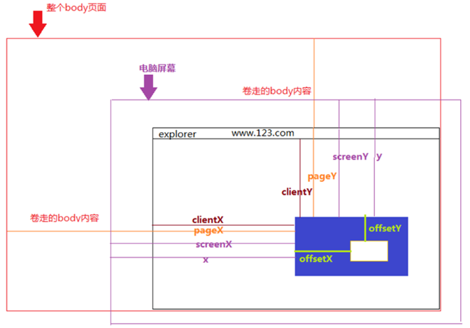
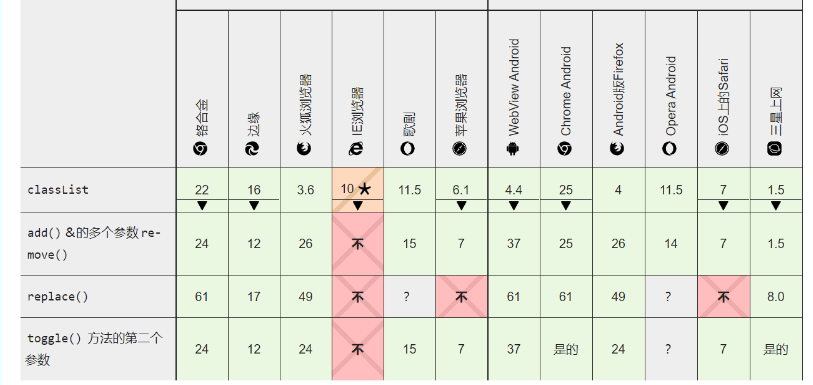

# Web_API 它的分金定穴术
> 简介: 这里的"分金定穴"一词, 出自"鬼吹灯". 通过一定法门来判断墓穴的位置, 这里的"金"指的是罗盘, 在风水学中通常可以判断阳宅吉凶, 简单来说, 要想窥探宝藏, 必然要遵循他们的规律, 顺势而行.
>
> 本次分享, 我整理了常用的 Web API, 以及关于浏览器 dom 元素操作的基础知识, 更侧重基础知识的复习与总结, 所以比较纯朴单调一些. 本次分享, 我尝试结合大学里我所学习前端知识的时间为线索, 一步一步梳理常用的 Web API.
>
> 关于 Web_API 指的是浏览器对前端程序员开放的接口 API, 方便前端程序员通过 js 操作 dom 元素, 是程序员与浏览器交互的桥梁.
>
> ------------ 题记

## DOM元素获取

### By系列dom获取

最早使用的 By 系列, 主要有 3 个 api :

- getElement**ById** (返回一个匹配特定 ID 的元素)
- getElement**sByName** (根据给定的name 返回一个在 document 的节点列表集合)
- getElement**sByTagName** (方法返回一个动态的包含所有指定标签名的元素的HTML集合)

这个时候更多的展示最普通的静态页面用于信息传播, 这还是在 IE5 的时代.

> 老师曾提起, 这里有意思的起名方式: 如果查询到的数据是数组通常在 By 前边加 s,而不是在 "name" 后加 s,所以表示查询到数据是元素,而不是一堆 name 字符串. 赞!

随着发展, 人们有了更多的操作 dom 的需求, 他们希望找一个标识能够快速定位到元素, 它必须有唯一性又有复用性.

而后选有 id, name, class. 对于 id 而言, 它全局唯一, 如果一个文档内使用多次, js dom 获取函数将会混乱. 而 name 属性有着更多的缺点, 首先是 css 选择器对 name 获取不是特别友好, 并且 name 更多的用于表单当中, 表单是当时浏览器页面与服务器唯一的交流方式, 当然后来出现了Ajax技术.

最终更多人选用了 class 作为元素标识, 后也新增了 getElement**sByClassName** (返回一个包含了所有指定类名的子元素的类数组对象), 但是这个 api 只兼容到了 IE9.

### query系列dom获取

除上述外, 还有两个 api 也进入了获取 dom 的工具箱, 则是 querySelector, querySelectorAll. 他们传入的参数是: CSS 选择器字符串. 这使得该 api 使用时非常方便. 但注意的 query 系列返回实际上是一个 nodeList 快照, 是**静态**的.

对于[速度](https://www.zhihu.com/question/404365645)来说, 两者差距并不是特别明显, 而对于语义化而言, query 系列更优于 by 系列 ,在不考虑兼容性的当时, 更好的选择则是使用 query 系列.

> 静态与动态的对比: 像 getElementsByTagName 返回的是一个真实 dom 树列表, 它存入变量中的值, 更像是一个指向 dom 树本身的指针.
>
> ```html
> <ul>
>     <li>aaa</li>
>     <li>ddd</li>
>     <li>ccc</li>
> </ul>
>  
> //demo1
> var ul = document.getElementsByTagName('ul')[0],
>       lis = ul.getElementsByTagName("li");
> for(var i = 0; i < lis.length ; i++){
>      ul.appendChild(document.createElement("li"));
> }
> console.log( lis.length);  //6
>  
> //demo2
> var ul = document.querySelectorAll('ul'),
>       lis = ul.querySelectorAll("li");
> for(var i = 0; i < lis.length ; i++){
>      ul.appendChild(document.createElement("li"));
> }
> console.log( lis.length);  //3
> ```

### dom树中的快捷指针

人们发现单纯直接的获取 element 元素, 有很多时候不能解决需求, 如何根据一个元素与另一个元素的关系获取另一个元素, 这种手法, 则需要dom树中的快捷指针. 

其中 parent 和 children 作为dom树的纽带, 很多时候被使用到.

- div.parentElement
- div.children
- div.firstElementChild (获取第一个子元素, ie8不兼容)
- div.lastElementChild (ie8不兼容)
- div.previousElementSibling (获取前一个元素, ie8不兼容)
- div.nextElementSibling (ie8不兼容)

> 老师也很困扰, 对于IE8: 要完美使用这几个指针, 可能还需要写点代码.
>
> ```js
> //FirstElementChild
> function getFirstElementChild(element){
>     if(element.firstElementChild){
>       return element.firstElementChild
>     }else{
>       var node = element.firstChild
>       while (node&&node.nodeType !=1) {
>         node = node.nextSibling
>       }
>       return node
>     }
> }
> //LastElementChild
> function getLastElementChild(element){
>     if(element.firstElementChild){
>       return element.lastElementChild
>     }else{
>       var node = element.lastChild
>       while (node&&node.nodeType !=1) {
>         node = node.previousSibling
>       }
>       return node
>     }
> }
> 
> var node = div.firstChild//获取元素第一个子节点（div.childNodes[0]）
> var node2 = div.lastChild//获取元素最后的子节点（div.childNodes[div.childNodes.length]）
> var node3 = div.previousSibling//获取元素的前面的节点
> var node4 = div.nextSibling//获取元素的后面的节点
> //而在 IE 8 上面4句获取的 节点 是 元素
> ```

### 所见皆节点

文档节点( Node )是一个接口，各种类型的 DOM API 对象会从这个接口继承。它允许我们使用相似的方式对待这些不同类型的对象.

常用属性有三个: nodeType 表示的是该节点的类型; 

nodeName 当前节点的节点名称; 

nodeValue 返回或设置当前节点的值 常见的节点分为四类:

- var div = myId('div') (标签节点)
  div.nodeType (1)
  div.nodeName (DIV 标签名字)
  div.nodeValue (null 固定)
- var attr = div.getAttributeNode('title') (属性节点)
  attr.nodeType (3)
  attr.nodeName (title 属性名字)
  attr.nodeValue (属性1 属性值)

- var text = div.childNodes[0] (文字节点)
  text.nodeType (3)
  text.nodeName (#text 固定)
  text.nodeValue (123 文字的内容)
- var comment = div.childNodes[1] (注释节点)
  comment.nodeType (8)
  comment.nodeName (#comment 固定)
  comment.nodeValue (注释 注释的内容)

> 说到节点, 有时会帮我们完成一些需求. 文字节点可以精确的控制文字内容, 注释节点有时候还会用到模板引擎的循环上.

```html
<div class="val">
    123
    <span>
        个
    </span>
</div>
<input type="text" oninput="setVal()" />
```

```js
const inputEle = document.querySelector('[oninput="setVal()"]');
const divEle = document.querySelector('[class="val"]');
const setVal = ()=>{
  divEle.childNodes[0].nodeValue = inputEle.value;
  // divEle.innerText = inputEle.value; // innerText 会覆盖整个 div 元素的内容, span 元素将会删除
}
```

相比元素的快捷指针,node节点也有同样指针.

- div.parentNode
- div.childNodes
- div.firstChild
- div.lastChild
- div.previousSibling
- div.nextSibling

### 绕不开的两个算法

说到dom遍历, 绕不开的要说到两个算法. DFS(深度优先遍历)和 BFS(广度优先遍历).解释一下就是

深度优先遍历: 按路径来处理节点, 一条路径走到底访问这条路径每个节点, 然后回退一个节点再访问该节点的另一个分支的, 重复整个过程.

广度优先遍历: 按层级来处理节点, 距离开始节点最近的那些节点首先被访问，而最远的那些节点则最后被访问.



深度优先遍历: 1,2,5,9,3,6,10,7,4,8; 广度优先遍历:1,2,3,4,5,6,7,8,9,10;

> 深度优先遍历, 可以用[递归](code/深度优先.html)的算法实现, 而任何递归执行操作的本质都是栈的入栈出栈.
>
> ```html
> <div id="main">1
>   <div>2
>     <span>3
>           <a href="">4</a>
>       </span>
>   </div>
>   <ul>5
>     <li>6
>       <a href="">7</a>
>     </li>
>     <li>8</li>
>   </ul>
>   <div>9
>     <p>10</p>
>   </div>
> </div>
> ```
>
> ```js
> // 打印元素中的数字文本
> function logNodeValue(ele){
>   console.dir((() => {
>     // 过滤出第一个文字节点.
>     const {nodeValue} = Array.from(ele.childNodes).find(node => node.nodeType === 3);
>     // 过滤掉空格,回车.
>     return nodeValue.match(/[\S]+/g)?.toString();
>   })());
> }
>  
> // 递归实现
> function depth_first_search_recursion(ele) {
>   logNodeValue(ele);
>   if (!ele.children.length) return;
>   Array.from(ele.children).forEach(_ele => {
>     depth_first_search_recursion(_ele)
>   })
> }
>  
> // 堆栈方式实现
> function depth_first_search(node) {
>   let stack = [node];
>   while (stack.length > 0) {
>     const item = stack.pop();
>     logNodeValue(node);
>     for (let i = item.children.length - 1; i >= 0; i--) {
>       stack.push(item.children[i]);
>     }
>   }
> }
>  
> // 堆栈,最先进去的最晚执行,递归同理,最先执行的最晚执行完毕.
> // start
> depth_first_search(document.getElementById('main'))
> ```
>
> 广度优先遍历, 用[递归](https://www.cnblogs.com/dongyangblog/p/11204612.html)实现很麻烦, 使用的方法也是一种变相的队列, 我们不如直接用[队列](code/广度优先.html)实现.
>
> ```js
> // 打印元素中的数字文本
> function logNodeValue(ele){
>   console.dir((() => {
>     // 过滤出第一个文字节点.
>     const {nodeValue} = Array.from(ele.childNodes).find(node => node.nodeType === 3);
>     // 过滤掉空格,回车.
>     return nodeValue.match(/[\S]+/g)?.toString();
>   })());
> }
>  
> // 使用队列实现
> function breadth_first_search(node) {
>   const queue = [node];
>  
>   while (queue.length) {
>     const item = queue.pop()
>     logNodeValue(item);
>     for (let i = 0; i < item.children.length; i++) {
>       queue.unshift(item.children[i])
>     }
>   }
> }
>  
> // 队列特点就是最先入队先执行, 那我们按照层级顺序入队不久可以了.
> breadth_first_search(document.getElementById('main'))
> ```

## DOM元素操作

### 元素样式取与存

经历元素获取后, 人们终于可以开始操作元素. 最常见是去设置元素的style属性达到样式动态变化的目的. 这里涉及的两个获取样式的方式:

- style 只能获取到行内样式,获取不了外部的样式
- getComputedStyle 可以获取行内和外部样式，但是兼容到IE9

> 对于旧的IE来说, 他们有自己替代currentStyle, 所以可以这样写.
>
> ```js
> // 获取样式
> function getStyle(element,attr){
>   return window.getComputedStyle?window.getComputedStyle(element,null)[attr]:element.currentStyle[attr]
> }
> // 写入样式
> function setStyle(element,attr,val){
>   element.style[attr] = val;
> }
> ```

如果你想改变样式时,你可以使用改变class方式改变元素样式,或者直接设置style.

### 回流\重绘不可不免的坑



1, 解析HTML, 生成DOM树, 解析CSS，生成CSSOM树. 然后结合生成渲染树.

2, 根据渲染树, 通过计算得到几何信息( 位置, 大小 )形成回流, 然后根据渲染树以及回流信息, 重绘成绝对的像素点信息.

3, 像素点信息放入GPU, 展示在页面上.

> 注意：渲染树只包含可见的标签. 一些不会渲染输出的标签有 script、meta、link 等, 还有 display:none 样式的标签.
> 而设置有 visibility 和 opacity 样式的标签还是会出现在渲染树上的.

**再解释一下回流\重绘**

回流( reflow ): 当 render tree 中的部分(或全部)因为元素的规模尺寸, 布局, 隐藏等几何信息改变而需要重新构建. 

重绘: 当render tree中的一些元素需要更新属性, 而这些属性只是影响元素的外观, 风格, 而不会影响布局的( background-color ), 只重新渲染像素点.

其实, 两者区别很大, 回流必将引起重绘, 而重绘不一定会引起回流. 在回流的时候, 浏览器会使渲染树中受到影响的部分失效, 并重新构造这部分渲染树, 完成回流后, 浏览器会重新绘制受影响的部分到屏幕中.

**那怎么的操作会触发他们呢?**

回流与重绘:

- 添加或删除可见的DOM元素, 元素的位置发生变化,
- 元素的尺寸发生变化( 包括外边距、内边框、边框大小、高度和宽度等 ),
- 内容发生变化, 比如文本变化或图片被另一个不同尺寸的图片所替代,
- 页面一开始渲染的时候 ( 这肯定避免不了 )
- innerText ( 火狐不一定支持 )
- 浏览器的窗口尺寸变化（因为回流是根据视口的大小来计算元素的位置和大小的）

重绘:

- offsetTop, scrollTop, clientTop...
- getComputedStyle()
- getBoundingClientRect()

> 对于回流重绘还有[更多](https://gist.github.com/paulirish/5d52fb081b3570c81e3a)的触发机制.
>
> 这里有意思的是, 在CSS3里 transform, opacity, filters, Will-change 这几个属性, 由于使用css3硬件加速, 他们不会引起回流重绘. 赞!

所以我们应该怎么样[优化](./code/优化样式代码.html)一下自己的代码呢.

```js
// 使用cssText和className控制样式
// 不好
var left = 10,
    top = 10;
el.style.left = left + "px";
el.style.top  = top  + "px";
 
// 可以
el.className += " theclassname";
 
// 或者
el.style.cssText += "; left: " + left + "px; top: " + top + "px;";


// 循环时( 动画 ), 我还可以缓存一下这个值
// 不好的
for(big; loop; here) {
    el.style.left = el.offsetLeft + 10 + "px";
    el.style.top  = el.offsetTop  + 10 + "px";
}
 
// 可以
var left = el.offsetLeft, // 执行一次
    top  = el.offsetTop
    esty = el.style;
for(big; loop; here) {
    left += 10;
    top  += 10;
    esty.left = left + "px";
    esty.top  = top  + "px";
}
```

### 属性设置

设置属性我们使用 setAttribute , 获取属性时可以使用 getAttribute

而删除属性时我们应该使用 removeAttribute 代替 elt.setAttribute(attr, null) 来删除属性.

> 对于 attribute 系列, 有时候喜欢用来设置style, 其实上面也介绍了 style 设置最好还是要用 style.cssText.
>  attribute 系列其实更多用在 data-* api 的兼容上, H5 有了 dataset 映射, 而兼容低版本( IE11- )浏览器更多使用 attribute 系列
>
> ```js
> // 获取 data-* 存储值
> Element.prototype.getDataset = function (key) {
>   this.dataset ? this.dataset[key] : this.getAttribute('data-' + key)
> }
> // 设置 data-* 存储值
> Element.prototype.setDataset = function (key, val) {
>   if (this.dataset) {
>     this.dataset[key] = val
>   } else {
>     this.setAttribute('data-' + key, val)
>   }
> }
> ```

### 元素内容设置

展示信息最多的方式还是文字, 如何设置一个标签的内的文字内容, 除了用获取node节点设置value值方式外. 这里提供了两个api:

- textContent w3c规范，ie8不支持
- innerText 火狐不一定支持

二者除了兼容性, 不同之处还有：textContent 会获取所有元素的内容, 包括 script 和 style 元素, 然而 innerText 只展示给人看的元素, innerText 受 CSS 样式的影响,并且不会返回隐藏元素的文本.

```html
<div id="ceshi">测试<span>textContent</span>属性</div>
 
<button onclick="edit()">edit!</button>
```

```js
function edit() {
  document.getElementById('ceshi').textContent = '修改文字';
  // Element.innerHTML返回HTML，如其名称所示。有时人们使用它innerHTML来检索或写入元素内的文本，
  // 但textContent由于其值未解析为HTML ，因此 具有更好的性能
}
 
console.log(document.getElementById('ceshi').textContent);
```

> 此外，由于 innerText 受 CSS 样式的影响，它会触发回流（ reflow ）去确保是最新的计算样式。（回流在计算上可能会非常昂贵，因此应尽可能避免。）

### 元素标签的增删

最后是为我们立下汗马功劳的几个 api ,这几个 api 贯穿古今一直沿用到现在.

appendChild, removeChild, replaceChild
cloneNode(true), createElement, insertBefore

其实replaceChild相比其他几个用的不是很多, 更多的是用到的是appendChild, insertBefore, 用他们元素的封装插入函数, 但是这个操作回流就不可避免了.

```html
<div id="1">1</div>
<div id="2">2</div>
<div id="3"><span>3</span></div>
<div id="4">4</div>
<div id="5">5</div>
<div id="10">10</div>
 
<button onclick="to4()">把10插入4前边</button>
<button onclick="to3()">把10挂到3下边</button>
```

```js
var ele10 = document.getElementById('10');
  var ele4 = document.getElementById('4');
  var ele3 = document.getElementById('3');
 
  var to4 = function(){
    ele10.previousAddNode(ele4);
  }
  var to3 = function(){
    ele10.mount(ele3,true);
  }
 
// 挂载到谁上边
  Element.prototype.mount = function (parentEle, ifAfter = false) {
    const ele = this;
    if (parentEle) {
      if (ifAfter)
        parentEle.insertBefore(ele, parentEle.children[0]);
      else {
        parentEle.appendChild(ele);
      }
    }
    return this;
  }
 
  // 挂载在谁的前边
  Element.prototype.previousAddNode = function (targetEle) {
    const ele = this
    const parentEle = targetEle?.parentElement;
    if (parentEle) {
      parentEle.insertBefore(ele, targetEle);
    }
    return this
  }
 
  // 挂载在谁的后边
  Element.prototype.nextAddNode = function (targetEle) {
    const ele = this
    const parentEle = targetEle?.parentElement;
    if (parentEle) {
      parentEle.insertBefore(ele, targetEle.nextElementSibling);
    }
    return this
  }
```

## 元素与鼠标的位置信息

### 元素位置信息相关属性

说到位置信息相关属性, 人们常常会混淆各个属性的用处, 或者知道他们存在, 而不是特别清楚他们数值具体指的是什么. 因为除一些特别的功能, 人们很难用到全部的属性.

所以我们一分两半分别来看, 一个是鼠标, 一个是元素.
元素这边有6个常见属性:

元素属性 ( width, height )

- clientW/H: 可视区域(不包含滚动条, border. 包含 padding)( 对于 window 可用 window.innerHeight )
- offsetW/H: 元素宽高( 不包含 margin. 包含padding, border, 滚动条 ) (client+滚动条+border)( 对于 window 可用 window.outerHeight )
- scrollW/H: 实际内容宽高( 不包含滚动条, border, 包含 padding, 未显示内容 )

>  对于 clientW/H 属性注意的是, 如果有滚动条滚动条会吃掉client的值( 实际是padding的值 ), 大约有17px. 
>
> clientW/H 属性也等于 window.getComputedStyle(ele, null)['width']加上padding.
>
>  对于 offsetW/H 属性注意的是, 它的值等于 client+滚动条+border 距离.

元素属性 ( top, left )

- clientT/L: 边框的厚度 ( 指的就是 border 宽 )
- offsetT/L: 自己边框 (边框外层) 到最近的父级元素的边框 ( 边框内层 ) 的距离. 这里的父级元素指的是开启 position 或 transform 的元素,或者body元素
- scrollT/L: 未显示出来的内容( 从边框内层开始算起 )( 对于 window 可用 window.pageXOffset 代替 )

> scrollT/L 这个属性要注意的是, 在滚动前, 父级和子级元素的边框和边框之间充斥着父级元素的 padding 和子级元素的 margin 的. 所以滚动的距离会包含这两个值.
>
> 也可以理解父级的 padding 和 子级的 margin 都会跟随滚动.
>
>  很多时候我们都会有一种需求, 就是[拿到](code/元素位置/计算元素距离.html)元素距离浏览器的距离. 这个信息, 可以让我们知道一个没有绝对定位的元素的位置, 更可以计算出两个元素的相距的距离.
>
> **拿到, 拿到这个值可以遍历, 还可以...**
>
> ```html
> <div id="data">
>     <div style="background-color: #3f5fbf">
>         <div style="background-color: red">
>             <div style="background-color: #2a00ff;position: relative; top:10px"> // 蓝色
>                 <div style="background-color: #7f007f;transform:translateY(20px)"> // 紫色
>                     <div style="background-color: #0a2b1d">
>                         <section style="background-color: #f7e741">
>                             <span id="target">1</span>
>                         </section>
>                     </div>
>                 </div>
>             </div>
>         </div>
>     </div>
> </div>
> ```
>
> ```js
> let targetEle = document.getElementById('target');
> let targetOffsetTop = targetEle.offsetTop;
> while (targetEle.nodeName !== 'HTML') {
>   targetEle = targetEle.parentElement;
>   // 判定条件
>   const isCount = ((() => {
>     const targetEleStyle = window.getComputedStyle(targetEle, null);
>     if (targetEleStyle.position && targetEleStyle.position !== 'static') {
>       return true
>     }
>     if (targetEleStyle.transform && targetEleStyle.transform !== 'none') {
>       return true
>     }
>     return false
>   })());
>  
>   if (isCount) {
>     console.log(targetEle,targetEle.offsetTop) // 紫色到蓝色 20 , 蓝色到body 60
>     targetOffsetTop += targetEle.offsetTop
>   }
> }
> console.log(targetOffsetTop); // 110
>  
> // 有意思的是, 当我们设置 transform:translateY(20px) 和 transform:translateY(10px) 发现 offsetTop 计算后,拿到的结果都是一样的.
> // 也就是说 transform 属性不参与位置上的计算, 而 top left right bottom 都是参与计算的.
>  
> // 其实有一个api, 他拿到的是元素到视口的距离.
> ```
>
> **还可以使用 getBoundingClientRect 拿到到视口的距离**
>
> ```js
> ele.getBoundingClientRect();
>  
> /**
> {
>     bottom: 930;
>     height: 800;
>     left: 108;
>     right: 208;
>     top: 130;
>     width: 100;
>     x: 108;
>     y: 130;
> }
> */
> ```



### 鼠标位置信息相关属性

而鼠标位置信息这边则比较简单, 3个属性:

- clientX/Y 鼠标距离浏览器距离
- screenX/Y 鼠标距离显示器距离
- pageX/Y 鼠标距离真实内容 ( 显示出来 + 卷曲的内容 ) 距离



> 这里说的是 pageX/Y 不是很好用, 因为它永远以 body 为标准. 有时候我们单页面应用滚动条不是 body 的,而是某个 div 的.

### 用于引导的定位插件

上面我们说了关于位置, dom 元素获取/操作的一些 web API. 总结一下, 我们可以开始着手开发自己项目上用到的一些插件.

比如这个用于引导的[定位插件](https://xiaowuqiqi.github.io/scroll-element-locator/guide), 很多项目上会有这种需求.

其实这个定位插件, 全部使用web API编写, 核心代码只有二百行左右, 由于没有使用的其他框架插件, 所以[二次开发](https://github.com/xiaowuqiqi/scroll-element-locator)非常方便. 这个插件主要设计四个部分, 元素位置计算, 滚动数值计算,遮罩大小计算, 动画. 涉及到一些简单的算法和 web API. 

详情可以[查看代码](https://github.com/xiaowuqiqi/scroll-element-locator).

## DOM元素class处理

### classList

classList 是一个只读属性, 对人们来说他是 H5 时代的礼物 返回现场 DOMTokenList 的集合。然后可以使用它的方法, 来操作类列表。

- add(class1, class2, ...) 在元素中添加一个或多个类名, 如果指定的类名已存在, 则不会添加.
- contains(class) 返回布尔值，判断指定的类名是否存在.
- item(index) 返回元素中索引值对应的类名。索引值从 0 开始. 注意: 索引值在区间范围外则返回 null.
- remove(class1, class2, ...) 移除元素中一个或多个类名. 注意: 移除不存在的类名, 不会报错.
- toggle(class, true|false) 在元素中切换类名.
  第一个参数为要在元素中移除的类名.
  第二个是可选参数, 是个布尔值用于设置元素是否强制添加或移除类. 不管该类名是否存在.

> 但是他的兼容性不是特别好, 对于当时 IE 8 来说, 还要有一些[手段](./code/classList.html)才能更好使用.
>
> ```js
> //判断元素内是否有该class
> function hasClass(element,cla){
>   if(!element.className){
>     return false
>   }
>   var tempArr = element.className.split(/\s+/)
>     for (var i = 0; i < tempArr.length; i++) {
>       if(tempArr[i] === cla.replace(/\s+/g,''))
>         return true
>     }
>     return false
>   }
>  
> //查找元素
> // getElementsByClassName ie8不支持
> function myClass(cla){
>   if(!document.getElementsByClassName){
>     var nodes = document.getElementsByTagName('*')
>     for (var i = 0; i < nodes.length; i++) {
>       if(hasClass(nodes[i],cla)){
>         return nodes[i]
>       }
>     }
>   }else{
>     return document.getElementsByClassName(cla)[0]
>   }
> }
> function myClassArr(cla){
>   if(!document.getElementsByClassName){
>     var nodes = document.getElementsByTagName('*')
>     var arr = []
>     for (var i = 0; i < nodes.length; i++) {
>       if(hasClass(nodes[i],cla)){
>         arr.push(nodes[i])
>       }
>     }
>     return arr
>   }else{
>     return document.getElementsByClassName(cla)
>   }
> }
> //addclass
> Element.prototype.addclass = function(){
>   var ele = this
>   var arr = [].slice.call(arguments);
>   var str = arr.join(' ')
>     if(this.className){
>       str = ' '+str
>     }
>     this.className += str
>  
> }
> // div.addclass('fff','sss')
> //removeClass
> Element.prototype.removeClass = function(){
>   var ele = this
>   var arr = [].slice.call(arguments)
>   for (var i = 0; i < arr.length; i++) {
>     ele.className = ele.className.replace(new RegExp("(\\s*"+arr[i]+"\\s*)"),' ')
>   }
> }
> ```


