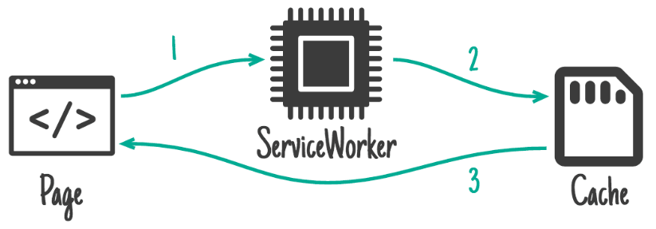
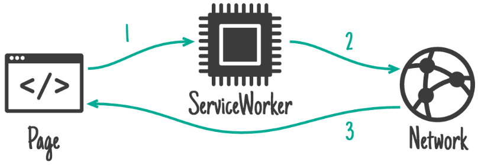
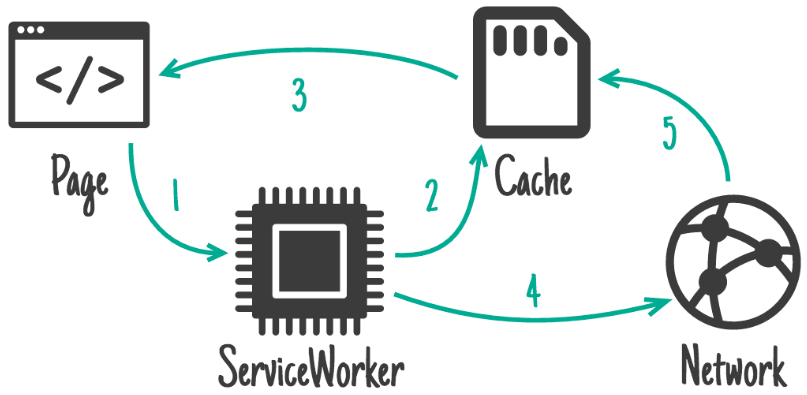
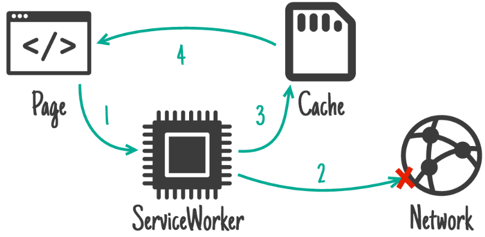
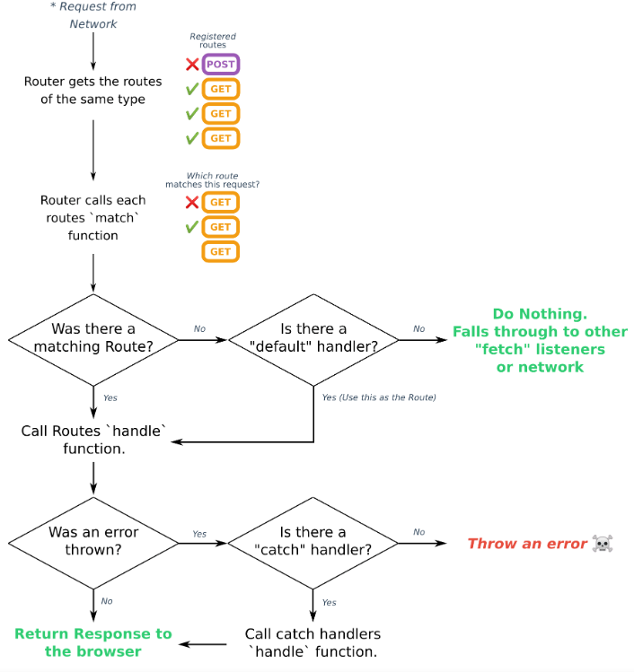

# workbox 路由与策略

## workbox-strategies 缓存策略

参考：https://developer.chrome.com/docs/workbox/caching-strategies-overview?hl=zh-cn#caching_strategies

workbox提供了一下几种缓存策略：

### CacheOnly 仅限缓存



**CacheOnly** 这个策略也比较直接，**直接使用 Cache 缓存的结果**，并将结果返回给客户端，这种策略比较适合一上线就**不会变**的**静态资源请求**。Service Worker 更新之前，绝不会在缓存中更新这些资源。 **（仅使用缓存）**

> 第一次请求网页，因为未安装 serviceWorker 所以会现在网络下载数据，后边会一直在 cache 拿取数据，如果这时删除 cache 数据则返回为空。

```js
// Establish a cache name
const cacheName = 'MyFancyCacheName_v1';

// Assets to precache
const precachedAssets = [
  '/possum1.jpg',
  '/possum2.jpg',
  '/possum3.jpg',
  '/possum4.jpg'
];

self.addEventListener('install', (event) => {
  // Precache assets on install
  event.waitUntil(caches.open(cacheName).then((cache) => {
    return cache.addAll(precachedAssets);
  }));
});

self.addEventListener('fetch', (event) => {
  // Is this one of our precached assets?
  const url = new URL(event.request.url);
  const isPrecachedRequest = precachedAssets.includes(url.pathname);

  if (isPrecachedRequest) {
    // Grab the precached asset from the cache
    event.respondWith(caches.open(cacheName).then((cache) => {
      return cache.match(event.request.url);
    }));
  } else {
    // Go to the network
    return;
  }
});
```

### NetworkOnly 仅限网络



**NetworkOnly** 比较直接的策略，直接**强制使用正常的网络请求**，并将结果返回给客户端，这种策略比较适合对**实时性要求非常高**的请求。 **（仅使用网络请求）**

### CacheFirst 缓存优先，回退到网络



**CacheFirst** 当匹配到请求之后直接**从 Cache 缓存**中**取得结果**，如果 Cache **缓存中没有**结果，那就会**发起网络请求**，**拿**到**网络请求结果**并将结果**更新**至 Cache 缓存，并将结果返回给客户端。这种策略比较适合结果不怎么变动且对实时性要求不高的请求。 **（有缓存用缓存，无缓存则请求网络）**

**适用**于**所有静态资源**（例如 **CSS、JavaScript、图片和字体**）的**绝佳策略**，尤其是**经过哈希处理**的**资源**。 它可以绕过 HTTP 缓存可能启动的服务器执行任何内容新鲜度检查，从而加快不可变资源的速度。更重要的是，所有缓存的资源都将离线可用。

```js
// Establish a cache name
const cacheName = 'MyFancyCacheName_v1';

self.addEventListener('fetch', (event) => {
  // Check if this is a request for an image
  if (event.request.destination === 'image') {
    event.respondWith(caches.open(cacheName).then((cache) => {
      // Go to the cache first
      return cache.match(event.request.url).then((cachedResponse) => {
        // Return a cached response if we have one
        if (cachedResponse) {
          return cachedResponse;
        }

        // Otherwise, hit the network
        return fetch(event.request).then((fetchedResponse) => {
          // Add the network response to the cache for later visits
          cache.put(event.request, fetchedResponse.clone());

          // Return the network response
          return fetchedResponse;
        });
      });
    }));
  } else {
    return;
  }
});
```

### NetworkFirst 网络优先、回退到缓存



**NetworkFirst** 采用**网络优先的策略**，也就是优先尝试**拿到网络请求**的返回**结果**，如果拿到网络请求的结果，就将结果返回给客户端**并**且**写入 Cache 缓存**，**如果**网络**请求失败**，那最后被缓存的 Cache **缓存结果**就会被**返回**到客户端，这种策略一般适用于返回结果不太固定或对实时性有要求的请求，为网络请求失败进行兜底。 **（有网的情况下采取网络，没网的情况下用缓存）**

**非常适合 HTML 或 API 请求**，当您想**在线获取资源**的**最新版本**，同时希望离线访问最新的可用版本时。

```js
// Establish a cache name
const cacheName = 'MyFancyCacheName_v1';

self.addEventListener('fetch', (event) => {
  // Check if this is a navigation request
  if (event.request.mode === 'navigate') {
    // Open the cache
    event.respondWith(caches.open(cacheName).then((cache) => {
      // Go to the network first
      return fetch(event.request.url).then((fetchedResponse) => {
        cache.put(event.request, fetchedResponse.clone());

        return fetchedResponse;
      }).catch(() => {
        // If the network is unavailable, get
        return cache.match(event.request.url);
      });
    }));
  } else {
    return;
  }
});
```

### Stale-While-Revalidate 重新验证时过时

**Stale-While-Revalidate** 当请求的路由有对应的 Cache 缓存结果就直接返回，在返回 Cache 缓存结果的同时会在后台发起网络请求拿到请求结果并更新 Cache 缓存，如果本来就没有 Cache 缓存的话，直接就发起网络请求并返回结果 **（ 从缓存中读取资源的同时发送网络请求更新本地缓存 ）**

可以将内容想象成社交媒体网站的头像。 它们会在用户执行相应操作时进行更新，但并不是每个请求都绝对有必要使用最新版本。

```js
// Establish a cache name
const cacheName = 'MyFancyCacheName_v1';

self.addEventListener('fetch', (event) => {
  if (event.request.destination === 'image') {
    event.respondWith(caches.open(cacheName).then((cache) => {
      return cache.match(event.request).then((cachedResponse) => {
        const fetchedResponse = fetch(event.request).then((networkResponse) => {
          cache.put(event.request, networkResponse.clone());

          return networkResponse;
        });

        return cachedResponse || fetchedResponse;
      });
    }));
  } else {
    return;
  }
});
```

### Strategy

所有其他策略类都必须从其扩展的抽象基类。

#### 入参

```ts
(options?: StrategyOptions)=> {...}
```

**cacheName** string

缓存名字


**fetchOptions** RequestInit（可选）

设置 RequestInit

**matchOptions** CacheQueryOptions 可选

#### 实例方法

**handle**

**执行请求策略**，并**返回**将通过 `Response` 进行解析的 **`Promise`**，从而**调用**所有相关**插件**回调。

**使用** Workbox **[`workbox-routing.Route`](https://developer.chrome.com/docs/workbox/modules/workbox-routing/?hl=zh-cn#type-Route) 注册**策略实例时，系统会在路由匹配时**自动调用**此方法。

或者，您可以将此方法传递给 `event.respondWith()`，从而在独立的 `FetchEvent` 监听器中使用该方法。

```ts
(options: FetchEvent|HandlerCallbackOptions)=> {...}
```

**handleAll**

与上边 handle 类似，但并非仅返回一个解析为 `Response` 的 `Promise`，而是**返回**一个 **`[response, done]` promise 的元组**。

其中前一个 **response** 等同于 `handle()` 返回的内容

而后一个 **done** 是 promise，会在执行策略过程中添加到 `event.waitUntil()` 

`handleAll` 函数如下所示：

```ts
(options: FetchEvent|HandlerCallbackOptions)=> {...}
```

举例

```js
import {CacheFirst} from 'workbox-strategies';
// 这可以是任何策略，以CacheFirst为例。
const strategy = new CacheFirst();
const urls = ['/offline.html'];

self.addEventListener('install', event => {
  // handleAll返回两个promises，第二个promises在所有项都被添加到缓存后解析。
  const done = urls.map(
    path =>
      strategy.handleAll({
        event,
        request: new Request(path),
      })[1]
  );

  event.waitUntil(Promise.all(done));
});
```

## workbox-routing 路由

### 如何执行路由

以下是需要注意的几点重要事项：

- 请求的方法非常重要。默认情况下，系统会为 `GET` 请求注册路由。如果您希望拦截其他类型的请求，则需要指定该方法。
- 路由注册的顺序很重要。如果注册了多个可以处理请求的路由，系统将使用最先注册的路由来响应该请求。

您可以通过以下几种方式注册路由：使用回调、正则表达式或路由实例。


