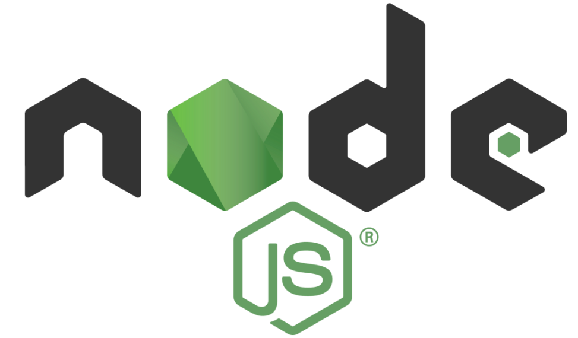
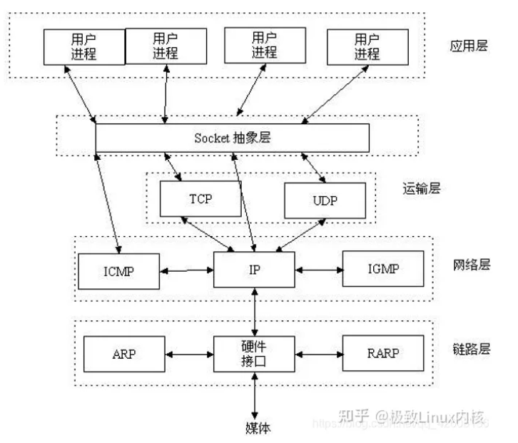

# node 笔记-http-server&基础



Node.js 中的 HTTP 接口旨在支持该协议的许多传统上难以使用的功能。特别是大的，可能是块编码的消息。接口从不缓冲整个请求或响应，因此用户能够流式传输数据。

**HTTP 消息头**由类似如下的对象表示：

```json
{ 
  "content-length": "123",
  "content-type": "text/plain",
  "connection": "keep-alive",
  "host": "example.com",
  "accept": "*/*" 
}
```

键是小写的。值不会被修改。

为了支持所有可能的 HTTP 应用，Node.js HTTP API 是非常低层的。它只进行流处理和消息解析。它将消息解析为标头和正文，但不解析实际的标头或正文。

有关如何处理重复标头的详细信息。

> - 重复的 `age`、`authorization`、`content-length`、`content-type`、`etag`、`expires`、`from`、`host`、`if-modified-since`、`if-unmodified-since`、`last-modified`、`location`、`max-forwards`、`proxy-authorization`、`referer`、`retry-after`、`server` 或 `user-agent` 被丢弃。要允许合并上面列出的标头的重复值，请在 [`http.request()`](https://nodejs.cn/api/http.html#httprequestoptions-callback) 和 [`http.createServer()`](https://nodejs.cn/api/http.html#httpcreateserveroptions-requestlistener) 中使用选项 `joinDuplicateHeaders`。有关详细信息，请参阅 RFC 9110 第 5.3 节。
> - `set-cookie` 始终是数组。重复项被添加到数组中。
> - 对于重复的 `cookie` 标头，值使用 `; `连接。
> - 对于所有其他标头，值使用 `, `连接。

接收到的**原始标头保留在 `rawHeaders` 属性中**，其是 `[key, value, key2, value2, ...]` 数组。例如，上面的消息头对象有类似如下的 `rawHeaders` 列表：

```js
[ 'ConTent-Length', '123456',
  'content-LENGTH', '123',
  'content-type', 'text/plain',
  'CONNECTION', 'keep-alive',
  'Host', 'example.com',
  'accepT', '*/*' ] 
```

## createConnection

**生成用于 HTTP 请求的套接字/流。**

默认情况下，此函数与 [`net.createConnection()`](https://nodejs.cn/api/net.html#netcreateconnectionoptions-connectlistener) 相同。但是，如果需要更大的灵活性，自定义代理可能会覆盖此方法。

可以通过以下两种方式之一提供套接字/流：通过从此函数返回套接字/流，或将套接字/流传递给 `callback`。

## http.createServer

```js
http.createServer([options][, requestListener])
/**
options <Object>
	connectionsCheckingInterval：以毫秒为单位设置间隔值，
		以检查不完整请求中的请求和标头超时。
		默认值：30000。
	headersTimeout：设置从客户端接收完整 HTTP 标头的超时值，以毫秒为单位。
		有关详细信息，请参阅 server.headersTimeout。默认值：60000。
	highWaterMark <number> 可选择覆盖所有 socket 的 readableHighWaterMark 和 writableHighWaterMark。
		这会影响 IncomingMessage 和 ServerResponse 的 highWaterMark 属性。
		默认值：参见 stream.getDefaultHighWaterMark()。
	insecureHTTPParser <boolean> 使用不安全的 HTTP 解析器，当为 true 时接受无效的 HTTP 标头。
		应避免使用不安全的解析器。有关详细信息，请参阅 --insecure-http-parser。
		默认值：false。
	IncomingMessage <http.IncomingMessage> 指定要使用的 IncomingMessage 类。
		用于扩展原始的 IncomingMessage。默认值：IncomingMessage。
	joinDuplicateHeaders <boolean> 如果设置为 true，则此选项允许使用逗号 (, ) 连接请求中多个标头的字段行值，
		而不是丢弃重复项。欲了解更多信息，请参阅 message.headers。默认值：false。
	keepAlive <boolean> 如果设置为 true，则在收到新的传入连接后立即启用套接字上的保持活动功能，
		与 [socket.setKeepAlive([enable][, initialDelay])][socket.setKeepAlive(enable, initialDelay)] 
		中的操作类似。默认值：false。
	keepAliveInitialDelay <number> 如果设置为正数，则它会设置在空闲套接字上发送第一个保持活跃探测之前的初始延迟。
		默认值：0。
	keepAliveTimeout：在完成写入最后一个响应之后，在套接字将被销毁之前，服务器需要等待额外传入数据的不活动毫秒数。
		有关详细信息，请参阅 server.keepAliveTimeout。默认值：5000。
	maxHeaderSize <number> 可选地覆盖此服务器接收到的请求的 --max-http-header-size 值，
		即请求标头的最大长度（以字节为单位）。默认值：16384 (16 KiB)。
	noDelay <boolean> 如果设置为 true，
		则它会在收到新的传入连接后立即禁用 Nagle 算法。默认值：true。
	requestTimeout：设置从客户端接收整个请求的超时值（以毫秒为单位）。
		有关详细信息，请参阅 server.requestTimeout。默认值：300000。
	requireHostHeader <boolean> 如果设置为 true，它会强制服务器以 400（错误请求）
		状态代码响应任何缺少主机标头（按照规范的规定）的 HTTP/1.1 请求消息。默认值：true。
	ServerResponse <http.ServerResponse> 指定要使用的 ServerResponse 类。
		用于扩展原始的 ServerResponse。默认值：ServerResponse。
	uniqueHeaders <Array> 只应发送一次的响应标头列表。如果标头的值是数组，则子项将使用 ; 连接。
requestListener <Function>
返回：<http.Server>
*/
```

`requestListener` 是自动添加到 [`'request'`](https://nodejs.cn/api/http.html#event-request) 事件的函数。

```js
const http = require('node:http');

// 创建一个本地服务器来接收数据
const server = http.createServer((req, res) => {
  res.writeHead(200, { 'Content-Type': 'application/json' });
  res.end(JSON.stringify({
    data: 'Hello World!',
  }));
});

server.listen(8000);
```

```js
const http = require('node:http');

// 创建一个本地服务器来接收数据
const server = http.createServer();

// 监听请求事件
server.on('request', (request, res) => {
  res.writeHead(200, { 'Content-Type': 'application/json' });
  res.end(JSON.stringify({
    data: 'Hello World!',
  }));
});

server.listen(8000);
```

## http.get

```js
http.get(url[, options][, callback])
/**
url <string> | <URL>
options <Object> 接受与 http.request() 相同的 options，方法默认设置为 GET。
callback <Function>
返回：<http.ClientRequest>
*/
```

由于大多数请求是没有正文的 GET 请求，因此 Node.js 提供了这个便捷的方法。该方法**与 [`http.request()`](https://nodejs.cn/api/http.html#httprequestoptions-callback)** 唯一的**区别**是它默认**设置方法为 GET 并自动调用 `req.end()`**。因为 [`http.ClientRequest`](https://nodejs.cn/api/http.html#class-httpclientrequest) 章节所述的原因，回调必须注意消费响应数据。

获取 JSON 的示例：

```js
http.get('http://localhost:8000/', (res) => {
  const { statusCode } = res;
  const contentType = res.headers['content-type'];

  let error;
  // Any 2xx status code signals a successful response but
  // here we're only checking for 200.
  if (statusCode !== 200) {
    error = new Error('Request Failed.\n' +
                      `Status Code: ${statusCode}`);
  } else if (!/^application\/json/.test(contentType)) {
    error = new Error('Invalid content-type.\n' +
                      `Expected application/json but received ${contentType}`);
  }
  if (error) {
    console.error(error.message);
    // Consume response data to free up memory
    res.resume();
    return;
  }

  res.setEncoding('utf8');
  let rawData = '';
  res.on('data', (chunk) => { rawData += chunk; });
  res.on('end', () => {
    try {
      const parsedData = JSON.parse(rawData);
      console.log(parsedData);
    } catch (e) {
      console.error(e.message);
    }
  });
}).on('error', (e) => {
  console.error(`Got error: ${e.message}`);
});

// Create a local server to receive data from
const server = http.createServer((req, res) => {
  res.writeHead(200, { 'Content-Type': 'application/json' });
  res.end(JSON.stringify({
    data: 'Hello World!',
  }));
});

server.listen(8000); 
```

## http.request

```js
http.request(url[, options][, callback])
/**
url <string> | <URL>
options <Object>
	agent <http.Agent> | <boolean> 控制 Agent 的行为。可能的值：
		undefined（默认）：使用 http.globalAgent 作为主机和端口。
		Agent 对象：显式使用传入的 Agent。
		false：使用具有默认值的新 Agent。
	auth <string> 用于计算授权标头的基本身份验证 ('user:password')。
	createConnection <Function> 当不使用 agent 选项时，生成用于请求的套接字/流的函数。这可用于避免创建自定义 Agent 类只是为了覆盖默认的 createConnection 函数。有关详细信息，请参阅 agent.createConnection()。任何 Duplex 流都是有效的返回值。
	defaultPort <number> 协议的默认端口。默认值：如果使用 Agent，则为 agent.defaultPort，否则为 undefined。
	family <number> 解析 host 或 hostname 时使用的 IP 地址族。有效值为 4 或 6。当未指定时，则将使用 IP v4 和 v6。
	headers <Object> 包含请求头的对象。
	hints <number> 可选 dns.lookup() 提示。
	host <string> 要向其触发请求的服务器的域名或 IP 地址。默认值：'localhost'。
	hostname <string> host 的别名。为了支持 url.parse()，如果同时指定了 host 和 hostname，则将使用 hostname。
	insecureHTTPParser <boolean> 使用不安全的 HTTP 解析器，当为 true 时接受无效的 HTTP 标头。应避免使用不安全的解析器。有关详细信息，请参阅 --insecure-http-parser。默认值：false
	joinDuplicateHeaders <boolean> 它使用 , 连接请求中多个标头的字段行值，而不是丢弃重复项。有关详细信息，请参阅 message.headers。默认值：false。
	localAddress <string> 用于绑定网络连接的本地接口。
	localPort <number> 连接的本地端口。
	lookup <Function> 自定义查找函数。默认值：dns.lookup()。
	maxHeaderSize <number> 对于从服务器接收到的响应，可选择覆盖 --max-http-header-size 的值（响应标头的最大长度，以字节为单位）。默认值：16384 (16 KiB)。
	method <string> 指定 HTTP 请求方法的字符串。默认值：'GET'。
	path <string> 请求的路径。应包括查询字符串（如果有）。E.G.'/index.html?page=12'。当请求路径包含非法字符时抛出异常。目前，只有空格被拒绝，但将来可能会改变。默认值：'/'。
	port <number> 远程服务器的端口。默认值：如果设置则为 defaultPort，否则为 80。
	protocol <string> 要使用的协议。默认值：'http:'。
	setHost <boolean> :指定是否自动添加 Host 标头。默认为 true。
	signal <AbortSignal> :可用于中止正在进行的请求的中止信号。
	socketPath <string> Unix 域套接字。如果指定了 host 或 port 之一，则不能使用，因为它们指定了 TCP 套接字。
	timeout <number> :以毫秒为单位指定套接字超时的数字。这将在连接套接字之前设置超时。
	uniqueHeaders <Array> 只应发送一次的请求标头列表。如果标头的值是数组，则子项将使用 ; 连接。
callback <Function>
返回：<http.ClientRequest>
*/
```

类似 postman 发出一个 http 请求。

`url` 可以是字符串或 [`URL`](https://nodejs.cn/api/url.html#the-whatwg-url-api) 对象。如果 `url` 是字符串，则会自动使用 [`new URL()`](https://nodejs.cn/api/url.html#new-urlinput-base) 解析。如果是 **[`URL`](https://nodejs.cn/api/url.html#the-whatwg-url-api) 对象**，则会自动**转换为**普通的 **`options` 对象**。

如果同时指定了 `url` 和 `options`，则合并对象，`options` 属性优先。

可选的 `callback` 参数将被添**加为 [`'response'`](https://nodejs.cn/api/http.html#event-response) 事件**的**单次监听器**。

**`http.request()` 返回 [`http.ClientRequest`](https://nodejs.cn/api/http.html#class-httpclientrequest) 类的实例**。`ClientRequest` 实例是可写流。如果需要使用 POST 请求上传文件，则写入 `ClientRequest` 对象。

```js
const http = require('node:http');

const postData = JSON.stringify({
  'msg': 'Hello World!',
});

const options = {
  hostname: 'www.google.com',
  port: 80,
  path: '/upload',
  method: 'POST',
  headers: {
    'Content-Type': 'application/json',
    'Content-Length': Buffer.byteLength(postData),
  },
};

const req = http.request(options, (res) => {
  console.log(`STATUS: ${res.statusCode}`);
  console.log(`HEADERS: ${JSON.stringify(res.headers)}`);
  res.setEncoding('utf8');
  res.on('data', (chunk) => {
    console.log(`BODY: ${chunk}`);
  });
  res.on('end', () => {
    console.log('No more data in response.');
  });
});

req.on('error', (e) => {
  console.error(`problem with request: ${e.message}`);
});

// Write data to request body
req.write(postData);
req.end();
```

> 如果在请求期间遇到任何错误（无论是 DNS 解析、TCP 级别错误还是实际的 HTTP 解析错误），都会在返回的请求对象上触发 `'error'` 事件。与所有 `'error'` 事件一样，如果没有注册监听器，则会抛出错误。
>
> 有一些特殊的标头需要注意。
>
> - 发送“连接：keep-alive' 将通知 Node.js 与服务器的连接应该保持到下一个请求。
> - 发送 '内容长度' 标头将禁用默认的分块编码。
> - 发送 '预计' 标头将立即发送请求标头。通常，发送 'Expect:100-continue'，应设置 `'continue'` 事件的超时和监听器。有关更多信息，请参阅 RFC 2616 第 8.2.3 节。
> - 发送授权标头将覆盖使用 `auth` 选项来计算基本身份验证。
>

### 事件触发顺序

在**成功的请求**中，将按以下顺序触发以下事件：

- `'socket'`
- `'response'`
  - `res` 对象上的 `'data'`，任意次数（如果响应正文为空，则根本不会触发 `'data'`，例如，在大多数重定向中）
  - `res` 对象上的 `'end'`
- `'close'`

在**连接错误**的情况下，将触发以下事件：

- `'socket'`
- `'error'`
- `'close'`

在收到**响应之前过早关闭连接**的情况下，将按以下顺序触发以下事件：

- `'socket'`
- 使用具有消息 `'Error: socket hang up'` 和代码 `'ECONNRESET'` 的错误的 `'error'`
- `'close'`

在收到**响应之后过早关闭连接**的情况下，将按以下顺序触发以下事件：

- `'socket'`
- `'response'`
  - `res` 对象上的 `'data'`，任意次数
- （在此处关闭连接）
- `res` 对象上的 `'aborted'`
- `res` 对象上的 `'error'` 错误消息 `'Error: aborted'` 和代码 `'ECONNRESET'`
- `'close'`
- `res` 对象上的 `'close'`

如果在**分配套接字之前调用 `req.destroy()`**，则将按以下顺序触发以下事件：

- （在此处调用 `req.destroy()`）
- `'error'` 错误消息 `'Error: socket hang up'` 和代码 `'ECONNRESET'`，或调用 `req.destroy()` 时的错误
- `'close'`

如果在**连接成功之前调用 `req.destroy()`**，则将按以下顺序触发以下事件：

- `'socket'`
- （在此处调用 `req.destroy()`）
- `'error'` 错误消息 `'Error: socket hang up'` 和代码 `'ECONNRESET'`，或调用 `req.destroy()` 时的错误
- `'close'`

如果在**收到响应之后调用 `req.destroy()`**，则将按以下顺序触发以下事件：

- `'socket'`
- `'response'`
  - `res` 对象上的 `'data'`，任意次数
- （在此处调用 `req.destroy()`）
- `res` 对象上的 `'aborted'`
- `res` 对象上的 `'error'` 出现消息 `'Error: aborted'` 和代码 `'ECONNRESET'` 的错误，或者调用 `req.destroy()` 时出现的错误
- `'close'`
- `res` 对象上的 `'close'`

如果在**分配套接字之前调用 `req.abort()`**，则将按以下顺序触发以下事件：

- （在此处调用 `req.abort()`）
- `'abort'`
- `'close'`

如果在**连接成功之前调用 `req.abort()`**，则将按以下顺序触发以下事件：

- `'socket'`
- （在此处调用 `req.abort()`）
- `'abort'`
- 使用具有消息 `'Error: socket hang up'` 和代码 `'ECONNRESET'` 的错误的 `'error'`
- `'close'`

如果在**收到响应之后调用 `req.abort()`**，则将按以下顺序触发以下事件：

- `'socket'`
- `'response'`
  - `res` 对象上的 `'data'`，任意次数
- （在此处调用 `req.abort()`）
- `'abort'`
- `res` 对象上的 `'aborted'`
- `res` 对象上的 `'error'`，使用具有消息 `'Error: aborted'` 和代码 `'ECONNRESET'` 的错误。
- `'close'`
- `res` 对象上的 `'close'`

## http.maxHeaderSize

**只读属性**，指定 **HTTP 标头**的**最大允许大小（以字节为单位）**。默认为 **16 KiB**。可使用 [`--max-http-header-size`](https://nodejs.cn/api/cli.html#--max-http-header-sizesize) 命令行选项进行配置。

这可以通过**传入 `maxHeaderSize` 选项**为服务器和客户端请求覆盖。

## http.validateHeaderName

在**调用 `res.setHeader(name, value)` 时**对提供的 **`name`** 执行低层**验证**。

将非法值作为 `name` 传入将导致抛出 [`TypeError`](https://nodejs.cn/api/errors.html#class-typeerror)，由 `code: 'ERR_INVALID_HTTP_TOKEN'` 标识。

> 在将标头传给 HTTP 请求或响应之前，**不必使用**此方法。HTTP 模块将**自动验证**此类标头。

```js
const { validateHeaderName } = require('node:http');

try {
  validateHeaderName('');
} catch (err) {
  console.error(err instanceof TypeError); // --> true
  console.error(err.code); // --> 'ERR_INVALID_HTTP_TOKEN'
  console.error(err.message); // --> 'Header name must be a valid HTTP token [""]'
}
```

## http.validateHeaderValue

在调用 `res.setHeader(name, value)` 时对提供的 `value` 执行低层验证。

将非法值作为 `value` 传入将导致抛出 [`TypeError`](https://nodejs.cn/api/errors.html#class-typeerror)。

- 未定义值错误由 `code: 'ERR_HTTP_INVALID_HEADER_VALUE'` 标识。
- 无效值字符错误由 `code: 'ERR_INVALID_CHAR'` 标识。

> 在将标头传给 HTTP 请求或响应之前，不必使用此方法。HTTP 模块将自动验证此类标头。

```js
const { validateHeaderValue } = require('node:http');

try {
  validateHeaderValue('x-my-header', undefined);
} catch (err) {
  console.error(err instanceof TypeError); // --> true
  console.error(err.code === 'ERR_HTTP_INVALID_HEADER_VALUE'); // --> true
  console.error(err.message); // --> 'Invalid value "undefined" for header "x-my-header"'
}

try {
  validateHeaderValue('x-my-header', 'oʊmɪɡə');
} catch (err) {
  console.error(err instanceof TypeError); // --> true
  console.error(err.code === 'ERR_INVALID_CHAR'); // --> true
  console.error(err.message); // --> 'Invalid character in header content ["x-my-header"]'
}
```

## net.Server

### close 事件

服务器关闭时触发。如果连接存在，则在所有连接结束之前不会触发此事件。

### connection 事件

建立新连接时触发。`socket` 是 `net.Socket` 的实例。

### error 事件 *

发生错误时触发。与 [`net.Socket`](https://nodejs.cn/api/net.html#class-netsocket) 不同的是，除非手动调用 [`server.close()`](https://nodejs.cn/api/net.html#serverclosecallback)，否则**不会**在该事件之后直接**触发 [`'close'`](https://nodejs.cn/api/net.html#event-close) 事件**。参见 [`server.listen()`](https://nodejs.cn/api/net.html#serverlisten) 讨论中的示例。

### listening 事件 *

在调用 [`server.listen()`](https://nodejs.cn/api/net.html#serverlisten) 后绑定服务器时触发。

### drop 事件 *

当连接数达到 `server.maxConnections` 的阈值时，服务器将丢弃新的连接并触发 `'drop'` 事件。

### getConnections()

异步获取服务器上的并发连接数。当套接字被发送到复刻时工作。

## http.Server

继承自 [net.Server](https://nodejs.cn/api/net.html#class-netserver)

### checkContinue 事件

每次收到带有 HTTP `Expect: 100-continue` 的请求时触发。如果未监听此事件，则服务器将根据需要自动响应 `100 Continue`。

### checkExpectation 事件

每次收到带有 HTTP `Expect` 标头的请求时触发，其中值不是 `100-continue`。如果未监听此事件，则服务器将根据需要自动响应 `417 Expectation Failed`。

### clientError 事件 *

如果**客户端连接触发 `'error'` 事件**，则会在此处转发。此事件的监听器负责关闭/销毁底层套接字。例如，可能希望使用自定义 HTTP 响应更优雅地关闭套接字，而不是突然切断连接。在监听器结束之前必须关闭或销毁套接字。

> **默认行为**是尝试**使用 HTTP '400 错误请求' 关闭套接字**，或在发生 [`HPE_HEADER_OVERFLOW`](https://nodejs.cn/api/errors.html#hpe_header_overflow) 错误时使用 HTTP '431 请求标头字段太大'。如果套接字不可写或当前附加的 [`http.ServerResponse`](https://nodejs.cn/api/http.html#class-httpserverresponse) 的标头已发送，则立即销毁。

```js
const http = require('node:http');

const server = http.createServer((req, res) => {
  res.end();
});
server.on('clientError', (err, socket) => {
  socket.end('HTTP/1.1 400 Bad Request\r\n\r\n');
});
server.listen(8000);
```

### close 事件 *

**服务器关闭时触发。**

### connect 事件

每次客户端请求 HTTP `CONNECT` 方法时触发。如果未监听此事件，则请求 `CONNECT` 方法的客户端将关闭其连接。

### connection 事件

当建立新的 TCP 流时会触发此事件。

### dropRequest 事件 *

当套接字上的请求数**达到 `server.maxRequestsPerSocket` 的阈值时**，服务器会丢弃新的请求并触发 `'dropRequest'` 事件，然后将 `503` 发送给客户端。

### request 事件 **

```js
/**
request <http.IncomingMessage> // 注意的是参数一是 IncomingMessage 的实例
response <http.ServerResponse> // 注意的是参数二是 ServerResponse 的实例
*/
```

**每次有请求时触发**。每个连接可能有多个请求（在 HTTP Keep-Alive 连接的情况下）。

### upgrade 事件

每次客户端请求 HTTP 升级时触发。监听此事件是可选的，客户端不能坚持协议更改。

触发此事件后，请求的套接字将没有 `'data'` 事件监听器，这意味着需要绑定它才能处理发送到该套接字上的服务器的数据。

### close() *

**停止服务器**，**不接受新连接**，**关闭**所有**未发送请求**或**等待响应**的连接。

### closeAllConnections() *

**关闭所有连接**到此服务器的连接。

### closeIdleConnections()

关闭连接到此服务器的所有**未发送请求**或**等待响应**的连接。

### headersTimeout()

> 默认值：[`server.requestTimeout`](https://nodejs.cn/api/http.html#serverrequesttimeout) 或 `60000` 之间的最小值。

限制解析器等待接收完整 HTTP 标头的时间。

> 如果超时到期，则服务器以状态 408 响应而不将请求转发给请求监听器，然后关闭连接。

> 必须将其设置为非零值（例如 120 秒）以防止潜在的拒绝服务攻击，以防在部署服务器之前没有反向代理的情况下。

### server.listen()  *

```js
server.listen(options[, callback])
/**
options <Object> 必需的。支持以下属性：
	port <number>
	host <string>
	path <string> 如果指定了 port，则将被忽略。参见 识别 IPC 连接的路径。
	backlog <number> server.listen() 函数的通用参数。
	exclusive <boolean> 默认值：false
	readableAll <boolean> 对于 IPC 服务器，使管道对所有用户都可读。默认值：false。
	writableAll <boolean> 对于 IPC 服务器，使管道对所有用户都可写。默认值：false。
	ipv6Only <boolean> 对于 TCP 服务器，将 ipv6Only 设置为 true 将禁用双栈支持，
		即绑定到主机 :: 不会绑定 0.0.0.0。默认值：false。
	signal <AbortSignal> 可用于关闭监听服务器的中止信号。
callback <Function> 函数。
返回：<net.Server>
*/
```

**启动 HTTP 服务器监听连接**。

启动监听连接的服务器。`net.Server` 可以是 TCP 或 [IPC](https://nodejs.cn/api/net.html#ipc-support) 服务器，具体取决于它监听的内容。

可能的语法有：

- [`server.listen(handle[, backlog\][, callback])`](https://nodejs.cn/api/net.html#serverlistenhandle-backlog-callback)
- [`server.listen(options[, callback\])`](https://nodejs.cn/api/net.html#serverlistenoptions-callback)
- [`server.listen(path[, backlog\][, callback])`](https://nodejs.cn/api/net.html#serverlistenpath-backlog-callback) 用于 [IPC](https://nodejs.cn/api/net.html#ipc-support) 服务器
- [`server.listen([port[, host[, backlog\]]][, callback])`](https://nodejs.cn/api/net.html#serverlistenport-host-backlog-callback) 用于 TCP 服务器

这个函数是异步的。当服务器开始监听时，将触发 [`'listening'`](https://nodejs.cn/api/net.html#event-listening) 事件。最后一个参数 `callback` 将被添加为 [`'listening'`](https://nodejs.cn/api/net.html#event-listening) 事件的监听器。

所有 `listen()` 方法都可以采用 `backlog` 参数来指定挂起连接队列的最大长度。实际长度将由操作系统通过 sysctl 设置确定，例如 Linux 上的 `tcp_max_syn_backlog` 和 `somaxconn`。此参数的默认值为 511（而非 512）。

所有 [`net.Socket`](https://nodejs.cn/api/net.html#class-netsocket) 都设置为 `SO_REUSEADDR`（详见 [`socket(7)`](https://man7.org/linux/man-pages/man7/socket.7.html)）。

当且仅当在第一次 `server.listen()` 调用期间出现错误或 `server.close()` 已被调用时，才能再次调用 `server.listen()` 方法。否则，将抛出 `ERR_SERVER_ALREADY_LISTEN` 错误。

收听时最常见的错误之一是 `EADDRINUSE`。当另一台服务器已经在监听请求的 `port`/`path`/`handle` 时，就会发生这种情况。处理此问题的一种方法是在一定时间后重试：

```js
server.on('error', (e) => {
  if (e.code === 'EADDRINUSE') {
    console.error('Address in use, retrying...');
    setTimeout(() => {
      server.close();
      server.listen(PORT, HOST);
    }, 1000);
  }
}); 
```

### server.listening  *

指示服务器**是否**正在**监听连接**。

### maxHeadersCount

> 默认值：`2000`

**限制最大**传入**标头计数**。如果设置为 0，则不会应用任何限制。

### requestTimeout

> 默认值：`300000`

设置从客户端**接收整个请求**的**超时值**（以毫秒为单位）。

> 如果超时到期，则服务器以状态 408 响应而不将请求转发给请求监听器，然后关闭连接。

> 必须将其设置为非零值（例如 120 秒）以防止潜在的拒绝服务攻击，以防在部署服务器之前没有反向代理的情况下。

### timeout

假定套接字**超时之前**不活动的毫秒数。

值 `0` 将禁用传入连接的超时行为。

套接字超时逻辑是在连接上设置的，因此更改此值只会影响到服务器的新连接，而不会影响任何现有连接。

### keepAliveTimeout

在完成写入**最后一个响应之后**，在套接字将被**销毁之前**，服务器需要**等待**额外**传入数据**的**不活动毫秒数**。

如果服务器在 keep-alive 超时触发之前收到新数据，则将重置常规的不活动超时，即 [`server.timeout`](https://nodejs.cn/api/http.html#servertimeout)。

值 `0` 将禁用传入连接上的保持活动超时行为。值 `0` 使 http 服务器的行为类似于 8.0.0 之前的 Node.js 版本，后者没有保持活动超时。

套接字超时逻辑是在连接上设置的，因此更改此值只会影响到服务器的新连接，而不会影响任何现有连接。

### setTimeout()

**设置套接字的超时值**，并在服务器对象上触发 `'timeout'` 事件，如果发生超时，则将套接字作为参数传入。


## 备注

### 套接字

套接字是一种**通信机制**（通信的两方的一种约定），**socket 屏蔽**了**各个协议的通信细节**，**提供了 tcp/ip 协议的抽象**，对外提供了一套接口，同过这个**接口**就可以**统一、方便**的**使用 tcp/ip 协议**的功能。这使得程序员无需关注协议本身，直接**使用 socket 提供的接口**来进行**互联**的不同主机间的进程的**通信**。我们可以**用套接字中**的相关**函数**来完成**通信**过程。



**套接字**包括 **IP 地址**和**端口**号两个部分。通过网络通信的每对进程需要使用**一对**套接字。

不同的进程之间的通信所使用的套接字是不一样的，套接字可以用来区分不同的进程之间的数据传输。套接字主要有目标IP、传输层使用的传输协议、传输层使用的端口号这3个重要参数。

参考 https://zhuanlan.zhihu.com/p/679769841


todo：这里需要手动实现一个文件传入，限制一下 highWaterMark

todo：需要整理 net.socket 属性

### 状态码

1、200
请求成功，表示从客户端发送给服务器的请求被正常处理并返回。

2、204
表示客户端发送给服务端的请求得到了成功处理，但在返回的响应报文中不含实体的主体部分，即没有资源可以返回。

3、206
服务器已经成功处理了部分GET请求。

4、301
永久重定向，被请求的资源已永久移动到新位置（URL），之后应使用更改的URL。

5、302
临时重定向，请求的资源现在临时从不同的URLI响应请求。由于这样的重定向是临时的，客户端应当继续向原有地址发送以后的请求。

6、303
表示请求的资源被分配了新的URL，应使用GET方法定向获取请求的资源。

7、304
表示客户端发送附带条件（是指采用GET方法的请求报文中包含if-Match、If-Modified-Since、If-None-Match、If-Range、If-Unmodified-Since中任一首部）的请求时，服务器端允许访问资源，但是请求为满足条件的情况下返回改状态码。

8、400
表示请求报文中存在语法错误

9、401
访问者访问的页面未经授权

10、403
服务器拒绝该次访问

11、404
文件请不到，当用户试图访问Web服务器（通常是一个网页）上某个实际不存在的资源时，就会发生404错误。404错误可能是由无效的链接引起，也可能是URL拼写错误，还可能是因为虚拟主机将所请求页面移到其他地方（或删除所请求页面）。 一些网站设置了自定义页面以防止坏链接所产生的不良影响。

12、500
内部服务器错误，一般是服务器内部代码出现错误。

13、502
无效网关，作为网关或者代理工作的服务器尝试执行请求时，从上游服务器接收到无效的响应。

14、503
表示服务器暂时处于超负载或正在进行停机维护，无法处理请求。
