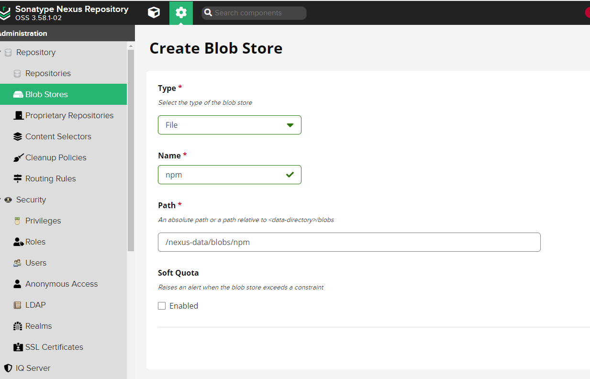
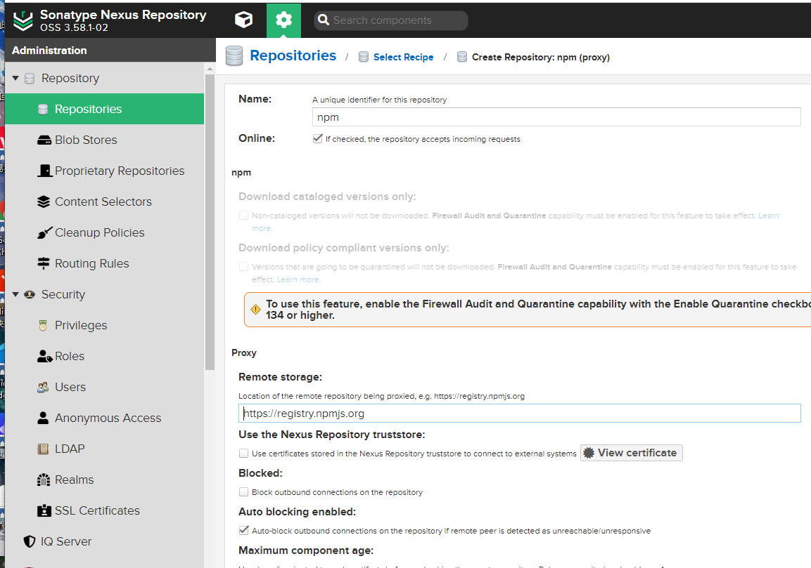
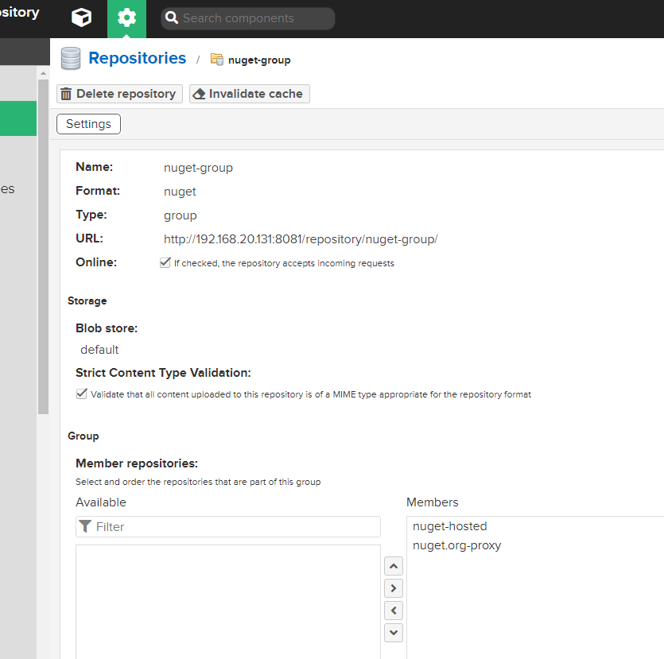
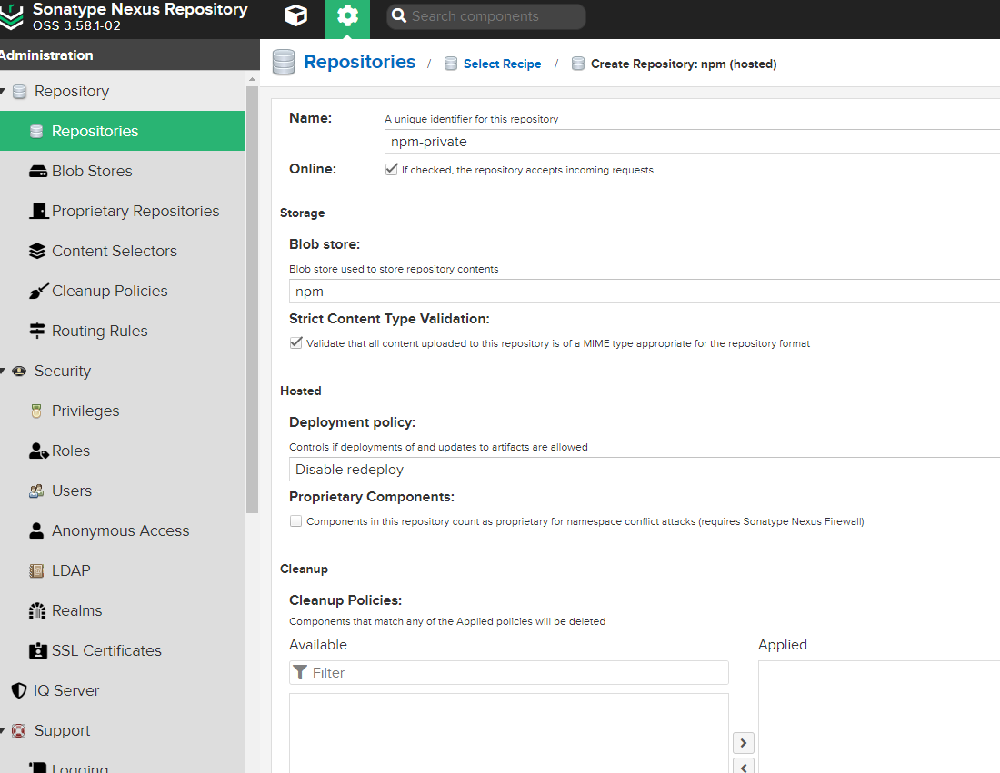
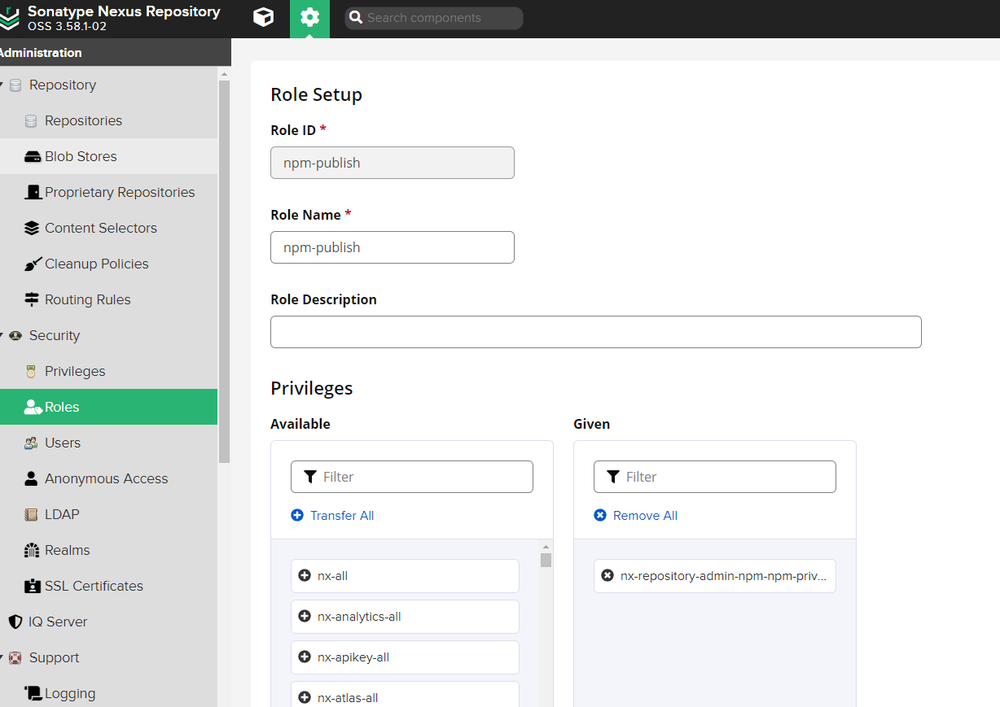
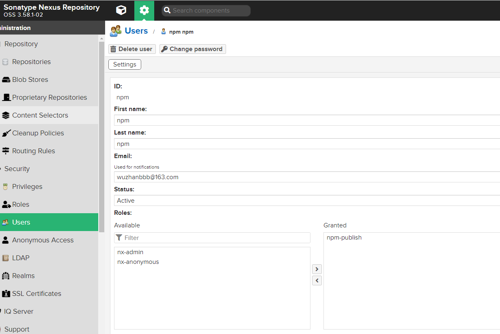
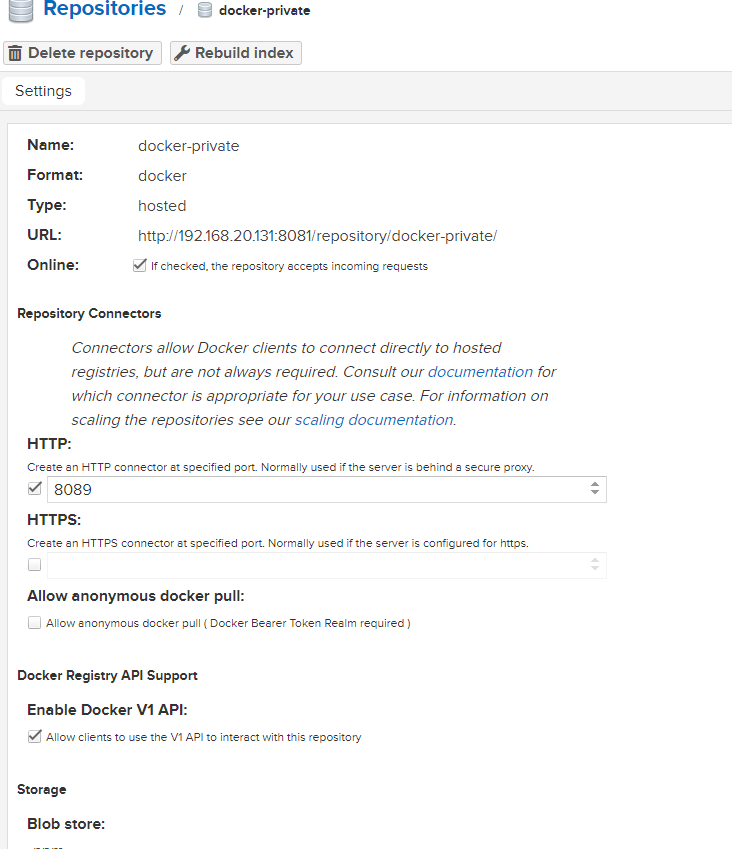
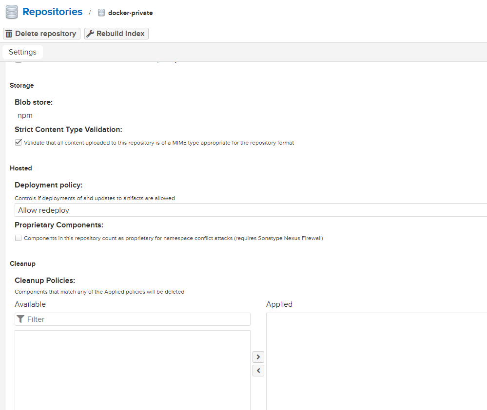
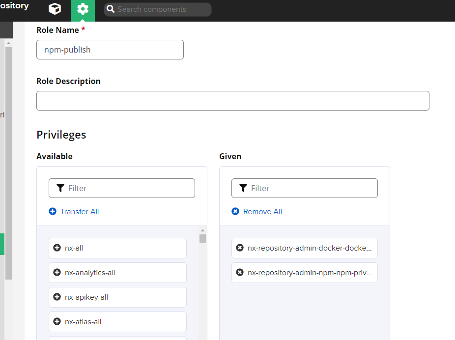

# nexus 3

Sonatype Nexus 3 软件仓库服务器，它既是一个私有软件仓库服务器，又可以作为代理和缓存服务器从公共的软件仓库获取内容，官网在 https://www.sonatype.com/products/nexus-repository 。


## 安装

下载对应的 docker

```bash
docker pull sonatype/nexus3:3.58.1
```

运行 docker

```bash
docker run -d -p 8081:8081 --network=host --name nexus sonatype/nexus3:3.58.1
# 设置端口为8081
# 设置使用宿主机的网络
```

## 建立npm私有库

### 新建 blob stores

用于文件的blob存储。

blob stores 相关文档：https://help.sonatype.com/repomanager3/nexus-repository-administration/repository-management/configuring-blob-stores



### 创建 Repositories

**单个源映射创建**

创建第一步 select recipe 选择 npm(proxy)

然后填入 name 和 remote storage



这里的 remote storage 也就是源有：

https://registry.npmjs.org	对应 npm

https://registry.npm.taobao.org	对应 cnpm

http://mirrors.cloud.tencent.com/npm/	对应 腾讯源

https://repo.huaweicloud.com/repository/npm/	对应 华为源

同样方法，可以分别创建以上四个。

**群组创建**

然后创建群组，用于打包上面四个映射，拉去包时，按照策略择优使用。

创建第一步 select recipe 选择 npm(group)

然后调整 Member repositories 顺序，最终创建



使用时，直接使用上边群组的地址作为源即可。

## NPM私有库上传

### 新建关系映射

新建关系映射，select recipe 选择 npm(hosted) 

然后注意选择 Deployment policy 存储策略为 Disable redeploy

> 在使用 Nexus3 创建 Repositories 为 npm(hosted) 时，deployment policy 选项用于控制如何允许或禁止组件的部署。以下是各个选项的意思：
>
> 1. Allow Redeploy (允许重复部署)：
>    - 如果设置为 Allow Redeploy，客户端可以将组件部署到该仓库，并且在后续的部署中覆盖同一组件。这意味着你可以重复部署同一个组件，每次部署都会覆盖之前的版本。
> 2. Disable Redeploy (禁止重复部署)：
>    - 如果设置为 Disable Redeploy，客户端只能将某个组件部署一次，任何尝试重新部署组件的操作都将导致错误。这意味着一旦组件被部署，就不能再次进行部署。
> 3. Read-only (只读)：
>    - 如果设置为 Read-only，将不允许进行任何部署操作，仅允许读取组件。这样，该仓库只能被用作只读的依赖库，不能往里面部署任何新的组件。
> 4. Deploy by Replication Only (仅通过复制部署)：
>    - 这个选项可能与 Nexus 的复制策略有关，如果设置为 Deploy by Replication Only，可能表示只能通过复制方式来进行部署，而不能直接在此仓库上进行部署。
>
> 一般选择 Disable Redeploy 原因时用版本管理我们的包，所以只允许上传一次，下一次上传需要是新的版本。



然后创建完毕，我们打包时，注意**使用 npm-private 的地址**作为源（免费版不支持npm(group)作为上传的源）

### **创建用户与角色**

点击 roles 创建权限，选择 privileges 如下



创建用户



### **设置密码与打包**

然后项目内操作如下：

```bash
# 首先编码用户名密码用于登录
echo -n 'npm:.Wzxcvbnm123' | base64
# "bnBtOi5XenhjdmJubTEyMw=="

# 然后设置 .npmrc
registry=http://192.168.20.131:8081/repository/npm-private/
//192.168.20.131:8081/repository/npm-private/:_auth="bnBtOi5XenhjdmJubTEyMw=="
# 检查校验 .npmrc
npm config fix

# 打包
npm publish
```

## DOCKER私有库上传

新建关系映射，select recipe 选择 docker(hosted) 

注意不要勾选 Allow anonymous docker pull ( Docker Bearer Token Realm required )

然后 HTTP 写入 8089 （通过这个接口访问）





然后修改角色，搜索 docker-private-*



然后进入服务器

修改配置

```bash
$ sudo vim /etc/docker/daemon.json
# 添加
"insecure-registries": [
    "192.168.20.131:8089"
],
# 重启服务
sudo systemctl daemon-reload
sudo systemctl restart docker
```

然后操作

```bash
# 登录远程库
docker login -u npm -p …… 192.168.20.131:8089
# 添加远程tag
docker tag busy:latest 192.168.20.131:8089/busy:latest
docker images # 查看是否添加成功
# push
docker push 192.168.20.131:8089/busy:latest
```

