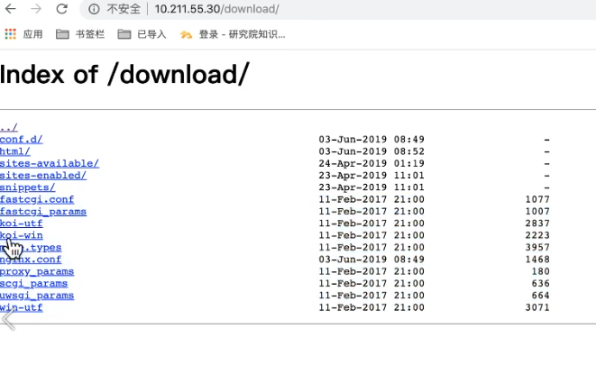

# Nginx 学习

## 简介

Nginx是一款异步框架的轻量级、、高性能的web服务器/反向代理服务器/缓存服务器/电子邮件代理（IMAP/POP3）服务器。再BSD-like协议下发行。由俄罗斯程序设计师开发。

优点：高并发，基于epoll/kqueue 模型开发，支持高并发量，官方说其支持高达5w并发连接响应。

内存消耗少：善于处理静态文件，相较于其他web（apache），占用更少的内存资源。

简单稳定：配置简单，运行简单，运行稳定。

模块化程度高，功能模块插件化设计，可以自由配置响应的功能。

支持Rwrite重写规则：能根据域名，url等请求关键点，实现定制化的高质量分发。

低成本：Nginx的负载均衡能力强大而且免费开源，相较于几十万的硬件负载均衡器成本相当低。

支持多系统：Nginx由c语言编写。

缺点：相对于apache web软件能力稍微欠缺。

## 安装

安装

```bash
apt install nginx
```

查看状态

```bash
ps jx | grep nginx
```

关闭启动

```bash
service nginx start
service nginx stop
```

当启动报错时检查

```bash
nginx -t # 检查错误	

nginx -s reload # 重新启动
```

配置目录

```bash
cd /etc/nginx/ # 配置目录
cd /etc/nginx/nginx.conf # 全局配置文件
cd /var/log/nginx/ # 日志目录
```

默认首页目录

```bash
cd /usr/share/nginx/html/
```

## 操作

案例

```nginx
user www-data; # 服务器名字
worker_processes auto; # 自动开启
pid /run/nginx.pid;# 端口，启动后才有这个文件

events {
	worker_connections 768; # 最大连接数
	# multi_accept on;
}
# 全局配置
http{  
    includ /etc/nginx/mime.types; # 支持的文件类型
    default_type application/octet-stream; # 默认文件类型
    sendfile on; #高效传输文件模式
    autoindex on; #开启目录列表访问，适合服务器默认关闭
    tcp_nopush on; # 防止网络阻塞
    tcp_nodelay on; # 防止网络阻塞
    keepalive_timeout 120; # 长连接超时时间，秒
	gzip on; # 开启gzip压缩输出
    
    access_log /var/log/nginx/access.log; # log
	error_log /var/log/nginx/error.log;
    
    include /etc/nginx/conf.d/*.conf; # http中，可以导入server，表示这个目录下.conf 文件都是nginx的配置文件。
    
    ###############
    #对首页匹配，饭后返回index.html
	server {
        # 开启一个服务
        listen 10.211.55.30:80; #监听id
        location /{ #指定动作
        	root /etc/nginx/html;
            index index.html;
		}
        # 都是匹配根路径，匹配优先级从下往上
        location / {} # 通用匹配
        location ~ / {} # 优先匹配
        location = / {} # 精确匹配
	}    
}
```

## location

### try_files

`try_files` 用于尝试在文件系统中查找文件，如果**找到**则返回**对应文件**，如果**没找到**则返回指定状态码或转发到其他位置。它主要用于处理静态文件或目录索引。

**案例**

案例中，这里注意的是 

**$uri** 代表这个路径对应的**文件**是否找到，如果找到，则返回。

**$uri/** 代表这个路径对应的**目录**下的**默认文件**是否找到，如果找到，则返回。

=400 代表状态码，前边 $uri $uri/ 都不对时返回 400，当然也可以用 return 400

> 注意，不能在根路径下使用 try_files

```nginx
location /a {
    try_files $uri $uri/ =400;
}
```

**historyApiFallback 对应 nginx 的配置**

webpack 配置如下：

```js
module.exports = {
  //...
  devServer: {
    historyApiFallback: true
  }
};
```

部署到服务器上时 nginx 的配置如下：

```nginx
server {
    listen  80;
    server_name  172.20.47.16;

    location / {
        root /usr/share/nginx/html/console;
        try_files $uri $uri/ /index.html;  # 加上这一行即可，表示任何请求不到文件的请求，都将返回html。
    }

    access_log /var/log/nginx/console_access.log main;
    error_log /var/log/nginx/console_error.log;
}
```

**@meiduo 变量**，如果uri处理导致错误，则将最后发生的错误的状态代码返回给客户端，然后重定向。

```nginx
location / { 
    error_page 404 = @fallback; 
}

location @fallback { 
    proxy_pass http://backend; 
}
```

另一个例子

```nginx

location /b {
    try_files $uri $uri/ = @meiduo # 定义变量
}
location @meiduo {
    return 402;
}
```

### return

`return` 用于直接返回指定的状态码或进行重定向，它更通用，可以用于各种重定向或返回状态码的场景。

```nginx
##############
    # return重定向
    location / {
       return 302 http://www.baidu.com;     
    }  
```

### alias 和 root

```nginx
    ################## 
    location / {   
    	alias /etc/nginx/html/ # 同 root 比，后边需要加一个 /   
    }
	###############
	location /i/ {
    	alias /data/w3/images/;# 匹配 /i/top.gif 时，会返回 /data/w3/images/top.gif
	}
	##################
	location /a/ {   
    	alias /etc/nginx/html/ # 会匹配 http:XX/a/ 的url，然后获取数据库 /etc/nginx/html/ 下的资源
    }
	location /a/ {   
    	root /etc/nginx/html # 会匹配 http:XX/a/ 的url，然后获取数据库 /etc/nginx/html/a/ 下的资源
        # 同alias比，会后边拼上 /a/
    }
```

### location具体语法

`location [ = | ~ | ~* | ^~ ] uri { ... }`

重点看方括号中的` [ = | ~ | ~* | ^~ ]`，其中 `|` 分隔的内容表示你可能会用到的语法，其中：

#### **= 表示精确匹配**：

```nginx
location = /test {
    return 200 "hello";
}
```

例如：

```nginx
/test              ok
/test/             not ok
/test2             not ok
/test/2            not ok
```

#### **~ 表示区分大小写的正则匹配：**

```nginx
location ~ ^/test$ {
    [configuration] 
}
```


例如：

```nginx
/test              ok
/Test              not ok
/test/             not ok
/test2             not ok
```

#### **~* 表示不区分大小写的正则匹配：**

```nginx
location ~* ^/test$ {     
    [configuration] 
}
```

例如：

```
/test               ok
/Test               ok
/test/              not ok
/test2              not ok
```

#### **^~ 表示 uri 以某个字符串开头：**

理解为匹配url路径即可(非正则)

```nginx
location ^~ /images/ {    
    [configuration] 
}
```

例如：

```
/images/1.gif        ok
```

#### **/ 表示通用匹配：**

任何请求都会匹配到

```nginx
location / {     
    [configuration] 
}
```


例如：

```
/index.html           ok
```

### location匹配顺序

Location的定义分为两种：

前缀字符串（prefix string）、正则表达式（regular expression），具体为前面**带 ~* 和 ~ 修饰符**的为**正则**。

#### 优先级

**等号**类型（=）的优先级最高。一旦匹配成功，则不再查找其他location的匹配项。

如果符合带有 **^~ 修饰符**的URI，一旦匹配成功，则不再查找其他location的匹配项。（**会匹配表达式最长的那个**）

然后按照定义文件的顺序，检查**正则表达式**，匹配到就停止；

当正则表达式匹配不到的时候，使用再使用**前缀字符串**匹配；

#### 总结

在**顺序**上：

前缀字符串顺序不重要，按照匹配**长度**来确定；

正则表达式则按照定义顺序；

在**优先级**上：

**=** 修饰符最高，**^~** 次之，再者是**正则**，最后是**前缀字符串**匹配。

## 访问权限

```nginx
location / {
	stub_status on; # 返回nginx状态信息
	allow 10.211.55.30; # 允许访问ip
    deny all; # 其他的ip都拒绝访问
}
```

```nginx
# 目录下载控制
location /download {
    alias /etc/nginx/
    autoindex on; # 开启
    autoindex_exact_size off; # 显示文件大小
    autoindex_localtime on; # 显示文件时间为GMT格式。
}
```



## 反向代理

正向代理，代理的是客户端。

客户端请求发往代理服务器，代理服务器在取请求web服务器，这样web服务器获取不到客户端信息。


反向代理，代理的是服务器。可以隐藏服务器的信息


```nginx
# 反向代理
server{
    listen 10.x.x.x:80
    location /{
        # 反向代理使用
        proxy_pass http://10.x.x.x:8000;
       
    }
}
##################
# 负载均衡
upstream meiduo{ # 顺序执行
    ip_hash; # ip_hash,根据一个ip返回响应的服务器
    server http://10.x.x.x:8000;
    server http://10.x.x.x:8001;
    server http://10.x.x.x:8002 wight=1;# 加权
}
server{
    listen 10.x.x.x:80
    location /{
        # 反向代理使用
        proxy_pass http://meiduo
       
    }
}
server {
    listen 10.x.x.x:8000
    location /{
    	root /etc/nginx/html;
        index 8000.html
    }
}
server {
    listen 10.x.x.x:8001
    location /{
    	root /etc/nginx/html;
        index 8001.html
    }
}
```

负载均衡算法，轮询，加权轮询，ip_hash算法

进入目录

```bash
cd /etc/nginx/conf.d
```

### proxy_pass 路由加 / 

1，proxy_pass 最后面**没有斜杠**，匹配路径**有**斜杠(/bbb/)

```nginx
location /bbb/{
	proxy_pass http://10.9.2.248:9091;
}
```

浏览器请求为 http://10.9.2.248/bbb/ 时，实际访问地址为  http://10.9.2.248:9091/bbb/ （把 location 后边的 **/bbb/ 拼上**了）

2，proxy_pass 最后面**有斜杠**，匹配路径**有**斜杠(/bbb/)

```nginx
location /bbb/{
	proxy_pass http://10.9.2.248:9091/;
}
```

浏览器请求为 http://10.9.2.248/bbb/ 时，实际访问地址为  http://10.9.2.248:9091 （没有把 location 后边的 /bbb/ 拼上了）

3，proxy_pass 最后面**没有斜杠**，匹配路径**没有**斜杠(/bbb/)

```nginx
location /bbb{
	proxy_pass http://10.9.2.248:9091;
}
```

浏览器请求为 http://10.9.2.248/bbb 时，实际访问地址为  http://10.9.2.248:9091/bbb/index.html

4，proxy_pass 最后面**没有斜杠**，但是有路由，匹配路径**有**斜杠(/bbb/)

第四种（相对于第三种，最后少一个 / ）

```nginx
location /proxy/ {
	proxy_pass http://127.0.0.1/aaa;
}
```

浏览器请求为 http://10.9.2.248/proxy/test.html 时，实际访问地址为  http://127.0.0.1/aaatest.html


## 备注

### docker 中 nginx 不能访问问题

可能是 ubuntu 中 进程没有关闭，导致端口占用，重启服务器可以解决。

### Redis学习

介绍

Redis是一款高性能的开源键值存储系统，Redis可以被视为一个数据库，因为它提供了一种存储和检索数据的方式。然而，Redis与传统关系型数据库(SQL数据库)有一些区别和特点：

- Redis是一个基于内存的键值存储系统，所有的数据都存放在内存中，因此可以实现非常快速的读写操作。相比之下，传统的SQL数据库通常需要进行磁盘IO操作，速度较慢。
- Redis支持多种数据结构，包括字符串、哈希、列表、集合、有序集合等，这些数据结构适用于各种场景和应用需求。
- Redis通常被用作缓存或者数据层，而不是用来存储长期、重要的数据。通过设置过期时间或者LRU(最近最少使用)等缓存策略，可以方便地控制存储的数据量和缓存的命中率，避免内存溢出或者数据更新不及时的问题。

综上所述，虽然Redis不同于传统关系型数据库，但它仍然可以被视为一种数据库，适用于多种高速读写和缓存场景。


应用场景？

Redis作为高性能的键值存储系统，可以应用于多种场景和应用需求，包括但不限于以下几个方面：

- 缓存: Redis可以将常见查询结果缓存到内存中，从而减少数据库的访问压力，加快Web应用程序的响应速度。
- 消息队列: Redis支持发布/订阅模式和消息传递功能，可以被用作消息队列或任务队列的后端存储。
- 计数器: Redis提供了原子性的自增/自减操作，可用于实现计数器或限流等场景。
- Session存储: Redis的高速读写和可靠性保证，使其成为分布式Web应用程序中管理session的首选方案之一。
- 数据存储: Redis提供了多种数据结构，包括字符串、哈希、列表、集合、有序集合等，可以用来存储和处理各种类型的非关系型数据。
- 地理位置: Redis支持地理位置和坐标相关的操作，例如范围查询和附近搜索等，可用于开发基于位置的应用程序。
- 分布式锁: Redis提供了Redlock算法，支持分布式锁的实现，可用于协调多个进程或者节点之间的资源访问。

总体而言，Redis具有高速读写、多种数据结构和丰富的特性，使其成为一个非常强大和灵活的数据存储方案，适合用于各种Web应用程序和分布式系统中。
