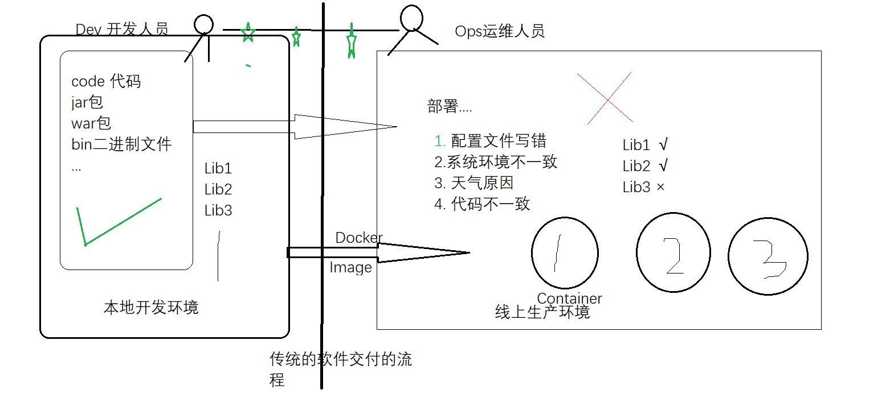

# Dorker 学习

## 简介


### **为啥要用Linux容器技术？**


Hypervisor： 一种运行在基础物理服务器和操作系统之间的中间软件层，可允许多个操作系统和应用共享硬件 。常见的VMware的 Workstation 、ESXi、微软的Hyper-V或者思杰的XenServer。

Container Runtime：通过Linux内核虚拟化能力管理多个容器，多个容器共享一套操作系统内核。因此摘掉了内核占用的空间及运行所需要的耗时，使得容器极其轻量与快速。

### **软件交付过程中的环境依赖**



### **几个知识点**

- 可以把应用程序代码及运行依赖环境打包成镜像，作为交付介质，在各环境部署

- 可以将镜像（image）启动成为容器(container)，并且提供多容器的生命周期进行管理（启、停、删）

- container容器之间相互隔离，且每个容器可以设置资源限额

- 提供轻量级虚拟化功能，容器就是在宿主机中的一个个的虚拟的空间，彼此相互隔离，完全独立

- CS架构的软件产品

  

### **版本管理**

- Docker 引擎主要有两个版本：企业版（EE）和社区版（CE）
- 每个季度(1-3,4-6,7-9,10-12)，企业版和社区版都会发布一个稳定版本(Stable)。社区版本会提供 4 个月的支持，而企业版本会提供 12 个月的支持
- 每个月社区版还会通过 Edge 方式发布月度版
- 从 2017 年第一季度开始，Docker 版本号遵循 YY.MM-xx 格式，类似于 Ubuntu 等项目。例如，2018 年 6 月第一次发布的社区版本为 18.06.0-ce


## 安装

### 安装教程

https://blog.csdn.net/u012563853/article/details/125295985

安装

```bash
# 先卸载旧版，如果没有的话，就不用执行了，直接第二步。
apt-get remove docker docker-engine docker.io containerd runc
# 在终端输入
apt update
sudo apt-get update
apt-get install ca-certificates curl gnupg lsb-release -y
# 安装证书
curl -fsSL http://mirrors.aliyun.com/docker-ce/linux/ubuntu/gpg | apt-key add -
# 写入软件源信息
sudo add-apt-repository "deb [arch=amd64] http://mirrors.aliyun.com/docker-ce/linux/ubuntu $(lsb_release -cs) stable"

# 安装
sudo apt-get install docker-ce docker-ce-cli containerd.io
# 中途出现问题的话，使用  sudo apt-get update 试试
# 启动docker
systemctl start docker

# 安装工具
apt-get -y install apt-transport-https ca-certificates curl software-properties-common
# 重启docker
service docker restart
# 测试是否成功，输入sudo docker run hello-world 显示以下信息则成功，第一次比较慢。

# 查看docker版本 
sudo docker version
```

启动docker

```bash
systemctl start docker
```

重启docker服务

```bash
service docker restart
```

设置开机自启动

```bash
systemctl enable docker
systemctl daemon-reload
```

### 配置

新建并编辑`/etc/docker/daemon.json`文件

```shell
$ sudo vim /etc/docker/daemon.json
```

设置加速源

进入阿里云docker镜像源

https://cr.console.aliyun.com/cn-hangzhou/instances/mirrors?accounttraceid=c7815cc9cac34695b9802667fd1bafc2fpsz

在daemon文件中添加配置

```bash
sudo mkdir -p /etc/docker
sudo tee /etc/docker/daemon.json <<-'EOF'
{
  "registry-mirrors": [
        "http://192.168.20.131:8089/",
        "https://r4p7cmbk.mirror.aliyuncs.com",
        "https://8xpk5wnt.mirror.aliyuncs.com",
        "https://dockerhub.azk8s.cn",
        "https://registry.docker-cn.com",
        "https://ot2k4d59.mirror.aliyuncs.com/"
  ],
  "insecure-registries": [
    "192.168.20.131:8089"
  ],
  "live-restore": true ,
  "dns": ["114.114.114.114","8.8.8.8","8.8.4.4"]
}

EOF
sudo systemctl daemon-reload
sudo systemctl restart docker
```


查看docker信息

```dockerfile
docker info
```

docker-client

```bash
which docker
```

docker daemon

```bash
ps aux |grep docker
```

然后重启

```bash
sudo systemctl daemon-reload
sudo systemctl restart docker
```


## 核心要素及常用操作详解


三大核心要素：镜像(Image)、容器(Container)、仓库(Registry)

（先整体看下流程，再逐个演示）

### 镜像（Image）

打包了业务代码及运行环境的包，是静态的文件，不能直接对外提供服务。

### 容器（Container）

镜像的运行时，可以对外提供服务。本质上讲是利用namespace和cgroup等技术在宿主机中创建的独立的虚拟空间。

### 仓库（Registry）

- 公有仓库，Docker Hub，阿里，网易...
- 私有仓库，企业内部搭建
  - Docker Registry，Docker官方提供的镜像仓库存储服务
  - Harbor, 是Docker Registry的更高级封装，它除了提供友好的Web UI界面，角色和用户权限管理，用户操作审计等功能 
- 镜像访问地址形式 registry.devops.com/demo/hello:latest,若没有前面的url地址，则默认寻找Docker Hub中的镜像，若没有tag标签，则使用latest作为标签
- 公有的仓库中，一般存在这么几类镜像
  - 操作系统基础镜像（centos，ubuntu，suse，alpine）
  - 中间件（nginx，redis，mysql，tomcat）
  - 语言编译环境（python，java，golang）
  - 业务镜像（django-demo...）

## 权限

给用户添加docker权限

```bash
usermod -aG docker gitlab-runner
```

## 操作演示


### version

查询版本

```bash
docker version
```

```apl
Client: Docker Engine - Community
# 客户端
    Version:           24.0.2
    API version:       1.43
    Go version:        go1.20.4
   	# docker 使用go语言开发，version时也会展示其go语言版本
    Git commit:        cb74dfc # 这个版本的提交信息
    Built:             Thu May 25 21:51:00 2023
    OS/Arch:           linux/amd64 # 系统架构 64位
    Context:           default
    
Server: Docker Engine - Community
# Server端
 Engine:
  Version:          24.0.2
  API version:      1.43 (minimum version 1.12)
  Go version:       go1.20.4
 
  Git commit:       659604f
  Built:            Thu May 25 21:51:00 2023
  OS/Arch:          linux/amd64 
  Experimental:     false
 containerd: # 
  Version:          1.6.21
  GitCommit:        3dce8eb055cbb6872793272b4f20ed16117344f8
 runc: # 运行 docker 的引擎
  Version:          1.1.7
  GitCommit:        v1.1.7-0-g860f061
 docker-init:
  Version:          0.19.0
  GitCommit:        de40ad0
```

### info

查询配置详情

```bash
docker info
```

```apl
Client: Docker Engine - Community
 Version:    24.0.2
 Context:    default
 Debug Mode: false # 是否开启debug模式
 Plugins:
  buildx: Docker Buildx (Docker Inc.)
    Version:  v0.10.5
    Path:     /usr/libexec/docker/cli-plugins/docker-buildx
  compose: Docker Compose (Docker Inc.)
    Version:  v2.18.1
    Path:     /usr/libexec/docker/cli-plugins/docker-compose

Server:
 Containers: 1 # 容器有1个
  Running: 1 # 运行状态有1个
  Paused: 0 # 暂停有0个
  Stopped: 0 # 停止有0个
 Images: 2 # 有多少个镜像
 Server Version: 24.0.2
 Storage Driver: overlay2 # 存储的驱动是overlay2，系统需要支持d_type，linux需要高于3.18
 # overlay2建议使用 
  Backing Filesystem: extfs
  Supports d_type: true
  Using metacopy: false
  Native Overlay Diff: true
  userxattr: false
 Logging Driver: json-file # json-file 会存在本地
 # /var/lib/docker/containers 中存储log文件
 Cgroup Driver: systemd
 Cgroup Version: 2
 Plugins:
  Volume: local
  Network: bridge host ipvlan macvlan null overlay
  Log: awslogs fluentd gcplogs gelf journald json-file local logentries splunk syslog
 Swarm: inactive # swarm容器编排工具 是否启动，建议使用 k8s 
 Runtimes: io.containerd.runc.v2 runc
 Default Runtime: runc # docker 运行容器的标准 docker的调用删除都是基于runc
 Init Binary: docker-init
 containerd version: 3dce8eb055cbb6872793272b4f20ed16117344f8
 runc version: v1.1.7-0-g860f061
 init version: de40ad0
 Security Options:
  apparmor
  seccomp
   Profile: builtin
  cgroupns
 Kernel Version: 5.15.0-75-generic
 Operating System: Ubuntu 22.04.2 LTS
 OSType: linux
 Architecture: x86_64
 CPUs: 2
 Total Memory: 3.787GiB
 Name: dev
 ID: 6f583c28-c7c3-41d1-b581-8ca425243440
 Docker Root Dir: /var/lib/docker
 # 在 daemon.json 修改 "data-root": "/data/docker" 属性可以修改 Root Dir
 # root dir 尽量存储在单独的磁盘里，ssd硬盘最好，后边可能会比较大
 Debug Mode: false
 Experimental: false
 Insecure Registries: # 
  192.168.100.120:5000
  127.0.0.0/8
 Registry Mirrors: # 镜像仓库
  https://r4p7cmbk.mirror.aliyuncs.com/
  https://dockerhub.azk8s.cn/
  https://registry.docker-cn.com/
  https://ot2k4d59.mirror.aliyuncs.com/
 Live Restore Enabled: false # 生产环境建议设置为true
# 如果不开启，当docker重启时，会出现docker ps 查到的进曾仍在，但是容器已经关闭的情况。
# 在Daemon不可用的时候，保持容器继续运行，这样就减少了在Daemon进行升级或者出现问题的时候容器的停机时间。那这个特性就叫做Live Restore 
# 在 daemon.json 修改 "live-restore": true

```

配置daemon.json

```bash
vim /etc/docker/daemon.json
sudo systemctl reload docker.service
sudo systemctl daemon-reload
sudo systemctl restart docker
```

配置service

进入目录

> 配置servic的内容也是 docker info 的内容

```bash
vim /usr/lib/systemd/system/docker.service
```

### search

查询docker远程库

```
docker search nginx
```

其中带有 OFFICIAL 的则是官方镜像

### pull

**镜像寻径**

如果没有设置 tag ，会默认加上 latest 作为 tag 寻找。


**拉取镜像**

```bash
docker pull nginx:alpine
```

> 确定镜像
>
> + image_id
> + repository:tag

**查看镜像**

```
docker images -a
```

### 删除image镜像

```bash
docker image rm [name]
或者
docker rmi [name]
```

### 缓存清理

```bash
# 删除未被使用的镜像
docker image prune

# 删除悬空的镜像
docker image prune --filter dangling=true

# 删除未被使用的容器
docker container prune

# 删除所有悬空的容器
docker container prune --filter status=exited
```

**清除构建的缓存**

强制删除所有的当前无使用的资源，包括如下：磁盘，关闭的容器、无用的数据卷和网络，以及没有 tag 的 image （就是显示none的）

```perl
docker system prune -a
```


### cp

拷贝一个文件到对应的docker目录中

```bash
echo "test cp" -> inde.html # 写一个数据到inde.html中
docker cp inde.html fdd7a……:/usr/share/nginx/html/
```

### history 

使用history可以查看images的层级

例如

```bash
 docker history 9992013c473b
```

### run

#### 启动镜像

分为前台启动和后台启动

**前台**

前台启动一般在调试阶段启动。

例如 `nginx -g daemon off` 前台启动

**后台**

docker后台启动，但是进程是前台启动，如果前台进程执行完，后台的docker容器也会瞬间关闭。


这里的status 为 Exited 时 ，为关闭状态。

command为启动的进程

```bash
# 前台启动
docker run -ti centos：8 bash
# -ti 打开一个终端，前台启动
## 后台启动
# 
docker run --name nginx -d nginx:alpine
#--name 启动的镜像
#-d 后端运行
```

#### 使用主机网络模式

```bash
# --network=host 使用主机网络模式（重要，有他就可以上网了）
docker run --name nginx -d -p 8080:80 --network=host nginx:alpine
```

#### 端口映射

```bash
# -p 映射端口,把容器的端口映射到宿主机中,-p <host_port>:<container_port>
# 这时候访问浏览器 http://192.168.100.120:8080/ 会重定向到镜像的80端口
docker run --name nginx -d -p 8080:80 nginx:alpine
```

#### 分配终端启动

```bash
docker run --name nginx -ti nginx:alpine /bin/sh
# -ti与/bin/sh或者/bin/bash配套使用，意思未分配一个tty终端

docker run -ti --rm nginx:commit bash
# --rm 当终端关闭时，删除容器
 
```

注意 alpine 镜像只能使用 sh，如果安装 bash，镜像内输入

```bash
#更新Alpine的软件源为国内（清华大学）的站点，因为从默认官源拉取实在太慢了。。。
echo "https://mirror.tuna.tsinghua.edu.cn/alpine/v3.4/main/" > /etc/apk/repositories
apk update \
        && apk upgrade \
        && apk add --no-cache bash \
        bash-doc \
        bash-completion \
        && rm -rf /var/cache/apk/* \
        && /bin/bash
```

#### 限制条件

```bash
docker run --cpuset-cpus="0-3" --cpu-shares=512 --memory=500m nginx:alpine
# --cpuset-cpus 用到cpu的 核数
# --cpu-shares cpu权重（时间比重）默认是1024
# --memory 内存限制
```

> 这些资源限制，使通过 Control groups 实现的

#### 数据持久化

```powershell
## 挂载主机目录
docker run --name mysql -e MYSQL_ROOT_PASSWORD=123456 -d -v /opt/mysql/:/var/lib/mysql
# -v 把 /var/lib/mysql 数据 挂在到 /opt/mysql/ （镜像内）上。

## 使用volumes卷
docker volume ls
docker volume create my-vol
# 宿主机 my-vol 卷，挂在 /opt/my-vol
docker run --name nginx -d -v my-vol:/opt/my-vol nginx:alpine
docker exec -ti nginx touch /opt/my-vol/a.txt

## 验证数据共享
docker run --name nginx2 -d -v my-vol:/opt/hh nginx:alpine
docker exec -ti nginx2 ls /opt/hh/
a.txt
```


### 查看日志

```bash
## 查看全部日志
$ docker logs nginx

## 实时查看最新日志
$ docker logs -f nginx

## 从最新的100条开始查看
$ docker logs --tail=100 -f nginx
```

### 镜像保存

#### commit

修改完docker后commit一个新的提交

```bash
docker commit -a "wuzhan" -m "[ADD]add index.html" fdd…… nginx:commit
# -a :提交的镜像作者；
# -c :使用Dockerfile指令来创建镜像；
# -m :提交时的说明文字；
# -p :在commit时，将容器暂停。
# fdd…… nginx:commit 容器id 新的镜像名字
```

#### save

**导出镜像到文件中**

```bash
docker save -o nginx-alpine.tar nginx:alpine
```

**从文件加载镜像到 images**

```bash
docker load -i nginx-alpine.tar
```

#### export

将文件系统作为一个tar 归档文件导出到 STDOUT。

```bash
docker export [OPTIONS] CONTAINER
# -o 将输入内容写到文件。
```

实例：将id为a404c6c174a2的容器按日期保存为tar文件。

```bash
docker export -o mysql-`date +%Y%m%d`.tar a404c6c174a2
# ls mysql-`date +%Y%m%d`.tar
# mysql-20160711.tar
```

**三者对比** https://zhuanlan.zhihu.com/p/152219012

### 容器

#### 启动退出容器

```bash
## 启动退出容器
$ docker start nginx
```

#### 关闭一个容器

```bash
docker stop 11a # 这里写入container id 可以写入前几个字符就可
```

#### 删除容器

```powershell
## 停止运行中的容器
$ docker stop nginx
# 删除容器
docker rm nginx:alpine

docker rm -f nginx:alpine # 删除运行中的镜像

docker rm $(docker ps -aq) # 批量删除容器
# -aq 是所有容器的id

# 同步删除镜像
docker rm -v container_name
```

#### 查看容器列表

```bash
## 查看运行状态的容器列表
$ docker ps

## 查看全部状态的容器列表（包括未运行，报错的）
$ docker ps -a
# -q 查看id
```

#### 进入终端

```bash
$ docker exec -ti 9788…… sh
# 进入一个容器的终端
# 使用root用户登录（-u 0 就是root）
docker exec -u 0 -it id /bin/bash
```

打印容器运行地址

```bash
docker exec -ti 9788…… ifconfig
# 这里 ifconfig可以换成任何参数，例如 python 直接运行一个python命令行。
```


#### 查看容器或者镜像的明细

```bash
## 查看容器详细信息，包括容器IP地址等
$ docker inspect nginx

## 查看镜像的明细信息
$ docker inspect nginx:alpine
```

#### history

查看修改记录

```
docker history nginx:alpine
```


#### 安装软件

安装软件时需要root权限，进入容器时输入

```bash
docker exec -u 0 -it id /bin/bash
```

然后执行 apt update，如果报 The following signatures couldn't be verified because the public key is not available: NO_PUBKEY 871920D1991BC93C 错时则输入

```bash
apt-key adv --keyserver keyserver.ubuntu.com --recv-keys 871920D1991BC93C
```


### registry远程仓库

#### 安装

部署镜像仓库，部署自己的镜像仓库

下载镜像仓库镜像

```
docker pull registry:2
```

安装镜像到容器内

```bash
docker run -d -p 5000:5000 --restart always -v /opt/registry-data/registry:/var/lib/registry --name registry registry:2
```

> 如果是解压过来的 ，/opt/registry-data/registry 里边是镜像仓库中原来存在的一些镜像，移动到/var/lib/registry中，如果没有则就是空目录移动即可。

详细教程：https://docs.docker.com/registry/ 

#### **推送镜像到仓库**

标记image，使其指向您的注册表，连接远程仓库。

```bash
docker image tag nginx:alpine localhost:5000/nginx:alpine
```

推动镜像

```
docker push localhost:5000/nginx:alpine
```

拉取

```
docker pull localhost:5000/nginx:alpine
```

#### **删除仓库数据**

现在停止您的注册表并删除所有数据

```bash
docker container stop registry ## 停止
docker container rm -v registry ## 删除所有数据
```

#### **做成http仓库**

可以通过证书制作

https://docs.docker.com/registry/deploying/#run-an-externally-accessible-registry

也可以通过 daemon 方式，在另一台服务器（客户端）配置

```bash
cat /etc/docker/daemon.json
{
  "registry-mirrors": [
    "https://8xpk5wnt.mirror.aliyuncs.com"
  ],
  "insecure-registries": [
     "192.168.100.120:5000"
  ]
}
systemctl restart docker
docker pull 192.168.100.120:5000/nginx:alpine
```


## Dockerfile

学习案例 docker-library

https://github.com/orgs/docker-library/repositories?type=all

文档地址

https://docs.docker.com/engine/reference/builder/

### 指令介绍

制作镜像 用 commit 不是特别好，用 Dockerfile 制作镜像。


maintainer 信息，新版docker建议使用 label

volume 创建挂在点，保存容器产生的一些数据

> docker 不推荐保存文件数据的，但是比如数据库需要保存一些数据就需要创建挂载点

env 环境变量

>  基础镜像做应用的时候就不要使用env了，可以使用`docker run -ti -e a=b -e b=c`用 -e 引入变量


add 复制文件到容器内

### 简单制作

创建 Dockerfile 文件，该文件名必须为 Dockerfile，否则报错

输入

```dockerfile
FROM centos:8

LABEL maintainer="test dockerfile"
LABEL test=dockerfile

RUN useradd dot
RUN mkdir /opt/dot
# 注意如果有错误，前边执行过的，再次build docker就不会再执行了。所以开发时候还是分开写run
# 如果测试没问题，优化时候，可以这样写：RUN useradd dot & mkdir /opt/dot 用 & 连接

CMD ["sh","-c","echo 1"]
# 执行 docker run -ti --rm centos:user 后会打印一个 1
```

#### build

然后 build 这个文件，到 images 中

```bash
docker build -t centos:user .
# -t 设置它的 tage
# . 代表当前目录

docker build -t centos:user -f tdir/Dockerfile
# 也可以用 -f 指定文件

docker build --network=host -t ssh:bash -f tdir/Dockerfile 
# 设置网络为宿主机网络
```

然后开启终端

```bash
docker run -ti --rm centos:user bash
# 注意使用rm否则会产生很多垃圾容器
```

然后观察成果

```bash
# 查看创建的用户
cat /etc/passwd | grep 'dot'
```

> build 执行时会生成一个临时容器，然后执行 RUN 命令。
>
> 
>
> 后边在执行完后，会删除这个临时容器，同时commit一个image出来。

#### arg

参数传入 ARG

```bash
docker build --build-arg username=清风怎不知意 -t myapp:tag-v0.0.1 .

ARG username=123 # 这里123是默认值
```


#### 修改bug

在build过程中可能出错，例如在 WORKDIR /app 这句出错，我们可以直接运行它生成的层级查看错误。

```bash
docker run -it 4320f8b526bc /bin/bash
```


### cmd

cmd 启动容器默认执行的命令，它可以被覆盖掉，比如`docker run -ti --rm nginx:commit bash`这里的 bash 就是覆盖了cmd

**注意**：

同entrypoint 不同，多个cmd在代码中时，只会执行最后一个cmd指令，而entrypoint多个指令都会执行。如果有在启动docker就要启动的多个服务时，会选用entrypoint。

同entrypoint 不同，cmd 可以被 -ti bash 覆盖，而entrypoint 不会被覆盖

```dockerfile
docker run -ti --rm centos bash
# entrypoint 执行的指令已经执行，同时进入控制台中。
```


### **entrypoint**

entrypoint 容器启动的第一个命令，

>  entrypoint 和 cmd 必须有一个，如果两个都有，cmd就会变成 entrypoint 的参数。

修改Dockerfile为

```dockerfile
FROM centos:8

LABEL maintainer="test dockerfile"
LABEL test=dockerfile

RUN useradd dot
RUN mkdir /opt/dot

ENTRYPOINT ["sleep"] # 延迟一段时间向下执行

CMD ["3"] # cmd作为entrypoint的参数，延迟3秒
```

覆盖cmd

```bash
docker run -ti --rm centos:sleep 10 # 覆盖为10秒
```

### from

from 继承自那个镜像

例如nginx 就是从 alpine:3.11 继承做的。

> 项目参考地址：https://github.com/nginxinc/docker-nginx/blob/master/stable/alpine/Dockerfile


### env

```dockerfile
FROM centos:8

LABEL maintainer="test dockerfile"
LABEL test=dockerfile

ENV test_env1 env1# 可以使用空格赋值
ENV test_env2 env2

RUN useradd dot
RUN mkdir /opt/dot

# ENTRYPOINT ["echo"]
ENV env1=env123# 也可以使用等号赋值
CMD echo "${test_env1} ${test_env2} ${env1}"

```

执行

```bash
docker build -t centos:env .
docker run -ti --rm centos:env
```

### add

类似与 copy 他会自动解压

首先准备一个压缩包

```bash
echo test -> index.html
tar zcf index.tar.gz index.html
```

然后添加代码

```dockerfile
# 添加代码
ADD ./index.tar.gz /opt/
```

打包执行

```
docker build -t centos:add .
docker run -ti --rm centos:add bash 
```

发现 centos 目录中，index.html已经自动解压


### copy

注意对于 COPY 来说，他会COPY一个目录下的所有文件，当前目录不会copy的

```dockerfile
# ./t 这里要写相对路径，如果需求是绝对路径，需要先cd到对应目录在使用相对路径
COPY ./t /opt/
# opt 下会有 t 目录的所有文件，如果想要 t 目录则需要在 t 目录中建一个 t 目录
```

>  添加远程文件时，可以使用指令 curl 或者 wget 加载。

### workdir

设置容器工作目录，比较常用

```dockerfile
WORKDIR /opt/dot # 指定根目录为 dot 目录

CMD pwd;ls # 然后 pwd 查看目录 ，ls 查看文件
```


也可以多次执行 workdir 类似于 cd 指令。

```dockerfile
WORKDIR /test
WORKDIR demo # 进入了 /test/demo
```

### user

启动容器时用什么用户

```dockerfile
USER 1000 # 用户id
```

然后启动

```bash
docker build -t centos:add .
docker run -ti --rm centos:user bash 
```

然后发现 centos 系统中用的是 dot 用户


### volume

创建一个独立的卷

```dockerfile
VOLUME /data # 在容器里边创建一个挂在点
```

在容器外，宿主机里边也会自动创建一个目录

/var/lib/docker/volumes


在 8fe092…… 中存储了 data 中的数据。

使用 -v 可以改变这个目录

```
docker run -ti --rm -v /root/mysql_data/:/data centos:volume bash
```

### run

run 则就是执行那些 shell 命令。


安装软件时注意清理缓存

```dockerfile
RUN apt-get update && apt-get install -y --no-cache perl && rm -rf /var/lib/apt/lists/* 
# --no-cache 清除缓存
# rm -rf /var/lib/apt/lists/* 删除下载包
```

使用 --name 指定名字 

```bash
dockers run -d --name=demo xia……
```


### copy

容器外内容复制到容器内

```dockerfile
WORKDIR /opt/mylog # 容器内的目录
COPY . . # 把容器外（Dockerfile 所在目录内容）复制到/opt/mylog（工作目录）
```

### expose

expose 暴露的端口号，镜像启动后，镜像对外暴露那些端口

## 制作小镜象

### alpine

不要使用centos镜像，需要使用 Alpine 镜像或者 busybox、scratch（不推荐）

```dockerfile
FROM alpine # 继承 alpine

LABEL maintainer="test dockerfile"
LABEL test=dockerfile

ENV test_env1 env1
ENV test_env2 env2

RUN adduser -D dot # 修改 adduer 加上 -D 参数
RUN mkdir /opt/dot

VOLUME /data
ENV env1=env123
CMD echo "${test_env1} ${test_env2} ${env1}"
```

执行时

```bash
docker build -t centos:user .
docker run -ti --rm centos:user sh # alpine 没有 bash 只有 sh
```

### **多阶段构建**

使用多阶段构建：编译操作和生产最终镜像的操作分开。（多个 from）

```dockerfile
# 第一次构建，使用 go build 生成系统可执行的代码文件
FROM golang:1.14.4-alpine as builder

WORKDIR /opt

COPY main.go /opt

RUN go build /opt/main.go 

CMD "./main"

# 第二阶段，使用上一阶段的代码文件，在alpine上执行，有效缩小大小（打出生产包）
FROM alpine:3.8

COPY --from=0 /opt/main # --from=0 则是第一阶段的产物（./main下的一切）
# 也可以用 --from=builder 是 from as 后边的定义

CMD "./opt/main"

```

例如一个php的


里边 docker-php-ext-install 是docker 推荐的安装指令，可以删除一些缓存（--no-cache）

然后第二阶段

```dockerfile
FROM php:7.1.22-fpm-alpine
COPY --from=0 /user/local/lib/php/ext.... /user/.....
# 作用则是把第一阶段安装的文件复制到新的容器内，缩小容器体积
```

scratch 是一个空镜像，使用from去进行继承。无需pull 

```bash
FROM scratch
COPY --from=builder /opt/main/
CMD "./main"
```

作用就第二阶段产出的数据，做单独存储


**备注**

学习1： https://zhuanlan.zhihu.com/p/340550675


