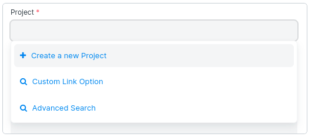

# frappe 学习

## 创建

创建一个app

```bash
bench new-app library_management
```

安装这个应用

```bash
bench --site library.test install-app library_management
# 这里 library.test 是站点，library_management 是app
```

icon库地址

https://primer.style/design/foundations/icons/

创建站点，需要输入mariadb的root密码

```bash
bench new-site library.test
```

开启开发者选项（详情看下边专题）

```js
frappe-bench/sites/{your site}/site_config.json

{
  "developer_mode": 1,
  ...
}
```

> 卸载一个站点
>
> ```bash
> bench drop-site {site名字} --db-root-password {数据库root密码} --no-backup
> 
> # 需要root权限
> # 需要数据库root可以远程连接
> ```

## 配置nginx

首先安装一下进程管理工具

```bash
sudo apt-get install supervisor
```

禁用生产环境

```bash
sudo bench disable-production
```

然后启用nginx和supervisor

```bash
sudo service nginx stop
sudo service supervisor stop
```

生成nginx配置

```bash
bench setup nginx
sudo ln -s `pwd`/config/nginx.conf /etc/nginx/conf.d/frappe-bench.conf
```

修改nginx配置(需要进入root用户操作)

```bash
cd /etc/nginx
vim nginx.conf
# include /etc/nginx/sites-enabled/*; 注释
nginx -t # 检查错误	

nginx -s reload # 重新启动
# 如出现invalid PID number "" in "/run/nginx.pid"错误，需要执行nginx -c /etc/nginx/nginx.conf
```

启动服务器

```
bench start
```

## 字段分类

### 配置link字段（类似lov）

设置 options 为一个 docType

学习连接https://docs.erpnext.com/docs/v13/user/manual/en/customize-erpnext/articles/creating-custom-link-field


### 级联带出数据

需要先配置一个link字段，然后配置一个级联字段


### 模态框组件

Dialog组件 自定义模式。可以放入表单表格

```js
// 组件位置：\public\js\frappe\ui\dialog.js
new frappe.ui.Dialog()
// 简单使用
var d = new frappe.ui.Dialog({
    'fields': [ // 设置模态框内字段
        {'fieldname': 'ht', 'fieldtype': 'HTML'},
        {'fieldname': 'today', 'fieldtype': 'Date', 'default': frappe.datetime.nowdate()}
    ],  
    primary_action: function(){ // 成功按钮点击
        d.hide();// 隐藏当前模态框
        console.log(d)
        show_alert(d.get_values().today); // 获取模态框数据
    },
    primary_action_label: __("Update Translations"), // 确定按钮的名字,__() 表示翻译多语言
});
d.fields_dict.ht.$wrapper.html('Hello World'); // 给 ht 组件设置值
d.show();// 打开模态框

```

frappe.prompt() 显示确认模式

```js
frappe.prompt(
    [
        {'fieldname': 'birth', 'fieldtype': 'Date', 'label': 'Birth Date', 'reqd': 1}
    ],
    function (values) { // 返回的数据
        show_alert(values.birth, 5);
    },
    'Age verification', // 标题
    'Subscribe me' // 确定按钮名字
)
```

show_alert() 右下角提示组件

```js
// 普通蓝色提示
show_alert('Hi, do you have a new message', 5);
// 成功提示
frappe.show_alert({
    message:__('Hi, you have a new message'),
    indicator:'green'
}, 5);
```

frappe.confirm(message, if_yes, if_no) 确认，取消提示框。

```js
/**
message： 显示在对话框中的消息
onyes：正面确认的回调
oncancel:否定确认回调
*/
frappe.confirm(
    '你确定要离开这一页吗?',
    function(){
        window.close();
    },
    function(){
        show_alert('感谢继续!')
    }
)
```

frappe.warn(title, message_html, proceed_action, primary_label, is_minimizable)警告确认取消框。

显示警告模式，`proceed_actiion`如果给出确认则执行。可以将其设置为`minimizable`允许最小化对话框。

```js
frappe.warn('删除提示！', // 题目
    '您确定删除内容吗，删除则不可还原！', // 内容
    () => {
        // 如果点击确定按钮则执行
    },
    '删除', // 确定按名字
    true // 允许收起弹窗
)
```

进度条弹框 frappe.show_progress()

```js
frappe.show_progress('正在加载..', 70, 100, '进行中');
setTimeout(() => {
	frappe.show_progress('正在加载..', 100, 100, '成功了');
}, 2000)
```

`message`以模式显示

```py
// only message
frappe.msgprint(__('Document updated successfully'));

// with options
frappe.msgprint({
    title: __('Notification'),
    indicator: 'green',
    message: __('Document updated successfully')
});
```

## 工作台配置文件

`bench start`使用[honcho在](http://honcho.readthedocs.org/)**开发者模式**下管理多个进程。

### [流程](https://frappeframework.com/docs/user/en/bench/resources/bench-procfile#processes)

运行冰沙所需的各种过程是：

1. `bench start`- 网络服务器
2. `redis_cache`用于缓存（一般）
3. `redis_queue`用于管理后台工作人员的队列
4. `redis_socketio`作为实时更新/后台工作人员更新的消息代理
5. `web`用于 frappe Web 服务器。
6. `socketio`用于实时消息传递。
7. `schedule`触发周期性任务
8. `worker_*`Redis 工作线程处理异步作业

如果您正在开发冰沙，您可以选择添加：

`bench watch`自动构建桌面 JavaScript 应用程序。

### [样本](https://frappeframework.com/docs/user/en/bench/resources/bench-procfile#sample)

```
redis_cache: redis-server config/redis_cache.conf
redis_socketio: redis-server config/redis_socketio.conf
redis_queue: redis-server config/redis_queue.conf
web: bench serve --port 8000
socketio: /usr/bin/node apps/frappe/socketio.js
watch: bench watch
schedule: bench schedule
worker_short: bench worker --queue short
worker_long: bench worker --queue long
worker_default: bench worker --queue default
```

## 源码解析

### 获取py配置文件 get_doc

执行 get_doc 获取py的配置文件（文件中有继承自 Document 的class）

```python
frappe.get_doc({"doctype": "ToDo"**,** "description": "test23ww"}) 
```

然后进入 `frappe\__init__.py` 执行 get_doc，主要处理缓存。

```py
def get_doc(*args, **kwargs) -> "Document":

	"""返回一个' trap.model.document '。给定类型和名称的文档对象."""

	import frappe.model.document

	doc = frappe.model.document.get_doc(*args, **kwargs)

	# 如果存在过时的缓存，请替换缓存
	……
	_set_document_in_cache(key, doc)
	return doc
```

然后在 \frappe\model\document.py 中 执行 get_doc。主要作用是处理传入的doctype变量和kwargs变量

```py
def get_doc(*args, **kwargs):
	"""返回一个trap.model.document对象.

	:param arg1: 文档字典或DocType名称。
	:param arg2: [可选]文档名称。
	:param for_update: [可选]选择文档更新.

	有多种方法调用' get_doc '

	        # 将从数据库中获取最新的用户对象(带子表)
	        user = get_doc("User", "test@example.com")

	        # 创建一个新的对象
	        user = get_doc({
	                "doctype":"User"
	                "email_id": "test@example.com",
	                "roles: [
	                        {"role": "System Manager"}
	                ]
	        })

	        # 用关键字参数创建新对象
	        user = get_doc(doctype='User', email_id='test@example.com')

	        # 选择要更新的文档
	        user = get_doc("User", "test@example.com", for_update=True)
	"""
	……
	# 获取到了doctype
	controller = get_controller(doctype)  # class 'frappe.core.doctype.version.version.Version'
	if controller:
		# 返回一个模块 class 实例
		return controller(*args, **kwargs)
	……
```

然后执行在 frappe\model\base_document.py 中的 get_controller 获取 class 实例

```py
def get_controller(doctype):
	"""返回给定 DocType 的 Class 实例.
	对于' custom '类型，返回' trap .model.document. document '.
	:param doctype: DocType name as string."""
	def _get_controller():
		……
        # frappe.db.get_value 获取 module_name
		module_name, custom = frappe.db.get_value(
			"DocType", doctype, ("module", "custom"), cache=not frappe.flags.in_migrate
		) or ("Core", False)

		……
		# 是否配置了override_doctype_class，如果没有配置则根据module_name找py配置文件路径，如果配置了则直接使用配置路径
        class_overrides = frappe.get_hooks("override_doctype_class")
        if class_overrides and class_overrides.get(doctype):
            import_path = class_overrides[doctype][-1]
            module_path, classname = import_path.rsplit(".", 1)
            # 例如
            # print(3, import_path, classname)
            # frappe.tests.test_hooks CustomToDo
            module = frappe.get_module(module_path)
            ……
        else:
            # 获取到对应的py模块。例如
            # <module 'frappe.desk.doctype.todo.todo' from '/home/dev/frappe-bench/apps/frappe/frappe/desk/doctype/todo/todo.py'>
            # 由于没有 override_doctype_class 写死的路径，不知道有没有 module_name 所以调用 load_doctype_module 查询
            module = load_doctype_module(doctype, module_name)
            classname = doctype.replace(" ", "").replace("-", "")

        if hasattr(module, classname):
            _class = getattr(module, classname)
            ……
    	return _class
	########## 调用上边的_get_controller方法
	# 是否处于数据库迁移中或者dev模式
	if frappe.local.dev_server or frappe.flags.in_migrate:
		return _get_controller()
	site_controllers = frappe.controllers.setdefault(frappe.local.site, {})
	# 获取site_controllers后，没有doctype对应py中的class方法，使用 _get_controller 获取一下
	# 节约开支
	if doctype not in site_controllers:
		site_controllers[doctype] = _get_controller()
	return site_controllers[doctype]
```

### 设置run函数

在 frappe\frappe\__init__.py 中判断 local.conf.db_type 是否是 false，然后执行 patch_query_execute

```py
if not _qb_patched.get(local.conf.db_type):
    patch_query_execute()
    patch_query_aggregation()
```

初始化builder_class（例如MySQLQueryBuilder）patch_query_execute 

```py
def patch_query_execute():
	"""用助手执行方法修补查询生成器"""
	def execute_query(query, *args, **kwargs):
		……
        # run 执行了 sql
		return frappe.db.sql(query, params, *args, **kwargs)
	def prepare_query(query):
		……
	# 根据路径，例如 frappe.query_builder.builder.MariaDB 获取模块代码，
    # 这里的query_class就是MariaDB
	# get_attr 根据路径使用 import_module 获取模块代码
	query_class = get_attr(str(frappe.qb).split("'")[1])
	# 这里的 builder_class 是 MySQLQueryBuilder，get_type_hints用于返回参数和返回值类型
	builder_class = get_type_hints(query_class._builder).get("return")
	……
    #设置 run 到 builder class 实例上
	builder_class.run = execute_query
	builder_class.walk = prepare_query
    # frappe.conf.db_type 设置为 true
	frappe._qb_patched[frappe.conf.db_type] = True
```

### DB数据库连接

#### 数据获取

在sites中（frappe-bench\sites\library.test\site_config.json）有配置站点的数据库信息

```json
{
 "db_name": "_292c9f9a0532ec87",
 "db_password": "KCA9XShfXLb3O2Br",
 "db_type": "mariadb",
 "developer_mode": 1
}
```

> 而服务器配置则在 frappe-bench\sites\common_site_config.json 中
>
> ```json
> {
>  "background_workers": 1,
>  "file_watcher_port": 6787,
>  "frappe_user": "dev",
>  "gunicorn_workers": 3,
>  "live_reload": true,
>  "rebase_on_pull": false,
>  "redis_cache": "redis://localhost:13000", // redis三件套
>  "redis_queue": "redis://localhost:11000",
>  "redis_socketio": "redis://localhost:12000",
>  "restart_supervisor_on_update": false,
>  "restart_systemd_on_update": false,
>  "serve_default_site": true,
>  "shallow_clone": true,
>  "socketio_port": 9000,
>  "use_redis_auth": false,
>  "webserver_port": 8000
> }
> ```

然后再frappe\frappe\__init__.py中读取这个配置

```python
# 读取完数据后，设置进入配置变量内
local.conf = _dict(get_site_config())
#################
# 读取配置数据 get_site_config
def get_site_config(sites_path: str | None = None, site_path: str | None = None) -> dict[str, Any]:
	"""返回 sites/site_config 与 common_site_config
	'site_config'是一组网站范围的设置，如数据库名称，密码，电子邮件等。
    'common_site_config'则是服务器的配置"""
	config = {}
	sites_path = sites_path or getattr(local, "sites_path", None)
	site_path = site_path or getattr(local, "site_path", None)
	if sites_path:
		common_site_config = os.path.join(sites_path, "common_site_config.json")
		……

	if site_path:
		site_config = os.path.join(site_path, "site_config.json")
		……
	return _dict(config)
```

#### 数据库连接

conf 数据设置完成后，下面进行数据库连接

**初始化 Database**

位置 frappe\__init__.py

```py
def connect(
	site: str | None = None, db_name: str | None = None, set_admin_as_user: bool = True
) -> None:
    # db赋值
    # local.conf.db_name 上边设置的值
    local.db = get_db(user=db_name or local.conf.db_name) 
	……

```

MariaDBDatabase 实例化代码执行

位置 `frappe\frappe\database\__init__.py`

```python
# 实例化代码
def get_db(host=None, user=None, password=None, port=None):
	……
    # MariaDBDatabase 进行实例化，它继承了 Database
	return frappe.database.mariadb.database.MariaDBDatabase(host, user, password, port=port)
# MariaDBDatabase 代码位置 frappe\database\mariadb\database.py
class MariaDBDatabase(MariaDBConnectionUtil, MariaDBExceptionUtil, Database):
    ……
```

MariaDBDatabase/Database 实例化时用到了 db_name

位置 frappe\frappe\database\database.py

```py
class Database:
    def __init__(……):
        self.setup_type_map()
        self.host = host or frappe.conf.db_host or "127.0.0.1"
        self.port = port or frappe.conf.db_port or ""
        self.user = user or frappe.conf.db_name # 设置db_name
        self.db_name = frappe.conf.db_name # 设置db_name
        self._conn = None
        ……
```

**连接数据库**

开始连接数据库，执行 connect()

```python
def sql(……):
    ……
    if not self._conn: # 第一次执行sql时,连接数据
        self.connect()
def connect(self):
    ……
    self._conn = self.get_connection()
    self._cursor = self._conn.cursor()
    ……
```

MariaDBConnectionUtil/get_connection 连接数据库程序

位置 frappe\frappe\database\mariadb\database.py

```py
def get_connection(self):
    conn = self._get_connection()
    conn.auto_reconnect = True
    return conn
def _get_connection(self):
    return self.create_connection()
# 然后在 create_connection 执行了 pymysql.connect
def create_connection(self):
    return pymysql.connect(**self.get_connection_settings())
# 连接数据库的参数设置
def get_connection_settings(self) -> dict:
    conn_settings = {
        "host": self.host,
        "user": self.user,
        "password": self.password,
        "conv": self.CONVERSION_MAP,
        "charset": "utf8mb4",
        "use_unicode": True,
    }
    if self.user not in (frappe.flags.root_login, "root"):
        # 设置了 database
        conn_settings["database"] = self.user
	……
    return conn_settings
```

### doc field 初始化

在 frappe\frappe\__init__.py 中执行 meta.get_meta()

```py
def get_meta(doctype, cached=True):
	import frappe.model.meta
	return frappe.model.meta.get_meta(doctype, cached=cached)
```

在frappe\frappe\model\meta.py 中的 get_meta 返回 一个Meta实例，第一次执行 Meta(doctype) 获得，后边则都从 redis 中读取

```py
def get_meta(doctype, cached=True) -> "Meta":
	if not cached:
		return Meta(doctype)

	if meta := frappe.cache().hget("doctype_meta", doctype):
		return meta

	meta = Meta(doctype)
    # hset 设置一个哈希存储 存储 doctype 对应的 meta
	frappe.cache().hset("doctype_meta", doctype, meta)
	return meta
```

class Meta 用于 Document 构建时的一些工具方法

```py
class Meta(Document):
		def __init__(self, doctype):
		if isinstance(doctype, Document):
			super().__init__(doctype.as_dict())
		else:
			super().__init__("DocType", doctype)
        ……
……
```

Document 所有控制器都继承自它

位置 frappe\frappe\model\document.py

```py
class Document(BaseDocument):
	def __init__(self, *args, **kwargs):
		self.doctype = None
		self.name = None # 这里的name 是 docname
		……
		if args and args[0]:
			if isinstance(args[0], str):
				# 第一个参数是doctype
				self.doctype = args[0]

				# 文档类型用于单个文档，字符串值或过滤器用于其他文档
				self.name = self.doctype if len(args) == 1 else args[1]
				……
				self.load_from_db()
				……
	def load_from_db(self):
		"""从数据库加载文档和子文档并创建属性从领域"""
		self.flags.ignore_children = True
		……
		for df in self._get_table_fields():
			……
			# df.options 对应的是数据库名字 比如 DocField
			children = (
				frappe.db.get_values(
					df.options,
					{"parent": self.name, "parenttype": self.doctype, "parentfield": df.fieldname},
					"*",
					as_dict=True,
					order_by="idx asc",
					for_update=self.flags.for_update,
				)
				or []
			)
			# 给 self.fields 赋值，这里的 fieldname 就是 fields
			# 这里的 children 例如：可以是field的数据
			# {
			# 	  'name': '5846045986',
			# 	  'parent': 'Article','idx': 1,
			#     'fieldname': 'articlename',
			#     'label': '博客名字',
			#     'fieldtype': 'Data',
			#     'options': None,
			#     'hidden': 0,
			#     'width': '100',
			#     'read_only': 0,
			#     'max_height': None,
			#     'length': 0
			# }
			self.set(df.fieldname, children)
            # set之后 fields 是 DocField[] 实例类型了
		……
```

然后执行了 BaseDocument.set

位置：frappe\frappe\model\base_document.py

```py
class BaseDocument:
################## set 为doc的属性设置值，例如 field属性
    def set(self, key, value, as_value=False):
        ……
        if not as_value and key in self._table_fieldnames:
            # 这里 _table_fieldnames 可以有
            # fields
            # permissions
            # actions
            # links
            # states
            self.__dict__[key] = []
            # 如果value为false，则初始化为空列表
            if value:
                self.extend(key, value)
            return
        self.__dict__[key] = value
############### extend 处理的值是否是可迭代的
	def extend(self, key, value):
		try:
			# iter是一个迭代器包裹方法，返回一个迭代器
			# 判断 value 是不是一个可迭代对象
			value = iter(value)
		except TypeError:
			raise ValueError
		for v in value:
			self.append(key, v)
################ append 处理一个值
	def append(self, key, value=None):
		"""将项追加到子表."""
		……
		# 这里的key可以是'fields'，value可以是任意一个 field 数据
		value = self._init_child(value, key)
		table.append(value)
		……
		return value
################ _init_child 把 field 数据处理成对象实例
	def _init_child(self, value, key):
		if not isinstance(value, BaseDocument):
			……
			value["doctype"] = doctype
			# 例如：把 field 数据封装成 DocField(8c98b72f66)
			# 这里的doctype 是 DocField，然后把value数据放进去生成 DocField 实例
			# value 是 frappe\core\doctype\docfield\docfield.py 实例
			value = get_controller(doctype)(value)
		value.parent = self.name
		value.parenttype = self.doctype
		value.parentfield = key
		……
		return value
```


### 查询编辑新增一个表的内容 get_value

database.py 中 执行get_value，获取一条对应表数据，而 get_values 获取多条。

使用：

```py
# filter 可以是 Criterion 类型，这里的 == 执行的是 Criterion 下的 __and__ 内置方法
b = frappe.db.get_value(
    "DocType", Field("name") == 'ToDo', ("module", "custom", 'modified'), cache=False)
# filter 可以是字典
b = frappe.db.get_value(
    "DocType", {'name': ['=', 'ToDo']}, ("module", "custom", 'modified'), cache=False)
b = frappe.db.get_value(
    "DocType", {Field("name"): ['=', 'ToDo']}, '*', cache=False)
# filter 中可以直接写 sql 语句
frappe.db.get_value("Customer", {"name": ("like a%")})
# filter 如果是 string 默认用name做字段名 filters = {"name": str(filters)}
# 返回**User** ' test@example.com '的上次登录
frappe.db.get_value("User", "test@example.com", "last_login")
# 返回默认的日期格式
frappe.db.get_value("System Settings", None, "date_format")
# 多表连接查询
b = frappe.db.get_value(
    "Article", [['Authors', "authorname", '=', 'wz1024@163.com'], ['Article', "articlename", '=', '高校博客']],
    ['`tabAuthors`.`authorname`','`tabArticle`.`articlename`'], cache=False)
# 使用 fields 时，也可以使用别名
fields = [
    "COUNT(*) as count",
    "AVG(grand_total) as avg",
    "SUM(grand_total) as sum"
]
frappe.get_list("Sales Invoice", fields=fields)
# [{'count': 10, 'avg': 100.0, 'sum': 1000.0}]]
```

get_value 调用 get_values 获取多条，取第一条。

```python
def get_value(
    self,
    doctype,
    filters=None, # filters 就是 where 的值，可以直接传入Field('last_name').like('Smith%')
    fieldname="name",
    ignore=None,
    as_dict=False,
    debug=False,
    order_by=DefaultOrderBy,
    cache=False,
    for_update=False,
    *,
    run=True,
    pluck=False,
    distinct=False,
):
 """返回文档属性或属性列表.

    :param doctype: DocType name.
    :param filters: 像' {"x":"y"} '这样的过滤器或文档的名称。如果单一DocType，则为“None”。.
    :param fieldname: Column name.
    :param ignore: 如果表、列丢失，不要引发异常.
    :param as_dict: 返回值是否为dict。
    :param debug: 在错误日志中打印查询。
    :param order_by: 按列排序
"""
	result = self.get_values(
        doctype,
        filters,
        fieldname,
        ignore,
        as_dict,
        debug,
        order_by,
        cache=cache,
        for_update=for_update,
        run=run,
        pluck=pluck,
        distinct=distinct,
        limit=1,
    )
    ……
    row = result[0]
    if len(row) > 1 or as_dict:
        return row
    # 请求单个字段，发送时不使用容器包装
    return row[0]
################
# get_values
def get_values(……):
    out = None
    # 是否从redis中获取
    if cache and isinstance(filters, str) and (
        doctype, filters, fieldname) in self.value_cache:
        return self.value_cache[(doctype, filters, fieldname)]
    if distinct:
        order_by = None
    if isinstance(filters, list): # 如果是list
        out = self._get_value_for_many_names(
            doctype=doctype,
            names=filters,
            field=fieldname,
            ……
    else: # 如果是string、Criterion、dict类型
        ……
        if (filters is not None) and (filters != doctype or doctype == "DocType"):
            try:
                if order_by:
                    order_by = "modified" if order_by == DefaultOrderBy else order_by
                # order_by = "modified" 按照修改时间排序
                out = self._get_values_from_table(
                    fields=fields,
                    filters=filters,
                    doctype=doctype,
                    as_dict=as_dict,
                    debug=debug,
                    order_by=order_by,
                    update=update,
                    for_update=for_update,
                    run=run,
                    pluck=pluck,
                    distinct=distinct,
                    limit=limit,
                )
                
            except Exception as e:
                ……
        else: # 如果 filters不存在或者 filters == doctype 时直接单表查询
            out = self.get_values_from_single(
                fields, filters, doctype, as_dict, debug, update, run=run, pluck=pluck,
                distinct=distinct
            )

    if cache and isinstance(filters, str):
        self.value_cache[(doctype, filters, fieldname)] = out
    return out
```

#### _get_values_from_table

filters为string、Criterion、dict类型执行

```py
def _get_values_from_table(……):
    field_objects = []
    # 在 _get_values_from_table 中执行了 engine.get_query
    # 这里的 query 是 sql 语句
    query = frappe.qb.engine.get_query(
        table=doctype,
        filters=filters,
        ……
    )
    ……
    #run 执行sql 详细看上边
    return query.run(as_dict=as_dict, debug=debug, update=update, run=run, pluck=pluck)
```

#### _get_value_for_many_names

filters 为 list 类型执行

```python
def _get_value_for_many_names(……):
    if names := list(filter(None, names)):
        # 在 _get_value_for_many_names 中执行了 frappe\__init__.py: get_all()
        return self.get_all(
            doctype,
            fields=field,
            filters=names,
            order_by=order_by,
            pluck=pluck,
            ……
        )
    return {}
```


### engine.get_query

在目录 \frappe\database\query.py 中，执行 get_query()

```python
# 对一个表，或者父子表（print）进行 增 改 查 操作(具体操作选择的代码在 build_conditions/dict_query/get_condition 中)
def get_query(
    self,
    table: str,
    fields: list | tuple,
    filters: dict[str, str | int] | str | int | list[list | str | int] = None,
    **kwargs,
): 
    # 在每次查询之前清理状态
    self.tables = {}
    # 处理传入条件 where() 里边的东西
    # 执行了 get_table() self.tables 进行了赋值
    criterion = self.build_conditions(table, filters, **kwargs)
    # field_objects or fields 参数作为查询字段
    fields = self.set_fields(kwargs.get("field_objects") or fields, **kwargs)
    # left_join join right_join
    join = kwargs.get("join").replace(" ", "_") if kwargs.get("join") else "left_join"
        # left_join  ['is_virtual'] {'DocType': Table('tabDocType')}
    if len(self.tables) > 1:
        # 如果有多个table（用filters传入的），用第一个参数传入的值（table）作为主要table，其余进行连接
        primary_table = self.tables[table]
        del self.tables[table]
        for table_object in self.tables.values():
            # 设置 join 连接
            criterion = getattr(criterion, join)(table_object).on(
                table_object.parent == primary_table.name
            )
    if isinstance(fields, (list, tuple)):
        query = criterion.select(*fields)
    elif isinstance(fields, Criterion):
        query = criterion.select(fields)
    else:
        query = criterion.select(fields)
    return query
######################
# build_conditions sql查询的构建条件，不同类型分流
def build_conditions(
    self, table: str, filters: dict[str, str | int] | str | int = None, **kwargs
) -> frappe.qb:
    # filtars 可以是数字或者字符串 例如 'ToDo'
    if isinstance(filters, int) or isinstance(filters, str):
        filters = {"name": str(filters)}
    # filtars 可以是Criterion 例如  Field("name") == 'ToDo'
    # 由于是 criterion 类型,继承 Term 积累，
    #   Field("name") == 'ToDo' 执行了 Term.__eq__ 方法
    #   def __eq__(self, other: Any) -> "BasicCriterion":
    #       return BasicCriterion(Equality.eq, self, self.wrap_constant(other))'''
    if isinstance(filters, Criterion):
        criterion = self.criterion_query(table, filters, **kwargs)
    # filtars 可以是数组 例如 ['name', '=', 'ToDo'] (不过在get_value中类型为list时重定向到db_query了，这里用不到)
    # 例如 [["name", '=', 'ToDo'], ["owner", '=', 'Administrator']] 做并集查询
    elif isinstance(filters, (list, tuple)):
        criterion = self.misc_query(table, filters, **kwargs)
    # filtars 可以是字典 例如 {'name': ['=', 'ToDo']} 这个形式
    else:
        criterion = self.dict_query(filters=filters, table=table, **kwargs)
    return criterion
######################
# misc_query filters为数组时处理，暂时用不到
……
######################
# dict_query filters为dick时
def dict_query(self, table: str, filters: dict[str, str | int] = None, **kwargs) -> frappe.qb:
    # get_condition 返回 update() into() from_() 其中一类 pypike/QueryBuilder
    conditions = self.get_condition(table, **kwargs)
    # 如果没有where，加上其他条件返回结果就可以了
    if not filters:
        conditions = self.add_conditions(conditions, **kwargs)
        return conditions
    for key, value in filters.items():
        # 如果是bool True 改为 '1'
        if isinstance(value, bool):
            filters.update({key: str(int(value))})
    for key in filters:
        value = filters.get(key)
        # = 对应的内置方法 operator.eq
        _operator = self.OPERATOR_MAP["="]
        if not isinstance(key, str):
            '''如果进入的参数是 {Field("name"): ['=', 'ToDo']} 这个形式'''
            conditions = conditions.where(make_function(key, value))
            continue
        if isinstance(value, (list, tuple)):
            '''如果进入的参数是 {'name': ['=', 'ToDo']} 这个形式'''
            # 计算方法，例如： {"=": operator.eq}
            _operator = self.OPERATOR_MAP[value[0].casefold()]
            _value = value[1] if value[1] else ("",)
            conditions = conditions.where(_operator(Field(key), _value))
        else:
            if value is not None:
                '''如果进入的参数是 {'name': '1'} 这个形式'''
                conditions = conditions.where(_operator(Field(key), value))
            else:
                '''如果进入的参数是 {'name': null} 这个形式'''
                _table = conditions._from[0]
                field = getattr(_table, key)
                conditions = conditions.where(field.isnull())
    return self.add_conditions(conditions, **kwargs)
######################
# get_condition 获取 增 改 查 pypike/QueryBuilder实例
def get_condition(self, table: str | Table, **kwargs) -> frappe.qb:
    # 这里的 get_table 返回 pypika 的 Table 类型数据
    table_object = self.get_table(table)
    if kwargs.get("update"): # 改
        return frappe.qb.update(table_object)
    if kwargs.get("into"):# 增
        return frappe.qb.into(table_object)
    return frappe.qb.from_(table_object)# 查
    # 这里的frappe.qb是query_builder/_init_.py下的。
    # 赋值到pd是在frappe/_init_.py执行了
    # local.qb = get_query_builder(local.conf.db_type or "mariadb")
    # (get_query_builder 返回 class MariaDB(Base, MySQLQuery) 实例)
######################
# add_conditions 添加附加条件
def add_conditions(self, conditions: frappe.qb, **kwargs):
    # 设置排序规则 orderby 例如orderby = "count,desc"
    if kwargs.get("orderby") and kwargs.get("orderby") != DefaultOrderBy:
        orderby = kwargs.get("orderby")
        ……
	# 分页
    if kwargs.get("limit"):
        conditions = conditions.limit(kwargs.get("limit"))
        conditions = conditions.offset(kwargs.get("offset", 0))
	# 去重
    if kwargs.get("distinct"):
        conditions = conditions.distinct()
	# 设置 for_update FOR UPDATE类似事务，设置一个查询的行锁，查询期间不允许修改删除。
    if kwargs.get("for_update"):
        conditions = conditions.for_update()
	# 设置排序规则 orderby 例如{ orderby , order }
    if kwargs.get("groupby"):
        conditions = conditions.groupby(kwargs.get("groupby"))
    return conditions
```


### \__init__/get_all

较新的获取数据的方法。

#### get_all

```python
# get_all 忽略权限查询数据
def get_all(doctype, *args, **kwargs):
	"""通过' frappel .model.db_query '列出数据库查询。将**not**检查权限。参数与' trap.get_list '相同`"""
	# 插入时忽略写权限
	kwargs["ignore_permissions"] = True
	if not "limit_page_length" in kwargs:
		kwargs["limit_page_length"] = 0
	return get_list(doctype, *args, **kwargs)
```

#### get_list

```python
# get_list 不忽略权限查询数据
def get_list(doctype, *args, **kwargs):
	import frappe.model.db_query
	return frappe.model.db_query.DatabaseQuery(doctype).execute(*args, **kwargs)
```

#### execute

执行 DatabaseQuery 实例，进行查询操作

```python
	def execute(  # 执行
		self,
		fields=None,
		filters=None,
		or_filters=None,
		docstatus=None,
		group_by=None,
		order_by=DefaultOrderBy,
		limit_start=False,
		limit_page_length=None,
		as_list=False,
		with_childnames=False,
		debug=False,
		ignore_permissions=False,
		user=None,
		with_comment_count=False,
		join="left join",
		distinct=False,
		start=None,
		page_length=None,
		limit=None,
		ignore_ifnull=False,
		save_user_settings=False,
		save_user_settings_fields=False,
		update=None,
		add_total_row=None,
		user_settings=None,
		reference_doctype=None,
		run=True,
		strict=True,
		pluck=None,
		ignore_ddl=False,
		*,
		parent_doctype=None,
	) -> list:
		# 检查是否拥有查询权限
        # select 和 read 有一个就可以
		if (
			not ignore_permissions
			and not frappe.has_permission(self.doctype, "select", user=user,parent_doctype=parent_doctype)
			and not frappe.has_permission(self.doctype, "read", user=user,parent_doctype=parent_doctype)
		):
			# 权限不够，直接报错出去
			……
			raise frappe.PermissionError(self.doctype)

		# 整理传入数据（filters, fields） 过滤器和字段可互换
		……
			# 如果fields以list的dict/list形式给出，它可能是过滤器
			filters, fields = fields, filters
		……
		# 整理完filters fields 后，进行赋值
		……
			self.fields = fields
       	……
		# 如果有 pluck 可以用 pluck 获取字段
			self.fields = [f"`tab{self.doctype}`.`{pluck or 'name'}`"]
		if start:
			limit_start = start  # 查询起始下标
		if page_length:
			limit_page_length = page_length  # 分页长度
		if limit:
			limit_page_length = limit  # 分页长度（优先级高于page_length）

		self.filters = filters or []  # 过滤器
		self.or_filters = or_filters or []
		self.docstatus = docstatus or []
		self.group_by = group_by  # 分组
		self.order_by = order_by  # 排序
		self.limit_start = cint(limit_start)  # 分页开始页
		self.limit_page_length = cint(limit_page_length) if limit_page_length else None
		self.with_childnames = with_childnames
		self.debug = debug
		self.join = join
		self.distinct = distinct
		self.as_list = as_list
		self.ignore_ifnull = ignore_ifnull
		self.flags.ignore_permissions = ignore_permissions  # 是否忽略写入查询权限
		self.user = user or frappe.session.user
		self.update = update
		self.user_settings_fields = copy.deepcopy(self.fields)
		self.run = run
		self.strict = strict
		self.ignore_ddl = ignore_ddl
		self.parent_doctype = parent_doctype

		# 用于上下文用户权限检查
		# 确定哪个用户权限适用于特定文档类型的链接字段（不重要）
		self.reference_doctype = reference_doctype or self.doctype
		if user_settings:
		# 转成py对象，dumps转成对应字符串（不重要）
			self.user_settings = json.loads(user_settings)
		if is_virtual_doctype(self.doctype):
		# 是否是虚拟的（不重要）
			……
		# 获取当前列名（源码解析在下边）
		self.columns = self.get_table_columns()

		# no table & ignore_ddl, return
		if not self.columns:
			return []

		result = self.build_and_run()

		# with_comment_count 评论数量
		if sbool(with_comment_count) and not as_list and self.doctype:
			# 在 result 中拿到 len(_comments) ，代表评论的数量，放到 r._comment_count 中
			self.add_comment_count(result)
		# save_user_settings 用户设置是否开启
		# __UserSettings 左边过滤是否设置，如果开启了用户可设置，则保存到数据库
		if save_user_settings:
			self.save_user_settings_fields = save_user_settings_fields
			self.update_user_settings()
		# 进行分组查询时使用，pluck 放入聚合字段
		if pluck:
			return [d[pluck] for d in result]

		return result

```

##### get_table_columns

返回给定文档类型的列名列表

位置：frappe\database\database.py

```python
def get_table_columns(self, doctype):
    """返回给定文档类型的列名列表."""
    columns = self.get_db_table_columns("tab" + doctype)
    ……
    return columns
def get_db_table_columns(self, table) -> list[str]:
    """
    获取一个表的列有那些
    hget 给 redis 获取一个值
    hset 给 redis 设置一个值
    如果没有获取值则在 information_schema 查找
    """
    # 缓存有用缓存的
    columns = frappe.cache().hget("table_columns", table)
    # 如果缓存没有
    if columns is None:
        information_schema = frappe.qb.Schema("information_schema")
        columns = (
            frappe.qb.from_(information_schema.columns)
            .select(information_schema.columns.column_name)
            .where(information_schema.columns.table_name == table)
            .run(pluck=True)
        )
        if columns:
            frappe.cache().hset("table_columns", table, columns)
    return columns
```

##### build_and_run

执行查询逻辑

```py
	def build_and_run(self):
        # 处理 args
		args = self.prepare_args()
		args.limit = self.add_limit()

		if args.conditions:
			args.conditions = "where " + args.conditions

		if self.distinct:
			args.fields = "distinct " + args.fields
			args.order_by = ""  # TODO: 重新检查备选方案
		# Postgres要求出现在select子句中的任何字段也出现在order by和group by子句中
		if frappe.db.db_type == "postgres" and args.order_by and args.group_by:
			args = self.prepare_select_args(args)
		query = (
			"""select %(fields)s
			from %(tables)s
			%(conditions)s
			%(group_by)s
			%(order_by)s
			%(limit)s"""
			% args
		)
		return frappe.db.sql(
			query,
			as_dict=not self.as_list,
			debug=self.debug,
			update=self.update,
			ignore_ddl=self.ignore_ddl,
			run=self.run,
		)
```

prepare_args 参数处理方法

```py
def prepare_args(self):
    self.parse_args()  # 处理 fields 格式化入参，例如 author.username => `tabUser`.`username`
    self.sanitize_fields()  # 处理 field 防止sql注入
    self.extract_tables() # 截取 field 的 table 名字出来
    self.set_optional_columns() # 删除可选列，如' _user_tags '， ' _comments '等，如果不在表中
    self.build_conditions() # 处理 conditions（filter）
    self.apply_fieldlevel_read_permissions()
    args = frappe._dict()
	……
    self.set_field_tables()
    self.cast_name_fields()
    fields = []
    for field in self.fields:
        ……
        stripped_field = field.strip().lower()
        if (
            stripped_field[0] in {"`", "*", '"', "'"}
            or "(" in stripped_field
            or "distinct" in stripped_field
        ):
            fields.append(field)
        elif "as" in stripped_field.split(" "):
            col, _, new = field.split()
            fields.append(f"`{col}` as {new}")
        else:
            fields.append(f"`{field}`")
    args.fields = ", ".join(fields)
	……
    return args
```

parse_args 将 fields 和 过滤器 从字符串转换为列表、字典

```python
def parse_args(self):
    """将字段和过滤器从字符串转换为列表、字典"""
    # parse_args 处理字段 field
    if isinstance(self.fields, str):
        if self.fields == "*":  # 如果是*
            self.fields = ["*"]
        else:
            try:  # 如果是json string 则转化一下
                self.fields = json.loads(self.fields)
            except ValueError:  # 转化报错说明是字符串数组：'a,b,c'
                self.fields = [f.strip() for f in self.fields.split(",")]

    # 删除字段中的空字符串/ null
    self.fields = [f for f in self.fields if f]

    # 转换 child_table.fieldname 到 `DocType`.`fieldname`
    for field in self.fields:
        if "." in field:
            # 这里的 field 是字符串类型
            original_field = field
            alias = None
            # 例如
            # fields = [
            # 		"author.username as to_date"
            # ]
            if " as " in field:
                field, alias = field.split(" as ", 1)
            # 这里 linked_fieldname 类似 lov 的字段名字
            # 而 fieldname 是钻取后的字段名字
            # 例如 author.username
            linked_fieldname, fieldname = field.split(".", 1)
            # 这里 doctype_meta
            linked_field = self.doctype_meta.get_field(linked_fieldname)
            # 这不是一个链接字段，例如 tabAuthors 不是一个连接字段则 continue
            if not linked_field:
                continue
            linked_doctype = linked_field.options
            if linked_field.fieldtype == "Link":
                self.append_link_table(linked_doctype, linked_fieldname)
            field = f"`tab{linked_doctype}`.`{fieldname}`"
            if alias:
                field = f"{field} as {alias}"
            self.fields[self.fields.index(original_field)] = field
   ……
```

extract_tables 提取 table

```py
def extract_tables(self):
    """从字段中提取表"""
    self.tables = [f"`tab{self.doctype}`"]
    sql_functions = [
        "dayofyear(",
        "extract(",
        "locate(",
        "strpos(",
        "count(",
        "sum(",
        "avg(",
    ]
    if self.fields:
        for field in self.fields:
           	……
            table_name = field.split(".", 1)[0]

            if table_name.lower().startswith("group_concat("):
                table_name = table_name[13:]
            if not table_name[0] == "`":
                table_name = f"`{table_name}`"
            if table_name not in self.query_tables:
                self.append_table(table_name)
```

### sql

```py
def sql(
    self,
    query: Query,
    values: QueryValues = EmptyQueryValues,
    as_dict=0,
    as_list=0,
    formatted=0,
    debug=0,
    ignore_ddl=0,
    as_utf8=0,
    auto_commit=0,
    update=None,
    explain=False,
    run=True,
    pluck=False,
):
    """Execute a SQL query and fetch all rows.

    :param query: SQL query.
    :param values: Tuple / List / Dict of values to be escaped and substituted in the query.
    :param as_dict: 作为字典返回.
    :param as_list: 总是返回一个列表.
    :param formatted: 格式化值，如日期等.
    :param debug:在调试日志中打印查询和' EXPLAIN '.
    :param ignore_ddl: 如果表、列丢失，捕获异常.
    :param as_utf8: E将值编码为utf8.
    :param auto_commit: 执行查询后提交.
    :param update: 将此字典更新为所有行(如果返回' as_dict ')。.
    :param run: 返回查询，如果为False则不执行查询.
    Examples:

            # return customer names as dicts
            frappe.db.sql("select name from tabCustomer", as_dict=True)

            # return names beginning with a
            frappe.db.sql("select name from tabCustomer where name like %s", "a%")

            # values as dict
            frappe.db.sql("select name from tabCustomer where name like %(name)s and owner=%(owner)s",
                    {"name": "a%", "owner":"test@example.com"})

    """
    debug = debug or getattr(self, "debug", False)
    query = str(query)
    if not run:
        return query

    # 删除查询开头和结尾的空白/缩进
    query = query.strip()

    # 用coalesce替换查询中的ifnull
    query = IFNULL_PATTERN.sub("coalesce(", query)

    if not self._conn:
        self.connect()

    # 在事务验证中
    self.check_transaction_status(query)
    self.clear_db_table_cache(query)

    if auto_commit:
        self.commit()

    if debug:
        time_start = time()

    if values == EmptyQueryValues:
        values = None
    elif not isinstance(values, (tuple, dict, list)):
        values = (values,)
    query, values = self._transform_query(query, values)

    try:
        # pymysql.cursor.execute
        # 执行sql语句
        self._cursor.execute(query, values)
    except Exception as e:
        ……

    if debug:
        time_end = time()
        frappe.errprint(f"Execution time: {time_end - time_start:.2f} sec")

    self.log_query(query, values, debug, explain)

    if auto_commit:
        self.commit()

    if not self._cursor.description:
        return ()

    self.last_result = self._transform_result(self._cursor.fetchall())

    if pluck:
        return [r[0] for r in self.last_result]
    ……
    # 如有需要，可对输出进行擦洗
    if as_dict:
        ret = self.fetch_as_dict(formatted, as_utf8)
        if update:
            for r in ret:
                r.update(update)
        return ret
    elif as_list or as_utf8:
        return self.convert_to_lists(self.last_result, formatted, as_utf8)
    return self.last_result

```

### 渲染引擎-字段渲染 make_control

```js
// js 里创建一个docType
frappe.ui.form.make_control(opts)
// 这里opts有
/**
{
    df: { // doctype 配置页面对应字段的配置数据,后边会赋值到 Control 实例中。
    	actions:[]
        creation: "2023-05-05 00:01:03.481876"
        default: "0"
        docstatus: 0
        doctype: "DocField"
        fieldname: "published"
        hidden: 0
        label: "是否可预览"
        links: []
        modified: "2023-05-05 01:37:34.607738"
        modified_by: "wz2048@163.com"
        name: "a787e61d27"
    },
    doctype: this.doctype,
    parent: this.column.wrapper.get(0),
    frm: this.frm, // frm就是 frappe.ui.form.Form 的实例，执行逻辑在 make_form() 内
    render_input: render,
    doc: this.doc,
    layout: this,
}
*/
```

```js
// set_df_property 设置字段属性的方法,其中的field就是 Control 的实例
// 修改字段属性就是修改df的值，然后refresh。
set_df_property(fieldname, prop, value) {
    // 方法，负责根据 opts.df.fieldtype 创建对应的control 实例 ()，例如ControlData
    if (!fieldname) {
        return;
    }
    const field = this.get_field(fieldname);
    field.df[prop] = value;
    field.refresh();
}
```

Control实例，例如frappe.ui.form.ControlData，继承ControlInput然后继承Control。

```js
//\public\js\frappe\form\controls\control.js
// 执行make_control 就创建出例如 ControlData 的实例
frappe.ui.form.make_control = function (opts) {
	var control_class_name = "Control" + opts.df.fieldtype.replace(/ /g, "");
	if (frappe.ui.form[control_class_name]) {
		return new frappe.ui.form[control_class_name](opts);
	} else {
		// eslint-disable-next-line
		console.log("Invalid Control Name: " + opts.df.fieldtype);
	}
};
```

### 前端link代码解析

link代码位置 frappe\frappe\public\js\frappe\form\controls\link.js

#### make_input

函数初始化时执行make_input方法

```js
frappe.ui.form.ControlLink = class ControlLink extends frappe.ui.form.ControlData {
static trigger_change_on_input_event = false;
make_input() {
    var me = this;
    $(`<div class="link-field ui-front" style="position: relative;">
        <input type="text" class="input-with-feedback form-control"> // 输入框
        <span class="link-btn"> // 跳转按钮，到对应的doctype数据中
            <a class="btn-open no-decoration" title="${__("Open Link")}">
                ${frappe.utils.icon("arrow-right", "xs")}
            </a>
        </span>
    </div>`).prependTo(this.input_area);
    this.$input_area = $(this.input_area);
    this.$input = this.$input_area.find("input"); // 输入框
    this.$link = this.$input_area.find(".link-btn");
    this.$link_open = this.$link.find(".btn-open"); // 跳转按钮
    this.set_input_attributes();
    this.$input.on("focus", function () { // 聚焦开始查询下拉框数据
        setTimeout(function () {
            if (me.$input.val() && me.get_options()) {
                let doctype = me.get_options();
                let name = me.get_input_value();
                me.$link.toggle(true);
                me.$link_open.attr("href", frappe.utils.get_form_link(doctype, name)); // 跳转连接
            }

            if (!me.$input.val()) {
                me.$input.val("").trigger("input");

                // 如果没有设置，则隐藏指向文档类型的链接箭头
                me.$link.toggle(false);
            }
        }, 500);
    });
    this.$input.on("blur", function () {
        // 过一会消失掉箭头连接按钮
        setTimeout(function () {
            me.$link.toggle(false);
        }, 500);
    });
    this.$input.attr("data-target", this.df.options);
    this.input = this.$input.get(0);
    this.has_input = true;
    this.translate_values = true;
    this.setup_buttons();
    this.setup_awesomeplete();
    this.bind_change_event();
}
```

#### 下来框数据注入

```js
setup_awesomeplete() {
    let me = this;
    this.$input.cache = {};
    // 使用 Awesomplete 组件创建下拉框
    this.awesomplete = new Awesomplete(me.input, {
        ……
    });
    ……
    this.$input.on(
        "input",
        frappe.utils.debounce(function (e) {
            var doctype = me.get_options();
            if (!doctype) return;
            ……
            var term = e.target.value;
            ……
            var args = {
                txt: term,
                doctype: doctype,
                ignore_user_permissions: me.df.ignore_user_permissions,
                reference_doctype: me.get_reference_doctype() || "",
            };
            ……
            frappe.call({ // 执行后端 search_link 方法查询数据
                type: "POST",
                method: "frappe.desk.search.search_link",
                no_spinner: true,
                args: args,
                callback: function (r) {
                    ……
                    if (args.filters) {
                        ……
                        // 选项注入
                        r.results = me.merge_duplicates(r.results); 
                        ……
                        if (filter_string) { // 查询条件，灰字添加html
                            r.results.push({
                                html: `<span class="text-muted" style="line-height: 1.5">${filter_string}</span>`,
                                value: "",
                                action: () => {},
                            });
                        }
                    }
                    if (!me.df.only_select) { // 创建按钮
                        if (frappe.model.can_create(doctype)) {
                            r.results.push({
                                html:
                                    "<span class='text-primary link-option'>" +
                                    "<i class='fa fa-plus' style='margin-right: 5px;'></i> " +
                                    __("Create a new {0}", [__(me.get_options())]) +
                                    "</span>",
                                label: __("Create a new {0}", [__(me.get_options())]),
                                value: "create_new__link_option",
                                action: me.new_doc,
                            });
                        }
                        //自定义链接操作
                        let custom__link_options =
                            frappe.ui.form.ControlLink.link_options &&
                            frappe.ui.form.ControlLink.(me);
                        if (custom__link_options) {
                            r.results = r.results.concat(custom__link_options);
                        }

                        // 查询按钮，弹窗出来执行open_advanced_search方法
                        if (locals && locals["DocType"]) {
                            // not applicable in web forms
                            r.results.push({
                                html:
                                    "<span class='text-primary link-option'>" +
                                    "<i class='fa fa-search' style='margin-right: 5px;'></i> " +
                                    __("Advanced Search") +
                                    "</span>",
                                label: __("Advanced Search"),
                                value: "advanced_search__link_option",
                                action: me.open_advanced_search,
                            });
                        }
                    }
                    …… 
                    // 把渲染数据放入 awesomplete 下拉框中 (重要)
                    me.$input.cache[doctype][term] = r.results;
                    me.awesomplete.list = me.$input.cache[doctype][term];
                },
            });
        }, 500)
    );
    //////////////////
    this.$input.on("blur", function () {
        ……
        // 会执行validate_and_set_in_model方法，改变form为已编辑状态，便可以保存了。
        if (value !== last_value) { 
            me.parse_validate_and_set_in_model(value, null, label);
        }
    });
    ……
}
```

open_advanced_search 查询按钮方法

```js
open_advanced_search() {
    var doctype = this.get_options();
    if (!doctype) return;
    new frappe.ui.form.LinkSelector({ // 执行 LinkSelector 方法，打开查询弹窗
        doctype: doctype,
        target: this,
        txt: this.get_input_value(),
    });
    return false;
}

```

LinkSelector 查询弹窗 

位置frappe\public\js\frappe\form\link_selector.js

```js
frappe.ui.form.LinkSelector = class LinkSelector {
constructor(opts) {
    $.extend(this, opts);
    ……
    this.make();
}
make() {
    var me = this;
    this.start = 0;
    this.dialog = new frappe.ui.Dialog({ // 打开弹框
        title: __("Select {0}", [this.doctype == "[Select]" ? __("value") : __(this.doctype)]),
        fields: [
            ……
        ],
        primary_action_label: __("Search"),
        primary_action: function () {
            me.start = 0;
            me.search();
        },
    });
    ……
    this.dialog.show();
    this.search();
}
```

#### 数据写入input

```js
async set_link_title(value) {
    const doctype = this.get_options();
    ……
	// 对应doctype是否设置 Show Title in Link Fields
    const link_title =
        frappe.utils.get_link_title(doctype, value) ||
        (await frappe.utils.fetch_link_title(doctype, value));
    this.translate_and_set_input_value(link_title, value);
}
translate_and_set_input_value(link_title, value) {
    let translated_link_text = this.get_translated(link_title);
    this.title_value_map[translated_link_text] = value;
    this.set_input_value(translated_link_text);
}
// 设置数据到input中
set_input_value(value) {
    this.$input && this.$input.val(value);
}
```

#### 后端数据存入值

```js
// 在 data.ControlData.set_input 中会调用set_formatted_input方法设置数据到doc中，存入后端。
set_formatted_input(value) {
    super.set_formatted_input();
    if (!value) return;
    this.$input && this.$input.val(this.lovshowVal);
    this.set_value(value, true)
}
```


## 程序开发指南

### 自定义表单

点击 Customize 按钮可以进入当前docType对应的表单自定义界面，可以选择跟随变化，会随着docType更新。选中跟随变化，docType中更改字段name，Customize 中的字段属性就会被覆盖。

自定义表单中，字段是不能删除的。


### 连接字段自定义操作

您可以通过在命名空间（app中对应的js文件）中定义函数，将新的自定义链接选项添加到标准链接字段`frappe.ui.form.ControlLink.link_options`。

```js
frappe.ui.form.ControlLink.link_options = function(link) {
    // 所有的连接字段都添加这个配置
    return [
        {
            html: "<span class="text-primary link-option">"
                + "<i class="fa fa-search" style="margin-right: 5px;"></i> "
                + __("Custom Link Option")
                + "</span>",
            label: __("Custom Link Option"),
            value: "custom__link_option",
            action: () => {}
        }
    ];
}
```



### Doctype事件

这里的 WebsiteGenerator 继承自 Document ，然后继承自 BaseDocument。

```py
# Copyright (c) 2023, wz and contributors
# For license information, please see license.txt

# import frappe
from frappe.website.website_generator import WebsiteGenerator


class Article(WebsiteGenerator):
    def on_update(self, *ages):
        print(self, ages,123123444)

    def on_submit(self, *ages):
        print(self, ages, 123123555)
    # autoname: 命名时调用。您可以self.name在方法中设置属性。
    # before_insert：在插入文档之前调用。
    # validate：在保存文档之前调用。如果您不想保存文档，可以抛出异常
    # on_update：在数据库中插入或更新文档后调用。
    # on_submit: 提交后调用。
    # on_cancel: 取消后调用。
    # on_trash：删除文档后调用。
    # 这里的提交指的是数据保存提交。

```


### 删除子表格事件

删除子表单事件监听

```js
frappe.ui.form.on('Authors', { // 这里是子表的docType
// 这里 _ 前边是字段名字（authors）
    authors_remove: function (frm,docName,delId) {
        console.log('color_remove', frm,docName,delId)
    }
    authors_add: function(frm) {}
});
```

### link字段数据过滤

```js
onload: (frm) => {
    frm.set_query('author', function () {
        return {// 用的是sql where
            filters: {
                full_name: ["in", 'wz1024'] // = 报错，用in
            },
            // filters: [
            //     ['User','full_name','like','wz%']
            //     // ['User','full_name','=','wz1024']
            // ]
            // filters: {
            //     full_name: 'wz1024'
            // },
        }
    })
}
```

### py自定义函数

自定义方法应返回用于自动选择的项目列表。如果你想发送额外的数据，你可以发送列表中的多个列。

自定义方法的参数是：

```py
def custom_query(doctype, txt, searchfield, start, page_len, filters)
```

```py
# searches for leads which are not converted
@frappe.whitelist()
@frappe.validate_and_sanitize_search_inputs
def lead_query(doctype, txt, searchfield, start, page_len, filters):
    return frappe.db.sql("""
        SELECT name, lead_name, company_name
        FROM `tabLead`
        WHERE docstatus < 2
            AND ifnull(status, '') != 'Converted'
            AND ({key} LIKE %(txt)s
                OR lead_name LIKE %(txt)s
                OR company_name LIKE %(txt)s)
            {mcond}
        ORDER BY
            IF(LOCATE(%(_txt)s, name), LOCATE(%(_txt)s, name), 99999),
            IF(LOCATE(%(_txt)s, lead_name), LOCATE(%(_txt)s, lead_name), 99999),
            IF(LOCATE(%(_txt)s, company_name), LOCATE(%(_txt)s, company_name), 99999),
            name, lead_name
        LIMIT %(start)s, %(page_len)s
    """.format(**{
            'key': searchfield,
            'mcond':get_match_cond(doctype)
        }), {
        'txt': "%{}%".format(txt),
        '_txt': txt.replace("%", ""),
        'start': start,
        'page_len': page_len
    })
```

**注意：** `@frappe.whitelist()`用于`lead_query`向客户端公开，`@frappe.validate_and_sanitize_search_inputs`装饰器用于验证和清理通过 API 或客户端请求发送的用户输入，以避免可能的 SQLi。

### 连接第三方服务

系统内搜索connected-app然后创建一条记录

需要填写领域-Scope，也就是范围地址，查阅对应第三方应用即可。

还需要传入Authorization URI，google的是https://accounts.google.com/o/oauth2/v2/auth

还需要传入Token URI，google的是https://oauth2.googleapis.com/token

遵循oauth2的协议。

### 通过代码添加文档数据

`frappe.get_doc`您可以使用该方法通过脚本插入文档

向其他文档插入一条数据

```python
todo = frappe.get_doc({"doctype": "ToDo", "description": "test"})
todo.insert()
```

不检查用户权限插入（强制插入）

```python
todo = frappe.get_doc({"doctype":"ToDo", "description": "test"})
todo.insert(ignore_permissions = True)
```

插入后提交

```python
todo = frappe.get_doc({"doctype":"ToDo", "description": "test"})
todo.insert(ignore_permissions=True)
todo.submit()
```

子表插入

```python
sales_order = frappe.get_doc({
    "doctype": "Sales Order",
    "company": "_Test Company",
    "customer": "_Test Customer",
    "delivery_date": "2013-02-23",
    "sales_order_details": [
        {
            "item_code": "_Test Item Home Desktop 100",
            "qty": 10.0,
            "rate": 100.0,
            "warehouse": "_Test Warehouse - _TC"
        }
    ]
})
sales_order.insert()
```

插入时设置参数

```python
doc.insert(
    ignore_permissions=True, # 插入时忽略写权限
    ignore_links=True, # 忽略文档中的链接验证
    ignore_if_duplicate=True, # 如果DuplicateEntryError被抛出，不要插入
    ignore_mandatory=True # 即使没有设置强制字段也要插入
)
```

### HTML模板

空

### 迁移

执行下边代码，执行迁移功能，作用则是根据json创建数据库表

```bash
bench --site [sitename] migrate
```

在运行 时`migrate`，所有应用程序都会迁移到其当前版本。首先，我们运行“before_migrate”挂钩来同步用户权限。然后运行实际的补丁，迁移各种应用程序。在此之后，我们同步以下组件：

- Database Schema

- 后台作业

- Fixtures*[[阅读更多](https://frappeframework.com/docs/v14/user/en/python-api/hooks#fixtures)]*

  > Fixtures 是在您安装和更新站点时使用 JSON 文件同步的数据库记录。在hook文件中添加`fixtures`。
  >
  > ```py
  > fixtures = [
  >     #从Category表导出所有记录
  >     "Category"
  > ]
  > ```
  >
  > 现在，运行以下命令：
  >
  > ```sh
  > bench --site sitename export-fixtures
  > ```
  >
  > 此命令将为每个文档类型创建一个 JSON 文件，其中包含用于生成记录列表的数据。
  >
  > 您可以通过创建一个新站点并在该站点上安装您的应用程序来对此进行测试。
  >
  > 您还可以添加导出记录的条件。
  >
  > ```py
  > fixtures = [
  >     # 从Category表导出所有记录
  >     "Category",
  >     # 只导出那些与Role表中的过滤器匹配的记录
  >     {"dt": "Role", "filters": [["role_name", "like", "Admin%"]]},
  > ]
  > ```

- 仪表板、桌面图标和网页

- 更新翻译

- 重建所有路由的搜索索引

> 运行`'bench migrate'`命令时，会比较 2 个模式：
>
> - JSON 文件中定义的架构。
> - SQL 表中定义的架构`DocType`和`DocField`
>
> 为了确定哪一个“获胜”，Bench 比较了它们的“ **`modified`**”日期时间值。
>
> 如果手动编辑 JSON 模式文件，则必须将“modified”的值增加到比 SQL 表中的值更新的值。否则，您的 JSON 将被忽略。

**execute**

创建迁移脚本，在执行迁移时执行这个脚本

在对应的app中执行 bench create-patch

```py
$ bench create-patch
Select app for new patch (frappe, hrms, ecommerce_integrations, erpnext): frappe
Provide DocType name on which this patch will apply: User
Describe what this patch does: Improve Indexing
Provide filename for this patch [improve_indexing.py]:
Patch folder '/home/ankush/benches/develop/apps/frappe/frappe/core/doctype/user/patches' doesn't exist, create it? [Y/n]: y
Created /home/ankush/benches/develop/apps/frappe/frappe/core/doctype/user/patches/improve_indexing.py and updated patches.txt
```

Frappe中遵循的目录结构如下

```
frappe
└── patches
    └── 4_0
        └── my_awesome_patch.py
```

然后在`patches.txt`添加一行来添加补丁

```py
frappe.patches.4_0.my_awesome_patch
# 如果你想运行一行两次，你可以通过添加不同的注释来使其唯一。
frappe.patches.4_0.my_awesome_patch #2014-02-19
```

execute例子

reload_doc 重新加载文档设计

```py
def execute():
    # 用最新的数据 schema 运行 reload_doc 重新加载文档设计
    frappe.reload_doc("integrations", "doctype", "social_login_key", force=True)
    
	frappe.reload_doctype("System Settings")# 
	doc = frappe.get_single("System Settings")
	doc.enable_chat = 1

	# Changes prescribed by Nabin Hait (nabin@frappe.io)
	doc.flags.ignore_mandatory = True
	doc.flags.ignore_permissions = True

	doc.save()
```


### 开启开发者模式

开启开发者模式，在改 DocTypes、Reports 设计时，会修改存储库，如果不在这个模式，则可能修改redis而不是数据库。

在 frappe-bench/sites/{your site}/site_config.json 中

```json
{
  "developer_mode": 1,
  ...
}
```

或者在 frappe-bench 下执行

```bash
 bench set-config -g developer_mode 1
```

当设置完成后，清除缓存

```bash
bench --site {your site} clear-cache
```

某些应用程序可能需要额外的依赖项才能在开发模式下构建和测试。安装它们：

```bash
bench setup requirements --dev
```

要查看完整的开发人员选项，您必须以“管理员”用户身份登录。您还需要在桌面设置中启用开发人员图标

```bash
Desk -> User dropdown list -> Set Desktop Icons -> check "Developer"
```

### 单一文档类型

单一文档类型的 DocType 没有自己独立的表，同一存到 `tabSingles`( `doctype`, `field`, `value`)中，表中可以存储多条。存储的是 form 。


### 邮箱设置

进入设置-电子邮件域名模块，新建一个域名，以163为例，设置如下。


然后163用户开启 IMAP，POP3。


然后系统内进入设置-邮件帐户下添加邮箱账户，领域选择刚刚创建的163域名。

密码是163授权密码管理里新建的密码。


## js接口

### 表单接口

#### 生命周期钩子设置

设置D:\gitHub\frappe-bench\apps\library_management\library_management\management\doctype\article\article.js文件

```js
// Copyright (c) 2023, FA and contributors
// For license information, please see license.txt

frappe.ui.form.on('Article', {
    // 这里的article是要给doc
    // refresh: function(frm) {

    // }
    setup: (frm) => console.log('setup', frm),
    before_load: (frm) => console.log('setup', frm),
    onload: (frm) => console.log('setup', frm),
    refresh: (frm) => console.log('refresh', frm),
    onload_post_render: (frm) => console.log('onload_post_render', frm),
    validate: (frm) => console.log('validate', frm),
    before_save: (frm) => console.log('before_save', frm),
    after_save: (frm) => console.log('after_save', frm),
    before_submit: (frm) => console.log('before_submit', frm),
    on_submit: (frm) => console.log('on_submit', frm),
    before_cancel: (frm) => console.log('before_cancel', frm),
    after_cancel: (frm) => console.log('after_cancel', frm),
    timeline_refresh: (frm) => console.log('timeline_refresh', frm),

});

/**
setup	第一次创建表单时触发一次
before_load	在表单即将加载之前触发
onload	当表单加载并即将呈现时触发
refresh	在加载和呈现表单时触发。
onload_post_render	在加载并呈现表单后触发
validate	在 before_save 之前触发
before_save	在调用保存之前触发
after_save	表单保存后触发
before_submit	在调用提交之前触发
on_submit	表单提交后触发
before_cancel	在调用 cancel 之前触发
after_cancel	表单取消后触发
timeline_refresh	在呈现表单时间轴后触发
{fieldname}_on_form_rendered	当一行在表字段中作为表单打开时触发
{fieldname}	当 fieldname 的值改变时触发
*/
```

#### frm打印

原型文件位置：\frappe\public\js\frappe\form\form.js

实例化方法 formview.js

```js
make_form(doctype) {
    this.page.frm = new frappe.ui.form.Form(
        doctype,
        this.page,
        true,
        frappe.router.doctype_layout
    );
}
```


frm.con 里边存储当前表单内容

#### 添加按钮

frm.add_custom_button() 设置自定义按钮

```js
frappe.ui.form.on('ToDo', {
    // on refresh event
    refresh(frm) { // 加载完表单，然后看一下 reference_type 字段的值，有值则创建
        if (frm.doc.reference_type &amp;&amp; frm.doc.reference_name) {
            frm.add_custom_button(__(frm.doc.reference_name), () => {
                // 按钮点击时，跳转到对应的路由
                frappe.set_route("Form", frm.doc.reference_type, frm.doc.reference_name);
            });
        }
    }
})
// 添加按钮组
frappe.ui.form.on('User', {
    refresh: function(frm) {
    ...
      frm.add_custom_button(__('点击按钮'), function(){
        frappe.msgprint(frm.doc.email);
    }, __("组名"));
    ...
  }
});
```

#### 删除按钮

frm.remove_custom_button() 按标签（和组）删除特定的自定义按钮。

```js
// 删除按钮
frm.remove_custom_button('Open Reference form');

// 删除组中的按钮
frm.remove_custom_button('Closed', 'Set Status');
```

#### 删除所有自定义按钮

frm.clear_custom_buttons() 从内部工具栏中删除所有自定义按钮。

```js
frm.clear_custom_buttons();
```


#### 更改按钮类型

frm.change_custom_button_type() 按标签（和组）更改特定的自定义按钮类型。

```js
// 更改按钮
frm.change_custom_button_type('Open Reference form', null, 'primary');

// 更改组中按钮
frm.change_custom_button_type('Closed', 'Set Status', 'danger');
```

#### 添加表单特殊字段数据

将包含值的行添加到表字段。

```js
// 添加一个字段，并设置值
let row = frm.add_child('items', {
    item_code: 'Tennis Racket',
    qty: 2
});

frm.refresh_field('items');
```

#### 设置表单数据

frm.set_value()

```js

frm.set_value('description', 'New description')

frm.set_value({
    status: 'Open',
    description: 'New description'
})

frm.set_value('description', 'New description')
    .then(() => {
        // 设置完
})
```

源码解析

```js
// 执行的是 base_control.js 下 class BaseControl 的 set_value 方法
set_value(value, force_set_value = false) {
	return this.validate_and_set_in_model(value, null, force_set_value);
}
// 然后 validate_and_set_in_model 中处理了历史值记录，调用 set_model_value 方法，校验问题
validate_and_set_in_model(value, e, force_set_value = false) {
	……
    // 设置历史值
    this.frm?.undo_manager?.record_change({……});
    
    function set(value) {
        me.inside_change_event = false;
        // 异步循环执行
        return frappe.run_serially([
            () => (me._validated = true), // 设置锁，因为set_model_value要处理事件。
            () => me.set_model_value(value),
            () => delete me._validated,
            () => {
                // 是否必输，如果必输且为空，显示红框
                me.set_mandatory && me.set_mandatory(value);
                if (me.df.change || me.df.onchange) {
                    // onchange event specified in df
                    let set = (me.df.change || me.df.onchange).apply(me, [e]);
                    me.set_invalid && me.set_invalid();
                    return set;
                }
                // 根据 invalid 设置红框
                me.set_invalid && me.set_invalid();
            },
        ]);
    }
    // 校验
    value = this.validate(value);
    if (value && value.then) {
        return value.then((value) => set(value));
    } else {
        return set(value);
    }
}
// set_model_value 方法主要作用：last_value 赋值，调用 frappe.model.set_value
// 调用 set_input 
set_model_value(value) {
    if (this.frm) {
        // 赋值 last_value 记录上一次的值
        this.last_value = value;
        // 调用 frappe.model.set_value
        return frappe.model.set_value(
            this.doctype,
            this.docname,
            this.df.fieldname,
            value,
            this.df.fieldtype
        );
    } else {
        if (this.doc) {
            this.doc[this.df.fieldname] = value;
        }
        this.set_input(value);
        return Promise.resolve();
    }
}
// set_input 位于 ControlData 中，做视图上的赋值操作
set_input(value) {
    this.last_value = this.value;
    this.value = value;
    this.set_formatted_input(value);// 设置this.$input值
    this.set_disp_area(value); // 只读时显示值
    this.set_mandatory && this.set_mandatory(value); // 校验必输显示红框
}
// model.js set_value 处理事件的执行，以及值的赋值
set_value: function (
		doctype,
		docname,
		fieldname,
		value,
		fieldtype,
		skip_dirty_trigger = false
	) {
		/* help: 在本地设置一个值(如果更改)并执行触发器 */
		///// 校准参数
		……
		///// end
		let to_update = fieldname;
		let tasks = [];
		if (!$.isPlainObject(to_update)) {
			to_update = {};
			to_update[fieldname] = value;
		}
		// to_update 可能有多个赋值操作，添加到 tasks 异步串行
		$.each(to_update, (key, value) => {
			if (doc && doc[key] !== value) {
				if (doc.__unedited && !(!doc[key] && !value)) {
					// 取消未编辑行的未编辑标志
					// 设置已经编辑了
					doc.__unedited = false;
				}

				doc[key] = value;
				// 执行完所有的事件 frappe.model.events[doc.doctype][fieldname]
				tasks.push(() => frappe.model.trigger(key, value, doc, skip_dirty_trigger));
			} else {
				// 执行链接触发器(想要重新选择执行触发器)
				if (in_list(["Link", "Dynamic Link"], fieldtype) && doc) {
					tasks.push(() => frappe.model.trigger(key, value, doc, skip_dirty_trigger));
				}
			}
		});
		// 异步串行
		return frappe.run_serially(tasks);
	},
// trigger 处理 frappe.model.events 事件
trigger: function (fieldname, value, doc, skip_dirty_trigger = false) {
    ……
    if (frappe.model.events[doc.doctype]) {
        enqueue_events(frappe.model.events[doc.doctype][fieldname]);
        enqueue_events(frappe.model.events[doc.doctype]["*"]);
    }
    return frappe.run_serially(tasks);
},
```


#### 刷新表单

```js
frm.refresh();
// 使用来自服务器的最新值刷新表单。将触发 before_load, onload,refresh和timeline_refresh。onload_post_render
```

#### 重新加载文档

用最新的文档配置

```js
frm.reload_doc(); // 也会调用 frm.refresh()
```

#### 刷新字段及依赖

```js
frm.refresh_field('description');
// 代码位置\frappe\public\js\frappe\form\form.js
refresh_field(fname) {
    if (this.fields_dict[fname] && this.fields_dict[fname].refresh) {
        this.fields_dict[fname].refresh();
        this.layout.refresh_dependency();
        this.layout.refresh_sections();
    }
}
// 执行了this.fields_dict[fname].refresh();
// 该方法位置\public\js\frappe\form\controls\base_control.js
refresh() {
    ……
    // 处理disp_status == "None"隐藏问题
    this.$wrapper.toggleClass("hide-control", this.disp_status == "None") &&
    ……
    this.refresh_input();
    // 处理多语言，字段右侧小地球
    this.show_translatable_button(value);
}
// refresh 执行了 refresh_input 方法
// refresh_input 位于 public\js\frappe\form\controls\base_input.js
refresh_input() {
    var me = this;
    var make_input = function () {……};

    var update_input = function () {
        ……
        me.set_input(me.value); // 设置$input，只读，必输时候的视图上的值
        ……
    };

    if (me.disp_status != "None") {
        // 更新doc或者frm的数据到当前（me，字段）数据内，因为设置的值都是先设置到frm或者doc中。
        if (me.frm) {
            me.value = frappe.model.get_value(me.doctype, me.docname, me.df.fieldname);
        } else if (me.doc) {
            me.value = me.doc[me.df.fieldname] || "";
        }

        let is_fetch_from_read_only = me.read_only_because_of_fetch_from();
		// 不是钻取字段，且是可写入字段
        // 设置input_area状态，执行update_input()方法（处理视图上的显示数据）
        if (me.can_write() && !is_fetch_from_read_only) {
            ……
            $(me.input_area).toggle(true);
            ……
            update_input();
        } else {
            ……
        }

        me.set_description(); // 更新 help-box 提示文字（this.df.description）
        me.set_label(); // 更新 label this.df.label
        me.set_doc_url();
        me.set_mandatory(me.value);// 更新是否必输 this.df.reqd
        me.set_bold();// 更新是否加粗 this.df.bold
        me.set_required();// 更新必输星号 this.df.reqd
    }
}
// this.layout.refresh_dependency()
// 处理动态隐藏钩子f.df.depends_on(doc)
// 处理动态必填f.df.mandatory_depends_on(doc)
// 处理动态只读f.df.read_only_depends_on(doc)
```


#### 保存

触发形式保存。将触发`validate`, `before_save`,`after_save`和 `timeline_refresh`。`refresh`

它可用于触发其他保存操作，如提交、取消和更新。在这种情况下，将触发相关事件。

```js
// save form
frm.save();

// submit form
frm.save('Submit');

// 取消返回
frm.save('Cancel');

// 更新表单 (提交后)
frm.save('Update');

// 都是异步函数
```

#### 禁用或启用保存按钮

```js
frm.enable_save();
frm.disable_save();
```

#### 检查是否保存

```js
if (frm.is_dirty()) {
    frappe.show_alert('Please save form before attaching a file')
}
// show_alert 给与提示
```

#### 设置表单未保存

```js
frm.doc.browser_data = navigator.appVersion;
frm.dirty(); // 设置为保存，可以触发未保存提示器
frm.save();
```

#### 检查表单为新，且未保存

```js
// 只有在表单不是新的情况下才添加自定义按钮
if (!frm.is_new()) {
    frm.add_custom_button('Click me', () => console.log('Clicked custom button'))
}
```

#### 顶部设置文本

在表单顶部设置介绍文本。该函数有两个参数：`message`(string, required) 和`color`(string, optional)。

颜色可以是“蓝色”、“红色”、“橙色”、“绿色”或“黄色”。默认为蓝色。

```js
if (!frm.doc.description) {
    frm.set_intro('Please set the value of description', 'blue');
}
```

#### 打开电子邮件框

打开此表单的电子邮件对话框。

```
// open email dialog
frm.email_doc();

// open email dialog with some message
frm.email_doc(`Hello ${frm.doc.customer_name}`);
```

#### 前端调用后端方法

使用参数调用服务器端控制器方法。

> **注意：**在使用 访问任何服务器端方法时`frm.call()`，您需要使用`@frappe.whitelist`装饰器将此类方法列入白名单。

```python
class ToDo(Document):
    # 使用装饰器，把该方法加入白名单
    @frappe.whitelist()
    def get_linked_doc(self, throw_if_missing=False):
        # 返回一个doc
        if not frappe.db.exists(self.reference_type, self.reference_name):
            if throw_if_missing:
                frappe.throw('Linked document not found')

        return frappe.get_doc(self.reference_type, self.reference_name)
```

```js
// js调用
frm.call('get_linked_doc', { throw_if_missing: true })
    .then(r => {
        if (r.message) {
            let linked_doc = r.message;
            // 用linked_doc做点什么
        }
    })
```

#### 触发表单事件

比如用于当前表单方法调用与表单间通信

```js
frappe.ui.form.on('ToDo', {
    refresh(frm) {
        frm.trigger('set_mandatory_fields');
    },

    set_mandatory_fields(frm) {
        frm.toggle_reqd('priority', frm.doc.status === 'Open');
    }
})
```

#### 获取子表单选定行数据

在一个对象中获取子表中的选定行，其中键是表字段名，值是行名。

```js
let selected = frm.get_selected()
console.log(selected)
// {
//  items: ["bbfcb8da6a", "b1f1a43233"]
//  taxes: ["036ab9452a"]
// }
```

#### 忽略连接文档取消

为避免在取消全部时取消链接文档，您需要 `frm.ignored_doctypes_on_cancel_all`使用链接文档的 DocTypes 数组设置该属性。

```js
frappe.ui.form.on("DocType 1", {
    onload: function(frm) {
        // 忽略相应doctype的所有链接文档的取消。
        frm.ignore_doctypes_on_cancel_all = ["DocType 2", "DocType 3"];
    }
}
```

在上面的示例中，系统将在取消时避免取消与“DocType 1”文档链接的所有“DocType 2”和“DocType 3”文档。

### 字段

#### 添加字段

返回一个新的字段，并附加到`parent` 容器中。

```py
frappe.ui.form.make_control({
    parent: $wrapper.find('.my-control'),
    df: {
        label: 'Due Date',
        fieldname: 'due_date',
        fieldtype: 'Date'
    },
    render_input: true
})
```

更多字段https://frappeframework.com/docs/v14/user/en/api/controls

#### 设置字段属性

frm.set_df_property()

```js
// 将描述字段的字段类型更改为文本
frm.set_df_property('description', 'fieldtype', 'Text');

// 将状态字段的选项设置为[打开，关闭]
frm.set_df_property('status', 'options', ['Open', 'Closed'])

// 设置必输
frm.set_df_property('title', 'reqd', 1)

// 设置只读
frm.set_df_property('status', 'read_only', 1)
```

frm.toggle_enable：`read_only`根据条件切换字段或字段列表。

```js
let is_allowed = frappe.user_roles.includes('System Manager'); // 用户有对应的权限
frm.toggle_enable(['status', 'priority'], is_allowed); // 设置不只读
```

frm.toggle_reqd：`reqd`根据条件将字段或字段列表切换为必填 ( )。

```js
frm.toggle_reqd('priority', frm.doc.status === 'Open');
```

frm.toggle_display：字段隐藏

```js
frm.toggle_display(['priority', 'due_date'], frm.doc.status === 'Open');
```

#### 设置子表单属性

监听子表单

```py
const DocFieldObj = {
    form_render: initLovData, # 子表单渲染时触发，例如table中弹框触发子表单渲染
    fieldtype: initLovData,# 子表单中一个字段值变动
    islov: initLovData,
}
# 这里 initLovData  参数会接收到三个值 frm, doctype, docname 分别是 主表单的doc，子表单的doc名字，子表单对应数据的name。

```

获取子表单的数据

```js
function initLovData(frm, doctype, docname) {
    const row = frappe.get_doc(doctype, docname);
    // 修改数据
    row.lovviewcode = ''
}
```

获取子表单一个字段的配置信息

```js
// 获取子表中 islov的配置信息
frm.cur_grid.grid_form.fields_dict.islov;
// 修改为隐藏
if (islovField.df.hidden) {
    islovField.df.hidden = 0
    islovField.refresh();
}
```

#### 连接字段过滤器

frm.set_query：在链接字段（link）上应用过滤器以显示有限的记录以供选择。您必须`frm.set_query`在表单生命周期的早期调用，通常是在`setup`或 中`onload`。

```js
// 过滤国家为印度的
frm.set_query('customer', () => {
    return {
        filters: {
            territory: 'India'
        }
    }
})

// 过滤国家是 India, Nepal, Japan
frm.set_query('customer', () => {
    return {
        filters: {
            territory: ['in', ['India', 'Nepal', 'Japan']]
        }
    }
})

// 设置子表过滤器
// items 是子表字段
frm.set_query('item_code', 'items', () => {
    return {
        filters: {
            item_group: 'Products'
        }
    }
})
```

使用过滤方法

```js
// 通过传递自定义方法更改筛选器方法
frm.set_query('fieldname', () => {
    return {
        query: 'dotted.path.to.custom.custom_query',
        filters: {
            field1: 'value1'
        }
    }
})
// python文件中添加方法
def custom_query(doctype, txt, searchfield, start, page_len, filters):
    return filtered_list
```

### 列表

列表视图是为所有 DocTypes 生成的，除了 Child Tables 和 Single DocTypes。

列表视图包含许多功能。他们之中有一些是：

- 过滤器
- 排序
- 分页
- 按标签过滤
- 将视图切换到报表、日历、甘特图、看板等。


### 通用API

设置显示路由

```js
frappe.get_route()
frappe.set_route(['List', 'Task', 'Gantt'])
frappe.set_route('List/Event/Calendar')
frappe.set_route(['List', 'Task', 'Task'], { status: 'Open' })
```

## Python API

### 文档API

地址 https://frappeframework.com/docs/v14/user/en/api/document

##### 获取文档一条数据数据

```
frappe.get_doc('DocType', name)
```

也可以用 get_last_doc 获取最后一个符合条件的文档

```py
task = frappe.get_last_doc('Task', filters={"Status": "Cancelled"}, order_by="timestamp desc")
```

##### 添加数据

使用 doc.insert() 或者 doc.db_insert()

```python
doc = frappe.get_doc({
        'doctype': 'DocField',
        'parent': 'test-A',
        'parentfield': 'fields',
        'parenttype': 'DocType',
        'fieldname': 'aaa',
        'label': 'abc',
        'fieldtype': 'Data',
    })
doc.insert()
```

添加一个文档的字段

```py
def createFieldData(parent, fieldname, label, fieldtype, idx):
    return Document({
        'doctype': 'DocField',
        'parent': parent, # parent 写入添加文档的docname
        'parentfield': 'fields',
        'parenttype': 'DocType',
        'fieldname': fieldname, # 要加的字段名字
        'label': label,# 要加的字段label
        'fieldtype': fieldtype,# 字段类型
        'idx': idx
})
doc = createFieldData(……)
doc.db_insert()
```

添加文档字段（方式二）

```py
doc = frappe.get_doc('DocType', docname)
## 使用 append 添加子列表项方法，添加一个字段进入。
doc.append("fields", {
    'doctype': 'DocField',
    'parent': 'DocField',
    'parentfield': 'fields',
    'parenttype': 'DocType',
    'fieldname': f.fieldname,
    'label': f.label,
    'fieldtype': f.fieldtype,
    'idx': f.idx,
    'options': '',
})
doc.save(
    ignore_permissions=True,  # ignore write permissions during insert
    ignore_version=True,  # do not create a version record
)
```


##### 更新数据

使用doc.save()或者doc.db_update()

```py
# save 关闭权限校验
doc.save(
    ignore_permissions=True,  # ignore write permissions during insert
    ignore_version=True,  # do not create a version record
)
```

修改一个文档的字段

```py
doc = frappe.get_doc('DocType', docname)
doc.fields[0].idx = i # 这里的 fields 拿到的值是 DocField 类型
doc.fields[0].db_update()
```

##### 遍历文档字段

```py
doc = frappe.get_doc('DocType', docname)
fields = list(doc.fields)
# 遍历找到当前文档符合条件的字段
(f, i) = next(((f, i) for i, f in enumerate(fields) if f.fieldname == 'search_index'), None)
```

##### 是否存在

文档内是否存在一个值，这里的 `wz1024@123.com` 是文档数据的 name 值

```py
frappe.db.exists("User", "wz1024@123.com", cache=True)
```

##### 虚拟doc

虚拟doc不会存库，对应文档地址

https://frappeframework.com/docs/v14/user/en/basics/doctypes/virtual-doctype

在doc配置中点击 is Virtual 开启，并且需要在py中配置

```py
class LovFieldsVirtual(Document):
    def load_from_db(self):
        # 返回表单数据
        data = frappe.db.get_value("DocField", {'name': ['=', self.name]}, '*')
        super(Document, self).__init__(data)

    @staticmethod
    def get_list(args):
        # 返回渲染数据
        as_list = args['as_list'] if 'as_list' in args else False
        # 查询 lovview 下的 字段 数据
        data = frappe.get_list("DocField", filters={'parent': ['=', 'LovView']}, fields='*')
        if as_list:
            return [(doc['label'], 1) for doc in data]
        # 返回列表数据
        return [frappe._dict(doc) for doc in data]

    @staticmethod
    def get_count(args):
        # 返回当前文档数据的条数
        print(args)
        return 10

    @staticmethod
    def get_stats(args):
        return {}

```

##### 连接查询

```py
LovViewDoc = frappe.qb.DocType('LovView')
LovViewFieldDoc = frappe.qb.DocType('LovViewField')
DocFieldDoc = frappe.qb.DocType('DocField')
query = (
    frappe.qb
    .from_(LovViewFieldDoc) # 查询 字段 数据
    .select(
        LovViewDoc.star, # 这里的 star 就是星号的意思，就是所有字段
        LovViewFieldDoc.lovviewfieldname,
        DocFieldDoc.star
    )
    # 连接上 LovViewDoc 条件则是 LovViewDoc.name == LovViewFieldDoc.parent
    .join(LovViewDoc).on(LovViewDoc.name == LovViewFieldDoc.parent)
    .join(DocFieldDoc).on(DocFieldDoc.name == LovViewFieldDoc.lovviewfieldname)
    .where(LovViewDoc.name.isin([docName])) # 这里 isin 就是等于 name 的那条数据
).run(as_dict=1) # run 则是执行sql() ，这里的as_dict 返回值是[{},{}]形式，而不是[[],[]]
return query
```

##### 设置白名单

```py
@frappe.whitelist()
def get_link_title(lovviewcode):
    ……
```

调用

```js
frappe.call({
    method:
        'lov.lov.doctype.lovview.lovview.get_link_title',
    args: {
        lovviewcode
    },
    callback: (response) => {
        ……
    }
});
```


### PYthon

系统默认文档对应目录（例如User的文档目录）

frappe\frappe\core\doctype\user\user.py

#### 模块导入方式

不完全是这样。虽然 `importlib` 可以完成在运行时动态导入模块的任务，但 `from import` 也具有一些优点和用处，所以两种方式并不是完全等价的。

`from import` 的优点：

- 可以方便地从模块中导入指定的函数、变量等，使代码更易读、易懂。
- 可以减少命名空间的污染，避免名称冲突。

`importlib` 的优点：

- 可以动态加载模块，使代码更加灵活、可扩展。
- 可以使用更多高级功能和方法，如导入相对路径模块，导入子包等。

因此，根据具体的代码情况，可以选择适合的方式进行模块导入。当需要动态导入模块时，可以使用 `importlib`；而当需要导入模块中的某些指定对象时，可以使用 `from import`。

> ```
> importlib 是 Python 标准库中的一个模块，提供了很多方法用于模块的导入和管理。常用的方法包括：
> 
> import_module(name, package=None)：导入指定名称的模块。如果模块已经导入，则直接返回该模块，否则动态加载并导入该模块。
> 
> reload(module)：重新加载指定的模块。这在开发环境中非常有用，可以使修改的代码立即生效。
> 
> invalidate_caches()：清除模块缓存，使得下次导入时重新加载模块。这在使用较多的动态导入场景下很有用。
> 
> find_loader(fullname, path=None)：根据指定的名称和路径查找合适的模块加载器。这对于开发自己的模块加载器非常有用。
> 
> load_source(name, pathname)：从指定的文件路径加载模块源码，并返回新创建的模块对象。
> 
> import_module_from_spec(spec)：根据给定的规范导入模块。规范可以是 ModuleSpec 或 SpecLoader 对象。
> 
> module_from_spec(spec)：根据给定的规范创建一个新的模块对象。
> 
> resolve_name(name, package=None)：根据指定的名称和包路径返回完整的模块名称。
> 
> set_package_wrapper(package, wrapper)：将指定包的包装器设置为指定的包装器函数，以便在导入模块时对其进行处理。
> 
> 这些方法可以帮助我们更加方便地管理和加载模块，适用于动态导入场景、模块重载等需要动态修改或控制模块导入的应用中
> ```

#### 要修改搜索路径有 3 种方式

- 动态修改 sys.path，因为 sys.path 为 list，所以我们可以很轻松的操作 list 实现搜索路径的修改。这种方式只会对当前项目临时生效

  

- 修改 PYTHONPATH 环境变量，这种方式会永久生效，而且所有的 Python 项目都会受到影响，因为 Python 程序启动时会自动去读取该环境良好的值。

  

- 增加.pth 后缀的文件。在 sys.path 已有的某一个目录下添加.pth 后缀的配置文件，该文件的内容就是要添加的搜索路径，Python 在遍历已有目录的过程中，如果遇到.pth 文件，就会将其中的路径添加到 sys.path 中。

  > 例如frappe中的.pth位置 D:\gitHub\frappe-bench\env\lib\python3.10\site-packages\frappe.pth

#### 属性

##### hasattr

是否这个对象上有这个属性

```python
module = importlib.import_module(modulename)
hasattr(module, classname) # 获取的模块中，是否有对应的class方法。
###########或者
#!/usr/bin/python
# -*- coding: UTF-8 -*-
 
class Coordinate:
    x = 10
    y = -5
    z = 0
 
point1 = Coordinate() 
print(hasattr(point1, 'x'))
print(hasattr(point1, 'y'))
print(hasattr(point1, 'z'))
print(hasattr(point1, 'no'))  # 没有该属性
```

##### getattr

```
getattr(object, name[, default])
```

返回对象属性

```python
>>>class A(object):
...     bar = 1
... 
>>> a = A()
>>> getattr(a, 'bar')        # 获取属性 bar 值
1
>>> getattr(a, 'bar2')       # 属性 bar2 不存在，触发异常
Traceback (most recent call last):
  File "<stdin>", line 1, in <module>
AttributeError: 'A' object has no attribute 'bar2'
>>> getattr(a, 'bar2', 3)    # 属性 bar2 不存在，但设置了默认值
3
>>>
```

##### \__dict__

a、类的静态函数、类函数、普通函数、全局变量以及一些内置的属性都是放在类__dict__里的
b、对象的__dict__中存储了一些self.xxx的一些东西

```python
class TestName:
    a = 2
    b = 2

    def __init__(self,c):
        self.a = 0
        self.b = 1
        self.c = c

    def test1(self):
        print("a normal func")

    @staticmethod
    def static_test(self):
        print("a static class")

    @classmethod
    def class_test(self):
        print("a class func")

o = TestName(2)
print(TestName.__dict__)
print(o.__dict__)

结果：
{'__module__': '__main__', 'a': 2, 'b': 2, '__init__': <function TestName.__init__ at 0x000001EFA81DD268>, 'test1': <function TestName.test1 at 0x000001EFA81DD1E0>, 'static_test': <staticmethod object at 0x000001EFA801B390>, 'class_test': <classmethod object at 0x000001EFA801B320>, '__dict__': <attribute '__dict__' of 'TestName' objects>, '__weakref__': <attribute '__weakref__' of 'TestName' objects>, '__doc__': None}
{'a': 0, 'b': 1, 'c': 2}
```

##### \__repr__

当生成实例时，打印一个字符串

```py
class Person:
    def __init__(self, name, age):
        self.name = name
        self.age = age
        
    def __repr__(self):
        return f"Person(name='{self.name}', age={self.age})"
#########
>>> p = Person('Alice', 30)
>>> p
Person(name='Alice', age=30)
```

##### get_type_hints

返回方法的参数类型和返回值类型

例如

```py
from typing import List, Tuple

def func(arg1: str, arg2: int) -> Tuple[str, List[int]]:
    ...

hints = get_type_hints(func)
print(hints)  
# 输出：{'arg1': <class 'str'>, 'arg2': <class 'int'>, 'return': typing.Tuple[str, typing.List[int]]}
```


##### 封装枚举判断的方式

```python
class DocStatus(int):
	def is_draft(self):
		return self == self.draft()

	def is_submitted(self):
		return self == self.submitted()

	def is_cancelled(self):
		return self == self.cancelled()

	@classmethod
	def draft(cls):
		return cls(0)

	@classmethod
	def submitted(cls):
		return cls(1)

	@classmethod
	def cancelled(cls):
		return cls(2)
############
# 赋值
docstatus = DocStatus.draft()
# 判断
docstatus.is_draft()
```

##### 判断是否继承自

issubclass 判断一个变量是否继承自一个class

```python
if issubclass(type(field), Criterion)
```

### Redis

Redis 是一个高性能的键值对存储系统，常用于缓存、消息队列、分布式数据库等场景。在 Redis 中，可以通过以下几种方式来获取或操作键值对：

列表（List）：列表是一个无序的键值对集合，通过下标来访问值。通常情况下，可以通过以下几种方式获取或修改列表元素：

- GET：通过键获取列表元素。例如：`li 0`、`vli 0 0`，这里 0 是列表中下标为 0 的元素的键。
- SET：通过键设置列表元素。例如：`sii 0 key value`，这里 0 是列表中下标为 0 的元素的键，key 是新的键值对，value 是新的值。
- INCR：增加列表元素的值。例如：`ri 10`，这里 10 是新的值，列表中下标为 0 的元素的值也会自增 1。
- DECR：减少列表元素的值。例如：`rd 10`，这里 10 是新的值，列表中下标为 0 的元素的值也会相应减 1。

哈希表（Hash）：哈希表是一个有序的键值对集合，通过键来访问值。通常情况下，可以通过以下几种方式获取或修改哈希表元素：

- GET：通过键获取哈希表元素。例如：`hget key`，这里 key 是新的键值对。

- SET：通过键设置哈希表元素。例如：`hset key value`，这里 key 是新的键值对，value 是新的值。

- INCR：增加哈希表元素的值。例如：`hincr key`，这里 key 是新的键值对，value 是新的值。

- DECR：减少哈希表元素的值。例如：`hdecr key`，这里 key 是新的键值对，value 是新的值。

  ```py
  def cache() -> "RedisWrapper":
  	"""返回redis连接."""
      # from_url 是 redis.Redis 中的方法
  	global redis_server
  	if not redis_server:
  		from frappe.utils.redis_wrapper import RedisWrapper
  		redis_server = RedisWrapper.from_url(conf.get("redis_cache") or "redis://localhost:11311")
  	return redis_server
  
  class RedisWrapper(redis.Redis): ……
  ##############################
  	def get_db_table_columns(self, table) -> list[str]:
  		"""
  		获取一个表的列有那些
  		hget 给 redis 获取一个值
  		hset 给 redis 设置一个值
  		如果没有获取值则在 information_schema 查找
  		"""
  		columns = frappe.cache().hget("table_columns", table)
  		if columns is None:
  			information_schema = frappe.qb.Schema("information_schema")
  
  			columns = (
  				frappe.qb.from_(information_schema.columns)
  				.select(information_schema.columns.column_name)
  				.where(information_schema.columns.table_name == table)
  				.run(pluck=True)
  			)
  
  			if columns:
  				frappe.cache().hset("table_columns", table, columns)
  		return columns
  
  ```

  

Set：Set 是一个集合，它是一个键值对的有序集合，键的取值必须在 [0, 字节序列 (BM)(1, 3, 和 BM(2))) 范围内。
