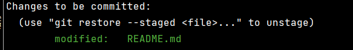

# git 指令学习

## ADD

### 添加内容

添加指定文件到暂存区

```bash
# 路径基础地址是指令当前目录。
$ git add [file1] [file2] ...

# 添加指定目录到暂存区，包括子目录
$ git add [dir]
```

### 删除文件或改名

删除工作区文件，或改名，并且将操作内容放入暂存区。

```bash
# 删除工作区文件，并且将这次删除放入暂存区
$ git rm [file1] [file2] ...

# 改名文件，并且将这个改名放入暂存区
$ git mv [file-original] [file-renamed]
```

### 清除本地文件追踪关系

停止追踪指定文件，但该文件会保留在工作区。（只是停止追踪，不是 `.gitignore` 。add 后重新追踪文件）

```bash
$ git rm --cached [file]
$ git rm -r --cached # -r 所有的
```

## COMMIT

### 提交

```bash
# 提交暂存区到仓库区
$ git commit -m [message]

# 提交暂存区的指定文件到仓库区
$ git commit [file1] [file2] ... -m [message]

# 提交工作区自上次commit之后的变化，直接到仓库区
$ git commit -a -m [ADD]abc # 如果 -m 信息没有空格，可以直接写，有空格需要用引号包裹。

# 提交时显示所有diff信息
$ git commit -v


```

### 修改上次 commit

```bash
# 使用一次新的commit，替代上一次提交
# 如果代码没有任何新变化，则用来改写上一次commit的提交信息
$ git commit --amend -m [message]

# 重做上一次commit，并包括指定文件的新变化
$ git commit --amend [file1] [file2] ...
```

## 分支指令

### 查看分支

```bash
# 列出所有本地分支
$ git branch

# 列出所有远程分支
$ git branch -r

# 列出所有本地分支和远程分支
$ git branch -a


```

### 新建分支

```bash
# 新建一个分支，但依然停留在当前分支
$ git branch [branch-name]
# 新建一个分支，并切换到该分支
$ git checkout -b [branch]
```

### 切换分支

```bash
# 切换到指定分支，并更新工作区
$ git checkout [branch-name]

# 切换到上一个分支
$ git checkout -
```

### 关系建立

```bash
# 新建一个分支，指向指定commit
$ git branch [branch] [commit]

# 新建一个分支，与指定的远程分支建立追踪关系
$ git branch --track [branch] [remote-branch]

# 建立追踪关系，在现有分支与指定的远程分支之间
$ git branch --set-upstream [branch] [remote-branch]
```

注意区分，**`--set-upstream`** 选项用于将**当前分支**与指定的**远程分支关联**，而 **`--track`** 选项用于**创建**新的**本地分支**并指定其跟踪的**远程分支**。

其中 **`--set-upstream`**  可以**简写为 -u**。所以也可以：

```bash
# 把本地内容推送到远程指定分支
$ git push -u origin master
```

### 删除分支

```bash
# 删除分支
$ git branch -d [branch-name]
# 如果删除不了可以强制删除 -D
$ git branch -D dev20181018

# 删除远程分支
$ git push origin --delete [branch-name]
$ git branch -dr [remote/branch] # 删除本地远程分支
```

### 合并分支

#### merge

```bash
# 合并指定分支到当前分支
$ git merge [branch]
```

#### cherry-pick

选择一个commit，合并进当前分支。

```bash
$ git cherry-pick [commit]
```

**查看 commit**

查看 commit 可以使用 git log 指令。传入 hash 到 cherry-pick 参数内，即可操作

**多个提交**

当需要 cherry-pick 多个提交时，可以通过指定一个提交范围来实现。假设您有一个提交历史如下：

```bash
A---B---C---D---E  master
     \
      F---G---H  feature
```

这将应用从**提交 `C` 到提交 `E`（不包括 `E`）**的所有提交到 `feature` 分支上。

```bash
git checkout feature
git cherry-pick C..E
```

如果只想 cherry-pick 特定的提交，可以列出各个提交的哈希值，例如：

```
git cherry-pick C D E
```

这将分别应用提交 `C`、`D` 和 `E` 到当前分支。

## log

要查找提交（commit），您可以使用 `git log` 命令。这个命令会显示当前分支的提交历史。以下是一些常用的 `git log` 选项，您可以根据自己的需求进行调整：

1. **查看全部提交记录**：

   ```
   bashCopy code
   git log
   ```

   这将显示当前分支的所有提交记录，从最新的提交到最旧的提交。

2. **限制提交数**：

   ```
   bashCopy code
   git log -n <number>
   ```

   这将显示最新的 `<number>` 个提交记录。

3. **查看提交的详细信息**：

   ```
   bashCopy code
   git log -p
   ```

   这会显示提交的详细信息，包括提交的更改。

4. **查看指定文件的提交记录**：

   ```
   bashCopy code
   git log <file>
   ```

   这会显示指定文件的提交记录。

5. **按作者查找提交记录**：

   ```
   luaCopy code
   git log --author=<author>
   ```

   这将显示由特定作者提交的所有提交记录。

6. **按日期范围查找提交记录**：

   ```
   bashCopy code
   git log --since=<date> --until=<date>
   ```

   这会显示在指定日期范围内提交的所有提交记录。

7. **按提交消息查找提交记录**：

   ```
   luaCopy code
   git log --grep=<pattern>
   ```

   这会显示提交消息中包含指定模式的所有提交记录。

8. **按提交哈希值查找提交记录**：

   ```
   bashCopy code
   git log <commit-hash>
   ```

   这将显示从指定提交到最新提交的所有提交记录。

除了 `git log`，您还可以使用其他命令和选项来查找提交，例如 `git show` 可以显示单个提交的详细信息，`git reflog` 可以显示引用日志，其中包含了项目中的所有引用（分支和标签）的历史记录。

## fetch

Fetch 命令从远程仓库获取更新，但不会自动合并到本地分支。它只是将远程分支的内容下载到本地，并更新相应的远程跟踪分支（remote tracking branch）。

案例，下边是 webstorm 拉取代码时的指令

```bash
# fetch 代码到本地 remote 分支。 
# --recurse-submodules=no 取消递归子包的拉去指令，
# --progress 展示进展信息，
# --prune 比较重要，如果远程仓库中分支删除，它会自动删除本地的 remote 分支，并取消本地分支与远程的关系链接。
git -c credential.helper= -c core.quotepath=false -c log.showSignature=false fetch origin --recurse-submodules=no --progress --prune

# restore 删除本地缓存区和工作区的内容，方便后续合并没有冲突
# --staged --worktree 删除缓存区和工作区的内容
git -c credential.helper= -c core.quotepath=false -c log.showSignature=false restore --staged --worktree --source=HEAD -- qqq doc/git_1.md

# merge 合并本地 remote 分支到本地分支。
git -c credential.helper= -c core.quotepath=false -c log.showSignature=false merge origin/tt1 --no-stat -v
```

## 标签指令

```bash
# 列出所有tag
$ git tag

# 新建一个tag在当前commit
$ git tag [tag]

# 新建一个tag在指定commit
$ git tag [tag] [commit]

# 删除本地tag
$ git tag -d [tag]

# 删除远程tag
$ git push origin :refs/tags/[tagName]

# 查看tag信息
$ git show [tag]

# 提交指定tag
$ git push [remote] [tag]

# 提交所有tag
$ git push [remote] --tags

# 新建一个分支，指向某个tag
$ git checkout -b [branch] [tag]
```

## 远程仓库

```bash
### clone 远程仓库
git clone git@github.com:wangjiax9/practice.git

# 下载远程仓库的所有变动
$ git fetch [remote]

# 显示所有远程仓库
$ git remote -v

# 显示某个远程仓库的信息
$ git remote show [remote]

# 增加一个新的远程仓库，并命名
$ git remote add [shortname] [url]

# 取回远程仓库的变化，并与本地分支合并
$ git pull [remote] [branch]
#上面假如出错，就忽略历史差异，把代码挡下来
$ git pull --allow-unrelated-histories  

# 上传本地指定分支到远程仓库
$ git push [remote] [branch]

# 强行推送当前分支到远程仓库，即使有冲突
$ git push [remote] --force

# 推送所有分支到远程仓库
$ git push [remote] --all
```

> $ git push 如果当前分支与多个主机存在追踪关系，那么这个时候-u选项会指定一个默认主机，这样后面就可以不加任何参数使用git push。
>
> $ git push -u origin master 上面命令将本地的master分支推送到origin主机，同时指定origin为默认主机，后面就可以不加任何参数使用git push了。(第一次执行)

## 登录

```bash
###登录
#缓存输入的用户名和密码
git config credential.helper store
#清除缓存在git中用户名密码
git credential-manager uninstall

#配置个人信息
git config --global user.name "ZHAN.WU"
git config --global user.email "ZHAN.WU@hand-china.com"
#第一个要配置的是你个人的用户名称和电子邮件地址。这两条配置很重要，每次 Git 提交时都会引用这两条信息，说明是谁提交了更新，所以会随更新内容一起被永久纳入历史记录
```

## stash 存储区

```bash
### stash存储缓存区
# 储藏当前暂存的文件
git stash 
# 储藏列表
git stash list 
# 应用某次储藏(不会删除那一次)（弹出的内容会到工作区中，没有 add）
git stash apply stash@{0} 
# 应用并弹出栈顶的储藏（弹出的内容会到工作区中，没有 add）
git stash pop 
# 提交储藏信息（会缓存工作区和暂存区的内容，然后工作区暂存区的内容会删除）
git stash save “测试储藏” 
# 查看git状态
git status 
```

## staged 暂存区撤销

首先知道我们修改的代码都会在**工作区（workspace）**，然后 `add .` 后会保存进入**暂存区域（index或staged）**

**删除暂存区**的内容，工作区不会变化

```bash
git restore --staged .\README.md # 针对 README.md 文件
git restore --staged . # 删除所有
```

恢复**工作区**内容为**缓存区**内容。如果换存区为空，就恢复为**最近一次commit内容**。

```bash
git restore --worktree .\README.md
git restore --worktree .
```

恢复工作区直到**最近一次commit内容**，同时**删除缓存区**内容。

```bash
git restore --worktree --staged .
```

## staged 暂存区查看

查看**缓存区修改**了那些**文件**。以及**工作区**有哪些**修改文件**，只有文件没有内容。

```bash
git status
```

显示红字（Changes not staged for commit:），是工作区的修改文件


显示绿字（ Changes to be committed:），是缓存区的修改文件



查看当前**工作区**和最近一次 **commit** 的差异内容。（相比下工作区做了那些新操作）

```bash
git diff HEAD
```

查看当前**工作区**和**缓存区**的差异内容，如果**缓存区为空**，则变为查看最近一次 **commit** 的差异内容。（相比下工作区做了那些新操作）

> 如果缓存区有内容，和工作区一样，则什么都不返回。

```bash
git diff
```

查看**缓存区**和最近一次 **commit** 的差异内容。（相比下缓存区做了那些新操作）

```bash
git diff --staged
```

> 命令行中按 q 返回，不在继续查看。

### diff 更多方式的内容比较

对比两个分支，例如对比**本地分支**和**线上分支**内容区别。

```bash
git diff master origin/master
```

对比**工作区**和**线上分支**内容区别。

```bash
git diff origin/master
```

**更多 diff 操作**

```bash
# 显示两次提交之间的差异
$ git diff [first-branch]...[second-branch]

# 显示暂存区和上一个commit的差异
$ git diff --cached [file]

# 显示今天你写了多少行代码
$ git diff --shortstat "@{0 day ago}"

# 显示某次提交发生变化的文件
$ git show --name-only [commit]

# 显示某次提交时，某个文件的内容
$ git show [commit]:[filename]
```

## 解决冲突

### 查看文件由谁修改过。

```bash
git blame XXXX //xxx代表文件路径
```

> 其显示格式为： 
>
> commit ID | 代码提交作者 | 提交时间 | 代码位于文件中的行数 | 实际代码 

### 查看commit提交记录

```bash
# 打印所有commit提交记录
git log
# 显示当前分支的最近几次提交
git reflog
```

> 点击 q 即可退出来。

> 参数说明
>
> ```bash
> --author   指定作者
> --stat   显示每次更新的文件修改统计信息，会列出具体文件列表
> --shortstat    统计每个commit 的文件修改行数，包括增加，删除，但不列出文件列表：  
> --numstat   统计每个commit 的文件修改行数，包括增加，删除，并列出文件列表：
> 
> -p 选项展开显示每次提交的内容差异，用 -2 则仅显示最近的两次更新, 例如：`git log -p -2
> ```

参考文档：https://www.jianshu.com/p/15838b8b44c0

### 显示一个记录具体内容

```bash
git show xxx
```

> 例如：git show 6f101285959f48787c9606805f0967a

> ```bash
> --name-only 仅在提交信息后显示已修改的文件清单
> --name-status 显示新增、修改、删除的文件清单
> --abbrev-commit 仅显示 SHA-1 的前几个字符，而非所有的 40 个字符
> --relative-date 使用较短的相对时间显示（比如，“2 weeks ago”）
> --graph 显示 ASCII 图形表示的分支合并历史
> ```

## 退回版本

```bash
#退回最近两个版本
git reset --hard HEAD^^
git reset --hard HEAD~2

#退回某次操作
git reset --hard 1f4e702
```

