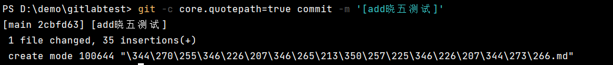
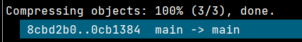
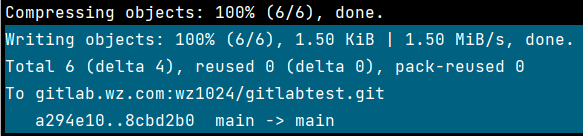
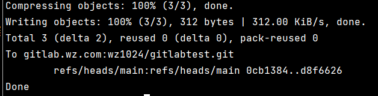
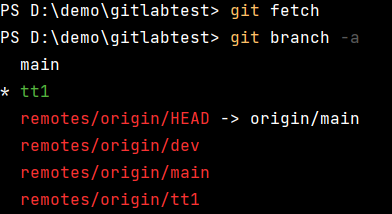
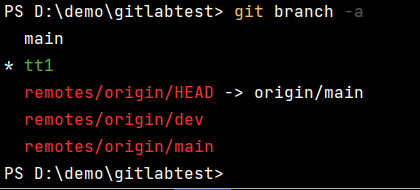
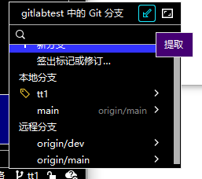

# 常见配置与参数

## .gitignore 忽略文件

### 项目中定义 .gitignore**

这种方式通过在项目的某个文件夹下**定义 .gitignore 文件**，在该文件中定义相应的**忽略规则**，来管理当前文件夹下的文件的Git提交行为。

.gitignore 文件是可以提交到共有仓库中，这就为该项目下的所有开发者都共享一套定义好的忽略规则。

在 .gitingore 文件中，遵循相应的语法，在每一行指定一个忽略规则。如：

```bash
*.log
*.temp
/vendor
```

### **全局的 .gitignore**

除了可以在项目中定义 .gitignore 文件外，还可以设置**全局的 git .gitignore 文件**来管理所有Git项目的行为。这种方式在**不同的项目开发者之间是不共享**的，是属于项目之上Git应用级别的行为。

这种方式也需要创建相应的 .gitignore 文件，可以放在任意位置。然后在使用以下**命令**配置Git：

```csharp
git config --global core.excludesfile ~/.gitignore
```

### **失效的解决方案**

通常在idea中，我们使用git进行项目管理的时候，一些不需要的文件如.idea,.target文件不需要上传至gitlab仓库，这时，就需要在项目中定义一个.gitignore文件，用来标识这些文件。

在push的时候，就不会将这些文件push至gitlab仓库。但是，有时候，**.gitignore文件**明明已经**存在**但是还是**没有起作用**，**导致**一部分文件已经**上传**了应该怎么办呢？

这时候，就应该 cd 到项目的目录下，然后执行以下操作即可：

```bash
$ git rm -r --cached . # 主要在于要清除追踪关系
$ git add .
$ git commit -m 'update .gitignore'
```

主要操作就是先删除本地清除追踪关系，重新添加.gitignore文件，然后再提交。

## git config

更多资料：

https://cloud.tencent.com/developer/section/1138791

通过 `git config` 获取并设置存储库或全局选项。

### core.quotepath

当为 `true` 时，Git 会对**文件名和路径**进行转义，以确保它们在不同的操作系统和环境中能够正确解释。用于 commit、add 和 push 指令



一般情况推荐设成 false

```bash
git -c core.quotepath=false
```

### log.showSignature

**签名**是否显示，如果设置为 false 则在 log 中不再显示签名。

在单次指令中可以使用 -c log.showSignature=false 关闭签名显示。

用于 commit、add 和 push 指令

```bash
git -c log.showSignature=false
```

### credential.helper

`-c credential.helper=`: 这个选项设置了一个空的凭据帮助器，这意味着 Git 不会使用任何凭据帮助器来处理凭据。这个设置告诉 Git 在执行后续操作时不使用任何凭据帮助器。

单次指令中，设置密码存储为空。

```bash
-c credential.helper=
```

### --no-verify

使用 --no-verify 标志跳过预提交钩子的发生

[如何防止 git commit --no-verify 命令？](https://qa.1r1g.com/sf/ask/2836381761/#)

### --progress

这个选项指示 Git 在推送过程中**显示**详细的**进度信息**。用于 push 指令

```bash
git push --progress
```

添加前：



添加后：



### --porcelain

`--porcelain`: 这个选项指示 Git 在输出中使用机器可读的格式，通常用于脚本处理。用于 push 指令

```bash
git push --progress --porcelain
```



### --ignore-errors

`--ignore-errors` 是 Git 命令的一个选项，用于在执行某些操作时忽略错误并继续执行其他操作。通常情况下，Git 在遇到错误时会停止执行，并显示错误消息，但使用 `--ignore-errors` 可以告诉 Git 忽略这些错误，继续执行后续的操作。一般用于add、push、commit。

这个选项可以用于一些 Git 命令中，比如 `git clean` 和 `git reset`。例如，当你想要清理工作目录时，但是某些文件由于权限问题或者其他原因无法删除时，你可以使用 `git clean --ignore-errors`，这样 Git 会尽可能删除可删除的文件，而忽略删除失败的文件，从而继续执行清理操作。

### --prune

`--prune` 是 Git 命令的一个选项，通常用于执行**清理操作**。在不同的 Git 命令中，`--prune` 的行为略有不同，但通常用于删除远程跟踪分支中已经不存在的引用（例如，已经被删除的远程分支）。

在 `git fetch` 命令中，`--prune` 选项告诉 Git 在获取远程分支的同时，检查本地的远程跟踪分支，并**删除**那些在**远程仓库中已经不存在的分支**。这样可以保持本地远程跟踪分支与远程仓库的同步。

> 这里注意的是删除远程分支，不是本地的分支。
>
> 没有 --prune ，remotes/origin/tt1 远程仓库被删除，但是本地的远程分支还是存在。
>
> 
>
> 有 --prune ，**本地的远程分支**被**删除**了
>
> 
>
> 在webstorm中也是使用了 --prune
>
> 

```js
git fetch --prune
```

### --recurse-submodules

执行某些操作时**递归处理子模块**。子模块是一个 Git 仓库中包含的另一个 Git 仓库，通常用于管理项目中的依赖项或者子项目。

这个选项通常用于一些需要遍历子模块的 Git 命令，比如 `git clone`、`git fetch`、`git pull` 等。当你在执行这些命令时加上 `--recurse-submodules` 选项时，Git 会对每个子模块执行相同的命令，以确保子模块也被更新到正确的状态。

```bash
git -c credential.helper= -c core.quotepath=false -c log.showSignature=false fetch origin --recurse-submodules=no --progress --prune
```

这里 --recurse-submodules=no 就是**禁用子模块**的 fetch 跟新操作。

## 知识点

### husky 

可以防止使用 Git hooks 的一些不好的 commit 或者 push。

[GitHook 工具 —— husky介绍及使用](https://www.cnblogs.com/jiaoshou/p/12222665.html)

[代码规范之 lint-staged](https://www.jianshu.com/p/62b5c6471b1f)

在代码提交之前，进行代码规则检查能够确保进入git库的代码都是符合代码规则的。但是整个项目上运行lint速度会很慢，lint-staged能够让lint只检测暂存区的文件，所以速度很快。

```js
{
  "husky": {
    "hooks": {
      "pre-commit": "lint-staged"
    }
  },
  "lint-staged": {
    "*.js": "eslint --fix"
  }
}
```

esLint 配置项 https://cn.eslint.org/docs/user-guide/command-line-interface

### pull 和 fetch 区别

"Pull" 和 "fetch" 是 Git 版本控制系统中常用的两个命令，它们用于从远程仓库获取更新。虽然它们的目的相似，但它们在行为上有一些区别：

1. **Pull（拉取）**：
   - Pull 命令从远程仓库获取更新，并将它们合并到当前分支。
   - 通常情况下，**pull 等价于 fetch + merge**。即，它会先执行 fetch 操作，然后自动将远程分支合并到本地分支。
   - 例如：`git pull origin master` 将会获取远程仓库 origin 的 master 分支上的更新，并将它们合并到本地的当前分支。
2. **Fetch（获取）**：
   - Fetch 命令从远程仓库获取更新，但不会自动合并到本地分支。它只是将远程分支的内容下载到本地，并更新相应的远程跟踪分支（remote tracking branch）。
   - 这意味着执行 fetch 后，您可以查看远程仓库的更新，然后决定是否将其合并到当前分支。
   - 例如：`git fetch origin` 将会获取远程仓库 origin 中所有分支的更新，但不会自动合并到本地分支。

综上所述，pull 是 fetch 的一种便捷方式，它自动执行了 fetch 并将远程分支合并到本地分支。而 fetch 则更加灵活，它允许您在获取远程更新后决定如何处理这些更新。

### 那么使用fetch 后如何合并到本地分支

在使用 `git fetch` 命令获取了远程仓库的更新之后，您可以手动将这些更新合并到本地分支。合并的步骤如下：

1. 查看本地分支和远程跟踪分支之间的差异，可以使用 `git diff` 命令或者 `git log` 命令查看提交历史。例如：

   ```bash
   git diff master origin/master
   ```

   或者

   ```bash
   git log master..origin/master
   ```

2. 如果您确定要**将远程更新合并到本地分支**，可以使用 `git merge` 命令手动进行合并。例如：

   ```bash
   git merge origin/master
   ```

3. 在合并之前，您也可以选择使用 `git pull` 命令，该命令会自动执行 `git fetch` 和 `git merge`。例如：

   ```bash
   git pull origin master
   ```

4. 如果合并过程中出现了冲突，您需要手动解决冲突并提交合并结果。冲突解决后，使用 `git add` 将解决后的文件标记为已解决，然后使用 `git commit` 提交合并结果。

总之，使用 `git fetch` 获取远程更新后，您可以通过手动合并或者使用 `git pull` 命令将这些更新合并到本地分支。

### git对大小写不敏感

碰到一个坑，修改文件名字：grids改为Grids。由于git对大小不敏感，所以没有更新，grids文件并没有修改。

解决方案：修改名字为其他 grids => gridst =>Grids。记得中间推一下。
