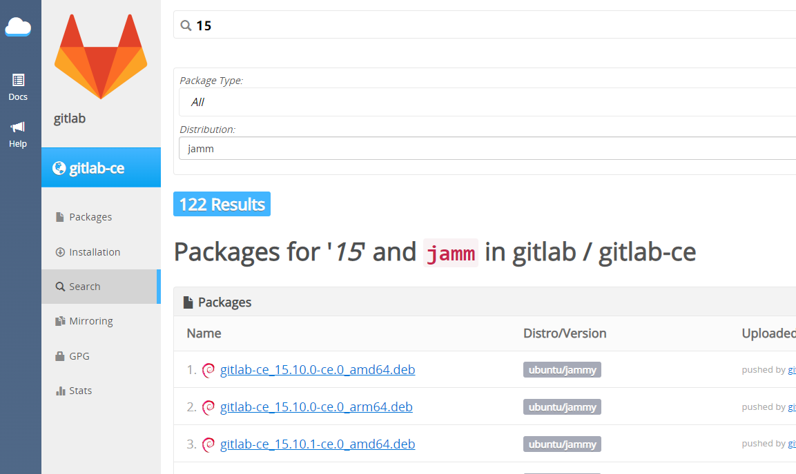
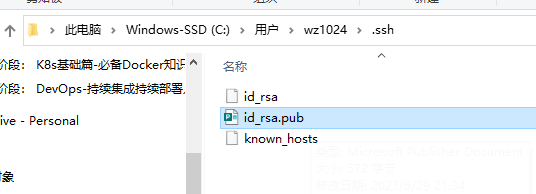
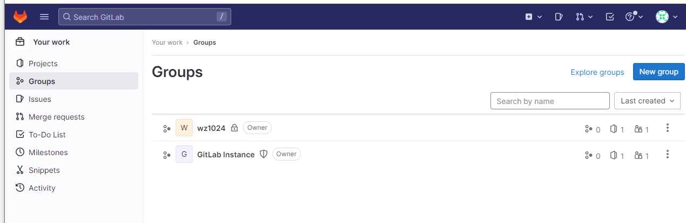
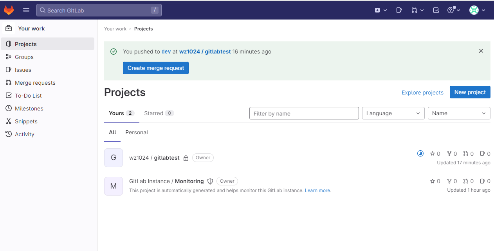
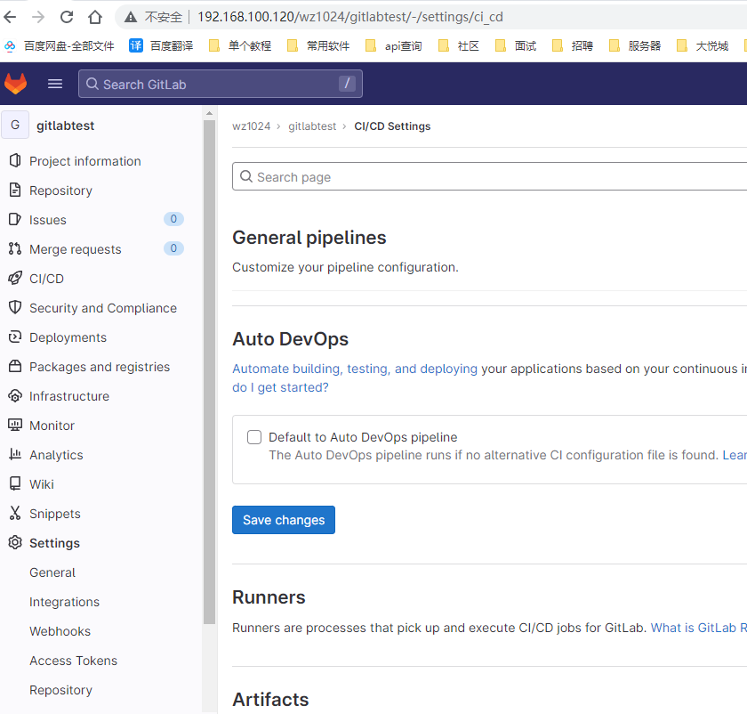
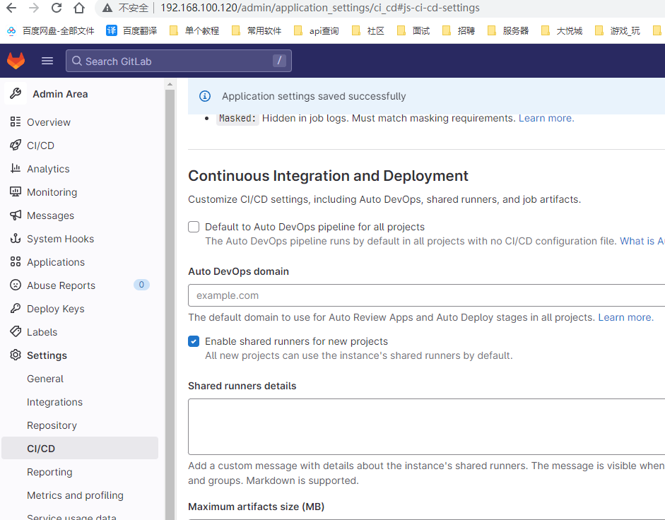

# gitlab 简介


GitLab 是一个用于[仓库管理系统](https://baike.baidu.com/item/仓库管理系统/438926?fromModule=lemma_inlink)的[开源项目](https://baike.baidu.com/item/开源项目/3406069?fromModule=lemma_inlink)，使用[Git](https://baike.baidu.com/item/Git/12647237?fromModule=lemma_inlink)作为代码[管理工具](https://baike.baidu.com/item/管理工具/9143974?fromModule=lemma_inlink)，并在此基础上搭建起来的[Web服务](https://baike.baidu.com/item/Web服务/2837593?fromModule=lemma_inlink)。

## 下载

地址：https://packages.gitlab.com/app/gitlab/gitlab-ce/search?dist=el%2F8&page=13

清华下载地址：https://mirrors.tuna.tsinghua.edu.cn/gitlab-ce/ubuntu/pool/jammy/main/g/gitlab-ce/

> 建议清华，因为原版下载可能包损坏造成安装失败。

查看服务器版本的代号Codename，这里是 jammy 版本，下载对应版本

```bash
lsb_release -a
# No LSB modules are available.
# Distributor ID:	Ubuntu
# Description:	Ubuntu 22.04.2 LTS
# Release:	22.04
# Codename:	jammy
```

**搜索**



**添加源**

将GitLab的软件库添加到系统的软件源列表中，以便您可以安装和更新GitLab Community Edition（CE）软件包。

```bash
curl -s https://packages.gitlab.com/install/repositories/gitlab/gitlab-ce/script.deb.sh | sudo bash
```

**下载包**

```bash
wget --content-disposition https://packages.gitlab.com/gitlab/gitlab-ce/packages/ubuntu/jammy/gitlab-ce_15.11.9-ce.0_amd64.deb/download.deb
```

> 注意下载amd还是arm（这里下载amd的）
>
> 文件下载后以做了备份，位置 ./Jenkins.assets/gitlab-ce_15.11.9-ce.0_amd64.deb

## 安装

输入指令安装

```bash
dpkg -i gitlab-ce_15.11.9-ce.0_amd64.deb
```

修改配置

```bash
vim /etc/gitlab/gitlab.rb
# 修改url
external_url 'http://gitlab.test.com'
# 加载配置,启动gitlab服务
gitlab-ctl reconfigure
```

修改host文件

```
sudo vim /etc/hosts
```

然后停掉三个服务用不到

```bash
gitlab-ctl stop gitlab-exporter # GitLab 的导出器
gitlab-ctl stop grafana # 数据可视化和仪表盘工具
gitlab-ctl stop prometheu # 对应用程序、服务器和网络等进行监控
```

查看第一次安装GitLab生成的默认密码

```bash
# 默认用户名 root
cat /etc/gitlab/initial_root_password 
# Password:QfYw3GVeAgQwx/2KW6bLJejwQIZTbBn2dPkfhPX2Pwo=
```

## 常见指令

```bash
# 停止gitlab服务
sudo gitlab-ctl stop

# 启动gitlab服务
sudo gitlab-ctl reconfigure

# 重启所有gitlab组件
sudo gitlab-ctl restart

# 启用开机自启动
sudo systemctl enable gitlab-runsvdir.service
```

查看gitlab服务状态

```bash
sudo gitlab-ctl status
```

报错排查

```bash
# 查看log
/var/log/gitlab/gitlab-rails/production.log
# 排查状态
sudo gitlab-ctl status
# 状态如果超时，使用 kill -9 关掉进程

# 查看某个服务错误
sudo gitlab-ctl tail postgresql
```

## 设置

### ssh

复制公钥复制到 gitlab [SSH Keys](http://192.168.100.120/-/profile/keys)




### 新建项目

先创建群组



然后群组内创建项目



### 关闭自带的DevOps



全局关闭




## gitlab-ci 常见 API

参考：https://zhuanlan.zhihu.com/p/44639676

参考：https://www.ebaina.com/articles/140000005035

常用词

任务的28个关键词分别是,
`script`, `after_script`, `allow_failure`, `artifacts`, `before_script`, `cache`, `coverage`, `dependencies`, `environment`, `except`, `extends`, `image`, `include`, `interruptible`, `only`, `pages`, `parallel`, `release`, `resource_group`, `retry`, `rules`, `services`, `stage`, `tags`, `timeout`, `trigger`, `variables`, `when`

全局的关键词

```js
image，services，before_script，after_script，tags，cache，artifacts，retry，timeout，interruptible
```

最常任务中最常用的是这七个`script`，`artifacts`，`stage`， `when`，`tags`，`image`，`cache`

### script

`script`是Runner执行的yaml脚本，是一个job的必填内容，不可或缺。举个例子：

```yaml
job:
  script: "bundle exec rspec"
```

该参数也可以用数组包含多个命令：

```yaml
job:
  script:
    - npm config set sass_binary_site https://npm.taobao.org/mirrors/node-sass/
    - npm install --registry=http://registry.npm.taobao.org
```

### after_script

> GitLab 8.7 开始引入，并且要求Gitlab Runner v1.2

`after_script`用来定义所有job之后运行的命令。它必须是一个数组或者是多行字符串

### before_script

`before_script`用来定义所有job之前运行的命令，包括deploy(部署) jobs，但是在修复artifacts之后。它可以是一个数组或者是多行字符串。

### allow_failure

设置一个job失败的之后并不影响后续的CI组件的时候。失败的jobs不会影响到commit状态。

当开启了允许job失败，所有的intents和purposes里的pipeline都是成功/绿色，但是也会有一个"CI build passed with warnings"信息显示在merge request或commit或job page。

```yaml
job1:
  stage: test
  script:
  - execute_script_that_will_fail
  allow_failure: true
# job1和job2将会并列进行，如果job1失败了，它也不会影响进行中的下一个stage，因为这里有设置了allow_failure: true。
job2:
  stage: test
  script:
  - execute_script_that_will_succeed

job3:
  stage: deploy
  script:
  - deploy_to_staging
```

### when

关键字是实现在发生故障或尽管发生故障时仍能运行的作业。

`on_success` - 只有前面stages的所有工作成功时才执行。 这是默认值。

`on_failure` - 当前面stages中任意一个jobs失败后执行。

`always` - 无论前面stages中jobs状态如何都执行。

`never`：无论前面stages中jobs状态如何，都不要运行该作业。只能在[`rules`](https://docs.gitlab.com/ee/ci/yaml/#rules)节或中使用`workflow: rules`。

`manual`  - 手动执行(GitLab8.10增加)。更多请查看[手动操作](https://link.zhihu.com/?target=https%3A//docs.gitlab.com/ce/ci/yaml/README.html%23manual-actions)。

```yaml
stages: # 设置stages的执行步骤
- build
- cleanup_build
- test
- deploy
- cleanup

build_job:
  stage: build
  script:
  - make build

cleanup_build_job:
  stage: cleanup_build
  script:
  - cleanup build when failed
  when: on_failure # 只有当 build_job 失败的时候才会执行`cleanup_build_job 。

test_job:
  stage: test
  script:
  - make test

deploy_job:
  stage: deploy
  script:
  - make deploy
  when: manual # 可以从GitLab界面中手动执行deploy_jobs。

cleanup_job:
  stage: cleanup
  script:
  - cleanup after jobs
  when: always # 不管前一个job执行失败还是成功都会执行`cleanup_job 。
```

### artifacts

将流水线过程中的一些文件，文件夹，打包压缩，提供一个外链供人下载，另外还能在后续的job中缓存。

```yaml
build:
  script:
    - npm run build
  artifacts:
    paths:
      - dist/
```

在这个任务后面运行的任务会自动恢复这个制品，意味着你不用再执行`npm run build`来获取编译后的`dist`文件了，
在安卓，ios打包的时候，非常有用，因为流水线最终输出的就是一个可下载，可安装的应用。
paths 是用来指定将那些文件，目录放入制品中，
也可以使用exclude关键词，将那些目录，文件排除，支持正则表达式。
此外还有以下几个属性

- paths 文件路径
- exclude 排除的文件
- name 制品名称
- expose_as 在UI页面导出的名称
- untracked 布尔类型，是否将git忽略的文件加到制品中
- when on_success；on_failure；always 何时上传制品
- expire_in 过期时间默认30天
- reports 收集测试报告
- when可以设置一下值：
  1. `on_success` - 当job成功的时候上传artifacts。默认值。
  2. `on_failure` - 当job失败的时候上传artifacts。
  3. `always` - 不论job失败还是成功都上传artifacts。

```yaml
build:
  script:
    - npm run build
  artifacts:
    paths:
      - dist/
    exclude:
      - binaries/**/*.o
    expose_as: 'artifact 1'
    name: "$CI_COMMIT_REF_NAME"
    untracked: false
    expire_in: 2 hrs 20 min
    when: on_failure
```

### [cache](https://docs.gitlab.com/ee/ci/yaml/README.html#cache)

缓存是将当前工作环境目录中的一些文件，一些文件夹存储起来，用于在各个任务初始化的时候恢复。避免多个下载同样的包，能够大大优化流水线效率。在前端项目中，我们经常把node_modules缓存起来，这样一条流水线都可以使用这些下载好的包。在java项目中经常把maven下载的包缓存起来。以备后用
cache下的参数有

- paths 当前工作环境下的目录
- key 存储的key，key不变不会重新生成缓存，
- :key:prefix 使用一些文件制作成文件hash值，当做key的一部分，
- untracked 是否缓存git忽略的文件
- when 定义何时存储缓存 on_success；on_failure；always
- policy 缓存是否要在job完成后重新上传

缓存可以设置流水线全局，也可以在job中设置

```yaml
cache:
  key: hello-vue-cache
  paths:
    - node_modules
cache:
  key:
    files:
      - Gemfile.lock # 如果这些文件变化，缓存将会重写
      - package.json
  paths:
    - vendor/ruby
    - node_modules
```

### stages

`stages`用来定义可以被job调用的stages。stages的规范允许有灵活的多级pipelines。

stages中的元素顺序决定了对应job的执行顺序：

```text
1. 相同stage的job可以平行执行。
2. 下一个stage的job会在前一个stage的job成功后开始执行。
```

接下仔细看看这个例子，它包含了3个stage：

```yaml
stages:
 - build
 - test
 - deploy
```

1. 首先，所有`build`的jobs都是并行执行的。
2. 所有`build`的jobs执行成功后，`test`的jobs才会开始并行执行。
3. 所有`test`的jobs执行成功，`deploy`的jobs才会开始并行执行。
4. 所有的`deploy`的jobs执行成功，commit才会标记为`success`
5. 任何一个前置的jobs失败了，commit会标记为`failed`并且下一个stages的jobs都不会执行。

这有两个特殊的例子值得一提：

1. 如果`.gitlab-ci.yml`中没有定义`stages`，那么job's stages 会默认定义为 `build`，`test` 和 `deploy`。
2. 如果一个job没有指定`stage`，那么这个任务会分配到`test` stage。

### tags

`tags`可以从允许运行此项目的所有Runners中选择特定的Runners来执行jobs。

在注册Runner的过程中，我们可以设置Runner的标签，比如`ruby`，`postgres`，`development`。

`tags`可通过tags来指定特殊的Runners来运行jobs：

```yaml
job:
  tags:
    - ruby
    - postgres
```

上面这个示例中，需要确保构建此`job`的Runner必须定义了`ruby`和`postgres`这两个tags。

### [only/except](https://docs.gitlab.com/ee/ci/yaml/README.html#onlyexcept-basic)

`only`定义哪些分支和标签的git项目将会被job执行。

`except`定义哪些分支和标签的git项目将不会被job执行。

only/except 是规定当前job的可见状态，一个项目有很多分支，tag，我们的流水线，为了对特定的分支，特定的tag执行不同的job，这里就要使用only和except
在任务上加上这一段代码，就表明当前任务只有在master分支可以运行

```yaml
only:
  - master
```

也可以根据当前的代码变动是合并，还是推送，还是使用API来触发的。
如果一个任务没有only属性，那默认就是
`only: ['branches', 'tags']` 操作分支或者tags都会触发流水线。[only/except](https://docs.gitlab.com/ee/ci/yaml/README.html#onlyexcept-basic)

only/except 是规定当前job的可见状态，一个项目有很多分支，tag，我们的流水线，为了对特定的分支，特定的tag执行不同的job，这里就要使用only和except
在任务上加上这一段代码，就表明当前任务只有在master分支可以运行

```yaml
only:
  - master
```

也可以根据当前的代码变动是合并，还是推送，还是使用API来触发的。
如果一个任务没有only属性，那默认就是
`only: ['branches', 'tags']` 操作分支或者tags都会触发流水线。

### rules

用于`rules`在管道中包含或排除作业。`rules`替换[`only/except`](https://docs.gitlab.com/ee/ci/yaml/#only--except)，并且它们不能在同一工作中一起使用。

`rules`接受由以下定义的规则数组：

- `if`
- `changes`
- `exists`
- `allow_failure`
- `variables`
- `when`

**rules:changes**

用于`rules:changes`通过检查特定文件的更改，来指定何时将作业添加到管道。

```yaml
docker build:
  script: docker build -t my-image:$CI_COMMIT_REF_SLUG .
  rules:
    - if: $CI_PIPELINE_SOURCE == "merge_request_event"
      changes:
        - Dockerfile
      when: manual # 手动
      allow_failure: true
# 检查 Dockerfile 更新
# 如果Dockerfile已更改，则将作业作为手动作业添加到管道中（指的是这个job执行），即使作业未触发，管道也会继续运行 ( allow_failure: true)。
# 如果Dockerfile没有改变，则不要将作业添加到任何管道（与 相同when: never）。
```


更多详情，查看 [gitlab-ci 解析](./gitlab-ci.解析.md)


### 编写数据到一个文件

```
- |
  cat > Dockerfile << EOF
  FROM nginx:1.14.2
  MAINTAINER wz
  COPY ./nginx/ /etc/nginx/
  COPY ./dist/ /usr/share/nginx/html/
  EOF
```

或者

```
- |
  {
    echo "FROM nginx:1.14.2"
    echo "MAINTAINER wz"
    echo "COPY ./nginx/ /etc/nginx/"
    echo "COPY ./dist/ /usr/share/nginx/html/"
  } >> Dockerfile
```


## gitlab-runner

### 安装

教程：https://docs.gitlab.com/runner/install/linux-manually.html

下载 gitlab-runner 的 deb 文件

```bash
curl -LJO "https://gitlab-runner-downloads.s3.amazonaws.com/latest/deb/gitlab-runner_amd64.deb"
```

安装

```bash
dpkg -i gitlab-runner_amd64.deb
```

给 runner 添加操作 docker 的权限

```bash
usermod -aG docker gitlab-runner
```

重启容器服务

```bash
sudo gitlab-runner restart
sudo service docker restart
```

在 gitlab 创建一个 runner 实例

```bash
sudo gitlab-runner register --url http://gitlab.wz.com/ --registration-token GR1348941-dQYD3Sbsz7-sGuiPQ-s
# 快速构建
sudo gitlab-runner register --url http://gitlab.wz.com/ --registration-token GR1348941dxFqzAsfMRNJLANwBndv --tag-list ci --executor docker --docker-image node:16.13.2 --docker-extra-hosts gitlab.wz.com:192.168.100.115 --docker-volumes /var/run/docker.sock:/var/run/docker.sock /cache --non-interactive
# --docker-extra-hosts 添加hosts，以防 gitlab-ci 使用artifacts时报错
# --non-interactive 不出现向导直接运行指令
```

配置文件目录

```bash
vim /etc/gitlab-runner/config.toml
# [runners.docker]
#     network_mode = "host" # 设置为 host
#     network_mode = "gitlab_default" # 或者设置为 gitlab_default
```

## dns-server

创一个容器

```bash
docker run -d -p 53:53/tcp -p 53:53/udp --cap-add=NET_ADMIN --name dns-server andyshinn/dnsmasq
```

进入容器

```bash
docker exec -it dns-server /bin/sh
```

创建编辑文件

```bash
vi /etc/resolv.dnsmasq
# nameserver 114.114.114.114 nameserver 8.8.8.8
```

新建配置文件

```bash
vi /etc/dnsmasqhosts
```

添加解析规则

```bash
192.168.100.120 gitlab.wz.com
```

修改配置

```bash
vi /etc/dnsmasq.conf
resolv-file = /etc/resolv.dnsmasq addn-hosts=/etc/dnsmasqhosts
```

回到宿主机，重启 dns 服务

```
docker restart dns-server
```

然后回到 runner 机器上修改 resolv.conf

```
sudo vim /etc/resolv.conf
nameserver [dns服务器的地址]
```

