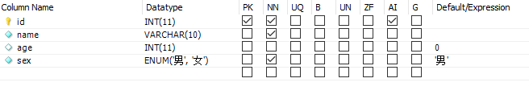

# SQL基础

## 配置

编辑配置文件

```bash
etc/mysql/mysql.conf.d/mysqld.cnf
# 或者 
etc/mysql/mariadb.conf.d/50-server.cn
```

示例：

```bash
# this is only for the mysqld standalone daemon
[mysqld]

#
# * Basic Settings
#

#user                    = mysql
pid-file                = /run/mysqld/mysqld.pid
basedir                 = /usr
#datadir                 = /var/lib/mysql
#tmpdir                  = /tmp

# Broken reverse DNS slows down connections considerably and name resolve is
# safe to skip if there are no "host by domain name" access grants
#skip-name-resolve

# Instead of skip-networking the default is now to listen only on
# localhost which is more compatible and is not less secure.
# bind-address            = 127.0.0.1

# 其中 datadir 是数据库存储位置
# bind-address 是建立连接时规定要用的ip。注释了，就可以外网连入。
# post 表示端口号，默认3306
# log_error 表示犯错误日志，默认/var/log/mysql/error/log
```

## 基础操作

bit ， byte ， word 解释

> bit ， byte ， word 解释
> 字     word ；字节  byte (B)；位     bit (b)
>
> 单位换算
> 1字节 = 8位(1 byte = 8bit)
>
> 1字 = 2字节(1 word = 2 byte)
>
> 一个汉字 = 2字节 ；中文标点 = 三个字节；一个英文字母 = 一个字节；英文标点 = 一个字节
>
> Emoji表情或者某些特殊字符 = 4个字节

### 查看服务状态

```bash
sudo service mysql status
```

停止服务

```bash
sudo service mysql stop# 停止服务
# 启动服务 start 重启 restart
关闭数据库
systemctl stop mariadb
```

### 登录

**进入mariadb的操作行**

```bash
sudo mariadb -u root
# -u 用户名 -p 密码
```

### 显示时间

```sql
select now()
```

### 退出

```sql
exit; # 或者 quit;
```

### **重启sql**

```bash
sudo service mysql restart
```

### **mysql的安全配置**

```bash
sudo mysql_secure_installation
```

```bash
# 注：运行结果用 ··· 代替
Enter current password for root (enter for none):  # 输入root(mysql)的密码，初次安装默认没有，直接回车 
 ... 
Switch to unix_socket authentication [Y/n] n # 是否切换到unix套接字身份验证[Y/n]
 ... 
Change the root password? [Y/n] y #是否设置root用户密码
New password: # 新密码
Re-enter new password:  # 再次输入密码
 ... 
Remove anonymous users? [Y/n] y # 是否删除匿名用户，建议删除
 ... 
Disallow root login remotely? [Y/n] n # 是否禁止root远程登录，建议不开启
 ... 
Remove test database and access to it? [Y/n] n # 是否删除test数据库，可以保留
...
Reload privilege tables now? [Y/n] y # 是否重新加载权限表，也可以直接回车
 ... 
Thanks for using MariaDB! # 看到这句话证明设置成功

```

（不建议）设置root远程登录数据库，初始化 MariaDB 完成后，以 MySQL 的 root 身份登录

```bash
##如果要设置root远程登录数据库，初始化 MariaDB 完成后，以 MySQL 的 root 身份登录

mysql -uroot -p密码

## 赋予 root 用户远程连接权限
grant all privileges on *.* to 'root'@'%' identified by '自己设置的root密码';
flush privileges;

## 但一般不建议这么干！
```

## 用户

### 创建用户

创建一个新用户并为其设置密码：

```mariadb
CREATE USER 'newuser'@'localhost' IDENTIFIED BY 'password';
```

### 查看用户

查看数据库有那些用户

``` sql
SELECT User, Host FROM mysql.user;
```

修改密码

```sql
use mysql;
ALTER USER 'root'@'localhost' IDENTIFIED BY 'new_password';
flush privileges;
```


### 分配权限

查看以用户权限

```mysql
SHOW GRANTS; # 查看所有
SHOW GRANTS FOR 'erp'@'%'; # 这里的 erp 是用户名； % 则是代表任何ip（就是远程）
```

> 查出信息
>
>    user = '_292c9f9a0532ec87'
>    password = 'KCA9XShfXLb3O2Br'
>
> ```
> GRANT ALL PRIVILEGES ON *.* TO `erp`@`%` IDENTIFIED BY PASSWORD '*77D8E0C37E665244AB16ADB07EC2CE08924C3C68' 
> ```
>
> - `GRANT USAGE`：授权语句，允许用户连接到数据库；`GRANT ALL`：则是所有权限
> - `ON *.*`：指定授权的对象是所有数据库和表
> - `TO 'erp'@'%'`：指定将授权授予哪个用户，'erp'是用户名，'%'表示可以从任何IP地址连接到MariaDB服务器
> - `IDENTIFIED BY PASSWORD '*77D8E0C37E665244AB16ADB07EC2CE08924C3C68'`：设置用户'erp'的密码

设置权限

```mysql
GRANT ALL PRIVILEGES ON *.* TO 'erp'@'%'; # 设置所有权限
GRANT SELECT, UPDATE ON database_name.* FROM 'erp'@'%';# 设置查询，修改权限
REVOKE SELECT, UPDATE ON database_name.* FROM 'erp'@'%';# 删除这些权限
```

刷新权限

```mysql
# 刷新权限
FLUSH PRIVILEGES;
# 然后还要重启
sudo service mysql restart
```


## 数据库操作

### 查看

```sql
show databases; # 查看数据库

show tables；# 查看数据库有哪些表

-- “--”是注释
```

### 创建删除数据库

选择字符集和排序规则，字符集选择utf8，否则中文出现乱码。排序规则选择 utf8_general_ci 查询忽略大小写。选择 utf_bin 区分大小写。

```sql

create database 数据库名字 charset=utf8; # 创建库

use 数据库; # 使用数据库（只限于当前这次打开数据库的命令行）

select database(); # 查看当前使用的数据库
```

```sql
drop database 数据库; # 删除数据库
drop table 表; # 删表
```

### 清屏

```sql
system clear
```

### 表字段

#### 类型

ENUM('男','女') 单选类型 enum

DECIMAL(10,2) 存储数字，通常用于货币。这里是10为数字，小数点后2位。decimal

##### 数字

bigint：从-2^63(-9223372036854775808)到2^63-1(9223372036854775807) 的整型数据（所有数字），存储大小为8个字节。

int：从-2^31(-2147483648)到2^31-1(2147483647)的整型数据（所有数字）。存储为4个字节。

smallint：从-2^15(-32768)到2^15-1(32767)的整型数据。存储大小为2个字节。

tinyint：从0到255的整型数据。存储大小为1个字节。

##### **时间**

DATE：储存日期，格式为YYYY-MM-DD，范围1000-01-01到9999-12-31；
TIME：储存时间，格式为hhh:mm:ss，范围-838:59:59 到838:59:59；
DATETIME：储存日期和时间，格式为YYYY-MM-DD hh:mm:ss，范围1000-01-01 00:00:00到9999-12-31 23:59:59；
TIMESTAMP：储存时间戳，格式与DATETIME相同，范围1970-01-01 00:00:01到2038-01-19 03:14:07；

计算函数有

```sql
NOW() 和 CURRENT_TIMESTAMP() #函数返回当前日期和时间，包括时区。
# CURRENT_TIMESTAMP() 返回 datatime 和 timestamp类型
# NOW() 返回 一个时间戳类型
# now() current_timeStamp

LOCALTIME 和 LOCALTIME() #函数返回当前日期和时间，但不包括时区信息。不是时间戳
#localtime
LOCALTIMESTAMP 和 LOCALTIMESTAMP() #函数也返回当前日期和时间，但不包括时区信息。时间戳，对应timestamp类型。
#localtimeStamp
```

例如：添加一个创建日期字段，默认值是当前时间，after 'is_del' 表示插在这个列后边。

```sql
# 增加一个创建时间字段，默认读取当前系统时间
ALTER TABLE `python_test_wz`.`students` 
ADD COLUMN `create_datetime` DATETIME NOT NULL DEFAULT LOCALTIME AFTER `is_del`;
# 增加一个更新时间字段，默认读取当前系统时间，更新时更新当前系统时间。
alter table students add update_datatiem datetime not null default CURRENT_TIMESTAMP() on update CURRENT_TIMESTAMP();
```

> 注意特殊逻辑 after ** 是插入到列之前；on update 数据更新时赋值


#### 约束



这里的列上，

```sql
pk Primary Key 主键；

NN Not Null 非空；

UQ Unique 唯一索引；

B Binary 二进制；

UN Unsigned 无符号数据类型（正数）;

ZF Zero Fill 补充0;

AI Auto Increment 自增；

G generated 生成列；

defalut 默认值；
```

### 查看创建表sql

```sql
show create database 数据库名; # 查看数据的sql
show create table 表名; # 查看表的sql
```

### 执行sql文件

```sql
source areas.sql
```


## 表操作

### 查看表结构

```sql
desc 表名
```

### 创建表

```mysql
create table students(
	id int unsigned primary key auto_increment not null,
    name varchar(20) not null,
    age tinyint unsigned default 0, # tinyint 
    height decimal(5,2),
    gender enum('男','女')
)
```

### 删除表

```sql
drop table 表名
```

## 列操作

### 修改列

```sql
#修改表，modify 不能修改列名
alter table 表名 modify 列名 类型 约束;
# 例如修改类型为date alter table students modify birthday date；

# 修改表，change 覆盖一个列
ALTER TABLE `python_test_wz`.`students` 
CHANGE COLUMN `id` `id` INT(11) UNSIGNED NOT NULL AUTO_INCREMENT ;
# 改变表（ alter table ** ）change 要改列（column 'id')
# 重命名以及属性（`id` INT(11) UNSIGNED NOT NULL AUTO_INCREMENT ）
# 后边一个id是新名字，然后是类型，然后是 unsigned 非零，not null 非空，auto_increment 自增。
# column 'id' 可以直接写成 id

#单独修改列名
alter table 表名 rename column 'id' to 'id2' # 修改表名

```

### 删除列

```sql
# 删除一个列
alter table 表名 drop 列名;
```

### 增加列

```sql
# 创建列
alter table 表名 add 列名 类型 约束;
```

