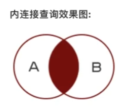
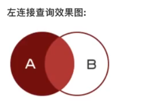
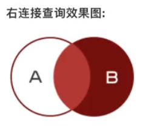

# SQL数据操作

## 基础查询

```sql
select * from 表名;
select 列1,列2... from 表名;

select * from students where name = '张三' # 查询 students 表中 张三 数据
# 这里 * 可以填写列名，表示查出显示的列有啥
```

### 排序

order by 对某一列进行排序；

```sql
select * from 表名 order by 列1 asc|desc, 列2 asc|desc
# 按照id逆序，查询男孩的数据
select * from students where sex='男' order by id desc;
```

排序规则：

1，按照第一列排序，如果第一列相同时，再按照第二列排序；

2，asc 从小到大，desc 从大到小；

3， 默认从小到大；

### 分页查询

limit 是分页查询关键字

start 表示开始索引，默认0

count 表示查询条数

```sql
select * from 表名 limit start,count;
例如
select * from students where a=1 limit 0,3;
# 0,3 第一页；3,3 第二页；6,3 第三页；(n-1)*3,3 第n页
```

### 聚合查询

用于统计计算，一般结合分组统计

常用聚合函数

count(col)：表示指定列的总数

max(col)：表示指定列的最大值

min(col)：表示指定列的最小值

sum(col)：表示指定列的和

avg(col)：表示指定列的平均值


round(num,2)：对对数字格式化，保留两位小数，四舍五入。

> 聚合函数不对空值进行统计

ifnull：判断是否是空值，如：avg(ifnull(height,0)) 如果为空，默认为0

```sql
select count(id) from students # 统计条数，也可以写成 count(*)

select name,max(height) from students; # 最大值

select avg(height) from students;# 计算平均身高，不统计空值

select avg(ifnull(height,0)) from students;# 计算平均身高，null认为是0，加入计算
select sum(height)/count(*) from students;# 计算平均身高，得到结果同上，null认为是0

```

### 分组查询

将查询结果按照字段进行分组，字段中数据相等的分为一组。

> 分组数据过滤用 having ，通常过滤用 where。

group_concat(col)：根据字段名统计分组里的信息集合。

```sql
group by 列名 [having 条件表达式][with rollup]
# 列名，按照当前列的值进行分组
# having 条件表达式，用来过滤分组后的数据
# with rollup 在记录末尾加上一条记录，显示聚合函数算出来加一起的结果。（指挥对聚合函数汇总）

select gender from students group by gender# 对 性别分组，拿到两条数据
select distinct gender from students; # 去重，结果同上
###########
# 创建时间和名字分组，相同时间，不同名字的放一堆
select update_datatime,name from students group by update_datatime,name;
###########
# 结合聚合函数
# 一个更新时间组中，有多少条数据。
select update_datatime,count(*) from students group by update_datatime;

# 一个更新时间组中，有那些人。
select update_datatime,group_concat(name) from students group by update_datatime;

# 按照更新时间分组，且时间过滤出大于某个时间的分组数据
select update_datatime,group_concat(name) from students group by update_datatime having update_datatime>'2023-04-24 22:49:01';

# 按照性别分组，分别计算平均身高，最后汇总数据。
select sex,group_concat(name),avg(height) from students group by sex with rollup;
+-----+--------------------------------------------------------------------+-------------+
| sex | group_concat(name)                                                 | avg(height) |
+-----+--------------------------------------------------------------------+-------------+
| 男  | 张三,李四2,王五,哈哈,啊飒飒,琪琪,粑粑,测测                         |    1.878000 |
| 女  | 久久                                                               |    1.750000 |
| NULL | 张三,李四2,王五,哈哈,啊飒飒,琪琪,粑粑,测测,久久                    |    1.856667 |
+-----+--------------------------------------------------------------------+-------------+

```

## 连接查询

通过连接，连接多个表，实现多表查询；

连接查询分为：

内连接，左右连接，自连接插叙；

### 内连接

> 表设计有 学院 collega，班级 classes，学生 students。





inner join 就是内连接查询关键字

on 就是连接查询条件

using 相当于on，但是需要同名

```sql
select 字段 from 表1 inner join 表2 on 表1.字段1 = 表2.字段2;

# 查询班级和学生的数据
# 如果c_id是null或者在classes表中没有，则不显示该数据；
select * from students s inner join classes c on s.c_id=c.id;
# select * from students inner join classes using c_id; 同上
# 三表查询
select s.name,c.name,co.name 
from students as s inner join classes as c inner join collega as co 
on s.c_id=c.id and c.co_id=co.id;

```

### 左连接

以左表为主，如果右表数据不存在填充null；



left join 左连接关键字

```sql
select 字段 from 表1 left join 表2 on 表1.字段1 = 表2.字段2

# 三表左连接查询
select s.id_id,s.name,c.name,co.name 
from (students as s left join classes as c on s.c_id=c.id) 
left join collega co on c.co_id=co.id;
```

### 右连接



```sql
# 这 表2 是右表，是主表；
select 字段 from 表1 right join 表2 on 表1.字段1 = 表2.字段2;
```

### 自连接

自己和自己连接查询

```sql
# 一个表中有省市区的数据，通过自链接查询
select s.id,s.title,a.title from areas a inner join areas s on a.pid=s.id;
+----+-----------+-----------+
| id | title     | title     |
+----+-----------+-----------+
|  1 | 广东省    | 深圳市    |
|  1 | 广东省    | 广州市    |
|  3 | 深圳市    | 南山区    |
|  3 | 深圳市    | 宝安区    |
+----+-----------+-----------+
# 可以做树形的存储
```


## 子查询

一个查询嵌入到另一个查询中，就叫子查询。子查询是辅助查询的，要么充当条件，要么充当数据。子查询是一条独立的select语句

子查询返回多条数据，主查询用 in () 匹配，精确匹配

子查询返回一条数据多个列，主查询用 (a,b)=(...) 匹配

all和any需要联合比较符使用，一个是所有数据，一个是任意数据

```sql
# 查询年龄大于平均值的数据
select * from students where age>(select avg(age) from students);

# 查询学生在班的所有班级名字
# 这里id in 用的很好，一个表数据为条件，查询另一个表
select name from classes where id in (select cls_id from students where cls_id is not null)

# 查询年纪最大，身高最高的学生
# 这里 (age,height) 是且（and）关系，不是或。
select * from students where (age,height) = (select max(age),max(height) from students);

# 查询出01班中，年龄大于 02班所有人 的 同学
# 这里 all 是所有数据
select * from student where 班级='01' and age > all (select age from student where 班级='02');

# 筛选出“Dim_Product”中价格大于“单肩包”或“风衣”的剩余所有产品信息。
# 而 any 则是任意一个都可以
SELECT *FROM Dim_ProductWHEREPrice > ANY(SELECT PriceFROM Dim_ProductWhere ProductName='单肩包' OR ProductName='风衣');
```

## 合并查询

相同的表查询后数据合到一起，不常用

UNION 语法

```sql
SELECT *column_name(s)* FROM *table1*
UNION
SELECT *column_name(s)* FROM *table2*;
```

默认地，UNION 操作符选取不同的值。如果允许重复的值，请使用 UNION ALL。

UNION ALL 语法

```sql
SELECT *column_name(s)* FROM *table1*
UNION ALL
SELECT *column_name(s)* FROM *table2*;
```

UNION 结果集中的列名总是等于 UNION 中第一个 SELECT 语句中的列名。

## 增加

### 定值添加

添加数据

```mysql
insert into 表名 values(值1,值2,...)
insert into 表名 (列) value(值1,值2,...) # 指定列
insert into 表名 value(值1,值2,...),(.....) # 加多行
insert into 表名 (列) value(值1,值2,...),(.....)# 指定列多行

# 因为主键自增，通常使用0或者null或default（有默认值也可以使用default占位）

# 部分列添加数据
INSERT INTO `python_test_wz`.`students` (`name`) VALUES ('啊飒飒');# 往 python_test_wz 数据库的 students 表 name 字段（只有这一个字段）值为：啊飒飒，添加一条数据。
```

### 子查询添加

查询数据作为新数据添加

使用 select 子查询

```sql
insert into good_cates(name) select cate_name from goods group by cate_name;
```

### 创建表添加

```sql
create table good_brands(
    id int unsigned primary key auto_increment,
    name varchar(40)
) select brand_name as name from goods group by brand_name;
# 这里创建表后跟随select语句，查出别名为name的数据集合。即可重建表同时添加数据
```


## 修改

### 定值修改

```sql
update 表名 set 列1=值1,列2=值2,..... where 条件
例如
update students set age = 18,gender = '女' where id = 6;
```


### 同表变值修改

但表内字段数据复制到另一个字段中

```sql
update goods set cate_name2=cate_name
```

> 修改时，数字类型可以自动转化为varchar类型。

### 多表变值修改

多表时字段数据复制到另一个字段中

```sql
update goods as gmain set cate_name2= # 这里等于的必须是一条数据，等于的数据集必须和goods数据一一对应。
(
	select gc.id # 作为cate_name2的赋值
	from goods as g inner join good_cates as gc # 内连接
    on g.cate_name=gc.name where gmain.id=g.id # 过滤出当前的一条数据
);

# 或者

update goods as g inner join good_cates as gs on g.cate_name=gs.name set cate_name=gs.id;
# 注意用select 查是错的
# update (select * from goods as g inner join good_cates as gs on g.ca_id=gs.id) set ca_id=gs.id;
```


## 删除

```
delete from 表名 where 条件
delete from students where id = 5;
```

> 删除一般用逻辑删除，修改一个删除标识。

## 其他关键字

### as（别名）

可以给字段设置别名

```sql
select id as 序号,name as 名字,gender as 性别 from students;
# 简写
select id 序号,name 名字,gender 性别 from students; # 省略 as 也是可以的。
```

可以用 as 给表起别名

```sql
# 单表查询，可以省略表名
select id,anme from students;
# 如果多表查询，就可以设置别名
select s.id,s.name from students as s;
```

### distinct（去重）

去除重复数据行

```sql
select distinct 列1,... from 表名

# 例如，查询name ，可能有很多相同的 name 数据，可以把重复的去除
select distinct name from students;

# # 如果多个列名查询时，有一个列相同的，其他列的数据不同，也会查出。
```

### where条件查询

#### 比较运算符

等于 = 大于 > 大于等于 >= 不等于 !=

```sql
select * from students where id>3;
```

#### 逻辑运算

or and not

```sql
select * from students where id_id<8 and id_id>2;
```

#### 模糊查询

like 模糊查询关键字

% 表示任意多的任意字符

_ 表示一个任意字符

```sql
select * from students where name like '%五' or name like '%哈';
```

#### 正则查询

regex 正则查询

```
SELECT id,fname,lname FROM customers WHERE lname regex '^[abc][a-zA-Z]+&';
```

#### 范围查询

**between .. and ..** 表示在一个范围内查询

**in** 表示在一个非连续的范围内查询

```sql
select * from students where id_id between 1 and 5; # 查询 1 - 5的

select * from students where id_id in(1,3,5) # 查询 1，3，5的数据

# not between and 和 not in 就是反过来的条件。
```

#### 空判断

is null 判断是否是空

is not null 判断非空

```sql
select * from students where height is null;
```
