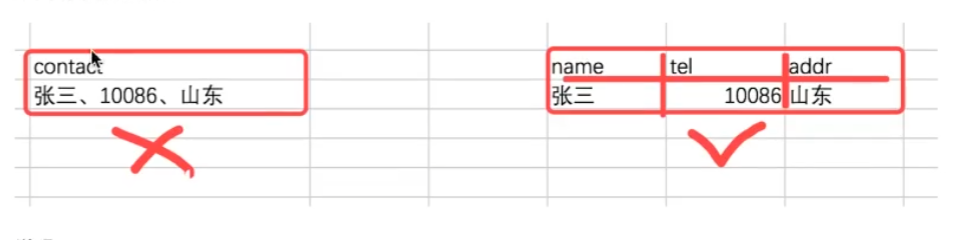
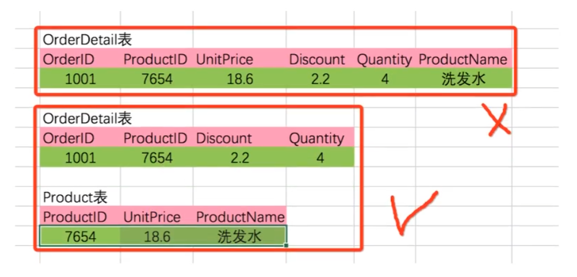
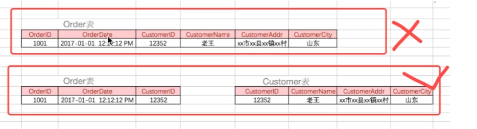
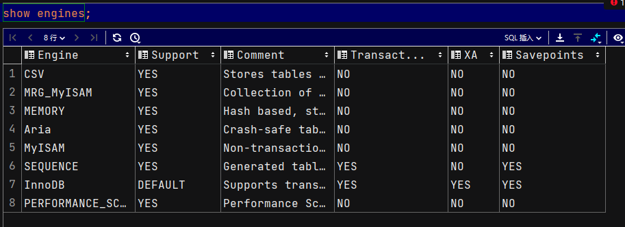
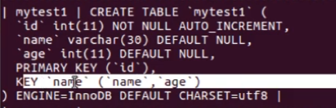

# SQL补充

## 设计三范式

第一范式：强调的是列的原子性，即列不能再次分为其他几列。



第二范式：包含两部分内容，一是表必须有一个主键；二是**非主键字段必须依赖主键**；而不能只依赖主键一部分。

> 有订单id和产品id(ProductID)，而产品价格是依赖于产品而不是订单



第三范式：**非主键必须直接依赖主键**，**不能存在传递依赖**，即不能存在非主键列A依赖非主键列B，非主键列B依赖主键。

> 这里有订单和客户，客户名称和客户id有关系



## 外键约束

外键对应的字段， 必须是另一个表的主键。用于保证数据有效性。

有外键，添加数据时，外键对应的主表要有对应数据；删除主表数据时，需要删除对应外键所有数据。

外键可以为null，添加数据。

```sql
# 设置外键 cls_id,注意 cls_id 原先要有这个字段。且注意外键主键类型一定要相同。
alter table students add foreign key(cls_id) references classes(id)

# 创建语句
create table teacher(
id int not null primary key auto_increment unsigned,
name varchar(20) not null,
s_id int unsigned,
foreign key(s_id) references school(id)
)

# 删除外键
shwo create table teacher;
alter table teacher drop foreign key teacher_idfk_1;# 这里的teacher_idfk_1是上边查出来的。
```


> 外键不建议使用：


## 事务

### 特性

事务就是用户定义的一系列sql语句操作，要么完整执行，要么不执行，他是不可分割工作单元。

事务四大特征

原子性，一致性，隔离性，持久性。

**原子性**，事务是一个不可分割的最小工作单元。

**一致性**，数据库总是从一个一致性状态转换到另一个一致性状态。

**隔离性**，一个事务所做的操作，在提交之前，对应其他事务是不可见的。

**持久性**，一旦事务提交，则其所做的修改会永久保存到数据库。

### 存储引擎

存储引擎是提供存储数据的一种机制。

支持事务的存储引擎只有 innoDB 类型。mysql 存储引擎默认用的是 innoDB。

查看所有引擎

```sql
show engines;
```



常用的存储引擎：

InnoDB 支持事务；

MyISAM 不支持事务，优势是访问速度快，对事务没有要求或者以select，insert为主的表使用。

查看当前表的引擎

```sql
show create table students;

CREATE TABLE `students` (
  `id` int(11) NOT NULL AUTO_INCREMENT,
  `name` varchar(100) NOT NULL,
  `age` int(11) DEFAULT 0,
  `sex` enum('男','女') NOT NULL DEFAULT '男',
  `is_del` tinyint(4) DEFAULT 0,
  `create_datetime` datetime NOT NULL DEFAULT current_timestamp(),
  `update_datetime` datetime NOT NULL DEFAULT current_timestamp() ON UPDATE current_timestamp(),
  `height` decimal(3,2) DEFAULT NULL,
  `c_id` int(10) unsigned DEFAULT NULL,
  PRIMARY KEY (`id`),
  KEY `c_id` (`c_id`),
  CONSTRAINT `students_ibfk_1` FOREIGN KEY (`c_id`) REFERENCES `classes` (`id`)
) ENGINE=InnoDB AUTO_INCREMENT=15 DEFAULT CHARSET=utf8mb3 COLLATE=utf8mb3_general_ci
# ENGINE=InnoDB 用的InnoDB
```

修改存储引擎

```sql
alter table students engine = 'MyISAM'
```

查看你的查询代码所用时间

```sql
show profiles;
```


### 使用

开启事务

```sql
begin; # 主要
# 或者
start transaction;
```

开启事务后，更改数据会**保存到Mysql的缓存文件**中，而不会维护到物理表。

Mysql数据库默认采用自动提交模式，如果没有显示开启一个事务，那么每条sql语句都会被当作一个事务执行提交操作。

设置 autocommit = 0，就是取消默认提交事务模式，直到执行 commit 或 rollback 事务提交或结束。

```sql
begin;

set autocommit = 0; # 取消默认提交
lnsert into students(name) values('喜喜');
commit; # 提交

rollback;
```

> 事务执行不好会容易引起缩表，解决方案：
>
> show processlist # 查看进程；
>
> kill id # 关闭这个进程
>
> SELECT * FROM information_schema.INNODB_TRX; 检查当前事务

## 索引

用于提升数据库查询速度。

索引在mysql中也叫做键，他是一个特殊的文件，他保存着数据表里所有的记录信息，更通俗来说，数据库索引相当于书的目录。

主键和外键都会主动创建索引，这里的key就是创建的索引，执行`show create table students;`


查看索引

```sql
show index from 表名;
```

创建

```sql
# 给name 添加索引 my_name
alter table classes add index my_name(name);
```

删除

```sql
show create table classes;
alter table classes drop index my_name;
```

## 联合索引

影响多个字段，每个索引都会创建独立文件，联合索引可以减少磁盘开销。

```sql
alter table teacher add index (name,age);
```



删除

```sql
alter table mytest1 drop index name;
show create table mytest1;
```

联合索引规则最左原则

如果创建了索引，最左边的字段一定在查询条件里边，否则不起作用，例如上边的name字段

```sql
select * from stu where name='112' # 使用了联合索引
select * from stu where name='112'and age=10 # 使用了联合索引
select * from stu where age=10 #  没有使用联合索引
```


## 索引与事务知识

**索引坏处**

索引是完全独立于基础数据之外的一部分数据。

在更新数据时，都须也要更新索引数据，调整因为更新**带来键值变化的索引信息**。最明显的资源消耗就是增加了更新所带来的 IO 量和调整索引所致的计算量。

索引还占用存储空间，而且随着数据量的增加，所占用的空间也会不断增加。

**创建索引准则**

较频繁的作为查询条件的字段应该创建索引。

唯一性太差的字段不适合单独创建索引，即使频繁作为查询条件。

唯一性太差的字段，如状态字段、类型字段等，这些字段中存放的数据可能总共就是那么几个或几十个值重复使用，每个值都会存在于成千上万或更多的记录中。对于这类字段，完全没有必要创建单独的索引。因为即使创建了索引，索引字段中**每个值都含有大量的记录**，那么存储引擎在根据索引 访问数据的时候会带来大量的随机IO，甚至有些时候还会出现大量的重复IO。


**什么是DDL**

什么是DDL（Data Definition Languages）语句：数据定义语言，这些语句定义了不同的数据段，数据库，表，列，索引等数据库对象。常用的语句关键字主要包括create,drop,alter等。

也就是说，增删改查、数据库的创建、销毁、索引的修改、字段的调整等等操作，都会加一个表级锁——元数据锁（meta data lock，MDL)。

**元数据锁**

在 MySQL 5.5 版本中引入了 MDL（元数据锁）（**meta data lock**），当对一个表做增删改查操作的时候，加 MDL 读锁；当要对表做结构变更操作的时候，加 MDL 写锁。

1，读锁之间不互斥，因此你可以有多个线程同时对一张表增删改查。
2，读写锁之间、写锁之间是互斥的，用来保证变更表结构操作的安全性。因此，如果有两个线程要同时给一个表加字段，其中一个要等另一个执行完才能开始执行。
**MDL写锁**只有在执行**DDL语句**的时候才会加，平时我们的**增删改查数据**只是加了**MDL读锁**，MDL读锁之间是可以共享的，并不会出现锁等待的情况。


**创建索引引起事务锁表问题如何解决？**

如何安全地给表添加字段、添加索引
1、生产环境的任何大表或频繁操作的小表，ddl都要非常慎重，最好在业务低峰期执行。

2、设计上要尽可能避免大事务，大事务不仅仅会带来各种锁问题，还会引起复制延迟/回滚空间爆满等各类问题。

3、设置参数 lock_wait_timeout 为较小值，使被阻塞端主动停止。

4、增强监控告警，及时发现 MDL 锁。

5、或许这样操作也是一种好办法：按新结构创建新表 -> 将旧表数据迁移至新表 -> 重命名两个表（三步都通过编写sql语句完成，比手动操作快，第二步的数据迁移操作视情况而定）。过程中最好在没人用的时候操作

6、操作ddl之前，先用以下语句查一下有没有长事务：

SELECT * FROM information_schema.INNODB _TRX;
1
7、多副本（主从、集群）下可以做热更新。

8、MariaDB 已经合并了 AliSQL 的这个功能，所以这两个开源分支目前都支持 DDL NOWAIT/WAIT n 这个语法：

ALTER TABLE tbl_name NOWAIT add column ...
ALTER TABLE tbl_name WAIT N add column ...

原文链接：https://blog.csdn.net/A_art_xiang/article/details/127811653
