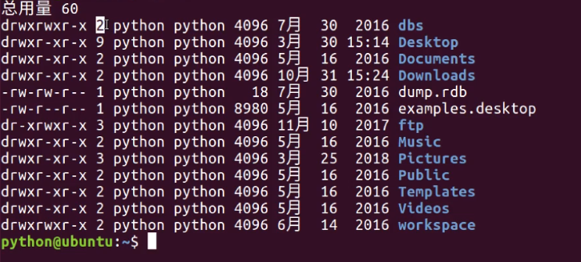
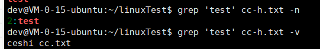
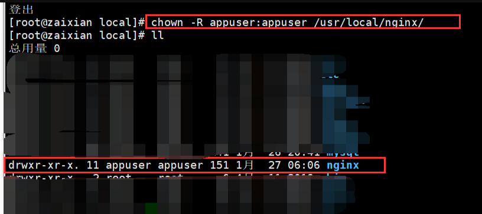

# Ubuntu基础指令

## 查看

查看目录

```bash
ls # 查看当前目录
# -l 以列表形式显示 -lh显示文件大小 -h显示文件大小没有单位 -a显示隐藏目录文件

ll # 相当于 ls -la
```



> 2 是内存地址被引用次数；python 是当前用户；python 是用户组；4896 是文件大小；7月30是最后修改时间；abs 文件名


查看树状目录信息

```bash
tree
```

查看当前目录的路径

```bash
pwd
```

清除终端内容

```bash
clear
```

## 切换目录

切换到但概念目录的主目录（根目录）

```bash
cd ~ # 或者直接写 cd
```

切换上一次目录

```bash
cd -
```

## 目录创建删除

创建指定文件

```bash
touch hello.txt
```

创建目录

```bash
mkdir 目录名	
# -p 创建所有依赖的文件夹（创建嵌套文件夹）
```

删除文件或目录

```bash
rm 文件或目录 # 默认删除文件，同名目录用 rmdir
# -f 删除空不报错 -d 删除空目录 -r 递归的方式把文件夹下的所有内容都删掉
# -i 交互式提醒（给个提示）
```

删除目录

```bash
rmdir
```

注意，这里的名字都可以使用正则匹配

## 复制与移动

复制文件或者目录

```bash
cp 复制的文件 粘贴的目录
# -i 覆盖时是否提示 -r 递归拷贝目录 -v 显示复制完后的路径表述 -a 保留文件的原有权限
```

移动文件、目录或者重命名

```bash
mv 移动的文件 到达的目录（也可以是重命名的新名）
# -i 覆盖时是否提示 -v 显示移动后的路径
```

注意的是，移动文件和复制文件都可以使用正则匹配

## 终端命令格式

三部分组成

```bash
command [-options] [parameter]
```

command：命令名，例如：ls、pwd

[-options]：选项，可以多个，例如：-r

[parameter]：参数，可以多个，比如：touch 文件名（路径）

**选项**

一个横线：-r短选项；两个横线：--help长选项。

**查看帮助**

```bash
命令 --help # 使用说明
man 命令 # 使用说明
```

## 重定向

把输出内容保存到文件内

```bash
> # 如果文件保存在会覆盖原有文件内容，相当于文件操作中的 w 模式
>> # 如果文件存在会追加写入文件末尾，相当于文件操作中的 a 模式
```

例如

```bash
ls --help > bb.txt
```

清空文件内容

```bash
> bb.txt
```

## 查看文件内容

查看小型文件

```bash
cat 
cat bb.txt > 3.txt # 可以复制内容到新的文件
```

分屏查看大型文件

```bash
more # 空格翻页或者 f 键，上一页按 d 键
```

修改文件内容

```bash
gedit 1.txt # 编辑内容（需要桌面程序）
```

管道

```bash
| # 管道，类似文件可以保存一些数据
ls /bin | more # 把输入信息保存到管道中，然后通过 more 拿出来查看
```

## 编写内容

```shell
$ cat > direct.txt << EOF
This is line 1.
This is line 2.
This is line 3.
EOF
```

## 软连接

快捷方式

```bash
ln -s info.txt info-s.txt # 创建软连接
```

## 硬链接

类似源文件的一个别名，也就是两个名字指向同一个文件。（目录不能创建硬链接）


```bash
ln hello.txt hello-h.txt # 创建硬链接，如果hello.txt删除，用hello-h依然可以打开源文件。
#创建新的硬链接数据修改，原来的 hello.txt 也会被修改。
```

创建完成后连接数是2


如果删除 cc.txt，则变为1


## 文本搜索

```bash
grep # 文本搜索
grep "aa" hello.py # 这里的引号可以省略
# -i 忽略大小写 -n 显示匹配行 -v 显示不包含匹配文本的所有行
```



结合正则

```bash
^ #以什么开头 例如 grep '^a' 2.txt -n
. #匹配非换行的字符
$ #以什么结尾
```

结合管道，查询显示数据的内容

```bash
ls --help | grep '[-]l' -n
```

## 查找文件指令

```bash
find # 指定目录下查找文件（包括目录）
# -name 根据文件名（包括目录名）字查找
find . bb.txt # 当前目录查找
find . -name '*.txt' # 递归查找 txt后缀的文件
```

## 查找指令位置

```bash
which python3 # 查找python3的指令位置。
# 文件内写入 #!/usr/bin/python3 默认使用py3解析器
# #！ 表示解析器位置
# #_*_coding:utf-8_*_ 表示指定编码格式UTF-8
```

## 查看按了那些软件

```bash
apt list
apt list | grep mysql-server # 结合管道搜索 mysql-server
# 或者用 apt-cache show
apt-cache show mysql-server
# 查看服务状态
sudo service mysql status
# 停止服务 sudo service mysql stop 启动服务 start 重启 restart


dpkg -l|grep "postfix" -i
# -i 忽略大小写
```

## 查看进程

```bash
ps -aux | grep mysql # 查看进程
# -a 表示所有用户 -u 显示用户名 -x 表示显示所有执行程序

sudo lsof -i :11000 # 对应进程的文件
#ps 和 lsof 的主要区别在于处理对象。ps 处理的是系统进程信息，而 lsof 处理的是系统打开的文件、端口和连接等信息。

kill <pid> # 杀死对应id进程

lsof -ti:8080 | xargs kill # 杀死一个端口号对应的进程
```

**lsof 的用法**

1）列出所有打开的文件：lsof。

2）查看谁正在使用某个文件：lsof /filepath/file。

3）递归查看某个目录的文件信息：lsof +D /filepath/filepath2/。

4）遍历查看某个目录的所有文件信息：lsof | grep ‘/filepath/filepath2/’。

5）列出某个用户打开的文件信息：lsof -u username。

6）列出某个程序所打开的文件信息：lsof -c mysql。

7）列出某个目录下所有打开的文件：使用lsof /path/to/directory命令可以列出指定目录下所有打开的文件。

8）列出某个进程打开的所有文件：使用lsof -p 命令可以列出指定进程ID打开的所有文件。

9）列出所有网络连接：使用lsof -i命令可以列出系统中所有网络连接的信息。

10）列出所有监听端口：使用lsof -i :命令可以列出所有在指定端口上监听的进程信息。

11）列出某个用户打开的所有文件：使用lsof -u 命令可以列出指定用户打开的所有文件。

12）列出所有目录：使用lsof -d命令可以列出系统中所有打开的目录。

13）列出所有管道：使用lsof -p命令可以列出系统中所有打开的管道。

14）列出所有套接字：使用lsof -s命令可以列出系统中所有打开的套接字。

## 压缩

linux支持压缩格式

.gz .bz2 .zip

使用 .gz 和 .bz2 压缩和解压都是 tar 命令。

.zip 使用 zip 压缩， unzip 解压。

**tar命令选项:**

| 选项 | 说明                               |
| :--- | :--------------------------------- |
| -c   | 创建打包文件                       |
| -v   | 显示打包或者解包的详细信息         |
| -f   | 指定文件名称, 必须放到所有选项后面 |
| -z   | 压缩或解压缩(.gz)                  |
| -j   | 压缩或解压缩(.bz2)                 |
| -x   | 解包                               |
| -C   | 解压缩到指定目录                   |

> 例如 `tar -zxvf ...gz` 解压包，安装软件

**unzip命令选项:**

| 选项 | 说明             |
| :--- | :--------------- |
| -d   | 解压缩到指定目录 |

例如解压压缩(.gz)

```bash
tar -zxvf 【压缩包文件名.tar.gz】 -C 【路径】/ # 解压
tar -zcvf 【目录】/ 【压缩包文件名.tar.gz】【源文件】 # 压缩
```


## 用户

### **新建一个用户**

```bash
# 添加用户
adduser erp
# 把用户添加到sudo附加组中
sudo usermod -G sudo erp
# 修改用户到一个组
sudo usermod -g sudo erp
```

> sudo（superuser do）用户组比较特殊。在Unix或Linux系统中，sudo用户组是一个具有特殊权限的用户组，它允许普通用户以特定的条件获得管理员或root权限。
>
> -a：表示添加选项，即将用户添加到指定的用户组中。
>
> -m：自动创建默认主目录，用户名就是目录名（创建用户都要）
>
> -g：创建用户组，不指定则用用户名创建一个组
>
> -G：设置附加组，设置了附加组（sudo）才可以使用sudo指令
>
> 附加组可以有多个，主组只有一个

附加组单独操作

```bash
gpasswd # 添加，删除附加组
sudo gpasswd -a # 添加附加组
sudo gpasswd -d # 删除附加组

sudo gpasswd -d dev sudo # 删除dev的sudo附加组，让他不能使用sudo

```

用户组创建

```bash
groupadd 
```

### 查看用户信息

```bash
cat /etc/passwd #查看所有用户
#  laowang:x:1001:1001::/home/laowang:
#  用户名:密码：用户ID:组ID::地址
cat /etc/group #查看组信息
#  laowang:x:1001:
#  组名:密码（一半没有）:组id
id laowang # 查看一个用户信息
#  uid=1001(laowang) gid=1001(laowang) 组=1001(laowang)
```

### **修改密码**

```bash
sudo passwd "username"
```

### 切换用户

```bash
su # 切换用户
```

### 删除用户

```bash
sudo userdel -r laowang # 删除用户
# -r 删除用户主目录，必须要设置，否则用户主目录不会删除
groupdel # 删除组
```


### **权限**

u，user，表示文件所有者。

g，group，表示用户组。

o，other，表示其他用户。

a，all，表示所有用户。

+，添加权限。

-，撤销权限。

=，设置权限。

r，读，w写，x执行，-没有权限

查看权限可以用`ls -lh`

```bash
drwxrwxr-x # 表示当前用户权限 rwx，同组用户权限 rwx，其他组用户权限r-x（没有写入权限）

```

目录中所有文件和子目录设置为该用户可读取和执行。

```bash
chmod -R o+rx /home/[frappe-user]/
```

其他类似的 chmod 命令包括：

```bash
chmod u+x file.txt #将文件 file.txt 设置为当前用户可执行。
chmod g+w file.txt #将文件 file.txt 设置为所属组可写入。
chmod o-rwx file.txt #将文件 file.txt 设置为其他用户不可读取、写入或执行。
chmod u=rwx,g=rw,o=rw info.py # 分别设置权限。
```

> +x 可执行；+w 可写入；+r可读取

设置执行人

```bash
chown -R appuser:appuser /usr/local/nginx/
```




**数字法**

r 对应 4，w 对应 2，x 对应 1，无权限0

> 读写 6，写执行 3 ，读执行5

```bash
chmod 644 1.txt #当前用户读写，同组读，其他，读
```

**查看当前用户**

```bash
whoami	# 查看当前用户
```

### 获取管理员权限

根目录创建文件

sudo -s 切换到root用户，获取管理员权限

sudo 某个指令获取管理员权限

### 远程登录

```bash
ssh dev@121.5.228.99 # 在cmd中使用ssh远程登录，使用dev用户名@后边是ip地址
who # 使用who指令查看谁在登录这个账户（重要）

scp # 远程拷贝
# scp -r 本地目录 远程服务器用户名@远程服务器ip地址:指定拷贝到远程服务器的路径
# scp -r 远程服务器用户名@远程服务器ip地址:远程服务器目录 指定拷贝到本地电脑的路径
# -r 表示递归拷贝整个目录
```

> 1. 假如Ubuntu作为服务端,需要安装ssh服务端软件. 执行命令: **sudo apt-get install openssh-server**
> 2. 客户端电脑如果是 **macOS** 系统则不需要安装 ssh 客户端软件，默认已经安装过了，**直接可以使用 ssh 命令**
> 3. 客户端电脑如果是Windows系统则需要安装**OpenSSH for Windows**这个软件

### ssh key 系统生成

```bash
ssh-keygen -t rsa -C '用户邮箱'
```

查看

```bash
cd /root/.ssh

# root@dev:~/.ssh# ls
# authorized_keys  id_rsa   id_rsa.pub # id_rsa 私钥，id_rsa.pub 公钥
```

指令

```bash
apt-get install -y openssh-server=1:8.9p1-3ubuntu0.1 # 安装
apt-get install -y openssh-client=1:8.9p1-3ubuntu0.1
systemctl enable ssh #开机启动 
systemctl restart ssh #重启ssh 
systemctl status ssh #查看ssh状态
```

其他

```bash
# 查看gitlab服务器ssh的类型
ssh -vT git@gitlab.wz.com
# debug1: Host 'gitlab.wz.com' is known and matches the ED25519 host key.
# 类型为 ED25519
ssh-keygen -t ed25519 -C "zhan.wu@zknow.com"
# 测试是否成功
ssh -T git@gitlab.wz.com
```

ssh运行root远程连接

```bash
passwd root # root 添加密码

sudo vi /etc/ssh/sshd_config

PermitRootLogin yes

sudo service ssh start # 重新启动ssh
```

## 关机重启

```bash
shutdown -h now # 关机
reboot # 重启
```

## 设置静态网络

教程参考1：https://zhuanlan.zhihu.com/p/653835602

教程参考2：https://linuxcpp.0voice.com/?id=131431

首先修改network配置

```bash
cd /etc/netplan
cp 00-installer-config.yaml 00-installer-config.yaml.bak
vim 00-installer-config.yaml
```

将 `dhcp4: true` 修改为 `dhcp4: no` 以禁用DHCP，并添加一个新的静态IP地址配置。例如，假设您想将IP地址设置为 `192.168.1.130` ，子网掩码为 `255.255.255.0` ，网关为 `192.168.1.1` ，DNS服务器为 `8.8.8.8` 和 `8.8.4.4`，则配置块应如下所示：

```js
network:
 ethernets:
   enp0s3:
     dhcp4: no
     addresses: [192.168.88.130/24]
     gateway4: 192.168.88.2
     nameservers:
       addresses: [8.8.8.8, 8.8.4.4]
 version: 2
```

重新刷新ip

```bash
sudo netplan apply
```

刷新 ssh 服务

```bash
service sshd restart
```

## shell 常见指令

### if 判断

```
if [ command ]; then echo "123" ;else echo "334" ;fi
```

command 有

```bash
# 文件 常用的：
[ -a FILE ] 如果 FILE 存在则为真。
[ -d FILE ] 如果 FILE 存在且是一个目录则返回为真。
[ -e FILE ] 如果 指定的文件或目录存在时返回为真。
[ -f FILE ] 如果 FILE 存在且是一个普通文件则返回为真。
[ -r FILE ] 如果 FILE 存在且是可读的则返回为真。
[ -w FILE ] 如果 FILE 存在且是可写的则返回为真。（一个目录为了它的内容被访问必然是可执行的）
[ -x FILE ] 如果 FILE 存在且是可执行的则返回为真。
 
# 文件 不常用的：
[ -b FILE ] 如果 FILE 存在且是一个块文件则返回为真。
[ -c FILE ] 如果 FILE 存在且是一个字符文件则返回为真。
[ -g FILE ] 如果 FILE 存在且设置了SGID则返回为真。
[ -h FILE ] 如果 FILE 存在且是一个符号符号链接文件则返回为真。（该选项在一些老系统上无效）
[ -k FILE ] 如果 FILE 存在且已经设置了冒险位则返回为真。
[ -p FILE ] 如果 FILE 存并且是命令管道时返回为真。
[ -s FILE ] 如果 FILE 存在且大小非0时为真则返回为真。
[ -u FILE ] 如果 FILE 存在且设置了SUID位时返回为真。
[ -O FILE ] 如果 FILE 存在且属有效用户ID则返回为真。
[ -G FILE ] 如果 FILE 存在且默认组为当前组则返回为真。（只检查系统默认组）
[ -L FILE ] 如果 FILE 存在且是一个符号连接则返回为真。
[ -N FILE ] 如果 FILE 存在 and has been mod如果ied since it was last read则返回为真。
[ -S FILE ] 如果 FILE 存在且是一个套接字则返回为真。
[ FILE1 -nt FILE2 ] 如果 FILE1 比 FILE2 新, 或者 FILE1 存在但是 FILE2 不存在则返回为真。
[ FILE1 -ot FILE2 ] 如果 FILE1 比 FILE2 老, 或者 FILE2 存在但是 FILE1 不存在则返回为真。
[ FILE1 -ef FILE2 ] 如果 FILE1 和 FILE2 指向相同的设备和节点号则返回为真。
# 字符串
[ -z STRING ] 如果STRING的长度为零则返回为真，即空是真
[ -n STRING ] 如果STRING的长度非零则返回为真，即非空是真
[ STRING1 ]　 如果字符串不为空则返回为真,与-n类似
[ STRING1 == STRING2 ] 如果两个字符串相同则返回为真
[ STRING1 != STRING2 ] 如果字符串不相同则返回为真
[ STRING1 < STRING2 ] 如果 “STRING1”字典排序在“STRING2”前面则返回为真。
[ STRING1 > STRING2 ] 如果 “STRING1”字典排序在“STRING2”后面则返回为真。
# 数值判断
[ INT1 -eq INT2 ] INT1和INT2两数相等返回为真 ,=
[ INT1 -ne INT2 ] INT1和INT2两数不等返回为真 ,<>
[ INT1 -gt INT2 ] INT1大于INT2返回为真 ,>
[ INT1 -ge INT2 ] INT1大于等于INT2返回为真,>=
[ INT1 -lt INT2 ] INT1小于INT2返回为真 ,<
[ INT1 -le INT2 ] INT1小于等于INT2返回为真,<=
# 逻辑判断
[ ! EXPR ] 逻辑非，如果 EXPR 是false则返回为真。
[ EXPR1 -a EXPR2 ] 逻辑与，如果 EXPR1 and EXPR2 全真则返回为真。
[ EXPR1 -o EXPR2 ] 逻辑或，如果 EXPR1 或者 EXPR2 为真则返回为真。
[ ] || [ ] 用OR来合并两个条件
[ ] && [ ] 用AND来合并两个条件
# 其他
[ -t FD ] 如果文件描述符 FD （默认值为1）打开且指向一个终端则返回为真
[ -o optionname ] 如果shell选项optionname开启则返回为真
```

案例

```shell
# 判断目录$doiido是否存在，若不存在，则新建一个
if [ ! -d "$doiido"]; then
　　mkdir "$doiido"
fi
# 判断普通文件$doiido是否存，若不存在，则新建一个
if [ ! -f "$doiido" ]; then
　　touch "$doiido"
fi
# 判断$doiido是否存在并且是否具有可执行权限
if [ ! -x "$doiido"]; then
　　mkdir "$doiido"
chmod +x "$doiido"
fi
# 是判断变量$doiido是否有值
if [ ! -n "$doiido" ]; then
　　echo "$doiido is empty"
　　exit 0
fi
#判断文件是否存在
#!/bin/sh
today=`date  -d yesterday +%y%m%d`
file="apache_$today.tar.gz"
cd  /home/chenshuo/shell
 
if [ -f "$file" ];then
    echo “”OK"
else
    echo "error  $file" >error.log
    mail  -s "fail  backup from test" loveyasxn924@126.com <error.log
fi
```

 IF高级特性：
双圆括号(( ))：表示数学表达式
在判断命令中只允许在比较中进行简单的算术操作，而双圆括号提供更多的数学符号，而且在双圆括号里面的'>','<'号不需要转意。

双方括号[[ ]]：表示高级字符串处理函数
双方括号中判断命令使用标准的字符串比较，还可以使用匹配模式，从而定义与字符串相匹配的正则表达式。

双括号的作用：
在shell中，[ $a != 1 || $b = 2 ]是不允许出，要用[ $a != 1 ] || [ $b = 2 ]，而双括号就可以解决这个问题的，[[ $a != 1 || $b = 2 ]]。又比如这个[ "$a" -lt "$b" ]，也可以改成双括号的形式(("$a"
 < "$b"))

```sh
# a>b且a<c
(( a > b )) && (( a < c ))
[[ $a > $b ]] && [[ $a < $c ]]
[ $a -gt $b -a $a -lt $c ]
```

### set

上面代码中，script.sh是在一个新的 Shell 里面执行。这个 Shell 就是脚本的执行环境，Bash 默认给定了这个环境的各种参数。set命令用来修改 Shell 环境的运行参数，也就是可以定制环境。

**set -x：**

默认情况下，脚本执行后，屏幕只显示运行结果，没有其他内容。如果多个命令连续执行，它们的运行结果就会连续输出。有时会分不清，某一段内容是什么命令产生的。set -x用来在运行结果之前，先输出执行的那一行命令。

详情：https://blog.csdn.net/liuxiao723846/article/details/102746314

### echo

输出内容

```sh
echo ${apkDir} # 输出变量
123
echo "$apkDir" # 双引号输出变量
123
echo '$apkDir' # 输出字符串
$apkDir
echo "123$apkDir" # 输出变量和字符串
123123

```

### ##与%%

\##和%%表示最长匹配，#和%表示最短匹配。键盘上#在%前面，所以#是对左边部分处理，%是对右边部分处理。

shell中##处理的是文件指定样式左侧部分，%%处理的是文件指定样式右边的部分。

例子

```bash
DIR=/home/shell/a/b/c/test.sh
# 删除 / 左边部分
echo ${DIR##*/}
# test.sh
echo ${DIR#*/}
home/shell/a/b/c/test.sh

# 删除 / 右边部分
echo ${DIR%%/*}
# 空的
echo ${DIR%/*}
home/shell/a/b/c
```

### jq使用

[jq](https://stedolan.github.io/jq/) 是一款命令行下处理JSON数据的工具。其可以接受标准输入，命令管道或者文件中
的JSON数据，经过一系列的过滤器(filters)和表达式的转后形成我们需要的数据结构并将结果输出到标准输出中。
jq的这种特性使我们可以很容易地在Shell脚本中调用它。

使用docker练习jq

```bash
docker pull exozet/jq:1.6-r0
```

启动一个前台docker练习

```bash
docker -ti --rm exozet/jq:1.6-r0 sh
```

然后读取json数据

```bash
# -r 读取 第一参数是属性路径 第二参数是文件
jq -r .version dd.json
# 1.0.0
jq -r .files[0] dd.json
# lib
```

修改数据

```bash
{
"code": 0,
"msg": "",
"store_name_list": [
{
"store_name": "gmail-demo-1"
}
]}

# 执行 jq '.store_name_list+=.store_name_list' 给这个数组再拼一个数组合并
demo=$(cat demo.json|jq '.store_name_list+=.store_name_list')
echo "$demo"
# 结果
{
"code": 0,
"msg": "",
"store_name_list": [
{
"store_name": "gmail-demo-1"
},
{
"store_name": "gmail-demo-1" // 多出来的数据
}
]}
```
