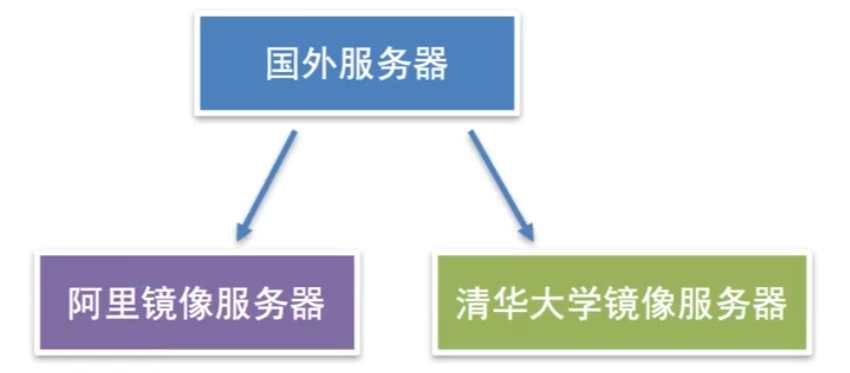

# Ubuntu补充


## vim学习

**命令行模式**（command mode）

　　控制屏幕光标的移动，字符、字或行的删除，移动复制某区段及进入Insert mode下，或者到 last line mode。

**插入模式**（Insert mode）

　　只有在Insert mode下，才可以做文字输入，按「ESC」键可回到命令行模式。

**底行模式**（last line mode）

　　将文件保存或退出vi，也可以设置编辑环境，如寻找字符串、列出行号……等。

不过一般我们在使用时把vi简化成两个模式，就是将底行模式（last line mode）也算入命令行模式command mode）。

### 命令行模式

按「ctrl」+「b」：屏幕往“后”移动一页。

按「ctrl」+「f」：屏幕往“前”移动一页。

按「ctrl」+「u」：屏幕往“后”移动半页。

按「ctrl」+「d」：屏幕往“前”移动半页。

**删除文字**

「x」：每按一次，删除光标所在位置的“后面”一个字符。

「dd」：删除光标所在行。

**复制**

「yy」：复制光标所在行到缓冲区。

「p」：将缓冲区内的字符贴到光标所在位置。注意：所有与“y”有关的复制命令都必须与“p”配合才能完成复制与粘贴功能。

**替换**

「r」：替换光标所在处的字符。

### 插入模式

　按「i」切换进入插入模式「insert mode」，按“i”进入插入模式后是从光标当前位置开始输入文件；

### 底行模式

「：」冒号即可进入「last line mode」

 **查找字符**

「/」+关键字：先按「/」键，再输入您想寻找的字符，如果第一次找的关键字不是您想要的，可以一直按「n」会往后寻找到您要的关键字为止。

「?」+关键字：先按「?」键，再输入您想寻找的字符，如果第一次找的关键字不是您想要的，可以一直按「n」会往前寻找到您要的关键字为止。

**保存文件**

「w」：在冒号输入字母「w」就可以将文件保存起来。

**离开vi**

「q」：按「q」就是退出，如果无法离开vi，可以在「q」后跟一个「!」强制离开vi。

「qw」：一般建议离开时，搭配「w」一起使用，这样在退出的时候还可以保存文件。

「q!」：强制退出当前文件


## 系统包

### 更新包

```bash
apt update && apt upgrade -y && shutdown -r now
```

> - apt update：这个命令用来更新系统软件源，获取最新的可用软件包信息。
>
> - apt upgrade -y：这个命令用来升级系统中已安装的软件包，其中-y选项表示默认选择yes确认所有更新。
>
> - shutdown -r now：这个命令会立即重启系统。其中，-r选项表示重启，now表示立即执行。
>
> 该命令的意思是：首先更新系统软件源，然后升级所有已安装的软件包并确认更新所有内容，最后立即重启系统以使所有的更新生效。

### curl

`curl`是一个非常有用的命令行工具，可以帮助您在终端中与 Web 服务进行交互。

安装

```bash
sudo apt-get install curl
```

以下是一个简单的示例，演示如何使用 `curl` 发送 GET 请求并获取响应：

```bash
curl https://example.com/api/v1/users
```

例子，下载node

```
curl -sL https://deb.nodesource.com/setup_16.x | sudo -E bash -
```

> 该脚本会向系统添加Node.js软件包的源。-sL参数表示在安装过程中不要显示任何输出。sudo表示以管理员身份运行脚本。
>
> -E参数是将当前用户环境变量传递给sudo。bash表示要在sudo下使用Bash shell来运行脚本。
>
> 因此，**-E bash表示以管理员权限运行Bash shell**，并将当前用户的环境变量传递给sudo以保持一致。

## 软件安装

Ubuntu软件安装，离线安装（deb文件）在线安装（apt-get方式安装）

```bash
dpkg # 安装卸载 deb 文件
# -i 离线安装deb文件
dpkg -r # 卸载离线安装包

sudo apt-get install # 安装在线
sudo apt-get remove # 卸载在线
```

`apt-get` 是高级程序包管理工具（Advanced Packaging Tool）的一个命令行接口，允许您从 Ubuntu 软件源（Software Sources）中搜索、安装、更新和卸载软件包。

`sudo apt-get` 命令通常用于在 Ubuntu 系统上安装、更新或卸载软件包等需要管理员权限的任务。

> `apt` 也是包安装指令，`apt` 命令基于 `libapt-pkg` 库，可以同时管理 `.deb` 软件包和 `.snap` 应用程序。而 `apt-get` 命令则基于低级的 `dpkg` 工具集，主要针对 `.deb` 软件包。

### 安装ping

```
apt-get install iputils-ping
```

### **更改镜像**



```bash
sudo apt-get update # 更新软件信息
cat /etc/apt/sources.list # 查看镜像原

# 清华源地址：https://mirrors.tuna.tsinghua.edu.cn/help/ubuntu/
```

更换清华源

```groovy
# 默认注释了源码镜像以提高 apt update 速度，如有需要可自行取消注释
deb https://mirrors.tuna.tsinghua.edu.cn/ubuntu/ jammy main restricted universe multiverse
deb-src https://mirrors.tuna.tsinghua.edu.cn/ubuntu/ jammy main restricted universe multiverse
deb https://mirrors.tuna.tsinghua.edu.cn/ubuntu/ jammy-updates main restricted universe multiverse
deb-src https://mirrors.tuna.tsinghua.edu.cn/ubuntu/ jammy-updates main restricted universe multiverse
deb https://mirrors.tuna.tsinghua.edu.cn/ubuntu/ jammy-backports main restricted universe multiverse
deb-src https://mirrors.tuna.tsinghua.edu.cn/ubuntu/ jammy-backports main restricted universe multiverse

# deb https://mirrors.tuna.tsinghua.edu.cn/ubuntu/ jammy-security main restricted universe multiverse
# deb-src https://mirrors.tuna.tsinghua.edu.cn/ubuntu/ jammy-security main restricted universe multiverse

deb http://security.ubuntu.com/ubuntu/ jammy-security main restricted universe multiverse
deb-src http://security.ubuntu.com/ubuntu/ jammy-security main restricted universe multiverse

# 预发布软件源，不建议启用
deb https://mirrors.tuna.tsinghua.edu.cn/ubuntu/ jammy-proposed main restricted universe multiverse
deb-src https://mirrors.tuna.tsinghua.edu.cn/ubuntu/ jammy-proposed main restricted universe multiverse
```

然后更新

```bash
apt update
apt-get update
apt-get upgrade
```

## 硬盘分区

```bash
# 查看磁盘状况
df -h
# 查询所有的空间
sudo fdisk -l
# 卸载磁盘
sudo umount /dev/磁盘
# 挂载磁盘
sudo mount /dev/磁盘 /要挂载的目录
# 格式化磁盘为 ext4
sudo mkfs.ext4 /dev/磁盘

# 永久挂在
vim /etc/fstab #配置自动挂载
/dev/sda1 /storage ext4 defaults 0 0
# <file system>  <mount point>  <type>         <options>        <dump>       <pass> 
# <设备文件名称>  <挂载目录>      <文件系统类型>  <文件系统参数>     <是否备份>     <开机时自检>
```

分区修改

```bash
fdisk /dev/sda # 修改磁盘分区
m # 查看并帮助
n # 新加分区
w # 保存
```

扩充分区

```bash
fdisk /dev/sda # 修改磁盘分区
d # 删除分区，输入3
n # 新建分区
# 如果有提示输入 N
w # 报错

pvresize /dev/sda3 #使用 pvresize 命令调整物理卷（physical volume）的大小，使其包括扩展的分区

sudo fdisk -l # 然后看看硬盘大小
```

扩展逻辑卷

虚拟机分配硬盘后会创建逻辑卷，不能把所有硬盘使用，我们可以扩展逻辑卷

```bash
# 首先查看逻辑卷的大小名字
df -h
# 然后看看硬盘大小
sudo fdisk -l
# 加上 6G 大小
sudo lvextend -L +6G /dev/mapper/ubuntu--vg-ubuntu--lv
# 刷新文件系统大小
sudo resize2fs /dev/mapper/ubuntu--vg-ubuntu--lv
```

