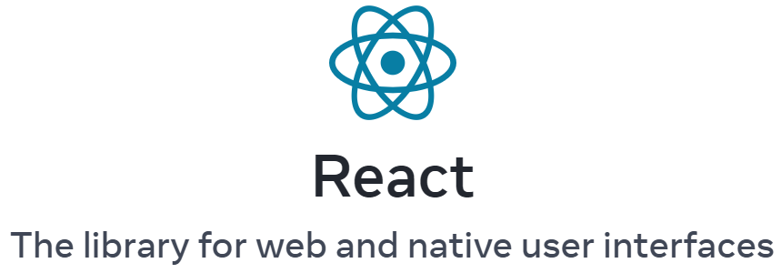
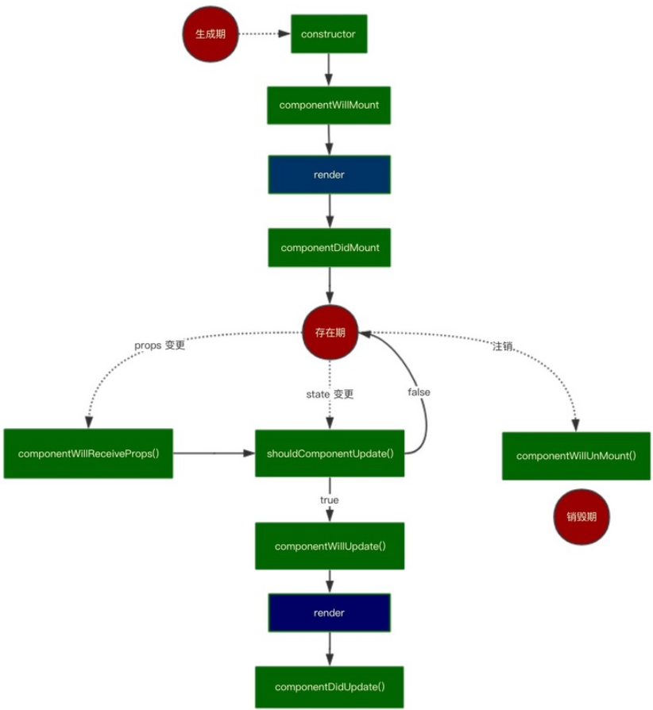
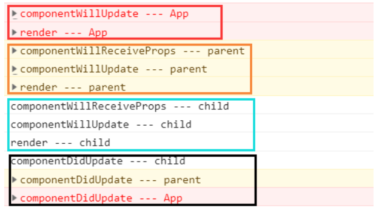
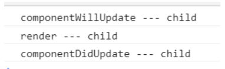
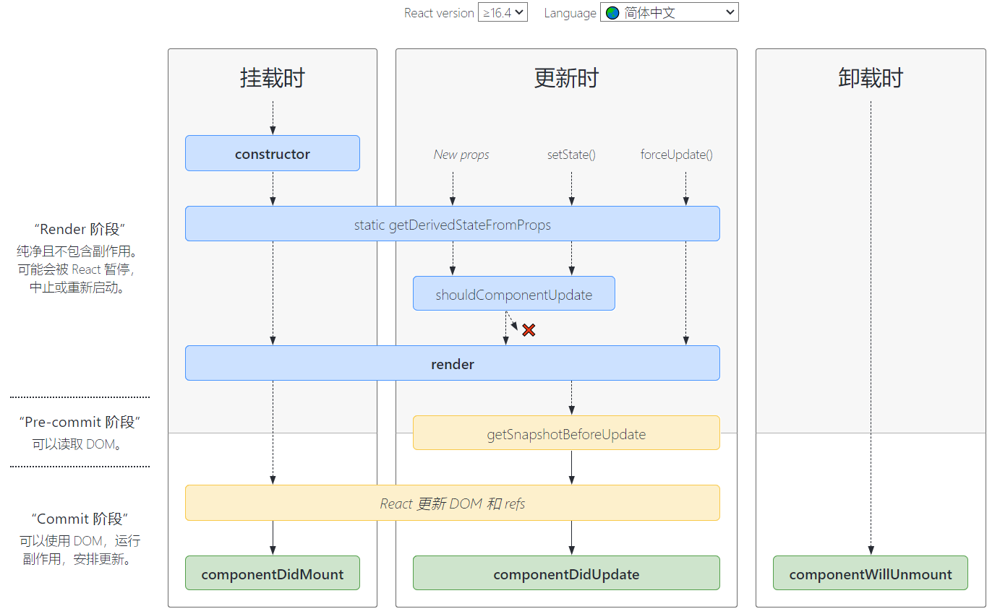

# React v16前版本基础



## 简介

### React 介绍

- React 是一个用于构建用户界面的渐进式 JavaScript 库
  - 本身只处理 UI
  - 不关心路由
  - 不处理 ajax
- React主要用于构建UI，很多人认为 React 是 MVC 中的 V（视图）。
  - 数据驱动视图
- React 由 Facebook 开发
- 第一个真生意义上把组件化思想待到前端开发领域
  - angular 早期没有组件化思想
  - 后来也被 Vue 学习借鉴了

React 起源于 Facebook 的内部项目，因为该公司对市场上所有 [JavaScript MVC 框架](http://www.ruanyifeng.com/blog/2015/02/mvcmvp_mvvm.html)，都不满意，就决定自己写一套，用来架设 [Instagram](https://instagram.com/) 的网站。做出来以后，发现这套东西很好用，就在2013年5月[开源](http://facebook.github.io/react/blog/2013/06/05/why-react.html)了。

由于 React 的设计思想极其独特，属于革命性创新，性能出众，代码逻辑却非常简单。所以，越来越多的人开始关注和使用，认为它可能是将来 Web 开发的主流工具。

这个项目本身也越滚越大，从最早的UI引擎变成了一整套前后端通吃的 Web App 解决方案。衍生的 React Native 项目，目标更是宏伟，希望用写 Web App 的方式去写 Native App。如果能够实现，整个互联网行业都会被颠覆，因为同一组人只需要写一次 UI ，就能同时运行在服务器、浏览器和手机（参见[《也许，DOM 不是答案》](http://www.ruanyifeng.com/blog/2015/02/future-of-dom.html)）。

- 数据驱动视图
- 组件化
- 路由


### react特点

- 声明（配置）式设计
  - `data` 响应式数据
  - `mathods` 处理函数
  - 这样做的好处就是按照我们约定好的方式来开发，所有人写出来的代码就像一个人写的
  - `state`
  - 方法就是类成员
  - 也有特定的组件生命钩子

- JSX
  - 一种预编译 JavaScript 语言，允许让你的 JavaScript 和 HTML 混搭
  - 模板中就是 JavaScript 逻辑
- 单向数据流
  - 组件传值
  - 所有数据都是单向的，组件传递的数据都是单向
  - Vue 也是单向数据流
  - 没有双向数据绑定

### React 与 Vue 的对比

**技术层面**

- Vue 生产力更高（更少的代码实现更强劲的功能）
- React 更 hack 技术占比比较重
- 两个框架的效率都采用了虚拟 DOM
  - 性能都差不多
- 组件化
  - Vue 支持
  - React 支持
- 数据绑定
  - 都支持数据驱动视图
  - Vue 支持表单控件双向数据绑定
  - React 不支持双向数据绑定
- 它们的核心库都很小，都是渐进式 JavaScript 库
- React 采用 JSX 语法来编写组件
- Vue 采用单文件组件
  - `template`
  - `script`
  - `style`

**开发团队**

- React 由 Facebook 前端维护开发
- Vue
  - 早期只有尤雨溪一个人
  - 由于后来使用者越来越多，后来离职专职开发维护
  - 目前也有一个小团队在开发维护

**社区**

- React 社区比 Vue 更强大
- Vue 社区也很强大


## react基础

安装

`npx create-react-app XXX`

需要引入

```react
import React from 'react'
import ReactDOM from 'react-dom'
```

### 建立组件

```react
// 1，函数式建立组件
function Welcome(props) {
  return <h1>Hello, {props.name}</h1>;
}

// 2，类式建立组件
class Welcome extends React.Component()
// 3，api式建立组件
const element = (
    <div>
        <h1>Hello,react!</h1>
    </div>
)
ReactDOM.render(
	element,
	document.getElementById('app')
)
```

### 生命周期

**挂载**

当组件实例被创建并插入 DOM 中时，其生命周期调用顺序如下：

- constructor()
- static getDerivedStateFromProps() // 
- render()
- componentDidMount()

**更新**

当组件的 props 或 state 发生变化时会触发更新。组件更新的生命周期调用顺序如下：

- static getDerivedStateFromProps()
- shouldComponentUpdate()
- render()
- getSnapshotBeforeUpdate()
- componentDidUpdate()


render() //渲染页面

componentDidMount() //刷新之后触发，用于初始化数据，操作dom。

componentWillMount() //刷新之前触发

> 使用的很少，目前16版本加入了UNSAFE来标识componentWillMount，新的生命周期static getDerivedStateFromProps()  也会替代这个。ComponentWillMount的生命周期钩子都有可能执行多次，所以不加以在这些生命周期中做有副作用的操作

componentWillReceiveProps() //父级数据变更，更新之前（props变动调用该钩子）

> 在React16 后，引入了 getDerivedStateFromProps() 钩子用于检测props变动（new props、setState、forceUpdate都会触发他，参考下边官方示意图）
>
> ```react
> static getDerivedStateFromProps(nextProps, prevState) {
>  const {type} = nextProps;
>  // 当传入的type发生变化的时候，更新state
>  if (type !== prevState.type) {
>      return {
>          type,
>      };
>  }
>  // 否则，对于state不进行任何操作
>  return null;
> }
> //注意这是静态属性，在class中直接写就可以。（static）
> //如果props传入的内容不需要影响到你的state，那么就需要返回一个null
> //这里的返回值（ {type} ）直接替换，组件中 state 属性。
> ```

。

shouldComponentUpdate() //更新之前，返回true则刷新。(一般不动这个方法，用的时候记得换回true)

componentWillUpdate() //更新之前（state变动时调用该钩子）

> 在React16 后，引入了 getSnapshotBeforeUpdate() 钩子，他在dom更新前，render后调用。
>
> `getSnapshotBeforeUpdate()`在最新的渲染输出提交给DOM前将会立即调用。它让你的组件能在当前的值可能要改变前获得它们。这一生命周期返回的任何值将会 作为参数被传递给`componentDidUpdate()`第三个参数。

componentDidUpdate() //更新结束

componentwillUnMount() //组件卸载

示意图




案例

新建三个组件APP->Parent->child

**如果使用App的setState()**

父级触发 componentWillUpdata

子级触发 componentWillReceiveProps() 和 componentWillUpdata()

更新完毕触发 componentDidupdate()



**如果使用child的setState()**

子级触发 componentWillUpdata()

更新完毕触发 componentDidupdate()



**补充**

[官方网站图解](http://projects.wojtekmaj.pl/react-lifecycle-methods-diagram/?tdsourcetag=s_pctim_aiomsg)



### “受控”和“不受控制”

“受控”和“不受控制”的术语通常指的是表单输入，但他们还可以描述任何组件数据的位置。作为props传递进组件的数据可以被认为是**受控的**（因为父组件控制数据）。只存在于内部状态的数据可以被认为是**不受控制的**（因为父类不能直接更改它）

### 为什么一定要在 componentDidMount 获取数据？

**constructor()**

constructor()中获取数据的话，如果时间太长，或者出错，组件就渲染不出来，整个页面都没法渲染了。

constructor是作组件state初绐化工作，并不是设计来作加载数据的。

**componentWillMount()**

如果使用SSR（服务端渲染）,componentWillMount会执行2次，一次在服务端，一次在客户端。而componentDidMount不会。

constructor可以完成state初始化，componentWillMount使用的很少，目前16版本加入了UNSAFE来标识componentWillMount，新的生命周期static getDerivedStateFromProps()   也会替代这个。

> React16之后采用了Fiber架构，只有componentDidMount声明周期函数是确定被执行一次的，类似ComponentWillMount的生命周期钩子都有可能执行多次，所以不加以在这些生命周期中做有副作用的操作，比如请求数据之类。

**render()**

无限render

**componentDidMount()**

确保已经render过一次。提醒我们正确地设置初始状态，这样就不会得到导致错误的"undefined"状态。

componentDidMount方法中的代码，是在组件已经完全挂载到网页上才会调用被执行，所以可以保证数据的加载。此外，在这方法中调用setState方法，会触发重渲染。所以，官方设计这个方法就是用来加载外部数据用的，或处理其他的副作用代码。


## 父子组件传值

### 父组件到子组件

**循环组件**

```react
this.setState((prevState) => ({
    list: prevState.list.concat([{
        ele: <Education key={Date.now().toString()}/>,//循环时需要设置key值
        ref: null
    }])
}))
//render()函数内
{
     list.map((item, i, arr) => {
         return item.ele
     })
}
```

### 父到子传值

```react
//parent
render(){
 	return(
    	<Child action=obj />
    )
}
//child
this.props.action
```

### 父使用子方法

主要途径拿到子组件ref

parent

```react
class RefPrent extends React.Component {
    constructor(props) {
        super(props);
    }
    componentDidMount() {
        this.focusTextInput()
    }

    focusTextInput = () => {
        console.log(this.textInput4) //获取子集的ref对象（使用父级方法子级调用的方式）
        console.log(this.textInput6) //获取子集的ref对象（简单）

        console.log(this.textInput7) //获取子集的ele（使用父级方法子级调用的方式）

        this.textInput6.getChile() //使用子集的ref可以执行子集方法。
    }
    render() {
        // 告诉 React 我们想把 <input> ref 关联到构造器里创建的 `textInput` 上
        return (
            <div>
                <RefChile getIndexEle={(ele)=>this.textInput7=ele}
                          onRef={(ref)=>this.textInput4=ref}
                          ref={(ref)=>this.textInput6=ref}
                />
            </div>
        );
    }
}
export default RefPrent
```

child

```react
class RefChile extends React.Component {
    constructor(props) {
        super(props);
    }
    componentDidMount() {
        this.props.onRef(this)//执行父级方法
    }
    render() {
        return (
            <div>
                <span ref={(ele)=>{this.props.getIndexEle(ele)}}>child</span>//执行父级方法
            </div>
        );
    }
}
export default RefChile
```


### 子到父传值

parent

```react
class RefPrent extends React.Component {
    constructor(props) {
        super(props);
        state:{
            childText:null
        }
    }
    getChildText(data) {
        this.setState({
            childText:data
        })
    }

    }
    render() {
        return (
            <div>
                <RefChile onGetChildText={(data)=>this.getChildText=ref}/>
            </div>
        );
    }
}
export default RefPrent
```

child

```react
//调用
this.props.pfn(text)
```

## 生成ref获取ele

```react
import React from 'react';
import ReactDOM from 'react-dom';
import RefChile from './refChile';

class RefPrent extends React.Component {
    constructor(props) {
        super(props);
        this.textInput = React.createRef();
    }
    componentDidMount() {
        this.focusTextInput()
    }
    focusTextInput = () => {
        console.log(this.textInput.current);//方式1，获取ele（推荐）
        console.log(this.textInput2)//方式2，获取ele
        console.log(this.refs.textInput3)//方式3，获取ele
    }
    render() {
        // 告诉 React 我们想把 <input> ref 关联到构造器里创建的 `textInput` 上
        return (
            <div>
                <input type="text"
                    ref={this.textInput}/>
                <input type="text"
                    ref={(ele)=>{this.textInput2 = ele}}/>
                <input type="text" ref="textInput3"/>
            </div>
        );
    }
}
export default RefPrent

```

> **注意**
>
> + 注意谷歌翻译会阻碍react的render执行。
> + setState() 不能立即生效，所以不能用一个setState触发下一个setState()。（可以用回调函数，完成业务）
>
> + Object.assign是浅合并。
> + 点击事件中，使用e.currentTarget可以获取触发元素的对象，就不会点到子元素去了。

## JSX

### 基本语法规则

- 必须只能有一个根节点
- 多标签写到包到一个小括号中，防止 JavaScript 自动分号不往后执行的问题。
- **遇到 HTML 标签 （以 `<` 开头） 就用 HTML 规则**解析
  - 单标签不能省略结束标签。
- **遇到代码块（以 `{` 开头），就用 JavaScript 规则**解析
- JSX 允许直接在模板中插入一个 JavaScript 变量
  - 如果这个变量是一个数组，则会展开这个数组的所有成员添加到模板中
- 单标签必须结束 `/>`

基本语法：

```jsx | pure
const element = <h1>Hello, world!</h1>;
```

JSX 防止注入攻击

> 由于：React DOM 在渲染所有输入内容之前，默认会进行[转义](https://stackoverflow.com/questions/7381974/which-characters-need-to-be-escaped-on-html)，它可以确保在你的应用中，永远不会注入那些并非自己明确编写的内容。所有的内容在渲染之前都被转换成了字符串。这样可以有效地防止 [XSS（cross-site-scripting, 跨站脚本）](https://en.wikipedia.org/wiki/Cross-site_scripting)攻击。

```react
const title = response.potentiallyMaliciousInput;
// 直接使用是安全的：
const element = <h1>{title}</h1>;
```

### 绑定js表达式与注释

```react
const user = {
    name:'Jacl',
    age:18,
    gender:0
}
const element=(
	<div>
        {
            //js注释
        }
        {/*推荐单行注释*/} //注释
        <p>{`hello ${1+1}`}</p> //表达式
        <p>姓名：{user.name}</p>
        <p>姓名：{user.age}</p>
        <p>姓名：{user.gender===0?'男':"女"}</p>
    <div>
)
ReactDOM.render(
	element,
    document.getElementById('app')
)
```

### 元素渲染

根据我们已有的知识，更新 UI 唯一的方式是创建一个全新的元素，并将其传入 `ReactDOM.render()`。

考虑一个计时器的例子：

```react
function tick() {
  const element = (
    <div>
      <h1>Hello, world!</h1>
      <h2>It is {new Date().toLocaleTimeString()}.</h2>
    </div>
  );
  ReactDOM.render(element, document.getElementById('root'));
}
setInterval(tick, 1000);
```

### JSX 代表 Objects

Babel 转译器会把 JSX 转换成一个名为 `React.createElement()` 的方法调用。

```js
const element = (
  <h1 className="greeting">
    Hello, world!
  </h1>
);

// 类似

const element = React.createElement(
  'h1',
  {className: 'greeting'},
  'Hello, world!'
);
```


## 组件 & Props

### 函数组件与 class 组件

定义组件最简单的方式就是编写 JavaScript 函数：

函数组件：

```react
function Welcome(props){
  return <h1>Hello, {props.name}</h1>;
}
```

es6，class方式定义组件：

```react
class Welcome extends React.Component {
  render() {
    return <h1>Hello, {this.props.name}</h1>;
  }
}
```

上述两个组件在 React 里是等效的。

> **注意：** 组件名称必须以大写字母开头。
>
> React 会将以小写字母开头的组件视为原生 DOM 标签。例如，`<div />` 代表 HTML 的 div 标签，而 `<Welcome />` 则代表一个组件，并且需在作用域内使用 `Welcome`。

### 组合组件

组件可以在其输出中引用其他组件。这就可以让我们用同一组件来抽象出任意层次的细节。

```react
function Welcome(props) {
  return <h1>Hello, {props.name}</h1>;
}

function App() {
  return (
    <div>
      <Welcome name="Sara" />
      <Welcome name="Cahal" />
      <Welcome name="Edite" />
    </div>
  );
}

ReactDOM.render(
  <App />,
  document.getElementById('root')
);
```

### 抽取组件

提取Avatar组件

```react
function Avatar(props) {
  return (
    
  );
}
```

提取UserInfo组件

```react
function UserInfo(props) {
  return (
    <div className="UserInfo">
      <Avatar user={props.user} />
      <div className="UserInfo-name">
        {props.user.name}
      </div>
    </div>
  );
}
```

父级组件 Comment 组件：

```react
function Comment(props) {
  return (
    <div className="Comment">
      <UserInfo user={props.author} />
      <div className="Comment-text">
        {props.text}
      </div>
      <div className="Comment-date">
        {formatDate(props.date)}
      </div>
    </div>
  );
}
```

### Props 的只读性

组件无论是使用函数声明还是通过 class 声明，都决不能修改自身的 props。

```react
function Welcome(props) {
  return <h1>Hello, {props.name = 1 }</h1>;
}//修改name，是不可以的
```

### 设置入参默认值

设置组件属性 defaultProps 可以设置入参默认值

```tsx | pure
const DrawerDate: React.FC<ISearchContentDateProps> = ({
  title,
  disabled,
  ...otherProps
}) => {……};
DrawerDate.defaultProps = {
  title: '时间选择',
  disabled: false,
};
```

设置 displayName 可以方便调试，会显示在 [React Developer Tools](https://github.com/facebook/react/tree/main/packages/react-devtools) 中。

```jsx | pure
function withSubscription(WrappedComponent) {
  class WithSubscription extends React.Component {/* ... */}
  WithSubscription.displayName = `WithSubscription(${getDisplayName(WrappedComponent)})`;
  return WithSubscription;
}

function getDisplayName(WrappedComponent) {
  return WrappedComponent.displayName || WrappedComponent.name || 'Component';
}
```

### createPoral & render

#### **createPoral**

```js
ReactDOM.render(element, container[, callback])
```

在提供的 container 里渲染一个 React 元素，并返回对该组件的引用（或者针对无状态组件返回 null）。
如果 React 元素之前已经在 container 里渲染过，这将会对其执行更新操作，并仅会在必要时改变 DOM 以映射最新的 React 元素。
如果提供了可选的回调函数，该回调将在组件被渲染或更新之后被执行。

createPoral 用于模态框的构建非常好用，它可以构建一个脱离当前位置的节点出来。

**案例**

飞搭拖出提示框 popoverBsObj

```tsx | pure
// 弹框，选择业务对象
import React, { FC, useEffect, useState, useRef } from 'react';
import { observer } from 'mobx-react-lite';
import { Select, Button } from 'choerodon-ui/pro';
import { ViewComponentProps } from 'choerodon-ui/pro/lib/core/ViewComponent';
import { usePageDesignerStore } from '@/routes/NewPageDesigner/store';
import ReactDom from 'react-dom';
import { ButtonColor } from 'choerodon-ui/pro/lib/button/enum';
import styles from './index.less';

const { Option } = Select;

interface IRenderCom extends ViewComponentProps {
  onOk: (businessObjectCode: string) => void;
  open: string;
  setOpen: (businessObjectCode: string | null) => void;
  menuItemCode: string;
}

const Render: FC<IRenderCom> = observer(({ children, onOk, open, setOpen, menuItemCode }) => {
  const [selectBsObjCode, setSelect] = useState<string | null>(null);
  const [conDom, setConDom] = useState<any>(null);
  const [conDomStyle, setConDomStyle] = useState<any>({});
  const { comTempComStore } = usePageDesignerStore();
  const ref = useRef<any>();

  const handleChange = (value) => {
    setSelect(value);
  };

  const isHidden: boolean = !open || open !== menuItemCode;
  useEffect(() => {
    // 如果hidden时卸载一些数据
    if (isHidden) {
      setSelect(null);
    }
  }, [isHidden]);
  useEffect(() => {
    // 如果第一次没有选择值，默认赋值第一个
    if (!isHidden && !selectBsObjCode && comTempComStore.component.endBusinessObjList.length) {
      setSelect(comTempComStore.component.endBusinessObjList[0]?.businessObjectCode);
    }
  }, [comTempComStore.component.endBusinessObjList?.length, isHidden]);
  const por = (
    <div
      hidden={isHidden}
      className={styles.popover}
      style={{
        left: conDomStyle.left,
        top: conDomStyle.top,
      }}
    >
      <div>业务对象</div>
      <div>
        <Select onChange={handleChange} value={selectBsObjCode} clearButton={false}>
          {comTempComStore.component.endBusinessObjList?.map((item) => {
            return <Option value={item.businessObjectCode}>{item.businessObjectName}</Option>;
          })}
        </Select>
      </div>
      <div className={styles.btnGroup}>
        <Button
          onClick={() => {
            setOpen(null);
          }}
        >
          取消
        </Button>
        <Button
          color={ButtonColor.primary}
          onClick={() => {
            setOpen(null);
            if (selectBsObjCode) {
              onOk(selectBsObjCode);
            }
          }}
        >
          确定
        </Button>
      </div>
    </div>
  );
  const mainDom = document.querySelector('article[class*="main"]');
  useEffect(() => {
    const EfeidaPopover = 'feida-popover';
    if (!mainDom) return;
    let _conDom = [...(mainDom?.children || [])].find((item) => item.className === EfeidaPopover);
    if (!_conDom) {
      _conDom = document.createElement('section');
      _conDom.className = EfeidaPopover;
      mainDom.appendChild(_conDom);
    }
    setConDom(_conDom);
  }, [open]);

  useEffect(() => {
    const ret = ref.current.getBoundingClientRect();
    setConDomStyle({
      left: Math.floor(ret.left + ret.width),
      top: Math.floor(ret.top + ret.height),
    });
  }, [open]);

  return (
    <div className={styles.popoverBsObj} ref={ref}>
      {conDom && ReactDom.createPortal(por, conDom)}
      {children}
    </div>
  );
});
export default Render;

```

#### 与render不同

```jsx | pure
ReactDOM.render(<AmISameAsPortal />, document.getElementById('another-container'))
```

如果在组件内使用 render ，只会在当时 div 所在位置创建一个节点出来，也就是 render 第**二个参数没有作用**了。

```tsx | pure
class HelloReact extends React.Component {
    render(){
        return (
            <div>
                <h1>父组件</h1>
                <div onClick={() => {alert('YES  Dispaly')}}>
                    {createPortal(<HelloFromPortal />, document.getElementById('another-root'))}
                </div>
                XXXX
                XXXX
                <div onClick={() => {alert("No display")}}>
                    {ReactDOM.render(<AmISameAsPortal />, document.getElementById('another-container'))}
                </div>

            </div>


        )
    }
}
```

参考：https://www.jianshu.com/p/a81d19ff174f

#### 区别

（1）ReactDOM.render 在首次调用时，会将容器节点里的所有DOM元素都替换，ReactDOM.createPortal 是向container 下插入一个子节点；
（2）ReactDOM.render 会直接渲染成DOM元素，而 ReactDOM.createPortal 则是渲染出React元素，最终还是需要通过 ReactDOM.render 渲染成真实DOM；

参考：https://www.jianshu.com/p/e17d38f04dd3

### memo

当数据变化时，代码会重新执行一遍，但是**子组件数据没有变化也会执行**，这个时候可以使用`memo`将子组件封装起来，让子组件的数据只在发生改变时才会执行

封装一个子组件，可以父级组件更新，而封装的子组件不更新。

```jsx
function Child({seconds}){
    console.log('I am rendering');
    return (
        <div>I am update every {seconds} seconds</div>
    )
};
export default React.memo(Child)
```

> React.memo()可接受2个参数，第一个参数为纯函数的组件，第二个参数用于对比props控制是否刷新，与[`shouldComponentUpdate()`](https://links.jianshu.com/go?to=https%3A%2F%2Freactjs.org%2Fdocs%2Freact-component.html%23shouldcomponentupdate)功能类似。[2]

```jsx
import React from "react";

function Child({seconds}){
    console.log('I am rendering');
    return (
        <div>I am update every {seconds} seconds</div>
    )
};

function areEqual(prevProps, nextProps) {
    if(prevProps.seconds===nextProps.seconds){
        return true
    }else {
        return false
    }

}
export default React.memo(Child,areEqual)
```

参考：https://www.jianshu.com/p/b3d07860b778

## 插件与其他

### Prompt

组件作用

该组件主要作用是,在用户准备离开该页面时, 弹出提示, 返回true或者false, 如果为true, 则离开页面, 如果为false, 则停留在该页面

引入Prompt组件

```js
import { Prompt } from "react-router-dom";
```


prompt组件里有一个message属性,该属性就是在用户离开页面时, 所提示的文字内容

```jsx | pure
 <Prompt message="您确定要离开该页面吗?" />
```

参考地址：https://blog.csdn.net/Lucky_Q/article/details/81561685

### dangerouslySetInnerHTML

让html字符串不被转译，就用这个dangerouslySetInnerHTML

详细案例：https://www.cnblogs.com/xianyulaodi/p/5038258.html

参考：https://zhuanlan.zhihu.com/p/269515086

### 复制

`copy(text: string, options: object): boolean`— 尝试将文本复制到剪贴板。`true`如果用户不需要额外的击键（因此`execCommand`，IE`clipboardData`工作）或.，则返回`false`。

```
npm i --save copy-to-clipboard
```

地址：https://www.npmjs.com/package/copy-to-clipboard

```js
import copy from 'copy-to-clipboard';
```

```js
copy(assistantDataSet.current?.get('wechatLinkUrl') || record?.get('wechatLinkUrl'));
```

### JSON解析

可以处理json里边的大数避免精度丢失

```js
import JSONBig from 'json-bigint';
```

地址：https://www.baidu.com/link?url=xSBud_7Edf0LUdP1tXvkVG82IsytiHXY56cjeDXf24RO0VSWkaV15DeX1eTSQJNk5-sqTP0FRIsH86JBboOWzq&wd=&eqid=9ab33902000d772c000000046316e90b

```js
const JSONBigString = JSONBig({storeAsString: true});
```

```js
try {
  return JSONBigString.parse(data);
} catch (error) {
  return data;
}
```

### 解析HTML

使用 `react-sanitized-html`

地址：https://www.npmjs.com/package/react-sanitized-html

```js
import SanitizedHTML from 'react-sanitized-html';

function Test() {
const html = "";
return <SanitizedHTML html={html || ''} />;
}
```

```js
import SanitizedHTML from 'react-sanitized-html';
 
const HTML_FROM_USER = '<a href="http://bing.com/">Bing</a>';
 
ReactDOM.render(
  <SanitizedHTML html={ HTML_FROM_USER } />,
  document.getElementById('reactRoot')
);
```

### withRouter 

使用Route包裹组件， 将 react-router 的 **history, location, match信息**通过**props**传递给包裹的组件

默认情况下必须是经过路由匹配渲染的组件才存在this.props，才拥有路由参数，才能使用“函数跳转”的写法，执行this.props.history.push('/***') 跳转到对应路由的页面。

```react
import React from 'react'
import { withRouter } from 'react-router-dom'

export default withRouter((props) => {
	const { history, location, match } = props
	return <div>{location.pathname}</div>
})
```

然而不是所有组件都直接与路由相连（通过路由跳转到此组件）的，当这些组件需要路由参数时，使用withRouter就可以给此组件传入路由参数，此时就可以使用this.props。

```react
import React from 'react'
import { withRouter, NavLink } from 'eact-router-dom'

export default withRouter((props) => {
	return <div>
		<span>测试</span>
		<div><NavLink to="/" exact>首页</NavLink></div>
	</div>
})
```

