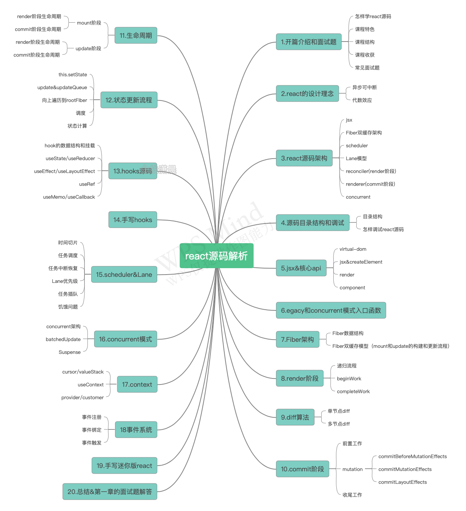
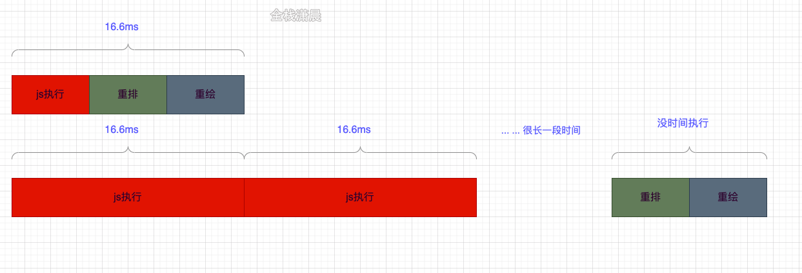

# React源码-1

## 学习进程

从入口函数调用栈入手


入口调用 render ，render阶段调用 unbatchedUpdates，commit阶段调用  commitRoot。

**入口阶段**

render 方法，调用了 createRootImpl方法，创建根节点（fiber的根节点）

> fiber 通过指针的形式创建成了 fiber树。

接下来调用了 listenToNativeEvent 创建事件

**render阶段**

开始调用 unbatchedUpdates 方法，非批量的更新。

> 当前阶段是页面首次渲染的时候，用户希望尽早看到页面的成像。
>
> 所以不能使用异步方式

接下来调用 scheduleUpdateOnFiber 方法，他是由调度器执行的。他会排列任务优先级，让优先级高的优先执行。


再往下，会调用 performUnitOfWork 执行一个单元工作。

> fiber 节点，就是一个工作单元，render阶段会更新我们 fiber 节点。


然后，深度优先遍历，遍历 fiber 树，从上边遍历到下边时，调用beginWork 方法处理 fiber 节点，从下边返回上边时，调用 completeWork 处理相应的 fiber 节点。


render 阶段最主要函数就是 beginWork 和 completeWork。


其中，beginWork 会调用 reconcileChildren 方法，创建对比 fiber节点。标识带有副作用的 fiber 节点。

> 副作用包含节点插入，修改，删除。

 

completeWork 他会调用 createinstance 方法，创建真实的元素。调用setInitialProperties 复制元素属性。

在 render 阶段的结尾，会生成 effectList 链表，里边放有带有副作用的 fiber节点。

然后回把这个链表交给 commit阶段，链表中的副作用，会应用到正式节点上。

**commit阶段**

首先会调用 commitRoot 然后调用了 unstable_runWithPriority 。

commit阶段主要的三个阶段：commitBeforeMutationEffects，commitMutationEffects，commitLayoutEffects


commitBeforeMutationEffects在操作正式节点之前调用 getSnapshotBeforeUpdate 生命周期，来拿到快照。

> 代替componentWillUpdate。
> 常见的 componentWillUpdate 的用例是在组件更新前，读取当前某个 DOM 元素的状态，并在 componentDidUpdate 中进行相应的处理。
>  这两者的区别在于：
>
> 1. 在 React 开启异步渲染模式后，在 render 阶段读取到的 DOM 元素状态并不总是和 commit 阶段相同，这就导致在
>     componentDidUpdate 中使用 componentWillUpdate 中读取到的 DOM 元素状态是不安全的，因为这时的值很有可能已经失效了。
> 2. getSnapshotBeforeUpdate 会在最终的 render 之前被调用，也就是说在 getSnapshotBeforeUpdate 中读取到的 DOM 元素状态是可以保证与 componentDidUpdate 中一致的。
>     此生命周期返回的任何值都将作为参数传递给componentDidUpdate（）。

然后调度 useEffect。

然后调用 commitMutationEffects，他会操作正式节点，会把副作用应用到节点之上。

然后调用 commitLayoutEffects 函数，这个函数会调用 componentDidUpdate

> 组件更新完毕后，react只会在第一次初始化成功会进入componentDidmount,之后每次重新渲染后都会进入这个生命周期，这里可以拿到prevProps和prevState，即更新前的props和state。

## 课程大纲




# React的设计理念

## React15慢在哪里

React15之前的协调过程是同步的，也叫stack reconciler（堆栈调整器），又因为js的执行是单线程的，这就导致了在更新比较耗时的任务时，不能及时响应一些高优先级的任务。

比如用户的输入，所以页面就会卡顿，这就是cpu的限制。

## 异步可中断方案

在单线程的环境中，遇到了比较耗时的代码计算。首先我们可能会将**任务分割**，让它**能够被中断**，在其他任务到来的时候**让出执行权**。当其他任务执行后，再从之前中断的部分开始**异步执行**剩下的计算。所以关键是实现一套**异步可中断**的方案。

## 涉及的三个概念

在刚才的解决方案中提到了**任务分割**，和**异步执行**，并且能让出执行权，由此可以带出react中的三个概念

### Fiber

Fiber：react15的更新是同步的，因为它不能将任务分割，所以需要一套**数据结构**让它既能**对应真实的dom**又能作为**分隔的单元**，这就是Fiber。

### **Scheduler**

**原理**

Scheduler：有了Fiber，我们就需要用**浏览器的时间片异步执行**这些**Fiber的工作单元**，我们知道浏览器有一个api叫做requestIdleCallback

它可以**在浏览器空闲的时候执行一些任务**，我们用这个api执行react的更新，**让高优先级的任务优先响应**不就可以了吗

但事实是requestIdleCallback存在着浏览器的兼容性和触发不稳定的问题，所以我们需要用**js实现一套时间片运行**的机制，在react中这部分叫做scheduler。

```js
let firstFiber
let nextFiber = firstFiber
let shouldYield = false // 控制是否继续执行
//firstFiber->firstChild->sibling
function performUnitOfWork(nextFiber){ // 执行队列里的任务
  //...
  return nextFiber.next
}
   
function workLoop(deadline){
  while(nextFiber && !shouldYield){
          nextFiber = performUnitOfWork(nextFiber)
          shouldYield = deadline.timeReaming < 1 // 不空闲，关闭shouldYield
  }
  requestIdleCallback(workLoop)
}
   
requestIdleCallback(workLoop) // 浏览器空闲执行任务队列
```

### Lane

Lane：有了异步调度，我们还需要**细粒度的管理各个任务的优先级**，让高优先级的任务优先执行，各个Fiber工作单元还能比较优先级，相同优先级的任务可以一起更新，想想是不是更cool呢。

##  **产生出来的上层实现**

由于有了这一套异步可中断的机制，我们就能实现batchedUpdates批量更新和Suspense异步交互。

### batchedUpdates

> 深入理解batchedUpdates: https://zhuanlan.zhihu.com/p/78516581
>
> 因为React 的更新是基于 [Transaction](https://zhuanlan.zhihu.com/p/28532725)（事务）的，Transaction 就是给**目标执行的函数**包裹一下，加上前置和后置的 hook （有点类似 koa 的 middleware），在开始执行之前先执行 initialize hook，结束之后再执行 close hook，这样搭配上 isBatchingUpdates 这样的布尔标志位就可以实现，一整个**函数调用栈**内的多次 setState 全部入 pending 队列，结束后统一 apply 了。
>
> 但是 setTimeout 这样的方法执行是脱离了事务的，react 管控不到，所以就没法 batch 了。异步执行 setState 会多次渲染。
>
> 异步更新使用 **ReactDOM.unstable_batchedUpdates** 来强制 batch。（类似于 mobx 的 runInAction Api）

### suspense

> 深度理解 React Suspense: https://www.jianshu.com/p/ba1c0101352c，用同步代码写异步操作。实现类似抛出异常，捕获异常的方式。
>
> 可以看到ProductResource.read完全是同步的写法，把获取数据的部分完全分离出了Proeuct组件之外，在源码中，ProductResource.read会在获取数据之前会**throw一个特殊的Promise**，由于scheduler的存在，scheduler可以**捕获**这个promise，暂停更新，等数据获取之后交还执行权。
>
> ```js
> const ProductResource = createResource(fetchProduct);
> 
> const Proeuct = (props) => {
>     const p = ProductResource.read( // 用同步的方式来编写异步代码!
>           props.id
>     );
>   return <h3>{p.price}</h3>;
> }
> 
> function App() {
>   return (
>     <div>
>       <Suspense fallback={<div>Loading...</div>}>
>         <Proeuct id={123} />
>       </Suspense>
>     </div>
>   );
> }
> ```
>
> 

异步可中断更新前后的区别：


## 代数效应

除了cpu的瓶颈问题，还有一类问题是和副作用相关的问题，比如获取数据、文件操作等。不同设备性能和网络状况都不一样，react怎样去处理这些副作用，让我们在编码时最佳实践，运行应用时表现一致呢，这就需要react有分离副作用的能力，为什么要分离副作用呢，因为要解耦，这就是代数效应。


## React源码架构

react的核心可以用ui=fn(state)来表示

> 更详细可以用
>
> ```js
> const state = reconcile(update);
> const UI = commit(state);
> ```

上面的fn可以分为如下一个部分：

- Scheduler（调度器）： 排序优先级，让优先级高的任务先进行reconcile
- Reconciler（协调器）： 找出哪些节点发生了改变，并打上不同的Flags（旧版本react叫Tag）
- Renderer（渲染器）： 将Reconciler中打好标签的节点渲染到视图上


### **jsx**

jsx是js语言的扩展，react通过**babel词法解析**（具体怎么转换可以查阅babel相关插件），**将jsx转换成React.createElement**，React.createElement方法返回**virtual-dom**对象（**内存**中用来描述**dom**阶段的对象），所有**jsx本质上就是React.createElement的语法糖**，它能声明式的编写我们想要组件呈现出什么样的ui效果。

### Fiber双缓存

#### **fiber存储的信息**

**Fiber**对象上面保存了包括这个节点的**属性、类型、dom**（第一类，节点信息相关）等

Fiber通过**child、sibling、return**（指向父节点）来形成**Fiber树**（第二类，fiber树结构相关）

还保存了**更新状态**时用于**计算state**的**updateQueue**（第三类，fiber作为工作单元相关）

> updateQueue是一种链表结构，上面可能存在多个未计算的update，**updat**e也是一种数据结构，上面包含了**更新的数据、优先级**等，除了这些之外，上面还有和**副作用**有关的信息。

#### 双缓存含义

**双缓存**是指存在**两颗Fiber树相互切换的过程**，**current Fiber树**描述了**当前呈现的dom树**，**workInProgress Fiber树**是**正在更新的Fiber树**，这两颗Fiber树都是在**内存中运行**的，在workInProgress Fiber构建完成之后会将它作为current Fiber应用到dom上

> **在mount时**（首次渲染），会根据jsx对象（Class Component或的render函数者Function Component的返回值），构建Fiber对象，**形成Fiber树**，然后这颗Fiber树会作为current Fiber**应用到真实dom**上
>
> **在update**（状态更新时如setState）的时候，会根据**状态变更后的jsx对象**和**current Fiber**做**对比**形成新的**workInProgress Fiber**，然后workInProgress Fiber**切换**成current Fiber**应用到真实dom**就达到了更新的目的，而这一切都是在内存中发生的，从而减少了对dom耗性能的操作。


```react
function App() {
  const [count, setCount] = useState(0);
  return (
   	<>
      <h1
    		onClick={() => {
          // debugger;
          setCount(() => count + 1);
        }}
    	>
 			<p title={count}>{count}</p> xiaochen
      </h1>
    </>
  )
}

ReactDOM.render(<App />, document.getElementById("root"));
```


### scheduler

**Scheduler**的作用是**调度任务**，**react15没有Scheduler**这部分，所以所有任务没有优先级，也**不能中断**，**只能同步执行**。

我们知道了要实现异步可中断的更新，需要浏览器指定一个时间，如果没有时间剩余了就需要暂停任务。

> requestIdleCallback貌似是个不错的选择，但是它存在兼容和触发不稳定的原因，react17中采用MessageChannel来实现。

```js
//ReactFiberWorkLoop.old.js
// concurrent模式下启动
function workLoopConcurrent() {
  // workInProgress不等于null，fiber树没有遍历完
  //shouldYield判断是否暂停任务
  while (workInProgress !== null && !shouldYield()) {
      // 执行一个单元任务
    workInProgress = performUnitOfWork(workInProgress); 
  }
}
```

#### 调度逻辑（时间片机制）

在Scheduler中的每个**任务**的**优先级**使用**过期时间**表示的，如果一个任务的过期时间离现在很近，说明它**马上就要过期**了，**优先级很高**，如果**过期时间很长**，那它的**优先级就低**。

**没有过期**的任务存放在**timerQueue**中，**过期的任务**存放在**taskQueue**中，timerQueue和timerQueue**都是小顶堆**。

所以**peek取出来**的都是**离现在时间最近**也就是**优先级最高**的那个**任务**，然后优先**执行**它。

### Lane模型

> react之前的版本用`expirationTime`属性代表优先级，该优先级和IO不能很好的搭配工作（io的优先级高于cpu的优先级）

现在有了更加细粒度的优先级表示方法Lane，Lane用二进制位表示优先级，二进制中的**1表示位置**，同一个二进制数可以有**多个相同优先级**的**位**，这就可以表示**‘批’**的概念，而且二进制方便计算。

> 这好比赛车比赛，在比赛开始的时候会分配一个赛道，比赛开始之后大家都会抢内圈的赛道（react中就是抢优先级高的Lane），比赛的尾声，最后一名赛车如果落后了很多，它也会跑到内圈的赛道，最后到达目的地（对应react中就是饥饿问题，低优先级的任务如果被高优先级的任务一直打断，到了它的过期时间，它也会变成高优先级）

Lane的二进制位如下，1的bits越多，优先级越低

```js
//ReactFiberLane.js
export const NoLanes: Lanes = /*                        */ 0b0000000000000000000000000000000;
export const NoLane: Lane = /*                          */ 0b0000000000000000000000000000000;

export const SyncLane: Lane = /*                        */ 0b0000000000000000000000000000001;
export const SyncBatchedLane: Lane = /*                 */ 0b0000000000000000000000000000010;

export const InputDiscreteHydrationLane: Lane = /*      */ 0b0000000000000000000000000000100;
const InputDiscreteLanes: Lanes = /*                    */ 0b0000000000000000000000000011000;

const InputContinuousHydrationLane: Lane = /*           */ 0b0000000000000000000000000100000;
const InputContinuousLanes: Lanes = /*                  */ 0b0000000000000000000000011000000;

export const DefaultHydrationLane: Lane = /*            */ 0b0000000000000000000000100000000;
export const DefaultLanes: Lanes = /*                   */ 0b0000000000000000000111000000000;

const TransitionHydrationLane: Lane = /*                */ 0b0000000000000000001000000000000;
const TransitionLanes: Lanes = /*                       */ 0b0000000001111111110000000000000;

const RetryLanes: Lanes = /*                            */ 0b0000011110000000000000000000000;

export const SomeRetryLane: Lanes = /*                  */ 0b0000010000000000000000000000000;

export const SelectiveHydrationLane: Lane = /*          */ 0b0000100000000000000000000000000;

const NonIdleLanes = /*                                 */ 0b0000111111111111111111111111111;

export const IdleHydrationLane: Lane = /*               */ 0b0001000000000000000000000000000;
const IdleLanes: Lanes = /*                             */ 0b0110000000000000000000000000000;

export const OffscreenLane: Lane = /*                   */ 0b1000000000000000000000000000000;
```

### reconciler （render phase）

**Reconciler发生在render阶段**，render阶段会分别**为节点执行beginWork**和**completeWork**（后面会讲），或者**计算state**，**对比节点的差异**，为**节点赋值相应的effectFlags**（对应**dom节点的增删改**）。

**协调器**是在render阶段工作的，简单一句话**概括**就是**Reconciler会创建或者更新Fiber节点**。在**mount**的时候会**根据jsx**生成**Fiber对象**，在**update**的时候会根据**最新的state**形成的**jsx对象**和**current Fiber树**对比**构建workInProgress Fiber树**，这个**对比的过程**就是**diff算法**。

#### diff算法

**diff算法**发生在**render阶段**的**reconcileChildFibers函数**中，diff算法分为**单节点的diff**和**多节点的diff**（例如一个节点中包含多个子节点就属于多节点的diff），**单节点**会根据节点的**key**和**type**，**props**等来判断节点是**复用还是直接新创建**节点，**多节点**diff会**涉及**节点的**增删**和节点**位置**的变化

**reconcile**时会在这些**Fiber**上打上**Flags标签**，在**commit阶段**把这些标签**应用到真实dom上**，这些**标签代表节点的增删改**。

> ```js
> //ReactFiberFlags.js
> export const Placement = /*             */ 0b0000000000010;
> export const Update = /*                */ 0b0000000000100;
> export const PlacementAndUpdate = /*    */ 0b0000000000110;
> export const Deletion = /*              */ 0b0000000001000;
> ```

#### render阶段过程

render阶段**遍历Fiber树**类似**dfs**（深度优先遍历）的过程：

**捕获**阶段发生在**beginWork**函数中，该函数做的主要工作是**创建Fiber节点**，**计算state和diff算法**。

**冒泡**阶段发生在**completeWork**中，该函数主要是做一些**收尾工作**，例如**处理节点的props**、和形成一条**effectList的链表**，该链表是被**标记**了**更新的节点形成**的**链表**。

```js
function App() {
  return (
   	<>
      <h1>
        <p>count</p> xiaochen
      </h1>
    </>
  )
}
```


**更新**

```js
function App() {
  const [count, setCount] = useState(0);
  return (
   	 <>
      <h1
        onClick={() => { // 因为这是一个匿名函数，h1也需要更新click的地址，所以也会标注副作用。
          setCount(() => count + 1);
        }}
      >
        // 因为使用了count所以标识上副作用
        <p title={count}>{count}</p> xiaochen
      </h1>
    </>
  )
}
```

如果p和h1节点更新了则effectList如下，从rootFiber->h1->p

> 顺便说下fiberRoot是整个项目的根节点，只存在一个，rootFiber是应用的根节点，可能存在多个，例如多个`ReactDOM.render(<App />, document.getElementById("root"));`创建多个应用节点。


### renderer（commit phase）

**Renderer发生在commit阶段**，commit阶段**遍历effectList**执行对应的**dom操作**或**部分生命周期**。

不同平台对应的Renderer不同，例如浏览器对应的就是react-dom。

**commit阶段发生在commitRoot函数**中，该函数主要遍历effectList，分别用**三个函数**来**处理effectList**上的**节点**，这三个函数是**commitBeforeMutationEffects**、**commitMutationEffects**、**commitLayoutEffects**


### react17的出现是为了解决什么

 react之前的版本在reconcile的过程中是同步执行的，而计算复杂组件的差异可能是一个耗时操作，加之js的执行是单线程的，设备性能不同，页面就可能会出现卡顿的现象。此外应用所处的网络状况也不同，也需要应对不同网络状态下获取数据的响应，所以为了解决这两类（cpu、io）问题，react17带了全新的concurrent mode，它是一类功能的合集（如fiber、schduler、lane、suspense），其目的是为了提高应用的响应速度，使应用不在那么卡顿，其核心是实现了一套异步可中断、带优先级的更新。

 那么react17怎么实现异步可中断的更新呢，我们知道一般浏览器的fps是60Hz，也就是每16.6ms会刷新一次，而js执行线程和GUI也就是浏览器的绘制是互斥的，因为js可以操作dom，影响最后呈现的结果，所以如果js执行的时间过长，会导致浏览器没时间绘制dom，造成卡顿。react17会在每一帧分配一个时间（时间片）给js执行，如果在这个时间内js还没执行完，那就要暂停它的执行，等下一帧继续执行，把执行权交回给浏览器去绘制。

### concurrent模式

它是一类功能的合集（如fiber、schduler、lane、suspense）

其目的是为了**提高**应用的**响应速度**，使应用**cpu密集型的更新不在那么卡顿**，其**核心**是实现了一套**异步可中断、带优先级**的**更新**。

 我们知道一般浏览器的fps是60Hz，也就是每16.6ms会刷新一次，而js执行线程和GUI也就是浏览器的绘制是互斥的，因为js可以操作dom，影响最后呈现的结果，所以如果js执行的时间过长，会导致浏览器没时间绘制dom，造成卡顿。

react17会在每一帧分配一个时间（时间片）给js执行，如果在这个时间内js还没执行完，那就要暂停它的执行，等下一帧继续执行，把执行权交回给浏览器去绘制。



对比下开启和未开启concurrent mode的区别，开启之后，构建Fiber的任务的执行不会一直处于阻塞状态，而是分成了一个个的task。

**未开启concurrent**


**开启concurrent**


# 源码调试

**react/index**

里边放了一些react的定义，


渲染器

react-art（canvas，svg），react-dom，react-native-renderer（移动端）

辅助包

react-is（类型判断）react-fetch（请求相关的包）react-server（服务端渲染）

