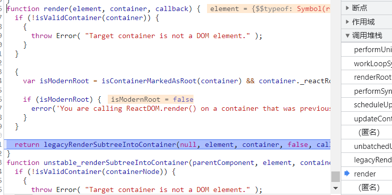
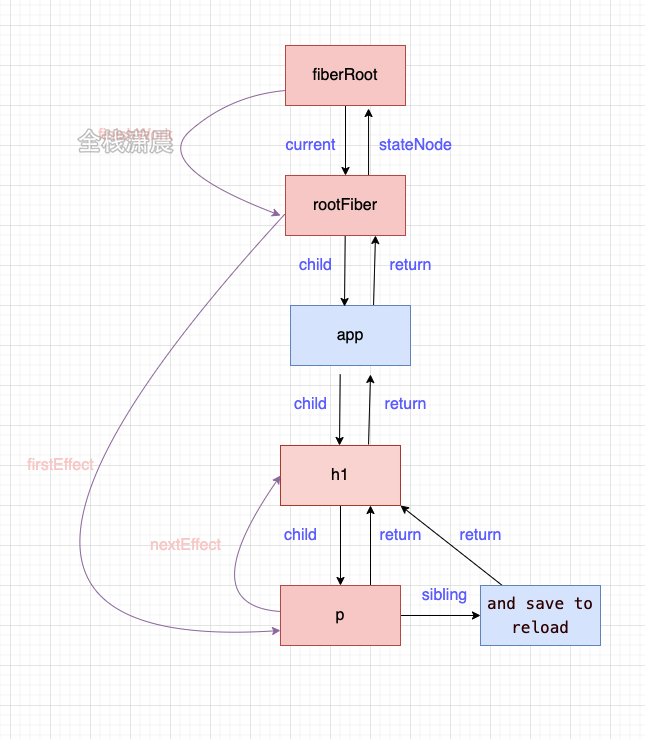

# React源码-2

## 源码调试

**react/index**

里边放了一些react的定义，


## 目录概括

源码中主要包括如下部分

- fixtures：为代码贡献者提供的测试React
- packages：主要部分，包含Scheduler，reconciler等
- scripts：react构建相关

下面来看下packages主要包含的模块

- react：核心Api如：React.createElement、React.Component都在这

- 和平台相关render相关的文件夹（渲染器）：

  react-art：如canvas svg的渲染

  react-dom：浏览器环境

  react-native-renderer：原生相关

  react-noop-renderer：调试或者fiber用

- 试验性的包

  react-server: ssr相关

  react-fetch: 请求相关

  react-interactions: 和事件如点击事件相关

  react-reconciler: 构建节点

- shared：包含公共方法和变量

- 辅助包：

  react-is : 判断类型

  react-client: 流相关

  react-fetch: 数据请求相关

react-refresh: 热加载相关

- scheduler：调度器相关
- React-reconciler：在render阶段用它来构建fiber节点

## 简单调试

### **准备**

打开文件`react-dom.development.js`。

首先，找到 function performUnitOfWork 断点。

> 在render阶段执行的方法，执行一个单元工作。
>
> 执行队列里的任务（nextFiber.next），高优先级的任务也可以随时中断。


然后，点击 render，在 render 和 performUnitOfWork 中间有很多函数。



### **步骤**

**render阶段**

render 中调用了 legacyRenderSubtreeIntoContainer ，它会创建我们的root节点。然后会处理 callback 回调。然后会以非批量更新的方式（unbatchedUpdates）更新updateContainer

> callback 是 `ReactDOM.render(<App />, rootEl)` 的第三个参数。


然后，updateContainer 中会获取过期时间

> `var eventTime = requestEventTime()`

然后处理优先级 lane

>  `var lane = requestUpdateLane(current$1)`


调用 scheduleUpdateOnFiber 


然后调用 performSyncWorkOnRoot ，因为是 legacy 模式，同步执行。


然后执行 workLoopSync 工作循环。调用工作单元。

> 当点击页面中的加号（+），渲染react 就会从这里开始。

performUnitOfWork 

> tag是3，说明是根节点工作单元。


performUnitOfWork 中，有比较重要的 beginWork 和 completeUnitOfWork

> 遍历 fiber树，**捕获**阶段发生在**beginWork**函数中，**冒泡**阶段发生在**completeWork**中。

**commit阶段**

进入到 commitRoot 中，查看root变量，可以看到 finishedWork 中的 fiber 树


然后调用了 runWithPriority 高优先级执行。

操作

当我们点击一下 p

```jsx | pure
const [count, setCount] = useState(0);
return (
  <>
    <h1
      onClick={() => {
        // debugger;
        setCount(() => count + 1);
      }}
    >
      <p title={count}>{count}</p> xiaochen
    </h1>
  </>
);
```

在数据 root -> finishedWork -> firstEffect（p标签）




## JSX

### virtual Dom是什么

virtual Dom 就是常说的 虚拟dom，

一句话概括就是，用**js对象**表示**dom信息和结构**，更新时重新渲染更新后的对象对应的dom，这个**对象**就是**React.createElement()的返回结果**。

virtual Dom是一种**编程方式**，它以**对象的形式**保存在**内存**中，它描述了我们dom的必要信息，并且用类似**react-dom等模块与真实dom同步**，这一过程也叫**协调**(reconciler)。这种方式可以声明式的渲染相应的ui状态，让我们从dom操作中解放出来，在react中是以**fiber树**的形式**存放组件树**的相关信息，在**更新**时可以**增量渲染相关dom**，所以**fiber也是virtual Dom实现的一部分**

### 为什么要用virtual Dom

大量的dom操作慢，很小的更新都有可能引起页面的**重新排列（重排重绘）**。

js对象优于在内存中，处理起来更快，可以通过**diff算法比较新老virtual Dom的差异**，并且**批量、异步、最小化**的执行**dom的变更**，以提高性能。

**另外就是可以跨平台**，**jsx --> ReactElement对象 --> 真实节点**，有**中间层**的存在，就可以在操作真实节点之前进行对应的**处理**，处理的结果反映到真实节点上，这个真实节点可以是浏览器环境，也可以是Native环境。

> fiber 和 virtual dom区别， fiber上边有过期时间、优先级、upData和upDataQueue

### virtual Dom真的快吗

其实virtual Dom只是在更新的时候快，在应用初始的时候不一定快（首次渲染需要构建会慢一些）


### jsx转义

通过babel可以转换成React.createElement()的语法糖，也是js语法的扩展。

这就是为什么jsx文件要声明`import React from 'react'`的原因（react17之后不用导入）


**React.createElement**

 `React.createElement`的源码中做了如下几件事

- 处理config，把除了保留属性外的其他config赋值给props
- 把children处理后赋值给props.children
- 处理defaultProps
- 调用ReactElement返回一个jsx对象(virtual-dom)

```jsx | pure
//ReactElement.js
export function createElement(type, config, children) {
  let propName;

  const props = {};

  let key = null;
  let ref = null;
  let self = null;
  let source = null;

  if (config != null) {
    //处理config，把除了保留属性外的其他config赋值给props
    //...
  }

  const childrenLength = arguments.length - 2;
  //把children处理后赋值给props.children
  //...

  //处理defaultProps
  //...

  return ReactElement(
    type,
    key,
    ref,
    self,
    source,
    ReactCurrentOwner.current,
    props,
  );
}

const ReactElement = function(type, key, ref, self, source, owner, props) {
  const element = {
    $$typeof: REACT_ELEMENT_TYPE,//表示是ReactElement类型

    type: type,//class或function
    key: key,//key
    ref: ref,//ref属性
    props: props,//props
    _owner: owner,
  };

  return element;
};
```

**component**

component函数中主要在当前实例上挂载了props、context、refs、updater等，所以在组件的实例上能拿到这些，而更新主要的承载结构就是updater， 主要关注isReactComponent，它用来表示这个组件是类组件

```jsx | pure
//ReactBaseClasses.js
function Component(props, context, updater) {
  this.props = props;//props属性
  this.context = context;//当前的context
  this.refs = emptyObject;//ref挂载的对象
  this.updater = updater || ReactNoopUpdateQueue;//更新的对像
}

Component.prototype.isReactComponent = {};//表示是classComponent
```

> PureComponent其实就是一个继承自Component的子类，会自动加载shouldComponentUpdate函数。当组件需要更新的时候，shouldComponentUpdate会对组件的props和state进行一次浅比较。如果props和state都没有发生变化，那么render方法也就不会触发，当然也就省去了之后的虚拟dom的生成和对比，在react性能方面得到了优化。
>
> https://blog.csdn.net/leelxp/article/details/108218088

## legacy和concurrent模式

react有3种模式进入主体函数的入口，我们可以从 react官方文档 [使用 Concurrent 模式（实验性）](https://zh-hans.reactjs.org/docs/concurrent-mode-adoption.html#feature-comparison)中对比三种模式：

- **legacy 模式：** `ReactDOM.render(<App />, rootNode)`。这是当前 React app 使用的方式。当前没有计划删除本模式，但是这个模式可能不支持这些新功能（比如lane）。

  > legacy 模式在**合成事件**中有自动的**批处理**功能，但仅限于一个浏览器任务，非react事件想使用这个功能必须使用 unstableb_batchedUpdates。
  >
  > 在 blocking 模式和 concurrent 模式下，所有的setState 在默认情况下都是批处理的。会在开发中发出警告。

- **blocking 模式：** `ReactDOM.createBlockingRoot(rootNode).render(<App />)`。目前正在实验中。作为迁移到 concurrent 模式的第一个步骤。

- **concurrent 模式：** `ReactDOM.createRoot(rootNode).render(<App />)`。目前在实验中，未来稳定之后，打算作为 React 的默认开发模式。这个模式开启了*所有的*新功能。


**legacy模式**是我们常用的，它**构建dom**的过程是**同步**的，所以在render的reconciler中，如果diff的过程特别耗时，那么导致的结果就是js一直**阻塞高优先级**的任务(例如用户的**点击事件**)，表现为页面的**卡顿**，**无法响应**。

**concurrent Mode**是react未来的模式，它用**时间片调度**实现了**异步可中断的任务**，根据**设备性能的不同**，**时间片的长度**也**不一样**，在每个时间片中，如果任务到了过期时间，就会**主动让出线程**给高优先级的任务。


### 主要流程


### **详细函数调用过程 - legacy模式**

打开文件`react-dom.development.js`。

主要任务是创建fiberRootNode和rootFiber，红色部分是创建Update，蓝色部分是调度render阶段的入口函数


#### **创建fiberRootNode节点**

首先进入render 中的 legacyRenderSubtreeIntoContainer 方法，如果没有 root 会调用 legacyCreateRootFromDOMContainer 创建 root 

在这里进入 createLegacyRoot 方法，然后调用  createRootImpl 方法，调用 createContainer 方法，然后调用  createFiberRoot 方法。

调用 FiberRootNode 方法创建 root fiber 节点。


在 createFiberRoot 中，root（图中FiberRootNode，是 FiberRootNode 类型）的current，指向 uninitializedFiber （图中rootFiber，是 FiberNode 类型）。

而 uninitializedFiber 的 stateNode 指向 root。


#### **创建fiber节点更新链表**

然后，调用 initializeUpdateQueue 方法。这个queue会挂在到 fiber.updateQueue 上（这里的fiber.tag 等于 3，所以是根 fiber 节点）。


至此，完成了上图左侧黄色标注的创建。


#### **upDateContainer挂在update**

在 legacyRenderSubtreeIntoContainer 中，创建完root节点。他会判断是否有第三个参数 callback。

然后，以非批量更新的形式 （unbatchedUpdates）更新，传入 updateContainer。


upDateContainer中会判断一些过期时间（eventTime），lane，context。

然后调用 createUpdate **创建**一个 **update 对象**


update 的 payload 中放入 element，这里的 element.type 就是 app 函数


然后调用 enqueueUpdate 把创建的 update 挂在到 fiber.updateQueue 上（fiber.updateQueue.pending = update，这里的 pending 指的就是未应用到正式节点上的更新）。


至此完成了红色表示的部分


#### 优先级

然后进入 scheduleUpdateOnFiber 方法。因为是 legacy 模式，所以获取到一个同步赛道（legacyUnbatchedContext 非批量更新的上下文）。

> scheduleUpdateOnFiber中会执行 lane === SyncLane，
>
> 然后执行 performSyncWorkOnRoot => renderRootSync => workLoopSync 然后执行了 performUnitOfWork 方法。
>
> 而在 concurrent 模式中，同样执行了scheduleUpdateOnFiber，然后执行完了 updateContainer 方法才执行了 performUnitOfWork 方法（因为异步执行了）。


然后调用 performSyncWorkOnRoot 方法。然后调用 commitRoot，然后进入 commit 阶段。

### 函数调用 - concurrent模式

首先调用 createRoot 方法，调用 reactDOMRoot 创建实例。

在这中，同 legacy 模式相同，也会调用 createRootImpl 方法（调用 createContainer 然后调用 createFiberRoot 如下图）


然后搜索 prototype.render ，他会调用 prototype.render 方法。在这里同样会调用 updateContainer 方法


然后调用 scheduleUpdateOnFiber ，不同的是在concurrent模式中，这个时候他是异步优先级，会走else中的逻辑。


然后他会调用 ensureRootIsScheduled 方法如下图


这个方法里，会判断是不是 sync 优先级和 batched 优先级。这里不是，会进入else中。


### **两种模式的不同点：**

1. createRootImpl 中传入的第二个参数不一样 一个是 LegacyRoot 一个是 ConcurrentRoot

   

2. requestUpdateLane 中获取的lane的优先级不同（legacy模式下是同步优先级，而concurrent模式下是异步优先级）

3. 在函数scheduleUpdateOnFiber中根据不同优先级进入不同分支，legacy模式进入performSyncWorkOnRoot，concurrent模式会异步调度performConcurrentWorkOnRoot（通过newCallbackPriority判断的三个分支）

