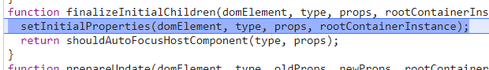
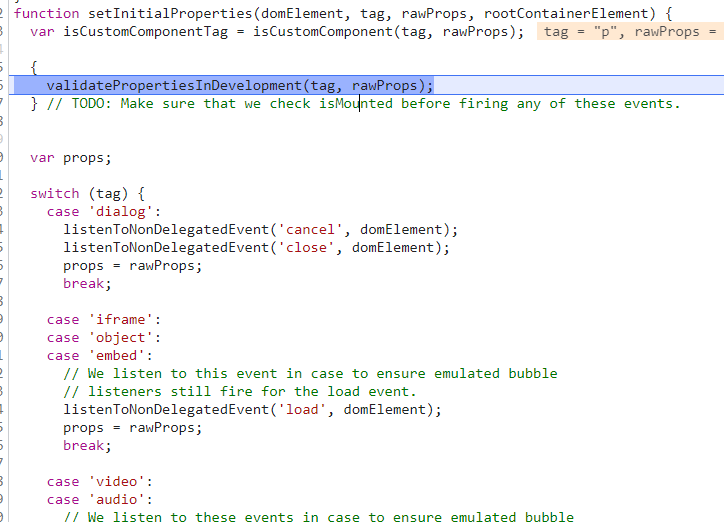
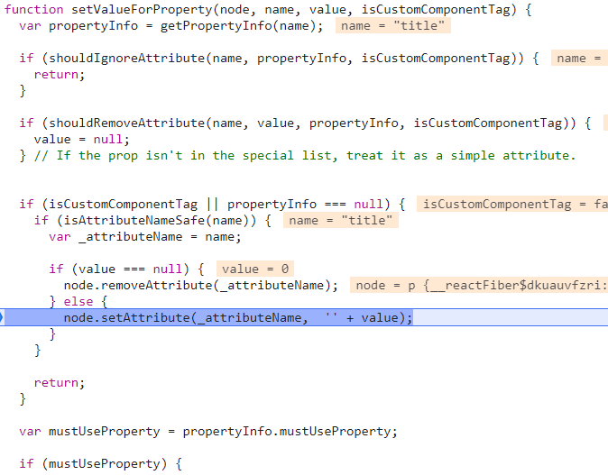
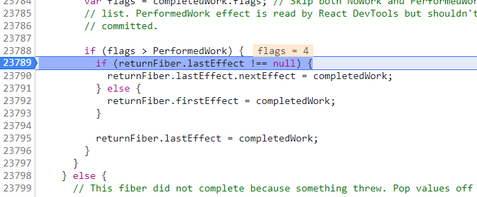
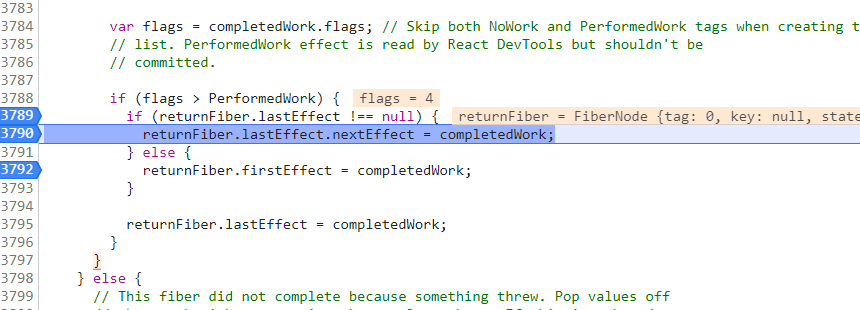

# React源码-3

## Fiber

**react15弊端**

**react15**在**render阶段**的**reconcile**是**不可打断**的，这会在进行**大量节点的reconcile**时可能产生**卡顿**。

> 因为浏览器所有的时间都交给了js执行，并且js的执行时单线程。

**react16优势**

为此**react16**之后就有了**scheduler**进行**时间片的调度**，给每个**task（工作单元）**一定的时间，如果在这个时间内没执行完，也要**交出执行权**给浏览器进行**绘制和重排**。所以异步可中断的更新需要一定的**数据结构**在**内存**中来保存工作单元的信息，这个数据结构就是**Fiber**。

### 作用

那么有了Fiber这种数据结构后，能完成哪些事情呢，

- **工作单元 任务分解** ：Fiber最重要的功能就是作为工作单元，保存原生节点或者组件节点对应信息（包括优先级），这些节点通过指针的形似形成Fiber树
- **增量渲染**：通过jsx对象和current Fiber的对比，生成最小的差异补丁，应用到真实节点上
- **根据优先级暂停、继续、排列优先级**：Fiber节点上保存了优先级，能通过不同节点优先级的对比，达到任务的暂停、继续、排列优先级等能力，也为上层实现批量更新、Suspense提供了基础
- **保存状态：**因为Fiber能保存状态和更新的信息，所以就能实现函数组件的状态更新，也就是hooks

### 结构

```jsx | pure
//ReactFiber.old.js
function FiberNode(
  tag: WorkTag,
  pendingProps: mixed,
  key: null | string,
  mode: TypeOfMode,
) {
  //作为静态的数据结构 保存节点的信息 
  this.tag = tag;//对应组件的类型
  this.key = key;//key属性
  this.elementType = null;//元素类型
  this.type = null;//func或者class或者字符串（来创建我们的组件）
  this.stateNode = null;//真实dom节点

  //作为fiber数架构 连接成fiber树
  this.return = null;//指向父节点
  this.child = null;//指向child（第一个子节点，注意这个设计器很精妙）
  this.sibling = null;//指向兄弟节点
  this.index = 0;

  this.ref = null;

  //用作为工作单元 来计算state
  this.pendingProps = pendingProps;
  this.memoizedProps = null;
  this.updateQueue = null; // 未计算的upData
  this.memoizedState = null; // 当前的状态
  this.dependencies = null; // 和context相关

  this.mode = mode;
    
	//effect相关
  this.effectTag = NoEffect;
  this.nextEffect = null;
  this.firstEffect = null;
  this.lastEffect = null;

  //优先级相关的属性
  this.lanes = NoLanes;
  this.childLanes = NoLanes; // 所有子节点的优先级

  //current和workInProgress的指针
  this.alternate = null;
}
```

> this.child的设计很精妙，他使用的是链表的结构，只需要记录一个儿子。这样简化了删除儿子节点，增加儿子节点的操作。除了第一个儿子节点无需关心父亲节点的属性。而父级节点遍历儿子只需要进行链表遍历就可以了。

### 调试

#### 节点遍历

现在我们知道了 Fiber 可以保存真实的 dom，真实 dom 对应在内存中的 Fiber 节点会形成 Fiber 树，这颗Fiber树在 react 中叫 current Fiber，也就是当前 dom 树对应的 Fiber 树，而正在构建 Fiber 树叫 workInProgress Fiber，这两颗树的节点通过 alternate 相连.


找到render阶段的起点 performUnitOfWork 方法，传入一个unitOfWork ，他就是fiber树上的节点。

然后调用 beginWork$1（beginWork）返回 next（下一个工作节点，上图2.beginWork）


当执行完beginWork，没有next 后，会执行 completeUnitOfWork


在这里拿到了 sibling。


这里是 p 标签的 sibling，不存在则执行 workInProgress = siblingFiber。

把 xiaochen 节点放到了执行工作单元连中，后面继续执行 beginWork 和 completeWork。


当然，如果兄弟节点（xiaochen）不存在，则会执行 completedWork = returnFiber （上图），把父节点（h1）放入工作单元执行父节点的comleteWork和beginWork。

#### **构建Fiber树调试（创建）**

下面找到两个函数 createWorkInProgress 、reconcileChildFibers 打上断点，和切换 current 指针的地方（root.current = finishedWork）打上断点。

首先执行到 createWorkInProgress 中


这里的 curret 就是我们的 rootFiber，这里判断 alternate 是否存在，如果不存在则创建一个新fiber 赋值上去。


这个时候会执行 reconcileChildFibers 方法，这里的 returnFiber 是 rootFiber 而 currentFirstChild 为 null ，因为目前还没有创建fiber树。

然后执行了 reconcileSingleElement 方法。


然后在 reconcileSingleElement 中，创建（createFiberFromElement方法）了上图右侧的 appFiber 节点，而return 指向 rootFiber。


点击右侧调用栈，执行 reconcileChildren 方法。看到 rootFiber.child 指向了 app 节点。


然后第二次再进入 reconcileChildFibers 方法时，returnFiber 则就是 app 然后创建 h1


所有节点创建完毕后，在 commitRootImpl 方法中，会执行 root.current = finishedWork 切换 fiber 树的指向。最后如下图。


#### **构建Fiber树调试（更新）**

基本同上，在 reconcileChildFibers 这里的 alternate 是存在的。这里会进入 else 的逻辑。


这里都是赋值的操作，把右侧的 rootFiber 数据赋值到左边。


然后会第二次先进入 createWorkInProgress ，这里的 current 是 app 因为左侧没有，会走创建逻辑，执行 reconcileChildFibers 方法创建 app 节点。

最终创建完成左边的树


然后节点执行指向左边，执行root.current = finishedWork。

## Render阶段

### render阶段的入口

render阶段的主要工作是构建Fiber树和生成effectList。

在第5章中我们知道了react入口的两种模式会进入performSyncWorkOnRoot或者performConcurrentWorkOnRoot，而这两个方法分别会调用workLoopSync或者workLoopConcurrent。

> 在 updateContainer => scheduleUpdateOnFiber 中 if (lane === SyncLane) 进行判断。
>
> 走 performSyncWorkOnRoot 方法
>
> 或者走 ensureRootIsScheduled => performConcurrentWorkOnRoot 方法。
>
> 这些发生在节点创建完毕后（update挂在和优先级后）

在 legacy 模式中，调用 workLoopSync 方法，他没有 shouldYield 不可中断当前任务。*

而在 concurrent 模式中，调用 workLoopConcurrent 方法，他有 shouldYield 可以中断当前任务。*

```jsx | pure
//ReactFiberWorkLoop.old.js
function workLoopSync() {
  while (workInProgress !== null) {
    performUnitOfWork(workInProgress);
  }
}

function workLoopConcurrent() {
  while (workInProgress !== null && !shouldYield()) {
    performUnitOfWork(workInProgress);
  }
}
```

> 这两函数的区别是判断条件是否存在shouldYield的执行，如果浏览器没有足够的时间，那么会终止while循环，也不会执行后面的performUnitOfWork函数，自然也不会执行后面的render阶段和commit阶段，这部分属于scheduler的知识点

- workInProgress：新创建的workInProgress fiber

- performUnitOfWork：workInProgress fiber和会和已经创建的Fiber连接起来形成Fiber树。* 这个过程类似**深度优先遍历**，我们暂且称它们为‘捕获阶段’和‘冒泡阶段’。* 

  伪代码执行的过程大概如下：
  
  ```jsx | pure
  function performUnitOfWork(fiber) {
    if (fiber.child) { // 先判断子节点存不存在，存在遍历子节点*
      performUnitOfWork(fiber.child);//beginWork
    }
    
    if (fiber.sibling) { // 如果没有子节点，会遍历兄弟节点*
      performUnitOfWork(fiber.sibling);//completeWork
    }
  }
  ```

#### **知识点1：副作用运算**

在 fiber 节点上会有副作用。*

这些副作用所在位置（react-reconciler/ReactFiberFlages），他们都是二进制的


用二进制表示这些副作用，因为运算方便，例如下例

> placement 插入；update 更新。


#### **知识点2：在 mount 构建 fiber 树**

在 fiber 树构建好后，需要把树插入到 rootfiber 上。*

加下来，在 reconcileChildFibers 中，会构建应用的fiber树，找到 placeSingleChild 方法。

这里有判断条件 **shouldTrackSideEffects** 是否需要**执行副作用**，和 **newFiber.alternate === null** 判断是否**在 mount 阶段**（首次渲染）。*

首次渲染，只需要追踪应用 fiber 树的根节点（app），只有他需要插入到 rootfiber 上。*

> 这里的 newFiber 是 app 他会在 flags 标记上 placement 标识（标识插入）


流程图


注意的是 beginWork 和 completeWork 都是以 performUnitOfWork 为起点。

### 首先看 beginWork

捕获阶段 从根节点rootFiber开始，遍历到叶子节点，每次遍历到的节点都会执行beginWork，并且传入当前Fiber节点，然后创建或复用它的子Fiber节点，并赋值给workInProgress.child。*

#### mount

判断 current 是否是 null，如果 currentFiber 没有，说明是首次渲染进入 mount 阶段；而如果有值，说明已经渲染过了，会进入 update 阶段。*

首先看 beginWork 右侧图。


根据 workProgress.tag 进入不同 Fiber 创建函数。*

如果是 update 阶段，走 **reconcileChildFibers** 逻辑，这里会**执行副作用**，而 diff 算法则发生在这个函数中；而如果是 mount 走 **mountChildFibers** 逻辑 ，这里**不带副作用**。*

reconcileChildFibers 和 mountChildFibers 都是由 **childReconciler** 传入 true 和 false 生成的。*

> 找到 react-reconciler\src\ReactChildFiber.old.js 文件，reconcileChildFibers 和 mountChildFibers 都是由 childReconciler 传入 true 和 false 生成的。


在 childReconciler 中，会去判断这个传入值（是否是 mount 阶段），如果是 false 则直接 return。


当为 true 时，副作用执行，例如执行删除或者插入。

删除时，会标识 flags |= ChildDeletion。


插入时，也会标识 flags |= Placement。


#### update

首先看能不能复用，如果不能，则去执行 reconcileChildFibers 。如果可以复用，则执行 bailoutOnAlreadyFinishedWork ，这个函数中会判断是否需要更新，不需要直接reaturn。需要更新则 clone 子节点。*


#### **多节点调试**

找到 beginWork 函数打上断点，执行到 workInProgress 为 h1。因为是首次渲染，所以 current 为 null。


然后他会执行 else 中的逻辑，在 mount 中会执行 didReceiveUpdate = false 因为不会更新。

下面讲进入流程图这个位置：


然后他会根据 workInProgress.tag 不同进入不同分支，当前的为 5。

> workInProgress.tag 记录的是节点 work 类型，例如 ClassComponent 组件，他的 tag 就是 ClassComponent 则执行 updateClassComponent、finishClassComponent函数。


然后进入 upDateHostComponent 函数，这里注意的是 isDirectTextChild 判断当前节点是不是有唯一的文本子节点，如果是则跳过 beginWork 和 complateWork。这里不是


然后走到 reconcileChildren 函数


进入到这个函数，当前 current === null。


进入 mountChildFibers 函数，注意这里的 mountChildFibers 是 childReconciler 返回值。


最终执行 mountChildFibers 函数，执行到了 childReconciler 中的 reconcileChildFibers 中。


这个时候判断 h1 下边有 p 和 xiaochen 两个元素，会走到 isArray 这个分支中 ，这里的 reconcileChildrenArray 方法，就是**多节点**的 diff 算法。


#### 单节点调试节点创建

如果是**单节点**（代码里删除 xiaochen 字符串节点），我们调试一下。

同多节点相同，先进入 beginWork 然后走到 updateHostComponent 函数，会赋值一些变量。


然后到 reconcileChildren => mountChildFibers ，这里的 $$typeof 就是 element。


这里执行 reconcileSingleElement方法，这里有一个while循环会先跳过。然后执行 createFiberFromElement。


然后会执行到 createFiberFromTypeAndProps 方法。


在 createFiberFromTypeAndProps 中会创建一个 fiber 然后返回出去


返回出去在 reconcileSingleElement 则创建了一个 p 元素，然后 p 节点的 return 指向 h1，完成了**子节点创建过程**。


#### beginWork更新过程调试

在 beginWork 中打上断点，然后看到进入函数时 workInprogress 是 tag 为3的根节点。


然后会判断 current ，这个时候是有值的，因为是更新时。

然后判断是否复用四个条件： 

oldProps !== newProps

hasContextChanged() （这个方法判断上下文改变）， 

workInProgress.type !== current.type ，

!includesSomeLane(renderLanes, updateLanes)（判断当前fiber的优先级）

这里走到是否复用位置


当前判断可以复用，执行 bailoutOnAlreadyFinishedWork 方法。判断子节点的优先级（!includesSomeLane(renderLanes, workInProgress.childLanes)）。

这里是走else逻辑，clone一个新的子节点。


### completeWork

冒泡阶段 在捕获阶段遍历到子节点之后，会执行completeWork方法，执行完成之后会判断此节点的兄弟节点存不存在，如果存在就会为兄弟节点执行completeWork，当全部兄弟节点执行完之后，会向上‘冒泡’到父节点执行completeWork，直到rootFiber。


#### 创建阶段调试

##### **首先执行到 p 节点**

找到 completeWork 打断点，首次进入 workInProgress 是p节点。


然后进入 case HostComponent，这里 current 是 null，因为首次渲染；然后 workInProgress.stateNode 也是 null，因为节点还没有创建真实dom。


后边会调用 createInstance 函数（上图右侧位置），在这函数中，调用了 createElement 。


在 createElement 中，他会拿到当前的 document（ownerDocument）。

然后调用到 ownerDocument.createElement(type) 


然后返回出去到 createInstance 中，updateFiberProps （上代码图）会这是 fiber 上的 props。


然后返回出去 domElement 节点到 completeWork 中，这个时候拿到了生成了 instance。


后边紧接着调用了 appendAllChildren 方法。当前 workInProgress.child（p节点的子节点）为 null。会跳过这个函数。


然后到 completeWork 中，执行 workInProgress.stateNode = instance 把 instance（dom元素）赋值到 stateNode 中。

然后执行了 finalizeInitialChildren => setInitialProperties



在 setInitialProperties 中他会处理一些 dialog、iframe等。



然后调用到了 setInitialDOMProperties 方法。


然后调用了 setValueForProperty 方法，这里的 node 是 p 的真实 dom 元素。



##### **然后执行到 H1 节点**

同样从 completeWork 方法进入，然后执行到 appendAllChildren 方法。


appendAllChildren 中，workInProgress.child 不是 null 了。

他会进入 while 循环，调用 appendInitialChild 方法。


然后 appendInitialChild 调用了原生 dom 节点的 appendChild 方法。

着一些也就是 component mount做的事情。


#### 更新阶段的调试

首先同样进入 completeWork 方法，然后走到 case HostComponent 逻辑。

这个时候 current 和 workInProgress.stateNode 都是存在的，其中 workInProgress.stateNode 是 p 节点真实 dom，current 是 p 的 fiberNode。


然后 进入 updateHostComponent$1 函数。这时会比较一下新旧 props，然后拿到 stateNode。最重要的是调用了 prepareUpdate 函数。


在 prepareUpdate 中，会调用 diffProperties，对比属性的变化。


在 diffProperties 会处理 input 和 textarea。


然后执行到下边的 for 循环。

这里对比 nextProps 存在和 lastProps 不存在，代表是新增，则 continue 了。而 Continue 下边的代码就是处理删除的情况。


上面 for 循环遍历的是 lastProps ，下边的 for 循环则是遍历 nextProps 。

根据判定条件 !nextProps.hasOwnProperty(propKey) || nextProp === lastProp || nextProp == null && lastProp == null 说明当前是删除情况则直接 continue 了。

下边逻辑则是处理节点新增和修改。


然后走一下这两个 for 循环看一下，首先第一个 for 都 continue 了，然后在第二个 for 循环中，这时会执行到一个 push 操作，如果 updatePayload 为空则创建一个空数组 push  propKey 和 nextProp


第二次循环第二个循环，会进入 propKey === CHILDREN 逻辑，这是上次已经push 过的 updatepayload 会被继续 push 新的值。


最终形成的 updatepayload 是这个样子


然后在 updateHostComponent$1 函数里，把 updatePayload 赋值到 updateQueue 上。


#### 形成 effectlist 链表

首先找到 completeUnitOfWork 函数，这里有一个 do while 循环，其while 的判定条件是 completedWork != null 。


**第一次循环**

然后走 do 里边逻辑，判定 (completedWork.flags & Incomplete) === NoFlags 说明当前节点上有副作用，并且没有结束。然后没有错误情况下执行了 completeWork。


下边操作了 firstEffect 和 lastEffect，这里就是生成 effect 的代码。


重点打上断点，观察更新操作，点击网页中的 0 进行更新操作。这时 completedWork 是 p，returnFiber（H1 节点）的 firstEffect 指向 completedWork.firstEffect。

然后判断 flags > PerformedWork ，然后走了 else 逻辑，returnFiber.firstEffect = completedWork（h1 的 firstEffect 指向了 p）

然后执行力 returnFiber.lastEffect = completedWork（h1 的 lastEffect 指向了 p）



然后拿到 completedWork.sibling 是 null，然后进入下次循环。


**第二次循环**

completedWork 为h1，returnFiber 变为 app。

然后执行 returnFiber.lastEffect = completedWork.lastEffect 赋值，与上次不同，这次 completedWork.lastEffect 已经赋值为 p 的 fiber节点。


然后判断 flags > PerformedWork 判断 returnFiber.lastEffect !== null。执行了 returnFiber.lastEffect.nextEffect = completedWork（p 的 nextEffect 指向了 h1）。

然后执行 returnFiber.lastEffect = completedWork ，又把 app 的 lastEffect 指向了 h1。



**总结**

则合理需要考虑的是，p 使用了 count 有副作用，而 h1 onCick 赋值的是匿名函数，也有副作用。

```jsx | pure
function App() {
  
  const [count, setCount] = useState(0);
  
  return (
    
   	 <>
      <h1
        onClick={() => {
          setCount(() => count + 1);
        }}
      >
        <p title={count}>{count}</p> xiaochen
      </h1>
    </>
  )
  
}
```

rootFiber同理进行第三次循环，最终形成示意图


首先从循环进入 p  ，他把 returnFiber（h1）的 first 和 last 都指向自己。

然后循环进入 h1，他把 returnFiber （app）的 first 和 last 都指向自己的 first（p）。然后调整 p 的 next 指向自己。调整 returnFiber（app） 的 last 指向 h1。

后边循环进入 app，他把 returnFiber（rootFiber ）的 lastEffect 指向 h1，frstEffect 指向 p。
