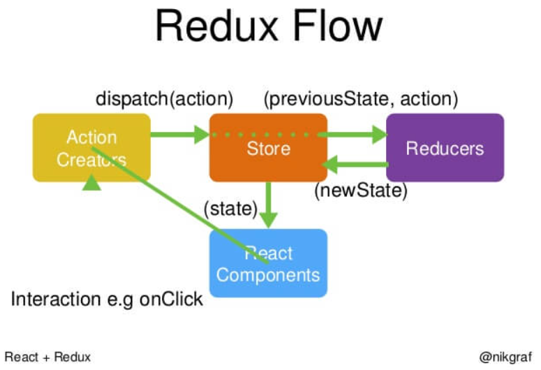

# Redux-基础


## 核心概念

### Store 

Store 就是保存数据的地方，你可以把它看成一个容器。整个应用只能有一个 Store。

### State

Store对象包含所有数据。如果想得到某个时点的数据，就要对 Store 生成快照。这种时点的数据集合，就叫做 State。

### Action

State 的变化，会导致 View 的变化。但是，用户接触不到 State，只能接触到 View。所以，State 的变化必须是 View 导致的。Action 就是 View 发出的通知，表示 State 应该要发生变化了。

> 也可以封装成函数 Action Creator

```javascript
function addTodo(text) {
  return {
    type: ADD_TODO,
    text
  }
}

const action = addTodo('Learn Redux');
```

### store.dispatch()

store.dispatch() 是 View 发出 Action 的唯一方法。

```javascript
store.dispatch({
  type: 'ADD_TODO',
  payload: 'Learn Redux'
});
```

### Reducer

Store 收到 Action 以后，必须给出一个新的 State，这样 View 才会发生变化。这种 State 的计算过程就叫做 Reducer。

```javascript
export default (state = initState, action) => {
    const {userList,……} = action;
    switch (action.type) {
        case ActionTypes.ADDUSERLIST:
            return {
                ...state, 
                userList: state.userList.concat(userItem)
            };
        default:
            return state
    }
}
```

### store.subscribe()

Store 允许使用`store.subscribe`方法设置监听函数，一旦 State 发生变化，就自动执行这个函数。

```javascript
import { createStore } from 'redux';
const store = createStore(reducer);
store.subscribe(listener);
```

## 工作流程

Redux 的工作流程，做一个梳理。



1. 首先，用户发出 Action。store.dispatch(action);

2. 然后，Store 自动调用 Reducer，并且传入两个参数：当前 State 和收到的 Action。 Reducer 会返回新的 State 。

3. State 一旦有变化，Store 就会调用监听函数。

```javascript
 // 设置监听函数
 store.subscribe(listener);
```

4. `listener`可以通过`store.getState()`得到当前状态。如果使用的是 React，这时可以触发重新渲染 View。

```javascript
 function listerner() {
   let newState = store.getState();
   component.setState(newState);   
 }
```


## react-redux

数据注入，本质使用高阶组件，主要使用connect函数，使得组件与redux建立关系

```react
import * as actionCreators from './actionCreators'
import { bindActionCreators } from 'redux'

function mapStateToProps(state,ownProps) {//注入属性 
    //(方法接受store的state,和父级组件props数据。)
  return { todos: state.todos }
}

function mapDispatchToProps(dispatch,ownProps) {//dispatch触发action，父级props数据
  return {
      falseSubmit() {
          dispatch(Actions.submit_verification('false'));
     },
  }
}

export default connect(
  mapStateToProps,
  mapDispatchToProps
)(TodoApp)
```

组件内使用属性和方法，都需要使用 this.props .

```react
onChange={this.props.secondGpaChange.bind(this)} //方法
this.props.submit_verification //属性
```


## 简单实现计数器 [ 案例 ]

```javascript
const Counter = ({ value }) => (
  <h1>{value}</h1>
);

const render = () => {
  ReactDOM.render(
    <Counter value={store.getState()}/>,
    document.getElementById('root')
  );
};

store.subscribe(render);
render();
```

上面是一个简单的计数器，唯一的作用就是把参数`value`的值，显示在网页上。Store 的监听函数设置为`render`，每次 State 的变化都会导致网页重新渲染。

下面加入一点变化，为`Counter`添加递增和递减的 Action。

```javascript
const Counter = ({ value, onIncrement, onDecrement }) => (
  <div>
  <h1>{value}</h1>
  <button onClick={onIncrement}>+</button>
  <button onClick={onDecrement}>-</button>
  </div>
);

const reducer = (state = 0, action) => {
  switch (action.type) {
    case 'INCREMENT': return state + 1;
    case 'DECREMENT': return state - 1;
    default: return state;
  }
};

const store = createStore(reducer);

const render = () => {
  ReactDOM.render(
    <Counter
      value={store.getState()}
      onIncrement={() => store.dispatch({type: 'INCREMENT'})}
      onDecrement={() => store.dispatch({type: 'DECREMENT'})}
    />,
    document.getElementById('root')
  );
};

render();
store.subscribe(render);
```

## 表单增减 [案例]

Reducer.js

接受 Action 生成新的 state

```js
import * as ActionTypes from './ActionTypes.js';

let editState = function (list, caption, data) {
    return list.map(item => item.caption === caption ? data : item)
}
let delList = function(list,caption){
    if(caption === 'null')
        return list.filter((_,i,arr) => i !== arr.length-1)
    return list.filter(item => item.caption !== caption)
}
export default (state, action) => {
    const {caption, dataObj = null, verObj = null,ver=null} = action;
    switch (action.type) {
        case ActionTypes.DATA:
            return {...state, list: editState(state.list, caption, dataObj)};
        case ActionTypes.VER:
            return {...state, vers: editState(state.vers, caption, verObj)};
        case ActionTypes.ADDLIST:
            return {...state,list:state.list.concat([dataObj]),vers:state.vers.concat([verObj])};
        case ActionTypes.DELLIST:
            return {...state,vers: delList(state.vers, caption),list: delList(state.list, caption)};
        case ActionTypes.SUBMIT_VERIFICATION:
            return {...state,submit_verification:ver};
        default:
            return state
    }
}
```

Stors.js

创建 Stors

```js
import {createStore} from 'redux';
import reducer from './Reducer.js';

const initValues = {
    'list': [],
    'vers': [],
    'submit_verification':'null' //null 未校验 true 成功 false 失败 await 需要校验
};

const store = createStore(
    reducer,
    initValues,
    window.__REDUX_DEVTOOLS_EXTENSION__ && window.__REDUX_DEVTOOLS_EXTENSION__());
export default store;

```

Action.js

写成 Action Creator 用与发送 Action

```js
import * as ActionTypes from './ActionTypes.js';

export const editData = (caption,dataObj) => {
    return {
        type: ActionTypes.DATA,
        dataObj: dataObj,
        caption:caption
    };
};
export const editVerification = (caption,verObj) => {
    return {
        type: ActionTypes.VER,
        verObj: verObj,
        caption:caption
    };
};
export const addList = () => {
    let key = Date.now().toString()
    return {
       ……
    };
};
export const delList = (caption='null') => {
    return {
        type: ActionTypes.DELLIST,
        caption:caption
    };
};

export const submit_verification = (ver) => {
    return {
        type: ActionTypes.SUBMIT_VERIFICATION,
        ver:ver
    };
};
```

ActionTypes.js

```js
export const DATA = 'DATA'
export const VER = 'VER'

export const ADDLIST = 'ADDLIST'
export const DELLIST = 'DELLIST'

export const SUBMIT_VERIFICATION = 'SUBMIT_VERIFICATION'
```

App.js

父级组件

```react
import React, {Component} from 'react';
import '../assets/css/App.css';
import Education from '../componens/education.js'
import * as Actions from '../Actions.js';
import {connect} from 'react-redux';

import store from '../Store.js'

class App extends Component {
    constructor(props) {
        super(props)
    }

    componentDidMount = () => {
        this.props.addFn()
    }

    render() {
        const {list} = this.props
        return (
            <main className="container">
                <section>
                    {
                        list.map((item) => {
                            return (
                                <Education caption={item.caption} key={item.caption}/>
                            )
                        })
                    }
                </section>
                <section className="btn-list">
                    <a href="javascript:;" onClick={this.props.addFn}>
                        <div>+ 添加教育经历</div>
                    </a>
                    <div className="sum">
                        <button className="submit" onClick={this.props.submitFn}>保存并提交</button>
                        <button className="cancel" onClick={this.props.delFn}>删除</button>
                    </div>
                </section>
            </main>
        )
    }
}

function mapStateToProps(state) {
    return {
        list: state.list,
        vers: state.vers
    }
}

function mapDispatchToProps(dispatch) {
    return {
        addFn: () => {
            dispatch(Actions.addList());
        },
        delFn: () => {
            dispatch(Actions.delList());
        },
        submitFn: () => {
            dispatch(Actions.submit_verification('await'));
            setTimeout(() => {
                let state = store.getState()
                if (store.getState().submit_verification === 'await') { //校验成功
                    dispatch(Actions.submit_verification('true'));
                    alert('数据保持成功，请看控制台的数据打印！')
                    console.log('—————拿到数据为—————')
                    console.log(state.list)
                    console.log('————————END————————')
                } else {
                    alert('您还有没有填好的字段，请根据提示填写完毕！')
                }
            })
        }
    }
}

export default connect(mapStateToProps, mapDispatchToProps)(App);

```

index.html

“爷爷”组件

```react
import React from 'react';
import ReactDOM from 'react-dom';
import {Provider} from 'react-redux';
import './assets/css/index.css';

import App from './componens/App.js';
import store from './Store.js';

// import './index.css';

ReactDOM.render(
  <Provider store={store}>
    <App/>
  </Provider>,
  document.getElementById('root')
);

```

## 备注

> React.PureComponent。新旧对象的比较，只是浅比较。
>
> Object.assign({},state,{})。用于复制对象，根据以前对象复制新对象(浅拷贝)
>
> JSON.parse(JSON.stringify(obj))。用于复制对象（深拷贝）
>
> arr.concat(arr2)。用于合并数组


参考文档：[Redux 入门教程（一）：基本用法——阮一峰](http://www.ruanyifeng.com/blog/2016/09/redux_tutorial_part_one_basic_usages.html)