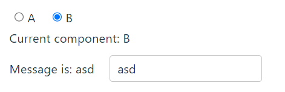

# KeepAlive组件缓存

`<KeepAlive>` 是一个内置组件，它的功能是在多个组件间动态切换时缓存被移除的组件实例。

## 基本使用

默认情况下，一个组件实例在被替换掉后（使用`:is`）会被销毁。这会导致它丢失其中所有已变化的状态

```html
<!-- 非活跃的组件将会被缓存！ -->
<KeepAlive>
  <component :is="activeComponent" />
</KeepAlive>
```

现在，在组件切换时状态也能被保留了



## [包含/排除](https://cn.vuejs.org/guide/built-ins/keep-alive.html#include-exclude)

`<KeepAlive>` 默认会缓存内部的所有组件实例，但我们可以通过 **`include`（包含） 和 `exclude`（排除）** 来定制该行为。

可以是一个以英文逗号分隔的字符串、一个正则表达式，或是包含这两种类型的一个数组：

```html
<!-- 以英文逗号分隔的字符串 -->
<KeepAlive include="a,b">
  <component :is="view" />
</KeepAlive>

<!-- 正则表达式 (需使用 `v-bind`) -->
<KeepAlive :include="/a|b/">
  <component :is="view" />
</KeepAlive>

<!-- 数组 (需使用 `v-bind`) -->
<KeepAlive :include="['a', 'b']">
  <component :is="view" />
</KeepAlive>
```

它会根据**组件的 [`name`](https://cn.vuejs.org/api/options-misc.html#name) 选项（子组件的name）**进行匹配，所以组件如果想要条件性地被 `KeepAlive` 缓存，就必须显式声明一个 `name` 选项。

## 最大缓存实例数

我们可以通过传入 `max` 来限制可被缓存的最大组件实例数。

`<KeepAlive>` 的行为在指定了 `max` 后类似一个 [LRU 缓存](https://en.wikipedia.org/wiki/Cache_replacement_policies#Least_recently_used_(LRU))：如果缓存的实例数量即将超过指定的那个最大数量，则**最久没有被访问**的缓存实例将**被销毁**，以便为新的实例腾出空间。

```html
<KeepAlive :max="10">
  <component :is="activeComponent" />
</KeepAlive>
```

## 缓存实例的生命周期

当一个组件实例从 DOM 上移除但因为被 `<KeepAlive>` 缓存而仍作为组件树的一部分时，它将变为**不活跃**状态而不是被卸载。当一个组件实例作为缓存树的一部分插入到 DOM 中时，它将重新**被激活**。

一个持续存在的组件可以通过 [`onActivated()`](https://cn.vuejs.org/api/composition-api-lifecycle.html#onactivated) 和 [`onDeactivated()`](https://cn.vuejs.org/api/composition-api-lifecycle.html#ondeactivated) 注册相应的两个状态的生命周期钩子：

```html
<script setup>
import { onActivated, onDeactivated } from 'vue'

onActivated(() => {
  // 调用时机为首次挂载
  // 以及每次从缓存中被重新插入时
})

onDeactivated(() => {
  // 在从 DOM 上移除、进入缓存
  // 以及组件卸载时调用
})
</script>
```
