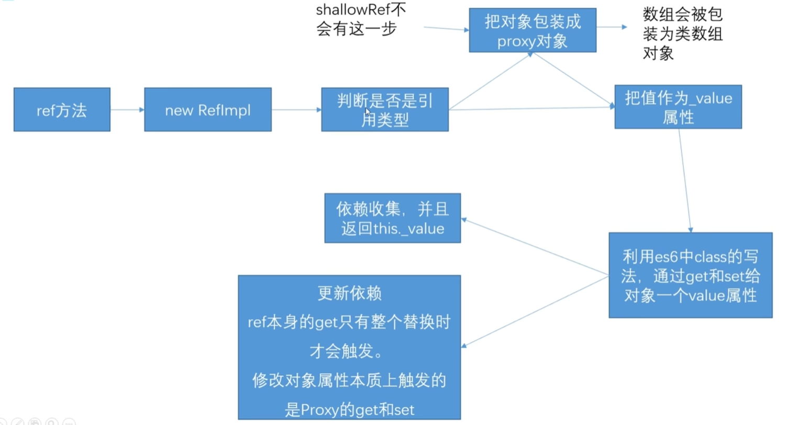
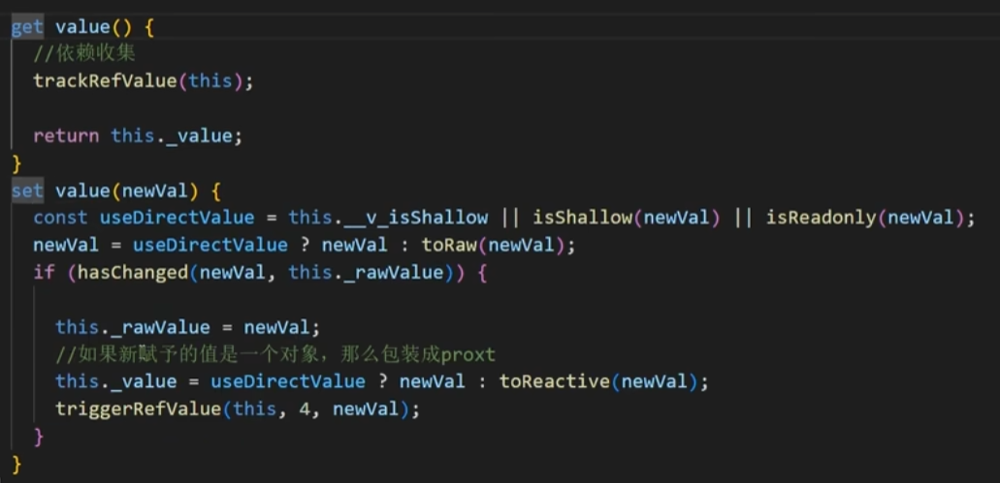

# vue基础

## ref

在组合式 API 中，推荐使用 [`ref()`](https://cn.vuejs.org/api/reactivity-core.html#ref) 函数来声明**响应式状态**，`ref()` 接收参数，并将其包裹在一个带有 `.value` 属性的 ref 对象中返回：

```js
const count = ref(0)

console.log(count) // { value: 0 }
console.log(count.value) // 0

count.value++
console.log(count.value) // 1
```

在**模板中**使用 ref 时，我们**不**需要附加 `.value`，你也可以直接在事件监听器中改变一个 ref：

```jsx | pure
<button @click="count++">
  {{ count }}
</button>
```

### 为什么要使用 ref？

**ref变化，更新 DOM**。基于**依赖追踪的响应式系统**实现的。当一个组件首次渲染时，Vue 会**追踪**在渲染过程中使用的每一个 ref。然后，当一个 ref 被修改时，它会**触发**追踪它的组件的一次重新渲染（相应地更新 DOM）。

这个过程里，是ref通过 getter 和 setter 方法来拦截对象属性的 get 和 set 操作。Vue 在它的 getter 中执行追踪，在它的 setter 中执行触发。

### [深层响应性](https://cn.vuejs.org/guide/essentials/reactivity-fundamentals.html#deep-reactivity)

Ref 可以持有任何类型的值，包括**深层嵌套的对象、数组**或者 JavaScript 内置的数据结构，比如 `Map`。

Ref 会使它的值具有深层响应性。这意味着即使改变嵌套对象或数组时，变化也会**被检测**到：

```js
import { ref } from 'vue'

const obj = ref({
  nested: { count: 0 },
  arr: ['foo', 'bar']
})

function mutateDeeply() {
  // 以下都会按照期望工作
  obj.value.nested.count++
  obj.value.arr.push('baz')
}
```

非原始值（例如对象）将通过 [`reactive()`](https://cn.vuejs.org/guide/essentials/reactivity-fundamentals.html#reactive) 转换为响应式代理（下边源码解析）。

### DOM 更新时机

修改了响应式状态时，Vue 会在“**next tick**”更新周期中缓冲所有状态的修改，以确保不管你进行了多少次状态修改，每个组件都**只会被更新一次**。

要等待 DOM 更新完成后再执行额外的代码，可以使用 [nextTick()](https://cn.vuejs.org/api/general.html#nexttick) 全局 API：

```js
import { nextTick } from 'vue'

async function increment() {
  count.value++
  await nextTick()
  // 现在 DOM 已经更新了
}
```

### 源码解析



**ref 创建时**，会先判断是否是**基础变量**，或者是**引用变量**（例如对象、数组）。他们都会把值放入 _value 中做存储。

**基础变量**，会直接**使用 ES6 class setter  做赋值**。然后触发使用更新。

**引用变量**时，会在 setter 方法中执行 toReactive 方法，把引用变量**重新用 reactive 创建**。



最后注意的是，如果**使用的 shallowRef** 。则不管变量是否是引用变量，**都不会用 reactive 创建**，也就**没有深层响应**的能力了。 

## `reactive()`

另一种声明响应式状态的方式，即使用 `reactive()` API。

`reactive()` 将使**对象本身**具有**响应性**：

```js
import { reactive } from 'vue'

const state = reactive({ count: 0 })
```

在模板中使用：

```jsx | pure
<button @click="state.count++">
  {{ state.count }}
</button>
```

`reactive()` 将深层地转换对象：当访问嵌套对象时，它们也会被 `reactive()` 包装。当 ref 的值是一个对象时，**`ref()` 也会在内部调用它。**

与浅层 ref（shallowRef） 类似，这里也有一个 [`shallowReactive()`](https://cn.vuejs.org/api/reactivity-advanced.html#shallowreactive) API 可以选择退出深层响应性。

### 代理对象与原始对象

Reactive Proxy vs. Original

`reactive()` 返回的是一个原始对象的 [Proxy](https://developer.mozilla.org/en-US/docs/Web/JavaScript/Reference/Global_Objects/Proxy)，它和原始对象是不相等的：

```js
const raw = {}
const proxy = reactive(raw)

// 代理对象和原始对象不是全等的
console.log(proxy === raw) // false
```

### `reactive()` 的局限性

`reactive()` API 有一些局限性：

**有限的值类型**：它只能用于**对象类型** (对象、数组和如 `Map`、`Set` 这样的[集合类型](https://developer.mozilla.org/en-US/docs/Web/JavaScript/Reference/Global_Objects#keyed_collections))。它**不能**持有如 `string`、`number` 或 `boolean` 这样的[原始类型](https://developer.mozilla.org/en-US/docs/Glossary/Primitive)。

**不能替换整个对象**：由于 Vue 的响应式跟踪是通过属性访问实现的，因此我们必须始终保持对响应式对象的相同引用。这意味着我们不能轻易地“替换”响应式对象，因为这样的话与第一个引用的响应性连接将丢失：

```js
let state = reactive({ count: 0 })

// 上面的 ({ count: 0 }) 引用将不再被追踪
// (响应性连接已丢失！)
state = reactive({ count: 1 })
```

**对解构操作不友好**：当我们将响应式对象的原始类型属性解构为本地变量时，或者将该属性传递给函数时，我们将丢失响应性连接：

```js
const state = reactive({ count: 0 })

// 当解构时，count 已经与 state.count 断开连接
let { count } = state
// 不会影响原始的 state
count++

// 该函数接收到的是一个普通的数字
// 并且无法追踪 state.count 的变化
// 我们必须传入整个对象以保持响应性
callSomeFunction(state.count)
```

## 计算属性

使用**计算属性**来描述**依赖响应式状态**的复杂逻辑，从而简洁模板，让模板看起来更易度。

当**响应式属性**（ref）**在computed**内部**变化**时（触发时）且**计算属性被引用**时计算属性**才会重新计算**。

> `computed()` 方法期望接收一个 getter 函数，返回值为一个**计算属性 ref**。和其他一般的 ref 类似，你可以通过 `publishedBooksMessage.value` 访问计算结果。

```jsx | pure
<script setup>
import { reactive, computed } from 'vue'

const author = reactive({
  name: 'John Doe',
  books: [
    'Vue 2 - Advanced Guide',
    'Vue 3 - Basic Guide',
    'Vue 4 - The Mystery'
  ]
})

// 一个计算属性 ref
const publishedBooksMessage = computed(() => {
  return author.books.length > 0 ? 'Yes' : 'No'
})
</script>

<template>
  <p>Has published books:</p>
  <span>{{ publishedBooksMessage }}</span>
</template>
```

### 计算属性缓存 vs 方法

不同之处在于**计算属性值会基于其响应式依赖被缓存**。

一个计算属性仅会在其响应式依赖更新时才重新计算。这意味着只要 响应式依赖不改变，无论多少次访问，都会立即返回先前的计算结果，而**不用重复执行** getter 函数。从而**节省资源**。

### 可写计算属性

现在当你再运行 `fullName.value = 'John Doe'` 时，setter 会被调用而 `firstName` 和 `lastName` 会随之更新。

```jsx | pure
<script setup>
import { ref, computed } from 'vue'

const firstName = ref('John')
const lastName = ref('Doe')

const fullName = computed({
  // getter
  get() {
    return firstName.value + ' ' + lastName.value
  },
  // setter
  set(newValue) {
    // 注意：我们这里使用的是解构赋值语法
    [firstName.value, lastName.value] = newValue.split(' ')
  }
})
</script>
```

## `<script setup>`

在 `setup()` 函数中手动暴露大量的状态和方法非常繁琐。幸运的是，我们可以通过使用[单文件组件 (SFC)](https://cn.vuejs.org/guide/scaling-up/sfc.html) 来避免这种情况。我们可以使用 `<script setup>` 来大幅度地简化代码：

```jsx | pure
<script setup>
import { ref } from 'vue'

const count = ref(0)

function increment() {
  count.value++
}
</script>

<template>
  <button @click="increment">
    {{ count }}
  </button>
</template>
```

`<script setup>` 中的顶层的导入、声明的变量和函数可在同一组件的模板中直接使用。

**[为什么script setup标签不需要return](https://cn.vuejs.org/guide/scaling-up/sfc.html#how-it-works)**

Vue SFC 是一个框架指定的文件格式，因此**必须交由 [@vue/compiler-sfc](https://github.com/vuejs/core/tree/main/packages/compiler-sfc)** 编译为标准的 JavaScript 和 CSS，一个编译后的 SFC 是一个标准的 JavaScript(ES) 模块，可以像导入其他 ES 模块一样导入 SFC。

不需要return，是因为 [Vite](https://cn.vitejs.dev/) 或者 [Vue CLI](https://cli.vuejs.org/zh/) (基于 [webpack](https://webpack.js.org/))的编译。

> 你可以在 [Vue SFC 演练场](https://play.vuejs.org/)中实际使用一下单文件组件，同时可以看到它们最终被编译后的样子。
>
> 在实际项目中，我们一般会使用集成了 SFC 编译器的构建工具，比如 [Vite](https://cn.vitejs.dev/) 或者 [Vue CLI](https://cli.vuejs.org/zh/) (基于 [webpack](https://webpack.js.org/))，更多细节请查看 [SFC 工具链](https://cn.vuejs.org/guide/scaling-up/tooling.html)章节。


