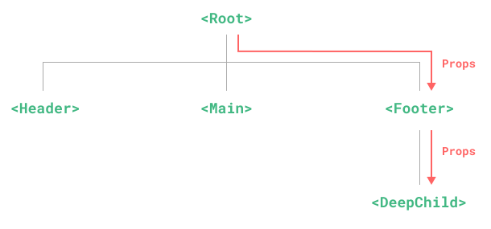
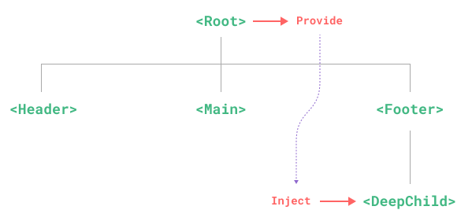
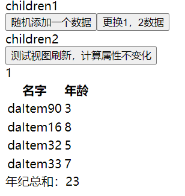

# vue全局状态管理（依赖注入）

从父组件向子组件传递数据时



`provide` 和 `inject` 可以帮助我们解决这一问题。 [[1\]](https://cn.vuejs.org/guide/components/provide-inject.html#footnote-1) 一个父组件相对于其所有的后代组件，会作为**依赖提供者**。



## Provide (提供)

要为组件后代提供数据，需要使用到 [`provide()`](https://cn.vuejs.org/api/composition-api-dependency-injection.html#provide) 函数：

```jsx | pure
<script setup>
import { provide } from 'vue'

provide(/* 注入名 */ 'message', /* 值 */ 'hello!')
</script>
```

如果不使用 `<script setup>`，请确保 `provide()` 是在 `setup()` 同步调用的：

```js
import { provide } from 'vue'

export default {
  setup() {
    provide(/* 注入名 */ 'message', /* 值 */ 'hello!')
  }
}
```

第二个参数是提供的值，值可以是任意类型，包括响应式的状态，比如一个 ref：

```js
import { ref, provide } from 'vue'

const count = ref(0)
provide('key', count)
```

**应用层 Provide**

除了在一个组件中提供依赖，我们还可以在整个应用层面提供依赖：

```js
import { createApp } from 'vue'

const app = createApp({})

app.provide(/* 注入名 */ 'message', /* 值 */ 'hello!')
```

## Inject (注入)

要注入上层组件提供的数据，需使用 [`inject()`](https://cn.vuejs.org/api/composition-api-dependency-injection.html#inject) 函数：

```jsx | pure
<script setup>
import { inject } from 'vue'

const message = inject('message')
</script>
```

同样的，如果没有使用 `<script setup>`，`inject()` 需要在 `setup()` 内同步调用：

```js
import { inject } from 'vue'

export default {
  setup() {
    const message = inject('message')
    return { message }
  }
}
```

### 注入默认值

```js
// 如果没有祖先组件提供 "message"
// `value` 会是 "这是默认值"
const value = inject('message', '这是默认值')
```


## 实现全局状态管理

### store

```js
import {reactive, provide,computed} from 'vue';
export const initStore = ()=>{
  const store = reactive({
    data:[
      // {name:'11',age:1}
    ],
    setData:(arr)=>{
      store.data = arr
    },
    pushData(item){
      store.data.push(item)
    },
    getAgeList:computed(()=>{
      console.log('getAgeList')
      return store.data.map(item=>item.age);
    }),
    getNameList:computed(()=>{
      return store.data.map(item=>item.name);
    }),
    findData(fn){
      return store.data.find(fn)
    }
  })

  provide('store',store);
}
```

### 跟组件引入

```jsx | pure
<script setup>
import {initStore} from'./store'
import Children1 from './components/children1.vue'
import Children2 from './components/children2.vue'
initStore()
</script>
<template>
  <div>
    <Children1 />
    <Children2 />
  </div>
</template>
```

### children1

```jsx | pure
<script setup>
import {inject} from 'vue';
const store = inject('store');
const createRandomItme = () => {
  return {
    name: 'daItem' + Math.floor(Math.random() * 100),
    age: Math.floor(Math.random() * 10)
  }
}
// 对换两个节点数据
const splite1_2 = () => {
  [store.data[0], store.data[1]] = [store.data[1], store.data[0]]
}

</script>
<template>
  <header>children1</header>
  <button @click="()=>{store.pushData(createRandomItme())}">随机添加一个数据</button>
  <button @click="()=>{splite1_2()}">更换1，2数据</button>

</template>
```

### children2

```jsx | pure
<script setup>
import {inject, ref, computed} from 'vue';
const store = inject('store');

let coun1 = ref(0)

// 获取总的年龄
const summaryAge = computed(() => store.getAgeList.reduce(
  (total, item) => item + total
  , 0))
</script>
<template>
  <header>children2</header>
  <!-- 点击刷新视图，store中计算属性不会重新计算 -->
  <button @click="coun1 = coun1+1">测试视图刷新，计算属性不变化</button>
  <div>{{ coun1 }}</div>
  <!-- 数据展示 -->
  <table>
    <tbody>
    <tr>
      <th>名字</th>
      <th>年龄</th>
    </tr>
    <tr v-for="(item,index) in store.data" :key="index">
      <td>{{ item.name }}</td>
      <td>{{ item.age }}</td>
    </tr>
    </tbody>
  </table>
  <div>
    年纪总和：{{ summaryAge }}
  </div>
</template>
```

效果：


