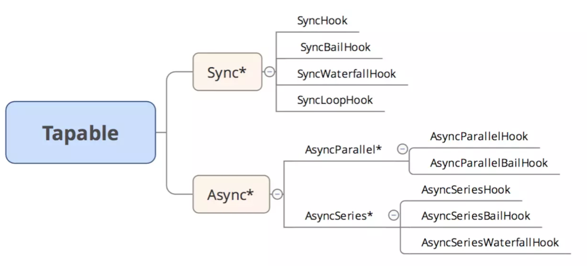
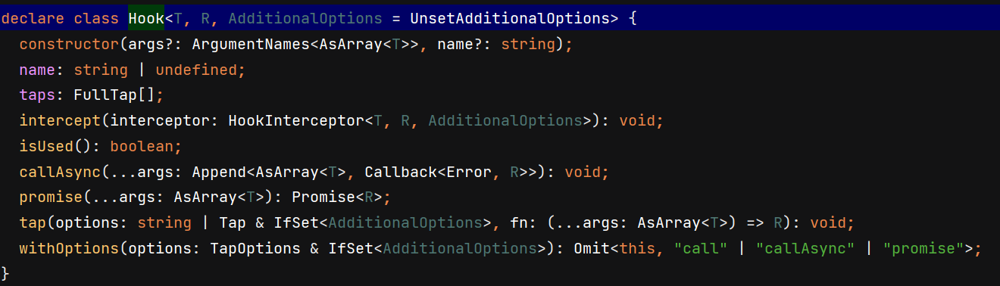
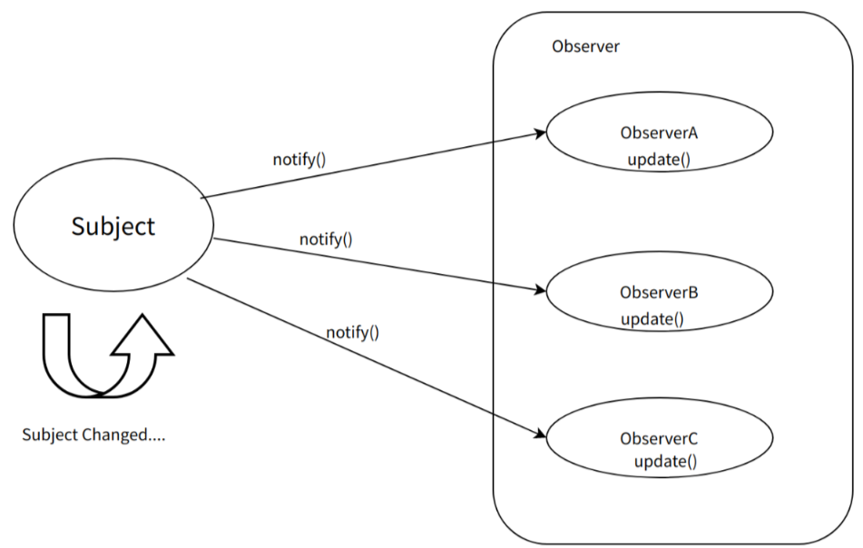
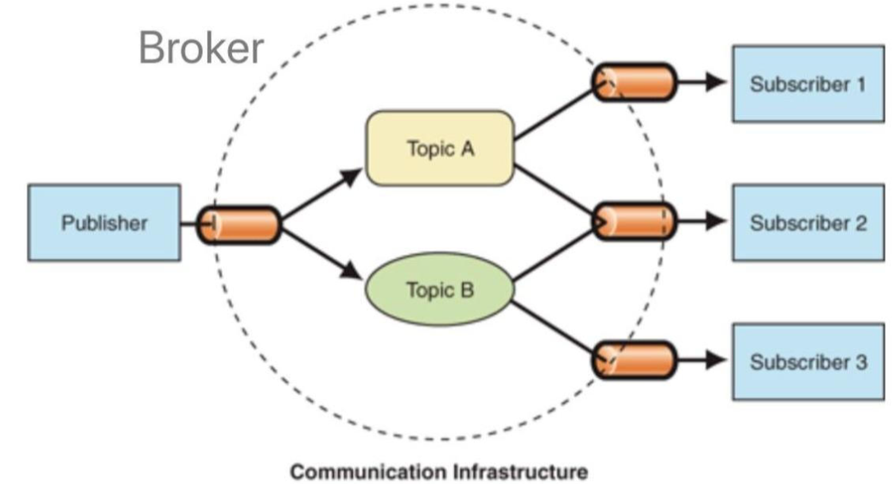

# Tapable

## **相关背景**

`webpack`本质上是一种事件流的机制，它的工作流程就是将各个插件串联起来，而实现这一切的核心就是`Tapable`，`webpack`中最核心的负责编译的`Compiler`和负责创建bundles的`Compilation`都是`Tapable`的实例。

## 简介

`Tapable` 库的设计借鉴了**发布订阅模式**，通过管理**事件注册**与**触发**，使得不同的组件能够松散耦合地协同工作。




**用法**

| 序号 | 钩子名称                 | 执行方式 | 使用要点                                                     |
| ---- | ------------------------ | -------- | ------------------------------------------------------------ |
| 1    | SyncHook                 | 同步串行 | 不关心监听函数的返回值                                       |
| 2    | SyncBailHook             | 同步串行 | 只要监听函数中有一个函数的返回值不为 `null`，则跳过剩下所有的逻辑 |
| 3    | SyncWaterfallHook        | 同步串行 | 上一个监听函数的返回值可以传给下一个监听函数                 |
| 4    | SyncLoopHook             | 同步循环 | 当监听函数被触发的时候，如果该监听函数返回`true`时则这个监听函数会反复执行，如果返回 `undefined` 则表示退出循环 |
| 5    | AsyncParallelHook        | 异步并发 | 不关心监听函数的返回值                                       |
| 6    | AsyncParallelBailHook    | 异步并发 | 只要监听函数的返回值不为 `null`，就会忽略后面的监听函数执行，直接跳跃到`callAsync`等触发函数绑定的回调函数，然后执行这个被绑定的回调函数 |
| 7    | AsyncSeriesHook          | 异步串行 | 不关心`callback()`的参数                                     |
| 8    | AsyncSeriesBailHook      | 异步串行 | `callback()`的参数不为`null`，就会直接执行`callAsync`等触发函数绑定的回调函数 |
| 9    | AsyncSeriesWaterfallHook | 异步串行 | 上一个监听函数的中的`callback(err, data)`的第二个参数,可以作为下一个监听函数的参数 |

**注意**

**SyncWaterfallHook** 传递返回值到第一个参数。tap 的 return 值，会到下一个 tap 的第一个参数中，tap 第二个参数到最后一个参数永远接收的是call传入的参数。

**SyncLoopHook** 循环一个 tap 函数。直到一个 tap 函数返回 undefined，才会循环下个 tap 函数。

**AsyncParallelBailHook** 有返回值，就熔断当前事件流。但与 SyncBailHook 不同，他不会直接熔断下个tap的执行（因为异步函数第一时间都已经执行了，除非异步串行），而是在熔断时（tap有返回值）直接执行完 call（或者说promise或callAsync函数）。

Hook 基类 API：



github地址：https://github.com/webpack/tapable

## 测试

简单测试各个函数用法

js：

```js
import {
  SyncHook,
  SyncBailHook,
  SyncWaterfallHook,
  SyncLoopHook,
  AsyncParallelHook,
  AsyncParallelBailHook,
  AsyncSeriesHook,
  AsyncSeriesBailHook,
  AsyncSeriesWaterfallHook
} from "tapable";
// 官方案例 start
////////////////////
class Car {
  constructor() {
    this.hooks = {
      accelerate: new SyncHook(['newSpeed']),
      break: new SyncHook(),
      calculateRoutes: new AsyncParallelHook(['source', 'target', 'routesList']),
    }
  }
}

const myCar = new Car();

myCar.hooks.break.tap('WarningLampPlugin', () => console.log('WarningLampPlugin'))

myCar.hooks.accelerate.tap('LoggerPlugin', newSpeed => console.log(`Accelerating to ${newSpeed}`))
myCar.hooks.accelerate.tap('LoggerPlugin2', newSpeed => console.log(`Accelerating to ${newSpeed}_2`))

myCar.hooks.calculateRoutes.tapPromise('calculateRoutes tapPromise', (source, target, routesList, callback) => {
  return new Promise((resolve, reject) => {
    setTimeout(() => {
      console.log(`tapPromise to ${source}${target}${routesList}`);
      // resolve();
      reject('err1');
    }, 1000);
  })
})

myCar.hooks.calculateRoutes.tapAsync("calculateRoutes tapAsync", (source, target, routesList, callback) => {
  setTimeout(() => {
    console.log(`tapAsync to ${source}${target}${routesList}`);
    callback();
  }, 1000);
})
// end
////////////////////////////
// 补充 Waterfall Loop 的基本用法
class Car2 {
  syncWaterfallHook = new SyncWaterfallHook(['name', 'age']);
  // 第一个参数接收上次运行时的返回值，后边的参数永远接收call的赋值。
  syncLoopHook = new SyncLoopHook(['name', 'age']);
}

// waterfall
// 上一个tap执行完后返回值作为下一个tab的第一个参数
const myCar2 = new Car2();
myCar2.syncWaterfallHook.tap('xiao1', (name, age) => {
  console.log(name, age) // xiao5 1
})
myCar2.syncWaterfallHook.tap('xiao2', (name, age) => {
  console.log(name, age) // xiao5 1
  return 'a1'
})
myCar2.syncWaterfallHook.tap('xiao3', (name, age) => {
  console.log(name, age); // a1 1
  return 'a2'
})
/**
 * xiao5 1
 * xiao5 1
 * a1 1
 * a2
 * */
// loop
let i = 0
myCar2.syncLoopHook.tap('loop1', (name, age) => {
  console.log(name, age, i);// xiao5 1 0 - xiao5 1 4
  i++;
  if (i >= 5) {
    return undefined
  }
  return true;
})
myCar2.syncLoopHook.tap('loop2', (name, age) => {
  console.log(name, age, i); // xiao5 1 5 - xiao5 1 9
  i++;
  if (i >= 10) {
    return undefined
  }
  return true;
})
// end
//////////////
// AsyncParallelHook 用法
class AsyncCar3{
  asyncParallelHook = new AsyncParallelHook(['name']);
  asyncParallelBailHook = new AsyncParallelBailHook(['name']);
  asyncSeriesHook = new AsyncSeriesHook(['name']);
  asyncSeriesWaterfallHook = new AsyncSeriesWaterfallHook(['name','age'])
}
const asyncCar3 = new AsyncCar3();
asyncCar3.asyncParallelHook.tap('promise1',(name)=>{
  return new Promise((resolve,reject)=>{
    setTimeout(()=>{
      console.log(name,'tap_time2000')
      resolve()
    },2000)
  })
})
asyncCar3.asyncParallelHook.tapPromise('promise2',(name)=>{
  return new Promise((resolve,reject)=>{
    setTimeout(()=>{
      console.log(name,'tapPromise_time1000')
      resolve()
    },1000)
  })
})
/**
 * tapPromise_time1000
 * end
 * test1 tap_time2000
 * */
// asyncParallelBailHook 用法
asyncCar3.asyncParallelBailHook.tapPromise('pro1',(name)=>{
  return new Promise(resolve=>{
    setTimeout(()=>{
      console.log(name)
      resolve('t1')
    },1000)
  })
})
asyncCar3.asyncParallelBailHook.tapPromise('pro2',(name)=>{
  // 也会执行，不过触发（promise）函数不会等待他执行完
  return new Promise(resolve=>{
    setTimeout(()=>{
      console.log(name)
      resolve('t2')
    },2000)
  })
});
/**
 * xiao88
 * end
 * xiao88
 * */
// asyncSeriesHook 用法
asyncCar3.asyncSeriesHook.tapPromise('pro1',(name)=>{
  return new Promise(resolve=>{
    setTimeout(()=>{
      console.log(name)
      resolve()
    },1000)
  })
})
asyncCar3.asyncSeriesHook.tapPromise('pro2',(name)=>{
  return new Promise(resolve=>{
    setTimeout(()=>{
      console.log(name)
      resolve()
    },1000)
  })
})
/**
 * xiao99
 * xiao99
 * end
 * */
// asyncSeriesWaterfallHook 用法
asyncCar3.asyncSeriesWaterfallHook.tapPromise('pro1',(name,age)=>{
  return new Promise(resolve=>{
    setTimeout(()=>{
      console.log(name,age)
      // resolve的值作为下一个tapPromise的第一个参数。
      resolve('a1')
    },1000)
  })
})
asyncCar3.asyncSeriesWaterfallHook.tapPromise('pro2',(name,age)=>{
  return new Promise(resolve=>{
    setTimeout(()=>{
      console.log(name,age)
      resolve('a2')
    },1000)
  })
})
asyncCar3.asyncSeriesWaterfallHook.tapPromise('pro3',(name,age)=>{
  return new Promise(resolve=>{
    setTimeout(()=>{
      console.log(name,age)
      resolve('a3')
    },1000)
  })
})
/**
 * xiao6 90
 * a1 90
 * a2 90
 * a3 end
 * */
export {myCar, myCar2, asyncCar3}
```

jsx：

```jsx | pure
  <section>
    <h4>使用测试</h4>
    <button onClick={() => {
      myCar.hooks.break.call()
    }}>btn 1
    </button>
    <button onClick={() => {
      myCar.hooks.accelerate.call('hello')
    }}>btn 2
    </button>
    <button onClick={() => {
      myCar.hooks.calculateRoutes
        .promise('i', 'love', 'tapable')
        .then(() => {
          console.log('end')
        }).catch(err => {
        console.log(err)
      })
    }}>btn 3
    </button>
    <button onClick={() => {
      myCar.hooks.calculateRoutes
        .callAsync('i', 'love', 'tapable', (err) => {
          console.log('end')
          if (err)
            console.log(err)
        })

    }}>btn 4
    </button>
    <button onClick={() => {
      const data = myCar2.syncWaterfallHook.call('xiao5', '1')
      console.log(data) // a2
    }}>syncWaterfallHook_test
    </button>
    <button onClick={() => {
      myCar2.syncLoopHook.call('xiao5', '1')
    }}>syncLoopHook_test
    </button>
    <button onClick={() => {
      asyncCar3.asyncParallelHook
        .promise('test1')
        .then(() => {
          console.log('end')
        })
    }}>asyncParallelHook_test
    </button>
    <button onClick={() => {
      asyncCar3.asyncParallelBailHook
        .promise('xiao88')
        .then(() => {
          console.log('end')
        })
    }}>asyncParallelBailHook_test
    </button>
    <button onClick={() => {
      asyncCar3.asyncSeriesHook
        .promise('xiao99')
        .then(() => {
          console.log('end')
        })
    }}>asyncSeriesHook_test
    </button>
    <button onClick={() => {
      asyncCar3.asyncSeriesWaterfallHook
        .promise('xiao6','90')
        .then((data) => {
          console.log(data,'end')
        })
    }}>asyncSeriesWaterfallHook_test
    </button>
    {/*//////*/}
  </section>
```

## 简单实现

简单实现tapable的功能

sync js:

```js
// SyncHook
class SyncHook_MY {
  constructor(args = []) {
    this.args = args;
    this.hook = new Map([])
  }

  tap(name, fn) {
    this.hook.set(name, fn)
  }

  call(...args) {
    [...this.hook.values()].forEach((_fn) => {
      // 尊重用户刚开始定义的参数数量
      _fn(...args.slice(0, this.args.length))
    })
  }

}
// SyncHook 测试
export const syncHook_MY_test1 = () => {
  const a = new SyncHook_MY(['name', 'age']);
  a.tap('xiaowu', (name, age) => {
    console.log(name, age)
  })
  a.call('xiaowu', '11');
}
// syncBailHook
class SyncBailHook_MY {
  constructor(args) {
    this.hook = new Map([])
    this.args = args
  }

  tap(name, fn) {
    this.hook.set(name, fn)
  }

  call(...args) {
    let i = 0;
    const fns = Array.from(this.hook.values());
    let err = undefined
    // 实现熔断，可以使用 do while 实现。
    do {
      err = fns[i++](...args.slice(0, this.args.length))
    } while (i < fns.length && err === undefined)
    {
    }
  }
}
// syncBailHook 测试
export const syncBailHook_MY_test1 = () => {
  const hook = new SyncBailHook_MY('name');
  hook.tap('a1', (name) => {
    console.log(name + '1')
    return 'err'
  })
  hook.tap('a2', (name) => {
    console.log(name + '2')
  });
  hook.call('a')
}
// SyncWaterfallHook
class SyncWaterfallHook_MY {
  constructor(args) {
    this.hook = new Map([])
    this.args = args
  }

  tap(name, fn) {
    this.hook.set(name, fn);
  }

  call(...args) {
    let argAfter = args[0];
    [...this.hook.values()].forEach((_fn) => {
      let _argAfter = _fn(argAfter, ...args.slice(1, this.args.length));
      if (_argAfter) {
        argAfter = _argAfter;
      }
    });
    return argAfter;
  }
}
// SyncWaterfallHook 测试
export const syncWaterfallHook_MY_test1 = () => {
  const hook = new SyncWaterfallHook_MY('name');
  hook.tap('a1', (name) => {
    console.log(name)
    return 'a1'
  })
  hook.tap('a2', (name) => {
    console.log(name)
    return 'a2'
  });
  console.log(hook.call('a'));
  /**
   * a
   * a1
   * a2
   * */
}
```

async js:

```js
// AsyncParallelHook
class AsyncParallelHook_MY {
  constructor(args) {
    this.hook = new Map([])
    this.args = args
  }

  tapPromise(name, fn) {
    this.hook.set(name, fn);
  }

  promise(...args) {
    const promiseArr = [...this.hook.values()].map((_fn) => {
      return _fn(...args.slice(0, this.args.length))
    })
    // 因为是并行执行，用一个Promise.all足以实现。
    return Promise.all(promiseArr);
  }
}
// AsyncParallelHook 测试
export const asyncParallelHook_MY_test1 = () => {
  const hook = new AsyncParallelHook_MY('name');
  hook.tapPromise('promise1', (name) => {
    return new Promise((resolve, reject) => {
      setTimeout(() => {
        console.log(name, 'time2000')
        resolve()
      }, 2000)
    })
  })
  hook.tapPromise('promise2', (name) => {
    return new Promise((resolve, reject) => {
      setTimeout(() => {
        console.log(name, 'time1000')
        resolve()
      }, 1000)
    })
  });
  hook.promise('xiao77')
    .then(() => {
      console.log('end')
    });
}
// AsyncParallelBailHook
class AsyncParallelBailHook_MY {
  constructor(args) {
    this.hook = new Map([])
    this.args = args
  }

  tapPromise(name, fn) {
    this.hook.set(name, fn);
  }

  promise(...args) {
    return new Promise(resolve => {
      [...this.hook.values()].forEach((_fn) => {
        // forEach 是同步函数，符合异步并行的要求
        // 同时，在有返回值（then有值）时提前执行 call（或者说promise） 
        _fn(...args.slice(0, this.args.length)).then(data => {
          if (data !== undefined) {
            resolve(data)
          }
        })
      })
    })
  }
}
// asyncParallelBailHook 测试
export const asyncParallelBailHook_MY_test1 = () => {
  const hook = new AsyncParallelBailHook_MY('name');
  hook.tapPromise('promise1', (name) => {
    return new Promise((resolve, reject) => {
      setTimeout(() => {
        console.log(name, 'time2000')
        resolve('a1')
      }, 2000)
    })
  })
  hook.tapPromise('promise2', (name) => {
    return new Promise((resolve, reject) => {
      setTimeout(() => {
        console.log(name, 'time1000')
        resolve('a2')
      }, 1000)
    })
  });
  hook.promise('xiao77')
    .then(() => {
      console.log('end')
    });
  /**
   * xiao77 time1000
   * end
   * time2000
   * */
}
// AsyncSeriesHook
class AsyncSeriesHook_MY {
  constructor(args) {
    this.hook = new Map([])
    this.args = args
  }

  tapPromise(name, fn) {
    this.hook.set(name, fn);
  }

  promise(...args) {
    let result = Promise.resolve(); // result 存储一个promise类型。
    [...this.hook.values()].forEach((_fn) => {
      // 重点，使用循环，嵌套then，实现串行异步函数。
      result = result.then ?
        result.then(() =>
            _fn(...args.slice(0, this.args.length))
        ) :
        Promise.resolve();
    })
    return result;
  }
}
// AsyncSeriesHook 测试
export const AsyncSeriesHook_MY_test1 = () => {
  const hook = new AsyncSeriesHook_MY('name');
  hook.tapPromise('promise1', (name) => {
    return new Promise((resolve, reject) => {
      setTimeout(() => {
        console.log(name, 'time1')
        resolve()
      }, 1000)
    })
  })
  hook.tapPromise('promise2', (name) => {
    console.log(name, 'time2')
  });
  hook.tapPromise('promise3', (name) => {
    return new Promise((resolve, reject) => {
      setTimeout(() => {
        console.log(name, 'time3')
        resolve()
      }, 1000)
    })
  });
  hook.promise('xiao12')
    .then(() => {
      console.log('end')
    });
  /**
   * xiao12 time1
   * xiao12 time2
   * xiao12 time3
   * end
   * */
}

```


## 备注

### 观察者与发布订阅两个模式简介

#### **观察者模式**

**观察者模式**是一种对象行为模式，定义了一种**一对多**的**依赖关系**，当一个对象的**状态发生改变**时，所有**依赖**于它的对象都得到**通知**并自动**更新**。在观察者模式中，有两个主要角色：

1. **主题（Subject）：** 主题或者抽象通知者，它把所有对观察者对象的引用保存在一个聚集里，每个主题都可以有任何数量的观察者。抽象主题提供一个接口，可以增加、删除观察者对象 以及通知聚集里面的观察者。
2. **观察者（Observer）：**抽象观察者，为所有的具体观察者定义一个接口， 在得到主题的通知时更新自己。抽象观察者一般用一个抽象类或者一个接口实现。更新接口通常包含一个Update()方法，用来更新自己。



#### **发布订阅模式**

观察者模式：其实是为了实现**松耦合**。在Subject的抽象类里维护了一个观察者（Observer）的集合，以此来实现通知。但依然存在耦合。

发布订阅模式：完全**不**存在**耦合**关系。

在**发布订阅模式**里，**发布者**，并不会**直接通知订阅者**，换句话说，发布者和订阅者，**彼此互不相识**，它们是通过**第三者**，也就是在**消息队列**里面，我们常说的经纪人Broker。

在**发布订阅模式**里，**订阅方**，可以采用**主动拉取**、**被动接收**（队列推送），这两种方式来获取数据。



#### **总结**

- 从表面上看：
  - 观察者模式里，只有两个角色 —— 观察者 + 被观察者
  - 而发布订阅模式里，却不仅仅只有发布者和订阅者两个角色，还有一个经常被我们忽略的 —— 经纪人Broker
- 往更深层次讲：
  - 观察者模式，是松耦合的关系
  - 发布订阅模式，则完全不存在耦合
- 从使用层面上讲：
  - 观察者模式，多用于单个应用内部
  - 发布订阅模式，则更多的是一种跨应用的模式(cross-application pattern)，比如我们常用的消息中间件kafka


**参考**

https://zhuanlan.zhihu.com/p/615062842?utm_id=0

https://juejin.cn/post/6844903588112629767
