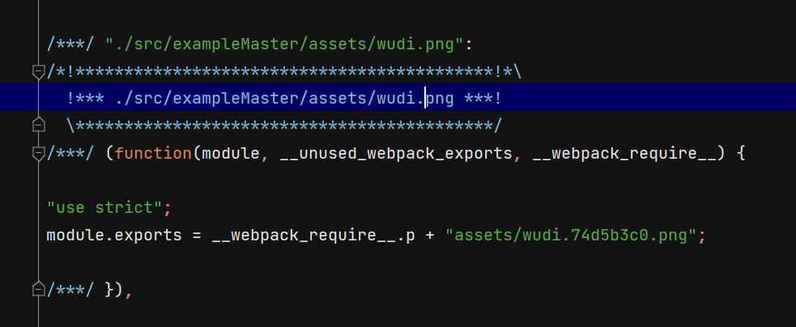
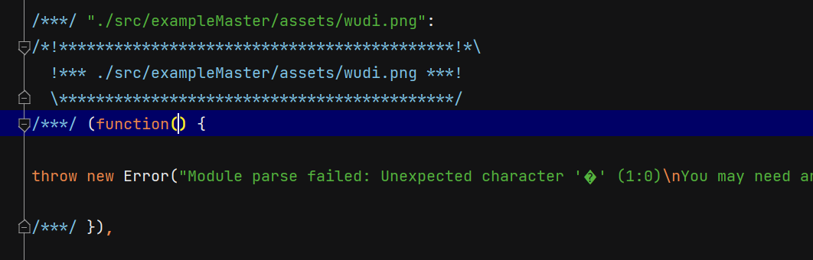
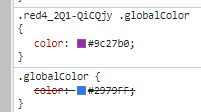
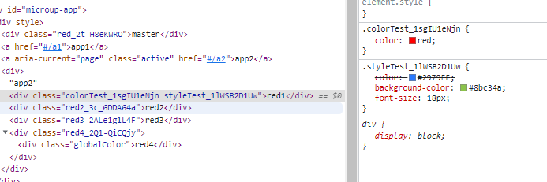

# css Laoder

## file-loader

`file-loader` 处理文件的方式非常直接：它会将文件输出到构建目录，并返回这个文件的 URL。这意味着当你在代码中引入一个图片或其他文件类型时，`file-loader` 会把这个文件复制到输出目录，并把文件路径转换成模块的导出。

例如，下面是一个 `file-loader` 的配置示例：

```js
javascriptCopy codemodule: {
  rules: [
    {
      test: /\.(png|jpe?g|gif)$/i,
      use: [
        {
          loader: 'file-loader',
          options: {
            outputPath: 'images', // 输出到 images 文件夹
          },
        },
      ],
    },
  ],
}
```

当你 `import image from './image.png'`，`image` 变量将包含该图片在处理后输出目录中的 URL。

## url-loader

`url-loader` 功能更丰富，它允许你设置一个文件大小的阈值。如果文件小于这个阈值，`url-loader` 会将文件转换为一个 Base64 编码的 URL，直接嵌入到你的 JavaScript bundle 中。如果文件大于这个阈值，则会回退到使用 `file-loader`，将文件复制到输出目录，并返回文件的 URL。

这是 `url-loader` 的一个配置示例：

```js
javascriptCopy codemodule: {
  rules: [
    {
      test: /\.(png|jpe?g|gif)$/i,
      use: [
        {
          loader: 'url-loader',
          options: {
            limit: 8192, // 8KB
            name: 'images/[name].[hash:7].[ext]', // 文件命名规则
          },
        },
      ],
    },
  ],
}
```

在这个例子中，如果图片小于 8KB，它会被转换为一个 Base64 编码的字符串，嵌入到你的 bundle 中。如果大于 8KB，则行为类似 `file-loader`。

**区别的影响**

- **性能**: 小文件使用 `url-loader` 可以减少请求次数，因为内容被内联到代码中，这可能对性能有正面影响，特别是在有许多小资源的情况下。然而，如果内联的内容太多，它可能会导致 JavaScript bundle 的大小显著增加，这可能对性能产生负面影响。
- **回退**: `url-loader` 提供了一个 `fallback` 选项，允许在文件超过指定大小时指定一个备用的 loader，通常是 `file-loader`。

**运行原理**

- `file-loader` 将文件复制到输出目录，并将文件路径转换为模块导出。
- `url-loader` 在文件大小低于指定限制时，会将文件内容转换为一个 Base64 编码的字符串并内联在 bundle 中。如果文件大小超出限制，则会像 `file-loader` 那样处理文件。

在 Webpack 5 中，这些 loaders 已经不是必需的，因为内置的资源模块类型（`asset/resource`, `asset/inline`, `asset`）提供了相同的功能。

### asset

根据文件大小自动在 `asset/resource` 和 `asset/inline` 之间选择。之前通过 `url-loader` 加上资源大小限制实现。

```js
{
  test: [
    /\.bmp$/,
    /\.gif$/,
    /\.jpe?g$/,
    /\.png$/,
    /\.eot$/,
    /\.woff2?$/,
    /\.ttf$/,
    /\.svg$/,
    /\.mp3$/,
  ],
  type: 'asset',
  parser: {
    dataUrlCondition: {
      maxSize: 4 * 1024 // 4kb
    }
  },
  generator: {
    filename: 'assets/[name].[hash:8][ext]'
    // 也可以设置 output.assetModuleFilename: 'assets/[name].[hash:8][ext]'
  }
},
```

导入图片，设置 asset 和不设置区别：（不设置会报错，路径错误）

```js
import React from 'react';
import img from './assets/wudi.png'
export default (props) => {
  console.log(package1)
  return (
  <div>
    
    app1
  </div>
)};
```





## style-loader

把 CSS 插入到 DOM 中。

### api

#### [**`injectType`**](https://webpack.docschina.org/loaders/style-loader/#injecttype)

配置把 styles 插入到 DOM 中的方式

> ```js
> options.injectType = 'styleTag'
> ```

##### styleTag

通过使用**多个** `<style></style>` 自动把 styles 插入到 DOM 中。该方式是**默认行为**。

> 运行原理：
>
> ```js
> import styles from "./styles.css";
> 
> const divElement = document.createElement("div");
> divElement.className = styles["my-class"];
> ```

##### singletonStyleTag

通过使用一个 `<style></style>` 来自动把 styles 插入到 DOM 中。

##### lazyStyleTag

**在需要时**使用多个 `<style></style>` 把 styles 插入到 DOM 中。

> 推荐 lazy style 遵循使用 `.lazy.css` 作为后缀的命名约定。
>
> 当使用 `lazyStyleTag` 时，`style-loader` 将惰性插入 styles，在需要使用 styles 时可以通过 `style.use()` / `style.unuse()` 使 style 可用。
>
> ```js
> import styles from "./styles.lazy.css";
> 
> styles.use();
> // 要移除 styles 时你可以调用
> // styles.unuse();
> ```

##### linkTag

使用多个 `<link rel="stylesheet" href="path/to/file.css">` 将 styles 插入到 DOM 中。

> ```js
> import "./styles.css";
> import "./other-styles.css";
> ```
>
> ```js
> module.exports = {
>   module: {
>     rules: [
>       {
>         test: /\.link\.css$/i,
>         use: [
>           { loader: "style-loader", options: { injectType: "linkTag" } },
>           { loader: "file-loader" },
>         ],
>       },
>     ],
>   },
> };
> ```
>
> 此 loader 生成的代码如下：
>
> ```jsx | pure
> <link rel="stylesheet" href="path/to/style.css" />
> <link rel="stylesheet" href="path/to/other-styles.css" />
> ```

其他 https://webpack.docschina.org/loaders/style-loader/#attributes

#### attributes

如果配置了 `attributes`，`style-loader` 将会在 `<style>` / `<link>` 上绑定指定的 `attributes` 以及它们的值。

> ```js
> module.exports = {
> module: {
>  rules: [
>    {
>      test: /\.css$/i,
>      use: [
>        { loader: "style-loader", options: { attributes: { id: "id" } } },
>        { loader: "css-loader" },
>      ],
>    },
>  ],
> },
> };
> ```
> 结果
>
> ```jsx | pure
> <style id="id"></style>
> ```

#### `insert`

insert 指定 **`<style>`插入位置**

`style-loader` 会把  / `<link>` 添加到页面的 `<head>` 标签尾部。

> 例如插入到body标签末尾
>
> ```js
> insert: "body",
> ```

#### `esModule`

默认情况下，`style-loader` 生成使用 ES 模块语法的 JS 模块。在某些情况下使用 ES 模块语法更好，比如：[module concatenation](https://webpack.docschina.org/plugins/module-concatenation-plugin/) 和 [tree shaking](https://webpack.docschina.org/guides/tree-shaking/) 时。

```js
esModule = true
```


## css-loader*

`css-loader` 会对 `@import` 和 `url()` 进行处理，就像 js 解析 `import/require()` 一样。

对于`production`构建，建议从包中提取 CSS，以便稍后能够使用 CSS/JS 资源的并行加载。[这可以通过使用**mini-css-extract-plugin**](https://github.com/webpack-contrib/mini-css-extract-plugin)来实现，因为它会**创建单独的 css 文件**。

对于`development`模式（包括`webpack-dev-server`），您可以使用 [**style-loader**](https://github.com/webpack-contrib/style-loader)，因为它使用多个将 **CSS 注入到 DOM 中`<style></style>`**并且工作速度更快。

> 不要`style-loader`和`mini-css-extract-plugin`一起使用。

### url

启用/禁用 `url`/`image-set` 函数进行处理。 如果设置为 `false`，`css-loader` 将不会解析 `url` 或者 `image-set` 中的任何路径。 

> 解析结果：
>
> ```js
> url(image.png) => require('./image.png')
> url('image.png') => require('./image.png')
> url(./image.png) => require('./image.png')
> url('./image.png') => require('./image.png')
> url('http://dontwritehorriblecode.com/2112.png') => require('http://dontwritehorriblecode.com/2112.png')
> image-set(url('image2x.png') 1x, url('image1x.png') 2x) => require('./image1x.png') and require('./image2x.png')
> ```
>
> 如果从`node_modules` 目录（包括 `resolve.modules`）导入资源加上一个前缀 `~`：
>
> ```js
> url(~module/image.png) => require('module/image.png')
> url('~module/image.png') => require('module/image.png')
> url(~aliasDirectory/image.png) => require('otherDirectory/image.png')
> ```

```js
options.url = true
```

### import

启用/禁用 `@import` 规则进行处理。 **控制 `@import` 的解析**。`@import` 中的**绝对 URL** 会被直接**移到运行时去处理**。

> 解析结果
>  ```js
> @import 'style.css' => require('./style.css')
> @import url(style.css) => require('./style.css')
> @import url('style.css') => require('./style.css')
> @import './style.css' => require('./style.css')
> @import url(./style.css) => require('./style.css')
> @import url('./style.css') => require('./style.css')
> @import url('http://dontwritehorriblecode.com/style.css') => @import url('http://dontwritehorriblecode.com/style.css') in runtime
> ```
>
> 从`node_modules` 目录导入，设置同上
>
> ```js
> @import url(~module/style.css) => require('module/style.css')
> @import url('~module/style.css') => require('module/style.css')
> @import url(~aliasDirectory/style.css) => require('otherDirectory/style.css')
> ```
>

```js
outions.import = true
```

### modules

启用/禁用 css 模块化。

- `true` - 对所有文件启用 CSS 模块。
- `false` - 对所有文件禁用 CSS 模块。
- `string` - 对所有文件禁用 CSS 模块并设置 `mode` 配置项，你可以在 [这里](https://github.com/webpack-contrib/css-loader#mode) 获得更多信息。
- `object` - 如果没有配置 `modules.auto` 则对所有文件启用 CSS 模块，否则 `modules.auto` 配置项则会决定其是否为 CSS 模块。

#### css模块化中api使用

##### :local

`:local(.className)` 可以被用来在**局部作用域**中声明 **className**。局部的作用域标识符会以模块形式暴露出去。

> 注意：无论是否使用:local关键字，样式的作用范围都是局部的。使用:local关键字仅仅是在CSS模块化中的一种语法约定，默认情况下不会泄露到外部作用域。所以也可以省略 :local

使用 `:local`（无括号）可以为此**选择器**启用局部模式。

> 无括号，说明不用非得用 className 了，可以使用兄弟，id等选择器。更灵活
>
> ```css
> :local [title=red3]  {
>   color: #4E5969;
> }
> ```

#####  :global

 `:global(.className)` 可以用来声明一个明确的全局选择器。 

> :global 会删除 className 上的 hash 值。调用时无需用 styles.className 方式调用。
>
> ```less
> // global.less
> :global .globalColor  {
>   color: @primary-color; // #2979FF
> }
> // app2.module.less
> .red4{
>   :global(.globalColor){ // 用 :global 覆盖全局样式
>     color: #9c27b0;
>   }
> }
> ```
>
> ```jsx | pure
> import styles from './app2mod.module.less';
> // app2.js
> <div className={styles.red4}>
>   <div className='globalColor'>
>     red4
>   </div>
> </div>
> ```
>
> 

使用 `:global`（无括号）可以将此选择器切换至全局模式。

##### composes*

从另一个模块导入本地类名。（真正的css模块化解决方案）

**本地类名**

声明本地类名时，可以从另一个本地类名组成一个本地类。

```less
:local(.className) {
  background: red;
  color: yellow;
}

:local(.subClass) {
  composes: className; // 引入一个本地类名
  background: blue;
}
```

**导入**

从一个css文件中导入一个类

```less
// index
.styleTest{
  color:@primary-color;
  background-color: #8bc34a;
  font-size:18px;
}
// app2
.colorTest{
  composes: styleTest from "./index.module.less";
  color:red
}
```

```jsx | pure
<div className={styles.colorTest}>red1</div>
```

从结果看，就是给div 的 class 加了一个类名。



##### @value

可以使用 `@value` 来指定在整个文档中都能被重复使用的值

> 推荐对**特定的值**使用 `v-` 的前缀，给**选择器**使用 `s-` 的前缀，并且为**媒体规则**使用 `m-` 前缀。
>
> ```css
> @value v-primary: #BF4040;
> @value s-black: black-selector;
> @value m-large: (min-width: 960px);
> 
> .header {
>   color: v-primary;
>   padding: 0 10px;
> }
> 
> .s-black {
>   color: black;
> }
> 
> @media m-large {
>   .header {
>     padding: 0 20px;
>   }
> }
> ```

#### modules Object*

启用 **CSS 模块** 功能和设置选项。

```js
module.exports = {
  module: {
    rules: [
      {
        test: /\.css$/i,
        loader: "css-loader",
        options: {
          modules: {
            mode: "local",
            auto: true,
            exportGlobals: true,
            localIdentName: "[path][name]__[local]--[hash:base64:5]",
            localIdentContext: path.resolve(__dirname, "src"),
            localIdentHashSalt: "my-custom-hash",
            namedExport: true,
            exportLocalsConvention: "camelCase",
            exportOnlyLocals: false,
          },
        },
      },
    ],
  },
};
```

##### **auto***

基于文件名自动启用 CSS 模块或者 ICSS。

有效值：

- `undefined` - 为所有文件启用 CSS 模块。
- `true` - 为所有匹配 `/\.module\.\w+$/i.test(filename)` 和 `/\.icss\.\w+$/i.test(filename)` 正则表达式的文件启用 CSS 模块。（默认匹配 index.module.less 和 index.icss.less 这样的文件为模块化样式文件）*
- `false` - 禁用 CSS 模块。
- `RegExp` - 为所有匹配 `/RegExp/i.test(filename)` 正则表达式的文件禁用 CSS 模块。
- `function` - 为所有通过基于文件名的过滤函数校验的文件启用 CSS 模块。

> 案例：
>
> ```js
> {
>   auto: (resourcePath) => resourcePath.endsWith('module.less'),  // 匹配.less文件来进行css模块化。
>   localIdentName: `[local]_[hash:base64:10]`,
> }
> ```

##### **mode**

设置modules魔默认模式。local选项代表模块化模式。global选项代表全局模式。pure选项则表示纯粹的CSS模式。

> 案例，根据名字默认设置模式
>
> ```js
> module.exports = {
>   module: {
>     rules: [
>       {
>         test: /\.css$/i,
>         loader: "css-loader",
>         options: {
>           modules: {
>             // 回调必须返回 `local`，`global`，或者 `pure`
>             mode: (resourcePath) => {
>               if (/pure.css$/i.test(resourcePath)) {
>                 return "pure";
>               }
>               if (/global.css$/i.test(resourcePath)) {
>                 return "global";
>               }
>               return "local";
>             },
>           },
>         },
>       },
>     ],
>   },
> };
> ```
> 注意：当设置 importLoaders 3 然后使用 @import 引入文件，resourcePath则获取不到。

```js
options.modules.mode = 'local'
```

##### **localIdentName**

允许配置生成的本地标识符(ident)。

- `[name]` 源文件名称
- `[path]` 源文件相对于 `compiler.context` 或者 `modules.localIdentContext` 配置项的相对路径。

- `[file]` - 文件名和路径。
- `[ext]` - 文件拓展名。
- `[hash]` - 字符串的哈希值。基于 `localIdentHashSalt`、`localIdentHashFunction`、`localIdentHashDigest`、`localIdentHashDigestLength`、`localIdentContext`、`resourcePath` 和 `exportName` 生成。

- `[local]` - 原始类名。

建议：

- 开发环境使用 `'[path][name]__[local]'`
- 生产环境使用 `'[hash:base64]'`

> 案例：
>
> ```js
>  localIdentName: `[local]_[hash:base64:10]`,
> ```

```js
options.modules.mode = '[hash:base64]'
```

##### **localIdentContext**

通过调整 `localIdentContext`，你可以控制 **CSS 类名（hash）**中**包含**的**路径**信息，以适应你的项目结构或者满足特定的命名约定。

##### **localIdentHashSalt**

允许添加自定义哈希值以生成更多唯一类。 更多信息请查看 [output.hashSalt](https://webpack.docschina.org/configuration/output/#outputhashsalt)。

##### **namedExport**

控制 CSS 类名是否导出为 JavaScript 模块的命名导出。

> 在 `modules.namedExport` 设置为 `true` 的情况下，你可以这样在 JavaScript 文件中导入和使用这个类名：
>
> ```js
> javascript
> import { button } from './styles.module.css';
> 
> console.log(button); // 输出: "styles_button__2Xa4v"
> ```

```
namedExport = false
```

##### **exportGlobals***

用于配置是否导出**全局 CSS 类名**作为 **JavaScript 模块的命名导出**。

当 `modules.exportGlobals` 设置为 `true` 时，除了局部 CSS 类名，任何使用 `:global` 规则定义的全局类名也会被导出。这样，你可以在 JavaScript 中直接通过这些全局类名引用 CSS 类。

> ```css
> :global(.globalButton) {
>   background-color: red;
> }
> 
> .localButton {
>   color: white;
> }
> ```
>
> 在 `modules.exportGlobals` 设置为 `true` 的情况下，你可以这样在 JavaScript 文件中导入和使用全局和局部类名：
>
> ```js
> javascript
> import { globalButton, localButton } from './styles.module.css';
> 
> console.log(globalButton); // 输出: "globalButton"
> console.log(localButton); // 输出: "styles_localButton__1a2b3"
> ```

```js
exportGlobals = false
```

##### **exportLocalsConvention**

导出的类名称的样式。

| 名称                  | 类型       | 描述                                       |
| :-------------------- | :--------- | :----------------------------------------- |
| **`'asIs'`**          | `{String}` | 类名将按原样导出。                         |
| **`'camelCase'`**     | `{String}` | 类名将被驼峰化，原类名不会从局部环境删除   |
| **`'camelCaseOnly'`** | `{String}` | 类名将被驼峰化，原类名从局部环境删除       |
| **`'dashes'`**        | `{String}` | 类名中只有破折号会被驼峰化                 |
| **`'dashesOnly'`**    | `{String}` | 类名中破折号会被驼峰，原类名从局部环境删除 |

```js
// 取决于 modules.namedExport 选项值，如果为 true 则对应的是 camelCaseOnly，反之对应的是 asIs
exportLocalsConvention = 'camelCaseOnly'
exportLocalsConvention = 'asIs'
```

### **exportOnlyLocals**

使用 **css 模块** 进行预渲染（例如 SSR）时**很有用**。 要进行预渲染，**预渲染包** 应使用 `mini-css-extract-plugin` 选项而不是 `style-loader!css-loader`。 它不嵌入 CSS，而仅导出标识符映射。

### importLoaders

允许为 `@import` 样式规则、CSS 模块或者 ICSS 启用/禁用或设置在 CSS loader **之前**应用的 loader 的数量。

`importLoaders` 选项允许你配置在 `css-loader` 之前有多少 loader 应用于 `@import`ed 资源与 CSS 模块/ICSS 导入。

> ```js
> module.exports = {
>   module: {
>     rules: [
>       {
>         test: /\.css$/i,
>         use: [
>           "style-loader",
>           {
>             loader: "css-loader",
>             options: {
>               importLoaders: 2,
>               // 0 => no loaders (default);
>               // 1 => postcss-loader;
>               // 2 => postcss-loader, sass-loader
>             },
>           },
>           "postcss-loader",
>           "sass-loader",
>         ],
>       },
>     ],
>   },
> };
> ```

### sourceMap

**source map** 的生成**默认**依赖 [`devtool`](https://webpack.docschina.org/configuration/devtool/) 配置项。除了 `eval` 与 `false` 之外的值都会启用 source map。

### esModule

默认情况下，`css-loader` 生成使用 ES 模块语法的 JS 模块。 在某些情况下，使用 ES 模块是有益的，例如在[模块串联](https://webpack.docschina.org/plugins/module-concatenation-plugin/)或 [tree shaking](https://webpack.docschina.org/guides/tree-shaking/) 时。

```js
options.esModule = true
```

### `/* webpackIgnore: true */`

有了 `/* webpackIgnore: true */` 注释，可以禁用对规则和单个声明的源处理。

> ```css
> /* webpackIgnore: true */
> @import url(./basic.css);
> @import /* webpackIgnore: true */ url(./imported.css);
> 
> .class {
>   /* 对 'background' 声明中的所有 url 禁用 url 处理 */
>   color: red;
>   /* webpackIgnore: true */
>   background: url("./url/img.png"), url("./url/img.png");
> }
> 
> .class {
>   /* 对 'background' 声明中第一个 url 禁用 url 处理 */
>   color: red;
>   background:
>     /* webpackIgnore: true */ url("./url/img.png"), url("./url/img.png");
> }
> 
> .class {
>   /* 对 'background' 声明中第二个 url 禁用 url 处理 */
>   color: red;
>   background: url("./url/img.png"),
>     /* webpackIgnore: true */ url("./url/img.png");
> }
> 
> /* prettier-ignore */
> .class {
>   /* 对 'background' 声明中第二个 url 禁用 url 处理 */
>   color: red;
>   background: url("./url/img.png"),
>     /* webpackIgnore: true */
>     url("./url/img.png");
> }
> 
> /* prettier-ignore */
> .class {
>   /* 对 'background-image' 声明中第三和第六个 url 禁用 url 处理 */
>   background-image: image-set(
>     url(./url/img.png) 2x,
>     url(./url/img.png) 3x,
>     /* webpackIgnore:  true */ url(./url/img.png) 4x,
>     url(./url/img.png) 5x,
>     url(./url/img.png) 6x,
>     /* webpackIgnore:  true */
>     url(./url/img.png) 7x
>   );
> }
> ```

## postcss-loader

**PostCSS**是一个用于**转换CSS的工具**。它允许开发者使用JavaScript编写插件，以便对CSS进行各种处理和转换。这些插件可以用来处理CSS文件，例如自动**添加浏览器厂商前缀、变量替换、样式合并、压缩等**。PostCSS的作用是使得开发者可以更加灵活和高效地处理CSS，并提供一种可扩展的方式来处理CSS文件。

PostCSS地址：https://postcss.org/

postcss-loader: https://webpack.docschina.org/loaders/postcss-loader/#implementation

### api

#### execute

在 `CSS-in-JS` 中启动 PostCSS Parser 支持，如果你在 **JS 文件中编写样式**，请使用 [`postcss-js`](https://github.com/postcss/postcss-js) parser，并且添加 `execute` 选项。

```js
module.exports = {
  module: {
    rules: [
      {
        test: /\.style.js$/,
        use: [
          'style-loader',
          {
            loader: 'css-loader',
          },
          {
            loader: 'postcss-loader',
            options: {
              postcssOptions: {
                parser: 'postcss-js',
              },
              execute: true,
            },
          },
        ],
      },
    ],
  },
};
```

#### postcssOptions

允许**设置 [`PostCSS 选项`](http://api.postcss.org/global.html#processoptions) 和插件**。

```js
const myOtherPostcssPlugin = require('postcss-my-plugin');

module.exports = {
  module: {
    rules: [
      {
        test: /\.sss$/i,
        loader: 'postcss-loader',
        options: {
          postcssOptions: {
            plugins: [
              'postcss-import',
              ['postcss-short', { prefix: 'x' }],
              require.resolve('my-postcss-plugin'),
              myOtherPostcssPlugin({ myOption: true }),
              // 废弃的，将会在下一个主要版本中移除
              { 'postcss-nested': { preserveEmpty: true } },
            ],
          },
        },
      },
    ],
  },
};
```

##### **设置 `syntax`：**

 **Syntax（语法）：**语法定义了解析器**和**字符串化器**的组合，它允许 PostCSS 同时支持不同的 CSS 类型语言（如 SCSS, Less 等）。

**`sugarss`** 是 PostCSS 的一个语法插件，它提供了一种**缩进式的语法**，类似于 Stylus 或 Sass。当你指定 `syntax: 'sugarss'`，PostCSS 将会使用 `sugarss` 的解析器来解析 CSS，并使用相应的字符串化器来输出 CSS。

```js
module.exports = {
  module: {
    rules: [
      {
        test: /\.sss$/i,
        loader: 'postcss-loader',
        options: {
          postcssOptions: {
            // 可以是 `String`
            syntax: 'sugarss',
            // 可以是 `Object`
            syntax: require('sugarss'),
          },
        },
      },
    ],
  },
};
```

##### **设置 `parser`：**

 **Parser（解析器）**：解析器的主要作用是将输入的 **CSS 字符串解析**成一个**节点树**（node tree）。节点树是一种数据结构，它以树的形式表示 CSS 规则和它们之间的关系。

```js
module.exports = {
  module: {
    rules: [
      {
        test: /\.sss$/i,
        loader: 'postcss-loader',
        options: {
          postcssOptions: {
            // 可以是 `String`
            parser: 'sugarss',
            // 可以是 `Object`
            parser: require('sugarss'),
            // 可以是 `Function`
            parser: require('sugarss').parse,
          },
        },
      },
    ],
  },
};
```

##### **设置 `stringifier`：**

**Stringifier（字符串化器）**: 字符串化器的作用是将**节点树**转换回**字符串**形式的 **CSS 代码**。

```js
const Midas = require('midas');
const midas = new Midas();

module.exports = {
  module: {
    rules: [
      {
        test: /\.sss$/i,
        loader: 'postcss-loader',
        options: {
          postcssOptions: {
            // 可以是 `String`
            stringifier: 'sugarss',
            // 可以是 `Object`
            stringifier: require('sugarss'),
            // 可以是 `Function`
            stringifier: midas.stringifier,
          },
        },
      },
    ],
  },
};
```

##### config

允许指定配置文件路径。

```js
const path = require('path');

module.exports = {
  module: {
    rules: [
      {
        test: /\.css$/i,
        loader: 'postcss-loader',
        options: {
          postcssOptions: {
            config: path.resolve(__dirname, 'postcss.config.js'),
          },
        },
      },
    ],
  },
};
```

**postcss.config.js**（**推荐**）

```js
module.exports = (api) => {
  // `api.file` - 文件路径
  // `api.mode` - webpack 的 `mode` 属性值，请查阅 https://webpack.js.org/configuration/mode/
  // `api.webpackLoaderContext` - 在复杂情况下使用的 loader 上下文
  // `api.env` - `api.mode` 的别名，与 `postcss-cli` 兼容
  // `api.options` - `postcssOptions` 的选项

  if (/\.sss$/.test(api.file)) {
    return {
      //你可以指定下面提到的所有选项 https://postcss.org/api/#processoptions here
      parser: 'sugarss',
      plugins: [
        // PostCSS 插件
        ['postcss-short', { prefix: 'x' }],
        'postcss-preset-env',
      ],
    };
  }

  return {
    // 你可以指定下面提到的所有选项 https://postcss.org/api/#processoptions
    plugins: [
      // PostCSS 插件
      ['postcss-short', { prefix: 'x' }],
      'postcss-preset-env',
    ],
  };
};
```

#### sourceMap

默认情况下 source map 的生成依赖于 [`devtool`](https://webpack.docschina.org/configuration/devtool/)选项。 除 `eval` 和 `false` 外，其他的值都将打开 source map 生成。

```js
module.exports = {
  module: {
    rules: [
      {
        test: /\.css$/i,
        use: [
          { loader: 'style-loader' },
          { loader: 'css-loader', options: { sourceMap: true } },
          { loader: 'postcss-loader', options: { sourceMap: true } },
          { loader: 'sass-loader', options: { sourceMap: true } },
        ],
      },
    ],
  },
};
```

#### implementation

特殊的 `implementation` 选项决定使用 PostCSS 哪个实现。重载本地安装的 `postcss` 的 `peerDependency` 版本。

> **此选项只对底层工具的作者有效，以便于 PostCSS 7 到 PostCSS 8 的过渡。**


### 常见插件

#### postcss-preset-env

总体来说，`postcss-preset-env` 让开发者能够在**不牺牲浏览器兼容性**的情况下，**使用最新的 CSS 特性**，它通过**智能的转换**和**添加前缀**来实现这一目标。

1. **特性转换**: 将最新的 CSS 特性（如 CSS Grid, CSS Custom Properties 等）转换为更广泛支持的旧语法。例如，它可以将 CSS 变量转换为静态值。
2. **添加前缀**: 对于需要特定浏览器前缀的 CSS 属性（如 `-webkit-`, `-moz-`, `-ms-`），`postcss-preset-env` 会自动添加这些前缀，根据你指定的浏览器支持范围。
3. **Stage 控制**: 该插件根据 CSS 提案的阶段（Stage）来使你能控制你想要使用的特性的稳定性。CSS 提案被分为不同的阶段，从 Stage 0（非常新的提案）到 Stage 4（成为标准的特性）。
4. **兼容性保证**: 确保你的 CSS 代码在旧浏览器中仍能运行，即使这些浏览器不支持某些现代 CSS 特性。

> 案例：
> ```css
> @custom-media --viewport-medium (width <= 50rem);
> @custom-selector :--heading h1, h2, h3, h4, h5, h6;
> 
> :root {
> --mainColor: #12345678;
> }
> 
> body {
> color: var(--mainColor);
> font-family: system-ui;
> overflow-wrap: break-word;
> }
> 
> :--heading {
> 	background-image: image-set(url(img/heading.png) 1x, url(img/heading@2x.png) 2x);
> 	@media (--viewport-medium) {
> 		margin-block: 0;
>  	}
> }
> 
> a {
> color: rgb(0 0 100% / 90%);
> 	&:hover {
> 		color: rebeccapurple;
> 	}
>  }
> ```
> 转化为：
> 
> ```css
>
> :root {
> --mainColor: rgba(18, 52, 86, 0.47059); /* 使用rgba */ 
> }
>   
> body {
> color: rgba(18, 52, 86, 0.47059); /* var变量直接导入 */ 
> color: var(--mainColor);
>   font-family: system-ui, -apple-system, BlinkMacSystemFont, Segoe UI, Roboto, Oxygen, Ubuntu, Cantarell, Droid Sans, Helvetica Neue;/* 扩充font-family */ 
>   word-wrap: break-word;
>   }
>   
> h1, h2, h3, h4, h5, h6 {
> background-image: url(img/heading.png);
> }
>   
> @media (-webkit-min-device-pixel-ratio: 2), (min-resolution: 192dpi) {
> 	h1, h2, h3, h4, h5, h6 {
>  		background-image: url(img/heading@2x.png)
>   	}
>    }
>   
> @media (max-width: 50rem) {
> 	h1, h2, h3, h4, h5, h6 {
>  		margin-top: 0;
>    		margin-bottom: 0;
>    	}
>    }
>   
> a {
> color: rgba(0, 0, 255, 0.9)
> }
>   
> a:hover { /* &: 替换 */
> color: #639;
> }
>   ```
> 

##### stage 阶段

该`stage`选项根据 CSS 特性在成为实施的 Web 标准过程中的稳定性来确定要进行 Polyfill 的 CSS 特性。

可以`stage`是`0`（实验性的）到`4`（稳定的），或者`false`。设置 `stage`为`false`将禁用每个填充。仅当您打算专门使用该选项时，这样做才有用[`features`](https://github.com/csstools/postcss-preset-env#features)。

```js
plugins: [
   ['postcss-preset-env',{stage = 2}] // 默认为2
],
```

##### features 特性

该`features`选项**通过 ID** 启用或禁用**特定的 polyfill**。传递 `true`到特定的功能 ID 将启用其填充，而传递`false` 将禁用它。[ID 列表](https://github.com/csstools/postcss-preset-env/blob/master/src/lib/plugins-by-id.js#L36)

```js
export default {
	'all-property': postcssInitial, // 支持 CSS all 属性，用于重置元素的所有属性。
	'any-link-pseudo-class': postcssPseudoClassAnyLink, // 支持 :any-link 伪类，选择所有链接元素。
	'blank-pseudo-class': postcssBlankPseudo, // 支持 :blank 伪类，选择没有内容的元素。
	'break-properties': postcssPageBreak, // 支持分页控制属性，如 break-before、break-after 和 break-inside。
	'case-insensitive-attributes': postcssAttributeCaseInsensitive, // 支持属性选择器的大小写不敏感选项。
	'color-functional-notation': postcssColorFunctionalNotation, // 支持现代化的颜色函数语法。
	'custom-media-queries': postcssCustomMedia, // 支持自定义媒体查询。
	'custom-properties': postcssCustomProperties, // 支持 CSS 变量。
	'custom-selectors': postcssCustomSelectors,// 支持自定义选择器。
	'dir-pseudo-class': postcssDirPseudoClass, // 支持 :dir() 伪类，用于选择文本方向。
	'double-position-gradients': postcssDoublePositionGradients, // 支持渐变的双位置语法。
	'environment-variables': postcssEnvFunction, // 支持使用环境变量。
	'focus-visible-pseudo-class': postcssFocusVisible,// 支持 :focus-visible 伪类。
	'focus-within-pseudo-class': postcssFocusWithin, // 支持 :focus-within 伪类。
	'font-variant-property': postcssFontVariant, // 支持 font-variant CSS 属性。
	'gap-properties': postcssGapProperties, // 支持网格和 flex 布局中的 gap 属性。
	'has-pseudo-class': postcssHasPseudo, //支持 :has() 伪类。
	'hexadecimal-alpha-notation': postcssColorHexAlpha, // 支持十六进制颜色的透明度表示。
	'image-set-function': postcssImageSetPolyfill, // 支持 image-set() 函数。
	'lab-function': postcssLabFunction, // 支持使用 CIE LAB 颜色。
	'logical-properties-and-values': postcssLogical, // 支持逻辑属性和值，用于国际化布局。
	'media-query-ranges': postcssMediaMinmax, // 支持媒体查询的范围语法。
	'nesting-rules': postcssNesting, // 支持 CSS 嵌套规则。
	'not-pseudo-class': postcssSelectorNot, // 增强 :not() 伪类的功能。
	'overflow-property': postcssOverflowShorthand, // 支持 overflow 的缩写属性。
	'overflow-wrap-property': postcssReplaceOverflowWrap, // 支持 overflow-wrap 属性。
	'place-properties': postcssPlace, // 支持 place-content、place-items 和 place-self 属性。
	'prefers-color-scheme-query': postcssPrefersColorScheme, // 支持 prefers-color-scheme 媒体查询，用
	'rebeccapurple-color': postcssColorRebeccapurple, // 支持 rebeccapurple 颜色。
	'system-ui-font-family': postcssFontFamilySystemUi // 支持 system-ui 字体族。
};
```

##### browsers

该`browsers`选项根据您支持的浏览器确定需要哪些填充。

[PostCSS Preset Env](https://github.com/csstools/postcss-preset-env)支持任何标准的[browserslist](https://github.com/browserslist/browserslist#readme)配置，可以是`.browserslistrc`文件、`browserslist`中的键`package.json`或 `browserslist`环境变量。

> 如果未指定有效的 browserslist 配置， 则将使用[默认的 browserslist 查询。](https://github.com/browserslist/browserslist#queries)

##### autoprefixer 前缀

[PostCSS Preset Env](https://github.com/csstools/postcss-preset-env)包含[autoprefixer](https://github.com/postcss/autoprefixer)，[`browsers`](https://github.com/csstools/postcss-preset-env#browsers)选项将自动传递给它。

指定该`autoprefixer`选项可以将 [其他选项传递到](https://github.com/postcss/autoprefixer#options)[autoprefixer](https://github.com/postcss/autoprefixer) 中。

```
postcssPresetEnv({
  autoprefixer: { grid: true }
})
```

传递`autoprefixer: false`会禁用自动前缀器。

#### postcss-short

[PostCSS Short](https://github.com/jonathantneal/postcss-short)允许您在 CSS 中使用**高级速记**属性。

案例：

声明`width`和`height`一起`size`。

```js
.icon {
  size: 48px;
}
/* 编译后 */
.icon {
  width: 48px;
  height: 48px;
}
```

margin 设置 * 避免覆盖多余值

```css
.frame {
  margin: * auto;
}
/* 编译后 */
.frame {
  margin-right: auto;
  margin-left: auto;
}
```

position 设置 * 避免覆盖多余值

```css
.banner {
  position: fixed 0 0 *;
}
/* 编译后 */
.banner {
  position: fixed;
  top: 0;
  right: 0;
  left: 0;
}
```

宣告`color`并`background-color`在一起。

```css
.canvas {
  color: #abccfc #212231;
}
/* 编译后 */
.canvas {
  color: #abccfc;
  background-color: #212231;
}
```

宣告`font-size`并`line-height`在一起。

```css
.heading {
  font-size: 1.25em / 2;
}
/* 编译后 */
.heading {
  font-size: 1.25em;
  line-height: 2;
}
```

##### prefix

该`prefix`选项定义要转换的属性所需的前缀。

```js
postcssShort({ prefix: 'x' });
```

```css
.example-1 {
  -x-border-color: blue blue *;
  -x-color: * #fafafa;
}
/* 编译后 */
.example-1 {
  border-top-color: blue;
  border-right-color: blue;
  border-left-color: blue;
  background-color: #fafafa;
}
```

#### postcss-import

`postcss-import` 是一个 PostCSS 插件，它用于处理 CSS 中的 `@import` 规则。这个插件的主要作用是让你可以将**多个 CSS 文件合并为一个**，从而减少网络请求并提高页面加载速度。它还支持从 node_modules 目录导入样式，允许你使用第三方库和框架中的 CSS。

> 使用 import 后，会把css都打包到一个css文件内。
>
> ```css
> /* remote urls are preserved */
> @import "https://example.com/styles.css";
> 
> /* can consume `node_modules`, `web_modules` or local modules */
> @import "cssrecipes-defaults"; /* == @import "../node_modules/cssrecipes-defaults/index.css"; */
> @import "normalize.css"; /* == @import "../node_modules/normalize.css/normalize.css"; */
> 
> @import "foo.css"; /* relative to css/ according to `from` option above */
> 
> /* all standard notations of the "url" value are supported */
> @import url(foo-1.css);
> @import url("foo-2.css");
> 
> @import "bar.css" (min-width: 25em);
> 
> @import 'baz.css' layer(baz-layer);
> 
> body {
>   background: black;
> }
> /* 编译后 */
> @import "https://example.com/styles.css";
> 
> /* ... content of ../node_modules/cssrecipes-defaults/index.css */
> /* ... content of ../node_modules/normalize.css/normalize.css */
> 
> /* ... content of css/foo.css */
> 
> /* ... content of css/foo-1.css */
> /* ... content of css/foo-2.css */
> 
> @media (min-width: 25em) {
> /* ... content of css/bar.css */
> }
> 
> @layer baz-layer {
> /* ... content of css/baz.css */
> }
> 
> body {
>   background: black;
> }
> ```
>
> 如果不用 `postcss-import`
>
> **额外的 HTTP 请求：** 每个 `@import` 规则都会导致浏览器在加载 CSS 时发出一个额外的 HTTP 请求。这可能导致页面加载速度变慢，尤其是当有许多 `@import` 调用时。
>
> **依赖浏览器解析：** 浏览器将处理 `@import`，并且只能处理 URL 或支持的路径格式。它不能从 `node_modules` 中导入样式。

根路径

要解析`@import`规则的路径，可以查看根目录（情况默认下`process.cwd()`）、`web_modules`或`node_modules` 本地模块。

#### postcss-normalize

使用 Normalize.css 来确保浏览器之间的一致性，同时只包含你实际需要的部分。这个插件根据你的浏览器列表（Browserslist）和已使用的 CSS 来确定需要包含哪些 Normalize.css 规则。

**配置 PostCSS：**

将 postcss-normalize  添加到你的 PostCSS 配置文件中。如果你使用的是 postcss.config.js

```js
javascriptCopy codemodule.exports = {
  plugins: [
    require('postcss-normalize')({
        forceImport:true // 强制在 CSS 顶部导入 normalize.css，即使它没有通过 @import-normalize; 声明引入。
    }),
    // ...其他 PostCSS 插件
  ]
}
```

**在 CSS 中使用：**

在你的 CSS 文件中，使用 `@import-normalize;` 规则来告诉 `postcss-normalize` 在哪里插入 Normalize.css 的内容。例如：

```
cssCopy code@import-normalize; /* 在这里引入 Normalize.css 的内容 */

/* 以下是你的其他 CSS 规则 */
body {
  margin: 0;
  font-family: sans-serif;
}
```

`postcss-normalize` 将根据你的 Browserslist 配置自动确定需要包含哪些 Normalize.css 规则。

#### postcss-flexbugs-fixes

[PostCSS](https://github.com/postcss/postcss)插件 该项目试图解决所有[Flexbug 的](https://github.com/philipwalton/flexbugs)问题。

[错误](https://github.com/luisrudge/postcss-flexbugs-fixes#bug-4)[4](https://github.com/philipwalton/flexbugs/blob/master/README.md#4-flex-shorthand-declarations-with-unitless-flex-basis-values-are-ignored)

```css
.foo { flex: 1; }
.bar { flex: 1 1; }
.foz { flex: 1 1 0; }
.baz { flex: 1 1 0px; }
/* 输出 */
.foo { flex: 1 1; }
.bar { flex: 1 1; }
.foz { flex: 1 1; }
.baz { flex: 1 1; }
```

[错误](https://github.com/luisrudge/postcss-flexbugs-fixes#bug-6)[6](https://github.com/philipwalton/flexbugs/blob/master/README.md#6-the-default-flex-value-has-changed)

```css
.foo { flex: 1; }
/* 输出 */
.foo { flex: 1 1 0%; }
```

> 这仅修复具有该`flex`属性集的 css 类。要修复 Flexbox 容器内包含的元素，请使用以下全局规则：
>
> ```css
> * {
>     flex-shrink: 1;
> }
> ```

[错误](https://github.com/luisrudge/postcss-flexbugs-fixes#bug-81a)[8.1.a](https://github.com/philipwalton/flexbugs/blob/master/README.md#8-flex-basis-doesnt-support-calc)

```css
.foo { flex: 1 0 calc(1vw - 1px); }
/* 输出 */
.foo {
  flex-grow: 1;
  flex-shrink: 0;
  flex-basis: calc(1vw - 1px);
}
```

#### 更多插件

更多插件:https://github.com/postcss/postcss#solve-global-css-problem

> [解决全局 CSS 问题](https://github.com/postcss/postcss#solve-global-css-problem)
>
> - [`postcss-use`](https://github.com/postcss/postcss-use)允许您在 CSS 中显式设置 PostCSS 插件并仅针对当前文件执行它们。
> - [`postcss-modules`](https://github.com/outpunk/postcss-modules)并[`react-css-modules`](https://github.com/gajus/react-css-modules)自动隔离组件内的选择器。
> - [`postcss-autoreset`](https://github.com/maximkoretskiy/postcss-autoreset)是使用全局重置的替代方法，它更适合可隔离组件。
> - [`postcss-initial`](https://github.com/maximkoretskiy/postcss-initial)添加`all: initial`支持，重置所有继承的样式。
> - [`cq-prolyfill`](https://github.com/ausi/cq-prolyfill)添加容器查询支持，允许样式响应父级的宽度。
>
> [今天就使用未来的 CSS](https://github.com/postcss/postcss#use-future-css-today)
>
> - [`autoprefixer`](https://github.com/postcss/autoprefixer)使用 Can I Use 中的数据添加供应商前缀。
> - [`postcss-preset-env`](https://github.com/csstools/postcss-plugins/tree/main/plugin-packs/postcss-preset-env)允许您今天使用未来的 CSS 功能。
>
> [更好的 CSS 可读性](https://github.com/postcss/postcss#better-css-readability)
>
> - [`postcss-nested`](https://github.com/postcss/postcss-nested)像 Sass 一样解开嵌套规则。
> - [`postcss-sorting`](https://github.com/hudochenkov/postcss-sorting)对规则和 at 规则的内容进行排序。
> - [`postcss-utilities`](https://github.com/ismamz/postcss-utilities)包括最常用的快捷方式和帮助器。
> - [`short`](https://github.com/csstools/postcss-short)添加并扩展了许多速记属性。
>
> [图像和字体](https://github.com/postcss/postcss#images-and-fonts)
>
> - [`postcss-url`](https://github.com/postcss/postcss-url)postcss 插件用于 rebase url()、内联或复制资源。
> - [`postcss-sprites`](https://github.com/2createStudio/postcss-sprites)生成图像精灵。
> - [`font-magician`](https://github.com/csstools/postcss-font-magician)生成`@font-face`CSS 中所需的所有规则。
> - [`postcss-inline-svg`](https://github.com/TrySound/postcss-inline-svg)允许您内联 SVG 并自定义其样式。
> - [`postcss-write-svg`](https://github.com/csstools/postcss-write-svg)允许您直接在 CSS 中编写简单的 SVG。
> - [`webp-in-css`](https://github.com/ai/webp-in-css)在 CSS 背景中使用 WebP 图像格式。
> - [`avif-in-css`](https://github.com/nucliweb/avif-in-css)在 CSS 背景中使用 AVIF 图像格式。
>
> [短绒棉](https://github.com/postcss/postcss#linters)
>
> - [`stylelint`](https://github.com/stylelint/stylelint)是一个模块化样式表 linter。
> - [`stylefmt`](https://github.com/morishitter/stylefmt)是一个根据规则自动格式化CSS的工具`stylelint`。
> - [`doiuse`](https://github.com/anandthakker/doiuse)使用 Can I Use 中的数据对 CSS 进行浏览器支持的 lints。
> - [`colorguard`](https://github.com/SlexAxton/css-colorguard)帮助您保持一致的调色板。
>
> [其他](https://github.com/postcss/postcss#other)
>
> - [`cssnano`](https://cssnano.co/)是一个模块化的 CSS 压缩器。
> - [`lost`](https://github.com/peterramsing/lost)是一个功能丰富的`calc()`网格系统。
> - [`rtlcss`](https://github.com/MohammadYounes/rtlcss)镜像从右到左语言环境的样式。
>
> [语法](https://github.com/postcss/postcss#syntaxes)
>
> PostCSS 可以转换任何语法的样式，而不仅仅是 CSS。如果尚不支持您喜欢的语法，您可以编写解析器和/或字符串生成器来扩展 PostCSS。
>
> - [`sugarss`](https://github.com/postcss/sugarss)是基于缩进的语法，如 Sass 或 Stylus。
> - [`postcss-syntax`](https://github.com/gucong3000/postcss-syntax)按文件扩展名自动切换语法。
> - [`postcss-html`](https://github.com/ota-meshi/postcss-html)解析`<style>`类似 HTML 文件的标签中的样式。
> - [`postcss-markdown`](https://github.com/ota-meshi/postcss-markdown)解析 Markdown 文件代码块中的样式。
> - [`postcss-styled-syntax`](https://github.com/hudochenkov/postcss-styled-syntax)像 styled-components 一样解析模板文字 CSS-in-JS 中的样式。
> - [`postcss-jsx`](https://github.com/gucong3000/postcss-jsx)解析源文件的模板/对象文字中的 CSS。
> - [`postcss-styled`](https://github.com/gucong3000/postcss-styled)解析源文件模板文本中的 CSS。
> - [`postcss-scss`](https://github.com/postcss/postcss-scss)允许您使用 SCSS *（但不将 SCSS 编译为 CSS）*。
> - [`postcss-sass`](https://github.com/AleshaOleg/postcss-sass)允许您使用 Sass *（但不将 Sass 编译为 CSS）*。
> - [`postcss-less`](https://github.com/webschik/postcss-less)允许您使用 Less *（但不会将 LESS 编译为 CSS）*。
> - [`postcss-less-engine`](https://github.com/Crunch/postcss-less)允许您使用 Less *（并且确实使用真正的 Less.js 评估将 LESS 编译为 CSS）*。
> - [`postcss-js`](https://github.com/postcss/postcss-js)允许您用 JS 编写样式或转换 React 内联样式、Radium 或 JSS。
> - [`postcss-safe-parser`](https://github.com/postcss/postcss-safe-parser)查找并修复 CSS 语法错误。
> - [`midas`](https://github.com/ben-eb/midas)将 CSS 字符串转换为突出显示的 HTML。

## less-loader

webpack 将 Less 编译为 CSS 的 loader。

### api

#### `lessOptions`

所有可用的选项值请参看 [Less 命令行可选参数文档](http://lesscss.org/usage/#command-line-usage-options)。

> 由于我们是通过编程的方式将这些选项传递给 Less，因此您需要将破折号（dash-case）转换为驼峰值（camelCase）后传递它们。

##### paths*

定义在解析 `@import` 语句时 Less 编译器应当查找的路径。

> 例如
>
> ```js
> {
>   test: /\.less$/,
>   use: [
>     'style-loader',
>     'css-loader',
>     {
>       loader: 'less-loader',
>       options: {
>         lessOptions: {
>           paths: [path.resolve(__dirname, 'src/styles')]
>         }
>       }
>     }
>   ]
> }
> ```
>
> 使用 @import 时 会从 src/styles 作为根目录
>
> ```css
> @import 'variables';
> @import 'mixins';
> ```

##### rootpath*

为所有的 **URL** 添加一个**前缀路径**。

它在处理与外部资源相关的路径时特别有用，比如在 Less 文件中引用的图片、字体文件等。

> 例子：
>
> ```css
> .background {
>   background-image: url('images/bg.jpg');
> }
> ```
>
> ```js
> {
>   test: /\.less$/,
>   use: [
>     'style-loader',
>     'css-loader',
>     {
>       loader: 'less-loader',
>       options: {
>         lessOptions: {
>           rootpath: 'http://example.com/assets/'
>         }
>       }
>     }
>   ]
> }
> ```
>
> ```js
> // 结果为
> url('http://example.com/assets/images/bg.jpg')
> ```

##### math

`always` (3.x 默认) 任何情况都计算

```less
.math {
  a: 1 + 1;
  b: 2px / 2;
  c: 2px ./ 2;
  d: (2px / 2);
}
```

输出：

```css
.math {
  a: 2;
  b: 1px;
  c: 1px;
  d: 1px;
}
```

`parens-division` （4.0 默认）只计算括号和 ./

```less
.math {
  a: 1 + 1;
  b: 2px / 2;
  c: 2px ./ 2;
  d: (2px / 2);
}
```

输出：

```css
.math {
  a: 2;
  b: 2px / 2;
  c: 1px;
  d: 1px;
}
```

`parens`| `strict`- 所有数学表达式都需要括号。

```less
.math {
  a: 1 + 1;
  b: 2px / 2;
  c: (2px / 2) + (3px / 1);
}
```

输出：

```css
.math {
  a: 1 + 1;
  b: 2px / 2;
  c: 1px + 3px;
}
```

##### 全局变量*

定义**全局变量**，放在less文件开头，后边的变量**可以覆盖**这里的变量

> ```
> { globalVars: { color1: 'red' } }
> ```

##### 修改变量*

定义**全局变量**，放在less文件末尾，后边的变量**不可以覆盖**这里的变量

> ```js
> let theme = {
>     'primary-color': '#2979FF',
>     'bg-color': '#fff',
>     'info-color': '#2979FF',
>     'warning-color': '#FD7D23',
>     'success-color': '#1AB335',
>     'error-color': '#F34C4B',
>     'border-color': 'fade(#CBD2DC, 50%)',
>     'text-color': '#12274D',
>     'heading-color': '#12274D',
>     'disabled-text-color': 'fade(@text-color, 45%)',
>     'disabled-bg-color': 'fade(#F2F3F5 , 60)',
> },
> { modifyVars: theme }
> ```

##### urlArgs

此选项允许您指定一个参数以继续到每个 URL。例如，这可以用于缓存清除。

> ```
> { urlArgs: 'cache726357' }
> ```

##### javascriptEnabled

内联js代码，但是已弃用，推荐使用 @plugin

#### additionalData

在实际入口文件的起始位置添加 `Less` 代码。 这种情况下，`less-loader` 只会**追加**并不会覆盖文件内容。

> ```js
> // 当你的 Less 变量依赖环境变量时这个属性将非常有用：
> module.exports = {
>   module: {
>     rules: [
>       {
>         test: /\.less$/i,
>         use: [
>           'style-loader',
>           'css-loader',
>           {
>             loader: 'less-loader',
>             options: {
>               additionalData: `@env: ${process.env.NODE_ENV};`,
>             },
>           },
>         ],
>       },
>     ],
>   },
> };
> ```

#### sourceMap

类型: `Boolean` 默认值: 取决于 `compiler.devtool` 的值

默认生成的 source map 取决于 `compiler.devtool` 的值。除了值等于 `eval` 和 `false` 外，其他值都能生成 source map

#### webpackImporter

启用/禁用 webpack 默认的 importer。

**控制 @import 解析**：当设置为 `true`（默认值）时，所有的 `@import` 语句将通过 webpack 的解析器处理，允许使用 webpack 的特性，**如 `~`** 来引入 `node_modules` 中的文件。

```
webpackImporter = true
```

#### implementation

**指定 Less 编译器版本**：允许你选择特定版本的 Less 编译器，这对于项目中的兼容性和一致性非常重要。

此选项只对下游的工具作者有效，以便于 Less 3 到 Less 4 的过渡。

> ```bash
> npm install less@特定版本 --save-dev
> ```
>
> 然后，在 webpack 配置中使用 `implementation` 选项指定这个版本：
>
> ```js
> javascriptCopy code{
>   test: /\.less$/,
>   use: [
>     'style-loader',
>     'css-loader',
>     {
>       loader: 'less-loader',
>       options: {
>         implementation: require('less')
>       }
>     }
>   ]
> }
> ```
>
> 这里的 `require('less')` 会引入你安装的特定版本的 Less 编译器。

### 规则

#### @plugin

用于less中引入js方法。

详情地址：https://lesscss.org/features/#plugin-atrules-feature

> 编写js代码
>
> ```js
> // my-plugin.js
> module.exports = {
> 	install: function(less, pluginManager, functions) {
>         // PluginManager 实例提供了添加访问者、文件管理器和后处理器的方法。
>         // 以下是一些示例存储库，显示了不同的插件类型。
> 		// 后处理器： https: //github.com/less/less-plugin-clean-css
>         // 访客： https: //github.com/less/less-plugin-inline-urls
>         // 文件管理器： https: //github.com/less/less-plugin-npm-import
>     	functions.add('pi', function() {
>         	return Math.PI;
>     	});
> 	}
> }
> // etc
> ```
>
> 编写css代码，引入js方法
>
> ```less
> @plugin "my-plugin";
> .show-me-pi {
>   value: pi();
> }
> ```
>
> 你会得到：
>
> ```less
> .show-me-pi {
>   value: 3.141592653589793;
> }
> ```


## Q&A

### Browserslist 查询步骤

当配置 Browserslist 时，你需要遵循以下步骤来确保你的项目使用正确的浏览器和 Node.js 版本。这个过程涉及在你的项目中设置查询，这些查询用于确定支持哪些浏览器版本。以下是具体的步骤和配置示例：

**步骤 1: `.browserslistrc` 配置文件**

1. **创建 `.browserslistrc` 文件：** 在项目的根目录或任何父目录中创建一个名为 `.browserslistrc` 的文件。

2. 配置查询：

    在该文件中添加你的查询。例如:

   ```
   markdownCopy codelast 2 versions
   > 1%
   IE 10
   ```

**步骤 2: `package.json` 中的 `browserslist` 键**

1. **打开 `package.json` 文件：** 这个文件通常位于项目的根目录。

2. 添加 `browserslist` 键：

    在 

   ```bash
   package.json
   ```

    中添加一个 

   ```bash
   browserslist
   ```

    键，并在其中指定你的查询。例如:

   ```bash
   jsonCopy code"browserslist": [
     "last 2 versions",
     "> 1%",
     "IE 10"
   ]
   ```

**步骤 3: `browserslist` 配置文件**

1. **创建 `browserslist` 文件：** 在项目的根目录或任何父目录中创建一个名为 `browserslist` 的文件（没有文件扩展名）。
2. **配置查询：** 与 `.browserslistrc` 类似，你可以在这个文件中添加查询。格式与 `.browserslistrc` 相同。

**步骤 4: `BROWSERSLIST` 环境变量**

1. **设置环境变量：** 在你的操作系统或开发环境中，设置一个名为 `BROWSERSLIST` 的环境变量。

2. 指定查询：

    将你的查询作为环境变量的值。例如，在 Unix 系统中，你可以在终端中使用以下命令：

   ```bash
   arduinoCopy code
   export BROWSERSLIST="last 2 versions, > 1%, IE 10"
   ```

**默认查询**

如果以上任一方法未指定查询，Browserslist 将使用默认的查询字符串：

```bash
markdownCopy code
> 0.5%, last 2 versions, Firefox ESR, not dead
```

**示例**

假设你想要支持市场份额超过 1% 的浏览器版本，以及最新的两个版本和 Internet Explorer 10。你可以在 `.browserslistrc` 或 `browserslist` 文件中，或在 `package.json` 的 `browserslist` 键中，使用以下查询：

```bash
markdownCopy codelast 2 versions
> 1%
IE 10
```

或者，你可以通过设置 `BROWSERSLIST` 环境变量来实现同样的效果。

以上步骤保证了你的前端工具链（如 Babel, Autoprefixer, ESLint 等）将基于这些查询来确定支持哪些浏览器版本。

### webpack 中 __webpack_nonce__  变量作用是什么

在 Webpack 中，`__webpack_nonce__` 是一个特殊的全局变量，用于支持内容安全策略（CSP）。CSP 是一种安全标准，旨在防止跨站脚本攻击（XSS），通过指定哪些内容是可信的，从而限制可以加载的资源类型。

**作用**

`__webpack_nonce__` 的主要作用是：

1. **设置内联脚本的 nonce 属性**：这个变量用于给所有由 webpack 动态加载的脚本（例如，通过 `style-loader` 或 `script-loader` 插入的内联样式或脚本）添加一个 nonce 属性。Nonce（number used once）是一种随机数，可以用于验证脚本或样式是从可信源加载的。
2. **提高内容安全策略的兼容性**：通过使用 nonce，可以让 Webpack 生成的内联脚本或样式与内容安全策略兼容。这样，即使 CSP 策略限制了内联资源的使用，这些资源仍然可以被加载和执行，因为它们带有有效的 nonce 值。

**示例**

有两种方式使用 `nonce`：

- 使用 `attributes` 选项
- 使用 `__webpack_nonce__` 变量

> ⚠ `attributes` 拥有比 `__webpack_nonce__` 更高的优先级

在 Webpack 配置中，你可以这样设置 `__webpack_nonce__`：

```js
const NONCE = 'YourGeneratedNonceValue';
__webpack_nonce__ = NONCE;
```

然后，当使用例如 `style-loader` 或其他类似的 loader 时，它们会自动将这个 nonce 值添加到插入页面的 `<style>` 或 `<script>` 标签中。

也可以使用 attributes:

```js
module.exports = {
  module: {
    rules: [
      {
        test: /\.css$/i,
        use: [
          {
            loader: "style-loader",
            options: {
              attributes: {
                nonce: "12345678",
              },
            },
          },
          "css-loader",
        ],
      },
    ],
  },
};
```

**影响和原理**

1. **对安全性的影响**：使用 `__webpack_nonce__` 可以增强应用的安全性，使其更好地与内容安全策略配合，特别是在防止跨站脚本攻击方面。
2. **运行原理**：当设置了 `__webpack_nonce__` 后，Webpack 会在创建内联脚本或样式标签时**自动添加这个 nonce 值**。然后，浏览器在执行这些内联资源时会检查 nonce 值，**如果与 CSP 策略中的 nonce 值匹配**，资源就会被加载和执行。这样，即使 CSP 策略通常禁止内联资源，带有正确 nonce 值的资源仍然可以被执行。
