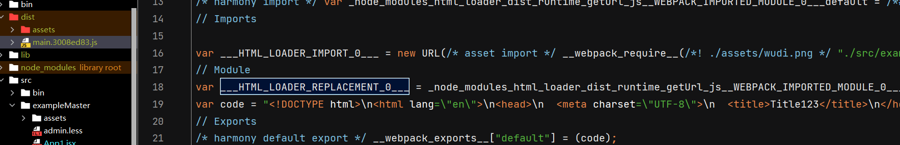

# 其他 Loader

## html-loader*

将 HTML 导出为字符串。当编译器需要时，将压缩 HTML 字符串。也用于解析html内引入img标签的loader。

> 解析 html 打包进入js文件中，img src 解析为模块导入。
>
> ```jsx | pure
> <!DOCTYPE html>
> <html lang="en">
> <head>
> <meta charset="UTF-8">
> <title>Title123</title>
> </head>
> <body>
> <div>123123</div>
> 
> </body>
> </html>
> ```
>
> 打包进入js文件中。
>
> 

**file.js**

```js
import html from "./file.html";
```

**webpack.config.js**

```js
module.exports = {
  module: {
    rules: [
      {
        test: /\.(html|htm)$/,
        loader: "html-loader",
      },
    ],
  },
};
```

### sources

**[`sources`](https://www.webpackjs.com/loaders/html-loader#sources)**默认为true，允许在处理前对内容进行预处理。`true`则启用所有默认元素和属性的处理，而 `false` 则禁用所有属性的处理。

默认情况下，每个可加载属性（例如 - `` ）都将被导入（ `const img = require ('./image.png')` 或 `import img from "./image.png""` ）。

### preprocessor

**[`preprocessor`](https://www.webpackjs.com/loaders/html-loader#preprocessor)**允许在处理前对内容进行预处理，可**用于模板引擎**。

**file.hbs**

```jsx | pure
<div>
  <p>{{firstname}} {{lastname}}</p>
  
<div>
```

**webpack.config.js**

```js
const Handlebars = require("handlebars");

module.exports = {
  module: {
    rules: [
      {
        test: /\.hbs$/i,
        loader: "html-loader",
        options: {
          preprocessor: (content, loaderContext) => {
            let result;
            try {
              result = Handlebars.compile(content)({
                firstname: "Value",
                lastname: "OtherValue",
              });
            } catch (error) {
              loaderContext.emitError(error);

              return content;
            }

            return result;
          },
        },
      },
    ],
  },
};
```

### minimize

**[`minimize`](https://www.webpackjs.com/loaders/html-loader#minimize)**在生产模式下为 `true` ，否则为 `false`告诉 `html-loader` 编译时需要压缩 HTML 字符串。

默认情况下，启用压缩的规则如下：

```js
({
  caseSensitive: true,
  collapseWhitespace: true,
  conservativeCollapse: true,
  keepClosingSlash: true,
  minifyCSS: true,
  minifyJS: true,
  removeComments: true,
  removeRedundantAttributes: true,
  removeScriptTypeAttributes: true,
  removeStyleLinkTypeAttributes: true,
});
```

**webpack.config.js**

```js
module.exports = {
  module: {
    rules: [
      {
        test: /\.html$/i,
        loader: "html-loader",
        options: {
          minimize: true,
        },
      },
    ],
  },
};
```

### esModule

**[`esModule`](https://www.webpackjs.com/loaders/html-loader#esmodule)**启用/禁用 ES modules 语法

默认情况下， `html-loader` 生成使用 ES modules 语法的 JS 模块。 在某些情况下，使用 ES modules 会更好，例如在进行[模块合并](https://www.webpackjs.com/plugins/module-concatenation-plugin/)和 [tree shaking](https://www.webpackjs.com/guides/tree-shaking/) 时。

可以设置为 false 启用 CommonJS 模块语法

### **案例**

#### **webpackIgnore**

通过 `<!-- webpackIgnore: true -->` 注释，可以禁止处理下一个标签的源。

```jsx | pure
<!-- 禁止对 src 属性进行 url 处理 -->
<!-- webpackIgnore: true -->


<!-- 禁止对 src 与 srcset 属性进行 url 处理 -->
<!-- webpackIgnore: true -->


<!-- 禁止对 content 属性进行 url 处理 -->
<!-- webpackIgnore: true -->
<meta itemprop="image" content="./image.png" />

<!-- 禁止对 href 属性进行 url 处理 -->
<!-- webpackIgnore: true -->
<link rel="icon" type="image/png" sizes="192x192" href="./image.png" />
```

#### roots

`resolve.roots` 选项是一个路径数组，用于改变模块解析的根路径。这个配置选项在 Webpack 5 中被引入。

```js
module.exports = {
  // ...
  resolve: {
    roots: [path.resolve(__dirname, "fixtures")],
  },
  // ...
};
```

当你尝试通过绝对路径导入一个模块时，如：

```js
javascriptCopy code
import something from '/example';
```

Webpack 会在 `__dirname + "/fixtures"` 路径下查找 `example` 文件，而不是在文件系统的根目录下查找。

#### CDN

```js
module.exports = {
  module: {
    rules: [
      {
        test: /\.jpg$/,
        type: "asset/resource",
      },
      {
        test: /\.png$/,
        type: "asset/inline",
      },
    ],
  },
  output: {
    publicPath: "http://cdn.example.com/[fullhash]/",
  },
};
```

**file.html**

```jsx | pure

```

**index.js**

```js
require("html-loader!./file.html");

// => ''
```

#### 处理 `script` 和 `link` 标签

**.file** 后缀直接移入打包目录不进行解析，没有 .file 后缀需要使用 css-loader和 babel 解析。

**file.html**

```jsx | pure
<!DOCTYPE html>
<html>
  <head>
    <meta charset="UTF-8" />
    <title>Title of the document</title>
    <link rel="stylesheet" type="text/css" href="./style.file.css" />
  </head>
  <body>
    Content of the document......
    <script src="./script.file.js"></script>
  </body>
</html>
```

**webpack.config.js**

```js
module.exports = {
  module: {
    rules: [
      {
        test: /\.html$/,
        type: "asset/resource",
        generator: {
          filename: "[name][ext]",
        },
      },
      {
        test: /\.html$/i,
        use: ["extract-loader", "html-loader"],
      },
      {
        test: /\.js$/i,
        exclude: /\.file.js$/i,
        loader: "babel-loader",
      },
      {
        test: /\.file.js$/i,
        type: "asset/resource",
      },
      {
        test: /\.css$/i,
        exclude: /\.file.css$/i,
        loader: "css-loader",
      },
      {
        test: /\.file.css$/i,
        type: "asset/resource",
      },
    ],
  },
};
```

#### 导出为 HTML 文件

一种非常常见的情况是将 HTML 导出到自己的 *.html* 文件中，以直接使用， 而非注入到 javascript。 可以使用以下 2 种 loader 的组合来实现：

- [extract-loader](https://github.com/peerigon/extract-loader)
- html-loader

还有 [`asset modules`](https://www.webpackjs.com/guides/asset-modules/)

html-loader 将解析 URL，同时引入图片以及你需要的所有内容。 extract loader 会将 javascript 解析为正确的 html 文件， 然后确保图片被引入且路径正确， [`asset modules`](https://www.webpackjs.com/guides/asset-modules/) 会为你生成 .html 文件。例如：

```js
module.exports = {
  output: {
    assetModuleFilename: "[name][ext]",
  },
  module: {
    rules: [
      {
        test: /\.html$/, // extract-loader 用于抽离html，asset 用于输出到目录
        type: "asset/resource",
        generator: {
          filename: "[name][ext]",
        },
      },
      {
        test: /\.html$/i,
        use: ["extract-loader", "html-loader"],
      },
    ],
  },
};
```


## extract-loader

**webpack 加载器从包中提取 HTML 和 CSS。**extract-loader 的工作原理与[extract-text-webpack-plugin](https://github.com/webpack/extract-text-webpack-plugin)和[mini-css-extract-plugin](https://github.com/webpack-contrib/mini-css-extract-plugin)类似，是它的精简替代品。

文档地址：https://github.com/peerigon/extract-loader

> webpack 5中与 html-loader 同用时，目前有错误 `new URL("./images/nhlt.jpg", **import** .meta.url);`
