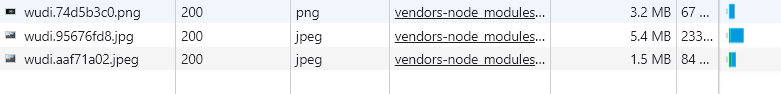
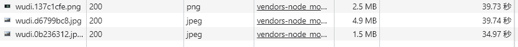
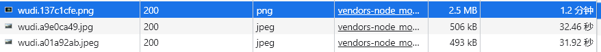

# 其他 minimizer plugin

## image-minimizer-webpack-plugin

Webpack 的插件和加载器，用于**使用 imagemin 优化（压缩）所有图片**。不用担心图片的大小，现在它们**总是**被优化/压缩了。

**文档详情**：https://github.com/webpack-contrib/image-minimizer-webpack-plugin

### 使用

**安装 plugin**

```bash
npm install image-minimizer-webpack-plugin imagemin
```

**推荐用于无损优化的 imagemin 插件**

```bash
npm install imagemin-gifsicle imagemin-jpegtran imagemin-optipng imagemin-svgo --save-dev
```

**推荐用于有损优化的 imagemin 插件**

```bash
npm install imagemin-gifsicle imagemin-mozjpeg imagemin-pngquant imagemin-svgo --save-dev
```

> 报错：C:\WINDOWS\system32\cmd.exe /s /c“autoreconf -ivf”，解决方案使用淘宝镜像 `--registry=https://registry.npm.taobao.org  `。

**无损优化常用案例**

```js
const ImageMinimizerPlugin = require("image-minimizer-webpack-plugin");

module.exports = {
  module: {
    rules: [
      {
        test: /\.(jpe?g|png|gif|svg)$/i,
        type: "asset",
      },
    ],
  },
  optimization: {
    minimizer: [
      "...",
      new ImageMinimizerPlugin({
        minimizer: {
          implementation: ImageMinimizerPlugin.imageminMinify,
          options: {
            // Lossless optimization with custom option
            // Feel free to experiment with options for better result for you
            plugins: [
              ["gifsicle", { interlaced: true }],
              ["jpegtran", { progressive: true }],
              ["optipng", { optimizationLevel: 5 }],
              // Svgo configuration here https://github.com/svg/svgo#configuration
              [
                "svgo",
                {
                  plugins: [
                    {
                      name: "preset-default",
                      params: {
                        overrides: {
                          removeViewBox: false,
                          addAttributesToSVGElement: {
                            params: {
                              attributes: [
                                { xmlns: "http://www.w3.org/2000/svg" },
                              ],
                            },
                          },
                        },
                      },
                    },
                  ],
                },
              ],
            ],
          },
        },
      }),
    ],
  },
};
```

**打包结果**

默认图片大小



打包后图片大小



由 imagemin-jpegtran 换为 imagemin-mozjpeg 后，由无损压缩变为有损压缩。jpg进一步减小。



### 策略

`imageminGenerate` 和 `imageminMinify`，它们在处理图片时采取不同的策略。

`imageminMinify` 方法是用来**压缩**图片的。插件会使用 `imagemin` 和其相关的插件来压缩图像。

`imageminGenerate` 方法用于**生成新的图像格式**，例如，它可以将标准的 JPEG 或 PNG 图像转换为 WebP 格式。

> 使用 imageminGenerate 案例：[优化并生成`webp`图像](https://github.com/webpack-contrib/image-minimizer-webpack-plugin#optimize-and-generate-webp-images)
>
> ```js
> const ImageMinimizerPlugin = require("image-minimizer-webpack-plugin");
> 
> module.exports = {
> optimization: {
> minimizer: [
> "...",
> new ImageMinimizerPlugin({
>   minimizer: {
>     implementation: ImageMinimizerPlugin.imageminMinify,
>     options: {
>       plugins: [
>         "imagemin-gifsicle",
>         "imagemin-mozjpeg",
>         "imagemin-pngquant",
>         "imagemin-svgo",
>       ],
>     },
>   },
>   generator: [
>     {
>       // You can apply generator using `?as=webp`, you can use any name and provide more options
>       preset: "webp",
>       implementation: ImageMinimizerPlugin.imageminGenerate,
>       options: {
>         plugins: ["imagemin-webp"],
>       },
>     },
>   ],
> }),
> ],
> },
> };
> ```

### **api**

#### [`filter`](https://github.com/webpack-contrib/image-minimizer-webpack-plugin#filter)

允许过滤图像以进行优化/生成。返回`true`优化图像。

例子：[根据尺寸优化图像](https://github.com/webpack-contrib/image-minimizer-webpack-plugin#optimize-images-based-on-size)，根据图像大小使用差异选项（例如`progressive`/ `interlaced`/ 等）（例如 - 不要对小图像进行渐进变换）。

> 什么是`progressive`形象？[`Answer here`](https://jmperezperez.com/medium-image-progressive-loading-placeholder/)。

```js
const ImageMinimizerPlugin = require("image-minimizer-webpack-plugin");

module.exports = {
  optimization: {
    minimizer: [
      new ImageMinimizerPlugin({
        minimizer: {
          implementation: ImageMinimizerPlugin.imageminMinify,
          options: {
            plugins: [["jpegtran", { progressive: true }]],
          },
          // Only apply this one to files equal to or over 8192 bytes
          filter: (source) => {
            if (source.byteLength >= 8192) {
              return true;
            }

            return false;
          },
        },
      }),
      new ImageMinimizerPlugin({
        minimizer: {
          implementation: ImageMinimizerPlugin.imageminMinify,
          options: {
            plugins: [["jpegtran", { progressive: false }]],
          },
          // Only apply this one to files under 8192
          filter: (source) => {
            if (source.byteLength < 8192) {
              return true;
            }

            return false;
          },
        },
      }),
    ],
  },
};
```

#### [`filename`](https://github.com/webpack-contrib/image-minimizer-webpack-plugin#filename)

允许设置文件名。例如

```js
const ImageMinimizerPlugin = require("image-minimizer-webpack-plugin");

module.exports = {
  optimization: {
    minimizer: [
      "...",
      new ImageMinimizerPlugin({
        minimizer: {
          filename: "optimized-[name][ext]", // ext 为扩展名，例如：.jpg
          implementation: ImageMinimizerPlugin.squooshMinify,
          // Options
          options: {
            encodeOptions: {
              mozjpeg: {
                quality: 90,
              },
            },
          },
        },
      }),
    ],
  },
};
```

#### type

 `ImageMinimizerPlugin` 的 `type` 属性允许你指定优化器（generator）应该在何种情况下被应用。默认情况下，当使用 `import` 或 `require` 语句引入图片时，优化器就会被触发。但在某些情况下，可能需要对由其他插件引入的图片进行优化，例如使用 `copy-webpack-plugin` 插件复制到输出目录的图片。

在这种情况下，如果你希望 `ImageMinimizerPlugin` 对这些被复制的图片也进行优化，你需要将 `type` 选项设置为 `asset`。这样配置后，`ImageMinimizerPlugin` 就会对编译过程中的所有资产（包括那些被复制的资产）应用图片生成器，生成新的优化过的图片版本。

通常用于 imageminGenerate。

```js
const CopyPlugin = require("copy-webpack-plugin");
const ImageMinimizerPlugin = require("image-minimizer-webpack-plugin");

module.exports = {
  optimization: {
    minimizer: [
      "...",
      new ImageMinimizerPlugin({
        minimizer: {
          implementation: ImageMinimizerPlugin.imageminMinify,
          options: {
            plugins: [
              "imagemin-gifsicle",
              "imagemin-mozjpeg",
              "imagemin-pngquant",
              "imagemin-svgo",
            ],
          },
        },
        generator: [
          {
            // Apply generator for copied assets
            type: "asset",
            // You can use `ImageMinimizerPlugin.squooshGenerate`
            // You can use `ImageMinimizerPlugin.sharpGenerate`
            implementation: ImageMinimizerPlugin.imageminGenerate,
            options: {
              plugins: ["imagemin-webp"],
            },
          },
        ],
      }),
    ],
  },
  plugins: [new CopyPlugin({ patterns: ["images/**/*.png"] })],
};
```

#### [`preset`](https://github.com/webpack-contrib/image-minimizer-webpack-plugin#preset)

配置预设的名称，允许后缀名添加 `?as=name`。

例如添加 as=webp 后缀名，允许该文件（`image.png`）转化为 webp

```js
const myImage4 = new URL("image.png?as=webp&w=150&h=120", import.meta.url);
```

```js
const ImageMinimizerPlugin = require("image-minimizer-webpack-plugin");

module.exports = {
  optimization: {
    minimizer: [
      "...",
      new ImageMinimizerPlugin({
        generator: [
          {
            preset: "webp",
            // Implementation
            implementation: ImageMinimizerPlugin.squooshMinify,
          },
        ],
      }),
    ],
  },
};
```

## CssMinimizerWebpackPlugin

这个插件使用 [cssnano](https://cssnano.co/) 优化和压缩 CSS。

> ```js
> const MiniCssExtractPlugin = require("mini-css-extract-plugin");
> const CssMinimizerPlugin = require("css-minimizer-webpack-plugin");
> 
> module.exports = {
> module: {
>  rules: [
>    {
>      test: /.s?css$/,
>      use: [MiniCssExtractPlugin.loader, "css-loader", "sass-loader"],
>    },
>  ],
> },
> optimization: {
>  minimizer: [
>    // 在 webpack@5 中，你可以使用 `...` 语法来扩展现有的 minimizer（即 `terser-webpack-plugin`），将下一行取消注释
>    // `...`, // 使用扩展运算符保留 webpack 默认的 minimizer
>    new CssMinimizerPlugin(),
>  ],
> },
> plugins: [new MiniCssExtractPlugin()],
> };
> ```

### API

#### `test`

用来匹配文件。

```js
test = /\.css(\?.*)?$/i
```

#### `include`

要包含的文件。详情参考 module 中的 include 属性

> ```js
> module.exports = {
> optimization: {
>  minimize: true,
>  minimizer: [
>    new CssMinimizerPlugin({
>      include: /\/includes/,
>    }),
>  ],
> },
> };
> ```

#### `exclude`

要排除的文件。

#### `parallel`

使用多进程并发执行，提升构建速度。 运行时默认的并发数：`os.cpus().length - 1`。

```js
parallel = true
```

#### `minify`

允许自定义压缩函数。

默认情况下，插件使用  [cssnano](https://github.com/cssnano/cssnano) 包。

可选配置：

- CssMinimizerPlugin.cssnanoMinify
- CssMinimizerPlugin.cssoMinify
- CssMinimizerPlugin.cleanCssMinify
- CssMinimizerPlugin.esbuildMinify
- `async (data, inputMap, minimizerOptions) => {return {code: "a{color: red}", map: "...", warnings: [], errors: []}}`

> ⚠️ **启用 `parallel` 选项时，始终在 `minify` 函数中使用 `require`**。

#### `minimizerOptions`

Cssnano 优化 [选项](https://cssnano.co/docs/optimisations).

```js
minimizerOptions = { preset: 'default' }
```

| 优化                                                         | 默认 | **advanced** | **lite** | 属性名                   |
| :----------------------------------------------------------- | :--- | :----------- | :------- | ------------------------ |
| [自动前缀器](https://cssnano.co/docs/optimisations/autoprefixer) | ❌    | ✅            | ❌        | autoprefixer             |
| [css声明排序器](https://cssnano.co/docs/optimisations/cssdeclarationsorter) | ✅    | ✅            | ❌        | cssDeclarationSorter     |
| [计算](https://cssnano.co/docs/optimisations/calc)           | ✅    | ✅            | ❌        | calc                     |
| [色度](https://cssnano.co/docs/optimisations/colormin)       | ✅    | ✅            | ❌        | colormin                 |
| [转换值](https://cssnano.co/docs/optimisations/convertvalues) | ✅    | ✅            | ❌        | convertValues            |
| [丢弃评论](https://cssnano.co/docs/optimisations/discardcomments) | ✅    | ✅            | ✅        | discardComments          |
| [丢弃重复项](https://cssnano.co/docs/optimisations/discardduplicates) | ✅    | ✅            | ❌        | discardDuplicates        |
| [丢弃空](https://cssnano.co/docs/optimisations/discardempty) | ✅    | ✅            | ✅        | discardEmpty             |
| [丢弃覆盖](https://cssnano.co/docs/optimisations/discardoverridden) | ✅    | ✅            | ❌        | discardOverridden        |
| [丢弃未使用的](https://cssnano.co/docs/optimisations/discardunused) | ❌    | ✅            | ❌        | discardUnused            |
| [合并标识](https://cssnano.co/docs/optimisations/mergeidents) | ❌    | ✅            | ❌        | mergeIdents              |
| [合并手写](https://cssnano.co/docs/optimisations/mergelonghand) | ✅    | ✅            | ❌        | mergeLonghand            |
| [合并规则](https://cssnano.co/docs/optimisations/mergerules) | ✅    | ✅            | ❌        | mergeRules               |
| [缩小字体值](https://cssnano.co/docs/optimisations/minifyfontvalues) | ✅    | ✅            | ❌        | minifyFontValues         |
| [缩小梯度](https://cssnano.co/docs/optimisations/minifygradients) | ✅    | ✅            | ❌        | minifyGradients          |
| [缩小参数](https://cssnano.co/docs/optimisations/minifyparams) | ✅    | ✅            | ❌        | minifyParams             |
| [缩小选择器](https://cssnano.co/docs/optimisations/minifyselectors) | ✅    | ✅            | ❌        | minifySelectors          |
| [规范化字符集](https://cssnano.co/docs/optimisations/normalizecharset) | ✅    | ✅            | ❌        | normalizeCharset         |
| [规范化显示值](https://cssnano.co/docs/optimisations/normalizedisplayvalues) | ✅    | ✅            | ❌        | normalizeDisplayValues   |
| [标准化位置](https://cssnano.co/docs/optimisations/normalizepositions) | ✅    | ✅            | ❌        | normalizePositions       |
| [标准化重复样式](https://cssnano.co/docs/optimisations/normalizerepeatstyle) | ✅    | ✅            | ❌        | normalizeRepeatStyle     |
| [规范化字符串](https://cssnano.co/docs/optimisations/normalizestring) | ✅    | ✅            | ❌        | normalizeString          |
| [规范化定时函数](https://cssnano.co/docs/optimisations/normalizetimingfunctions) | ✅    | ✅            | ❌        | normalizeTimingFunctions |
| [规范化Unicode](https://cssnano.co/docs/optimisations/normalizeunicode) | ✅    | ✅            | ❌        | normalizeUnicode         |
| [规范化网址](https://cssnano.co/docs/optimisations/normalizeurl) | ✅    | ✅            | ❌        | normalizeUrl             |
| [归一化空白](https://cssnano.co/docs/optimisations/normalizewhitespace) | ✅    | ✅            | ✅        | normalizeWhitespace      |
| [有序值](https://cssnano.co/docs/optimisations/orderedvalues) | ✅    | ✅            | ❌        | orderedValues            |
| [减少标识](https://cssnano.co/docs/optimisations/reduceidents) | ❌    | ✅            | ❌        | reduceIdents             |
| [减少初始值](https://cssnano.co/docs/optimisations/reduceinitial) | ✅    | ✅            | ❌        | reduceInitial            |
| [减少变换](https://cssnano.co/docs/optimisations/reducetransforms) | ✅    | ✅            | ❌        | reduceTransforms         |
| [svgo](https://cssnano.co/docs/optimisations/svgo)           | ✅    | ✅            | ❌        | svgo                     |
| [独特的选择器](https://cssnano.co/docs/optimisations/uniqueselectors) | ✅    | ✅            | ❌        | uniqueSelectors          |
| [z指数](https://cssnano.co/docs/optimisations/zindex)        | ❌    | ✅            | ❌        | zindex                   |

### 案例

#### 移除所有注释

移除所有注释（包括以 `/*!` 开头的注释）。

```js
module.exports = {
  optimization: {
    minimizer: [
      new CssMinimizerPlugin({
        minimizerOptions: {
          preset: [
            "default",
            {
              discardComments: true,
            },
          ],
        },
      }),
    ],
  },
};
```

### 注意问题

#### 关于 source maps 的提示

仅对 [`devtool`](https://webpack.docschina.org/configuration/devtool/) 配置项的 `source-map`、`inline-source-map`、`hidden-source-map` 与 `nosources-source-map` 值生效。
