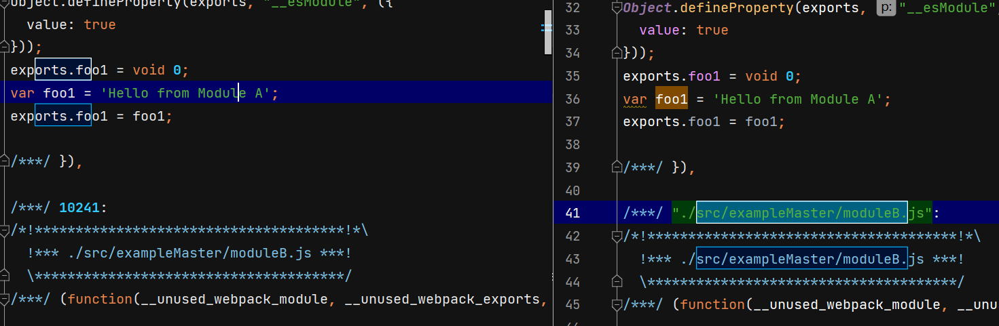
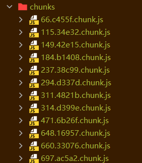
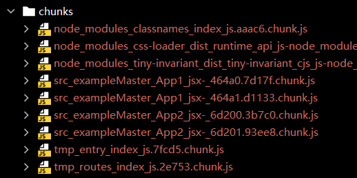
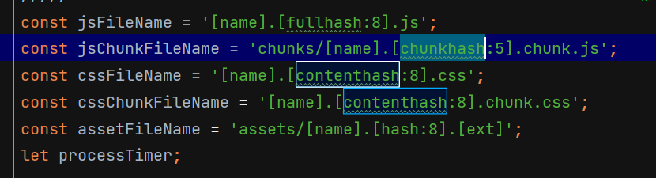
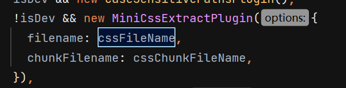

# optimization 优化选项

配置 optimization 选项，其用于打包时代码优化与缩小

optimization 选项根据webpack 的 config/defaults.js文件标注的，关于生产/开发环境的默认分类整理。

## **共有的配置项**

设置 production 和 development 配置项时都会设置的属性。

### removeAvailableModules

当Webpack在构建过程中解析模块和生成chunk时，它会跟踪每个模块的依赖关系和它们在哪里被包含。如果一个模块已经被包含在某个已经生成的chunk中，而 `optimization.removeAvailableModules` 设置为 `true`，那么Webpack将不会再次将这个模块添加到其他的chunk中。新版本中默认关闭因为比较耗费性能。

```js
optimization.removeAvailableModules:false; // 新版本默认关闭
```

### removeEmptyChunks

移除所有空的 chunks。空的 chunks 指的是那些没有包含任何模块的 chunks。

```js
optimization.removeEmptyChunks:true; // 默认开启
```

### mergeDuplicateChunks

告知 webpack 合并含有相同模块的 chunk（他们都不多不少有相同的模块，几乎一样，就合并）。

```js
optimization.mergeDuplicateChunks:true; // 默认开启
```

### providedExports

告知 webpack 导出内容由那些模块提供。本质上是一个模块**导出信息**的**列表**。它与 **`usedExports`** 配合使用

在一个模块中，可能有多个导出，但并不是所有导出都会被使用。为了优化打包的结果和减少输出的大小，tree shaking 过程中会删除这些没有被使用的代码。这就需要 providedExports 的标记。

```js
optimization.providedExports: true
```

### runtimeChunk

当Webpack打包模块时，它需要生成一些运行时代码来处理模块加载、模块解析等任务。这部分代码并不直接与源代码相关，通过runtimeChunk可以放入**单独的chunk中**。

如果运行时代码放在入口文件中，我们一些模块变会引起入口文件hash值变化从而重新下载，不利于浏览器进行缓存。

```js
optimization.runtimeChunk: false
```

- `'single'`: 创建一个运行时文件，用于所有创建的chunks。
- `'multiple'`: 为每个入口创建一个运行时文件。这在多入口场景下可能更有用。
- `false` (默认值): 不创建任何运行时文件，将运行时代码直接注入到入口chunks中。

### portableRecords

使用 `records` 参数（可能来源于外部配置），webpack 会生成可携带的记录文件。

当你使用 webpack 构建应用程序时，每个模块都会被分配一个内部 ID。当你更改或添加新模块时，这些 ID 可能会发生变化，这将导致客户端缓存的文件无效。为了改进长期缓存，webpack 提供了记录功能，将模块 ID 与其对应的资源文件相关联。`optimization.portableRecords` 选项确保这些记录是“可携带”的，即它们不会受到构建机器细微差异的影响。

```
optimization.portableRecords:true
```

配置 [`recordsPath`](https://www.webpackjs.com/configuration/other-options/#recordspath), [`recordsInputPath`](https://www.webpackjs.com/configuration/other-options/#recordsinputpath)，[`recordsOutputPath`](https://www.webpackjs.com/configuration/other-options/#recordsoutputpath) 后自动启用

### 附-mangleWasmImports

在设置为 `true` 时，告知 webpack 通过将导入修改为更短的字符串，来减少 WASM 大小。这会破坏模块和导出名称。

```js
optimization.runtimeChunk: false
```

> **WebAssembly** 它是一种低级的字节码格式，具有类似于汇编语言的结构，通过编写c/c++可以编译为WASM，从而使代码运行到浏览器上。

## prduction

### flagIncludedChunks

告诉 webpack 确定和标记出作为其他 chunk 子集的那些 chunk，其方式是在已经加载过较大的 chunk 之后，就不再去加载这些 chunk 子集。

```js
optimization.flagIncludedChunks: true,
```

### moduleIds（chunkIds）

告知 webpack 当选择模块 id （chunk id）时需要使用哪种算法。将 `optimization.moduleIds` 设置为 `false` 会告知 webpack 没有任何内置的算法会被使用，但自定义的算法会由插件提供。

```js
optimization.moduleIds: 'deterministic',
optimization.chunkIds: 'deterministic',
```

| 选荐值          | 描述                                  |
| :-------------- | :------------------------------------ |
| `natural`       | 按使用顺序的数字 id。                 |
| `named`         | 对调试更友好的可读的 id。             |
| `deterministic` | 被哈希转化成的小位数值模块名。        |
| `size`          | 专注于让初始下载包大小更小的数字 id。 |







### sideEffects

一个模块的副作用（side effect）是指：模块执行过程中不仅仅有导出结果，还有一些其他作用，例如模块可能会修改全局变量、读取或写入文件、调用Web API等。

如果一个模块没有副作用，没有导出时，Webpack可以安全地移除它。但如果一个模块具有副作用，即使没有导出，Webpack需要更小心。Tree shaking （摇树）特性，就利用这一点，通过 `optimization.sideEffects` 能帮助Webpack更准确地进行这种判断。

```js
optimization.sideEffects:true
```

设置为 "flag" 时，手动指定模块是否有副作用，Webpack 会依赖于每个**模块（package.json 中设置）**中的 `sideEffects` 标记来决定是否该模块可以进行 tree shaking。

设置为 false 时，示该包中的所有模块都没有副作用，因此都可以被 tree shaking。

> 当模块只包含无副作用的语句时，此模块也会被标记为无副作用。

### usedExports

**标记模块中已被使用的导出**（即被其他模块所导入的导出），这样在进行tree shaking时，未被使用的导出可以被删除，从而减少打包输出的大小。

usedExports 也取决于 [`optimization.providedExports`](https://www.webpackjs.com/configuration/optimization/#optimizationoccurrenceorder) 选项的配置。

> 如果 providedExports 为 false ，因为没有明确的导出列表，最终打包输出可能包含更多的代码。

```js
optimization.usedExports:true
```

### innerGraph

用于标记模块内部的变量和函数调用，判断它们是否在模块的执行路径中真正被使用，从而在最终的输出中删除未使用的代码。增强tree shaking的能力。

```js
optimization.innerGraph:true
```

选项被启用时，Webpack会构建**模块的内部依赖图**，然后根据这个依赖图来确定哪些代码是真正被执行的。

### mangleExports

对模块的导出进行重命名，导出重命名为一个更短的、不那么可读的名称，如 `a` 或 `f1`，以减少输出大小，它特别有助于压缩代码。

`mangleExports` 主要作用于 Webpack 的“chunk”级别，而不是单个模块级别。这意味着只有当一个导出跨越了多个 chunk 并被多个 chunk 使用时，它的名称才可能被压缩。

```js
optimization.mangleExports:true
```

### concatenateModules 

Webpack在解析模块依赖图时，会尝试确定哪些模块可以安全地放在同一个作用域中。然后，它会合并这些模块，尽量减少生成的闭包函数。

这并不总是可能的，尤其是当存在某些模块评估的副作用时。在这些情况下，Webpack会选择保持模块分离，以确保代码的正确性。

这取决于 [`optimization.providedExports`](https://www.webpackjs.com/configuration/optimization/#optimizationprovidedexports) 和 [`optimization.usedExports`](https://www.webpackjs.com/configuration/optimization/#optimizationusedexports)的配置。

```js
optimization.concatenateModules:true
```

### realContentHash

在构建结束之后，webpack 通常会计算内容哈希值。contentHash 通常用于处理静态资源内容变更与缓存。

用于确保当文件内容发生变化时，文件的哈希值也会发生变化。这对于缓存策略尤其重要，因为它可以确保文件的内容真正发生变化时，客户端会下载更新的文件。

```js
optimization.realContentHash:true
```

- `realContentHash: true`：生成的哈希值更准确地反映了文件内容的变化。即使模块标识符在不同的构建之间发生变化，只要内容没有变，哈希值就不会变。
- `realContentHash: false`：哈希值可能会因为模块标识符的变化而变化，而不仅仅是因为内容的变化。

**设置方式**

我们设置css文件的输出名称时，可以使用contenthash来引用计算的哈希值





### minimize

告知 webpack 使用 [TerserPlugin](https://www.webpackjs.com/plugins/terser-webpack-plugin/) 或其它在 [`optimization.minimizer`](https://www.webpackjs.com/configuration/optimization/#optimizationminimizer)定义的插件压缩 bundle。

```
optimization.minimize:true
```

### minimizer

允许你通过提供一个或多个定制过的 [TerserPlugin](https://www.webpackjs.com/plugins/terser-webpack-plugin/) 实例，覆盖默认压缩工具(minimizer)

```js
optimization.minimizer = () => [
    {
        apply: compiler => {
            // 延迟加载Terser插件
            const TerserPlugin = require("terser-webpack-plugin");
            new TerserPlugin({
                terserOptions: {
                    compress: {
                        passes: 2
                    }
                }
            }).apply(compiler);
        }
    }
])
```

通常设置一个数组：[TerserPlugin]  或  [function (compiler)]

### nodeEnv

 `process.env.NODE_ENV` 设置为一个给定字符串。

`optimization.nodeEnv` **默认值**取决于 [mode](https://www.webpackjs.com/concepts/mode/)

```js
F(optimization, "nodeEnv", () => {
		if (production) return "production";
		if (development) return "development";
		return false;
});
```

如果设置为false则不设置值进去。

## development

### moduleIds （chunkIds）

解释同上

```js
optimization.moduleIds: 'named',
optimization.chunkIds: 'named',
```

### sideEffects

解释同上

```js
optimization.sideEffects: 'flag'
```

### emitOnErrors

当你运行Webpack并遇到某些错误（例如源代码中的语法错误）时，默认的行为是阻止生成包含错误的输出文件，因为这样的文件在浏览器中运行时很可能会失败。`emitOnErrors` 允许你控制这个行为。

有点类似于 `bail: true` 如果失败，则停止webpack打包。

```js
optimization.emitOnErrors:true
```


## Q & A


### 命名时 chunkhash 和 contenthash 和 fullhash 区别

**chunkhash**：

它是基于**特定 chunk 内容**的**哈希值**。如果该chunk的任何内容发生变化（例如，模块内容的改变），那么哈希值也会改变。这通常用于长期缓存，因为只有当chunk的实际内容改变时，客户端才需要下载新的文件。

**contenthash**：

`contenthash` 是基于加载到 chunk 中的**特定资源内容**的**哈希值**（处理静态资源内容），这通常是指与**特定的加载器**或**插件**相关的**内容**。

**fullhash**:

每次构建时，`fullhash` 都会改变，无论构建的实际内容是否有所不同。

总结：contenthash 通常用于 MiniCssExtractPlugin 中，在CSS内容实际发生变化时，hash值改变。

chunkhash 更多地关注整个 chunk 的内容，通常用于 output 的设置中。
