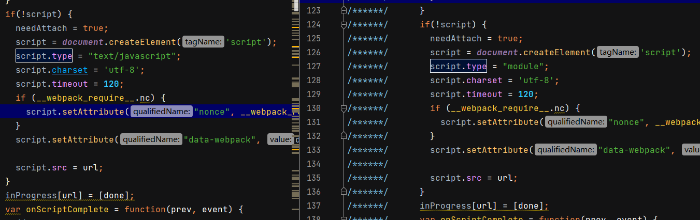

# output

## asyncChunks

创建按需加载的异步 chunk。

```js
output.asyncChunks = true
```

## charset

告诉 webpack 为 HTML 的 `<script>` 标签添加 `charset="utf-8"` 标识。

```js
 output.charset = true
```

## chunkFilename*

此选项决定了非初始（non-initial）chunk 文件的名称。有关可取的值的详细信息，请查看 [`output.filename`](https://www.webpackjs.com/configuration/output/#outputfilename) 选项。

> ```js
> const jsChunkFileName = 'chunks/[name].[chunkhash:5].chunk.js';
> ```

```js
output.chunkFilename = '[id].js'
```

## chunkLoadingGlobal

webpack 用于加载 chunk 的全局变量。

```js
output.chunkLoadingGlobal = 'webpackChunkwebpack'
```

## chunkFormat*

**指定 chunk 代码块的格式**。

认包含 `'array-push'` (web/WebWorker)、`'commonjs'` (node.js)、`'module'` (ESM)，还有其他情况可由插件添加

```js
output.chunkFormat = 'array-push '
```

> 当设置 array-push 之外的值时，文件都打入一个 chunk 文件内。
>
> 
>
> 当设置 array-push 后
>
> 
>
> - 当设置 `output.chunkFormat` 为 `module` 时，Webpack 会使用 ES 模块格式。在这种格式下，所有模块可能会被合并成一个文件，特别是当你的项目比较小或者配置得当时。ES 模块格式更适合现代浏览器，并且通常会有更好的模块化和树摇（tree-shaking）效果。
> - 当设置 `output.chunkFormat` 为 `array-push` 时，Webpack 会使用一个较为传统的格式，每个模块都会被封装在一个数组推送（array-push）的结构中。这种格式通常会导致生成多个文件，因为它不那么侧重于模块合并。这种方式可能更适合需要细粒度控制的场景，或者在支持较旧的浏览器环境下工作时。

```js
// 该选项的默认值取决 target 和 output.module 的设置。
if (output.module) {
    if (tp.dynamicImport) return "module";
    if (tp.document) return "array-push";
} else {
    if (tp.document) return "array-push";
    if (tp.require) return "commonjs";
    if (tp.nodeBuiltins) return "commonjs";
    if (tp.importScripts) return "array-push";
```

## chunkLoading*

**加载** chunk 的方法（默认值有 `'jsonp'` (web)、`'import'` (ESM)、`'importScripts'` (WebWorker)、`'require'` (sync node.js)、`'async-node'` (async node.js)，还有其他值可由插件添加)。

> 设置 require 和 import-scripts前后
>
> 
>
> 设置import 和 import-scripts
>
> 

```js
switch (output.chunkFormat) {
    case "array-push":
        if (tp.document) return "jsonp";
        if (tp.importScripts) return "import-scripts";
        break;
    case "commonjs":
        if (tp.require) return "require";
        if (tp.nodeBuiltins) return "async-node";
        break;
    case "module":
        if (tp.dynamicImport) return "import";
        break;
}
```

## clean*

是否清空output目录内容

```js
output.clean = false
```

`clean: true` 在生成文件之前清空 output 目录。

`clean.dry: true` 打印而不是删除应该移除的静态资源。

`clean.keep: /ignored\/dir\//` 保留 'ignored/dir' 下的静态资源。

## compareBeforeEmit*

检查**输出的文件**是否**源文件已经修改**。

如果设置为true，内容没有改变时，即使 clean 为 true。文件也不会删除。

如果修改webpack文件作为测试，这个属性通常设置为 false，这样每次都会删除output。

```js
output.compareBeforeEmit= true
```

## crossOriginLoading

告诉 webpack 启用 [cross-origin 属性](https://developer.mozilla.org/en/docs/Web/HTML/Element/script#attr-crossorigin) 加载 chunk。仅在 [`target`](https://www.webpackjs.com/configuration/target/) 设置为 `'web'` 时生效，通过使用 JSONP 来添加脚本标签，实现按需加载模块。

- `'anonymous'` - **不带凭据(credential)** 启用跨域加载
- `'use-credentials'` - **携带凭据(credential)** 启用跨域加载

## hashDigest*

**文件内容发生变化**时，Webpack 会**生成**一个新的唯一的**散列值**，这有助于缓存管理，尤其是在浏览器环境中。

> ```js
> output: {
>   filename: '[name].[contenthash].js',
>   hashDigest: 'base64'
> }
> ```

```js
output.hashDigest = 'hex'
```

1. **`'hex'`**: 将散列的摘要表示为十六进制编码。
2. **`'latin1'`**: 将散列的摘要表示为 Latin-1 字符集编码。
3. **`'base64'`**: 将散列的摘要表示为 Base64 编码。

## hashDigestLength

散列摘要的前缀长度。

```js
output.hashDigestLength = 20
```

## hotUpdateChunkFilename

自定义热更新 chunk 的文件名。可选的值的详细信息，请查看 [`output.filename`](https://www.webpackjs.com/configuration/output/#outputfilename) 选项。

其中值唯一的占位符是 `[id]` 和 `[fullhash]`。

```js
output.hotUpdateChunkFilename = '[id].[fullhash].hot-update.js'
```

## hotUpdateGlobal

只在 [`target`](https://www.webpackjs.com/configuration/target/) 设置为 `'web'` 时使用，用于加载热更新(hot update)的 JSONP 函数。

JSONP 函数用于异步加载(async load)热更新(hot-update) chunk。

```js
F(output, "hotUpdateGlobal", () =>
    Template.toIdentifier(
        "webpackHotUpdate" +
            Template.toIdentifier(
                /** @type {NonNullable<Output["uniqueName"]>} */ (output.uniqueName)
            )
    )
);
```

## hotUpdateMainFilename

自定义热更新的主文件名(main filename)。`[fullhash]` 和 `[runtime]` 均可作为占位符。

```js
output.hotUpdateMainFilename = '[runtime].[fullhash].hot-update.json'
```

## globalObject*

当输出为 library 时，尤其是当 `libraryTarget` 为 `'umd'`时，此选项将决定使用哪个**全局对象来挂载 library**。

为了使 UMD 构建在浏览器和 Node.js 上均可用，应将 `output.globalObject` 选项设置为 `'this'`。

对于类似 web 的目标，默认为 `self`。

```js
F(output, "globalObject", () => {
    if (tp) {
        if (tp.global) return "global";
        if (tp.globalThis) return "globalThis";
    }
    return "self";
});
```

## iife*

告诉 webpack 添加 [IIFE](https://developer.mozilla.org/en-US/docs/Glossary/IIFE) 外层包裹生成的代码（自执行匿名函数）。

> 

```js
output.iife = true
```

## library*

输出一个库，为你的入口做导出。

> **webpack.config.js**
>
> ```js
> module.exports = {
>   // …
>   entry: './src/index.js',
>   output: {
>     library: 'MyLibrary',
>   },
> };
> ```
>
> 假设你在 `src/index.js` 的入口中导出了如下函数：
>
> ```js
> export function hello(name) {
>   console.log(`hello ${name}`);
> }
> ```
>
> 此时，变量 `MyLibrary` 将与你的入口文件所导出的文件进行绑定，下面是如何使用 webpack 构建的库的实现：
>
> ```html
> <script src="https://example.org/path/to/my-library.js"></script>
> <script>
>   MyLibrary.hello('webpack');
> </script>
> ```

### name

指定库的名称。

```ts
// 入参类型
string | string[] | {amd?: string, commonjs?: string, root?: string | string[]}
```

### type*

类型默认包括 `'var'`、 `'module'`、 `'assign'`、 `'assign-properties'`、 `'this'`、 `'window'`、 `'self'`、 `'global'`、 `'commonjs'`、 `'commonjs2'`、 `'commonjs-module'`、 `'commonjs-static'`、 `'amd'`、 `'amd-require'`、 `'umd'`、 `'umd2'`、 `'jsonp'` 以及 `'system'`，除此之外也可以通过插件添加。

**`var`** (默认值): 当库输出为一个变量时使用。例如，当输出一个名为 `MyLibrary` 的库时，它将可用于全局作用域下的 `MyLibrary` 变量。

```
var MyLibrary = _entry_return_;

// 在加载了 `MyLibrary` 的单独脚本中
MyLibrary.doSomething();
```

**`module`**: 使用此类型可以输出 ES6 类型的模块。这意味着在支持 ES6 模块的环境中，你可以使用 `import` 语句来引入该库。

**`assign`**: 生成一个隐含的全局变量，它有可能重新分配一个现有的值（请谨慎使用）：

```js
MyLibrary = _entry_return_;
```

**`assign-properties`**: 将导出直接赋值到一个已存在的变量的属性中。如果变量不存在，它会抛出一个错误。与 [`type: 'assign'`](https://www.webpackjs.com/configuration/output/#type-assign) 相似但是更安全。

```js
// 仅在当其不存在是创建 MyLibrary
MyLibrary = typeof MyLibrary === 'undefined' ? {} : MyLibrary;
// 然后复制返回值到 MyLibrary
// 与 Object.assign 行为类似

// 例如，你像下面这样在你的入口导出一个 `hello` 函数
export function hello(name) {
  console.log(`Hello ${name}`);
}

// 在另外一个已经加载 MyLibrary 的脚本中
// 你可以像这样运行 `hello` 函数
MyLibrary.hello('World');
```

**`this`**: 该类型将库赋值到 `this` 对象。这通常用于创建浏览器中的全局变量。

```js
this['MyLibrary'] = _entry_return_;

// 在一个单独的脚本中
this.MyLibrary.doSomething();
MyLibrary.doSomething(); // 如果 `this` 为 window 对象
```

**`window`**: 这会将库直接赋值给浏览器的 `window` 对象，使得库成为全局可访问的。

```js
window['MyLibrary'] = _entry_return_;

window.MyLibrary.doSomething();
```

**`self`**: 这会将库赋值给 `self` 对象。在 Web Workers 中，`self` 指向全局作用域。

**`global`**: 将库赋值给全局对象，这在不同的环境中可能是不同的东西（例如，在 Node.js 中是 `global`，在浏览器中是 `window`）。

**`commonjs`**: 这会输出为一个 CommonJS 模块，因此它可以在像 Node.js 这样的环境中被 `require`。

```js
exports['MyLibrary'] = _entry_return_;

require('MyLibrary').doSomething();
```

**`commonjs2`**: 和 `commonjs` 类似，但不会添加属性，而是直接导出。

```js
module.exports = _entry_return_;

require('MyLibrary').doSomething();
```

**`amd`**: 将库输出为一个 AMD (Asynchronous Module Definition) 模块，使其可以被 AMD 脚本加载器（如 RequireJS）加载。

```js
define('MyLibrary', [], function () {
  return _entry_return_;
});
```

**`umd`**: Universal Module Definition。这种类型尝试结合 `amd`, `commonjs` 和 `var`，这样库就可以在多种环境中工作，包括浏览器和 Node.js。

```js
(function webpackUniversalModuleDefinition(root, factory) {
  if (typeof exports === 'object' && typeof module === 'object')
    module.exports = factory();
  else if (typeof define === 'function' && define.amd) define([], factory);
  else if (typeof exports === 'object') exports['MyLibrary'] = factory();
  else root['MyLibrary'] = factory();
})(global, function () {
  return _entry_return_;
});
```

**`jsonp`**: 这使库可以通过 JSONP 进行加载。

**`commonjs-module`**: 这种类型的输出是为了支持ECMAScript模块语法（`import` / `export`）在 CommonJS 环境中的行为。它会使输出与Node.js中的ECMAScript模块相似。这对于某些情况下与CommonJS和ECMAScript模块混合使用可能是有用的。

**`commonjs-static`**: 这种类型的输出相当于一个固定的、不可变的 CommonJS 模块。它不会使用到如 `require`, `module`, `exports` 这样的 CommonJS 变量，而是创建一个静态的模块定义。

**`system`**: 这种类型的输出是为了支持SystemJS模块加载器。SystemJS是一个动态模块加载器，它可以在浏览器中加载ESM（ECMAScript模块）、CommonJS、AMD和Global模块。使用`system`作为`library.type`，Webpack会生成一个可以被SystemJS加载的模块。

```js
System.register(
  'MyLibrary',
  [],
  function (__WEBPACK_DYNAMIC_EXPORT__, __system_context__) {
    return {
      execute: function () {
        // ...
      },
    };
  }
);
```

### export

指定一个导出路径，按照设置导出内容

```js
module.exports = {
  output: {
    library: {
      name: 'MyLibrary',
      type: 'var',
      export: ['default', 'subModule'],
    },
  },
};
```

这里就是库代码：

```js
var MyLibrary = _entry_return_.default.subModule;
```

### auxiliaryComment

在 UMD 包装器中添加注释。

```js
module.exports = {
  // …
  mode: 'development',
  output: {
    library: {
      name: 'MyLibrary',
      type: 'umd',
      auxiliaryComment: 'Test Comment',
    },
  },
};
```

这将产生以下结果：

```js
(function webpackUniversalModuleDefinition(root, factory) {
  //Test Comment
  if (typeof exports === 'object' && typeof module === 'object')
    module.exports = factory();
  //Test Comment
  else if (typeof define === 'function' && define.amd) define([], factory);
  //Test Comment
  else if (typeof exports === 'object') exports['MyLibrary'] = factory();
  //Test Comment
  else root['MyLibrary'] = factory();
})(self, function () {
  return _entry_return_;
});
```

> 也可以更细的颗粒度
>
> ```js
>   auxiliaryComment: {
>     root: 'Root Comment',
>     commonjs: 'CommonJS Comment',
>     commonjs2: 'CommonJS2 Comment',
>     amd: 'AMD Comment',
>   },
> ```

### umdNamedDefine

当使用 `output.library.type: "umd"` 时，将 `output.library.umdNamedDefine` 设置为 `true`。会把设置的 name 应用到 amd 的构建上

```js
// 如果为true
define('MyLibrary', [], factory);
// 如果为false
define([], factory);
```

## libraryTarget

请使用 [`output.library.type`](https://www.webpackjs.com/configuration/output/#outputlibrarytype) 代理，因为我们可能在未来**放弃**对 `output.libraryTarget` 的支持。

## module

以模块类型输出 JavaScript 文件。由于此功能还处于实验阶段，默认禁用。

> 当启用时，webpack 会在内部将 [`output.iife`](https://www.webpackjs.com/configuration/output/#outputiife) 设置为 `false`，将 [`output.scriptType`](https://www.webpackjs.com/configuration/output/#outputscripttype) 为 `'module'`，并将 `terserOptions.module` 设置为 `true`

> ```js
> module.exports = {
>   //...
>   experiments: {
>     outputModule: true,
>   },
>   output: {
>     module: true,
>   },
> };
> ```

```js
output.module = false
```


## path*

output 目录对应一个**绝对路径**。

```js
output.path = path.join(process.cwd(), 'dist')
```

## pathinfo*

告知 webpack 在 bundle 中引入「所包含模块信息」的**相关注释**。

```js
// development
output.pathinfo = true
// production 
output.pathinfo = false
```

当值为 `'verbose'` 时，会显示更多信息，如 export，运行时依赖以及 bailouts。


## publicPath*

它指定了输出文件的公共 URL 地址或路径。换句话说，它决定了浏览器如何去请求 Webpack 输出的文件。

当你的应用程序或库加载某些资源时（例如图像、字体、分割的 JavaScript 文件等），它们的 URL 地址将基于 `output.publicPath`。

1. **默认值**: 如果不设置 `publicPath`，它的默认值是空字符串 `''`。

   ```
   jsCopy codeoutput: {
     publicPath: ''
   }
   ```

   如果你的入口文件（例如 `main.js`）里有一个导入的图片 `image.jpg`，Webpack 将会输出这个图片到 `dist` 目录下，浏览器将直接从相对路径加载这个图片，例如：`/image_hash.jpg`。

2. **设置特定路径**:

   ```
   jsCopy codeoutput: {
     publicPath: '/assets/'
   }
   ```

   在这个设置下，如果你的入口文件里有一个导入的图片 `image.jpg`，浏览器将从 `/assets/image_hash.jpg` 加载这个图片。

3. **设置 CDN 路径**:

   ```
   jsCopy codeoutput: {
     publicPath: 'https://cdn.example.com/'
   }
   ```

   这里，所有的资源将通过指定的 CDN 路径加载。例如，一个导入的 `image.jpg` 将会从 `https://cdn.example.com/image_hash.jpg` 被加载。

## scriptType

这个配置项允许使用自定义 script 类型加载异步 chunk，例如 `<script type="module" ...>`。

> 如果将 [`output.module`](https://www.webpackjs.com/configuration/output/#outputmodule) 设置为 `true`，`output.scriptType` 将会默认设置为 `'module'` 而不是 `false`。

```js
output.scriptType = false
```

1. **`'text/javascript'`** (默认值): 传统的 JavaScript 脚本类型。在大多数情况下，这是你需要的。 
2. **`'module'`**: 使输出的脚本被当作 ES module（ECMAScript 模块）来处理。这允许你在浏览器中直接使用 ECMAScript 模块的特性，如 `import` 和 `export` 语句。 
3. **`false`**: 这意味着 Webpack 不会为输出的脚本添加 `type` 属性。这可能在某些特定场景下是有用的，但大多数情况下，你可能不需要这样做。

代码在 runtime 中，给type设置了对应的值。



## sourceMapFilename

仅在 [`devtool`](https://www.webpackjs.com/configuration/devtool/) 设置为 `'source-map'` 时有效，用于指定 **source map 文件的名称**。Source map 是一个用于映射编译后的代码回原始源代码的工具，这对于调试压缩或转换后的代码非常有用。

> 可以使用 [#output-filename](https://www.webpackjs.com/configuration/output/#output-filename) 中的 `[name]`, `[id]`, `[hash]` 和 `[chunkhash]` 替换符号。

```js
output.sourceMapFilename = '[file].map[query]'
```

## sourcePrefix

修改输出 bundle 中每行的前缀。

```js
output.sourcePrefix = ''
```

## strictModuleErrorHandling

按照 ES Module 规范处理 module 加载时的错误，会有性能损失。

```
output.strictModuleErrorHandling = false
```

# Q&A

### filename 和 chunkFilename 分别什么时候会用到？

filename 

主要用于**主入口文件 **对于在 `entry` 配置的主要入口点，输出文件的命名是由 `filename` 决定的。

chunkFilename 

- **异步代码拆分**：你可能使用 `import()` 动态加载某些模块，这些模块及其依赖会被打包到一个单独的chunk中，他的命名由 chunkFilename 决定。
- **公共代码拆分**：使用 `optimization.splitChunks` 设置，Webpack可能会自动将多个入口点之间的**公共代码**拆分到一个单独的chunk中。
- **加载器或插件生成的chunks**：某些**加载器或插件**可能会为其输出**创建单独**的**chunks**，例如，`MiniCssExtractPlugin` 可能会为提取的CSS创建一个单独的chunk

### resolve.roots 和  outputPath 区别

在 Webpack 配置中，`resolve.roots` 和 `output.path` 分别有着截然不同的作用和影响范围。这两个配置项分别涉及到模块解析和文件输出，以下是它们的主要区别：

`resolve.roots`

- **作用**：`resolve.roots` 选项是用来配置 Webpack 在哪些目录中解析绝对路径的模块。
- **目的**：它是为了解决当使用以 `/` 开头的绝对路径导入模块时，告诉 Webpack 应当在哪些根目录下搜索这些模块。
- **上下文**：它改变的是 Webpack 在构建过程中如何查找和解析模块的路径，不影响输出文件的位置。
- **版本**：这个配置项是在 Webpack 5 中引入的。

例如：

```
javascriptCopy coderesolve: {
  roots: [path.resolve(__dirname, 'src')]
}
```

这会指示 Webpack 在项目的 `src` 目录下解析绝对路径的模块。

`output.path`

- **作用**：`output.path` 选项是用来指定 Webpack 输出（打包后）文件的存放目录。
- **目的**：它告诉 Webpack 将编译后的文件输出到哪个目录中。
- **上下文**：它改变的是文件输出的物理路径，即文件系统中的位置。
- **适用性**：这个配置项自 Webpack 最初的版本起就存在。

例如：

```
javascriptCopy codeoutput: {
  path: path.resolve(__dirname, 'dist')
}
```

这会指示 Webpack 将所有打包后的资源输出到项目的 `dist` 目录下。

**总结**

- `resolve.roots` 是影响模块解析过程的配置，它关心的是在源码中引用模块时如何查找这些模块。
- `output.path` 是影响输出文件位置的配置，它关心的是编译后的文件应该存放在哪里。

两者虽然都与文件路径有关，但一个是解决“构建时如何找到模块”的问题，另一个是解决“构建后的文件放在哪里”的问题。
