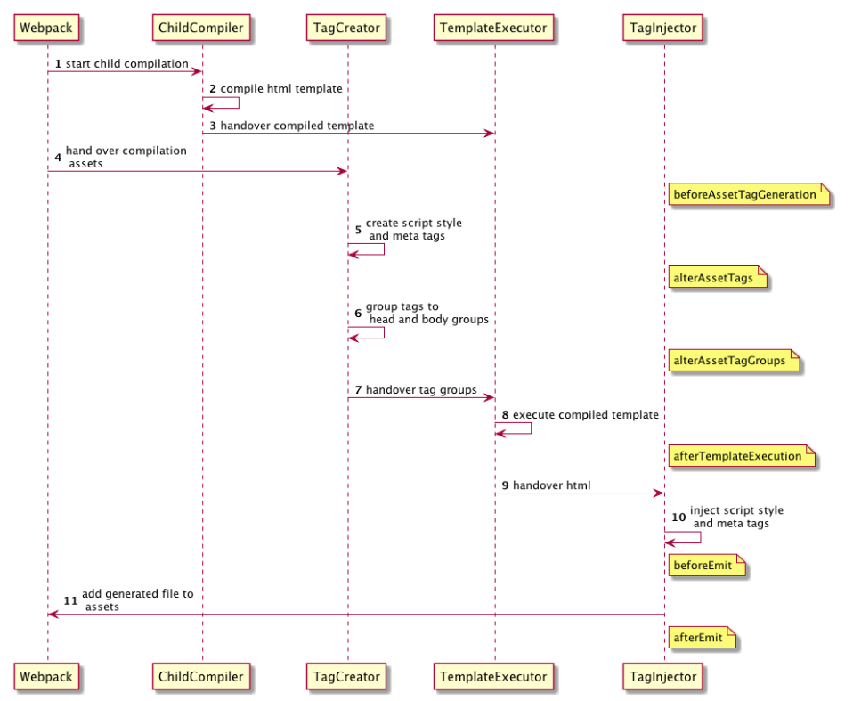

# html-webpack-plugin

这是一个[webpack](http://webpack.js.org/)插件，可以简化 HTML 文件的创建来为您的包提供服务`webpack`。这对于`webpack`文件名中包含哈希值的捆绑包特别有用，该哈希值会更改每个编译。

您可以让插件为您**生成 HTML 文件**、使用`lodash`模板提供您自己的模板或使用您自己的加载程序。

## API

### title*

用于生成的 HTML 文档的标题

> ```js
> plugins: [
>   new HtmlWebpackPlugin({
>     title: 'Custom template',
>     // Load a custom template (lodash by default)
>     template: 'index.html'
>   })
> ]
> ```
>
> 然后在html引入变量
>
> ```jsx | pure
> <!DOCTYPE html>
> <html>
>   <head>
>     <meta charset="utf-8"/>
>     <title><%= htmlWebpackPlugin.options.title %></title>
>   </head>
>   <body>
>   </body>
> </html>
> ```

### filename*

要写入 HTML 的**文件名**。默认为`index.html`。 

可以在此处指定**目录**（例如`assets/admin.html`）。

> 占位`[name]`符将替换为条目名称。也可以是一个函数，例如`(entryName) => entryName + '.html'`.

```js
filename = 'index.html'
```

### template*

`webpack`模板的相对或绝对路径。

>  更多，请参阅[文档](https://github.com/jantimon/html-webpack-plugin/blob/master/docs/template-option.md)了解详细信息。

```js
template = ''
```

### templateContent

可以用来代替`template`提供内联模板 - 请阅读[编写您自己的模板](https://github.com/jantimon/html-webpack-plugin#writing-your-own-templates)部分

### templateParameters*

允许覆盖模板中使用的**参数**

> ```js
>   plugins: [
>     new HtmlWebpackPlugin({
>       // 如果传递一个普通对象，它将与默认值合并
>       // 第4版新增功能
>       templateParameters: {
>         'foo': 'bar'
>       },
>       template: 'index.ejs'
>     })
>   ]
> ```
>
> ```jsx | pure
> <!DOCTYPE html>
> <html>
>   <head>
>     <meta charset="utf-8">
>     <title><%= foo %></title>
>   </head>
>   <body>
>   </body>
> </html>
> ```

### inject

将 script 标签**注入**到`template`或`templateContent`的什么**位置**。输入值有 `true || 'head' || 'body' || false`。

`'body'`所有 javascript 资源将被放置在 body 元素的底部。

`'head'`将把脚本放在 head 元素中。

`true` 根据 scriptLoading 属性自动选择 `'body'` 或者 `'head'`。

`false`将禁用自动注射。

```js
inject = true
```

### publicPath

用于脚本和链接标签的 publicPath

```js
publicPath = 'auto'
```

### scriptLoading

现代浏览器支持非阻塞 JavaScript 加载 ( `'defer'`) 以提高页面启动性能。设置为`'module'`添加属性[`type="module"`](https://developer.mozilla.org/en-US/docs/Web/JavaScript/Guide/Modules#applying_the_module_to_your_html)。这也意味着“延迟”，因为模块会自动延迟。

可设置值：`'blocking'|'defer'|'module'`

```js
scriptLoading = 'defer'
```

### favicon*

将给定的**图标路径**添加到输出 HTML

### meta

允许注入 `meta` 标签。

> ```js
> meta: {viewport: 'width=device-width, initial-scale=1, shrink-to-fit=no'}
> ```

### base

注入[`base`](https://developer.mozilla.org/en-US/docs/Web/HTML/Element/base)标签。例如`base: "https://example.com/path/page.html`

### minify*

将使用 [html-minifier-terser](https://github.com/DanielRuf/html-minifier-terser) 进行压缩优化 template 模板。

如果该`minify`选项设置为`true` 时。其设置值如下

```js
{
  collapseWhitespace: true, // 折叠文档树中构成文本节点的空白区域
  keepClosingSlash: true, // 在单例元素上保留尾部斜杠
  removeComments: true, // 删除注释
  removeRedundantAttributes: true, // 当值与默认值匹配时删除属性。
  removeScriptTypeAttributes: true, // `type="text/javascript"`从标签中删除`script`。其他`type`属性值保持不变
  removeStyleLinkTypeAttributes: true, // `type="text/css"`从`style`和标签中删除`link`。其他`type`属性值保持不变
  useShortDoctype: true // 将替换`doctype`为短 (HTML5) 文档类型
}
```

推荐的一个配置，用于删除所有空白与注释

```js
 {
    html5: true, // 根据 HTML5 规范解析输入
    collapseWhitespace: true, // 折叠文档树中构成文本节点的空白区域
    removeComments: true, // 删除注释
    removeTagWhitespace: true, // 尽可能删除属性之间的空格。请注意，这将导致 HTML 无效！
    removeEmptyAttributes: true, // removeEmptyAttributes
    removeRedundantAttributes: true,
    removeStyleLinkTypeAttributes: true,
    removeScriptTypeAttributes:true,
  }
```

更多API如下：

| 选项                            | 描述                                                         | 默认                                                      |
| ------------------------------- | ------------------------------------------------------------ | --------------------------------------------------------- |
| `caseSensitive`                 | 以区分大小写的方式处理属性（对于自定义 HTML 标记很有用）     | `false`                                                   |
| `collapseBooleanAttributes`     | [省略布尔属性中的属性值](http://perfectionkills.com/experimenting-with-html-minifier#collapse_boolean_attributes) | `false`                                                   |
| `collapseInlineTagWhitespace`   | `display:inline;`折叠时不要在元素之间留下任何空格。必须与`collapseWhitespace=true` | `false`                                                   |
| `collapseWhitespace`            | [折叠文档树中构成文本节点的空白区域](http://perfectionkills.com/experimenting-with-html-minifier#collapse_whitespace) | `false`                                                   |
| `conservativeCollapse`          | 始终折叠到 1 个空格（切勿将其完全删除）。必须与`collapseWhitespace=true` | `false`                                                   |
| `continueOnParseError`          | [处理解析错误](https://html.spec.whatwg.org/multipage/parsing.html#parse-errors)而不是中止。 | `false`                                                   |
| `customAttrAssign`              | 允许支持自定义属性分配表达式的正则表达式数组（例如`'<div flex?="{{mode != cover}}"></div>'`） | `[ ]`                                                     |
| `customAttrCollapse`            | 指定自定义属性以从中去除换行符的正则表达式（例如`/ng-class/`） |                                                           |
| `customAttrSurround`            | 允许支持自定义属性包围表达式的正则表达式数组（例如`<input {{#if value}}checked="checked"{{/if}}>`） | `[ ]`                                                     |
| `customEventAttributes`         | 允许支持自定义事件属性的正则表达式数组`minifyJS`（例如`ng-click`） | `[ /^on[a-z]{3,}$/ ]`                                     |
| `decodeEntities`                | 尽可能使用直接 Unicode 字符                                  | `false`                                                   |
| `html5`                         | 根据 HTML5 规范解析输入                                      | `true`                                                    |
| `ignoreCustomComments`          | 匹配时允许忽略某些注释的正则表达式数组                       | `[ /^!/, /^\s*#/ ]`                                       |
| `ignoreCustomFragments`         | 允许在匹配时忽略某些片段的正则表达式数组（例如`<?php ... ?>`、`{{ ... }}`等） | `[ /<%[\s\S]*?%>/, /<\?[\s\S]*?\?>/ ]`                    |
| `includeAutoGeneratedTags`      | 插入由 HTML 解析器生成的标签                                 | `true`                                                    |
| `keepClosingSlash`              | 在单例元素上保留尾部斜杠                                     | `false`                                                   |
| `maxLineLength`                 | 指定最大线长度。压缩输出将在有效的 HTML 分割点处按换行符分割 |                                                           |
| `minifyCSS`                     | 缩小样式元素和样式属性中的 CSS（使用[clean-css](https://github.com/jakubpawlowicz/clean-css)） | `false`（可能`true`，`Object`，`Function(text, type)`）   |
| `minifyJS`                      | 缩小脚本元素和事件属性中的 JavaScript（使用[Terser](https://github.com/terser/terser)） | `false`（可能`true`，`Object`，`Function(text, inline)`） |
| `minifyURLs`                    | 缩小各种属性中的 URL（使用[relatedurl](https://github.com/stevenvachon/relateurl)） | `false`（可能`String`，`Object`，`Function(text)`）       |
| `noNewlinesBeforeTagClose`      | 切勿在关闭元素的标签之前添加换行符                           | `false`                                                   |
| `preserveLineBreaks`            | 当标签之间的空白包含换行符时，始终折叠到 1 个换行符（切勿将其完全删除）。必须与`collapseWhitespace=true` | `false`                                                   |
| `preventAttributesEscaping`     | 防止属性值转义                                               | `false`                                                   |
| `processConditionalComments`    | 通过 minifier 处理条件注释的内容                             | `false`                                                   |
| `processScripts`                | 与要通过压缩器处理的脚本元素类型相对应的字符串数组（例如`text/ng-template`、`text/x-handlebars-template`等） | `[ ]`                                                     |
| `quoteCharacter`                | 用于属性值的引号类型（' 或 "）                               |                                                           |
| `removeAttributeQuotes`         | [尽可能删除属性周围的引号](http://perfectionkills.com/experimenting-with-html-minifier#remove_attribute_quotes) | `false`                                                   |
| `removeComments`                | [去除 HTML 注释](http://perfectionkills.com/experimenting-with-html-minifier#remove_comments) | `false`                                                   |
| `removeEmptyAttributes`         | [删除所有仅包含空格值的属性](http://perfectionkills.com/experimenting-with-html-minifier#remove_empty_or_blank_attributes) | `false`（可能`true`，`Function(attrName, tag)`）          |
| `removeEmptyElements`           | [删除所有内容为空的元素](http://perfectionkills.com/experimenting-with-html-minifier#remove_empty_elements) | `false`                                                   |
| `removeOptionalTags`            | [删除可选标签](http://perfectionkills.com/experimenting-with-html-minifier#remove_optional_tags) | `false`                                                   |
| `removeRedundantAttributes`     | [当值与默认值匹配时删除属性。](http://perfectionkills.com/experimenting-with-html-minifier#remove_redundant_attributes) | `false`                                                   |
| `removeScriptTypeAttributes`    | `type="text/javascript"`从标签中删除`script`。其他`type`属性值保持不变 | `false`                                                   |
| `removeStyleLinkTypeAttributes` | `type="text/css"`从`style`和标签中删除`link`。其他`type`属性值保持不变 | `false`                                                   |
| `removeTagWhitespace`           | 尽可能删除属性之间的空格。**请注意，这将导致 HTML 无效！**   | `false`                                                   |
| `sortAttributes`                | [按频率对属性进行排序](https://github.com/terser/html-minifier-terser#sorting-attributes--style-classes) | `false`                                                   |
| `sortClassName`                 | [按频率对风格类别进行排序](https://github.com/terser/html-minifier-terser#sorting-attributes--style-classes) | `false`                                                   |
| `trimCustomFragments`           | 修剪周围的空白`ignoreCustomFragments`。                      | `false`                                                   |
| `useShortDoctype`               | [将 替换`doctype`为短 (HTML5) 文档类型](http://perfectionkills.com/experimenting-with-html-minifier#use_short_doctype) | `false`                                                   |


## 表达式

模板中，使用 `<%= htmlWebpackPlugin.options.…… %>` 表达式，可以引入 webpack 中 options 配置的变量。

也可以使用 templateParameters 属性传入参数。例如

```js
templateParameters: {'foo': 'bar'},
// 使用
<%= foo %>
```

## event

webpack-plugin-HTML 允许其他 plugin 更改 HTML，下边是对应各个周期的 hooks。



### **beforeAssetTagGeneration**

执行时机： 在 ChildCompiler 开始编译HTML模板之前。

作用： 允许对资源标签（如script、style、meta等）进行生成之前的定制操作。

### **alterAssetTags**

执行时机： 在**资源标签生成**之后，但在对它们进行**分组之前**。

作用**：** 允许对生成的资源标签进行**修改**，可以**添加**、**删除**或修改标签。

### **alterAssetTagGroups**

执行时机：在将资源标签**分组到 `<head>` 和 `<body>` 组之前**。

作用： 允许对资源标签进行分组的定制操作，可以**改变**标签的**组织方式**。

### **afterTemplateExecution**

执行时机：在 **TemplateExecutor** 执行**编译后**的模板之后。

作用：允许在生成HTML之前执行一些额外的操作，可以**修改模板执行的结果**。

### **beforeEmit**

执行时机： 在最终的**HTML**文件**输出之前**。

作用：允许在HTML文件输出之前进行最后的修改，可以在文件输出之前注入或修改内容。

### **afterEmit**

执行时机：在**HTML**文件**输出之后**。

作用：允许在HTML文件输出之后执行一些操作，例如清理临时文件等。


**备注**

github：https://github.com/jantimon/html-webpack-plugin/tree/main
