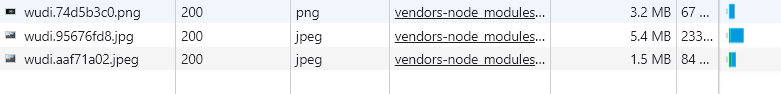
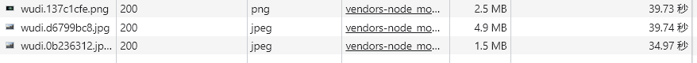
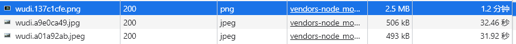

# plugin

## image-minimizer-webpack-plugin

Webpack 的插件和加载器，用于**使用 imagemin 优化（压缩）所有图片**。不用担心图片的大小，现在它们**总是**被优化/压缩了。

**文档详情**：https://github.com/webpack-contrib/image-minimizer-webpack-plugin

### 使用

**安装 plugin**

```bash
npm install image-minimizer-webpack-plugin imagemin
```

**推荐用于无损优化的 imagemin 插件**

```bash
npm install imagemin-gifsicle imagemin-jpegtran imagemin-optipng imagemin-svgo --save-dev
```

**推荐用于有损优化的 imagemin 插件**

```bash
npm install imagemin-gifsicle imagemin-mozjpeg imagemin-pngquant imagemin-svgo --save-dev
```

> 报错：C:\WINDOWS\system32\cmd.exe /s /c“autoreconf -ivf”，解决方案使用淘宝镜像 `--registry=https://registry.npm.taobao.org  `。

**无损优化常用案例**

```js
optimization: {
  minimize: true,
  minimizer: [
    …… // 注意，设置 TerserPlugin 等其他插件，放于 ImageMinimizerPlugin 前边位置。
    new ImageMinimizerPlugin({
      minimizer:{
        implementation: ImageMinimizerPlugin.imageminMinify,
        options: {
		  //带有自定义选项的无损优化
		  //您可以随意尝试各种选项，以获得更好的结果
          plugins: [
            ["gifsicle", { interlaced: true }],
            // ["jpegtran", { progressive: true }],
            ["mozjpeg", { progressive: true, quality: 65 }],
            ["optipng", { optimizationLevel: 5 }],
            // Svgo configuration here https://github.com/svg/svgo#configuration
            [
              "svgo",
              {
                plugins: extendDefaultPlugins([
                  {
                    name: "removeViewBox",
                    active: false,
                  },
                  {
                    name: "addAttributesToSVGElement",
                    params: {
                      attributes: [{ xmlns: "http://www.w3.org/2000/svg" }],
                    },
                  },
                ]),
              },
            ],
          ],
        },
      }
    })
  ],
},
```

**打包结果**

默认图片大小



打包后图片大小



由 imagemin-jpegtran 换为 imagemin-mozjpeg 后，由无损压缩变为有损压缩。jpg进一步减小。



### 策略

`imageminGenerate` 和 `imageminMinify`，它们在处理图片时采取不同的策略。

`imageminMinify` 方法是用来**压缩**图片的。插件会使用 `imagemin` 和其相关的插件来压缩图像。

`imageminGenerate` 方法用于**生成新的图像格式**，例如，它可以将标准的 JPEG 或 PNG 图像转换为 WebP 格式。

> 使用 imageminGenerate 案例：[优化并生成`webp`图像](https://github.com/webpack-contrib/image-minimizer-webpack-plugin#optimize-and-generate-webp-images)
>
> ```js
> const ImageMinimizerPlugin = require("image-minimizer-webpack-plugin");
> 
> module.exports = {
> optimization: {
>  minimizer: [
>    "...",
>    new ImageMinimizerPlugin({
>      minimizer: {
>        implementation: ImageMinimizerPlugin.imageminMinify,
>        options: {
>          plugins: [
>            "imagemin-gifsicle",
>            "imagemin-mozjpeg",
>            "imagemin-pngquant",
>            "imagemin-svgo",
>          ],
>        },
>      },
>      generator: [
>        {
>          // You can apply generator using `?as=webp`, you can use any name and provide more options
>          preset: "webp",
>          implementation: ImageMinimizerPlugin.imageminGenerate,
>          options: {
>            plugins: ["imagemin-webp"],
>          },
>        },
>      ],
>    }),
>  ],
> },
> };
> ```

### **api**

#### [`filter`](https://github.com/webpack-contrib/image-minimizer-webpack-plugin#filter)

允许过滤图像以进行优化/生成。返回`true`优化图像。

例子：[根据尺寸优化图像](https://github.com/webpack-contrib/image-minimizer-webpack-plugin#optimize-images-based-on-size)，根据图像大小使用差异选项（例如`progressive`/ `interlaced`/ 等）（例如 - 不要对小图像进行渐进变换）。

> 什么是`progressive`形象？[`Answer here`](https://jmperezperez.com/medium-image-progressive-loading-placeholder/)。

```js
const ImageMinimizerPlugin = require("image-minimizer-webpack-plugin");

module.exports = {
  optimization: {
    minimizer: [
      new ImageMinimizerPlugin({
        minimizer: {
          implementation: ImageMinimizerPlugin.imageminMinify,
          options: {
            plugins: [["jpegtran", { progressive: true }]],
          },
          // Only apply this one to files equal to or over 8192 bytes
          filter: (source) => {
            if (source.byteLength >= 8192) {
              return true;
            }

            return false;
          },
        },
      }),
      new ImageMinimizerPlugin({
        minimizer: {
          implementation: ImageMinimizerPlugin.imageminMinify,
          options: {
            plugins: [["jpegtran", { progressive: false }]],
          },
          // Only apply this one to files under 8192
          filter: (source) => {
            if (source.byteLength < 8192) {
              return true;
            }

            return false;
          },
        },
      }),
    ],
  },
};
```

#### [`filename`](https://github.com/webpack-contrib/image-minimizer-webpack-plugin#filename)

允许设置文件名。例如

```js
const ImageMinimizerPlugin = require("image-minimizer-webpack-plugin");

module.exports = {
  optimization: {
    minimizer: [
      "...",
      new ImageMinimizerPlugin({
        minimizer: {
          filename: "optimized-[name][ext]", // ext 为扩展名，例如：.jpg
          implementation: ImageMinimizerPlugin.squooshMinify,
          // Options
          options: {
            encodeOptions: {
              mozjpeg: {
                quality: 90,
              },
            },
          },
        },
      }),
    ],
  },
};
```

#### type

 `ImageMinimizerPlugin` 的 `type` 属性允许你指定优化器（generator）应该在何种情况下被应用。默认情况下，当使用 `import` 或 `require` 语句引入图片时，优化器就会被触发。但在某些情况下，可能需要对由其他插件引入的图片进行优化，例如使用 `copy-webpack-plugin` 插件复制到输出目录的图片。

在这种情况下，如果你希望 `ImageMinimizerPlugin` 对这些被复制的图片也进行优化，你需要将 `type` 选项设置为 `asset`。这样配置后，`ImageMinimizerPlugin` 就会对编译过程中的所有资产（包括那些被复制的资产）应用图片生成器，生成新的优化过的图片版本。

通常用于 imageminGenerate。

```js
const CopyPlugin = require("copy-webpack-plugin");
const ImageMinimizerPlugin = require("image-minimizer-webpack-plugin");

module.exports = {
  optimization: {
    minimizer: [
      "...",
      new ImageMinimizerPlugin({
        minimizer: {
          implementation: ImageMinimizerPlugin.imageminMinify,
          options: {
            plugins: [
              "imagemin-gifsicle",
              "imagemin-mozjpeg",
              "imagemin-pngquant",
              "imagemin-svgo",
            ],
          },
        },
        generator: [
          {
            // Apply generator for copied assets
            type: "asset",
            // You can use `ImageMinimizerPlugin.squooshGenerate`
            // You can use `ImageMinimizerPlugin.sharpGenerate`
            implementation: ImageMinimizerPlugin.imageminGenerate,
            options: {
              plugins: ["imagemin-webp"],
            },
          },
        ],
      }),
    ],
  },
  plugins: [new CopyPlugin({ patterns: ["images/**/*.png"] })],
};
```

#### [`preset`](https://github.com/webpack-contrib/image-minimizer-webpack-plugin#preset)

配置预设的名称，允许后缀名添加 `?as=name`。

例如添加 as=webp 后缀名，允许该文件（`image.png`）转化为 webp

```js
const myImage4 = new URL("image.png?as=webp&w=150&h=120", import.meta.url);
```

```js
const ImageMinimizerPlugin = require("image-minimizer-webpack-plugin");

module.exports = {
  optimization: {
    minimizer: [
      "...",
      new ImageMinimizerPlugin({
        generator: [
          {
            preset: "webp",
            // Implementation
            implementation: ImageMinimizerPlugin.squooshMinify,
          },
        ],
      }),
    ],
  },
};
```

# 
