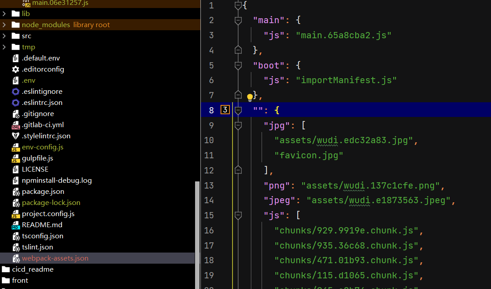

# plugin

## mini-css-extract-plugin

本插件会将 CSS 提取到单独的文件中，为每个包含 CSS 的 JS 文件创建一个 CSS 文件，并且支持 CSS 和 SourceMaps 的按需加载。

> 本插件基于 webpack v5 的新特性构建，并且需要 webpack 5 才能正常工作。
>
> 与 extract-text-webpack-plugin 相比：
>
> - 异步加载
> - 没有重复的编译（性能）
> - 更容易使用
> - 特别针对 CSS 开发

### plugin API

#### `filename`

此选项决定了输出的每个 CSS 文件的名称。

机制类似于 [`output.filename`](https://webpack.docschina.org/configuration/output/#outputfilename)。

#### `chunkFilename`

> 将 `chunkFilename` 设置为 `function`，仅在 webpack@5 下可用。

此选项决定了非入口的 chunk 文件名称

机制类似于 [`output.chunkFilename`](https://webpack.docschina.org/configuration/output/#outputchunkfilename)

#### `ignoreOrder`

**移除 Order 警告**，Webpack 和 `mini-css-extract-plugin` 会检测 css import 时的导入顺序，不同模块使用的不同的导入顺序时，就会出现警告。

> ```css
> /* styleA.css */
> .example {
>   color: blue;
> }
> /* styleB.css */
> .example {
>   color: red;
> }
> ```
>
> ```js
> // index.js
> import './styleA.css';
> import './styleB.css';
> // 在另一个 JavaScript 模块中
> import './styleB.css';
> import './styleA.css';
> ```
>
> 不同模块顺序不同 .example 类最终的 color 会不同，就会出现警告。

#### `insert`

默认情况下，`mini-css-extract-plugin` 会将 styles（`<link>` 元素）附加到当前 `window` 的 `document.head` 中。类似 style-loader 的 inster 属性，只不过 mini-css-extract-plugin 插入的时 link 标签

**string**

允许设置自定义的 [query selector](https://developer.mozilla.org/en-US/docs/Web/API/Document/querySelector)。 新的 `<link>` 元素将被插入到找到的 item 之后。

```js
new MiniCssExtractPlugin({
  insert: "#some-element",
});
```

**Function**

允许覆盖默认行为，并在任意位置插入样式。

```js
new MiniCssExtractPlugin({
  insert: function (linkTag) {
    var reference = document.querySelector("#some-element");
    if (reference) {
      reference.parentNode.insertBefore(linkTag, reference);
    }
  },
});
```

#### `attributes`

把**指定的属性**和值附加到 **`<link>` 元素**上。

> ```js
> new MiniCssExtractPlugin({
>   attributes: {
>     id: "target",
>     "data-target": "example",
>   },
> }),
> ```

#### `linkType`

此选项运行使用自定义**链接类型**加载异步 chunk，例如 `<link type="text/css" ...>`。

```js
linkType = "text/css"
```

#### `runtime`

允许开启/禁用 runtime 生成。 CSS 仍将被提取，禁用时，可以自定义加载方法。

> 例如，你可以使用 [assets-webpack-plugin](https://github.com/ztoben/assets-webpack-plugin) 来检索它们，然后当需要时使用你自己的 runtime 代码下载静态资源。

```js
runtime = true
```

### loader API

#### `publicPath`

为 CSS 内的图片、文件等外部资源指定一个自定义的公共路径。 机制类似于 [`output.publicPath`](https://webpack.docschina.org/configuration/output/#outputpublicpath)。

> ```js
> const MiniCssExtractPlugin = require("mini-css-extract-plugin");
> 
> module.exports = {
>   plugins: [
>     new MiniCssExtractPlugin({
>       // 类似于 webpackOptions.output 中的选项
>       // 所有选项都是可选的
>       filename: '[name].css',
>       chunkFilename: '[id].css',
>     }),
>   ],
>   module: {
>     rules: [
>       {
>         test: /\.css$/,
>         use: [
>           {
>             loader: MiniCssExtractPlugin.loader,
>             options: {
>               publicPath: "/public/path/to/",
>             },
>           },
>           "css-loader",
>         ],
>       },
>     ],
>   },
> };
> ```

```js
// webpackOptions.output 选项中的 publicPath
publicPath = ……
```

#### `emit`

如果设置为 true，会发送一个文件（向文件系统中写入一个文件）。如果设置为 false，该插件将会提取 CSS 但是 **不会** 发送文件。 禁用该配置对服务侧的包比较有用。

```js
emit = true
```

#### `esModule`

默认情况下 `mini-css-extract-plugin` 将会生成使用 ES 模块语法的 JS 模块。在某些情况下，使用 ES 模块是有益的，比如：[module concatenation](https://webpack.docschina.org/plugins/module-concatenation-plugin/) 和 [tree shaking](https://webpack.docschina.org/guides/tree-shaking/)。


### 注意问题

#### 不会自动将 CSS 加载到页面中

当你在 webpack 的入口文件中直接导入 CSS，或者在初始（initial）chunk 中包含样式时，`mini-css-extract-plugin` 不会自动将这些 CSS 加载到页面中。

**解决方案**: 使用 `html-webpack-plugin`。这个插件可以帮助自动生成包含正确链接（`link` 标签）的 HTML 文件。**当你使用 `mini-css-extract-plugin` 从 JavaScript 文件中提取 CSS 后，`html-webpack-plugin` 会自动在生成的 HTML 文件中插入对应的 `link` 标签**，从而确保 CSS 被正确加载。

**示例**:

```js
javascriptCopy codeconst HtmlWebpackPlugin = require('html-webpack-plugin');

// webpack 配置
module.exports = {
  // ...其他配置...
  plugins: [
    new HtmlWebpackPlugin({
      template: './src/template.html' // 使用一个模板
    })
    // ...其他插件...
  ]
};
```

这样配置后，生成的 HTML 文件会包含对提取出来的 CSS 文件的引用。

Source Map 的配置

在使用 `mini-css-extract-plugin` 时，源码映射（source map）**只有在特定的 `devtool` 配置下才有效**。这是因为 CSS 只支持带有 `sourceMappingURL` 注释的 source map。

**解决方案**: 如果你的 `devtool` 配置**不是** `source-map`、`nosources-source-map`、`hidden-nosources-source-map` 或 `hidden-source-map`，

但你仍然需要生成 CSS 的 source map，可以在 `css-loader` 中设置 `sourceMap: true`。

**示例**:

```js
javascriptCopy code// webpack 配置
module.exports = {
  // ...其他配置...
  module: {
    rules: [
      {
        test: /\.css$/,
        use: [
          {
            loader: MiniCssExtractPlugin.loader,
            options: {
              // 其他选项...
            }
          },
          {
            loader: 'css-loader',
            options: {
              sourceMap: true, // 启用 sourceMap
            }
          }
        ]
      }
    ]
  },
  // 设置 devtool
  devtool: 'cheap-module-eval-source-map' // 一个不在上述列表中的 devtool 值
};
```

### 案例

#### 提取所有的 CSS 到一个文件中

用过使用 `optimization.splitChunks.cacheGroups` 选项，所有的 CSS 可以被提取到一个 CSS 文件中。

```js
const MiniCssExtractPlugin = require("mini-css-extract-plugin");

module.exports = {
  optimization: {
    splitChunks: {
      cacheGroups: {
        styles: {
          name: "styles",
          type: "css/mini-extract",
          chunks: "all",
          enforce: true,
        },
      },
    },
  },
  plugins: [
    new MiniCssExtractPlugin({
      filename: "[name].css",
    }),
  ],
  module: {
    rules: [
      {
        test: /\.css$/,
        use: [MiniCssExtractPlugin.loader, "css-loader"],
      },
    ],
  },
};
```

请注意在 webpack 5 中应该使用 `type` 而不是 `test`，否则将会生成 `.js` 文件而不是 `.css`。

这是因为 `test` 不知道应该去掉哪个模块（在这种情况下，它不会检测到 `.js` 应该被删除）。

## assets-webpack-plugin

Webpack 插件，在打包后生成一个json文件，里边存放打包后的文件（dist目录中的文件）对应路径的集合。

json 文件默认输出到**根目录**

### 输出示例

输出是一个 JSON 对象，格式如下：

```js
{
    "bundle_name": {
        "asset_kind": "/public/path/to/asset"
    }
}
```

其中：

- `"bundle_name"`是包的名称（webpack 配置中条目对象的键，如果条目是数组，则为“main”）。
- `"asset_kind"`是资源的驼峰式文件扩展名



### API

```js
 new AssetsPlugin({
    path: resolve(output), // 输出json的路径
    useCompilerPath: false, // path 属性是否被 webpack output 属性覆盖掉
    prettyPrint: true, // 格式化json文件
    removeFullPathAutoPrefix: true // 删除json中路径的 auto 前缀
 }),
```

注意：如果path 设置为 dist （打出包的路径），会被 output.clean 删除掉。


# Q&A

## mini-css-extract-plugin 和 css-minimizer-webpack-plugin 区别是什么

`mini-css-extract-plugin` 和 `css-minimizer-webpack-plugin` 都是在使用 Webpack 构建项目时常用的插件，但它们的功能和作用有所不同。

**mini-css-extract-plugin**

1. **功能**: 这个插件主要用于将 CSS 从 JavaScript 捆绑包中提取出来，创建独立的 CSS 文件。这对于使用诸如 CSS Modules 这样的技术时尤其有用。
2. 作用
   - **性能优化**: 通过创建独立的 CSS 文件，可以让浏览器并行下载 CSS 和 JavaScript，提高页面加载速度。
   - **缓存优化**: 独立的 CSS 文件可以被浏览器缓存，有助于减少未来请求的加载时间。
   - **代码组织**: 有助于代码分离和组织，使得结构更清晰。

**css-minimizer-webpack-plugin**

1. **功能**: 该插件用于压缩和优化最终生成的 CSS 文件。它利用了如 `cssnano` 这样的工具来减少 CSS 文件的大小。
2. 作用
   - **文件大小减少**: 通过移除空白、注释、重复的 CSS 规则等，减小文件体积。
   - **性能优化**: 缩小的文件大小可以加快页面加载速度。
   - **代码优化**: 有时还可以通过合并规则等方式进行代码优化。

**相互关系和使用场景**

- **配合使用**: 一般情况下，这两个插件会一起使用。首先使用 `mini-css-extract-plugin` 从 JavaScript 中提取 CSS，然后使用 `css-minimizer-webpack-plugin` 对提取出的 CSS 文件进行压缩和优化。
- **压缩与优化**: `mini-css-extract-plugin` 负责提取操作，而不进行压缩。`css-minimizer-webpack-plugin` 则专注于压缩和优化已提取的 CSS。

总的来说，这两个插件在现代前端开发中扮演着重要的角色，共同助力于代码分离、文件管理及性能优化。 

